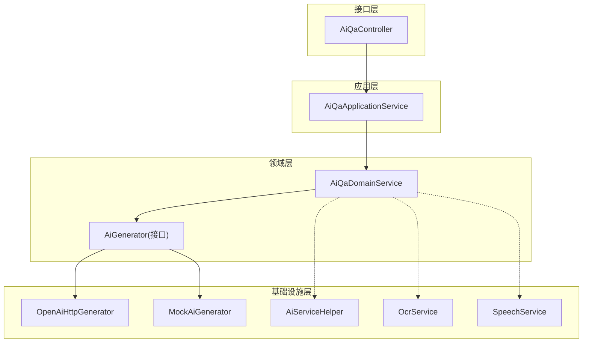
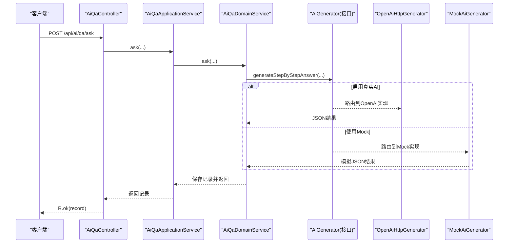
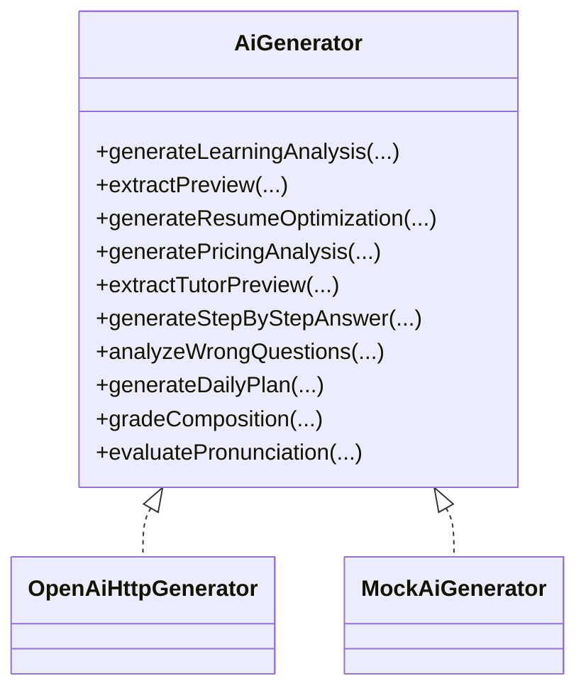
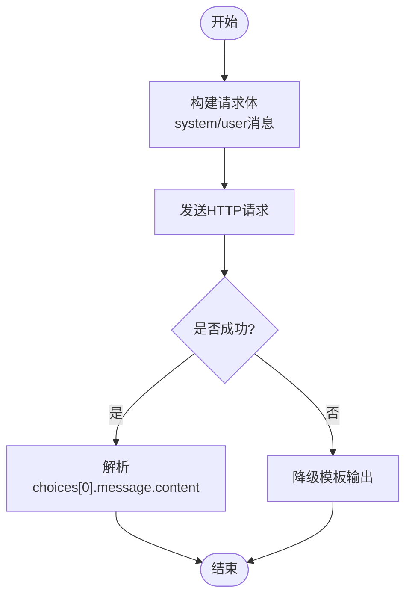
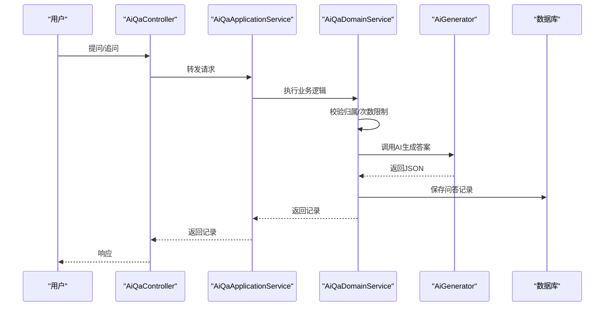
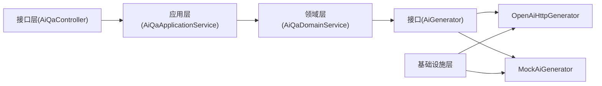

# AI服务集成架构

<cite>
**本文引用的文件**
- [AiGenerator.java](file://wzoto-backend/wzoto-domain/src/main/java/com/wzoto/domain/repository/AiGenerator.java)
- [OpenAiHttpGenerator.java](file://wzoto-backend/wzoto-infrastructure/src/main/java/com/wzoto/infrastructure/ai/OpenAiHttpGenerator.java)
- [MockAiGenerator.java](file://wzoto-backend/wzoto-infrastructure/src/main/java/com/wzoto/infrastructure/ai/MockAiGenerator.java)
- [AiServiceHelper.java](file://wzoto-backend/wzoto-infrastructure/src/main/java/com/wzoto/infrastructure/ai/AiServiceHelper.java)
- [OcrService.java](file://wzoto-backend/wzoto-infrastructure/src/main/java/com/wzoto/infrastructure/ai/OcrService.java)
- [SpeechService.java](file://wzoto-backend/wzoto-infrastructure/src/main/java/com/wzoto/infrastructure/ai/SpeechService.java)
- [AiQaDomainService.java](file://wzoto-backend/wzoto-domain/src/main/java/com/wzoto/domain/service/AiQaDomainService.java)
- [AiQaApplicationService.java](file://wzoto-backend/wzoto-application/src/main/java/com/wzoto/application/service/AiQaApplicationService.java)
- [AiQaController.java](file://wzoto-backend/wzoto-interfaces/src/main/java/com/wzoto/interfaces/controller/AiQaController.java)
- [application.yml](file://wzoto-backend/wzoto-interfaces/src/main/resources/application.yml)
- [JwtProperties.java](file://wzoto-backend/wzoto-infrastructure/src/main/java/com/wzoto/infrastructure/config/JwtProperties.java)
- [GlobalExceptionHandler.java](file://wzoto-backend/wzoto-interfaces/src/main/java/com/wzoto/interfaces/common/GlobalExceptionHandler.java)
</cite>

## 目录
1. [简介](#简介)
2. [项目结构](#项目结构)
3. [核心组件](#核心组件)
4. [架构总览](#架构总览)
5. [详细组件分析](#详细组件分析)
6. [依赖关系分析](#依赖关系分析)
7. [性能与成本](#性能与成本)
8. [故障排查指南](#故障排查指南)
9. [结论](#结论)
10. [附录：配置与环境变量](#附录配置与环境变量)

## 简介
本文件面向AI服务集成架构，围绕统一接口抽象、服务切换机制、插件化实现、OpenAI API集成、Mock服务、降级策略、配置管理、监控日志、成本控制与限流等方面，提供系统化说明。目标是帮助读者快速理解并安全扩展AI能力，同时保障稳定性与可观测性。

## 项目结构
本项目采用分层架构与领域驱动设计思想：
- 接口层（interfaces）：对外暴露REST API，负责参数校验、请求路由与响应封装。
- 应用层（application）：编排业务流程，协调领域服务与基础设施。
- 领域层（domain）：定义业务规则、实体、值对象与领域服务；通过“端口”（接口）解耦外部AI实现。
- 基础设施层（infrastructure）：实现具体AI调用（OpenAI兼容API）、Mock实现、OCR/语音等外部能力。

图表来源
- [AiQaController.java:1-51](file://wzoto-backend/wzoto-interfaces/src/main/java/com/wzoto/interfaces/controller/AiQaController.java#L1-L51)
- [AiQaApplicationService.java:1-43](file://wzoto-backend/wzoto-application/src/main/java/com/wzoto/application/service/AiQaApplicationService.java#L1-L43)
- [AiQaDomainService.java:1-106](file://wzoto-backend/wzoto-domain/src/main/java/com/wzoto/domain/service/AiQaDomainService.java#L1-L106)
- [AiGenerator.java:1-37](file://wzoto-backend/wzoto-domain/src/main/java/com/wzoto/domain/repository/AiGenerator.java#L1-L37)
- [OpenAiHttpGenerator.java:1-394](file://wzoto-backend/wzoto-infrastructure/src/main/java/com/wzoto/infrastructure/ai/OpenAiHttpGenerator.java#L1-L394)
- [MockAiGenerator.java:1-302](file://wzoto-backend/wzoto-infrastructure/src/main/java/com/wzoto/infrastructure/ai/MockAiGenerator.java#L1-L302)
- [AiServiceHelper.java:1-66](file://wzoto-backend/wzoto-infrastructure/src/main/java/com/wzoto/infrastructure/ai/AiServiceHelper.java#L1-L66)
- [OcrService.java:1-38](file://wzoto-backend/wzoto-infrastructure/src/main/java/com/wzoto/infrastructure/ai/OcrService.java#L1-L38)
- [SpeechService.java:1-39](file://wzoto-backend/wzoto-infrastructure/src/main/java/com/wzoto/infrastructure/ai/SpeechService.java#L1-L39)

章节来源
- [application.yml:1-51](file://wzoto-backend/wzoto-interfaces/src/main/resources/application.yml#L1-L51)

## 核心组件
- 统一接口定义（AiGenerator）：在领域层定义AI生成器接口，屏蔽底层实现差异，便于替换与扩展。
- 服务切换机制：基于Spring条件装配，根据配置开关选择真实OpenAI或Mock实现，实现零侵入切换。
- 插件化架构：新增AI能力只需实现AiGenerator接口并通过条件装配注册，无需改动上层业务。
- OpenAI集成：使用OkHttp直接发起HTTP请求，支持任意OpenAI兼容接口；包含请求封装、响应解析、错误处理与降级。
- Mock服务：开发环境默认启用，提供结构化模拟数据，便于联调与测试。
- 辅助工具：AiServiceHelper提供重试、每日限额检查、JSON字段提取等通用能力。
- 周边能力：OcrService与SpeechService预留OCR与语音评测能力，当前为Mock实现，便于后续接入第三方服务。

章节来源
- [AiGenerator.java:1-37](file://wzoto-backend/wzoto-domain/src/main/java/com/wzoto/domain/repository/AiGenerator.java#L1-L37)
- [OpenAiHttpGenerator.java:1-394](file://wzoto-backend/wzoto-infrastructure/src/main/java/com/wzoto/infrastructure/ai/OpenAiHttpGenerator.java#L1-L394)
- [MockAiGenerator.java:1-302](file://wzoto-backend/wzoto-infrastructure/src/main/java/com/wzoto/infrastructure/ai/MockAiGenerator.java#L1-L302)
- [AiServiceHelper.java:1-66](file://wzoto-backend/wzoto-infrastructure/src/main/java/com/wzoto/infrastructure/ai/AiServiceHelper.java#L1-L66)
- [OcrService.java:1-38](file://wzoto-backend/wzoto-infrastructure/src/main/java/com/wzoto/infrastructure/ai/OcrService.java#L1-L38)
- [SpeechService.java:1-39](file://wzoto-backend/wzoto-infrastructure/src/main/java/com/wzoto/infrastructure/ai/SpeechService.java#L1-L39)

## 架构总览
下图展示从控制器到领域服务再到AI实现的完整调用链，以及Mock与真实实现的切换逻辑。

图表来源
- [AiQaController.java:1-51](file://wzoto-backend/wzoto-interfaces/src/main/java/com/wzoto/interfaces/controller/AiQaController.java#L1-L51)
- [AiQaApplicationService.java:1-43](file://wzoto-backend/wzoto-application/src/main/java/com/wzoto/application/service/AiQaApplicationService.java#L1-L43)
- [AiQaDomainService.java:1-106](file://wzoto-backend/wzoto-domain/src/main/java/com/wzoto/domain/service/AiQaDomainService.java#L1-L106)
- [OpenAiHttpGenerator.java:1-394](file://wzoto-backend/wzoto-infrastructure/src/main/java/com/wzoto/infrastructure/ai/OpenAiHttpGenerator.java#L1-L394)
- [MockAiGenerator.java:1-302](file://wzoto-backend/wzoto-infrastructure/src/main/java/com/wzoto/infrastructure/ai/MockAiGenerator.java#L1-L302)

## 详细组件分析

### 统一接口与插件化实现
- AiGenerator定义了学情报告、简历优化、定价分析、启发式答疑、错题分析、学习计划、作文批改、口语评测等能力。
- OpenAiHttpGenerator与MockAiGenerator分别实现该接口，通过Spring条件注解按配置自动装配，实现运行时无缝切换。
- 新增AI能力时，仅需在AiGenerator中声明方法并提供至少一个实现类，即可被领域服务透明调用。

图表来源
- [AiGenerator.java:1-37](file://wzoto-backend/wzoto-domain/src/main/java/com/wzoto/domain/repository/AiGenerator.java#L1-L37)
- [OpenAiHttpGenerator.java:1-394](file://wzoto-backend/wzoto-infrastructure/src/main/java/com/wzoto/infrastructure/ai/OpenAiHttpGenerator.java#L1-L394)
- [MockAiGenerator.java:1-302](file://wzoto-backend/wzoto-infrastructure/src/main/java/com/wzoto/infrastructure/ai/MockAiGenerator.java#L1-L302)

章节来源
- [AiGenerator.java:1-37](file://wzoto-backend/wzoto-domain/src/main/java/com/wzoto/domain/repository/AiGenerator.java#L1-L37)
- [OpenAiHttpGenerator.java:1-394](file://wzoto-backend/wzoto-infrastructure/src/main/java/com/wzoto/infrastructure/ai/OpenAiHttpGenerator.java#L1-L394)
- [MockAiGenerator.java:1-302](file://wzoto-backend/wzoto-infrastructure/src/main/java/com/wzoto/infrastructure/ai/MockAiGenerator.java#L1-L302)

### OpenAI API集成
- 配置注入：通过application.yml的wzoto.ai.*键注入base-url、api-key、model、temperature等参数。
- 请求封装：构造系统提示与用户提示，组装messages数组，以application/json发送POST至/v1/chat/completions。
- 响应解析：从choices[0].message.content提取内容；失败时记录状态码与响应体。
- 错误处理与降级：异常或HTTP非成功时，回退到本地降级模板，保证可用性。
- 多场景复用：学情报告、简历优化、定价分析、分步解题、错题分析、学习计划、作文批改、口语评测均复用同一HTTP调用路径。

图表来源
- [OpenAiHttpGenerator.java:75-118](file://wzoto-backend/wzoto-infrastructure/src/main/java/com/wzoto/infrastructure/ai/OpenAiHttpGenerator.java#L75-L118)
- [OpenAiHttpGenerator.java:284-310](file://wzoto-backend/wzoto-infrastructure/src/main/java/com/wzoto/infrastructure/ai/OpenAiHttpGenerator.java#L284-L310)
- [application.yml:39-46](file://wzoto-backend/wzoto-interfaces/src/main/resources/application.yml#L39-L46)

章节来源
- [OpenAiHttpGenerator.java:1-394](file://wzoto-backend/wzoto-infrastructure/src/main/java/com/wzoto/infrastructure/ai/OpenAiHttpGenerator.java#L1-L394)
- [application.yml:39-46](file://wzoto-backend/wzoto-interfaces/src/main/resources/application.yml#L39-L46)

### Mock服务机制
- 默认启用：当未显式开启AI开关时，自动装配Mock实现，便于开发与测试。
- 数据结构化：所有方法返回符合约定结构的JSON字符串，便于前端解析与展示。
- 功能验证：覆盖学情报告、简历优化、定价分析、分步答疑、错题分析、学习计划、作文批改、口语评测等场景。

章节来源
- [MockAiGenerator.java:1-302](file://wzoto-backend/wzoto-infrastructure/src/main/java/com/wzoto/infrastructure/ai/MockAiGenerator.java#L1-L302)
- [application.yml:39-46](file://wzoto-backend/wzoto-interfaces/src/main/resources/application.yml#L39-L46)

### 服务降级策略
- 主服务失败：OpenAI调用异常或HTTP错误时，降级为本地模板输出，确保接口可用。
- 缓存策略：可在AiServiceHelper基础上结合Redis对高频请求进行缓存（例如学情报告摘要），减少重复调用。
- 离线模式：关闭AI开关后，全部走Mock实现，适合无网络或离线演示场景。

章节来源
- [OpenAiHttpGenerator.java:110-118](file://wzoto-backend/wzoto-infrastructure/src/main/java/com/wzoto/infrastructure/ai/OpenAiHttpGenerator.java#L110-L118)
- [OpenAiHttpGenerator.java:199-203](file://wzoto-backend/wzoto-infrastructure/src/main/java/com/wzoto/infrastructure/ai/OpenAiHttpGenerator.java#L199-L203)
- [OpenAiHttpGenerator.java:251-255](file://wzoto-backend/wzoto-infrastructure/src/main/java/com/wzoto/infrastructure/ai/OpenAiHttpGenerator.java#L251-L255)
- [application.yml:39-46](file://wzoto-backend/wzoto-interfaces/src/main/resources/application.yml#L39-L46)

### 控制面与数据流
- 控制器接收请求，应用服务编排流程，领域服务执行业务规则并调用AI接口。
- 对话与会话续问：AiQaDomainService维护会话ID，支持追问与历史记录查询。
- 权限校验：通过父ID与子女档案归属校验，防止越权访问。

图表来源
- [AiQaController.java:1-51](file://wzoto-backend/wzoto-interfaces/src/main/java/com/wzoto/interfaces/controller/AiQaController.java#L1-L51)
- [AiQaApplicationService.java:1-43](file://wzoto-backend/wzoto-application/src/main/java/com/wzoto/application/service/AiQaApplicationService.java#L1-L43)
- [AiQaDomainService.java:1-106](file://wzoto-backend/wzoto-domain/src/main/java/com/wzoto/domain/service/AiQaDomainService.java#L1-L106)

章节来源
- [AiQaController.java:1-51](file://wzoto-backend/wzoto-interfaces/src/main/java/com/wzoto/interfaces/controller/AiQaController.java#L1-L51)
- [AiQaApplicationService.java:1-43](file://wzoto-backend/wzoto-application/src/main/java/com/wzoto/application/service/AiQaApplicationService.java#L1-L43)
- [AiQaDomainService.java:1-106](file://wzoto-backend/wzoto-domain/src/main/java/com/wzoto/domain/service/AiQaDomainService.java#L1-L106)

## 依赖关系分析
- 领域层仅依赖AiGenerator接口，不感知具体实现，保持高内聚低耦合。
- 基础设施层通过条件装配选择OpenAI或Mock实现，避免硬编码分支。
- 应用层与领域层通过清晰的服务边界协作，职责单一。

图表来源
- [AiQaDomainService.java:1-106](file://wzoto-backend/wzoto-domain/src/main/java/com/wzoto/domain/service/AiQaDomainService.java#L1-L106)
- [AiGenerator.java:1-37](file://wzoto-backend/wzoto-domain/src/main/java/com/wzoto/domain/repository/AiGenerator.java#L1-L37)
- [OpenAiHttpGenerator.java:1-394](file://wzoto-backend/wzoto-infrastructure/src/main/java/com/wzoto/infrastructure/ai/OpenAiHttpGenerator.java#L1-L394)
- [MockAiGenerator.java:1-302](file://wzoto-backend/wzoto-infrastructure/src/main/java/com/wzoto/infrastructure/ai/MockAiGenerator.java#L1-L302)
- [AiQaApplicationService.java:1-43](file://wzoto-backend/wzoto-application/src/main/java/com/wzoto/application/service/AiQaApplicationService.java#L1-L43)
- [AiQaController.java:1-51](file://wzoto-backend/wzoto-interfaces/src/main/java/com/wzoto/interfaces/controller/AiQaController.java#L1-L51)

章节来源
- [AiQaDomainService.java:1-106](file://wzoto-backend/wzoto-domain/src/main/java/com/wzoto/domain/service/AiQaDomainService.java#L1-L106)
- [AiGenerator.java:1-37](file://wzoto-backend/wzoto-domain/src/main/java/com/wzoto/domain/repository/AiGenerator.java#L1-L37)

## 性能与成本
- 超时与重试：
  - HTTP客户端设置连接与读取超时，避免长时间阻塞。
  - 提供带重试能力的通用调用封装，可按需扩展指数退避策略。
- 限流与配额：
  - 免费用户每日答疑次数限制，保护后端资源。
  - 提供每日调用次数检查工具，可扩展至全局限流。
- 成本与计费：
  - 通过模型与温度参数控制输出质量与成本。
  - 建议在生产环境引入用量统计与告警，按租户/用户维度计量。
- 缓存与离线：
  - 对热点问题与报告摘要进行缓存，降低重复调用。
  - 关闭AI开关进入Mock模式，适用于离线演示与低成本测试。

章节来源
- [OpenAiHttpGenerator.java:70-73](file://wzoto-backend/wzoto-infrastructure/src/main/java/com/wzoto/infrastructure/ai/OpenAiHttpGenerator.java#L70-L73)
- [AiServiceHelper.java:14-43](file://wzoto-backend/wzoto-infrastructure/src/main/java/com/wzoto/infrastructure/ai/AiServiceHelper.java#L14-L43)
- [AiQaDomainService.java:29-43](file://wzoto-backend/wzoto-domain/src/main/java/com/wzoto/domain/service/AiQaDomainService.java#L29-L43)
- [application.yml:39-46](file://wzoto-backend/wzoto-interfaces/src/main/resources/application.yml#L39-L46)

## 故障排查指南
- 常见问题定位：
  - 无法调用AI：检查wzoto.ai.enabled是否为true，确认base-url与api-key已正确配置。
  - 返回降级内容：查看日志中的HTTP状态码与响应体，确认上游服务可用性。
  - 免费次数用尽：检查当日调用计数，或提升会员权益。
- 全局异常处理：
  - 参数校验失败、非法参数、业务规则违反等异常统一由全局处理器捕获并返回标准格式。
- 日志与追踪：
  - 关键节点记录入参、耗时与结果摘要，便于问题复现与性能分析。
  - 建议在AI调用前后增加埋点，统计成功率、延迟与成本。

章节来源
- [GlobalExceptionHandler.java:1-67](file://wzoto-backend/wzoto-interfaces/src/main/java/com/wzoto/interfaces/common/GlobalExceptionHandler.java#L1-L67)
- [OpenAiHttpGenerator.java:104-117](file://wzoto-backend/wzoto-infrastructure/src/main/java/com/wzoto/infrastructure/ai/OpenAiHttpGenerator.java#L104-L117)
- [AiQaDomainService.java:38-43](file://wzoto-backend/wzoto-domain/src/main/java/com/wzoto/domain/service/AiQaDomainService.java#L38-L43)

## 结论
本架构通过领域接口抽象与条件装配实现了AI服务的插件化与可切换，结合OpenAI兼容API的直接HTTP集成、完善的降级策略与Mock机制，既保证了生产环境的稳定性，也兼顾了开发与测试的便捷性。配合限流、超时、日志与全局异常处理，形成了完整的AI服务集成方案。后续可在此基础上扩展更多AI能力与第三方服务，持续优化性能与成本。

## 附录：配置与环境变量
- 开关与基础地址
  - wzoto.ai.enabled：是否启用真实AI调用（默认false，使用Mock）。
  - wzoto.ai.base-url：AI服务基础地址（默认OpenAI官方地址）。
  - wzoto.ai.api-key：API密钥（建议使用环境变量注入）。
  - wzoto.ai.model：模型名称（如gpt-3.5-turbo）。
  - wzoto.ai.temperature：采样温度（0-1之间，影响创造性）。
- 其他相关配置
  - JWT密钥与过期时间：wzoto.jwt.secret、wzoto.jwt.expiration-hours。
  - 数据库与Redis：spring.datasource.*、spring.data.redis.*。
  - 日志级别：logging.level.com.wzoto。

章节来源
- [application.yml:6-17](file://wzoto-backend/wzoto-interfaces/src/main/resources/application.yml#L6-L17)
- [application.yml:31-46](file://wzoto-backend/wzoto-interfaces/src/main/resources/application.yml#L31-L46)
- [JwtProperties.java:1-26](file://wzoto-backend/wzoto-infrastructure/src/main/java/com/wzoto/infrastructure/config/JwtProperties.java#L1-L26)