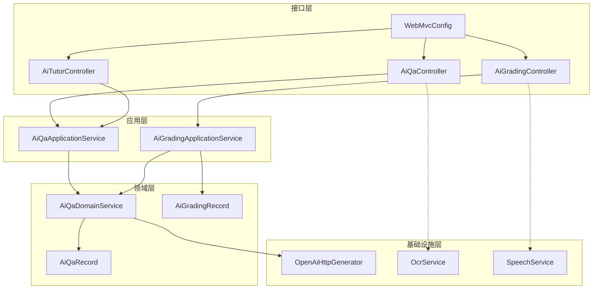
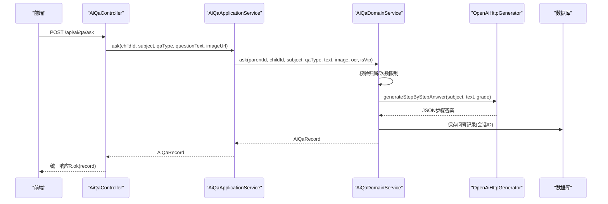
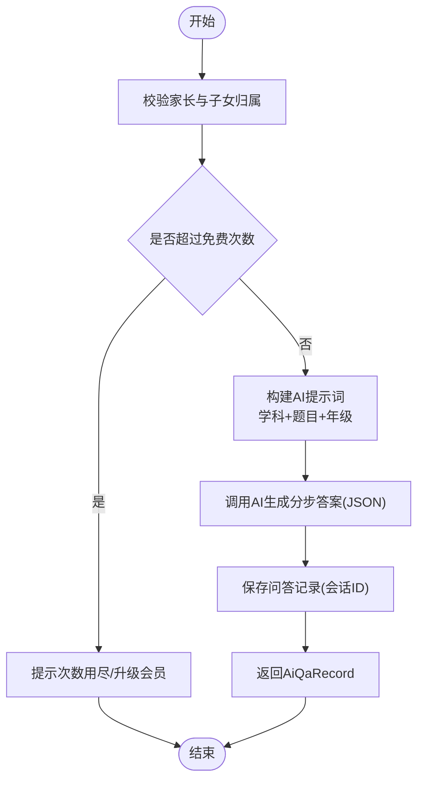
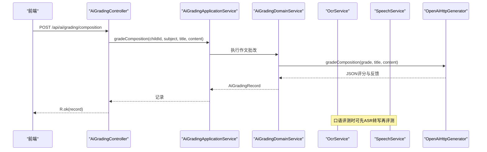
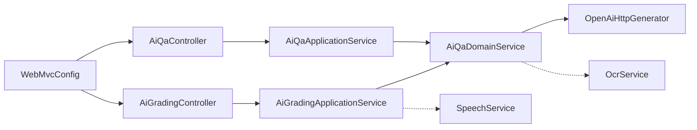

# AI辅导系统

<cite>
**本文引用的文件**
- [AiQaController.java](file://wzoto-backend/wzoto-interfaces/src/main/java/com/wzoto/interfaces/controller/AiQaController.java)
- [AiGradingController.java](file://wzoto-backend/wzoto-interfaces/src/main/java/com/wzoto/interfaces/controller/AiGradingController.java)
- [AiTutorController.java](file://wzoto-backend/wzoto-interfaces/src/main/java/com/wzoto/interfaces/controller/AiTutorController.java)
- [AiQaApplicationService.java](file://wzoto-backend/wzoto-application/src/main/java/com/wzoto/application/service/AiQaApplicationService.java)
- [AiGradingApplicationService.java](file://wzoto-backend/wzoto-application/src/main/java/com/wzoto/application/service/AiGradingApplicationService.java)
- [AiQaDomainService.java](file://wzoto-backend/wzoto-domain/src/main/java/com/wzoto/domain/service/AiQaDomainService.java)
- [OpenAiHttpGenerator.java](file://wzoto-backend/wzoto-infrastructure/src/main/java/com/wzoto/infrastructure/ai/OpenAiHttpGenerator.java)
- [OcrService.java](file://wzoto-backend/wzoto-infrastructure/src/main/java/com/wzoto/infrastructure/ai/OcrService.java)
- [SpeechService.java](file://wzoto-backend/wzoto-infrastructure/src/main/java/com/wzoto/infrastructure/ai/SpeechService.java)
- [WebMvcConfig.java](file://wzoto-backend/wzoto-infrastructure/src/main/java/com/wzoto/infrastructure/config/WebMvcConfig.java)
- [AiQaAskDTO.java](file://wzoto-backend/wzoto-interfaces/src/main/java/com/wzoto/interfaces/dto/AiQaAskDTO.java)
- [CompositionGradeDTO.java](file://wzoto-backend/wzoto-interfaces/src/main/java/com/wzoto/interfaces/dto/CompositionGradeDTO.java)
- [PronunciationEvalDTO.java](file://wzoto-backend/wzoto-interfaces/src/main/java/com/wzoto/interfaces/dto/PronunciationEvalDTO.java)
- [AiQaRecord.java](file://wzoto-backend/wzoto-domain/src/main/java/com/wzoto/domain/entity/AiQaRecord.java)
- [AiGradingRecord.java](file://wzoto-backend/wzoto-domain/src/main/java/com/wzoto/domain/entity/AiGradingRecord.java)
</cite>

## 目录
1. [简介](#简介)
2. [项目结构](#项目结构)
3. [核心组件](#核心组件)
4. [架构总览](#架构总览)
5. [详细组件分析](#详细组件分析)
6. [依赖关系分析](#依赖关系分析)
7. [性能与成本优化](#性能与成本优化)
8. [故障排查指南](#故障排查指南)
9. [结论](#结论)
10. [附录：API接口文档](#附录api接口文档)

## 简介
本文件为 wzoto AI辅导系统的全面技术文档，覆盖智能答疑、作业批改（含OCR）、作文评分、口语评测、学情分析与AI服务集成等能力。文档从系统架构、数据流、处理逻辑到API调用方式与参数配置进行系统化说明，并提供性能优化与成本控制建议，帮助开发者快速理解并扩展系统。

## 项目结构
系统采用分层与领域驱动相结合的结构：
- 接口层（interfaces）：REST控制器、DTO/VO定义、统一响应封装、跨域与鉴权拦截器配置
- 应用层（application）：编排业务流程、权限校验、次数限制、上下文注入
- 领域层（domain）：实体、值对象、领域服务、仓储接口
- 基础设施层（infrastructure）：AI能力封装（OpenAI HTTP调用、OCR、语音识别/评测）、配置与工具类

图表来源
- [AiQaController.java:16-50](file://wzoto-backend/wzoto-interfaces/src/main/java/com/wzoto/interfaces/controller/AiQaController.java#L16-L50)
- [AiGradingController.java:16-41](file://wzoto-backend/wzoto-interfaces/src/main/java/com/wzoto/interfaces/controller/AiGradingController.java#L16-L41)
- [AiTutorController.java:21-115](file://wzoto-backend/wzoto-interfaces/src/main/java/com/wzoto/interfaces/controller/AiTutorController.java#L21-L115)
- [AiQaApplicationService.java:13-43](file://wzoto-backend/wzoto-application/src/main/java/com/wzoto/application/service/AiQaApplicationService.java#L13-L43)
- [AiGradingApplicationService.java:12-40](file://wzoto-backend/wzoto-application/src/main/java/com/wzoto/application/service/AiGradingApplicationService.java#L12-L40)
- [AiQaDomainService.java:17-106](file://wzoto-backend/wzoto-domain/src/main/java/com/wzoto/domain/service/AiQaDomainService.java#L17-L106)
- [OpenAiHttpGenerator.java:18-394](file://wzoto-backend/wzoto-infrastructure/src/main/java/com/wzoto/infrastructure/ai/OpenAiHttpGenerator.java#L18-L394)
- [OcrService.java:6-38](file://wzoto-backend/wzoto-infrastructure/src/main/java/com/wzoto/infrastructure/ai/OcrService.java#L6-L38)
- [SpeechService.java:6-39](file://wzoto-backend/wzoto-infrastructure/src/main/java/com/wzoto/infrastructure/ai/SpeechService.java#L6-L39)
- [WebMvcConfig.java:10-42](file://wzoto-backend/wzoto-infrastructure/src/main/java/com/wzoto/infrastructure/config/WebMvcConfig.java#L10-L42)

章节来源
- [AiQaController.java:16-50](file://wzoto-backend/wzoto-interfaces/src/main/java/com/wzoto/interfaces/controller/AiQaController.java#L16-L50)
- [AiGradingController.java:16-41](file://wzoto-backend/wzoto-interfaces/src/main/java/com/wzoto/interfaces/controller/AiGradingController.java#L16-L41)
- [WebMvcConfig.java:10-42](file://wzoto-backend/wzoto-infrastructure/src/main/java/com/wzoto/infrastructure/config/WebMvcConfig.java#L10-L42)

## 核心组件
- 智能答疑：支持拍照搜题与文字提问，分步启发式引导，会话续问与历史记录查询，免费用户每日次数限制
- 作业批改：OCR图片识别（预留百度/腾讯），自动评分与反馈；作文评分与口语评测通过AI生成结构化结果
- 作文评分：自然语言处理驱动的评分、错误点定位、改进建议与总体评语
- 口语评测：语音转写与发音准确度评估，结合参考文本给出评分与建议
- 学情分析：基于错题与学习记录的分析，输出薄弱知识点、知识图谱与个性化建议
- AI服务集成：OpenAI兼容HTTP调用，统一封装与降级策略；OCR与语音服务以端口形式解耦

章节来源
- [AiQaDomainService.java:31-82](file://wzoto-backend/wzoto-domain/src/main/java/com/wzoto/domain/service/AiQaDomainService.java#L31-L82)
- [OpenAiHttpGenerator.java:75-118](file://wzoto-backend/wzoto-infrastructure/src/main/java/com/wzoto/infrastructure/ai/OpenAiHttpGenerator.java#L75-L118)
- [OcrService.java:14-36](file://wzoto-backend/wzoto-infrastructure/src/main/java/com/wzoto/infrastructure/ai/OcrService.java#L14-L36)
- [SpeechService.java:14-37](file://wzoto-backend/wzoto-infrastructure/src/main/java/com/wzoto/infrastructure/ai/SpeechService.java#L14-L37)

## 架构总览
系统通过控制器接收请求，应用服务编排流程，领域服务执行业务规则与AI调用，基础设施层提供AI能力与外部服务封装。所有AI调用均具备降级方案，确保可用性。

图表来源
- [AiQaController.java:25-31](file://wzoto-backend/wzoto-interfaces/src/main/java/com/wzoto/interfaces/controller/AiQaController.java#L25-L31)
- [AiQaApplicationService.java:21-27](file://wzoto-backend/wzoto-application/src/main/java/com/wzoto/application/service/AiQaApplicationService.java#L21-L27)
- [AiQaDomainService.java:34-57](file://wzoto-backend/wzoto-domain/src/main/java/com/wzoto/domain/service/AiQaDomainService.java#L34-L57)
- [OpenAiHttpGenerator.java:340-349](file://wzoto-backend/wzoto-infrastructure/src/main/java/com/wzoto/infrastructure/ai/OpenAiHttpGenerator.java#L340-L349)

## 详细组件分析

### 智能答疑组件
- 功能要点
  - 首次提问：创建会话、获取年级信息、调用AI生成分步解答、持久化记录
  - 追问：在同一会话内继续对话，复用主题与年级上下文
  - 历史与会话：按子女ID查询历史，按会话ID拉取完整对话
  - 次数限制：非VIP用户每日上限，超限提示开通会员
- 数据结构
  - 问答记录包含：子女ID、家长ID、会话ID、学科、年级、问题类型、问题文本/图片、OCR文本、AI回答JSON、是否追问、步骤数等
- 关键流程
  - 校验归属权与次数限制
  - 构建AI提示词（学科+题目+年级）
  - 解析并存储AI返回的JSON步骤答案
  - 返回统一响应

图表来源
- [AiQaDomainService.java:34-82](file://wzoto-backend/wzoto-domain/src/main/java/com/wzoto/domain/service/AiQaDomainService.java#L34-L82)
- [OpenAiHttpGenerator.java:340-349](file://wzoto-backend/wzoto-infrastructure/src/main/java/com/wzoto/infrastructure/ai/OpenAiHttpGenerator.java#L340-L349)

章节来源
- [AiQaController.java:25-49](file://wzoto-backend/wzoto-interfaces/src/main/java/com/wzoto/interfaces/controller/AiQaController.java#L25-L49)
- [AiQaApplicationService.java:21-41](file://wzoto-backend/wzoto-application/src/main/java/com/wzoto/application/service/AiQaApplicationService.java#L21-L41)
- [AiQaDomainService.java:31-97](file://wzoto-backend/wzoto-domain/src/main/java/com/wzoto/domain/service/AiQaDomainService.java#L31-L97)
- [AiQaRecord.java:12-73](file://wzoto-backend/wzoto-domain/src/main/java/com/wzoto/domain/entity/AiQaRecord.java#L12-L73)

### 作业批改与OCR组件
- OCR识别
  - 提供图片文字与数学公式识别接口（当前为Mock实现，生产可替换为百度/腾讯OCR）
  - 在答疑场景中可将图片转为文本后交由AI处理
- 自动评分与反馈
  - 作文与口语评测通过AI生成结构化评分、错误点、建议与鼓励语
  - 结果持久化为AiGradingRecord，便于后续追踪与分析

图表来源
- [AiGradingController.java:25-39](file://wzoto-backend/wzoto-interfaces/src/main/java/com/wzoto/interfaces/controller/AiGradingController.java#L25-L39)
- [AiGradingApplicationService.java:20-33](file://wzoto-backend/wzoto-application/src/main/java/com/wzoto/application/service/AiGradingApplicationService.java#L20-L33)
- [OpenAiHttpGenerator.java:374-393](file://wzoto-backend/wzoto-infrastructure/src/main/java/com/wzoto/infrastructure/ai/OpenAiHttpGenerator.java#L374-L393)
- [OcrService.java:14-36](file://wzoto-backend/wzoto-infrastructure/src/main/java/com/wzoto/infrastructure/ai/OcrService.java#L14-L36)
- [SpeechService.java:14-37](file://wzoto-backend/wzoto-infrastructure/src/main/java/com/wzoto/infrastructure/ai/SpeechService.java#L14-L37)

章节来源
- [OcrService.java:14-36](file://wzoto-backend/wzoto-infrastructure/src/main/java/com/wzoto/infrastructure/ai/OcrService.java#L14-L36)
- [SpeechService.java:14-37](file://wzoto-backend/wzoto-infrastructure/src/main/java/com/wzoto/infrastructure/ai/SpeechService.java#L14-L37)
- [AiGradingRecord.java:12-67](file://wzoto-backend/wzoto-domain/src/main/java/com/wzoto/domain/entity/AiGradingRecord.java#L12-L67)

### 作文评分组件
- 自然语言处理
  - 通过AI对作文进行评分、亮点提取、错误点标注、改进建议与总体评语
- 数据结构
  - 作文记录包含：子女ID、家长ID、学科、年级、标题、内容文本、AI结果JSON、分数、错误计数、建议等
- 处理逻辑
  - 组装年级、标题与内容提示词
  - 调用AI生成JSON格式评分与反馈
  - 持久化并返回统一响应

章节来源
- [OpenAiHttpGenerator.java:374-382](file://wzoto-backend/wzoto-infrastructure/src/main/java/com/wzoto/infrastructure/ai/OpenAiHttpGenerator.java#L374-L382)
- [AiGradingRecord.java:12-67](file://wzoto-backend/wzoto-domain/src/main/java/com/wzoto/domain/entity/AiGradingRecord.java#L12-L67)

### 口语评测组件
- 语音识别与评测
  - 支持音频URL转写与发音准确度评估（当前为Mock实现，生产可接入讯飞/百度语音）
  - 结合参考文本进行评分与建议输出
- 数据结构
  - 口语评测记录包含：子女ID、家长ID、题型、学科、年级、标题、音频URL、AI结果JSON、分数、建议等

章节来源
- [SpeechService.java:14-37](file://wzoto-backend/wzoto-infrastructure/src/main/java/com/wzoto/infrastructure/ai/SpeechService.java#L14-L37)
- [AiGradingRecord.java:12-67](file://wzoto-backend/wzoto-domain/src/main/java/com/wzoto/domain/entity/AiGradingRecord.java#L12-L67)

### 学情分析组件
- 学习数据分析
  - 基于错题数据与近期成绩，AI输出薄弱知识点、整体水平与推荐行动
- 能力雷达图
  - 通过AI生成的知识图谱与薄弱点列表，前端可渲染为雷达图展示
- 个性化推荐
  - 根据薄弱点与可用学习时间，生成每日学习计划与重点方向

章节来源
- [OpenAiHttpGenerator.java:351-371](file://wzoto-backend/wzoto-infrastructure/src/main/java/com/wzoto/infrastructure/ai/OpenAiHttpGenerator.java#L351-L371)

### AI服务集成架构
- OpenAI API调用
  - 使用OkHttpClient直接HTTP调用，支持任意OpenAI兼容接口（OpenAI/DeepSeek/本地Ollama等）
  - 配置项：base-url、api-key、model、temperature
  - 超时设置：连接30秒，读取60秒
- 第三方服务封装
  - OCR与语音服务以独立组件暴露，便于替换与扩展
- 错误处理机制
  - 网络异常或API失败时启用降级方案，返回默认JSON结构与友好提示
  - 日志记录状态码与响应体，便于排障

章节来源
- [OpenAiHttpGenerator.java:18-73](file://wzoto-backend/wzoto-infrastructure/src/main/java/com/wzoto/infrastructure/ai/OpenAiHttpGenerator.java#L18-L73)
- [OpenAiHttpGenerator.java:104-117](file://wzoto-backend/wzoto-infrastructure/src/main/java/com/wzoto/infrastructure/ai/OpenAiHttpGenerator.java#L104-L117)
- [OpenAiHttpGenerator.java:199-203](file://wzoto-backend/wzoto-infrastructure/src/main/java/com/wzoto/infrastructure/ai/OpenAiHttpGenerator.java#L199-L203)
- [OpenAiHttpGenerator.java:251-254](file://wzoto-backend/wzoto-infrastructure/src/main/java/com/wzoto/infrastructure/ai/OpenAiHttpGenerator.java#L251-L254)
- [OpenAiHttpGenerator.java:302-309](file://wzoto-backend/wzoto-infrastructure/src/main/java/com/wzoto/infrastructure/ai/OpenAiHttpGenerator.java#L302-L309)

## 依赖关系分析
- 控制器依赖应用服务，应用服务依赖领域服务，领域服务依赖AI生成器与仓储
- 安全与跨域由WebMvcConfig统一管理，JWT拦截器保护/api/**路径
- AI能力通过OpenAiHttpGenerator统一封装，OCR与语音服务作为可选扩展

图表来源
- [AiQaController.java:16-50](file://wzoto-backend/wzoto-interfaces/src/main/java/com/wzoto/interfaces/controller/AiQaController.java#L16-L50)
- [AiGradingController.java:16-41](file://wzoto-backend/wzoto-interfaces/src/main/java/com/wzoto/interfaces/controller/AiGradingController.java#L16-L41)
- [AiQaApplicationService.java:13-43](file://wzoto-backend/wzoto-application/src/main/java/com/wzoto/application/service/AiQaApplicationService.java#L13-L43)
- [AiGradingApplicationService.java:12-40](file://wzoto-backend/wzoto-application/src/main/java/com/wzoto/application/service/AiGradingApplicationService.java#L12-L40)
- [AiQaDomainService.java:17-106](file://wzoto-backend/wzoto-domain/src/main/java/com/wzoto/domain/service/AiQaDomainService.java#L17-L106)
- [OpenAiHttpGenerator.java:18-73](file://wzoto-backend/wzoto-infrastructure/src/main/java/com/wzoto/infrastructure/ai/OpenAiHttpGenerator.java#L18-L73)
- [OcrService.java:6-38](file://wzoto-backend/wzoto-infrastructure/src/main/java/com/wzoto/infrastructure/ai/OcrService.java#L6-L38)
- [SpeechService.java:6-39](file://wzoto-backend/wzoto-infrastructure/src/main/java/com/wzoto/infrastructure/ai/SpeechService.java#L6-L39)
- [WebMvcConfig.java:10-42](file://wzoto-backend/wzoto-infrastructure/src/main/java/com/wzoto/infrastructure/config/WebMvcConfig.java#L10-L42)

章节来源
- [WebMvcConfig.java:21-41](file://wzoto-backend/wzoto-infrastructure/src/main/java/com/wzoto/infrastructure/config/WebMvcConfig.java#L21-L41)

## 性能与成本优化
- 性能优化
  - 合理设置HTTP超时与重试策略，避免长尾请求阻塞
  - 对AI响应进行缓存（相同题目/年级短期缓存），减少重复调用
  - 批量处理与异步化：将耗时任务放入消息队列，提升吞吐
  - 分页与限流：对历史查询与会话拉取进行分页，防止大结果集
- 成本控制
  - 模型选择：根据场景选择性价比更高的模型（如gpt-3.5-turbo）
  - 温度与长度控制：降低temperature与最大token数以降低成本
  - 降级策略：API失败时使用内置模板返回，保障可用性
  - 配额与监控：设置每日调用上限与告警，避免超额费用

[本节为通用指导，不直接分析具体文件]

## 故障排查指南
- 常见问题
  - API调用失败：检查base-url、api-key是否正确，查看日志中的状态码与响应体
  - 降级触发：确认网络连通性与模型可用性，必要时切换备用模型
  - 次数限制：非VIP用户达到免费上限，需升级会员或调整策略
- 排查步骤
  - 查看控制器与应用服务的日志输出
  - 检查OpenAiHttpGenerator的错误日志与降级返回
  - 验证DTO校验是否通过（必填字段缺失会抛出校验异常）
  - 核对WebMvcConfig的拦截器排除路径是否正确

章节来源
- [OpenAiHttpGenerator.java:104-117](file://wzoto-backend/wzoto-infrastructure/src/main/java/com/wzoto/infrastructure/ai/OpenAiHttpGenerator.java#L104-L117)
- [OpenAiHttpGenerator.java:199-203](file://wzoto-backend/wzoto-infrastructure/src/main/java/com/wzoto/infrastructure/ai/OpenAiHttpGenerator.java#L199-L203)
- [OpenAiHttpGenerator.java:251-254](file://wzoto-backend/wzoto-infrastructure/src/main/java/com/wzoto/infrastructure/ai/OpenAiHttpGenerator.java#L251-L254)
- [AiQaDomainService.java:38-43](file://wzoto-backend/wzoto-domain/src/main/java/com/wzoto/domain/service/AiQaDomainService.java#L38-L43)

## 结论
wzoto AI辅导系统通过清晰的分层架构与领域服务编排，实现了智能答疑、作业批改、作文评分、口语评测与学情分析等核心能力。AI服务以OpenAI兼容接口为核心，配合OCR与语音服务形成可扩展的AI能力矩阵。系统在错误处理与降级策略上具备良好鲁棒性，同时提供性能与成本优化建议，适合持续迭代与规模化部署。

[本节为总结性内容，不直接分析具体文件]

## 附录：API接口文档

### 智能答疑
- 提问
  - 方法：POST
  - 路径：/api/ai/qa/ask
  - 请求体：AiQaAskDTO
    - childId：Long，必填
    - subject：String，必填
    - qaType：String，可选（PHOTO/TEXT）
    - questionText：String，可选
    - questionImageUrl：String，可选
  - 响应：统一响应R.ok(AiQaRecord)
- 追问
  - 方法：POST
  - 路径：/api/ai/qa/follow-up
  - 请求体：AiQaFollowUpDTO（conversationId、questionText等）
  - 响应：统一响应R.ok(AiQaRecord)
- 历史与会话
  - 方法：GET
  - 路径：/api/ai/qa/history/{childId}
  - 路径：/api/ai/qa/session/{conversationId}
  - 响应：统一响应R.ok(List<AiQaRecord>)

章节来源
- [AiQaController.java:25-49](file://wzoto-backend/wzoto-interfaces/src/main/java/com/wzoto/interfaces/controller/AiQaController.java#L25-L49)
- [AiQaAskDTO.java:7-19](file://wzoto-backend/wzoto-interfaces/src/main/java/com/wzoto/interfaces/dto/AiQaAskDTO.java#L7-L19)

### 作业批改
- 作文批改
  - 方法：POST
  - 路径：/api/ai/grading/composition
  - 请求体：CompositionGradeDTO
    - childId：Long，必填
    - subject：String，必填
    - title：String，必填
    - content：String，必填
  - 响应：统一响应R.ok(AiGradingRecord)
- 口语评测
  - 方法：POST
  - 路径：/api/ai/grading/pronunciation
  - 请求体：PronunciationEvalDTO
    - childId：Long，必填
    - title：String，可选
    - audioUrl：String，可选
    - audioTranscript：String，可选
  - 响应：统一响应R.ok(AiGradingRecord)
- 历史
  - 方法：GET
  - 路径：/api/ai/grading/history/{childId}
  - 响应：统一响应R.ok(List<AiGradingRecord>)

章节来源
- [AiGradingController.java:25-40](file://wzoto-backend/wzoto-interfaces/src/main/java/com/wzoto/interfaces/controller/AiGradingController.java#L25-L40)
- [CompositionGradeDTO.java:7-19](file://wzoto-backend/wzoto-interfaces/src/main/java/com/wzoto/interfaces/dto/CompositionGradeDTO.java#L7-L19)
- [PronunciationEvalDTO.java:6-15](file://wzoto-backend/wzoto-interfaces/src/main/java/com/wzoto/interfaces/dto/PronunciationEvalDTO.java#L6-L15)

### 教员优化（附加）
- 简历优化
  - 方法：POST
  - 路径：/api/ai/tutor/resume
  - 请求体：CreateResumeOptimizationDTO（大学、专业、年级、科目、简介、经验）
  - 响应：统一响应R.ok(AiTutorOptimizationVO)
- 定价分析
  - 方法：POST
  - 路径：/api/ai/tutor/pricing
  - 请求体：CreatePricingAnalysisDTO（大学、专业、年级、科目、经验、当前时薪）
  - 响应：统一响应R.ok(AiTutorOptimizationVO)
- 我的优化记录
  - 方法：GET
  - 路径：/api/ai/tutor/optimizations
  - 响应：统一响应R.ok(List<AiTutorOptimizationVO>)
- 详情与付费解锁
  - 方法：GET/POST
  - 路径：/api/ai/tutor/{id}
  - 路径：/api/ai/tutor/{id}/pay
  - 响应：统一响应R.ok(AiTutorOptimizationVO)

章节来源
- [AiTutorController.java:29-88](file://wzoto-backend/wzoto-interfaces/src/main/java/com/wzoto/interfaces/controller/AiTutorController.java#L29-L88)

### 安全与跨域
- JWT拦截器
  - 拦截/api/**，排除登录相关路径
- CORS配置
  - 允许所有来源与方法，携带凭证，最大缓存时间3600秒

章节来源
- [WebMvcConfig.java:21-41](file://wzoto-backend/wzoto-infrastructure/src/main/java/com/wzoto/infrastructure/config/WebMvcConfig.java#L21-L41)