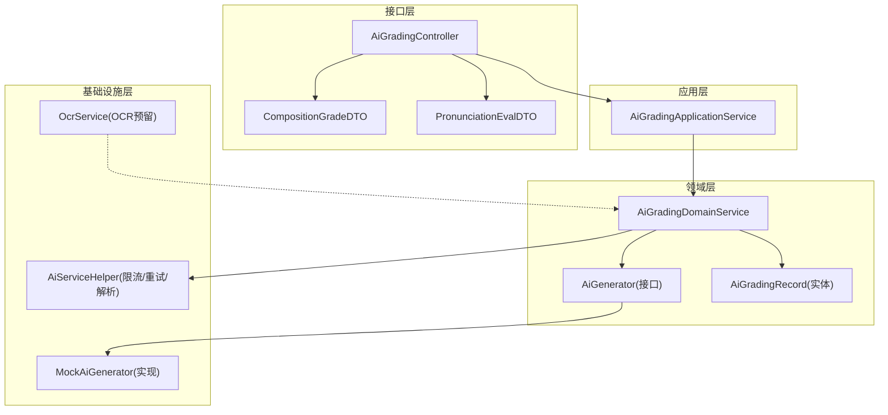
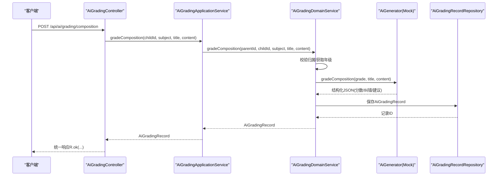
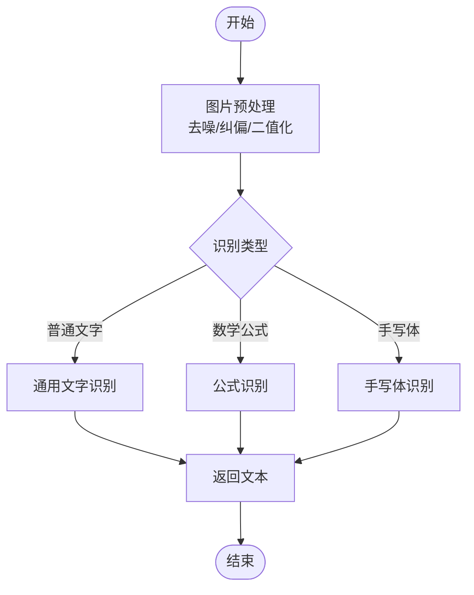
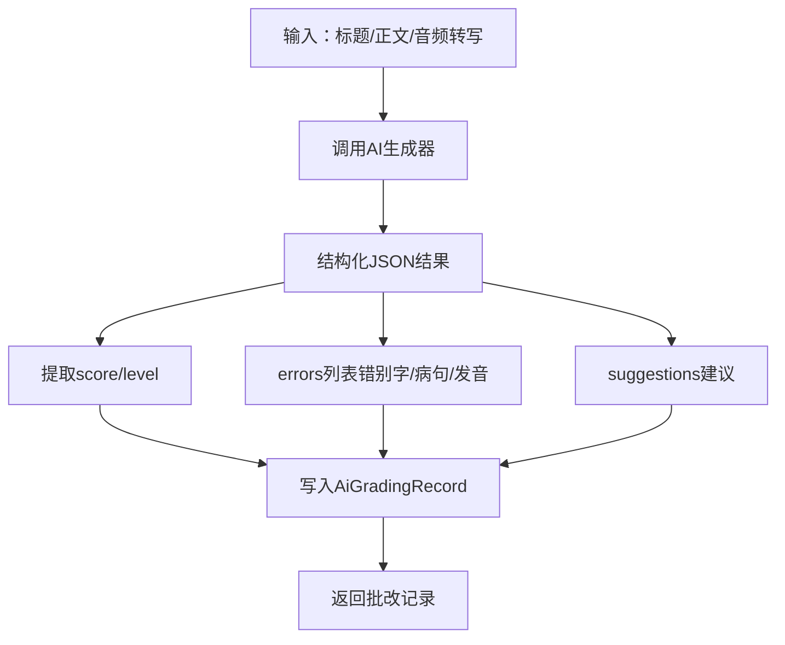
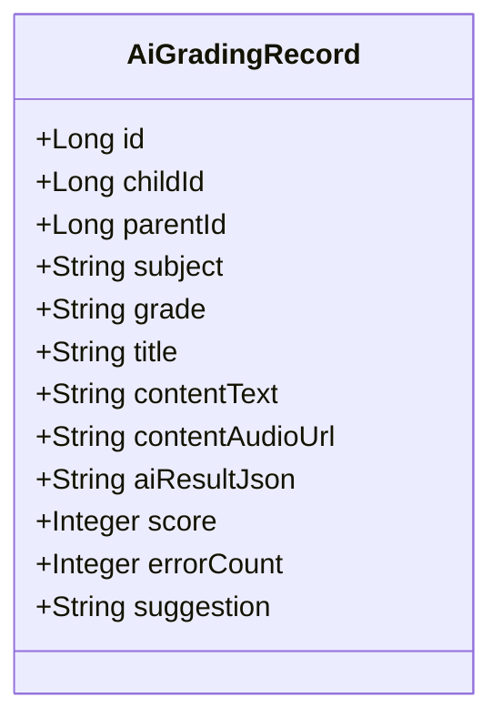
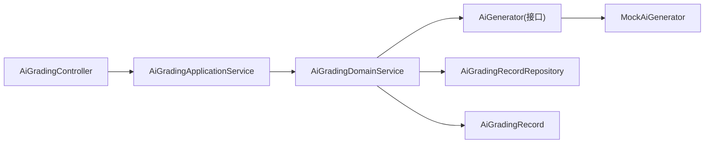

# 作业批改系统

<cite>
**本文引用的文件**
- [OcrService.java](file://wzoto-backend/wzoto-infrastructure/src/main/java/com/wzoto/infrastructure/ai/OcrService.java)
- [AiGradingController.java](file://wzoto-backend/wzoto-interfaces/src/main/java/com/wzoto/interfaces/controller/AiGradingController.java)
- [AiGradingApplicationService.java](file://wzoto-backend/wzoto-application/src/main/java/com/wzoto/application/service/AiGradingApplicationService.java)
- [AiGradingDomainService.java](file://wzoto-backend/wzoto-domain/src/main/java/com/wzoto/domain/service/AiGradingDomainService.java)
- [AiGenerator.java](file://wzoto-backend/wzoto-domain/src/main/java/com/wzoto/domain/repository/AiGenerator.java)
- [MockAiGenerator.java](file://wzoto-backend/wzoto-infrastructure/src/main/java/com/wzoto/infrastructure/ai/MockAiGenerator.java)
- [AiServiceHelper.java](file://wzoto-backend/wzoto-infrastructure/src/main/java/com/wzoto/infrastructure/ai/AiServiceHelper.java)
- [CompositionGradeDTO.java](file://wzoto-backend/wzoto-interfaces/src/main/java/com/wzoto/interfaces/dto/CompositionGradeDTO.java)
- [PronunciationEvalDTO.java](file://wzoto-backend/wzoto-interfaces/src/main/java/com/wzoto/interfaces/dto/PronunciationEvalDTO.java)
- [AiGradingRecord.java](file://wzoto-backend/wzoto-domain/src/main/java/com/wzoto/domain/entity/AiGradingRecord.java)
- [t_ai_grading_record.sql](file://wzoto-backend/sql/t_ai_grading_record.sql)
</cite>

## 目录
1. [简介](#简介)
2. [项目结构](#项目结构)
3. [核心组件](#核心组件)
4. [架构总览](#架构总览)
5. [详细组件分析](#详细组件分析)
6. [依赖关系分析](#依赖关系分析)
7. [性能与批处理优化](#性能与批处理优化)
8. [故障排查指南](#故障排查指南)
9. [结论](#结论)
10. [附录：API接口文档](#附录api接口文档)

## 简介
本作业批改系统面向小学生全科学习场景，提供作文批改、口语评测等AI能力，并预留OCR图片识别扩展点。系统采用分层架构（接口层-应用层-领域层-基础设施层），通过统一的AI生成器接口对接不同实现（开发期Mock、生产期可替换为真实AI服务）。当前已实现：
- OCR识别：预留百度/腾讯OCR端口，开发阶段使用Mock返回示例文本
- 自动评分：基于AI生成结果的结构化JSON进行分数计算与错误标注
- 批改反馈：返回错误项、正确答案、改进建议与总体评价
- 作业类型支持：作文（语文/英语）、口语评测（英语）；数学题可通过OCR+AI答疑扩展
- API：作文批改、口语评测、历史查询
- 配置与集成：通过条件装配切换Mock/真实AI服务，统一限流重试工具类

## 项目结构
系统按DDD分层组织：
- 接口层（interfaces）：REST控制器、DTO/VO定义
- 应用层（application）：编排业务流程、调用领域服务
- 领域层（domain）：业务实体、值对象、领域服务、仓储接口
- 基础设施层（infrastructure）：AI服务实现（Mock/OpenAI/OCR/Speech）、持久化实现、工具类

图表来源
- [AiGradingController.java:1-42](file://wzoto-backend/wzoto-interfaces/src/main/java/com/wzoto/interfaces/controller/AiGradingController.java#L1-L42)
- [AiGradingApplicationService.java:1-40](file://wzoto-backend/wzoto-application/src/main/java/com/wzoto/application/service/AiGradingApplicationService.java#L1-L40)
- [AiGradingDomainService.java:1-89](file://wzoto-backend/wzoto-domain/src/main/java/com/wzoto/domain/service/AiGradingDomainService.java#L1-L89)
- [AiGenerator.java:1-37](file://wzoto-backend/wzoto-domain/src/main/java/com/wzoto/domain/repository/AiGenerator.java#L1-L37)
- [MockAiGenerator.java:1-302](file://wzoto-backend/wzoto-infrastructure/src/main/java/com/wzoto/infrastructure/ai/MockAiGenerator.java#L1-L302)
- [AiServiceHelper.java:1-66](file://wzoto-backend/wzoto-infrastructure/src/main/java/com/wzoto/infrastructure/ai/AiServiceHelper.java#L1-L66)
- [OcrService.java:1-38](file://wzoto-backend/wzoto-infrastructure/src/main/java/com/wzoto/infrastructure/ai/OcrService.java#L1-L38)

章节来源
- [AiGradingController.java:1-42](file://wzoto-backend/wzoto-interfaces/src/main/java/com/wzoto/interfaces/controller/AiGradingController.java#L1-L42)
- [AiGradingApplicationService.java:1-40](file://wzoto-backend/wzoto-application/src/main/java/com/wzoto/application/service/AiGradingApplicationService.java#L1-L40)
- [AiGradingDomainService.java:1-89](file://wzoto-backend/wzoto-domain/src/main/java/com/wzoto/domain/service/AiGradingDomainService.java#L1-L89)
- [AiGenerator.java:1-37](file://wzoto-backend/wzoto-domain/src/main/java/com/wzoto/domain/repository/AiGenerator.java#L1-L37)
- [MockAiGenerator.java:1-302](file://wzoto-backend/wzoto-infrastructure/src/main/java/com/wzoto/infrastructure/ai/MockAiGenerator.java#L1-L302)
- [AiServiceHelper.java:1-66](file://wzoto-backend/wzoto-infrastructure/src/main/java/com/wzoto/infrastructure/ai/AiServiceHelper.java#L1-L66)
- [OcrService.java:1-38](file://wzoto-backend/wzoto-infrastructure/src/main/java/com/wzoto/infrastructure/ai/OcrService.java#L1-L38)

## 核心组件
- OCR识别服务：提供图片文字与数学公式识别的预留接口，便于接入第三方OCR
- AI生成器接口：抽象作文批改、口语评测、启发式答疑、错题分析、学习计划等能力
- Mock实现：在开发环境模拟AI输出，包含结构化评分、纠错与建议
- 应用服务：封装用户上下文、参数校验、调用领域服务
- 领域服务：执行业务规则（所有权校验、年级信息获取、评分记录创建与保存）
- 数据模型：AiGradingRecord承载批改记录，含分数、错误数、建议、AI结果JSON等
- 辅助工具：统一限流、重试、超时与JSON字段提取

章节来源
- [OcrService.java:1-38](file://wzoto-backend/wzoto-infrastructure/src/main/java/com/wzoto/infrastructure/ai/OcrService.java#L1-L38)
- [AiGenerator.java:1-37](file://wzoto-backend/wzoto-domain/src/main/java/com/wzoto/domain/repository/AiGenerator.java#L1-L37)
- [MockAiGenerator.java:1-302](file://wzoto-backend/wzoto-infrastructure/src/main/java/com/wzoto/infrastructure/ai/MockAiGenerator.java#L1-L302)
- [AiGradingApplicationService.java:1-40](file://wzoto-backend/wzoto-application/src/main/java/com/wzoto/application/service/AiGradingApplicationService.java#L1-L40)
- [AiGradingDomainService.java:1-89](file://wzoto-backend/wzoto-domain/src/main/java/com/wzoto/domain/service/AiGradingDomainService.java#L1-L89)
- [AiGradingRecord.java:1-67](file://wzoto-backend/wzoto-domain/src/main/java/com/wzoto/domain/entity/AiGradingRecord.java#L1-L67)
- [AiServiceHelper.java:1-66](file://wzoto-backend/wzoto-infrastructure/src/main/java/com/wzoto/infrastructure/ai/AiServiceHelper.java#L1-L66)

## 架构总览
系统以“请求-编排-领域-实现”为主线，结合仓储与外部AI能力完成端到端流程。

图表来源
- [AiGradingController.java:25-35](file://wzoto-backend/wzoto-interfaces/src/main/java/com/wzoto/interfaces/controller/AiGradingController.java#L25-L35)
- [AiGradingApplicationService.java:20-28](file://wzoto-backend/wzoto-application/src/main/java/com/wzoto/application/service/AiGradingApplicationService.java#L20-L28)
- [AiGradingDomainService.java:30-44](file://wzoto-backend/wzoto-domain/src/main/java/com/wzoto/domain/service/AiGradingDomainService.java#L30-L44)
- [AiGenerator.java:31-35](file://wzoto-backend/wzoto-domain/src/main/java/com/wzoto/domain/repository/AiGenerator.java#L31-L35)
- [MockAiGenerator.java:249-275](file://wzoto-backend/wzoto-infrastructure/src/main/java/com/wzoto/infrastructure/ai/MockAiGenerator.java#L249-L275)

## 详细组件分析

### OCR识别技术（图片预处理、文字识别、手写体识别）
- 现状：提供OcrService接口，包含通用文字识别与数学公式识别方法；当前为Mock实现，返回示例文本
- 扩展点：可在生产环境替换为百度OCR/腾讯OCR，实现图片预处理（去噪、纠偏、二值化）、文字识别、手写体识别
- 集成建议：将OcrService作为独立能力注入到后续的作业识别流程中，先对上传的作业图片进行预处理，再调用识别接口得到题目文本或公式

图表来源
- [OcrService.java:20-36](file://wzoto-backend/wzoto-infrastructure/src/main/java/com/wzoto/infrastructure/ai/OcrService.java#L20-L36)

章节来源
- [OcrService.java:1-38](file://wzoto-backend/wzoto-infrastructure/src/main/java/com/wzoto/infrastructure/ai/OcrService.java#L1-L38)

### 自动评分算法（答案比对、评分标准、分数计算）
- 评分入口：作文批改与口语评测由领域服务驱动，调用AiGenerator.gradeComposition/evaluatePronunciation
- 评分标准：Mock实现根据内容长度、题型与年级生成结构化JSON，包含score、level、errors、suggestions等
- 分数计算：当前Mock实现将score写入记录；实际生产可将JSON中的score直接映射或按规则二次计算
- 错误标注：errors数组包含原始片段、修正后内容与错误类型；可用于前端高亮与讲解

图表来源
- [AiGradingDomainService.java:30-44](file://wzoto-backend/wzoto-domain/src/main/java/com/wzoto/domain/service/AiGradingDomainService.java#L30-L44)
- [MockAiGenerator.java:249-275](file://wzoto-backend/wzoto-infrastructure/src/main/java/com/wzoto/infrastructure/ai/MockAiGenerator.java#L249-L275)
- [AiGradingRecord.java:20-35](file://wzoto-backend/wzoto-domain/src/main/java/com/wzoto/domain/entity/AiGradingRecord.java#L20-L35)

章节来源
- [AiGradingDomainService.java:30-44](file://wzoto-backend/wzoto-domain/src/main/java/com/wzoto/domain/service/AiGradingDomainService.java#L30-L44)
- [MockAiGenerator.java:249-275](file://wzoto-backend/wzoto-infrastructure/src/main/java/com/wzoto/infrastructure/ai/MockAiGenerator.java#L249-L275)
- [AiGradingRecord.java:1-67](file://wzoto-backend/wzoto-domain/src/main/java/com/wzoto/domain/entity/AiGradingRecord.java#L1-L67)

### 批改结果反馈（错误标注、正确答案、解题思路）
- 错误标注：errors数组提供原文与修正，便于前端定位与展示
- 正确答案：对于作文/口语，整体answer/overallComment可作为参考；数学题可通过启发式答疑接口生成步骤
- 解题思路：generateStepByStepAnswer返回分步提示与知识点标签，适合数学题引导式讲解

图表来源
- [AiGradingRecord.java:1-67](file://wzoto-backend/wzoto-domain/src/main/java/com/wzoto/domain/entity/AiGradingRecord.java#L1-L67)

章节来源
- [AiGradingRecord.java:1-67](file://wzoto-backend/wzoto-domain/src/main/java/com/wzoto/domain/entity/AiGradingRecord.java#L1-L67)
- [MockAiGenerator.java:181-198](file://wzoto-backend/wzoto-infrastructure/src/main/java/com/wzoto/infrastructure/ai/MockAiGenerator.java#L181-L198)

### 作业类型支持与学科处理方式
- 作文（语文/英语）：通过composition接口提交标题与正文，返回结构化评分与纠错建议
- 口语评测（英语）：通过pronunciation接口提交音频URL与转写文本，返回发音准确度与建议
- 数学题：可结合OCR识别题目文本，调用启发式答疑接口生成步骤与知识点标签，形成“识别-理解-引导”闭环

章节来源
- [AiGradingController.java:25-35](file://wzoto-backend/wzoto-interfaces/src/main/java/com/wzoto/interfaces/controller/AiGradingController.java#L25-L35)
- [CompositionGradeDTO.java:1-19](file://wzoto-backend/wzoto-interfaces/src/main/java/com/wzoto/interfaces/dto/CompositionGradeDTO.java#L1-L19)
- [PronunciationEvalDTO.java:1-15](file://wzoto-backend/wzoto-interfaces/src/main/java/com/wzoto/interfaces/dto/PronunciationEvalDTO.java#L1-L15)
- [MockAiGenerator.java:181-198](file://wzoto-backend/wzoto-infrastructure/src/main/java/com/wzoto/infrastructure/ai/MockAiGenerator.java#L181-L198)

## 依赖关系分析
- 控制器依赖应用服务，应用服务依赖领域服务
- 领域服务依赖AI生成器接口与仓储接口，解耦具体实现
- 基础设施层提供Mock实现与辅助工具，便于开发与测试
- 数据模型与表结构一致，确保持久化一致性

图表来源
- [AiGradingController.java:1-42](file://wzoto-backend/wzoto-interfaces/src/main/java/com/wzoto/interfaces/controller/AiGradingController.java#L1-L42)
- [AiGradingApplicationService.java:1-40](file://wzoto-backend/wzoto-application/src/main/java/com/wzoto/application/service/AiGradingApplicationService.java#L1-L40)
- [AiGradingDomainService.java:1-89](file://wzoto-backend/wzoto-domain/src/main/java/com/wzoto/domain/service/AiGradingDomainService.java#L1-L89)
- [AiGenerator.java:1-37](file://wzoto-backend/wzoto-domain/src/main/java/com/wzoto/domain/repository/AiGenerator.java#L1-L37)
- [MockAiGenerator.java:1-302](file://wzoto-backend/wzoto-infrastructure/src/main/java/com/wzoto/infrastructure/ai/MockAiGenerator.java#L1-L302)

章节来源
- [AiGradingController.java:1-42](file://wzoto-backend/wzoto-interfaces/src/main/java/com/wzoto/interfaces/controller/AiGradingController.java#L1-L42)
- [AiGradingApplicationService.java:1-40](file://wzoto-backend/wzoto-application/src/main/java/com/wzoto/application/service/AiGradingApplicationService.java#L1-L40)
- [AiGradingDomainService.java:1-89](file://wzoto-backend/wzoto-domain/src/main/java/com/wzoto/domain/service/AiGradingDomainService.java#L1-L89)
- [AiGenerator.java:1-37](file://wzoto-backend/wzoto-domain/src/main/java/com/wzoto/domain/repository/AiGenerator.java#L1-L37)
- [MockAiGenerator.java:1-302](file://wzoto-backend/wzoto-infrastructure/src/main/java/com/wzoto/infrastructure/ai/MockAiGenerator.java#L1-L302)

## 性能与批处理优化
- 限流与重试：AiServiceHelper提供每日调用次数限制与带重试的调用封装，避免瞬时峰值导致服务不可用
- 批量处理建议：
  - 队列化：将多个作业请求放入消息队列，后端消费并串行/并行处理
  - 缓存策略：对相同题目或相似内容的OCR结果与AI结果进行缓存（如按题目指纹哈希），减少重复计算
  - 异步化：长耗时任务（如大作文批改）采用异步任务+轮询或回调通知
- 数据库索引：t_ai_grading_record表已建立child_id、parent_id、grading_type、subject、created_at索引，利于历史查询与统计

章节来源
- [AiServiceHelper.java:14-43](file://wzoto-backend/wzoto-infrastructure/src/main/java/com/wzoto/infrastructure/ai/AiServiceHelper.java#L14-L43)
- [t_ai_grading_record.sql:5-27](file://wzoto-backend/sql/t_ai_grading_record.sql#L5-L27)

## 故障排查指南
- 权限问题：领域服务会校验家长对子女档案的归属权，若失败抛出异常，需检查parentId与childId关系
- AI服务异常：AiServiceHelper的重试机制会记录日志，若最终失败返回空，需检查外部AI服务状态与限流策略
- 数据一致性：确保AiGradingRecord的aiResultJson、score、error_count等字段正确填充，便于前端展示与分析
- 常见问题定位：
  - 作文内容为空或格式不正确：检查CompositionGradeDTO校验
  - 口语评测无音频或转写为空：检查PronunciationEvalDTO字段
  - 历史查询为空：确认childId与parent_id索引是否命中

章节来源
- [AiGradingDomainService.java:82-87](file://wzoto-backend/wzoto-domain/src/main/java/com/wzoto/domain/service/AiGradingDomainService.java#L82-L87)
- [AiServiceHelper.java:31-43](file://wzoto-backend/wzoto-infrastructure/src/main/java/com/wzoto/infrastructure/ai/AiServiceHelper.java#L31-L43)
- [CompositionGradeDTO.java:1-19](file://wzoto-backend/wzoto-interfaces/src/main/java/com/wzoto/interfaces/dto/CompositionGradeDTO.java#L1-L19)
- [PronunciationEvalDTO.java:1-15](file://wzoto-backend/wzoto-interfaces/src/main/java/com/wzoto/interfaces/dto/PronunciationEvalDTO.java#L1-L15)

## 结论
本系统以清晰的DDD分层与可扩展的AI接口设计，实现了作文批改与口语评测的核心能力，并预留OCR识别与数学题启发式答疑扩展点。通过限流重试与索引优化，具备较好的稳定性与扩展性。后续可按需接入真实OCR与AI服务，完善数学题识别与评分逻辑，提升整体准确率与用户体验。

## 附录：API接口文档

### 作文批改
- 路径：POST /api/ai/grading/composition
- 请求体：CompositionGradeDTO
  - childId: Long（必填）
  - subject: String（必填）
  - title: String（必填）
  - content: String（必填）
- 响应：统一包装R<AiGradingRecord>
  - AiGradingRecord字段：id、childId、parentId、gradingType、subject、grade、title、contentText、contentAudioUrl、aiResultJson、score、errorCount、suggestion、createdAt、updatedAt

章节来源
- [AiGradingController.java:25-29](file://wzoto-backend/wzoto-interfaces/src/main/java/com/wzoto/interfaces/controller/AiGradingController.java#L25-L29)
- [CompositionGradeDTO.java:1-19](file://wzoto-backend/wzoto-interfaces/src/main/java/com/wzoto/interfaces/dto/CompositionGradeDTO.java#L1-L19)
- [AiGradingRecord.java:1-67](file://wzoto-backend/wzoto-domain/src/main/java/com/wzoto/domain/entity/AiGradingRecord.java#L1-L67)

### 口语评测
- 路径：POST /api/ai/grading/pronunciation
- 请求体：PronunciationEvalDTO
  - childId: Long（必填）
  - title: String（可选）
  - audioUrl: String（可选）
  - audioTranscript: String（可选）
- 响应：统一包装R<AiGradingRecord>

章节来源
- [AiGradingController.java:31-35](file://wzoto-backend/wzoto-interfaces/src/main/java/com/wzoto/interfaces/controller/AiGradingController.java#L31-L35)
- [PronunciationEvalDTO.java:1-15](file://wzoto-backend/wzoto-interfaces/src/main/java/com/wzoto/interfaces/dto/PronunciationEvalDTO.java#L1-L15)
- [AiGradingRecord.java:1-67](file://wzoto-backend/wzoto-domain/src/main/java/com/wzoto/domain/entity/AiGradingRecord.java#L1-L67)

### 批改历史
- 路径：GET /api/ai/grading/history/{childId}
- 路径参数：childId（Long）
- 响应：统一包装R<List<AiGradingRecord>>

章节来源
- [AiGradingController.java:37-40](file://wzoto-backend/wzoto-interfaces/src/main/java/com/wzoto/interfaces/controller/AiGradingController.java#L37-L40)
- [AiGradingRecord.java:1-67](file://wzoto-backend/wzoto-domain/src/main/java/com/wzoto/domain/entity/AiGradingRecord.java#L1-L67)

### 数据结构与存储
- 表名：t_ai_grading_record
- 关键字段：child_id、parent_id、grading_type、subject、grade、title、content_text、content_audio_url、ai_result_json、score、error_count、suggestion、deleted、created_at、updated_at
- 索引：child_id、parent_id、grading_type、subject、created_at

章节来源
- [t_ai_grading_record.sql:5-27](file://wzoto-backend/sql/t_ai_grading_record.sql#L5-L27)

### OCR服务配置与第三方集成
- 当前实现：OcrService提供recognizeText与recognizeMathFormula两个方法，开发阶段返回示例文本
- 生产集成建议：
  - 选择第三方OCR（百度/腾讯），在OcrService中实现真实调用
  - 增加图片预处理（去噪、纠偏、二值化）以提升识别率
  - 针对手写体与数学公式进行专项优化
  - 结合AiServiceHelper进行限流与重试

章节来源
- [OcrService.java:1-38](file://wzoto-backend/wzoto-infrastructure/src/main/java/com/wzoto/infrastructure/ai/OcrService.java#L1-L38)
- [AiServiceHelper.java:14-43](file://wzoto-backend/wzoto-infrastructure/src/main/java/com/wzoto/infrastructure/ai/AiServiceHelper.java#L14-L43)