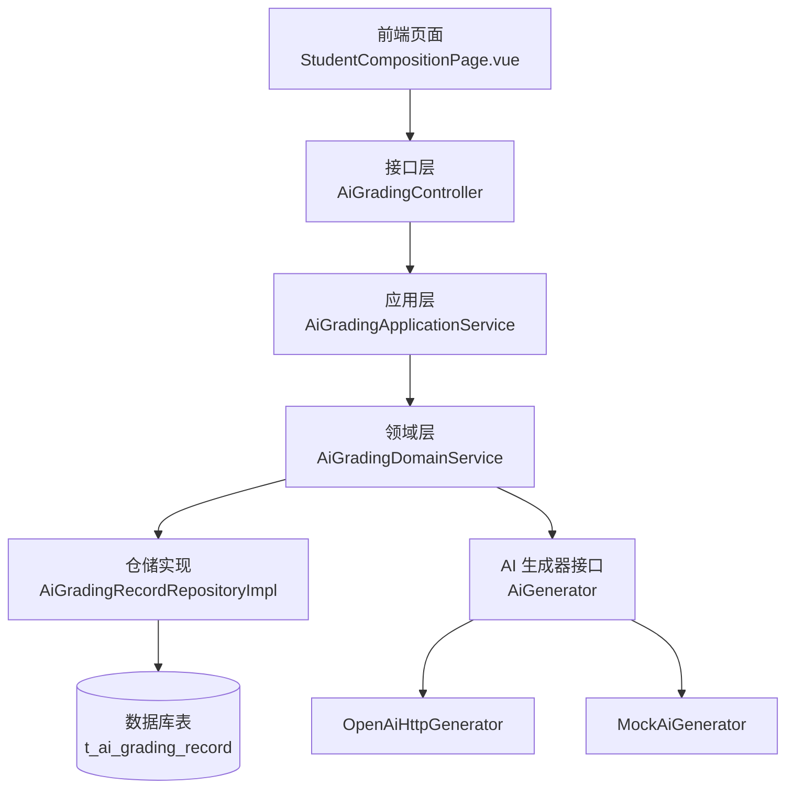
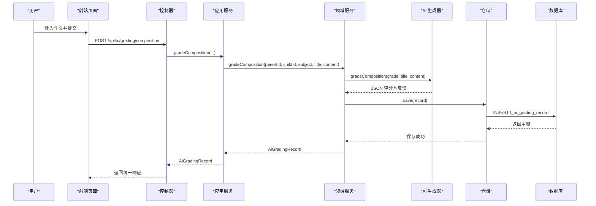
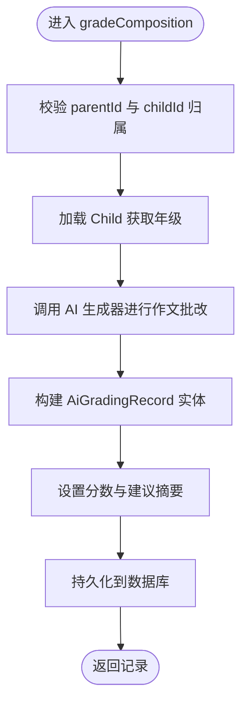
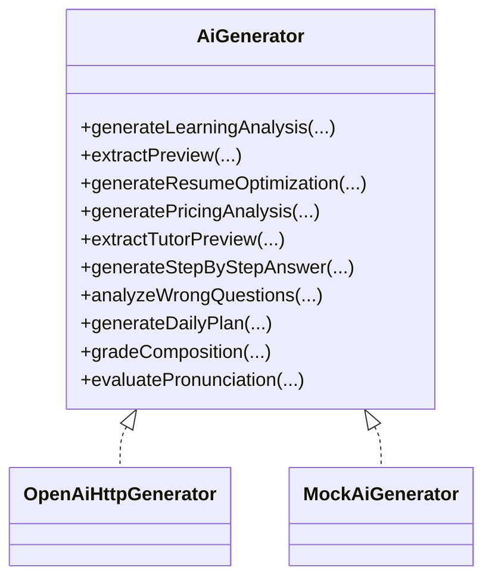
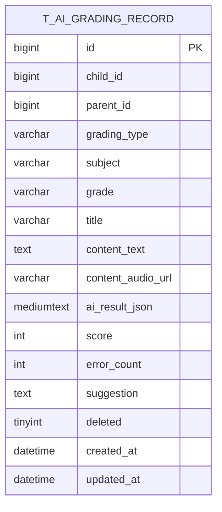
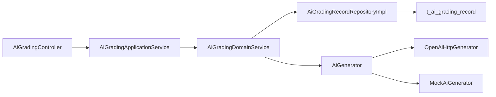

# 作文评分系统

<cite>
**本文引用的文件**
- [AiGradingController.java](file://wzoto-backend/wzoto-interfaces/src/main/java/com/wzoto/interfaces/controller/AiGradingController.java)
- [AiGradingApplicationService.java](file://wzoto-backend/wzoto-application/src/main/java/com/wzoto/application/service/AiGradingApplicationService.java)
- [AiGradingDomainService.java](file://wzoto-backend/wzoto-domain/src/main/java/com/wzoto/domain/service/AiGradingDomainService.java)
- [OpenAiHttpGenerator.java](file://wzoto-backend/wzoto-infrastructure/src/main/java/com/wzoto/infrastructure/ai/OpenAiHttpGenerator.java)
- [MockAiGenerator.java](file://wzoto-backend/wzoto-infrastructure/src/main/java/com/wzoto/infrastructure/ai/MockAiGenerator.java)
- [AiGenerator.java](file://wzoto-backend/wzoto-domain/src/main/java/com/wzoto/domain/repository/AiGenerator.java)
- [AiGradingRecord.java](file://wzoto-backend/wzoto-domain/src/main/java/com/wzoto/domain/entity/AiGradingRecord.java)
- [AiGradingType.java](file://wzoto-backend/wzoto-domain/src/main/java/com/wzoto/domain/valobj/AiGradingType.java)
- [AiGradingRecordRepositoryImpl.java](file://wzoto-backend/wzoto-infrastructure/src/main/java/com/wzoto/infrastructure/repository/AiGradingRecordRepositoryImpl.java)
- [CompositionGradeDTO.java](file://wzoto-backend/wzoto-interfaces/src/main/java/com/wzoto/interfaces/dto/CompositionGradeDTO.java)
- [t_ai_grading_record.sql](file://wzoto-backend/sql/t_ai_grading_record.sql)
- [WebMvcConfig.java](file://wzoto-backend/wzoto-infrastructure/src/main/java/com/wzoto/infrastructure/config/WebMvcConfig.java)
- [StudentCompositionPage.vue](file://wzoto-frontend/src/pages/student/StudentCompositionPage.vue)
</cite>

## 目录
1. [简介](#简介)
2. [项目结构](#项目结构)
3. [核心组件](#核心组件)
4. [架构总览](#架构总览)
5. [详细组件分析](#详细组件分析)
6. [依赖关系分析](#依赖关系分析)
7. [性能与扩展性](#性能与扩展性)
8. [故障排查指南](#故障排查指南)
9. [结论](#结论)
10. [附录：API 文档](#附录api-文档)

## 简介
本系统提供面向中小学学生的作文自动批改能力，支持作文提交、AI 评分与反馈、历史记录查询等。系统采用分层架构（接口层-应用层-领域层-基础设施层），通过统一的 AI 生成器接口对接不同实现（真实 OpenAI 兼容 API 或 Mock 实现），便于在不同环境灵活切换。

## 项目结构
后端采用 DDD 分层组织：
- 接口层：REST 控制器、请求 DTO、统一响应封装
- 应用层：编排业务流程、上下文注入
- 领域层：业务规则、实体、值对象、领域服务
- 基础设施层：数据库仓储、AI 调用实现、配置与拦截器

前端为 Vue 页面，包含作文输入、结果展示与历史记录查看。

图表来源
- [AiGradingController.java:16-41](file://wzoto-backend/wzoto-interfaces/src/main/java/com/wzoto/interfaces/controller/AiGradingController.java#L16-L41)
- [AiGradingApplicationService.java:12-39](file://wzoto-backend/wzoto-application/src/main/java/com/wzoto/application/service/AiGradingApplicationService.java#L12-L39)
- [AiGradingDomainService.java:15-89](file://wzoto-backend/wzoto-domain/src/main/java/com/wzoto/domain/service/AiGradingDomainService.java#L15-L89)
- [AiGradingRecordRepositoryImpl.java:16-96](file://wzoto-backend/wzoto-infrastructure/src/main/java/com/wzoto/infrastructure/repository/AiGradingRecordRepositoryImpl.java#L16-L96)
- [AiGenerator.java:1-37](file://wzoto-backend/wzoto-domain/src/main/java/com/wzoto/domain/repository/AiGenerator.java#L1-L37)
- [OpenAiHttpGenerator.java:18-394](file://wzoto-backend/wzoto-infrastructure/src/main/java/com/wzoto/infrastructure/ai/OpenAiHttpGenerator.java#L18-L394)
- [MockAiGenerator.java:8-302](file://wzoto-backend/wzoto-infrastructure/src/main/java/com/wzoto/infrastructure/ai/MockAiGenerator.java#L8-L302)
- [t_ai_grading_record.sql:1-28](file://wzoto-backend/sql/t_ai_grading_record.sql#L1-L28)

章节来源
- [AiGradingController.java:16-41](file://wzoto-backend/wzoto-interfaces/src/main/java/com/wzoto/interfaces/controller/AiGradingController.java#L16-L41)
- [WebMvcConfig.java:10-42](file://wzoto-backend/wzoto-infrastructure/src/main/java/com/wzoto/infrastructure/config/WebMvcConfig.java#L10-L42)

## 核心组件
- 控制器：暴露作文批改、口语评测、历史查询等 REST 接口
- 应用服务：承载用例流程，注入用户上下文并委派领域服务
- 领域服务：校验权限、组装参数、调用 AI 生成器、持久化记录
- AI 生成器：抽象出作文批改与口语评测的 AI 能力，支持真实 API 与 Mock
- 仓储：将领域实体映射到持久化对象，并提供查询方法
- 实体与值对象：表达批改记录、类型枚举等

章节来源
- [AiGradingController.java:16-41](file://wzoto-backend/wzoto-interfaces/src/main/java/com/wzoto/interfaces/controller/AiGradingController.java#L16-L41)
- [AiGradingApplicationService.java:12-39](file://wzoto-backend/wzoto-application/src/main/java/com/wzoto/application/service/AiGradingApplicationService.java#L12-L39)
- [AiGradingDomainService.java:15-89](file://wzoto-backend/wzoto-domain/src/main/java/com/wzoto/domain/service/AiGradingDomainService.java#L15-L89)
- [AiGenerator.java:1-37](file://wzoto-backend/wzoto-domain/src/main/java/com/wzoto/domain/repository/AiGenerator.java#L1-L37)
- [AiGradingRecord.java:12-67](file://wzoto-backend/wzoto-domain/src/main/java/com/wzoto/domain/entity/AiGradingRecord.java#L12-L67)
- [AiGradingType.java:5-31](file://wzoto-backend/wzoto-domain/src/main/java/com/wzoto/domain/valobj/AiGradingType.java#L5-L31)

## 架构总览
系统遵循“控制-编排-规则-实现”的分层模式，AI 能力通过接口解耦，可替换实现；数据访问通过仓储抽象，屏蔽持久化细节。

图表来源
- [AiGradingController.java:25-35](file://wzoto-backend/wzoto-interfaces/src/main/java/com/wzoto/interfaces/controller/AiGradingController.java#L25-L35)
- [AiGradingApplicationService.java:20-33](file://wzoto-backend/wzoto-application/src/main/java/com/wzoto/application/service/AiGradingApplicationService.java#L20-L33)
- [AiGradingDomainService.java:30-64](file://wzoto-backend/wzoto-domain/src/main/java/com/wzoto/domain/service/AiGradingDomainService.java#L30-L64)
- [OpenAiHttpGenerator.java:374-394](file://wzoto-backend/wzoto-infrastructure/src/main/java/com/wzoto/infrastructure/ai/OpenAiHttpGenerator.java#L374-L394)
- [AiGradingRecordRepositoryImpl.java:23-29](file://wzoto-backend/wzoto-infrastructure/src/main/java/com/wzoto/infrastructure/repository/AiGradingRecordRepositoryImpl.java#L23-L29)
- [t_ai_grading_record.sql:5-27](file://wzoto-backend/sql/t_ai_grading_record.sql#L5-L27)

## 详细组件分析

### 控制器层：作文批改入口
- 暴露三个接口：作文批改、口语评测、历史查询
- 使用统一响应封装，记录业务埋点日志
- 路径前缀 /api/ai/grading

章节来源
- [AiGradingController.java:16-41](file://wzoto-backend/wzoto-interfaces/src/main/java/com/wzoto/interfaces/controller/AiGradingController.java#L16-L41)

### 应用服务：用例编排
- 从上下文获取当前家长 ID，委托领域服务执行
- 提供按类型查询历史的扩展方法

章节来源
- [AiGradingApplicationService.java:12-39](file://wzoto-backend/wzoto-application/src/main/java/com/wzoto/application/service/AiGradingApplicationService.java#L12-L39)

### 领域服务：业务规则与流程
- 校验子女归属权
- 根据年级信息选择合适提示词/模型策略（可扩展）
- 调用 AI 生成器获得结构化结果
- 创建并保存批改记录，设置分数与建议摘要

图表来源
- [AiGradingDomainService.java:30-64](file://wzoto-backend/wzoto-domain/src/main/java/com/wzoto/domain/service/AiGradingDomainService.java#L30-L64)
- [AiGradingRecord.java:37-65](file://wzoto-backend/wzoto-domain/src/main/java/com/wzoto/domain/entity/AiGradingRecord.java#L37-L65)

章节来源
- [AiGradingDomainService.java:15-89](file://wzoto-backend/wzoto-domain/src/main/java/com/wzoto/domain/service/AiGradingDomainService.java#L15-L89)

### AI 生成器：自然语言处理与评分
- 接口定义：学习分析、简历优化、定价分析、启发式答疑、错题分析、学习计划、作文批改、口语评测
- 真实实现：基于 OkHttp 调用 OpenAI 兼容接口，支持自定义 base-url、model、temperature，失败时降级返回结构化默认内容
- Mock 实现：开发环境无需 API Key，返回模拟 JSON 结果

图表来源
- [AiGenerator.java:1-37](file://wzoto-backend/wzoto-domain/src/main/java/com/wzoto/domain/repository/AiGenerator.java#L1-L37)
- [OpenAiHttpGenerator.java:18-394](file://wzoto-backend/wzoto-infrastructure/src/main/java/com/wzoto/infrastructure/ai/OpenAiHttpGenerator.java#L18-L394)
- [MockAiGenerator.java:8-302](file://wzoto-backend/wzoto-infrastructure/src/main/java/com/wzoto/infrastructure/ai/MockAiGenerator.java#L8-L302)

章节来源
- [AiGenerator.java:1-37](file://wzoto-backend/wzoto-domain/src/main/java/com/wzoto/domain/repository/AiGenerator.java#L1-L37)
- [OpenAiHttpGenerator.java:374-394](file://wzoto-backend/wzoto-infrastructure/src/main/java/com/wzoto/infrastructure/ai/OpenAiHttpGenerator.java#L374-L394)
- [MockAiGenerator.java:248-302](file://wzoto-backend/wzoto-infrastructure/src/main/java/com/wzoto/infrastructure/ai/MockAiGenerator.java#L248-L302)

### 仓储与数据模型
- 仓储实现：将领域实体转换为 PO，使用 MyBatis-Plus 进行增删改查，支持按子女 ID 和类型查询
- 数据表：存储批改类型、学科、年级、标题、文本/音频、AI 结果 JSON、分数、错误数、建议等字段，并建立常用索引

图表来源
- [t_ai_grading_record.sql:5-27](file://wzoto-backend/sql/t_ai_grading_record.sql#L5-L27)

章节来源
- [AiGradingRecordRepositoryImpl.java:16-96](file://wzoto-backend/wzoto-infrastructure/src/main/java/com/wzoto/infrastructure/repository/AiGradingRecordRepositoryImpl.java#L16-L96)
- [t_ai_grading_record.sql:1-28](file://wzoto-backend/sql/t_ai_grading_record.sql#L1-L28)

### 前端交互：作文批改页面
- 选择子女、输入标题与正文、字数统计与提交校验
- 调用后端接口后解析 AI 结果 JSON，展示分数、错别字、病句修正、优化建议
- 展示历史批改记录，支持回看

章节来源
- [StudentCompositionPage.vue:1-263](file://wzoto-frontend/src/pages/student/StudentCompositionPage.vue#L1-L263)

## 依赖关系分析
- 控制器依赖应用服务
- 应用服务依赖领域服务
- 领域服务依赖仓储与 AI 生成器接口
- 仓储依赖 Mapper 与数据库
- AI 生成器在运行时根据配置选择真实或 Mock 实现

图表来源
- [AiGradingController.java:16-41](file://wzoto-backend/wzoto-interfaces/src/main/java/com/wzoto/interfaces/controller/AiGradingController.java#L16-L41)
- [AiGradingApplicationService.java:12-39](file://wzoto-backend/wzoto-application/src/main/java/com/wzoto/application/service/AiGradingApplicationService.java#L12-L39)
- [AiGradingDomainService.java:15-89](file://wzoto-backend/wzoto-domain/src/main/java/com/wzoto/domain/service/AiGradingDomainService.java#L15-L89)
- [AiGradingRecordRepositoryImpl.java:16-96](file://wzoto-backend/wzoto-infrastructure/src/main/java/com/wzoto/infrastructure/repository/AiGradingRecordRepositoryImpl.java#L16-L96)
- [AiGenerator.java:1-37](file://wzoto-backend/wzoto-domain/src/main/java/com/wzoto/domain/repository/AiGenerator.java#L1-L37)

章节来源
- [WebMvcConfig.java:10-42](file://wzoto-backend/wzoto-infrastructure/src/main/java/com/wzoto/infrastructure/config/WebMvcConfig.java#L10-L42)

## 性能与扩展性
- 批量化处理
  - 可在应用层对批量作文进行队列化处理，避免瞬时高并发导致 AI 接口限流
  - 建议在领域服务中增加批量方法，结合消息队列异步写入仓储
- 结果缓存
  - 针对相同 childId+title+content 的请求，可在应用层引入本地缓存（如 Caffeine）或分布式缓存（如 Redis），减少重复 AI 调用
  - 缓存键需包含版本与模型标识，防止模型升级导致结果不一致
- 超时与重试
  - 基础设施层的 HTTP 客户端已设置连接与读取超时，建议在应用层增加幂等重试与熔断机制
- 模型选择与配置
  - 通过配置项切换 base-url、model、temperature，便于针对不同年级与难度选择更合适的模型
  - 可在领域服务中根据年级动态调整提示词与评分权重

[本节为通用指导，不直接分析具体文件]

## 故障排查指南
- 无法访问 AI 接口
  - 检查 wzoto.ai.enabled 配置是否开启
  - 核对 base-url、apiKey、model 是否正确
  - 查看日志中的状态码与响应体，确认网络与鉴权
- 返回结果为空或异常
  - 确认 AI 接口返回 JSON 结构是否符合预期
  - 若启用 Mock，确认条件属性匹配，确保开发环境可用
- 权限问题
  - 校验 parentId 与 childId 归属关系，确保当前登录用户有权操作该子女档案
- CORS 跨域
  - 确认 WebMvcConfig 已放行必要路径与允许的来源

章节来源
- [OpenAiHttpGenerator.java:28-39](file://wzoto-backend/wzoto-infrastructure/src/main/java/com/wzoto/infrastructure/ai/OpenAiHttpGenerator.java#L28-L39)
- [WebMvcConfig.java:21-41](file://wzoto-backend/wzoto-infrastructure/src/main/java/com/wzoto/infrastructure/config/WebMvcConfig.java#L21-L41)
- [AiGradingDomainService.java:82-87](file://wzoto-backend/wzoto-domain/src/main/java/com/wzoto/domain/service/AiGradingDomainService.java#L82-L87)

## 结论
本系统以清晰的分层架构与可插拔的 AI 生成器实现了作文自动批改能力，支持真实 API 与 Mock 双实现，具备较好的可维护性与扩展性。后续可通过批处理、缓存、重试与模型策略配置进一步提升稳定性与性能。

[本节为总结，不直接分析具体文件]

## 附录：API 文档

### 基础信息
- 基础路径：/api/ai/grading
- 认证：除登录相关路径外，其他接口受 JWT 拦截器保护
- 响应格式：统一包装对象

章节来源
- [WebMvcConfig.java:21-30](file://wzoto-backend/wzoto-infrastructure/src/main/java/com/wzoto/infrastructure/config/WebMvcConfig.java#L21-L30)
- [AiGradingController.java:16-41](file://wzoto-backend/wzoto-interfaces/src/main/java/com/wzoto/interfaces/controller/AiGradingController.java#L16-L41)

### 接口列表

#### 作文批改
- 方法：POST
- 路径：/api/ai/grading/composition
- 请求体：CompositionGradeDTO
  - childId：必填，子女 ID
  - subject：必填，学科
  - title：必填，作文标题
  - content：必填，作文内容
- 响应：AiGradingRecord
  - 关键字段：score、aiResultJson、suggestion、createdAt

章节来源
- [AiGradingController.java:25-29](file://wzoto-backend/wzoto-interfaces/src/main/java/com/wzoto/interfaces/controller/AiGradingController.java#L25-L29)
- [CompositionGradeDTO.java:7-19](file://wzoto-backend/wzoto-interfaces/src/main/java/com/wzoto/interfaces/dto/CompositionGradeDTO.java#L7-L19)
- [AiGradingRecord.java:12-67](file://wzoto-backend/wzoto-domain/src/main/java/com/wzoto/domain/entity/AiGradingRecord.java#L12-L67)

#### 口语评测
- 方法：POST
- 路径：/api/ai/grading/pronunciation
- 请求体：PronunciationEvalDTO（字段见控制器签名）
- 响应：AiGradingRecord

章节来源
- [AiGradingController.java:31-35](file://wzoto-backend/wzoto-interfaces/src/main/java/com/wzoto/interfaces/controller/AiGradingController.java#L31-L35)

#### 查询批改历史
- 方法：GET
- 路径：/api/ai/grading/history/{childId}
- 响应：List<AiGradingRecord>

章节来源
- [AiGradingController.java:37-40](file://wzoto-backend/wzoto-interfaces/src/main/java/com/wzoto/interfaces/controller/AiGradingController.java#L37-L40)

### 评分维度与结果说明
- 评分维度：内容完整性、语言表达、逻辑结构、创意性等（由 AI 输出 JSON 中的字段体现）
- 结果字段：score、highlights、errors、suggestions、overallComment（示例结构见 AI 实现）
- 前端展示：分数进度条、错别字对照、病句修正、优化建议

章节来源
- [StudentCompositionPage.vue:33-84](file://wzoto-frontend/src/pages/student/StudentCompositionPage.vue#L33-L84)
- [OpenAiHttpGenerator.java:374-394](file://wzoto-backend/wzoto-infrastructure/src/main/java/com/wzoto/infrastructure/ai/OpenAiHttpGenerator.java#L374-L394)
- [MockAiGenerator.java:248-302](file://wzoto-backend/wzoto-infrastructure/src/main/java/com/wzoto/infrastructure/ai/MockAiGenerator.java#L248-L302)

### 评分规则配置与自定义标准
- 模型与温度：通过配置项 model、temperature 控制生成风格与创造性
- 提示词工程：在 AI 生成器中定制 prompt，针对不同文体（记叙文、议论文、说明文）设定差异化评分权重
- 年级适配：领域服务可根据年级选择不同提示词模板或评分策略
- 开关控制：wzoto.ai.enabled 控制启用真实 API 或 Mock 实现

章节来源
- [OpenAiHttpGenerator.java:28-39](file://wzoto-backend/wzoto-infrastructure/src/main/java/com/wzoto/infrastructure/ai/OpenAiHttpGenerator.java#L28-L39)
- [AiGradingDomainService.java:30-44](file://wzoto-backend/wzoto-domain/src/main/java/com/wzoto/domain/service/AiGradingDomainService.java#L30-L44)
- [MockAiGenerator.java:8-15](file://wzoto-backend/wzoto-infrastructure/src/main/java/com/wzoto/infrastructure/ai/MockAiGenerator.java#L8-L15)

### 批量评分优化与结果缓存策略
- 批量评分
  - 建议在应用层新增批量接口，接收多条作文数据，内部串行或并行调用 AI 生成器，并将结果批量写入数据库
  - 结合消息队列实现削峰填谷，避免瞬时压力
- 结果缓存
  - 以 childId+title+content 作为缓存键，命中则直接返回缓存结果
  - 缓存失效策略：模型升级或提示词变更时清理对应缓存
  - 注意敏感信息与隐私合规

[本节为通用指导，不直接分析具体文件]