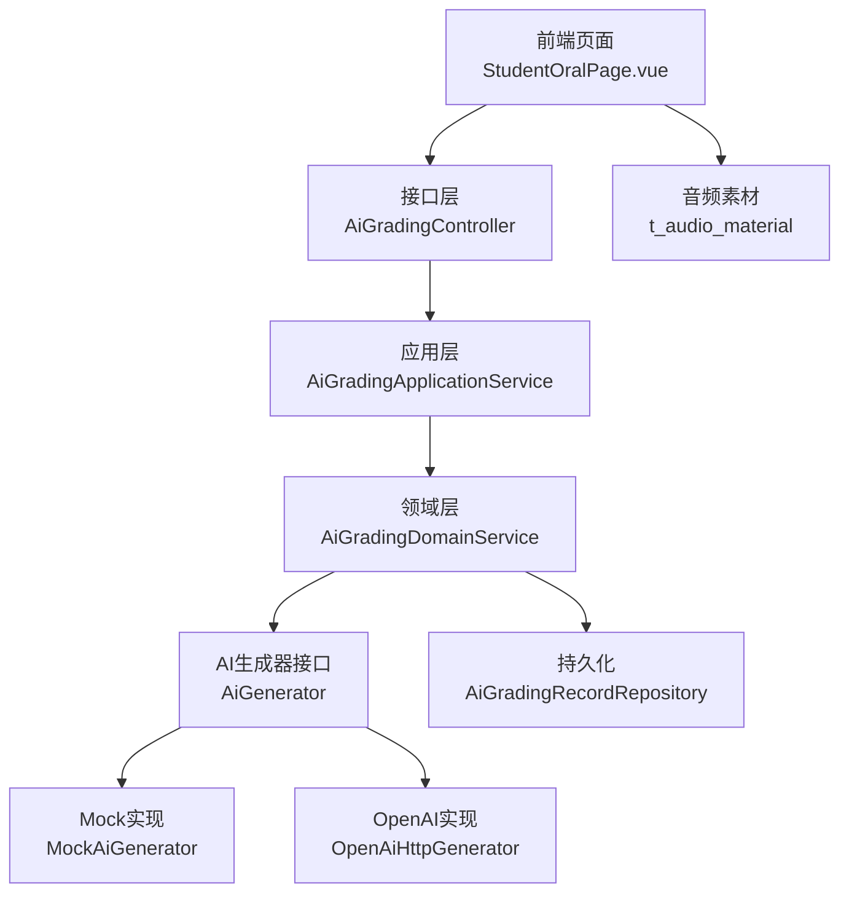
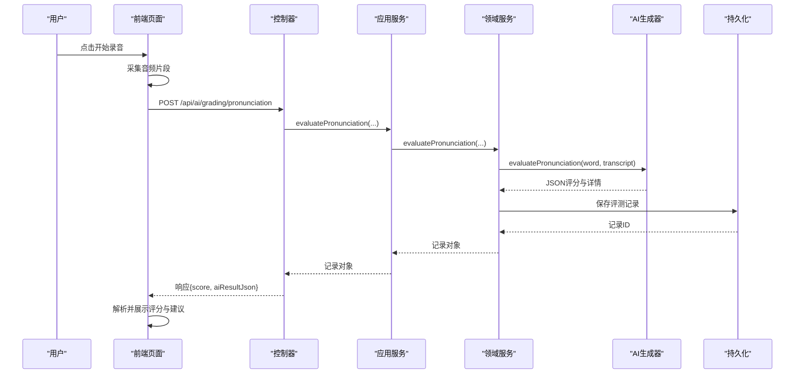
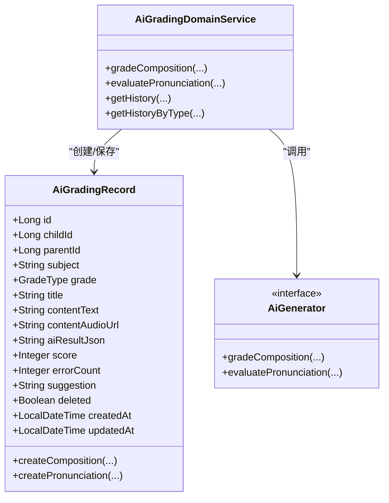
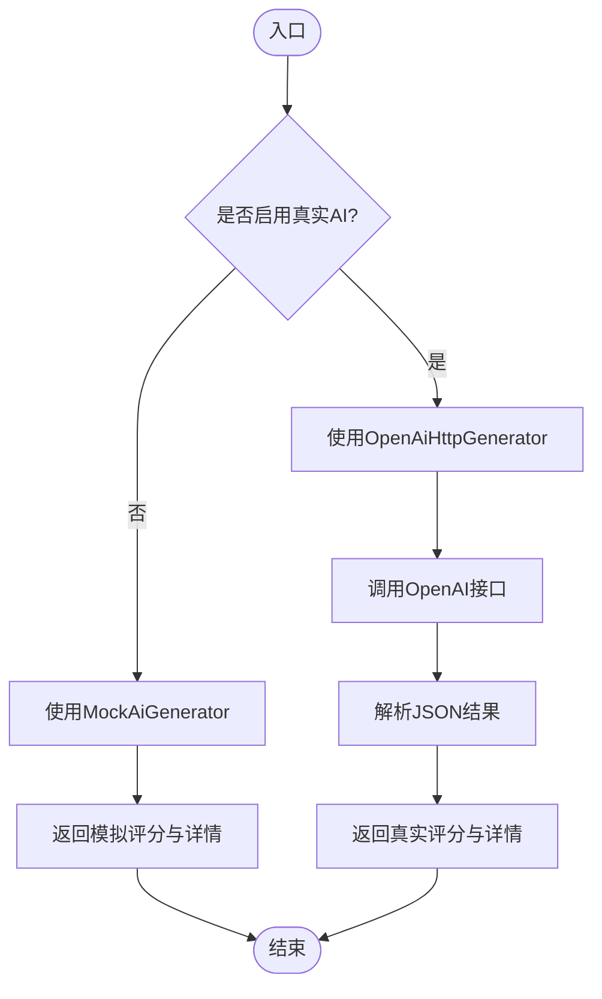
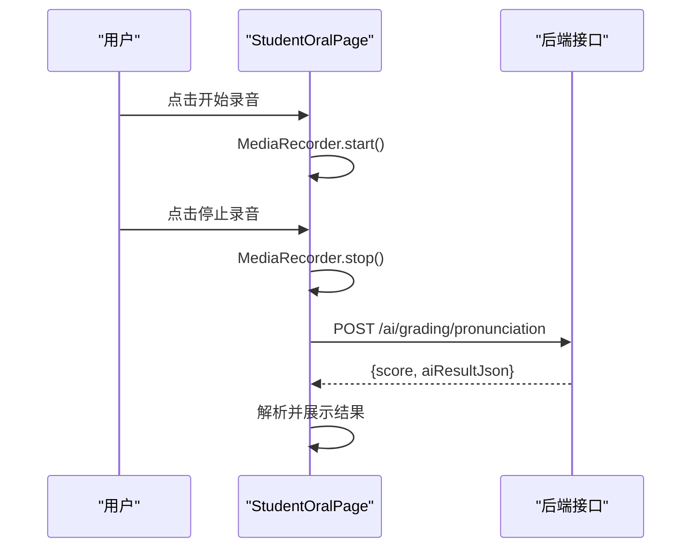
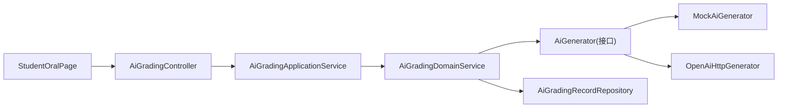

# 口语评测系统

<cite>
**本文引用的文件**
- [AiGradingController.java](file://wzoto-backend/wzoto-interfaces/src/main/java/com/wzoto/interfaces/controller/AiGradingController.java)
- [AiGradingApplicationService.java](file://wzoto-backend/wzoto-application/src/main/java/com/wzoto/application/service/AiGradingApplicationService.java)
- [AiGradingDomainService.java](file://wzoto-backend/wzoto-domain/src/main/java/com/wzoto/domain/service/AiGradingDomainService.java)
- [AiGradingRecord.java](file://wzoto-backend/wzoto-domain/src/main/java/com/wzoto/domain/entity/AiGradingRecord.java)
- [PronunciationEvalDTO.java](file://wzoto-backend/wzoto-interfaces/src/main/java/com/wzoto/interfaces/dto/PronunciationEvalDTO.java)
- [SpeechService.java](file://wzoto-backend/wzoto-infrastructure/src/main/java/com/wzoto/infrastructure/ai/SpeechService.java)
- [MockAiGenerator.java](file://wzoto-backend/wzoto-infrastructure/src/main/java/com/wzoto/infrastructure/ai/MockAiGenerator.java)
- [OpenAiHttpGenerator.java](file://wzoto-backend/wzoto-infrastructure/src/main/java/com/wzoto/infrastructure/ai/OpenAiHttpGenerator.java)
- [AiGenerator.java](file://wzoto-backend/wzoto-domain/src/main/java/com/wzoto/domain/repository/AiGenerator.java)
- [StudentOralPage.vue](file://wzoto-frontend/src/pages/student/StudentOralPage.vue)
- [student.js](file://wzoto-frontend/src/api/student.js)
- [t_audio_material.sql](file://wzoto-backend/sql/t_audio_material.sql)
- [AudioMaterialRepositoryImpl.java](file://wzoto-backend/wzoto-infrastructure/src/main/java/com/wzoto/infrastructure/repository/AudioMaterialRepositoryImpl.java)
</cite>

## 目录
1. [简介](#简介)
2. [项目结构](#项目结构)
3. [核心组件](#核心组件)
4. [架构总览](#架构总览)
5. [详细组件分析](#详细组件分析)
6. [依赖关系分析](#依赖关系分析)
7. [性能与实时优化](#性能与实时优化)
8. [故障排查指南](#故障排查指南)
9. [结论](#结论)
10. [附录：接口文档与最佳实践](#附录接口文档与最佳实践)

## 简介
本系统提供面向多语言（英语、中文等）的口语评测能力，覆盖音频预处理、语音转文字、发音准确度分析与多维度评分。前端支持录音与播放参考音频，后端通过分层架构将请求路由到领域服务，调用AI生成器完成评测并持久化结果。当前基础设施层提供Mock实现，便于开发调试；同时预留真实ASR与评测引擎接入点。

## 项目结构
系统采用前后端分离与DDD分层设计：
- 前端：Vue页面负责录音、播放参考音频、发起评测请求与展示结果
- 接口层：REST控制器暴露评测与历史查询接口
- 应用层：编排用例，注入用户上下文与领域服务
- 领域层：业务规则、实体与仓储接口
- 基础设施层：AI生成器实现（Mock/真实）、语音服务、数据访问

图表来源
- [StudentOralPage.vue:1-265](file://wzoto-frontend/src/pages/student/StudentOralPage.vue#L1-L265)
- [AiGradingController.java:1-42](file://wzoto-backend/wzoto-interfaces/src/main/java/com/wzoto/interfaces/controller/AiGradingController.java#L1-L42)
- [AiGradingApplicationService.java:1-40](file://wzoto-backend/wzoto-application/src/main/java/com/wzoto/application/service/AiGradingApplicationService.java#L1-L40)
- [AiGradingDomainService.java:1-89](file://wzoto-backend/wzoto-domain/src/main/java/com/wzoto/domain/service/AiGradingDomainService.java#L1-L89)
- [AiGenerator.java:1-37](file://wzoto-backend/wzoto-domain/src/main/java/com/wzoto/domain/repository/AiGenerator.java#L1-L37)
- [MockAiGenerator.java:1-302](file://wzoto-backend/wzoto-infrastructure/src/main/java/com/wzoto/infrastructure/ai/MockAiGenerator.java#L1-L302)
- [OpenAiHttpGenerator.java:377-394](file://wzoto-backend/wzoto-infrastructure/src/main/java/com/wzoto/infrastructure/ai/OpenAiHttpGenerator.java#L377-L394)
- [t_audio_material.sql:1-24](file://wzoto-backend/sql/t_audio_material.sql#L1-L24)

章节来源
- [AiGradingController.java:1-42](file://wzoto-backend/wzoto-interfaces/src/main/java/com/wzoto/interfaces/controller/AiGradingController.java#L1-L42)
- [StudentOralPage.vue:1-265](file://wzoto-frontend/src/pages/student/StudentOralPage.vue#L1-L265)
- [t_audio_material.sql:1-24](file://wzoto-backend/sql/t_audio_material.sql#L1-L24)

## 核心组件
- 控制器：提供作文批改与口语评测、历史记录查询等REST接口
- 应用服务：封装用例流程，注入用户上下文并调用领域服务
- 领域服务：校验权限、获取学生年级信息、调用AI生成器进行评测、保存记录
- AI生成器接口：定义作文批改与口语评测方法，由基础设施层提供具体实现
- 语音服务：预留ASR与评测打分接口，当前为Mock实现
- 前端页面：录音、播放参考音频、提交评测请求、展示评分与建议

章节来源
- [AiGradingController.java:16-42](file://wzoto-backend/wzoto-interfaces/src/main/java/com/wzoto/interfaces/controller/AiGradingController.java#L16-L42)
- [AiGradingApplicationService.java:12-40](file://wzoto-backend/wzoto-application/src/main/java/com/wzoto/application/service/AiGradingApplicationService.java#L12-L40)
- [AiGradingDomainService.java:15-89](file://wzoto-backend/wzoto-domain/src/main/java/com/wzoto/domain/service/AiGradingDomainService.java#L15-L89)
- [AiGenerator.java:1-37](file://wzoto-backend/wzoto-domain/src/main/java/com/wzoto/domain/repository/AiGenerator.java#L1-L37)
- [SpeechService.java:1-39](file://wzoto-backend/wzoto-infrastructure/src/main/java/com/wzoto/infrastructure/ai/SpeechService.java#L1-L39)
- [StudentOralPage.vue:83-206](file://wzoto-frontend/src/pages/student/StudentOralPage.vue#L83-L206)

## 架构总览
系统遵循“接口层-应用层-领域层-基础设施层”的分层模式，结合DDD思想组织代码。口语评测的关键路径如下：
- 前端使用浏览器MediaRecorder采集音频，选择材料后发起评测请求
- 控制器接收请求，应用服务提取用户上下文并委派给领域服务
- 领域服务校验所有权、读取学生年级信息，调用AI生成器进行评测
- 基础设施层根据配置选择Mock或OpenAI实现，返回结构化JSON结果
- 领域服务将结果写入持久化存储，返回给前端展示

图表来源
- [AiGradingController.java:31-35](file://wzoto-backend/wzoto-interfaces/src/main/java/com/wzoto/interfaces/controller/AiGradingController.java#L31-L35)
- [AiGradingApplicationService.java:25-28](file://wzoto-backend/wzoto-application/src/main/java/com/wzoto/application/service/AiGradingApplicationService.java#L25-L28)
- [AiGradingDomainService.java:47-64](file://wzoto-backend/wzoto-domain/src/main/java/com/wzoto/domain/service/AiGradingDomainService.java#L47-L64)
- [AiGenerator.java:34-35](file://wzoto-backend/wzoto-domain/src/main/java/com/wzoto/domain/repository/AiGenerator.java#L34-L35)
- [MockAiGenerator.java:277-300](file://wzoto-backend/wzoto-infrastructure/src/main/java/com/wzoto/infrastructure/ai/MockAiGenerator.java#L277-L300)
- [OpenAiHttpGenerator.java:384-393](file://wzoto-backend/wzoto-infrastructure/src/main/java/com/wzoto/infrastructure/ai/OpenAiHttpGenerator.java#L384-L393)

## 详细组件分析

### 控制器与接口
- 作文批改：POST /api/ai/grading/composition
- 口语评测：POST /api/ai/grading/pronunciation
- 历史记录：GET /api/ai/grading/history/{childId}

请求体字段（口语评测）：
- childId：必填，子女ID
- title：可选，标题
- audioUrl：可选，音频URL
- audioTranscript：可选，识别文本（若前端已做ASR可传入）

响应体包含：
- score：整数评分
- aiResultJson：结构化JSON，包含发音细节、建议等

章节来源
- [AiGradingController.java:25-40](file://wzoto-backend/wzoto-interfaces/src/main/java/com/wzoto/interfaces/controller/AiGradingController.java#L25-L40)
- [PronunciationEvalDTO.java:6-14](file://wzoto-backend/wzoto-interfaces/src/main/java/com/wzoto/interfaces/dto/PronunciationEvalDTO.java#L6-L14)

### 应用服务
- 职责：从用户上下文获取parentId，委托领域服务执行用例
- 关键方法：gradeComposition、evaluatePronunciation、getHistory、getHistoryByType

章节来源
- [AiGradingApplicationService.java:12-40](file://wzoto-backend/wzoto-application/src/main/java/com/wzoto/application/service/AiGradingApplicationService.java#L12-L40)

### 领域服务与实体
- 领域服务：校验父子关系、获取年级信息、调用AI生成器、创建并保存评测记录
- 实体：AiGradingRecord，包含作文与口语两种类型，支持内容文本、音频URL、评分、错误数、建议等字段

图表来源
- [AiGradingRecord.java:12-67](file://wzoto-backend/wzoto-domain/src/main/java/com/wzoto/domain/entity/AiGradingRecord.java#L12-L67)
- [AiGradingDomainService.java:15-89](file://wzoto-backend/wzoto-domain/src/main/java/com/wzoto/domain/service/AiGradingDomainService.java#L15-L89)
- [AiGenerator.java:1-37](file://wzoto-backend/wzoto-domain/src/main/java/com/wzoto/domain/repository/AiGenerator.java#L1-L37)

章节来源
- [AiGradingDomainService.java:27-89](file://wzoto-backend/wzoto-domain/src/main/java/com/wzoto/domain/service/AiGradingDomainService.java#L27-L89)
- [AiGradingRecord.java:12-67](file://wzoto-backend/wzoto-domain/src/main/java/com/wzoto/domain/entity/AiGradingRecord.java#L12-L67)

### AI生成器与语音服务
- 接口：AiGenerator定义作文批改与口语评测方法
- Mock实现：在开发环境默认启用，返回结构化JSON评分与建议
- OpenAI实现：生产环境可通过配置切换，调用外部API进行评测
- 语音服务：SpeechService提供ASR与评测打分接口，当前为Mock，便于扩展讯飞/百度等第三方服务

图表来源
- [MockAiGenerator.java:14-15](file://wzoto-backend/wzoto-infrastructure/src/main/java/com/wzoto/infrastructure/ai/MockAiGenerator.java#L14-L15)
- [OpenAiHttpGenerator.java:384-393](file://wzoto-backend/wzoto-infrastructure/src/main/java/com/wzoto/infrastructure/ai/OpenAiHttpGenerator.java#L384-L393)
- [SpeechService.java:14-37](file://wzoto-backend/wzoto-infrastructure/src/main/java/com/wzoto/infrastructure/ai/SpeechService.java#L14-L37)

章节来源
- [AiGenerator.java:1-37](file://wzoto-backend/wzoto-domain/src/main/java/com/wzoto/domain/repository/AiGenerator.java#L1-L37)
- [MockAiGenerator.java:248-300](file://wzoto-backend/wzoto-infrastructure/src/main/java/com/wzoto/infrastructure/ai/MockAiGenerator.java#L248-L300)
- [OpenAiHttpGenerator.java:377-394](file://wzoto-backend/wzoto-infrastructure/src/main/java/com/wzoto/infrastructure/ai/OpenAiHttpGenerator.java#L377-L394)
- [SpeechService.java:1-39](file://wzoto-backend/wzoto-infrastructure/src/main/java/com/wzoto/infrastructure/ai/SpeechService.java#L1-L39)

### 前端交互与录音流程
- 选择材料与参考文本
- 使用MediaRecorder采集音频，计时显示
- 停止录音后调用后端评测接口
- 解析aiResultJson并展示评分、流利度、建议等

图表来源
- [StudentOralPage.vue:147-206](file://wzoto-frontend/src/pages/student/StudentOralPage.vue#L147-L206)
- [student.js:27-29](file://wzoto-frontend/src/api/student.js#L27-L29)

章节来源
- [StudentOralPage.vue:1-265](file://wzoto-frontend/src/pages/student/StudentOralPage.vue#L1-L265)
- [student.js:21-33](file://wzoto-frontend/src/api/student.js#L21-L33)

## 依赖关系分析
- 控制器依赖应用服务
- 应用服务依赖领域服务
- 领域服务依赖AI生成器接口与仓储
- 基础设施层提供AI生成器的具体实现与语音服务
- 前端依赖后端接口与音频素材表

图表来源
- [AiGradingController.java:16-42](file://wzoto-backend/wzoto-interfaces/src/main/java/com/wzoto/interfaces/controller/AiGradingController.java#L16-L42)
- [AiGradingApplicationService.java:12-40](file://wzoto-backend/wzoto-application/src/main/java/com/wzoto/application/service/AiGradingApplicationService.java#L12-L40)
- [AiGradingDomainService.java:15-89](file://wzoto-backend/wzoto-domain/src/main/java/com/wzoto/domain/service/AiGradingDomainService.java#L15-L89)
- [AiGenerator.java:1-37](file://wzoto-backend/wzoto-domain/src/main/java/com/wzoto/domain/repository/AiGenerator.java#L1-L37)
- [MockAiGenerator.java:1-302](file://wzoto-backend/wzoto-infrastructure/src/main/java/com/wzoto/infrastructure/ai/MockAiGenerator.java#L1-L302)
- [OpenAiHttpGenerator.java:377-394](file://wzoto-backend/wzoto-infrastructure/src/main/java/com/wzoto/infrastructure/ai/OpenAiHttpGenerator.java#L377-L394)

章节来源
- [AiGradingController.java:16-42](file://wzoto-backend/wzoto-interfaces/src/main/java/com/wzoto/interfaces/controller/AiGradingController.java#L16-L42)
- [AiGradingDomainService.java:15-89](file://wzoto-backend/wzoto-domain/src/main/java/com/wzoto/domain/service/AiGradingDomainService.java#L15-L89)

## 性能与实时优化
- 流式处理方案
  - 前端分片上传：将长音频切分为小段，边录边传，降低内存占用与超时风险
  - 服务端流式ASR：对接支持流式的语音识别服务，逐步输出文本，减少等待时间
  - 增量评测：对每段文本进行局部评测，合并得到整体分数，提升响应速度
- 缓存与重试
  - 对相同音频URL的评测结果进行缓存，避免重复计算
  - 对AI调用失败实施指数退避重试，提高鲁棒性
- 资源限制
  - 限制单次录音时长与文件大小，防止滥用
  - 并发控制：对评测接口设置限流，保护后端资源
- 前端体验优化
  - 录音时显示倒计时与波形反馈
  - 网络异常时提示并重试
  - 离线缓存最近评测结果，弱网下仍可展示

[本节为通用指导，不直接分析具体文件]

## 故障排查指南
- 无法访问麦克风
  - 检查浏览器权限与HTTPS环境
  - 确认getUserMedia调用成功
- 评测失败
  - 检查请求参数是否完整（childId、title、audioTranscript）
  - 查看后端日志，确认AI生成器是否可用
  - 若使用OpenAI实现，检查API Key与网络连通性
- 结果解析异常
  - 确认aiResultJson格式正确
  - 前端增加容错逻辑，降级展示基础评分与建议
- 音频素材问题
  - 检查t_audio_material表中音频URL是否有效
  - 确认音频格式与时长符合预期

章节来源
- [StudentOralPage.vue:155-171](file://wzoto-frontend/src/pages/student/StudentOralPage.vue#L155-L171)
- [MockAiGenerator.java:277-300](file://wzoto-backend/wzoto-infrastructure/src/main/java/com/wzoto/infrastructure/ai/MockAiGenerator.java#L277-L300)
- [OpenAiHttpGenerator.java:384-393](file://wzoto-backend/wzoto-infrastructure/src/main/java/com/wzoto/infrastructure/ai/OpenAiHttpGenerator.java#L384-L393)
- [t_audio_material.sql:1-24](file://wzoto-backend/sql/t_audio_material.sql#L1-L24)

## 结论
本系统实现了完整的口语评测闭环：前端录音与展示、后端分层处理、AI生成器评估与结果持久化。当前以Mock实现为主，便于快速迭代；生产环境可无缝切换到OpenAI或其他专业语音评测服务。通过流式处理、缓存与重试机制，可进一步提升实时性与稳定性。

[本节为总结，不直接分析具体文件]

## 附录：接口文档与最佳实践

### 接口清单
- 作文批改
  - 方法：POST
  - 路径：/api/ai/grading/composition
  - 请求体：subject、title、content
  - 响应：AiGradingRecord
- 口语评测
  - 方法：POST
  - 路径：/api/ai/grading/pronunciation
  - 请求体：childId、title、audioUrl、audioTranscript
  - 响应：AiGradingRecord
- 历史记录
  - 方法：GET
  - 路径：/api/ai/grading/history/{childId}
  - 响应：List<AiGradingRecord>

章节来源
- [AiGradingController.java:25-40](file://wzoto-backend/wzoto-interfaces/src/main/java/com/wzoto/interfaces/controller/AiGradingController.java#L25-L40)
- [student.js:21-33](file://wzoto-frontend/src/api/student.js#L21-L33)

### 评测指标说明
- 发音准确度：基于音素级对比与识别文本匹配度
- 流利度：语速、停顿、连贯性
- 语调：重音、节奏、抑扬顿挫
- 语速：每分钟音节数或词数
- 综合评分：加权融合上述维度，输出0-100分

[本节为概念说明，不直接分析具体文件]

### 多语言支持
- 英语：当前示例与数据结构围绕英语跟读与评测
- 中文：通过调整AI生成器提示词与参考文本，可扩展至中文口语评测
- 扩展方式：在AiGenerator实现中针对不同语言定制Prompt与评分规则

章节来源
- [AiGradingRecord.java:52-64](file://wzoto-backend/wzoto-domain/src/main/java/com/wzoto/domain/entity/AiGradingRecord.java#L52-L64)
- [MockAiGenerator.java:277-300](file://wzoto-backend/wzoto-infrastructure/src/main/java/com/wzoto/infrastructure/ai/MockAiGenerator.java#L277-L300)

### 音频格式支持
- 前端录音：浏览器MediaRecorder，通常输出WebM/Opus或MP4/AAC，取决于浏览器与平台
- 后端兼容：当前接口接受audioUrl与audioTranscript，未直接处理二进制上传
- 建议：统一转换为常见格式（如MP3/WAV），并在OSS或CDN托管，确保跨平台兼容

章节来源
- [StudentOralPage.vue:155-171](file://wzoto-frontend/src/pages/student/StudentOralPage.vue#L155-L171)
- [t_audio_material.sql:1-24](file://wzoto-backend/sql/t_audio_material.sql#L1-L24)

### 音频质量要求与最佳实践
- 采样率：建议16kHz或以上，保证清晰度
- 噪声控制：尽量在安静环境录音，必要时加入降噪算法
- 时长限制：单次录音建议不超过60秒，过长可分段
- 格式规范：优先使用MP3或WAV，便于后续处理
- 传输优化：使用HTTPS与CDN加速，减少延迟

[本节为通用指导，不直接分析具体文件]

### 实时评测优化与流式处理方案
- 前端分片上传：按固定时长切片，边录边传
- 服务端流式ASR：对接支持流式的语音识别服务，逐步输出文本
- 增量评测：对每段文本进行局部评测，合并得到整体分数
- 缓存与去重：对相同音频指纹的结果进行缓存
- 降级策略：当AI服务不可用时，回退到Mock实现并提示用户

[本节为通用指导，不直接分析具体文件]