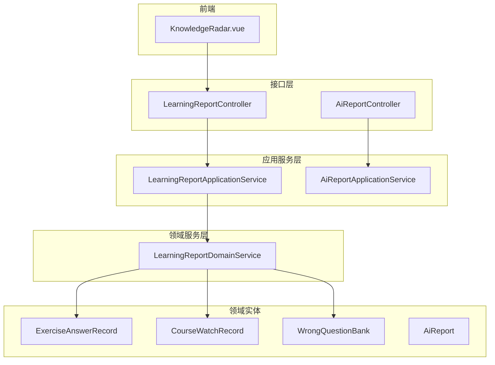
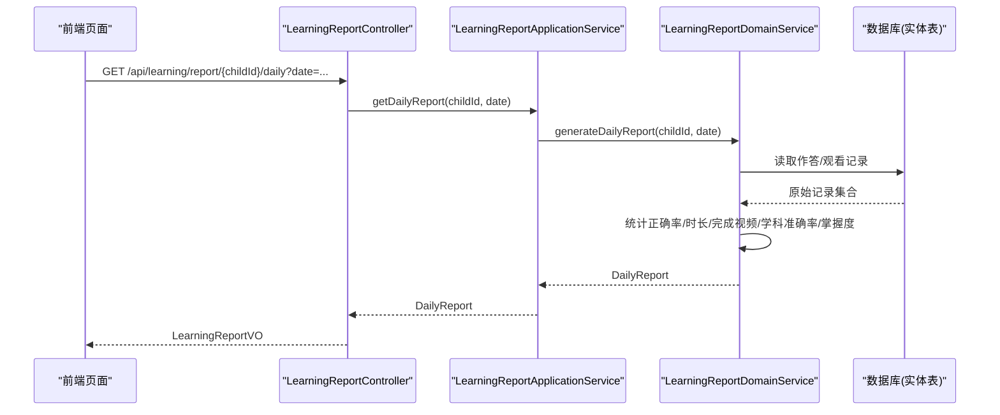
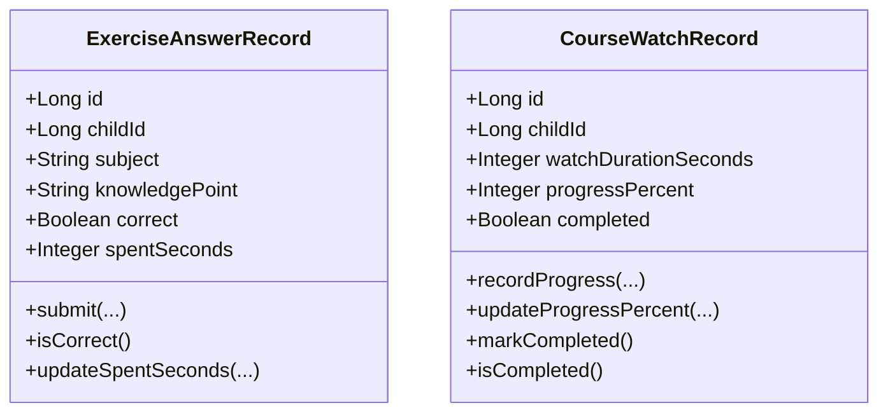
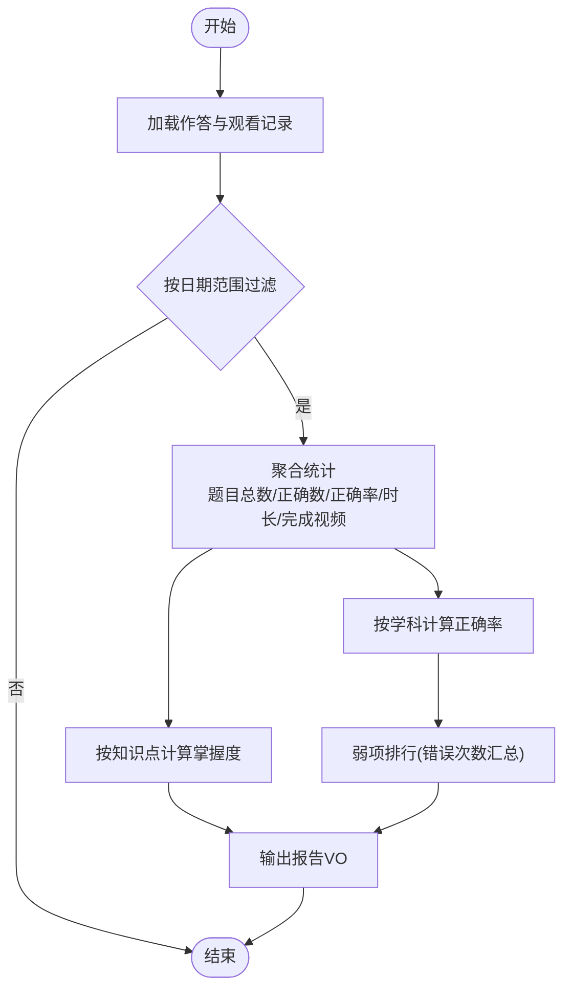
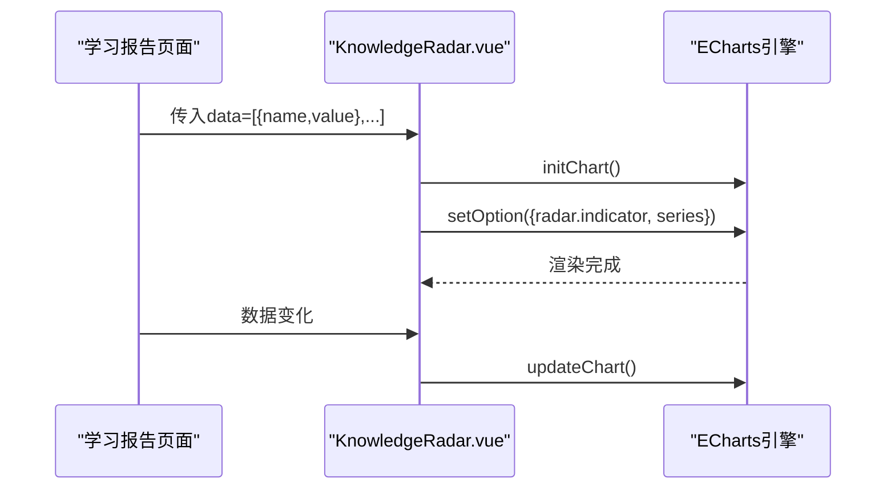
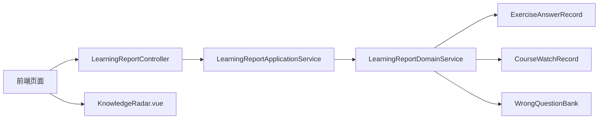

# 学情分析系统

<cite>
**本文引用的文件**
- [LearningReportController.java](file://wzoto-backend/wzoto-interfaces/src/main/java/com/wzoto/interfaces/controller/LearningReportController.java)
- [LearningReportApplicationService.java](file://wzoto-backend/wzoto-application/src/main/java/com/wzoto/application/service/LearningReportApplicationService.java)
- [LearningReportDomainService.java](file://wzoto-backend/wzoto-domain/src/main/java/com/wzoto/domain/service/LearningReportDomainService.java)
- [AiReportController.java](file://wzoto-backend/wzoto-interfaces/src/main/java/com/wzoto/interfaces/controller/AiReportController.java)
- [AiReportApplicationService.java](file://wzoto-backend/wzoto-application/src/main/java/com/wzoto/application/service/AiReportApplicationService.java)
- [AiReport.java](file://wzoto-backend/wzoto-domain/src/main/java/com/wzoto/domain/entity/AiReport.java)
- [ExerciseAnswerRecord.java](file://wzoto-backend/wzoto-domain/src/main/java/com/wzoto/domain/entity/ExerciseAnswerRecord.java)
- [CourseWatchRecord.java](file://wzoto-backend/wzoto-domain/src/main/java/com/wzoto/domain/entity/CourseWatchRecord.java)
- [WrongQuestionBank.java](file://wzoto-backend/wzoto-domain/src/main/java/com/wzoto/domain/entity/WrongQuestionBank.java)
- [LearningReportVO.java](file://wzoto-backend/wzoto-interfaces/src/main/java/com/wzoto/interfaces/vo/learning/LearningReportVO.java)
- [WeakPointVO.java](file://wzoto-backend/wzoto-interfaces/src/main/java/com/wzoto/interfaces/vo/learning/WeakPointVO.java)
- [KnowledgeRadar.vue](file://wzoto-frontend/src/pages/student/components/KnowledgeRadar.vue)
- [init_all_learning_tables.sql](file://wzoto-backend/sql/init_all_learning_tables.sql)
</cite>

## 目录
1. [简介](#简介)
2. [项目结构](#项目结构)
3. [核心组件](#核心组件)
4. [架构总览](#架构总览)
5. [详细组件分析](#详细组件分析)
6. [依赖关系分析](#依赖关系分析)
7. [性能与大数据优化](#性能与大数据优化)
8. [故障排查指南](#故障排查指南)
9. [结论](#结论)
10. [附录：接口文档与可视化配置](#附录接口文档与可视化配置)

## 简介
本系统为“学情分析系统”，围绕学习数据分析、能力雷达图生成、个性化推荐、报告生成四大目标，提供从数据采集、分析计算到可视化展示与报告输出的完整链路。重点覆盖：
- 学习行为追踪：习题作答记录、课程观看进度与时长统计
- 成绩趋势分析：日/周/月维度的正确率、完成度、学科准确率
- 知识点掌握度评估：基于正确率的掌握等级划分
- 能力雷达图：多维度能力可视化、强弱项识别、进步轨迹展示
- 个性化推荐：基于错题与薄弱知识点的练习与资源推荐（可扩展）
- 报告机制：自动生成学习报告、定期分析报告、对比分析报告
- 接口与可视化：完整的API定义、前端雷达图组件与报表配置

## 项目结构
后端采用分层架构：接口层（Controller）→ 应用服务层（Application Service）→ 领域服务层（Domain Service）→ 仓储与实体（Repository & Entity）。前端通过Vue组件进行数据可视化渲染。

图表来源
- [LearningReportController.java:20-141](file://wzoto-backend/wzoto-interfaces/src/main/java/com/wzoto/interfaces/controller/LearningReportController.java#L20-L141)
- [AiReportController.java:20-122](file://wzoto-backend/wzoto-interfaces/src/main/java/com/wzoto/interfaces/controller/AiReportController.java#L20-L122)
- [LearningReportApplicationService.java:15-59](file://wzoto-backend/wzoto-application/src/main/java/com/wzoto/application/service/LearningReportApplicationService.java#L15-L59)
- [AiReportApplicationService.java:13-81](file://wzoto-backend/wzoto-application/src/main/java/com/wzoto/application/service/AiReportApplicationService.java#L13-L81)
- [LearningReportDomainService.java:19-160](file://wzoto-backend/wzoto-domain/src/main/java/com/wzoto/domain/service/LearningReportDomainService.java#L19-L160)
- [ExerciseAnswerRecord.java:10-99](file://wzoto-backend/wzoto-domain/src/main/java/com/wzoto/domain/entity/ExerciseAnswerRecord.java#L10-L99)
- [CourseWatchRecord.java:10-120](file://wzoto-backend/wzoto-domain/src/main/java/com/wzoto/domain/entity/CourseWatchRecord.java#L10-L120)
- [WrongQuestionBank.java:10-133](file://wzoto-backend/wzoto-domain/src/main/java/com/wzoto/domain/entity/WrongQuestionBank.java#L10-L133)
- [AiReport.java:10-106](file://wzoto-backend/wzoto-domain/src/main/java/com/wzoto/domain/entity/AiReport.java#L10-L106)
- [KnowledgeRadar.vue:1-82](file://wzoto-frontend/src/pages/student/components/KnowledgeRadar.vue#L1-L82)

章节来源
- [LearningReportController.java:20-141](file://wzoto-backend/wzoto-interfaces/src/main/java/com/wzoto/interfaces/controller/LearningReportController.java#L20-L141)
- [LearningReportDomainService.java:19-160](file://wzoto-backend/wzoto-domain/src/main/java/com/wzoto/domain/service/LearningReportDomainService.java#L19-L160)

## 核心组件
- 学习报告服务：提供日/周/月报告、薄弱点排行、错题导出
- AI学情诊断：创建报告、获取报告列表与详情、付费解锁、会员状态查询
- 数据实体：习题作答记录、课程观看记录、错题库、AI报告实体
- 前端可视化：能力雷达图组件，支持多维度指标渲染与自适应尺寸

章节来源
- [LearningReportDomainService.java:31-124](file://wzoto-backend/wzoto-domain/src/main/java/com/wzoto/domain/service/LearningReportDomainService.java#L31-L124)
- [AiReportController.java:31-95](file://wzoto-backend/wzoto-interfaces/src/main/java/com/wzoto/interfaces/controller/AiReportController.java#L31-L95)
- [KnowledgeRadar.vue:18-56](file://wzoto-frontend/src/pages/student/components/KnowledgeRadar.vue#L18-L56)

## 架构总览
系统以“数据收集 → 分析计算 → 可视化/报告”为主线。学习行为数据来源于习题作答与课程观看；分析计算在领域服务中聚合统计；结果通过控制器暴露为REST API；前端使用ECharts渲染能力雷达图并展示报告。

图表来源
- [LearningReportController.java:31-44](file://wzoto-backend/wzoto-interfaces/src/main/java/com/wzoto/interfaces/controller/LearningReportController.java#L31-L44)
- [LearningReportApplicationService.java:26-29](file://wzoto-backend/wzoto-application/src/main/java/com/wzoto/application/service/LearningReportApplicationService.java#L26-L29)
- [LearningReportDomainService.java:34-42](file://wzoto-backend/wzoto-domain/src/main/java/com/wzoto/domain/service/LearningReportDomainService.java#L34-L42)

## 详细组件分析

### 学习行为追踪
- 习题作答记录：记录每次作答的学科、知识点、答案、是否正确、耗时等，支持多次作答与耗时更新
- 课程观看记录：记录观看时长、进度百分比、最后位置、是否完成（≥90%视为完成），支持进度更新与标记完成

图表来源
- [ExerciseAnswerRecord.java:10-99](file://wzoto-backend/wzoto-domain/src/main/java/com/wzoto/domain/entity/ExerciseAnswerRecord.java#L10-L99)
- [CourseWatchRecord.java:10-120](file://wzoto-backend/wzoto-domain/src/main/java/com/wzoto/domain/entity/CourseWatchRecord.java#L10-L120)

章节来源
- [ExerciseAnswerRecord.java:61-99](file://wzoto-backend/wzoto-domain/src/main/java/com/wzoto/domain/entity/ExerciseAnswerRecord.java#L61-L99)
- [CourseWatchRecord.java:58-119](file://wzoto-backend/wzoto-domain/src/main/java/com/wzoto/domain/entity/CourseWatchRecord.java#L58-L119)

### 成绩趋势分析与知识点掌握度评估
- 日/周/月报告：聚合答题数量、正确数、正确率、观看时长、完成视频数、学科准确率、知识点掌握度映射
- 掌握度评估：按知识点分组计算正确率，映射为掌握等级（如未掌握/一般/熟练）
- 薄弱点排行：基于错题库的错误次数汇总排序，支持按学科过滤与TopN限制

图表来源
- [LearningReportDomainService.java:34-99](file://wzoto-backend/wzoto-domain/src/main/java/com/wzoto/domain/service/LearningReportDomainService.java#L34-L99)
- [LearningReportDomainService.java:105-124](file://wzoto-backend/wzoto-domain/src/main/java/com/wzoto/domain/service/LearningReportDomainService.java#L105-L124)

章节来源
- [LearningReportDomainService.java:34-99](file://wzoto-backend/wzoto-domain/src/main/java/com/wzoto/domain/service/LearningReportDomainService.java#L34-L99)
- [LearningReportDomainService.java:105-124](file://wzoto-backend/wzoto-domain/src/main/java/com/wzoto/domain/service/LearningReportDomainService.java#L105-L124)

### 能力雷达图生成
- 前端组件：基于ECharts实现雷达图，支持动态指标、最大值、颜色与提示框配置
- 数据输入：指标数组包含名称与分数/值，自动映射为雷达维度
- 交互与适配：监听窗口resize自动调整尺寸，watch数据变化重绘图表

图表来源
- [KnowledgeRadar.vue:18-56](file://wzoto-frontend/src/pages/student/components/KnowledgeRadar.vue#L18-L56)

章节来源
- [KnowledgeRadar.vue:1-82](file://wzoto-frontend/src/pages/student/components/KnowledgeRadar.vue#L1-L82)

### 个性化推荐算法（可扩展）
当前仓库已具备错题与薄弱知识点数据基础，可在此基础上扩展推荐逻辑：
- 课程推荐：根据薄弱知识点匹配资源章节或微课
- 练习推荐：基于错题库的知识点与错误次数，推送针对性练习
- 资源推荐：结合学科与知识点标签，推荐学习材料或音频资源

说明：该部分为设计建议，可在领域服务中新增推荐策略方法，复用现有错题与知识点数据。

### 报告生成机制
- 自动生成学习报告：调用日/周/月报告接口，返回结构化学习数据
- 定期分析报告：可通过定时任务触发周/月报告生成并持久化
- 对比分析报告：基于历史报告数据对比正确率、时长、完成度变化趋势

章节来源
- [LearningReportController.java:31-82](file://wzoto-backend/wzoto-interfaces/src/main/java/com/wzoto/interfaces/controller/LearningReportController.java#L31-L82)

## 依赖关系分析
- 控制器依赖应用服务，应用服务依赖领域服务，领域服务依赖仓储与实体
- 报告生成依赖作答记录、观看记录、错题库三个核心实体
- 前端雷达图组件依赖ECharts库，接收结构化数据渲染

图表来源
- [LearningReportController.java:20-141](file://wzoto-backend/wzoto-interfaces/src/main/java/com/wzoto/interfaces/controller/LearningReportController.java#L20-L141)
- [LearningReportApplicationService.java:15-59](file://wzoto-backend/wzoto-application/src/main/java/com/wzoto/application/service/LearningReportApplicationService.java#L15-L59)
- [LearningReportDomainService.java:19-160](file://wzoto-backend/wzoto-domain/src/main/java/com/wzoto/domain/service/LearningReportDomainService.java#L19-L160)

章节来源
- [LearningReportDomainService.java:19-160](file://wzoto-backend/wzoto-domain/src/main/java/com/wzoto/domain/service/LearningReportDomainService.java#L19-L160)

## 性能与大数据优化
- 数据聚合优化：在领域服务中按子集过滤（日期范围、学科）后再聚合，减少内存占用
- 分页与TopN：薄弱点排行支持topN限制，避免全量排序
- 缓存策略：对高频访问的报告可引入缓存（如Redis），降低重复计算
- 异步处理：大报表生成可异步执行，返回任务ID供前端轮询
- 索引优化：数据库层面针对childId、createdAt、subject、knowledgePoint建立索引，提升查询效率
- 实时分析方案：将关键事件（作答、观看）写入消息队列，流式计算近实时指标

[本节为通用指导，不直接分析具体文件]

## 故障排查指南
- 权限校验失败：应用服务会校验子女归属，若不存在则抛出异常，需检查用户上下文与子女关联
- 数据为空：当无作答或观看记录时，正确率为0，时长为0，需确认数据采集是否正常
- 进度非法：课程观看记录的进度必须在0-100之间，否则抛异常；确保前端上报合法
- 耗时非法：作答耗时不能为负数，需校验前端传参

章节来源
- [LearningReportApplicationService.java:51-57](file://wzoto-backend/wzoto-application/src/main/java/com/wzoto/application/service/LearningReportApplicationService.java#L51-L57)
- [CourseWatchRecord.java:94-102](file://wzoto-backend/wzoto-domain/src/main/java/com/wzoto/domain/entity/CourseWatchRecord.java#L94-L102)
- [ExerciseAnswerRecord.java:92-97](file://wzoto-backend/wzoto-domain/src/main/java/com/wzoto/domain/entity/ExerciseAnswerRecord.java#L92-L97)

## 结论
本学情分析系统以清晰的分层架构实现了学习行为追踪、成绩趋势分析、知识点掌握度评估与能力雷达图可视化，并通过AI报告模块提供诊断与付费解锁能力。系统具备良好的扩展性，可进一步集成推荐算法与实时分析能力，满足多样化教学场景需求。

[本节为总结，不直接分析具体文件]

## 附录：接口文档与可视化配置

### 学情报告接口
- 获取概览报告
  - 路径：GET /api/learning/report/{childId}
  - 说明：返回当日概览数据（题目数、正确数、正确率、观看时长、完成视频、学科准确率、掌握度映射）
- 获取日报
  - 路径：GET /api/learning/report/{childId}/daily?date=YYYY-MM-DD
  - 说明：指定日期的详细报告
- 获取周报
  - 路径：GET /api/learning/report/{childId}/weekly?weekStart=YYYY-MM-DD
  - 说明：指定周一开始的周报告
- 获取月报
  - 路径：GET /api/learning/report/{childId}/monthly?year=YYYY&month=MM
  - 说明：指定月份的报告
- 薄弱点排行
  - 路径：GET /api/learning/report/{childId}/weak-points?subject=&topN=10
  - 说明：按错误次数降序返回薄弱知识点
- 错题导出
  - 路径：GET /api/learning/report/{childId}/wrong-questions/export?subject=
  - 说明：导出错题数据，可按学科过滤

章节来源
- [LearningReportController.java:31-82](file://wzoto-backend/wzoto-interfaces/src/main/java/com/wzoto/interfaces/controller/LearningReportController.java#L31-L82)

### AI学情诊断接口
- 创建报告
  - 路径：POST /api/ai/report
  - 说明：提交孩子姓名、薄弱科目、近期成绩、薄弱点描述、照片URL，生成预览或完整报告
- 我的报告列表
  - 路径：GET /api/ai/reports
  - 说明：获取当前用户的报告列表
- 报告详情
  - 路径：GET /api/ai/report/{id}
  - 说明：获取报告详情（非会员未付费仅返回预览内容）
- 付费解锁
  - 路径：POST /api/ai/report/{id}/pay
  - 说明：模拟支付成功后解锁完整报告
- 会员状态
  - 路径：GET /api/ai/membership-status
  - 说明：返回会员类型、有效期、免费报告使用次数等

章节来源
- [AiReportController.java:31-95](file://wzoto-backend/wzoto-interfaces/src/main/java/com/wzoto/interfaces/controller/AiReportController.java#L31-L95)

### 数据模型与字段说明
- 学习报告VO
  - 字段：childId、reportType、totalQuestions、correctCount、accuracy、watchDurationSeconds、completedVideos、subjectAccuracy、masteryMap
- 薄弱点VO
  - 字段：knowledgePoint、mistakeCount
- AI报告实体
  - 字段：userId、childName、weakSubjects、recentScores、weakPointDesc、photoUrls、reportContent、previewContent、reportType、isMemberReport、price、paymentStatus

章节来源
- [LearningReportVO.java:8-21](file://wzoto-backend/wzoto-interfaces/src/main/java/com/wzoto/interfaces/vo/learning/LearningReportVO.java#L8-L21)
- [WeakPointVO.java:6-12](file://wzoto-backend/wzoto-interfaces/src/main/java/com/wzoto/interfaces/vo/learning/WeakPointVO.java#L6-L12)
- [AiReport.java:18-106](file://wzoto-backend/wzoto-domain/src/main/java/com/wzoto/domain/entity/AiReport.java#L18-L106)

### 数据可视化配置
- 雷达图组件
  - 输入：data数组，每项包含name与value/score
  - 配置：指标指示器、半径、分割层级、轴名样式、区域填充色、线条样式、提示框
  - 行为：初始化图表、监听窗口大小变化、数据变化重绘

章节来源
- [KnowledgeRadar.vue:9-13](file://wzoto-frontend/src/pages/student/components/KnowledgeRadar.vue#L9-L13)
- [KnowledgeRadar.vue:18-56](file://wzoto-frontend/src/pages/student/components/KnowledgeRadar.vue#L18-L56)

### 数据库与初始化
- 学习资源相关表初始化脚本：包含学科、知识点、章节、微课、题库、试卷、音频、学习资料、学习资源的DDL与种子数据导入

章节来源
- [init_all_learning_tables.sql:1-31](file://wzoto-backend/sql/init_all_learning_tables.sql#L1-L31)