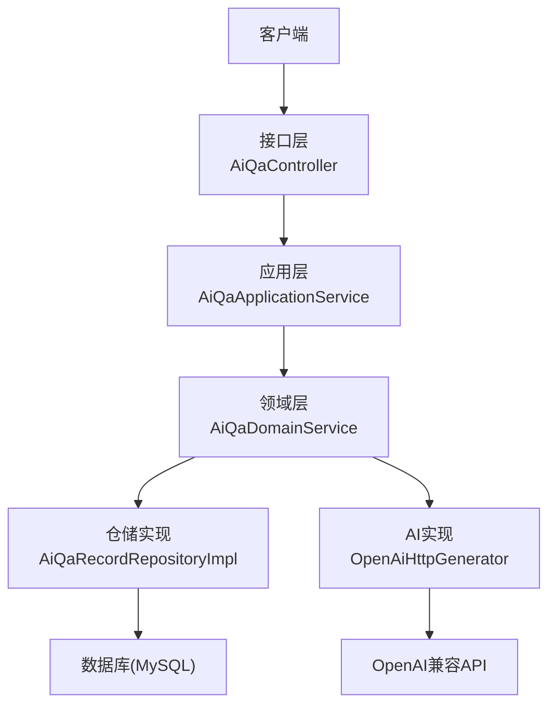
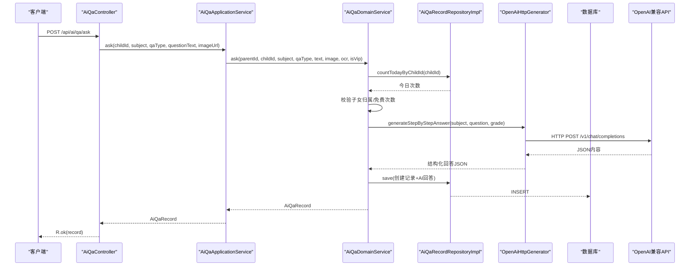
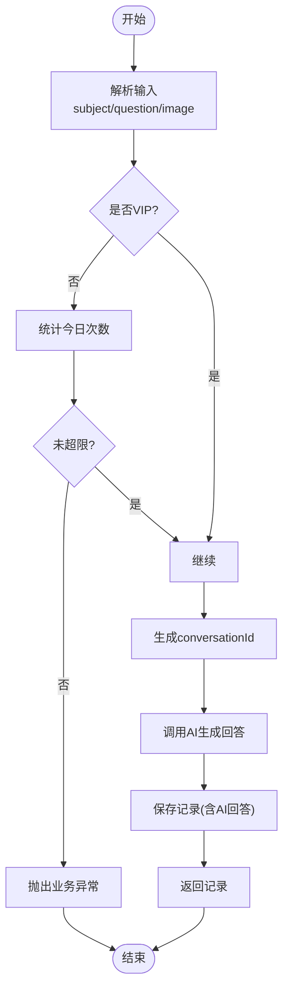
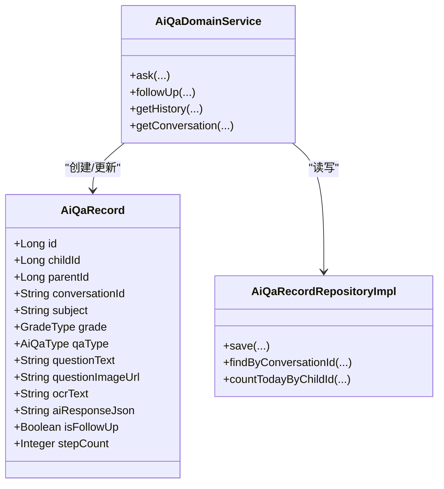
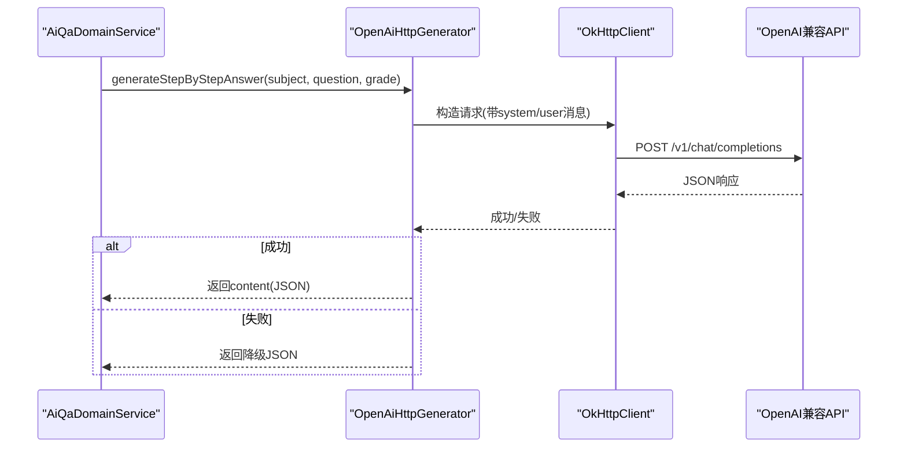
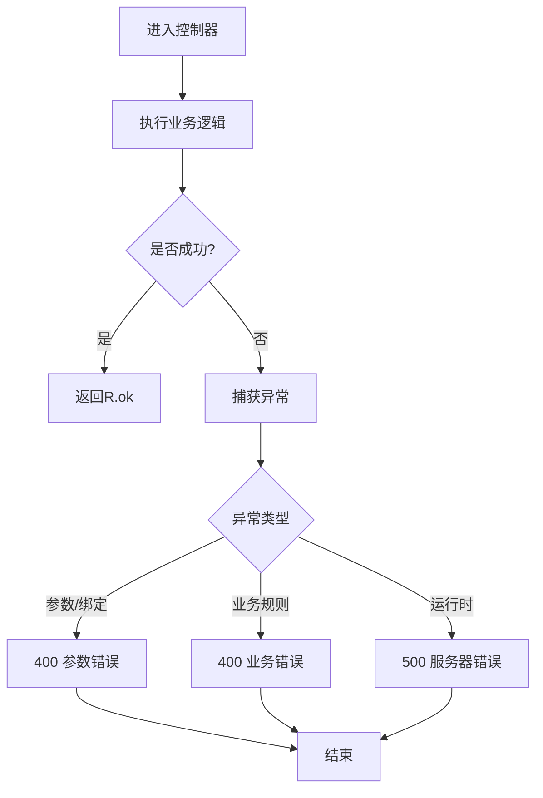
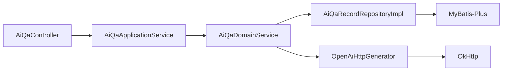

# 智能答疑系统

<cite>
**本文引用的文件**
- [AiQaController.java](file://wzoto-backend/wzoto-interfaces/src/main/java/com/wzoto/interfaces/controller/AiQaController.java)
- [AiQaApplicationService.java](file://wzoto-backend/wzoto-application/src/main/java/com/wzoto/application/service/AiQaApplicationService.java)
- [AiQaDomainService.java](file://wzoto-backend/wzoto-domain/src/main/java/com/wzoto/domain/service/AiQaDomainService.java)
- [OpenAiHttpGenerator.java](file://wzoto-backend/wzoto-infrastructure/src/main/java/com/wzoto/infrastructure/ai/OpenAiHttpGenerator.java)
- [AiServiceHelper.java](file://wzoto-backend/wzoto-infrastructure/src/main/java/com/wzoto/infrastructure/ai/AiServiceHelper.java)
- [AiQaRecordRepositoryImpl.java](file://wzoto-backend/wzoto-infrastructure/src/main/java/com/wzoto/infrastructure/repository/AiQaRecordRepositoryImpl.java)
- [AiQaRecord.java](file://wzoto-backend/wzoto-domain/src/main/java/com/wzoto/domain/entity/AiQaRecord.java)
- [AiQaAskDTO.java](file://wzoto-backend/wzoto-interfaces/src/main/java/com/wzoto/interfaces/dto/AiQaAskDTO.java)
- [AiQaFollowUpDTO.java](file://wzoto-backend/wzoto-interfaces/src/main/java/com/wzoto/interfaces/dto/AiQaFollowUpDTO.java)
- [application.yml](file://wzoto-backend/wzoto-interfaces/src/main/resources/application.yml)
- [GlobalExceptionHandler.java](file://wzoto-backend/wzoto-interfaces/src/main/java/com/wzoto/interfaces/common/GlobalExceptionHandler.java)
</cite>

## 目录
1. [简介](#简介)
2. [项目结构](#项目结构)
3. [核心组件](#核心组件)
4. [架构总览](#架构总览)
5. [详细组件分析](#详细组件分析)
6. [依赖关系分析](#依赖关系分析)
7. [性能与成本优化](#性能与成本优化)
8. [故障排查指南](#故障排查指南)
9. [结论](#结论)
10. [附录：API接口文档](#附录api接口文档)

## 简介
本系统提供面向小学生的“智能答疑”能力，支持拍照搜题与文字提问，AI以分步启发式方式给出解题引导。系统采用分层架构（接口层-应用层-领域层-基础设施层），通过会话ID实现多轮对话与上下文保持，并集成OpenAI兼容API进行答案生成。同时内置错误处理、重试与降级策略，保障服务稳定性与可用性。

## 项目结构
系统后端采用DDD风格的分层组织：
- 接口层：REST控制器、DTO/VO、全局异常处理
- 应用层：编排业务流程、参数转换、权限上下文注入
- 领域层：业务规则、实体模型、领域服务
- 基础设施层：数据库仓储、AI调用封装、配置与工具

图表来源
- [AiQaController.java:16-49](file://wzoto-backend/wzoto-interfaces/src/main/java/com/wzoto/interfaces/controller/AiQaController.java#L16-L49)
- [AiQaApplicationService.java:13-42](file://wzoto-backend/wzoto-application/src/main/java/com/wzoto/application/service/AiQaApplicationService.java#L13-L42)
- [AiQaDomainService.java:17-105](file://wzoto-backend/wzoto-domain/src/main/java/com/wzoto/domain/service/AiQaDomainService.java#L17-L105)
- [AiQaRecordRepositoryImpl.java:18-117](file://wzoto-backend/wzoto-infrastructure/src/main/java/com/wzoto/infrastructure/repository/AiQaRecordRepositoryImpl.java#L18-L117)
- [OpenAiHttpGenerator.java:18-394](file://wzoto-backend/wzoto-infrastructure/src/main/java/com/wzoto/infrastructure/ai/OpenAiHttpGenerator.java#L18-L394)

章节来源
- [AiQaController.java:16-49](file://wzoto-backend/wzoto-interfaces/src/main/java/com/wzoto/interfaces/controller/AiQaController.java#L16-L49)
- [application.yml:31-46](file://wzoto-backend/wzoto-interfaces/src/main/resources/application.yml#L31-L46)

## 核心组件
- 接口层控制器：暴露问答、追问、历史、会话等HTTP接口
- 应用服务：承载流程编排、用户上下文、参数校验与类型转换
- 领域服务：实现业务规则（权限校验、免费次数限制）、会话管理、AI调用编排
- 仓储实现：持久化问答记录、按会话查询、当日计数
- AI实现：基于OkHttp的OpenAI兼容API调用，包含请求构造、响应解析、降级与重试辅助
- 全局异常处理：统一错误码与消息返回

章节来源
- [AiQaController.java:16-49](file://wzoto-backend/wzoto-interfaces/src/main/java/com/wzoto/interfaces/controller/AiQaController.java#L16-L49)
- [AiQaApplicationService.java:13-42](file://wzoto-backend/wzoto-application/src/main/java/com/wzoto/application/service/AiQaApplicationService.java#L13-L42)
- [AiQaDomainService.java:17-105](file://wzoto-backend/wzoto-domain/src/main/java/com/wzoto/domain/service/AiQaDomainService.java#L17-L105)
- [AiQaRecordRepositoryImpl.java:18-117](file://wzoto-backend/wzoto-infrastructure/src/main/java/com/wzoto/infrastructure/repository/AiQaRecordRepositoryImpl.java#L18-L117)
- [OpenAiHttpGenerator.java:18-394](file://wzoto-backend/wzoto-infrastructure/src/main/java/com/wzoto/infrastructure/ai/OpenAiHttpGenerator.java#L18-L394)
- [GlobalExceptionHandler.java:14-67](file://wzoto-backend/wzoto-interfaces/src/main/java/com/wzoto/interfaces/common/GlobalExceptionHandler.java#L14-L67)

## 架构总览
系统遵循清晰的职责分离：
- 接口层仅负责入参校验、日志埋点与结果包装
- 应用层负责从上下文中获取用户信息、组装领域服务调用
- 领域层维护业务规则（如免费次数限制、所有权校验）与对话生命周期
- 基础设施层屏蔽外部依赖（数据库、AI服务）细节

图表来源
- [AiQaController.java:25-31](file://wzoto-backend/wzoto-interfaces/src/main/java/com/wzoto/interfaces/controller/AiQaController.java#L25-L31)
- [AiQaApplicationService.java:21-27](file://wzoto-backend/wzoto-application/src/main/java/com/wzoto/application/service/AiQaApplicationService.java#L21-L27)
- [AiQaDomainService.java:34-57](file://wzoto-backend/wzoto-domain/src/main/java/com/wzoto/domain/service/AiQaDomainService.java#L34-L57)
- [AiQaRecordRepositoryImpl.java:25-31](file://wzoto-backend/wzoto-infrastructure/src/main/java/com/wzoto/infrastructure/repository/AiQaRecordRepositoryImpl.java#L25-L31)
- [OpenAiHttpGenerator.java:340-349](file://wzoto-backend/wzoto-infrastructure/src/main/java/com/wzoto/infrastructure/ai/OpenAiHttpGenerator.java#L340-L349)

## 详细组件分析

### 问答流程与上下文管理
- 问题解析：接口接收学科、题型、文本或图片；应用层将类型转换为领域枚举；领域层根据年级与学科构建提示词
- 上下文管理：首次提问生成conversationId；后续追问使用同一conversationId关联多条记录
- 对话历史维护：按childId查询历史；按conversationId查询会话内所有记录并按时间排序

图表来源
- [AiQaDomainService.java:34-57](file://wzoto-backend/wzoto-domain/src/main/java/com/wzoto/domain/service/AiQaDomainService.java#L34-L57)
- [AiQaRecordRepositoryImpl.java:64-71](file://wzoto-backend/wzoto-infrastructure/src/main/java/com/wzoto/infrastructure/repository/AiQaRecordRepositoryImpl.java#L64-L71)

章节来源
- [AiQaDomainService.java:34-57](file://wzoto-backend/wzoto-domain/src/main/java/com/wzoto/domain/service/AiQaDomainService.java#L34-L57)
- [AiQaRecordRepositoryImpl.java:56-71](file://wzoto-backend/wzoto-infrastructure/src/main/java/com/wzoto/infrastructure/repository/AiQaRecordRepositoryImpl.java#L56-L71)

### 会话管理（conversationId机制）
- 首次提问：生成唯一conversationId，作为会话标识
- 追问：传入conversationId，领域服务先校验会话存在性，再追加一条记录
- 会话查询：按conversationId升序返回该会话全部记录，便于前端渲染对话流

图表来源
- [AiQaRecord.java:20-72](file://wzoto-backend/wzoto-domain/src/main/java/com/wzoto/domain/entity/AiQaRecord.java#L20-L72)
- [AiQaDomainService.java:62-82](file://wzoto-backend/wzoto-domain/src/main/java/com/wzoto/domain/service/AiQaDomainService.java#L62-L82)
- [AiQaRecordRepositoryImpl.java:56-62](file://wzoto-backend/wzoto-infrastructure/src/main/java/com/wzoto/infrastructure/repository/AiQaRecordRepositoryImpl.java#L56-L62)

章节来源
- [AiQaDomainService.java:62-82](file://wzoto-backend/wzoto-domain/src/main/java/com/wzoto/domain/service/AiQaDomainService.java#L62-L82)
- [AiQaRecordRepositoryImpl.java:56-62](file://wzoto-backend/wzoto-infrastructure/src/main/java/com/wzoto/infrastructure/repository/AiQaRecordRepositoryImpl.java#L56-L62)

### AI服务集成（OpenAI兼容API）
- 请求封装：使用OkHttp构造POST请求，设置Authorization头与JSON体
- 响应处理：解析choices[0].message.content；失败时记录日志并触发降级
- 降级策略：当API不可用或超时，返回预设的降级JSON，保证前端可用
- 重试机制：提供通用重试模板（可复用），当前AI方法内部捕获异常并降级

图表来源
- [OpenAiHttpGenerator.java:284-310](file://wzoto-backend/wzoto-infrastructure/src/main/java/com/wzoto/infrastructure/ai/OpenAiHttpGenerator.java#L284-L310)
- [OpenAiHttpGenerator.java:340-349](file://wzoto-backend/wzoto-infrastructure/src/main/java/com/wzoto/infrastructure/ai/OpenAiHttpGenerator.java#L340-L349)

章节来源
- [OpenAiHttpGenerator.java:284-310](file://wzoto-backend/wzoto-infrastructure/src/main/java/com/wzoto/infrastructure/ai/OpenAiHttpGenerator.java#L284-L310)
- [OpenAiHttpGenerator.java:340-349](file://wzoto-backend/wzoto-infrastructure/src/main/java/com/wzoto/infrastructure/ai/OpenAiHttpGenerator.java#L340-L349)

### 错误处理与重试
- 全局异常处理器：对非法参数、业务规则违反、参数绑定失败、运行时异常等进行统一处理，返回标准R结构
- 业务异常：如免费次数用完、会话不存在、无权操作等，抛出IllegalArgumentException/IllegalStateException
- 重试与限流：提供callWithRetry模板与每日调用上限检查，可在上层扩展使用

图表来源
- [GlobalExceptionHandler.java:18-67](file://wzoto-backend/wzoto-interfaces/src/main/java/com/wzoto/interfaces/common/GlobalExceptionHandler.java#L18-L67)
- [AiQaDomainService.java:38-43](file://wzoto-backend/wzoto-domain/src/main/java/com/wzoto/domain/service/AiQaDomainService.java#L38-L43)
- [AiQaDomainService.java:66-68](file://wzoto-backend/wzoto-domain/src/main/java/com/wzoto/domain/service/AiQaDomainService.java#L66-L68)

章节来源
- [GlobalExceptionHandler.java:18-67](file://wzoto-backend/wzoto-interfaces/src/main/java/com/wzoto/interfaces/common/GlobalExceptionHandler.java#L18-L67)
- [AiServiceHelper.java:14-43](file://wzoto-backend/wzoto-infrastructure/src/main/java/com/wzoto/infrastructure/ai/AiServiceHelper.java#L14-L43)

## 依赖关系分析
- 控制器依赖应用服务，应用服务依赖领域服务
- 领域服务依赖仓储与AI生成器，不感知具体实现
- 仓储实现依赖MyBatis-Plus Mapper与PO对象
- AI实现通过配置开关启用真实调用，否则可切换为Mock模式

图表来源
- [AiQaController.java:16-49](file://wzoto-backend/wzoto-interfaces/src/main/java/com/wzoto/interfaces/controller/AiQaController.java#L16-L49)
- [AiQaApplicationService.java:13-42](file://wzoto-backend/wzoto-application/src/main/java/com/wzoto/application/service/AiQaApplicationService.java#L13-L42)
- [AiQaDomainService.java:17-105](file://wzoto-backend/wzoto-domain/src/main/java/com/wzoto/domain/service/AiQaDomainService.java#L17-L105)
- [AiQaRecordRepositoryImpl.java:18-117](file://wzoto-backend/wzoto-infrastructure/src/main/java/com/wzoto/infrastructure/repository/AiQaRecordRepositoryImpl.java#L18-L117)
- [OpenAiHttpGenerator.java:18-394](file://wzoto-backend/wzoto-infrastructure/src/main/java/com/wzoto/infrastructure/ai/OpenAiHttpGenerator.java#L18-L394)

章节来源
- [application.yml:31-46](file://wzoto-backend/wzoto-interfaces/src/main/resources/application.yml#L31-L46)

## 性能与成本优化
- 连接与超时：OkHttp已设置连接与读取超时，避免长时间阻塞
- 降级优先：API失败快速返回降级JSON，减少前端等待
- 并发控制：可在网关或上游限流，保护AI服务
- 缓存建议：对相同题目与年级的AI回答做短期缓存（Redis），降低重复调用
- 成本控制：
  - 合理设置temperature与model，平衡质量与成本
  - 限制非VIP用户的每日调用次数
  - 对高频问题引入本地知识库或规则引擎，减少AI调用
  - 批量合并相似问题，减少请求数

[本节为通用指导，不直接分析具体文件]

## 故障排查指南
- 常见问题定位
  - 参数校验失败：检查请求体字段是否符合DTO约束
  - 免费次数用完：检查当日计数与会员状态
  - 会话不存在：确认conversationId是否正确传递
  - 无权操作：确认parentId与childId的归属关系
  - AI调用失败：检查环境变量配置（base-url、api-key、model）与网络连通性
- 日志与监控
  - 关注控制器埋点日志（userId、childId）
  - 关注AI调用日志（status、body）
  - 关注全局异常处理器输出的错误信息
- 恢复策略
  - 临时关闭AI功能（配置开关），回退到降级输出
  - 增加重试次数或退避策略
  - 扩容数据库连接池与Redis实例

章节来源
- [GlobalExceptionHandler.java:18-67](file://wzoto-backend/wzoto-interfaces/src/main/java/com/wzoto/interfaces/common/GlobalExceptionHandler.java#L18-L67)
- [OpenAiHttpGenerator.java:104-117](file://wzoto-backend/wzoto-infrastructure/src/main/java/com/wzoto/infrastructure/ai/OpenAiHttpGenerator.java#L104-L117)
- [application.yml:31-46](file://wzoto-backend/wzoto-interfaces/src/main/resources/application.yml#L31-L46)

## 结论
本系统通过清晰的分层设计与领域驱动思想，实现了稳定可靠的智能答疑能力。借助conversationId实现多轮对话与上下文保持，结合OpenAI兼容API完成高质量答案生成，并通过全局异常处理、降级与重试策略保障用户体验。建议在后续迭代中引入缓存、限流与更精细的成本控制策略，进一步提升性能与经济性。

[本节为总结性内容，不直接分析具体文件]

## 附录：API接口文档

### 基础信息
- 基础路径：/api/ai/qa
- 认证：由JWT拦截器在网关或前置层校验（本模块通过UserContext获取当前用户）
- 返回格式：统一R结构

### 接口列表
- 提问
  - 方法：POST
  - 路径：/api/ai/qa/ask
  - 请求体：AiQaAskDTO
    - childId：Long，必填
    - subject：String，必填
    - qaType：String，可选（如TEXT/PHOTO）
    - questionText：String，可选
    - questionImageUrl：String，可选
  - 返回：AiQaRecord（包含conversationId、aiResponseJson等）
  - 说明：首次提问会生成conversationId；非VIP用户受每日次数限制

- 追问
  - 方法：POST
  - 路径：/api/ai/qa/follow-up
  - 请求体：AiQaFollowUpDTO
    - childId：Long，必填
    - conversationId：String，必填
    - questionText：String，必填
  - 返回：AiQaRecord
  - 说明：在同一会话内追加提问，维持上下文

- 历史
  - 方法：GET
  - 路径：/api/ai/qa/history/{childId}
  - 返回：List<AiQaRecord>
  - 说明：按时间倒序返回该子女的所有提问记录

- 会话详情
  - 方法：GET
  - 路径：/api/ai/qa/session/{conversationId}
  - 返回：List<AiQaRecord>
  - 说明：按时间正序返回该会话的全部记录

章节来源
- [AiQaController.java:25-49](file://wzoto-backend/wzoto-interfaces/src/main/java/com/wzoto/interfaces/controller/AiQaController.java#L25-L49)
- [AiQaAskDTO.java:8-18](file://wzoto-backend/wzoto-interfaces/src/main/java/com/wzoto/interfaces/dto/AiQaAskDTO.java#L8-L18)
- [AiQaFollowUpDTO.java:8-16](file://wzoto-backend/wzoto-interfaces/src/main/java/com/wzoto/interfaces/dto/AiQaFollowUpDTO.java#L8-L16)
- [AiQaRecord.java:20-72](file://wzoto-backend/wzoto-domain/src/main/java/com/wzoto/domain/entity/AiQaRecord.java#L20-L72)