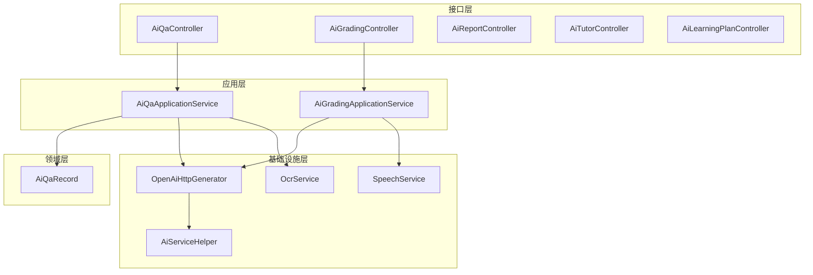
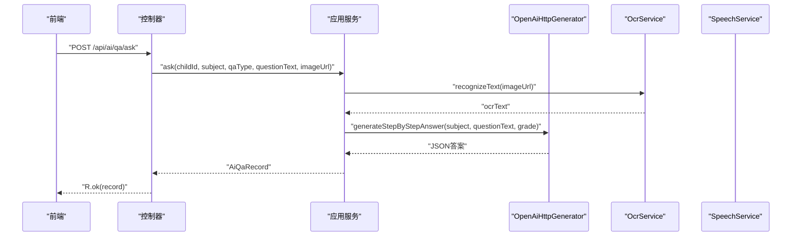
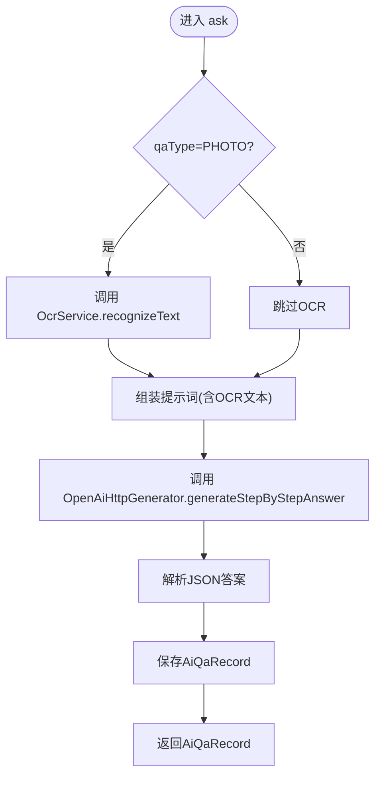
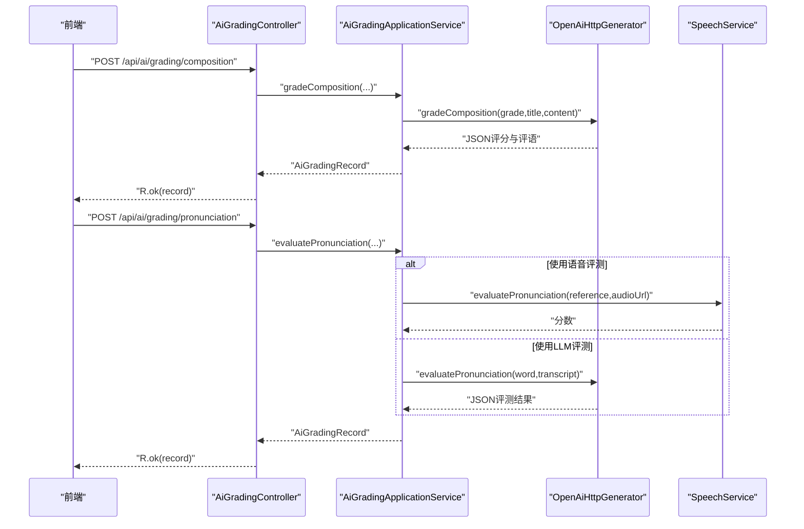
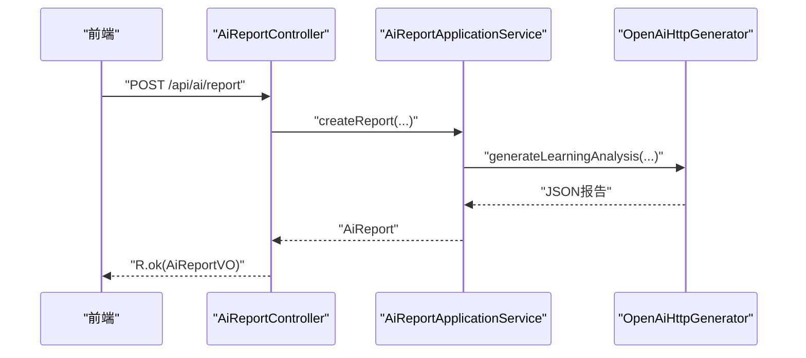
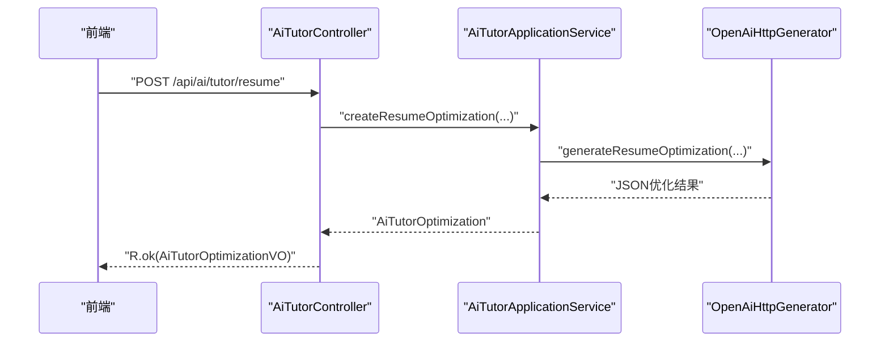
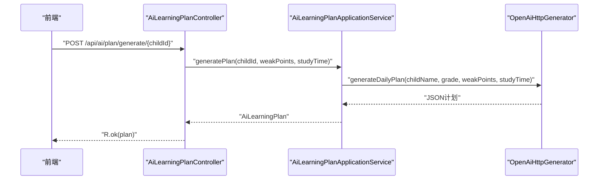
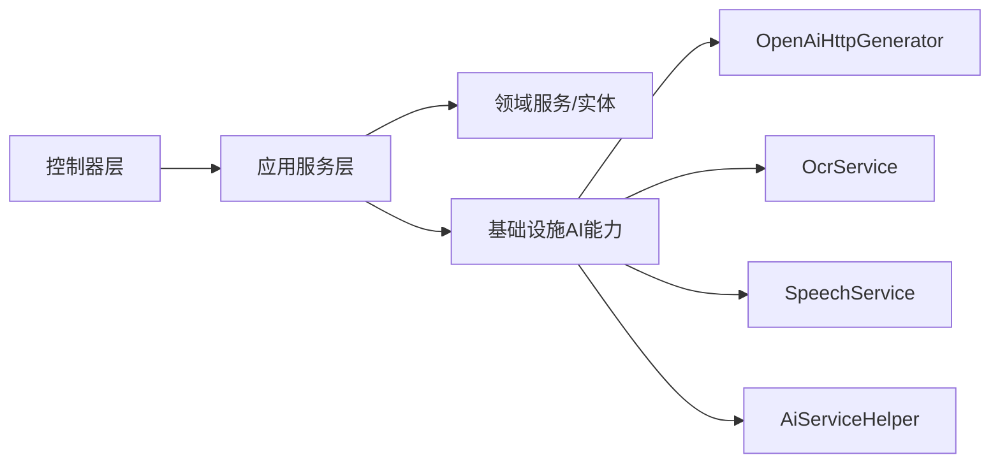

# AI接口

<cite>
**本文引用的文件**
- [AiQaController.java](file://wzoto-backend/wzoto-interfaces/src/main/java/com/wzoto/interfaces/controller/AiQaController.java)
- [AiGradingController.java](file://wzoto-backend/wzoto-interfaces/src/main/java/com/wzoto/interfaces/controller/AiGradingController.java)
- [AiReportController.java](file://wzoto-backend/wzoto-interfaces/src/main/java/com/wzoto/interfaces/controller/AiReportController.java)
- [AiTutorController.java](file://wzoto-backend/wzoto-interfaces/src/main/java/com/wzoto/interfaces/controller/AiTutorController.java)
- [AiLearningPlanController.java](file://wzoto-backend/wzoto-interfaces/src/main/java/com/wzoto/interfaces/controller/AiLearningPlanController.java)
- [AiQaAskDTO.java](file://wzoto-backend/wzoto-interfaces/src/main/java/com/wzoto/interfaces/dto/AiQaAskDTO.java)
- [CompositionGradeDTO.java](file://wzoto-backend/wzoto-interfaces/src/main/java/com/wzoto/interfaces/dto/CompositionGradeDTO.java)
- [PronunciationEvalDTO.java](file://wzoto-backend/wzoto-interfaces/src/main/java/com/wzoto/interfaces/dto/PronunciationEvalDTO.java)
- [AiQaApplicationService.java](file://wzoto-backend/wzoto-application/src/main/java/com/wzoto/application/service/AiQaApplicationService.java)
- [AiGradingApplicationService.java](file://wzoto-backend/wzoto-application/src/main/java/com/wzoto/application/service/AiGradingApplicationService.java)
- [OcrService.java](file://wzoto-backend/wzoto-infrastructure/src/main/java/com/wzoto/infrastructure/ai/OcrService.java)
- [SpeechService.java](file://wzoto-backend/wzoto-infrastructure/src/main/java/com/wzoto/infrastructure/ai/SpeechService.java)
- [OpenAiHttpGenerator.java](file://wzoto-backend/wzoto-infrastructure/src/main/java/com/wzoto/infrastructure/ai/OpenAiHttpGenerator.java)
- [AiServiceHelper.java](file://wzoto-backend/wzoto-infrastructure/src/main/java/com/wzoto/infrastructure/ai/AiServiceHelper.java)
- [AiQaRecord.java](file://wzoto-backend/wzoto-domain/src/main/java/com/wzoto/domain/entity/AiQaRecord.java)
</cite>

## 目录
1. [简介](#简介)
2. [项目结构](#项目结构)
3. [核心组件](#核心组件)
4. [架构总览](#架构总览)
5. [详细组件分析](#详细组件分析)
6. [依赖关系分析](#依赖关系分析)
7. [性能与监控](#性能与监控)
8. [故障排查指南](#故障排查指南)
9. [结论](#结论)
10. [附录：API定义与调用示例](#附录api定义与调用示例)

## 简介
本文件为教育学习平台AI功能模块的完整API接口文档，覆盖智能答疑、作业批改、学情报告、AI辅导（简历优化与定价分析）、学习计划等核心能力。文档说明每个接口的功能特性、输入参数、输出结果与处理流程；提供OCR识别、自然语言处理、语音评测等AI能力的调用方式；介绍外部AI服务集成架构（HTTP调用、异步处理、结果缓存）；给出错误处理方案与性能监控建议。

## 项目结构
后端采用分层架构：
- 接口层（interfaces）：REST控制器暴露API，接收请求并返回统一响应体R。
- 应用层（application）：编排领域服务，完成用例级流程控制。
- 领域层（domain）：实体、值对象、领域服务，承载业务规则。
- 基础设施层（infrastructure）：外部AI能力封装（OCR、语音评测、LLM HTTP调用），以及通用工具（限流、重试、JSON解析）。

图表来源
- [AiQaController.java:16-50](file://wzoto-backend/wzoto-interfaces/src/main/java/com/wzoto/interfaces/controller/AiQaController.java#L16-L50)
- [AiGradingController.java:16-41](file://wzoto-backend/wzoto-interfaces/src/main/java/com/wzoto/interfaces/controller/AiGradingController.java#L16-L41)
- [AiReportController.java:20-121](file://wzoto-backend/wzoto-interfaces/src/main/java/com/wzoto/interfaces/controller/AiReportController.java#L20-L121)
- [AiTutorController.java:18-114](file://wzoto-backend/wzoto-interfaces/src/main/java/com/wzoto/interfaces/controller/AiTutorController.java#L18-L114)
- [AiLearningPlanController.java:13-46](file://wzoto-backend/wzoto-interfaces/src/main/java/com/wzoto/interfaces/controller/AiLearningPlanController.java#L13-L46)
- [AiQaApplicationService.java:13-42](file://wzoto-backend/wzoto-application/src/main/java/com/wzoto/application/service/AiQaApplicationService.java#L13-L42)
- [AiGradingApplicationService.java:12-39](file://wzoto-backend/wzoto-application/src/main/java/com/wzoto/application/service/AiGradingApplicationService.java#L12-L39)
- [OpenAiHttpGenerator.java:18-394](file://wzoto-backend/wzoto-infrastructure/src/main/java/com/wzoto/infrastructure/ai/OpenAiHttpGenerator.java#L18-L394)
- [OcrService.java:6-37](file://wzoto-backend/wzoto-infrastructure/src/main/java/com/wzoto/infrastructure/ai/OcrService.java#L6-L37)
- [SpeechService.java:6-38](file://wzoto-backend/wzoto-infrastructure/src/main/java/com/wzoto/infrastructure/ai/SpeechService.java#L6-L38)
- [AiServiceHelper.java:6-65](file://wzoto-backend/wzoto-infrastructure/src/main/java/com/wzoto/infrastructure/ai/AiServiceHelper.java#L6-L65)

章节来源
- [AiQaController.java:16-50](file://wzoto-backend/wzoto-interfaces/src/main/java/com/wzoto/interfaces/controller/AiQaController.java#L16-L50)
- [AiGradingController.java:16-41](file://wzoto-backend/wzoto-interfaces/src/main/java/com/wzoto/interfaces/controller/AiGradingController.java#L16-L41)
- [AiReportController.java:20-121](file://wzoto-backend/wzoto-interfaces/src/main/java/com/wzoto/interfaces/controller/AiReportController.java#L20-L121)
- [AiTutorController.java:18-114](file://wzoto-backend/wzoto-interfaces/src/main/java/com/wzoto/interfaces/controller/AiTutorController.java#L18-L114)
- [AiLearningPlanController.java:13-46](file://wzoto-backend/wzoto-interfaces/src/main/java/com/wzoto/interfaces/controller/AiLearningPlanController.java#L13-L46)

## 核心组件
- 智能答疑：支持拍照搜题与文字提问，提供会话式追问与历史记录查询。
- 作业批改：作文自动评分与口语发音评测打分。
- 学情报告：基于学生薄弱点与成绩生成结构化分析报告，支持预览与付费解锁。
- AI辅导：教员简历优化与定价分析，支持预览与付费解锁。
- 学习计划：根据薄弱点与可用时间生成每日学习计划，支持应用与历史查询。

章节来源
- [AiQaController.java:25-48](file://wzoto-backend/wzoto-interfaces/src/main/java/com/wzoto/interfaces/controller/AiQaController.java#L25-L48)
- [AiGradingController.java:25-40](file://wzoto-backend/wzoto-interfaces/src/main/java/com/wzoto/interfaces/controller/AiGradingController.java#L25-L40)
- [AiReportController.java:31-95](file://wzoto-backend/wzoto-interfaces/src/main/java/com/wzoto/interfaces/controller/AiReportController.java#L31-L95)
- [AiTutorController.java:29-88](file://wzoto-backend/wzoto-interfaces/src/main/java/com/wzoto/interfaces/controller/AiTutorController.java#L29-L88)
- [AiLearningPlanController.java:22-45](file://wzoto-backend/wzoto-interfaces/src/main/java/com/wzoto/interfaces/controller/AiLearningPlanController.java#L22-L45)

## 架构总览
AI能力通过基础设施层的HTTP客户端对接外部大模型服务，同时封装OCR与语音评测能力；应用层编排领域服务完成业务流程；接口层暴露REST API，统一响应格式。

图表来源
- [AiQaController.java:25-31](file://wzoto-backend/wzoto-interfaces/src/main/java/com/wzoto/interfaces/controller/AiQaController.java#L25-L31)
- [AiQaApplicationService.java:21-27](file://wzoto-backend/wzoto-application/src/main/java/com/wzoto/application/service/AiQaApplicationService.java#L21-L27)
- [OcrService.java:20-25](file://wzoto-backend/wzoto-infrastructure/src/main/java/com/wzoto/infrastructure/ai/OcrService.java#L20-L25)
- [OpenAiHttpGenerator.java:340-349](file://wzoto-backend/wzoto-infrastructure/src/main/java/com/wzoto/infrastructure/ai/OpenAiHttpGenerator.java#L340-L349)

## 详细组件分析

### 智能答疑（AI问答）
- 功能特性
  - 支持文本与图片两种提问类型，图片可先OCR提取题目文本。
  - 支持会话式追问，按conversationId关联上下文。
  - 返回结构化答案（步骤、知识点标签、后续问题）。
- 关键接口
  - POST /api/ai/qa/ask：发起提问
  - POST /api/ai/qa/follow-up：会话追问
  - GET /api/ai/qa/history/{childId}：历史列表
  - GET /api/ai/qa/session/{conversationId}：会话详情
- 输入参数
  - AiQaAskDTO：childId、subject、qaType（PHOTO/TEXT）、questionText、questionImageUrl
- 输出结果
  - AiQaRecord：包含对话ID、学科、年级、问题内容、OCR文本、AI回答JSON、知识点标签、是否追问、步数等
- 处理流程
  - 控制器校验并记录埋点
  - 应用服务解析qaType，必要时调用OCR
  - 调用LLM生成分步启发式答案
  - 持久化记录并返回

图表来源
- [AiQaController.java:25-31](file://wzoto-backend/wzoto-interfaces/src/main/java/com/wzoto/interfaces/controller/AiQaController.java#L25-L31)
- [AiQaApplicationService.java:21-27](file://wzoto-backend/wzoto-application/src/main/java/com/wzoto/application/service/AiQaApplicationService.java#L21-L27)
- [OcrService.java:20-25](file://wzoto-backend/wzoto-infrastructure/src/main/java/com/wzoto/infrastructure/ai/OcrService.java#L20-L25)
- [OpenAiHttpGenerator.java:340-349](file://wzoto-backend/wzoto-infrastructure/src/main/java/com/wzoto/infrastructure/ai/OpenAiHttpGenerator.java#L340-L349)
- [AiQaRecord.java:12-72](file://wzoto-backend/wzoto-domain/src/main/java/com/wzoto/domain/entity/AiQaRecord.java#L12-L72)

章节来源
- [AiQaController.java:25-48](file://wzoto-backend/wzoto-interfaces/src/main/java/com/wzoto/interfaces/controller/AiQaController.java#L25-L48)
- [AiQaAskDTO.java:7-18](file://wzoto-backend/wzoto-interfaces/src/main/java/com/wzoto/interfaces/dto/AiQaAskDTO.java#L7-L18)
- [AiQaApplicationService.java:21-40](file://wzoto-backend/wzoto-application/src/main/java/com/wzoto/application/service/AiQaApplicationService.java#L21-L40)
- [OcrService.java:20-35](file://wzoto-backend/wzoto-infrastructure/src/main/java/com/wzoto/infrastructure/ai/OcrService.java#L20-L35)
- [OpenAiHttpGenerator.java:340-349](file://wzoto-backend/wzoto-infrastructure/src/main/java/com/wzoto/infrastructure/ai/OpenAiHttpGenerator.java#L340-L349)
- [AiQaRecord.java:12-72](file://wzoto-backend/wzoto-domain/src/main/java/com/wzoto/domain/entity/AiQaRecord.java#L12-L72)

### 作业批改（作文与口语）
- 功能特性
  - 作文自动评分：给出亮点、错误、改进建议与总体评语。
  - 口语评测：结合参考文本与音频转写进行发音评分与建议。
- 关键接口
  - POST /api/ai/grading/composition：作文批改
  - POST /api/ai/grading/pronunciation：口语评测
  - GET /api/ai/grading/history/{childId}：批改历史
- 输入参数
  - CompositionGradeDTO：childId、subject、title、content
  - PronunciationEvalDTO：childId、title、audioUrl、audioTranscript
- 输出结果
  - AiGradingRecord：评分、等级、错误点、建议、总体评语等
- 处理流程
  - 控制器接收并校验参数
  - 应用服务调用LLM或语音评测服务
  - 返回结构化批改结果

图表来源
- [AiGradingController.java:25-40](file://wzoto-backend/wzoto-interfaces/src/main/java/com/wzoto/interfaces/controller/AiGradingController.java#L25-L40)
- [AiGradingApplicationService.java:20-33](file://wzoto-backend/wzoto-application/src/main/java/com/wzoto/application/service/AiGradingApplicationService.java#L20-L33)
- [OpenAiHttpGenerator.java:374-392](file://wzoto-backend/wzoto-infrastructure/src/main/java/com/wzoto/infrastructure/ai/OpenAiHttpGenerator.java#L374-L392)
- [SpeechService.java:20-37](file://wzoto-backend/wzoto-infrastructure/src/main/java/com/wzoto/infrastructure/ai/SpeechService.java#L20-L37)

章节来源
- [AiGradingController.java:25-40](file://wzoto-backend/wzoto-interfaces/src/main/java/com/wzoto/interfaces/controller/AiGradingController.java#L25-L40)
- [CompositionGradeDTO.java:7-18](file://wzoto-backend/wzoto-interfaces/src/main/java/com/wzoto/interfaces/dto/CompositionGradeDTO.java#L7-L18)
- [PronunciationEvalDTO.java:7-14](file://wzoto-backend/wzoto-interfaces/src/main/java/com/wzoto/interfaces/dto/PronunciationEvalDTO.java#L7-L14)
- [AiGradingApplicationService.java:20-39](file://wzoto-backend/wzoto-application/src/main/java/com/wzoto/application/service/AiGradingApplicationService.java#L20-L39)
- [OpenAiHttpGenerator.java:374-392](file://wzoto-backend/wzoto-infrastructure/src/main/java/com/wzoto/infrastructure/ai/OpenAiHttpGenerator.java#L374-L392)
- [SpeechService.java:20-37](file://wzoto-backend/wzoto-infrastructure/src/main/java/com/wzoto/infrastructure/ai/SpeechService.java#L20-L37)

### 学情报告
- 功能特性
  - 基于学生姓名、薄弱学科、近期分数与薄弱点描述生成结构化报告。
  - 支持预览内容与付费解锁完整报告。
- 关键接口
  - POST /api/ai/report：创建报告
  - GET /api/ai/reports：我的报告列表
  - GET /api/ai/report/{id}：报告详情
  - POST /api/ai/report/{id}/pay：付费解锁
  - GET /api/ai/membership-status：会员状态与免费次数
- 输入参数
  - CreateAiReportDTO：childName、weakSubjects、recentScores、weakPointDesc、photoUrls
- 输出结果
  - AiReportVO：报告内容、预览内容、价格、支付状态、是否会员报告等
- 处理流程
  - 控制器接收并转换VO
  - 应用服务调用LLM生成报告JSON
  - 根据会员状态决定是否返回完整内容

图表来源
- [AiReportController.java:31-74](file://wzoto-backend/wzoto-interfaces/src/main/java/com/wzoto/interfaces/controller/AiReportController.java#L31-L74)
- [OpenAiHttpGenerator.java:75-118](file://wzoto-backend/wzoto-infrastructure/src/main/java/com/wzoto/infrastructure/ai/OpenAiHttpGenerator.java#L75-L118)

章节来源
- [AiReportController.java:31-121](file://wzoto-backend/wzoto-interfaces/src/main/java/com/wzoto/interfaces/controller/AiReportController.java#L31-L121)
- [OpenAiHttpGenerator.java:75-168](file://wzoto-backend/wzoto-infrastructure/src/main/java/com/wzoto/infrastructure/ai/OpenAiHttpGenerator.java#L75-L168)

### AI辅导（简历优化与定价分析）
- 功能特性
  - 简历优化：生成优化后的简介、经验描述、亮点与改进建议。
  - 定价分析：市场参考价、建议定价区间与策略。
- 关键接口
  - POST /api/ai/tutor/resume：简历优化
  - POST /api/ai/tutor/pricing：定价分析
  - GET /api/ai/tutor/optimizations：我的优化记录
  - GET /api/ai/tutor/{id}：优化详情
  - POST /api/ai/tutor/{id}/pay：付费解锁
- 输入参数
  - CreateResumeOptimizationDTO：university、major、grade、subjects、bio、experience
  - CreatePricingAnalysisDTO：university、major、grade、subjects、experience、currentRate
- 输出结果
  - AiTutorOptimizationVO：优化内容、预览内容、价格、支付状态等
- 处理流程
  - 控制器校验并记录用户ID
  - 应用服务调用LLM生成JSON结果
  - 根据会员状态决定是否返回完整内容

图表来源
- [AiTutorController.java:29-88](file://wzoto-backend/wzoto-interfaces/src/main/java/com/wzoto/interfaces/controller/AiTutorController.java#L29-L88)
- [OpenAiHttpGenerator.java:186-203](file://wzoto-backend/wzoto-infrastructure/src/main/java/com/wzoto/infrastructure/ai/OpenAiHttpGenerator.java#L186-L203)
- [OpenAiHttpGenerator.java:237-255](file://wzoto-backend/wzoto-infrastructure/src/main/java/com/wzoto/infrastructure/ai/OpenAiHttpGenerator.java#L237-L255)

章节来源
- [AiTutorController.java:29-114](file://wzoto-backend/wzoto-interfaces/src/main/java/com/wzoto/interfaces/controller/AiTutorController.java#L29-L114)
- [OpenAiHttpGenerator.java:186-255](file://wzoto-backend/wzoto-infrastructure/src/main/java/com/wzoto/infrastructure/ai/OpenAiHttpGenerator.java#L186-L255)

### 学习计划
- 功能特性
  - 根据薄弱点与可用学习时间生成每日学习任务与AI建议。
- 关键接口
  - POST /api/ai/plan/generate/{childId}：生成计划
  - GET /api/ai/plan/today/{childId}：今日计划
  - PUT /api/ai/plan/apply/{planId}：应用计划
  - GET /api/ai/plan/history/{childId}：历史计划
- 输入参数
  - childId（路径）、weakPoints（可选）、studyTime（可选）
- 输出结果
  - AiLearningPlan：任务列表、薄弱点聚焦、AI建议等
- 处理流程
  - 控制器接收参数并记录埋点
  - 应用服务调用LLM生成计划JSON
  - 返回计划对象供前端展示与应用

图表来源
- [AiLearningPlanController.java:22-45](file://wzoto-backend/wzoto-interfaces/src/main/java/com/wzoto/interfaces/controller/AiLearningPlanController.java#L22-L45)
- [OpenAiHttpGenerator.java:362-371](file://wzoto-backend/wzoto-infrastructure/src/main/java/com/wzoto/infrastructure/ai/OpenAiHttpGenerator.java#L362-L371)

章节来源
- [AiLearningPlanController.java:22-45](file://wzoto-backend/wzoto-interfaces/src/main/java/com/wzoto/interfaces/controller/AiLearningPlanController.java#L22-L45)
- [OpenAiHttpGenerator.java:362-371](file://wzoto-backend/wzoto-infrastructure/src/main/java/com/wzoto/infrastructure/ai/OpenAiHttpGenerator.java#L362-L371)

## 依赖关系分析
- 控制器依赖应用服务，应用服务依赖领域服务与基础设施AI能力。
- OpenAiHttpGenerator实现对外部大模型的HTTP调用，具备超时配置与降级策略。
- OcrService与SpeechService作为独立AI能力封装，便于替换生产实现。
- AiServiceHelper提供限流、重试与JSON字段提取等通用能力。

图表来源
- [AiQaController.java:16-50](file://wzoto-backend/wzoto-interfaces/src/main/java/com/wzoto/interfaces/controller/AiQaController.java#L16-L50)
- [AiGradingController.java:16-41](file://wzoto-backend/wzoto-interfaces/src/main/java/com/wzoto/interfaces/controller/AiGradingController.java#L16-L41)
- [AiReportController.java:20-121](file://wzoto-backend/wzoto-interfaces/src/main/java/com/wzoto/interfaces/controller/AiReportController.java#L20-L121)
- [AiTutorController.java:18-114](file://wzoto-backend/wzoto-interfaces/src/main/java/com/wzoto/interfaces/controller/AiTutorController.java#L18-L114)
- [AiLearningPlanController.java:13-46](file://wzoto-backend/wzoto-interfaces/src/main/java/com/wzoto/interfaces/controller/AiLearningPlanController.java#L13-L46)
- [OpenAiHttpGenerator.java:18-394](file://wzoto-backend/wzoto-infrastructure/src/main/java/com/wzoto/infrastructure/ai/OpenAiHttpGenerator.java#L18-L394)
- [OcrService.java:6-37](file://wzoto-backend/wzoto-infrastructure/src/main/java/com/wzoto/infrastructure/ai/OcrService.java#L6-L37)
- [SpeechService.java:6-38](file://wzoto-backend/wzoto-infrastructure/src/main/java/com/wzoto/infrastructure/ai/SpeechService.java#L6-L38)
- [AiServiceHelper.java:6-65](file://wzoto-backend/wzoto-infrastructure/src/main/java/com/wzoto/infrastructure/ai/AiServiceHelper.java#L6-L65)

章节来源
- [OpenAiHttpGenerator.java:18-394](file://wzoto-backend/wzoto-infrastructure/src/main/java/com/wzoto/infrastructure/ai/OpenAiHttpGenerator.java#L18-L394)
- [AiServiceHelper.java:6-65](file://wzoto-backend/wzoto-infrastructure/src/main/java/com/wzoto/infrastructure/ai/AiServiceHelper.java#L6-L65)

## 性能与监控
- 超时与重试
  - HTTP客户端设置连接与读取超时，避免长时间阻塞。
  - 提供带重试的调用封装，提升稳定性。
- 限流
  - 每日调用次数限制，防止滥用与资源耗尽。
- 成功率与耗时统计
  - 建议在控制器与应用服务增加埋点日志，记录请求耗时、成功/失败状态码、异常信息。
- 资源使用分析
  - 关注外部API调用频率、并发度与内存占用，合理配置线程池与连接池。
- 缓存机制
  - 对相同输入（如OCR结果、LLM生成结果）可引入短期缓存，减少重复计算与网络开销。

[本节为通用指导，不直接分析具体文件]

## 故障排查指南
- 外部AI服务超时
  - 检查HTTP客户端超时配置与网络连通性。
  - 启用重试机制与降级方案（如返回默认JSON）。
- 识别失败
  - OCR/语音转写失败时，回退到文本模式或提示用户重试。
- 网络异常
  - 捕获异常并记录错误日志，返回友好提示。
- 限流触发
  - 当日调用次数超限后，提示用户稍后再试或升级权限。
- JSON解析异常
  - 使用结构化解析工具提取字段，失败时走降级逻辑。

章节来源
- [OpenAiHttpGenerator.java:70-73](file://wzoto-backend/wzoto-infrastructure/src/main/java/com/wzoto/infrastructure/ai/OpenAiHttpGenerator.java#L70-L73)
- [OpenAiHttpGenerator.java:104-118](file://wzoto-backend/wzoto-infrastructure/src/main/java/com/wzoto/infrastructure/ai/OpenAiHttpGenerator.java#L104-L118)
- [OpenAiHttpGenerator.java:140-168](file://wzoto-backend/wzoto-infrastructure/src/main/java/com/wzoto/infrastructure/ai/OpenAiHttpGenerator.java#L140-L168)
- [AiServiceHelper.java:14-43](file://wzoto-backend/wzoto-infrastructure/src/main/java/com/wzoto/infrastructure/ai/AiServiceHelper.java#L14-L43)
- [AiServiceHelper.java:45-59](file://wzoto-backend/wzoto-infrastructure/src/main/java/com/wzoto/infrastructure/ai/AiServiceHelper.java#L45-L59)

## 结论
本模块以清晰的层次化架构整合了OCR、语音评测与大模型能力，提供了智能答疑、作业批改、学情报告、AI辅导与学习计划等核心AI接口。通过统一的HTTP调用封装、限流与重试机制，保障了服务的稳定性与可扩展性。建议在生产环境完善监控与缓存策略，进一步提升性能与用户体验。

[本节为总结，不直接分析具体文件]

## 附录：API定义与调用示例

### 智能答疑
- 接口
  - POST /api/ai/qa/ask
  - POST /api/ai/qa/follow-up
  - GET /api/ai/qa/history/{childId}
  - GET /api/ai/qa/session/{conversationId}
- 请求体（提问）
  - childId：子账号ID
  - subject：学科
  - qaType：PHOTO/TEXT
  - questionText：问题文本
  - questionImageUrl：图片URL（qaType=PHOTO时使用）
- 响应
  - AiQaRecord：包含conversationId、aiResponseJson、knowledgeTags等

章节来源
- [AiQaController.java:25-48](file://wzoto-backend/wzoto-interfaces/src/main/java/com/wzoto/interfaces/controller/AiQaController.java#L25-L48)
- [AiQaAskDTO.java:7-18](file://wzoto-backend/wzoto-interfaces/src/main/java/com/wzoto/interfaces/dto/AiQaAskDTO.java#L7-L18)
- [AiQaRecord.java:12-72](file://wzoto-backend/wzoto-domain/src/main/java/com/wzoto/domain/entity/AiQaRecord.java#L12-L72)

### 作业批改
- 接口
  - POST /api/ai/grading/composition
  - POST /api/ai/grading/pronunciation
  - GET /api/ai/grading/history/{childId}
- 请求体（作文）
  - childId、subject、title、content
- 请求体（口语）
  - childId、title、audioUrl、audioTranscript
- 响应
  - AiGradingRecord：评分、等级、错误点、建议、总体评语

章节来源
- [AiGradingController.java:25-40](file://wzoto-backend/wzoto-interfaces/src/main/java/com/wzoto/interfaces/controller/AiGradingController.java#L25-L40)
- [CompositionGradeDTO.java:7-18](file://wzoto-backend/wzoto-interfaces/src/main/java/com/wzoto/interfaces/dto/CompositionGradeDTO.java#L7-L18)
- [PronunciationEvalDTO.java:7-14](file://wzoto-backend/wzoto-interfaces/src/main/java/com/wzoto/interfaces/dto/PronunciationEvalDTO.java#L7-L14)

### 学情报告
- 接口
  - POST /api/ai/report
  - GET /api/ai/reports
  - GET /api/ai/report/{id}
  - POST /api/ai/report/{id}/pay
  - GET /api/ai/membership-status
- 请求体
  - childName、weakSubjects、recentScores、weakPointDesc、photoUrls
- 响应
  - AiReportVO：报告内容、预览内容、价格、支付状态、是否会员报告

章节来源
- [AiReportController.java:31-121](file://wzoto-backend/wzoto-interfaces/src/main/java/com/wzoto/interfaces/controller/AiReportController.java#L31-L121)

### AI辅导
- 接口
  - POST /api/ai/tutor/resume
  - POST /api/ai/tutor/pricing
  - GET /api/ai/tutor/optimizations
  - GET /api/ai/tutor/{id}
  - POST /api/ai/tutor/{id}/pay
- 请求体（简历）
  - university、major、grade、subjects、bio、experience
- 请求体（定价）
  - university、major、grade、subjects、experience、currentRate
- 响应
  - AiTutorOptimizationVO：优化内容、预览内容、价格、支付状态

章节来源
- [AiTutorController.java:29-114](file://wzoto-backend/wzoto-interfaces/src/main/java/com/wzoto/interfaces/controller/AiTutorController.java#L29-L114)

### 学习计划
- 接口
  - POST /api/ai/plan/generate/{childId}
  - GET /api/ai/plan/today/{childId}
  - PUT /api/ai/plan/apply/{planId}
  - GET /api/ai/plan/history/{childId}
- 参数
  - childId（路径）、weakPoints（可选）、studyTime（可选）
- 响应
  - AiLearningPlan：任务列表、薄弱点聚焦、AI建议

章节来源
- [AiLearningPlanController.java:22-45](file://wzoto-backend/wzoto-interfaces/src/main/java/com/wzoto/interfaces/controller/AiLearningPlanController.java#L22-L45)

### AI能力调用示例
- OCR识别
  - 方法：OcrService.recognizeText(imageUrl)
  - 用途：从图片中提取题目文本，用于智能答疑
- 语音评测
  - 方法：SpeechService.evaluatePronunciation(referenceText, audioUrl)
  - 用途：对口语发音进行评分与建议
- 大模型调用
  - 方法：OpenAiHttpGenerator.generateLearningAnalysis(...)
  - 用途：生成学情报告、简历优化、定价分析、学习计划等

章节来源
- [OcrService.java:20-25](file://wzoto-backend/wzoto-infrastructure/src/main/java/com/wzoto/infrastructure/ai/OcrService.java#L20-L25)
- [SpeechService.java:20-37](file://wzoto-backend/wzoto-infrastructure/src/main/java/com/wzoto/infrastructure/ai/SpeechService.java#L20-L37)
- [OpenAiHttpGenerator.java:75-118](file://wzoto-backend/wzoto-infrastructure/src/main/java/com/wzoto/infrastructure/ai/OpenAiHttpGenerator.java#L75-L118)
- [OpenAiHttpGenerator.java:186-203](file://wzoto-backend/wzoto-infrastructure/src/main/java/com/wzoto/infrastructure/ai/OpenAiHttpGenerator.java#L186-L203)
- [OpenAiHttpGenerator.java:237-255](file://wzoto-backend/wzoto-infrastructure/src/main/java/com/wzoto/infrastructure/ai/OpenAiHttpGenerator.java#L237-L255)
- [OpenAiHttpGenerator.java:362-371](file://wzoto-backend/wzoto-infrastructure/src/main/java/com/wzoto/infrastructure/ai/OpenAiHttpGenerator.java#L362-L371)