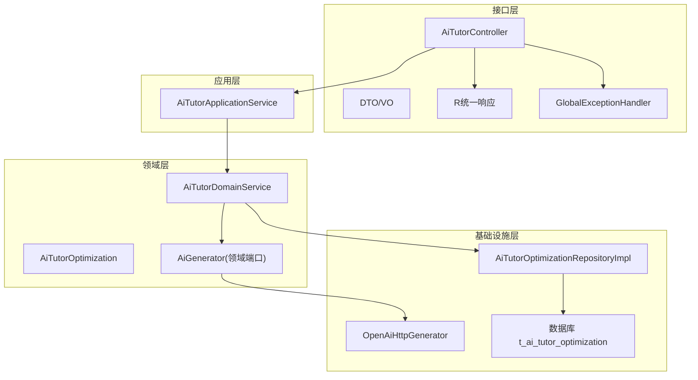
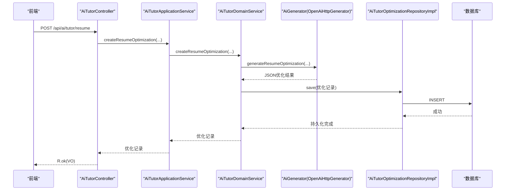
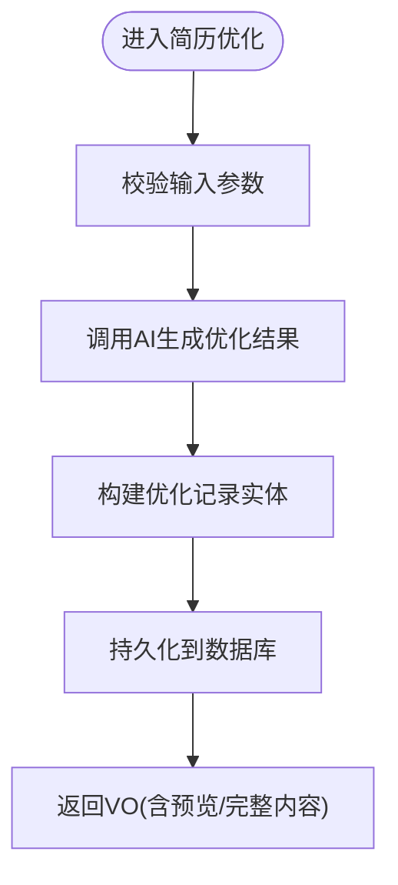
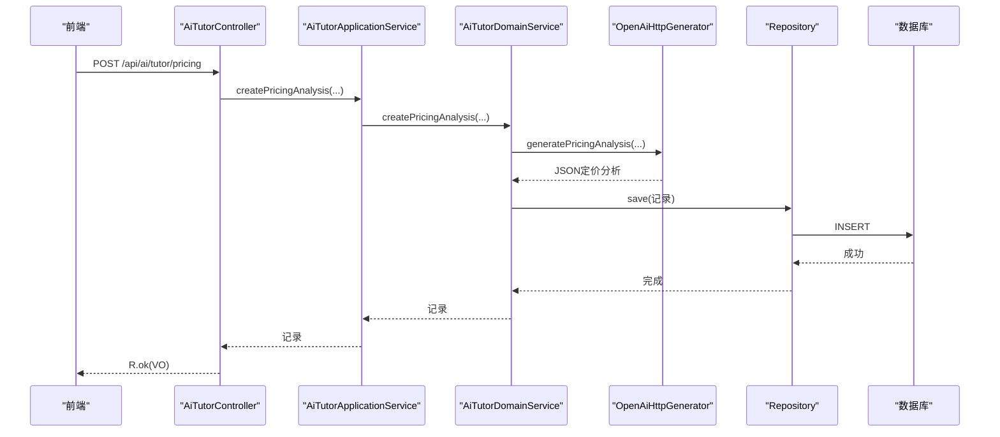
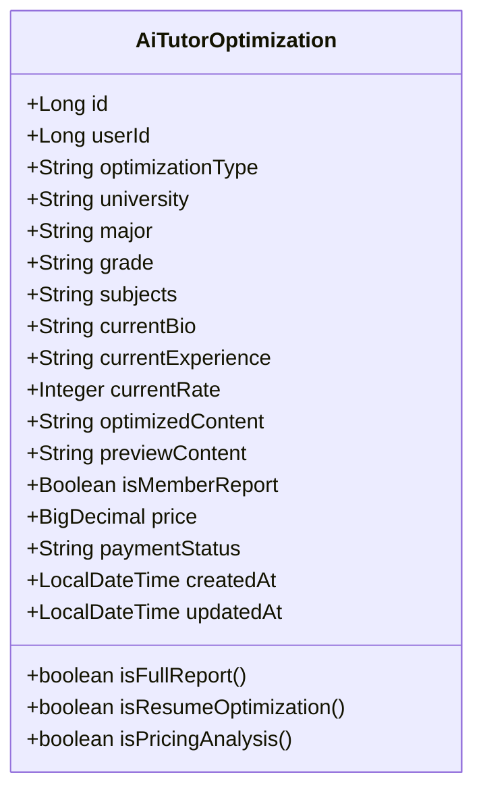
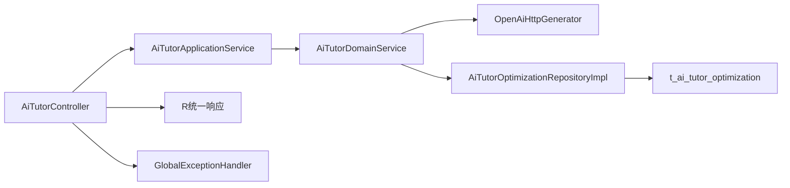

# AI辅导接口

<cite>
**本文引用的文件**
- [AiTutorController.java](file://wzoto-backend/wzoto-interfaces/src/main/java/com/wzoto/interfaces/controller/AiTutorController.java)
- [AiTutorApplicationService.java](file://wzoto-backend/wzoto-application/src/main/java/com/wzoto/application/service/AiTutorApplicationService.java)
- [AiTutorDomainService.java](file://wzoto-backend/wzoto-domain/src/main/java/com/wzoto/domain/service/AiTutorDomainService.java)
- [AiTutorOptimization.java](file://wzoto-backend/wzoto-domain/src/main/java/com/wzoto/domain/entity/AiTutorOptimization.java)
- [CreateResumeOptimizationDTO.java](file://wzoto-backend/wzoto-interfaces/src/main/java/com/wzoto/interfaces/dto/ai/CreateResumeOptimizationDTO.java)
- [CreatePricingAnalysisDTO.java](file://wzoto-backend/wzoto-interfaces/src/main/java/com/wzoto/interfaces/dto/ai/CreatePricingAnalysisDTO.java)
- [AiTutorOptimizationVO.java](file://wzoto-backend/wzoto-interfaces/src/main/java/com/wzoto/interfaces/vo/ai/AiTutorOptimizationVO.java)
- [OpenAiHttpGenerator.java](file://wzoto-backend/wzoto-infrastructure/src/main/java/com/wzoto/infrastructure/ai/OpenAiHttpGenerator.java)
- [AiServiceHelper.java](file://wzoto-backend/wzoto-infrastructure/src/main/java/com/wzoto/infrastructure/ai/AiServiceHelper.java)
- [AiGenerator.java](file://wzoto-backend/wzoto-domain/src/main/java/com/wzoto/domain/repository/AiGenerator.java)
- [AiTutorOptimizationRepositoryImpl.java](file://wzoto-backend/wzoto-infrastructure/src/main/java/com/wzoto/infrastructure/repository/AiTutorOptimizationRepositoryImpl.java)
- [t_ai_tutor_optimization.sql](file://wzoto-backend/sql/t_ai_tutor_optimization.sql)
- [R.java](file://wzoto-backend/wzoto-interfaces/src/main/java/com/wzoto/interfaces/common/R.java)
- [GlobalExceptionHandler.java](file://wzoto-backend/wzoto-interfaces/src/main/java/com/wzoto/interfaces/common/GlobalExceptionHandler.java)
</cite>

## 目录
1. [简介](#简介)
2. [项目结构](#项目结构)
3. [核心组件](#核心组件)
4. [架构总览](#架构总览)
5. [详细组件分析](#详细组件分析)
6. [依赖关系分析](#依赖关系分析)
7. [性能考虑](#性能考虑)
8. [故障排查指南](#故障排查指南)
9. [结论](#结论)
10. [附录：API参考](#附录api参考)

## 简介
本文件为AI辅导功能的完整API接口文档，覆盖简历优化、定价分析等能力。内容包含：
- HTTP方法、URL路径、输入参数与返回结果结构
- 自然语言处理、机器学习推荐、智能分析的调用流程与示例
- 辅导服务架构：需求分析、方案生成、效果评估机制
- 错误处理策略：分析失败、推荐异常、服务不可用
- 性能优化建议：模型缓存、批量处理、实时反馈

## 项目结构
后端采用分层架构：
- 接口层（interfaces）：控制器、DTO/VO、统一响应体、全局异常处理
- 应用层（application）：编排领域服务，承载用例级流程
- 领域层（domain）：业务实体、领域服务、领域端口（如AiGenerator）
- 基础设施层（infrastructure）：AI调用实现（OpenAI兼容）、仓储实现、配置

图表来源
- [AiTutorController.java:21-115](file://wzoto-backend/wzoto-interfaces/src/main/java/com/wzoto/interfaces/controller/AiTutorController.java#L21-L115)
- [AiTutorApplicationService.java:13-43](file://wzoto-backend/wzoto-application/src/main/java/com/wzoto/application/service/AiTutorApplicationService.java#L13-L43)
- [AiTutorDomainService.java:19-132](file://wzoto-backend/wzoto-domain/src/main/java/com/wzoto/domain/service/AiTutorDomainService.java#L19-L132)
- [OpenAiHttpGenerator.java:18-394](file://wzoto-backend/wzoto-infrastructure/src/main/java/com/wzoto/infrastructure/ai/OpenAiHttpGenerator.java#L18-L394)
- [AiTutorOptimizationRepositoryImpl.java:14-93](file://wzoto-backend/wzoto-infrastructure/src/main/java/com/wzoto/infrastructure/repository/AiTutorOptimizationRepositoryImpl.java#L14-L93)
- [t_ai_tutor_optimization.sql:1-24](file://wzoto-backend/sql/t_ai_tutor_optimization.sql#L1-L24)

章节来源
- [AiTutorController.java:21-115](file://wzoto-backend/wzoto-interfaces/src/main/java/com/wzoto/interfaces/controller/AiTutorController.java#L21-L115)
- [AiTutorApplicationService.java:13-43](file://wzoto-backend/wzoto-application/src/main/java/com/wzoto/application/service/AiTutorApplicationService.java#L13-L43)
- [AiTutorDomainService.java:19-132](file://wzoto-backend/wzoto-domain/src/main/java/com/wzoto/domain/service/AiTutorDomainService.java#L19-L132)
- [OpenAiHttpGenerator.java:18-394](file://wzoto-backend/wzoto-infrastructure/src/main/java/com/wzoto/infrastructure/ai/OpenAiHttpGenerator.java#L18-L394)
- [AiTutorOptimizationRepositoryImpl.java:14-93](file://wzoto-backend/wzoto-infrastructure/src/main/java/com/wzoto/infrastructure/repository/AiTutorOptimizationRepositoryImpl.java#L14-L93)
- [t_ai_tutor_optimization.sql:1-24](file://wzoto-backend/sql/t_ai_tutor_optimization.sql#L1-L24)

## 核心组件
- 控制器：暴露REST API，负责参数校验、上下文获取、结果封装
- 应用服务：编排用例，协调领域服务完成业务流程
- 领域服务：实现简历优化、定价分析的业务规则与状态管理
- AI生成器：通过OpenAI兼容接口进行NLP/ML推理，提供降级方案
- 仓储：持久化优化记录，支持按用户查询与更新
- 数据模型：AiTutorOptimization实体与VO/DTO用于传输

章节来源
- [AiTutorController.java:21-115](file://wzoto-backend/wzoto-interfaces/src/main/java/com/wzoto/interfaces/controller/AiTutorController.java#L21-L115)
- [AiTutorApplicationService.java:13-43](file://wzoto-backend/wzoto-application/src/main/java/com/wzoto/application/service/AiTutorApplicationService.java#L13-L43)
- [AiTutorDomainService.java:19-132](file://wzoto-backend/wzoto-domain/src/main/java/com/wzoto/domain/service/AiTutorDomainService.java#L19-L132)
- [AiTutorOptimization.java:8-62](file://wzoto-backend/wzoto-domain/src/main/java/com/wzoto/domain/entity/AiTutorOptimization.java#L8-L62)
- [OpenAiHttpGenerator.java:18-394](file://wzoto-backend/wzoto-infrastructure/src/main/java/com/wzoto/infrastructure/ai/OpenAiHttpGenerator.java#L18-L394)
- [AiTutorOptimizationRepositoryImpl.java:14-93](file://wzoto-backend/wzoto-infrastructure/src/main/java/com/wzoto/infrastructure/repository/AiTutorOptimizationRepositoryImpl.java#L14-L93)

## 架构总览
AI辅导服务遵循“接口层-应用层-领域层-基础设施层”的分层设计，结合领域端口解耦AI实现，便于替换或扩展。

图表来源
- [AiTutorController.java:33-41](file://wzoto-backend/wzoto-interfaces/src/main/java/com/wzoto/interfaces/controller/AiTutorController.java#L33-L41)
- [AiTutorApplicationService.java:19-23](file://wzoto-backend/wzoto-application/src/main/java/com/wzoto/application/service/AiTutorApplicationService.java#L19-L23)
- [AiTutorDomainService.java:34-62](file://wzoto-backend/wzoto-domain/src/main/java/com/wzoto/domain/service/AiTutorDomainService.java#L34-L62)
- [OpenAiHttpGenerator.java:186-203](file://wzoto-backend/wzoto-infrastructure/src/main/java/com/wzoto/infrastructure/ai/OpenAiHttpGenerator.java#L186-L203)
- [AiTutorOptimizationRepositoryImpl.java:20-25](file://wzoto-backend/wzoto-infrastructure/src/main/java/com/wzoto/infrastructure/repository/AiTutorOptimizationRepositoryImpl.java#L20-L25)
- [t_ai_tutor_optimization.sql:1-24](file://wzoto-backend/sql/t_ai_tutor_optimization.sql#L1-L24)

## 详细组件分析

### 简历优化接口
- 功能：基于教员背景（学校、专业、年级、科目、简介、经验）生成优化后的个人简介与经验描述，并输出亮点与建议
- 方法：POST
- 路径：/api/ai/tutor/resume
- 请求体：CreateResumeOptimizationDTO
  - university: 必填
  - major: 必填
  - grade: 可选
  - subjects: 必填
  - bio: 可选
  - experience: 可选
- 返回：R<AiTutorOptimizationVO>
  - id, optimizationType="RESUME", university, major, grade, subjects, currentBio, currentExperience, optimizedContent, previewContent, isMemberReport, price, paymentStatus, createdAt
- 业务要点：
  - 非会员需付费解锁完整内容；定价分析免费
  - 预览内容可展示摘要，完整内容受支付状态控制

图表来源
- [AiTutorController.java:33-41](file://wzoto-backend/wzoto-interfaces/src/main/java/com/wzoto/interfaces/controller/AiTutorController.java#L33-L41)
- [AiTutorDomainService.java:34-62](file://wzoto-backend/wzoto-domain/src/main/java/com/wzoto/domain/service/AiTutorDomainService.java#L34-L62)
- [OpenAiHttpGenerator.java:186-203](file://wzoto-backend/wzoto-infrastructure/src/main/java/com/wzoto/infrastructure/ai/OpenAiHttpGenerator.java#L186-L203)
- [AiTutorOptimizationRepositoryImpl.java:20-25](file://wzoto-backend/wzoto-infrastructure/src/main/java/com/wzoto/infrastructure/repository/AiTutorOptimizationRepositoryImpl.java#L20-L25)

章节来源
- [AiTutorController.java:33-41](file://wzoto-backend/wzoto-interfaces/src/main/java/com/wzoto/interfaces/controller/AiTutorController.java#L33-L41)
- [CreateResumeOptimizationDTO.java:9-27](file://wzoto-backend/wzoto-interfaces/src/main/java/com/wzoto/interfaces/dto/ai/CreateResumeOptimizationDTO.java#L9-L27)
- [AiTutorOptimizationVO.java:12-32](file://wzoto-backend/wzoto-interfaces/src/main/java/com/wzoto/interfaces/vo/ai/AiTutorOptimizationVO.java#L12-L32)
- [AiTutorDomainService.java:34-62](file://wzoto-backend/wzoto-domain/src/main/java/com/wzoto/domain/service/AiTutorDomainService.java#L34-L62)
- [OpenAiHttpGenerator.java:186-203](file://wzoto-backend/wzoto-infrastructure/src/main/java/com/wzoto/infrastructure/ai/OpenAiHttpGenerator.java#L186-L203)

### 定价分析接口
- 功能：根据教员背景与当前时薪，给出市场参考价、建议定价策略与影响因素
- 方法：POST
- 路径：/api/ai/tutor/pricing
- 请求体：CreatePricingAnalysisDTO
  - university: 必填
  - major: 必填
  - grade: 可选
  - subjects: 必填
  - experience: 可选
  - currentRate: 必填（整数）
- 返回：R<AiTutorOptimizationVO>
  - 字段同上，optimizationType="PRICING"，isMemberReport=true，price=0，paymentStatus="FREE"
- 业务要点：
  - 定价分析对所有用户免费（引流功能）
  - 输出结构化JSON，便于前端渲染图表与策略卡片

图表来源
- [AiTutorController.java:47-55](file://wzoto-backend/wzoto-interfaces/src/main/java/com/wzoto/interfaces/controller/AiTutorController.java#L47-L55)
- [AiTutorApplicationService.java:25-29](file://wzoto-backend/wzoto-application/src/main/java/com/wzoto/application/service/AiTutorApplicationService.java#L25-L29)
- [AiTutorDomainService.java:67-94](file://wzoto-backend/wzoto-domain/src/main/java/com/wzoto/domain/service/AiTutorDomainService.java#L67-L94)
- [OpenAiHttpGenerator.java:237-255](file://wzoto-backend/wzoto-infrastructure/src/main/java/com/wzoto/infrastructure/ai/OpenAiHttpGenerator.java#L237-L255)
- [AiTutorOptimizationRepositoryImpl.java:20-25](file://wzoto-backend/wzoto-infrastructure/src/main/java/com/wzoto/infrastructure/repository/AiTutorOptimizationRepositoryImpl.java#L20-L25)

章节来源
- [AiTutorController.java:47-55](file://wzoto-backend/wzoto-interfaces/src/main/java/com/wzoto/interfaces/controller/AiTutorController.java#L47-L55)
- [CreatePricingAnalysisDTO.java:10-29](file://wzoto-backend/wzoto-interfaces/src/main/java/com/wzoto/interfaces/dto/ai/CreatePricingAnalysisDTO.java#L10-L29)
- [AiTutorDomainService.java:67-94](file://wzoto-backend/wzoto-domain/src/main/java/com/wzoto/domain/service/AiTutorDomainService.java#L67-L94)
- [OpenAiHttpGenerator.java:237-255](file://wzoto-backend/wzoto-infrastructure/src/main/java/com/wzoto/infrastructure/ai/OpenAiHttpGenerator.java#L237-L255)

### 我的优化记录与详情
- 列表：GET /api/ai/tutor/optimizations
  - 返回：R<List<AiTutorOptimizationVO>>，按创建时间倒序
- 详情：GET /api/ai/tutor/{id}
  - 返回：R<AiTutorOptimizationVO>，仅当前用户可见

章节来源
- [AiTutorController.java:59-77](file://wzoto-backend/wzoto-interfaces/src/main/java/com/wzoto/interfaces/controller/AiTutorController.java#L59-L77)
- [AiTutorDomainService.java:99-112](file://wzoto-backend/wzoto-domain/src/main/java/com/wzoto/domain/service/AiTutorDomainService.java#L99-L112)
- [AiTutorOptimizationRepositoryImpl.java:33-41](file://wzoto-backend/wzoto-infrastructure/src/main/java/com/wzoto/infrastructure/repository/AiTutorOptimizationRepositoryImpl.java#L33-L41)

### 付费解锁
- 方法：POST /api/ai/tutor/{id}/pay
- 功能：将指定记录的支付状态更新为已支付，从而解锁完整内容
- 返回：R<AiTutorOptimizationVO>

章节来源
- [AiTutorController.java:83-88](file://wzoto-backend/wzoto-interfaces/src/main/java/com/wzoto/interfaces/controller/AiTutorController.java#L83-L88)
- [AiTutorDomainService.java:117-122](file://wzoto-backend/wzoto-domain/src/main/java/com/wzoto/domain/service/AiTutorDomainService.java#L117-L122)
- [AiTutorOptimizationRepositoryImpl.java:43-47](file://wzoto-backend/wzoto-infrastructure/src/main/java/com/wzoto/infrastructure/repository/AiTutorOptimizationRepositoryImpl.java#L43-L47)

### 数据结构与模型
- 实体：AiTutorOptimization
  - 关键字段：userId, optimizationType, university, major, grade, subjects, currentBio/currentExperience/currentRate, optimizedContent, previewContent, isMemberReport, price, paymentStatus, createdAt/updatedAt
  - 便捷方法：isFullReport(), isResumeOptimization(), isPricingAnalysis()
- VO/DTO：用于接口入参与出参的约束与展示

图表来源
- [AiTutorOptimization.java:8-62](file://wzoto-backend/wzoto-domain/src/main/java/com/wzoto/domain/entity/AiTutorOptimization.java#L8-L62)

章节来源
- [AiTutorOptimization.java:8-62](file://wzoto-backend/wzoto-domain/src/main/java/com/wzoto/domain/entity/AiTutorOptimization.java#L8-L62)
- [AiTutorOptimizationVO.java:12-32](file://wzoto-backend/wzoto-interfaces/src/main/java/com/wzoto/interfaces/vo/ai/AiTutorOptimizationVO.java#L12-L32)
- [CreateResumeOptimizationDTO.java:9-27](file://wzoto-backend/wzoto-interfaces/src/main/java/com/wzoto/interfaces/dto/ai/CreateResumeOptimizationDTO.java#L9-L27)
- [CreatePricingAnalysisDTO.java:10-29](file://wzoto-backend/wzoto-interfaces/src/main/java/com/wzoto/interfaces/dto/ai/CreatePricingAnalysisDTO.java#L10-L29)

## 依赖关系分析
- 控制器依赖应用服务，应用服务依赖领域服务
- 领域服务依赖AI生成器（OpenAI兼容）与仓储
- 仓储依赖MyBatis Mapper与数据库表
- 统一响应体与全局异常处理器保障一致的错误与成功格式

图表来源
- [AiTutorController.java:21-115](file://wzoto-backend/wzoto-interfaces/src/main/java/com/wzoto/interfaces/controller/AiTutorController.java#L21-L115)
- [AiTutorApplicationService.java:13-43](file://wzoto-backend/wzoto-application/src/main/java/com/wzoto/application/service/AiTutorApplicationService.java#L13-L43)
- [AiTutorDomainService.java:19-132](file://wzoto-backend/wzoto-domain/src/main/java/com/wzoto/domain/service/AiTutorDomainService.java#L19-L132)
- [OpenAiHttpGenerator.java:18-394](file://wzoto-backend/wzoto-infrastructure/src/main/java/com/wzoto/infrastructure/ai/OpenAiHttpGenerator.java#L18-L394)
- [AiTutorOptimizationRepositoryImpl.java:14-93](file://wzoto-backend/wzoto-infrastructure/src/main/java/com/wzoto/infrastructure/repository/AiTutorOptimizationRepositoryImpl.java#L14-L93)
- [t_ai_tutor_optimization.sql:1-24](file://wzoto-backend/sql/t_ai_tutor_optimization.sql#L1-L24)
- [R.java:10-43](file://wzoto-backend/wzoto-interfaces/src/main/java/com/wzoto/interfaces/common/R.java#L10-L43)
- [GlobalExceptionHandler.java:14-67](file://wzoto-backend/wzoto-interfaces/src/main/java/com/wzoto/interfaces/common/GlobalExceptionHandler.java#L14-L67)

章节来源
- [AiTutorController.java:21-115](file://wzoto-backend/wzoto-interfaces/src/main/java/com/wzoto/interfaces/controller/AiTutorController.java#L21-L115)
- [AiTutorApplicationService.java:13-43](file://wzoto-backend/wzoto-application/src/main/java/com/wzoto/application/service/AiTutorApplicationService.java#L13-L43)
- [AiTutorDomainService.java:19-132](file://wzoto-backend/wzoto-domain/src/main/java/com/wzoto/domain/service/AiTutorDomainService.java#L19-L132)
- [OpenAiHttpGenerator.java:18-394](file://wzoto-backend/wzoto-infrastructure/src/main/java/com/wzoto/infrastructure/ai/OpenAiHttpGenerator.java#L18-L394)
- [AiTutorOptimizationRepositoryImpl.java:14-93](file://wzoto-backend/wzoto-infrastructure/src/main/java/com/wzoto/infrastructure/repository/AiTutorOptimizationRepositoryImpl.java#L14-L93)
- [R.java:10-43](file://wzoto-backend/wzoto-interfaces/src/main/java/com/wzoto/interfaces/common/R.java#L10-L43)
- [GlobalExceptionHandler.java:14-67](file://wzoto-backend/wzoto-interfaces/src/main/java/com/wzoto/interfaces/common/GlobalExceptionHandler.java#L14-L67)

## 性能考虑
- 模型缓存：对AI生成的结构化结果可按用户+场景键缓存（如简历优化、定价分析），减少重复计算
- 批量处理：对多用户批量生成报告时，采用队列与批提交，降低外部API压力
- 超时与重试：使用带重试的调用封装，合理设置连接与读取超时，避免长尾请求阻塞
- 限流：每日调用次数限制，防止配额耗尽导致服务不可用
- 预览优先：先返回轻量预览内容，提升首屏体验；完整内容按需加载
- 异步化：耗时任务（如复杂学习规划）可异步执行，前端轮询或WebSocket推送结果

[本节为通用性能建议，不直接分析具体文件]

## 故障排查指南
- 参数校验失败：检查必填字段是否缺失或类型不符；全局异常处理器会返回400与错误信息
- 业务规则违反：如访问他人记录、非法状态变更，返回400并提示原因
- 运行时异常：系统内部错误返回500，附带错误消息
- AI服务不可用：当外部AI接口失败时，自动降级为默认模板结果，保证可用性
- 每日调用超限：触发限流保护，返回提示信息，建议稍后重试或升级配额

章节来源
- [GlobalExceptionHandler.java:18-67](file://wzoto-backend/wzoto-interfaces/src/main/java/com/wzoto/interfaces/common/GlobalExceptionHandler.java#L18-L67)
- [AiServiceHelper.java:14-43](file://wzoto-backend/wzoto-infrastructure/src/main/java/com/wzoto/infrastructure/ai/AiServiceHelper.java#L14-L43)
- [OpenAiHttpGenerator.java:104-118](file://wzoto-backend/wzoto-infrastructure/src/main/java/com/wzoto/infrastructure/ai/OpenAiHttpGenerator.java#L104-L118)
- [OpenAiHttpGenerator.java:140-168](file://wzoto-backend/wzoto-infrastructure/src/main/java/com/wzoto/infrastructure/ai/OpenAiHttpGenerator.java#L140-L168)
- [OpenAiHttpGenerator.java:312-338](file://wzoto-backend/wzoto-infrastructure/src/main/java/com/wzoto/infrastructure/ai/OpenAiHttpGenerator.java#L312-L338)

## 结论
本AI辅导功能通过清晰的分层架构与领域端口解耦，实现了简历优化与定价分析的稳定交付。对外提供简洁一致的REST接口，对内具备完善的错误处理与降级机制。建议在后续迭代中引入缓存、异步与监控指标，进一步提升性能与可观测性。

[本节为总结性内容，不直接分析具体文件]

## 附录：API参考

### 统一响应体
- 结构：R<T>
  - code: 状态码（200成功，400/401/500等）
  - msg: 消息
  - data: 数据体

章节来源
- [R.java:10-43](file://wzoto-backend/wzoto-interfaces/src/main/java/com/wzoto/interfaces/common/R.java#L10-L43)

### 接口清单
- 简历优化
  - POST /api/ai/tutor/resume
  - 请求体：CreateResumeOptimizationDTO
  - 返回：R<AiTutorOptimizationVO>
- 定价分析
  - POST /api/ai/tutor/pricing
  - 请求体：CreatePricingAnalysisDTO
  - 返回：R<AiTutorOptimizationVO>
- 我的优化记录
  - GET /api/ai/tutor/optimizations
  - 返回：R<List<AiTutorOptimizationVO>>
- 优化详情
  - GET /api/ai/tutor/{id}
  - 返回：R<AiTutorOptimizationVO>
- 付费解锁
  - POST /api/ai/tutor/{id}/pay
  - 返回：R<AiTutorOptimizationVO>

章节来源
- [AiTutorController.java:33-88](file://wzoto-backend/wzoto-interfaces/src/main/java/com/wzoto/interfaces/controller/AiTutorController.java#L33-L88)
- [CreateResumeOptimizationDTO.java:9-27](file://wzoto-backend/wzoto-interfaces/src/main/java/com/wzoto/interfaces/dto/ai/CreateResumeOptimizationDTO.java#L9-L27)
- [CreatePricingAnalysisDTO.java:10-29](file://wzoto-backend/wzoto-interfaces/src/main/java/com/wzoto/interfaces/dto/ai/CreatePricingAnalysisDTO.java#L10-L29)
- [AiTutorOptimizationVO.java:12-32](file://wzoto-backend/wzoto-interfaces/src/main/java/com/wzoto/interfaces/vo/ai/AiTutorOptimizationVO.java#L12-L32)

### 数据表结构
- 表名：t_ai_tutor_optimization
- 主要字段：id, user_id, optimization_type, university, major, grade, subjects, current_bio, current_experience, current_rate, optimized_content, preview_content, is_member_report, price, payment_status, deleted, created_at, updated_at

章节来源
- [t_ai_tutor_optimization.sql:1-24](file://wzoto-backend/sql/t_ai_tutor_optimization.sql#L1-L24)

### AI能力调用示例（概念说明）
- 简历优化：传入学校、专业、年级、科目、简介、经验，返回结构化优化结果与亮点
- 定价分析：传入学校、专业、年级、科目、经验、当前时薪，返回市场参考与建议策略
- 学情分析与学习规划：通过AiGenerator接口扩展，支持分步解题、错题分析、每日计划等

章节来源
- [AiGenerator.java:7-37](file://wzoto-backend/wzoto-domain/src/main/java/com/wzoto/domain/repository/AiGenerator.java#L7-L37)
- [OpenAiHttpGenerator.java:75-168](file://wzoto-backend/wzoto-infrastructure/src/main/java/com/wzoto/infrastructure/ai/OpenAiHttpGenerator.java#L75-L168)
- [OpenAiHttpGenerator.java:340-394](file://wzoto-backend/wzoto-infrastructure/src/main/java/com/wzoto/infrastructure/ai/OpenAiHttpGenerator.java#L340-L394)