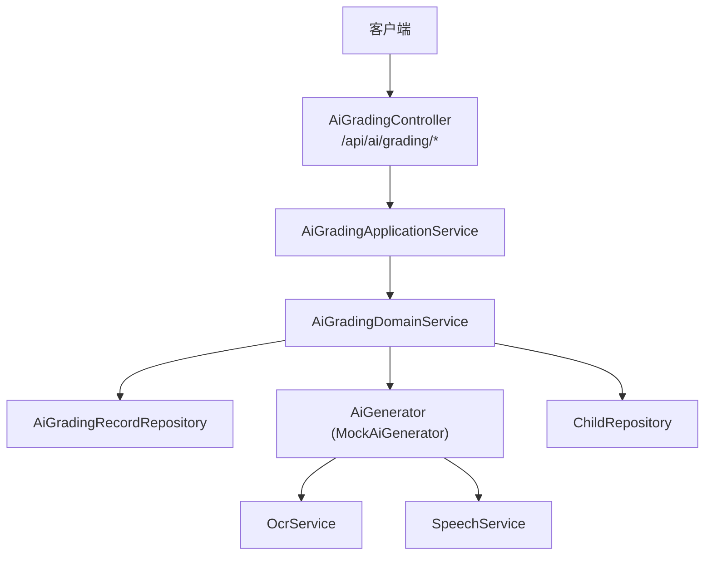
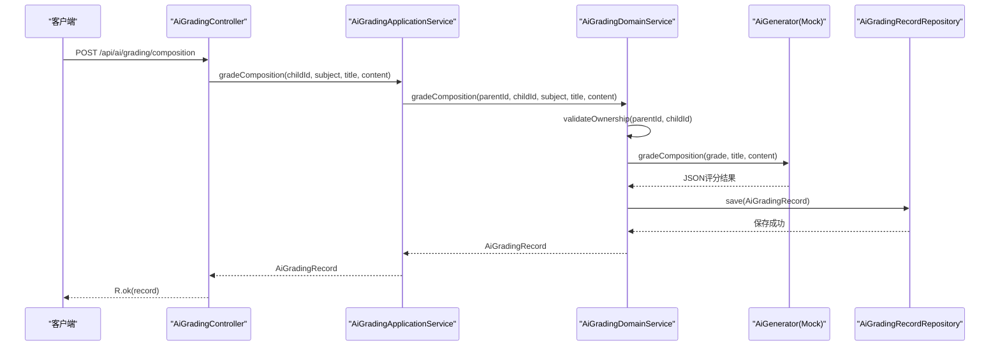
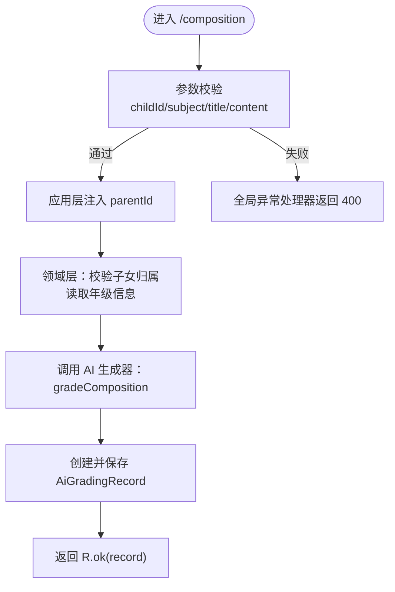
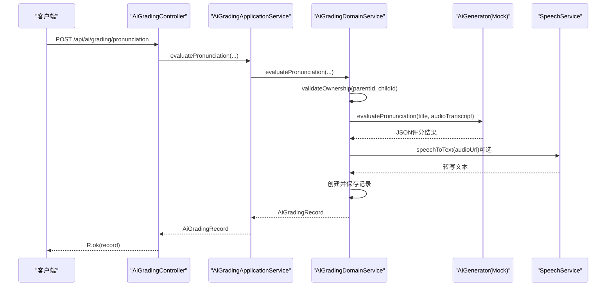
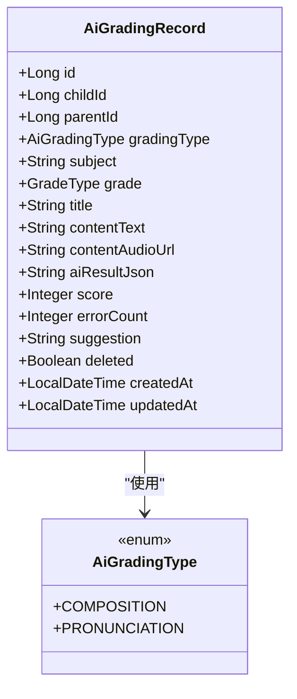
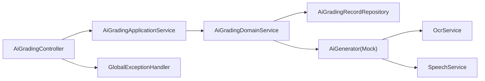

# 作业批改接口

<cite>
**本文引用的文件**
- [AiGradingController.java](file://wzoto-backend/wzoto-interfaces/src/main/java/com/wzoto/interfaces/controller/AiGradingController.java)
- [AiGradingApplicationService.java](file://wzoto-backend/wzoto-application/src/main/java/com/wzoto/application/service/AiGradingApplicationService.java)
- [AiGradingDomainService.java](file://wzoto-backend/wzoto-domain/src/main/java/com/wzoto/domain/service/AiGradingDomainService.java)
- [CompositionGradeDTO.java](file://wzoto-backend/wzoto-interfaces/src/main/java/com/wzoto/interfaces/dto/CompositionGradeDTO.java)
- [PronunciationEvalDTO.java](file://wzoto-backend/wzoto-interfaces/src/main/java/com/wzoto/interfaces/dto/PronunciationEvalDTO.java)
- [AiGradingRecord.java](file://wzoto-backend/wzoto-domain/src/main/java/com/wzoto/domain/entity/AiGradingRecord.java)
- [MockAiGenerator.java](file://wzoto-backend/wzoto-infrastructure/src/main/java/com/wzoto/infrastructure/a i/MockAiGenerator.java)
- [OcrService.java](file://wzoto-backend/wzoto-infrastructure/src/main/java/com/wzoto/infrastructure/a i/OcrService.java)
- [SpeechService.java](file://wzoto-backend/wzoto-infrastructure/src/main/java/com/wzoto/infrastructure/a i/SpeechService.java)
- [GlobalExceptionHandler.java](file://wzoto-backend/wzoto-interfaces/src/main/java/com/wzoto/interfaces/common/GlobalExceptionHandler.java)
- [R.java](file://wzoto-backend/wzoto-interfaces/src/main/java/com/wzoto/interfaces/common/R.java)
- [AiGradingType.java](file://wzoto-backend/wzoto-domain/src/main/java/com/wzoto/domain/valobj/AiGradingType.java)
</cite>

## 目录
1. [简介](#简介)
2. [项目结构](#项目结构)
3. [核心组件](#核心组件)
4. [架构总览](#架构总览)
5. [详细组件分析](#详细组件分析)
6. [依赖关系分析](#依赖关系分析)
7. [性能考虑](#性能考虑)
8. [故障排查指南](#故障排查指南)
9. [结论](#结论)
10. [附录：API 参考](#附录api-参考)

## 简介
本文件为“作业批改”功能的完整 API 接口文档，覆盖作文评分、口语评测与自动批改能力。内容包括：
- HTTP 方法与 URL 路径
- 请求参数与文件上传格式说明（当前实现以文本与音频 URL 为主）
- 评分结果结构与字段含义
- OCR 文字识别、语法检查、内容评价等 AI 能力的调用方式与示例
- 批改流程管理：任务提交、异步处理、结果通知机制建议
- 错误处理方案：参数校验失败、权限不足、AI 服务异常等
- 性能优化建议：大文件处理、批量批改、结果缓存与限流重试

## 项目结构
本项目采用分层架构：接口层（Controller）、应用层（Application Service）、领域层（Domain Service）、基础设施层（AI 服务与存储）。作业批改相关的关键文件如下：
- 接口层：定义 /api/ai/grading 下的作文与口语批改接口
- 应用层：编排业务上下文（如父用户身份）并调用领域服务
- 领域层：执行业务规则（所有权校验、记录创建、分数设置）
- 基础设施层：提供 Mock AI 生成器、OCR、语音转写与评测等能力

图表来源
- [AiGradingController.java:16-40](file://wzoto-backend/wzoto-interfaces/src/main/java/com/wzoto/interfaces/controller/AiGradingController.java#L16-L40)
- [AiGradingApplicationService.java:12-39](file://wzoto-backend/wzoto-application/src/main/java/com/wzoto/application/service/AiGradingApplicationService.java#L12-L39)
- [AiGradingDomainService.java:15-89](file://wzoto-backend/wzoto-domain/src/main/java/com/wzoto/domain/service/AiGradingDomainService.java#L15-L89)
- [MockAiGenerator.java:248-300](file://wzoto-backend/wzoto-infrastructure/src/main/java/com/wzoto/infrastructure/a i/MockAiGenerator.java#L248-L300)
- [OcrService.java:12-37](file://wzoto-backend/wzoto-infrastructure/src/main/java/com/wzoto/infrastructure/a i/OcrService.java#L12-L37)
- [SpeechService.java:12-38](file://wzoto-backend/wzoto-infrastructure/src/main/java/com/wzoto/infrastructure/a i/SpeechService.java#L12-L38)

章节来源
- [AiGradingController.java:16-40](file://wzoto-backend/wzoto-interfaces/src/main/java/com/wzoto/interfaces/controller/AiGradingController.java#L16-L40)
- [AiGradingApplicationService.java:12-39](file://wzoto-backend/wzoto-application/src/main/java/com/wzoto/application/service/AiGradingApplicationService.java#L12-L39)
- [AiGradingDomainService.java:15-89](file://wzoto-backend/wzoto-domain/src/main/java/com/wzoto/domain/service/AiGradingDomainService.java#L15-L89)

## 核心组件
- AiGradingController：暴露作文与口语批改的 REST 接口，统一返回 R<T>
- AiGradingApplicationService：从上下文中获取父用户 ID，委派给领域服务
- AiGradingDomainService：校验子女归属、调用 AI 生成器、持久化批改记录
- MockAiGenerator：开发环境模拟 AI 输出（作文评分、口语评测）
- OcrService / SpeechService：预留 OCR 与语音转写/评测能力（当前为 Mock）
- GlobalExceptionHandler：统一异常处理与错误码封装
- R：统一响应体结构

章节来源
- [AiGradingController.java:16-40](file://wzoto-backend/wzoto-interfaces/src/main/java/com/wzoto/interfaces/controller/AiGradingController.java#L16-L40)
- [AiGradingApplicationService.java:12-39](file://wzoto-backend/wzoto-application/src/main/java/com/wzoto/application/service/AiGradingApplicationService.java#L12-L39)
- [AiGradingDomainService.java:15-89](file://wzoto-backend/wzoto-domain/src/main/java/com/wzoto/domain/service/AiGradingDomainService.java#L15-L89)
- [MockAiGenerator.java:248-300](file://wzoto-backend/wzoto-infrastructure/src/main/java/com/wzoto/infrastructure/a i/MockAiGenerator.java#L248-L300)
- [OcrService.java:12-37](file://wzoto-backend/wzoto-infrastructure/src/main/java/com/wzoto/infrastructure/a i/OcrService.java#L12-L37)
- [SpeechService.java:12-38](file://wzoto-backend/wzoto-infrastructure/src/main/java/com/wzoto/infrastructure/a i/SpeechService.java#L12-L38)
- [GlobalExceptionHandler.java:14-66](file://wzoto-backend/wzoto-interfaces/src/main/java/com/wzoto/interfaces/common/GlobalExceptionHandler.java#L14-L66)
- [R.java:10-42](file://wzoto-backend/wzoto-interfaces/src/main/java/com/wzoto/interfaces/common/R.java#L10-L42)

## 架构总览
下图展示了从请求到评分结果的端到端调用链，包括权限校验、AI 生成、记录持久化与统一响应。

图表来源
- [AiGradingController.java:25-35](file://wzoto-backend/wzoto-interfaces/src/main/java/com/wzoto/interfaces/controller/AiGradingController.java#L25-L35)
- [AiGradingApplicationService.java:20-28](file://wzoto-backend/wzoto-application/src/main/java/com/wzoto/application/service/AiGradingApplicationService.java#L20-L28)
- [AiGradingDomainService.java:30-63](file://wzoto-backend/wzoto-domain/src/main/java/com/wzoto/domain/service/AiGradingDomainService.java#L30-L63)
- [MockAiGenerator.java:248-300](file://wzoto-backend/wzoto-infrastructure/src/main/java/com/wzoto/infrastructure/a i/MockAiGenerator.java#L248-L300)

## 详细组件分析

### 作文批改接口
- 方法：POST
- 路径：/api/ai/grading/composition
- 请求体：CompositionGradeDTO
  - childId：Long，必填
  - subject：String，必填
  - title：String，必填
  - content：String，必填
- 响应：R<AiGradingRecord>
  - code/msg/data 由 R 统一封装
  - data 为 AiGradingRecord 实体

图表来源
- [CompositionGradeDTO.java:7-18](file://wzoto-backend/wzoto-interfaces/src/main/java/com/wzoto/interfaces/dto/CompositionGradeDTO.java#L7-L18)
- [AiGradingController.java:25-29](file://wzoto-backend/wzoto-interfaces/src/main/java/com/wzoto/interfaces/controller/AiGradingController.java#L25-L29)
- [AiGradingApplicationService.java:20-23](file://wzoto-backend/wzoto-application/src/main/java/com/wzoto/application/service/AiGradingApplicationService.java#L20-L23)
- [AiGradingDomainService.java:30-45](file://wzoto-backend/wzoto-domain/src/main/java/com/wzoto/domain/service/AiGradingDomainService.java#L30-L45)
- [GlobalExceptionHandler.java:32-41](file://wzoto-backend/wzoto-interfaces/src/main/java/com/wzoto/interfaces/common/GlobalExceptionHandler.java#L32-L41)

章节来源
- [CompositionGradeDTO.java:7-18](file://wzoto-backend/wzoto-interfaces/src/main/java/com/wzoto/interfaces/dto/CompositionGradeDTO.java#L7-L18)
- [AiGradingController.java:25-29](file://wzoto-backend/wzoto-interfaces/src/main/java/com/wzoto/interfaces/controller/AiGradingController.java#L25-L29)
- [AiGradingApplicationService.java:20-23](file://wzoto-backend/wzoto-application/src/main/java/com/wzoto/application/service/AiGradingApplicationService.java#L20-L23)
- [AiGradingDomainService.java:30-45](file://wzoto-backend/wzoto-domain/src/main/java/com/wzoto/domain/service/AiGradingDomainService.java#L30-L45)

### 口语评测接口
- 方法：POST
- 路径：/api/ai/grading/pronunciation
- 请求体：PronunciationEvalDTO
  - childId：Long，必填
  - title：String，可选
  - audioUrl：String，可选（音频地址）
  - audioTranscript：String，可选（转写文本）
- 响应：R<AiGradingRecord>

图表来源
- [PronunciationEvalDTO.java:7-14](file://wzoto-backend/wzoto-interfaces/src/main/java/com/wzoto/interfaces/dto/PronunciationEvalDTO.java#L7-L14)
- [AiGradingController.java:31-35](file://wzoto-backend/wzoto-interfaces/src/main/java/com/wzoto/interfaces/controller/AiGradingController.java#L31-L35)
- [AiGradingApplicationService.java:25-28](file://wzoto-backend/wzoto-application/src/main/java/com/wzoto/application/service/AiGradingApplicationService.java#L25-L28)
- [AiGradingDomainService.java:50-63](file://wzoto-backend/wzoto-domain/src/main/java/com/wzoto/domain/service/AiGradingDomainService.java#L50-L63)
- [SpeechService.java:14-38](file://wzoto-backend/wzoto-infrastructure/src/main/java/com/wzoto/infrastructure/a i/SpeechService.java#L14-L38)
- [MockAiGenerator.java:277-300](file://wzoto-backend/wzoto-infrastructure/src/main/java/com/wzoto/infrastructure/a i/MockAiGenerator.java#L277-L300)

章节来源
- [PronunciationEvalDTO.java:7-14](file://wzoto-backend/wzoto-interfaces/src/main/java/com/wzoto/interfaces/dto/PronunciationEvalDTO.java#L7-L14)
- [AiGradingController.java:31-35](file://wzoto-backend/wzoto-interfaces/src/main/java/com/wzoto/interfaces/controller/AiGradingController.java#L31-L35)
- [AiGradingDomainService.java:50-63](file://wzoto-backend/wzoto-domain/src/main/java/com/wzoto/domain/service/AiGradingDomainService.java#L50-L63)
- [SpeechService.java:14-38](file://wzoto-backend/wzoto-infrastructure/src/main/java/com/wzoto/infrastructure/a i/SpeechService.java#L14-L38)

### 历史记录查询接口
- 方法：GET
- 路径：/api/ai/grading/history/{childId}
- 响应：R<List<AiGradingRecord>>

章节来源
- [AiGradingController.java:37-40](file://wzoto-backend/wzoto-interfaces/src/main/java/com/wzoto/interfaces/controller/AiGradingController.java#L37-L40)
- [AiGradingApplicationService.java:30-33](file://wzoto-backend/wzoto-application/src/main/java/com/wzoto/application/service/AiGradingApplicationService.java#L30-L33)
- [AiGradingDomainService.java:69-72](file://wzoto-backend/wzoto-domain/src/main/java/com/wzoto/domain/service/AiGradingDomainService.java#L69-L72)

### 数据模型与类型
- AiGradingRecord：包含批改类型、学科、年级、标题、内容文本或音频地址、AI 结果 JSON、分数、错误数、建议等
- AiGradingType：枚举值 COMPOSITION（作文批改）、PRONUNCIATION（口语评测）

图表来源
- [AiGradingRecord.java:15-66](file://wzoto-backend/wzoto-domain/src/main/java/com/wzoto/domain/entity/AiGradingRecord.java#L15-L66)
- [AiGradingType.java:8-30](file://wzoto-backend/wzoto-domain/src/main/java/com/wzoto/domain/valobj/AiGradingType.java#L8-L30)

章节来源
- [AiGradingRecord.java:15-66](file://wzoto-backend/wzoto-domain/src/main/java/com/wzoto/domain/entity/AiGradingRecord.java#L15-L66)
- [AiGradingType.java:8-30](file://wzoto-backend/wzoto-domain/src/main/java/com/wzoto/domain/valobj/AiGradingType.java#L8-L30)

### AI 能力集成示例
- 作文评分：通过 AiGenerator.gradeComposition 返回结构化 JSON，包含分数、等级、亮点、错误与建议等
- 口语评测：通过 AiGenerator.evaluatePronunciation 返回分数、等级、音素准确度与建议；可结合 SpeechService.speechToText 进行转写
- OCR 文字识别：OcrService 提供图片文字与数学公式识别（当前为 Mock），可用于将手写题图转为文本后参与评分

章节来源
- [MockAiGenerator.java:248-300](file://wzoto-backend/wzoto-infrastructure/src/main/java/com/wzoto/infrastructure/a i/MockAiGenerator.java#L248-L300)
- [SpeechService.java:14-38](file://wzoto-backend/wzoto-infrastructure/src/main/java/com/wzoto/infrastructure/a i/SpeechService.java#L14-L38)
- [OcrService.java:12-37](file://wzoto-backend/wzoto-infrastructure/src/main/java/com/wzoto/infrastructure/a i/OcrService.java#L12-L37)

## 依赖关系分析
- 控制器依赖应用服务，应用服务依赖领域服务
- 领域服务依赖仓储（持久化）与 AI 生成器（Mock）
- 基础设施层提供 OCR 与语音能力，供 AI 生成器或后续扩展使用
- 全局异常处理器统一捕获参数校验、业务规则与运行时异常

图表来源
- [AiGradingController.java:16-40](file://wzoto-backend/wzoto-interfaces/src/main/java/com/wzoto/interfaces/controller/AiGradingController.java#L16-L40)
- [AiGradingApplicationService.java:12-39](file://wzoto-backend/wzoto-application/src/main/java/com/wzoto/application/service/AiGradingApplicationService.java#L12-L39)
- [AiGradingDomainService.java:15-89](file://wzoto-backend/wzoto-domain/src/main/java/com/wzoto/domain/service/AiGradingDomainService.java#L15-L89)
- [GlobalExceptionHandler.java:14-66](file://wzoto-backend/wzoto-interfaces/src/main/java/com/wzoto/interfaces/common/GlobalExceptionHandler.java#L14-L66)

章节来源
- [AiGradingController.java:16-40](file://wzoto-backend/wzoto-interfaces/src/main/java/com/wzoto/interfaces/controller/AiGradingController.java#L16-L40)
- [AiGradingApplicationService.java:12-39](file://wzoto-backend/wzoto-application/src/main/java/com/wzoto/application/service/AiGradingApplicationService.java#L12-L39)
- [AiGradingDomainService.java:15-89](file://wzoto-backend/wzoto-domain/src/main/java/com/wzoto/domain/service/AiGradingDomainService.java#L15-L89)
- [GlobalExceptionHandler.java:14-66](file://wzoto-backend/wzoto-interfaces/src/main/java/com/wzoto/interfaces/common/GlobalExceptionHandler.java#L14-L66)

## 性能考虑
- 大文件处理
  - 当前接口以文本与音频 URL 为主，避免在请求体中直接上传大文件；建议将大文件先上传至对象存储，再传入 URL
  - 对音频转写与评测增加超时与重试策略（可在基础设施层扩展）
- 批量批改
  - 建议在应用层增加批量接口，内部串行或并行调用领域服务，并对每个子任务做独立异常隔离
  - 引入消息队列进行削峰填谷，避免瞬时高并发导致 AI 服务过载
- 结果缓存
  - 对相同输入（如作文内容哈希、音频指纹）的结果进行短期缓存，减少重复计算
  - 缓存键可基于 childId、subject、title、content/audioUrl 的组合
- 限流与重试
  - 利用 AiServiceHelper 的每日调用次数限制与重试机制，保护外部 AI 服务
  - 针对高频接口增加令牌桶或滑动窗口限流

[本节为通用性能建议，不直接分析具体文件]

## 故障排查指南
- 参数校验失败
  - 现象：返回 400，msg 包含字段校验错误
  - 原因：CompositionGradeDTO/PronunciationEvalDTO 必填项缺失或格式不符
  - 处理：检查请求体字段是否齐全且符合约束
- 权限不足
  - 现象：抛出非法参数异常，返回 400
  - 原因：parentId 与 childId 不匹配，无权操作该子女档案
  - 处理：确认登录用户是否为该子女的家长
- AI 服务异常
  - 现象：返回 500 或业务错误
  - 原因：外部 AI 服务不可用或返回异常
  - 处理：查看日志，启用重试与降级策略（如返回默认分或提示稍后重试）
- 文件格式不支持
  - 现象：音频转写失败或 OCR 识别失败
  - 原因：不支持的编码或损坏的文件
  - 处理：前端校验格式与大小，服务端记录错误并返回明确提示

章节来源
- [GlobalExceptionHandler.java:18-66](file://wzoto-backend/wzoto-interfaces/src/main/java/com/wzoto/interfaces/common/GlobalExceptionHandler.java#L18-L66)
- [R.java:19-41](file://wzoto-backend/wzoto-interfaces/src/main/java/com/wzoto/interfaces/common/R.java#L19-L41)
- [AiGradingDomainService.java:82-87](file://wzoto-backend/wzoto-domain/src/main/java/com/wzoto/domain/service/AiGradingDomainService.java#L82-L87)

## 结论
本接口实现了作文评分与口语评测的核心能力，并通过统一的响应体与异常处理提升稳定性。当前基础设施层提供了 Mock AI 能力，便于开发与联调。后续可扩展真实 OCR、ASR 与评分引擎，并结合批处理、缓存与限流策略提升系统吞吐与用户体验。

[本节为总结性内容，不直接分析具体文件]

## 附录：API 参考

### 作文批改
- 方法：POST
- 路径：/api/ai/grading/composition
- 请求体：CompositionGradeDTO
  - childId：Long，必填
  - subject：String，必填
  - title：String，必填
  - content：String，必填
- 响应：R<AiGradingRecord>
  - data.score：Integer，分数
  - data.aiResultJson：String，结构化评分详情（JSON）
  - data.title/contentText：String，标题与内容
  - data.subject/grade：String/GradeType，学科与年级
  - data.createdAt/updatedAt：时间戳

章节来源
- [CompositionGradeDTO.java:7-18](file://wzoto-backend/wzoto-interfaces/src/main/java/com/wzoto/interfaces/dto/CompositionGradeDTO.java#L7-L18)
- [AiGradingController.java:25-29](file://wzoto-backend/wzoto-interfaces/src/main/java/com/wzoto/interfaces/controller/AiGradingController.java#L25-L29)
- [AiGradingRecord.java:15-66](file://wzoto-backend/wzoto-domain/src/main/java/com/wzoto/domain/entity/AiGradingRecord.java#L15-L66)

### 口语评测
- 方法：POST
- 路径：/api/ai/grading/pronunciation
- 请求体：PronunciationEvalDTO
  - childId：Long，必填
  - title：String，可选
  - audioUrl：String，可选
  - audioTranscript：String，可选
- 响应：R<AiGradingRecord>
  - data.contentAudioUrl：String，音频地址
  - data.aiResultJson：String，结构化评测详情（JSON）

章节来源
- [PronunciationEvalDTO.java:7-14](file://wzoto-backend/wzoto-interfaces/src/main/java/com/wzoto/interfaces/dto/PronunciationEvalDTO.java#L7-L14)
- [AiGradingController.java:31-35](file://wzoto-backend/wzoto-interfaces/src/main/java/com/wzoto/interfaces/controller/AiGradingController.java#L31-L35)
- [AiGradingRecord.java:15-66](file://wzoto-backend/wzoto-domain/src/main/java/com/wzoto/domain/entity/AiGradingRecord.java#L15-L66)

### 历史记录查询
- 方法：GET
- 路径：/api/ai/grading/history/{childId}
- 响应：R<List<AiGradingRecord>>

章节来源
- [AiGradingController.java:37-40](file://wzoto-backend/wzoto-interfaces/src/main/java/com/wzoto/interfaces/controller/AiGradingController.java#L37-L40)

### 统一响应体 R
- code：Integer，状态码（200 成功，400 参数错误，500 系统异常）
- msg：String，提示信息
- data：T，业务数据

章节来源
- [R.java:10-42](file://wzoto-backend/wzoto-interfaces/src/main/java/com/wzoto/interfaces/common/R.java#L10-L42)

### 错误处理
- 参数校验失败：400，msg 包含字段错误信息
- 业务规则违反：400，msg 描述违规原因
- 运行时异常：500，msg 描述错误
- 系统异常：500，固定提示

章节来源
- [GlobalExceptionHandler.java:18-66](file://wzoto-backend/wzoto-interfaces/src/main/java/com/wzoto/interfaces/common/GlobalExceptionHandler.java#L18-L66)

### 批改流程管理建议
- 任务提交：前端调用上述接口提交批改任务
- 异步处理：对耗时任务（如大音频转写、复杂评分）建议使用消息队列异步执行
- 结果通知：通过轮询历史接口或 WebSocket/短信/站内信通知用户结果
- 幂等与去重：对同一输入生成唯一任务 ID，避免重复处理

[本节为流程建议，不直接分析具体文件]