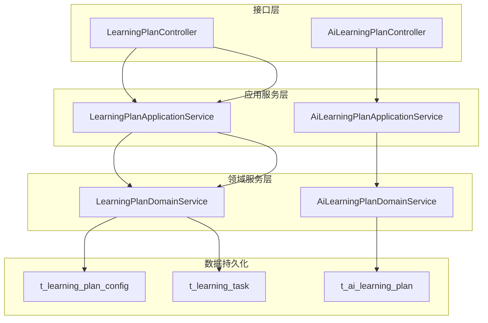
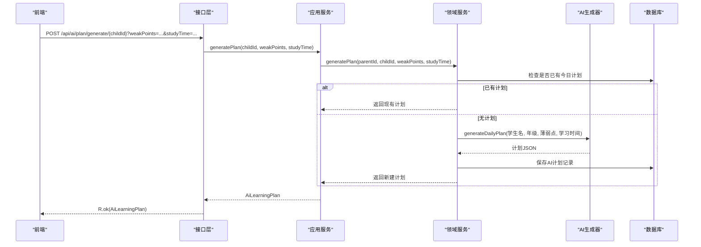
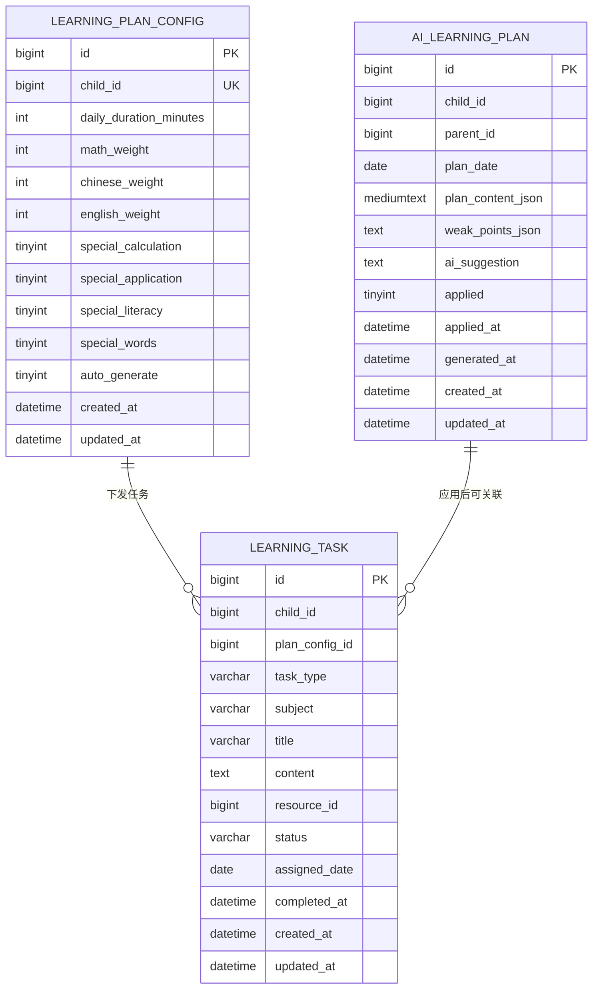
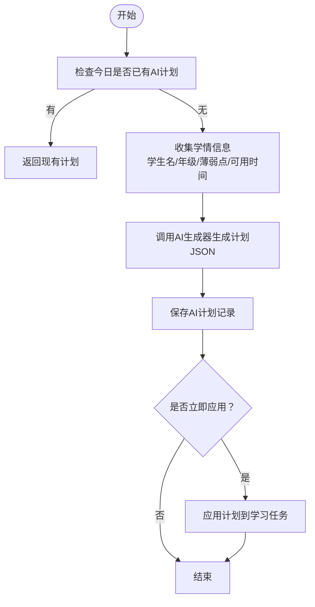
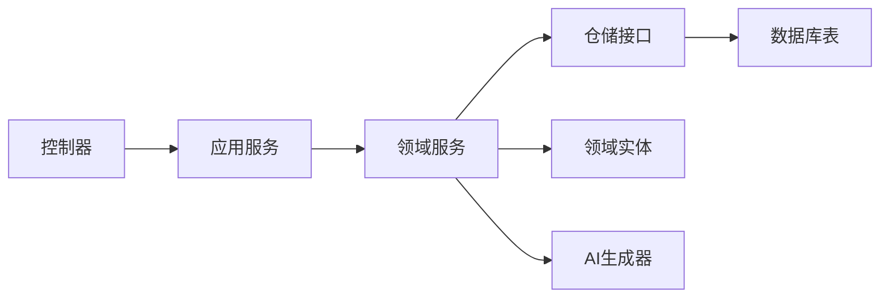

# 学习计划接口

<cite>
**本文引用的文件**
- [LearningPlanController.java](file://wzoto-backend/wzoto-interfaces/src/main/java/com/wzoto/interfaces/controller/LearningPlanController.java)
- [AiLearningPlanController.java](file://wzoto-backend/wzoto-interfaces/src/main/java/com/wzoto/interfaces/controller/AiLearningPlanController.java)
- [LearningPlanApplicationService.java](file://wzoto-backend/wzoto-application/src/main/java/com/wzoto/application/service/LearningPlanApplicationService.java)
- [AiLearningPlanApplicationService.java](file://wzoto-backend/wzoto-application/src/main/java/com/wzoto/application/service/AiLearningPlanApplicationService.java)
- [LearningPlanDomainService.java](file://wzoto-backend/wzoto-domain/src/main/java/com/wzoto/domain/service/LearningPlanDomainService.java)
- [AiLearningPlanDomainService.java](file://wzoto-backend/wzoto-domain/src/main/java/com/wzoto/domain/service/AiLearningPlanDomainService.java)
- [LearningPlanConfig.java](file://wzoto-backend/wzoto-domain/src/main/java/com/wzoto/domain/entity/LearningPlanConfig.java)
- [LearningTask.java](file://wzoto-backend/wzoto-domain/src/main/java/com/wzoto/domain/entity/LearningTask.java)
- [AiLearningPlan.java](file://wzoto-backend/wzoto-domain/src/main/java/com/wzoto/domain/entity/AiLearningPlan.java)
- [LearningPlanConfigDTO.java](file://wzoto-backend/wzoto-interfaces/src/main/java/com/wzoto/interfaces/dto/learning/LearningPlanConfigDTO.java)
- [CreateTaskDTO.java](file://wzoto-backend/wzoto-interfaces/src/main/java/com/wzoto/interfaces/dto/learning/CreateTaskDTO.java)
- [t_learning_plan_config.sql](file://wzoto-backend/sql/t_learning_plan_config.sql)
- [t_learning_task.sql](file://wzoto-backend/sql/t_learning_task.sql)
- [t_ai_learning_plan.sql](file://wzoto-backend/sql/t_ai_learning_plan.sql)
</cite>

## 目录
1. [简介](#简介)
2. [项目结构](#项目结构)
3. [核心组件](#核心组件)
4. [架构总览](#架构总览)
5. [详细组件分析](#详细组件分析)
6. [依赖关系分析](#依赖关系分析)
7. [性能考虑](#性能考虑)
8. [故障排查指南](#故障排查指南)
9. [结论](#结论)
10. [附录](#附录)

## 简介
本文件为“学习计划”功能的完整API接口文档，覆盖以下能力：
- 个性化学习计划生成（AI驱动）
- 学习路径规划与任务下发（专项练习、学科权重分配）
- 学习进度跟踪（任务状态流转、完成耗时统计）
- 计划配置管理（每日时长、学科权重、专项开关）
- AI能力调用示例（智能推荐、知识图谱分析、学习行为预测的集成点）
- 错误处理策略（计划冲突、进度异常、推荐失败等）
- 性能优化建议（缓存、增量更新、实时调整）

## 项目结构
后端采用分层架构：接口层（Controller）→ 应用服务层（Application Service）→ 领域服务层（Domain Service）→ 仓储/实体。数据模型通过SQL脚本定义。

图表来源
- [LearningPlanController.java:20-78](file://wzoto-backend/wzoto-interfaces/src/main/java/com/wzoto/interfaces/controller/LearningPlanController.java#L20-L78)
- [AiLearningPlanController.java:13-47](file://wzoto-backend/wzoto-interfaces/src/main/java/com/wzoto/interfaces/controller/AiLearningPlanController.java#L13-L47)
- [LearningPlanApplicationService.java:1-68](file://wzoto-backend/wzoto-application/src/main/java/com/wzoto/application/service/LearningPlanApplicationService.java#L1-L68)
- [AiLearningPlanApplicationService.java:1-40](file://wzoto-backend/wzoto-application/src/main/java/com/wzoto/application/service/AiLearningPlanApplicationService.java#L1-L40)
- [LearningPlanDomainService.java:1-108](file://wzoto-backend/wzoto-domain/src/main/java/com/wzoto/domain/service/LearningPlanDomainService.java#L1-L108)
- [AiLearningPlanDomainService.java:1-91](file://wzoto-backend/wzoto-domain/src/main/java/com/wzoto/domain/service/AiLearningPlanDomainService.java#L1-L91)
- [t_learning_plan_config.sql:1-22](file://wzoto-backend/sql/t_learning_plan_config.sql#L1-L22)
- [t_learning_task.sql:1-25](file://wzoto-backend/sql/t_learning_task.sql#L1-L25)
- [t_ai_learning_plan.sql:1-24](file://wzoto-backend/sql/t_ai_learning_plan.sql#L1-L24)

章节来源
- [LearningPlanController.java:20-78](file://wzoto-backend/wzoto-interfaces/src/main/java/com/wzoto/interfaces/controller/LearningPlanController.java#L20-L78)
- [AiLearningPlanController.java:13-47](file://wzoto-backend/wzoto-interfaces/src/main/java/com/wzoto/interfaces/controller/AiLearningPlanController.java#L13-L47)

## 核心组件
- 学习计划控制器：提供获取/保存计划配置、下发专项任务的HTTP接口。
- AI学习计划控制器：提供生成今日AI计划、查询今日计划、应用计划到任务、查询历史记录的HTTP接口。
- 应用服务：编排业务用例，进行权限校验、参数转换、事务控制。
- 领域服务：实现核心业务规则（默认配置创建、权重计算、任务下发、AI计划生成与应用）。
- 实体与DTO：计划配置、学习任务、AI计划记录；请求/响应数据传输对象。

章节来源
- [LearningPlanController.java:20-78](file://wzoto-backend/wzoto-interfaces/src/main/java/com/wzoto/interfaces/controller/LearningPlanController.java#L20-L78)
- [AiLearningPlanController.java:13-47](file://wzoto-backend/wzoto-interfaces/src/main/java/com/wzoto/interfaces/controller/AiLearningPlanController.java#L13-L47)
- [LearningPlanApplicationService.java:1-68](file://wzoto-backend/wzoto-application/src/main/java/com/wzoto/application/service/LearningPlanApplicationService.java#L1-L68)
- [AiLearningPlanApplicationService.java:1-40](file://wzoto-backend/wzoto-application/src/main/java/com/wzoto/application/service/AiLearningPlanApplicationService.java#L1-L40)
- [LearningPlanDomainService.java:1-108](file://wzoto-backend/wzoto-domain/src/main/java/com/wzoto/domain/service/LearningPlanDomainService.java#L1-L108)
- [AiLearningPlanDomainService.java:1-91](file://wzoto-backend/wzoto-domain/src/main/java/com/wzoto/domain/service/AiLearningPlanDomainService.java#L1-L91)
- [LearningPlanConfig.java:1-155](file://wzoto-backend/wzoto-domain/src/main/java/com/wzoto/domain/entity/LearningPlanConfig.java#L1-L155)
- [LearningTask.java:1-139](file://wzoto-backend/wzoto-domain/src/main/java/com/wzoto/domain/entity/LearningTask.java#L1-L139)
- [AiLearningPlan.java:1-56](file://wzoto-backend/wzoto-domain/src/main/java/com/wzoto/domain/entity/AiLearningPlan.java#L1-L56)
- [LearningPlanConfigDTO.java:1-24](file://wzoto-backend/wzoto-interfaces/src/main/java/com/wzoto/interfaces/dto/learning/LearningPlanConfigDTO.java#L1-L24)
- [CreateTaskDTO.java:1-14](file://wzoto-backend/wzoto-interfaces/src/main/java/com/wzoto/interfaces/dto/learning/CreateTaskDTO.java#L1-L14)

## 架构总览

图表来源
- [AiLearningPlanController.java:22-45](file://wzoto-backend/wzoto-interfaces/src/main/java/com/wzoto/interfaces/controller/AiLearningPlanController.java#L22-L45)
- [AiLearningPlanApplicationService.java:20-38](file://wzoto-backend/wzoto-application/src/main/java/com/wzoto/application/service/AiLearningPlanApplicationService.java#L20-L38)
- [AiLearningPlanDomainService.java:30-50](file://wzoto-backend/wzoto-domain/src/main/java/com/wzoto/domain/service/AiLearningPlanDomainService.java#L30-L50)
- [t_ai_learning_plan.sql:5-23](file://wzoto-backend/sql/t_ai_learning_plan.sql#L5-L23)

## 详细组件分析

### 学习计划配置接口
- 功能：获取或创建默认学习计划配置；保存用户自定义配置（每日时长、学科权重、专项开关）。
- HTTP方法与路径：
  - GET /api/learning/plan/{childId}
  - POST /api/learning/plan/{childId}
- 请求体（保存配置）：
  - dailyDurationMinutes: 整数，分钟
  - chineseWeight/mathWeight/englishWeight: 整数，百分比权重
  - specialCalculationEnabled/specialApplicationEnabled/specialLiteracyEnabled/specialWordsEnabled: 布尔值
- 响应体：学习计划配置对象（包含ID、childId、时长、权重、开关、时间戳等）
- 业务规则：
  - 每日时长范围限制（5-240分钟）
  - 学科权重总和必须大于0
  - 自动创建默认配置（若不存在）
- 权限校验：基于当前登录家长ID与子女档案归属校验

章节来源
- [LearningPlanController.java:31-51](file://wzoto-backend/wzoto-interfaces/src/main/java/com/wzoto/interfaces/controller/LearningPlanController.java#L31-L51)
- [LearningPlanApplicationService.java:28-48](file://wzoto-backend/wzoto-application/src/main/java/com/wzoto/application/service/LearningPlanApplicationService.java#L28-L48)
- [LearningPlanDomainService.java:33-59](file://wzoto-backend/wzoto-domain/src/main/java/com/wzoto/domain/service/LearningPlanDomainService.java#L33-L59)
- [LearningPlanConfig.java:64-103](file://wzoto-backend/wzoto-domain/src/main/java/com/wzoto/domain/entity/LearningPlanConfig.java#L64-L103)
- [LearningPlanConfigDTO.java:6-23](file://wzoto-backend/wzoto-interfaces/src/main/java/com/wzoto/interfaces/dto/learning/LearningPlanConfigDTO.java#L6-L23)
- [t_learning_plan_config.sql:4-21](file://wzoto-backend/sql/t_learning_plan_config.sql#L4-L21)

### 专项任务下发接口
- 功能：根据专项类型（计算、应用题、识字、背单词）批量下发学习任务。
- HTTP方法与路径：
  - POST /api/learning/plan/{childId}/special-task
- 请求体：
  - specialType: 字符串，枚举值（calculation/application/literacy/words）
  - count: 整数，默认5
- 响应体：学习任务列表（含任务类型、学科、标题、日期、状态等）
- 业务规则：
  - 专项类型映射到具体任务类型
  - 按学科自动匹配（数学/语文/英语）
  - 批量创建并保存任务

章节来源
- [LearningPlanController.java:53-58](file://wzoto-backend/wzoto-interfaces/src/main/java/com/wzoto/interfaces/controller/LearningPlanController.java#L53-L58)
- [LearningPlanApplicationService.java:50-54](file://wzoto-backend/wzoto-application/src/main/java/com/wzoto/application/service/LearningPlanApplicationService.java#L50-L54)
- [LearningPlanDomainService.java:64-87](file://wzoto-backend/wzoto-domain/src/main/java/com/wzoto/domain/service/LearningPlanDomainService.java#L64-L87)
- [CreateTaskDTO.java:6-13](file://wzoto-backend/wzoto-interfaces/src/main/java/com/wzoto/interfaces/dto/learning/CreateTaskDTO.java#L6-L13)
- [t_learning_task.sql:4-24](file://wzoto-backend/sql/t_learning_task.sql#L4-L24)

### 任务完成接口
- 功能：标记任务为已完成，记录完成时间与耗时。
- HTTP方法与路径：
  - PUT /api/learning/task/{taskId}/complete（由应用服务暴露，控制器可封装）
- 请求体：无（或可选耗时秒数）
- 响应体：更新后的学习任务对象
- 业务规则：
  - 仅待完成任务可完成
  - 防止重复完成/跳过
  - 记录完成时间与耗时

章节来源
- [LearningPlanApplicationService.java:56-66](file://wzoto-backend/wzoto-application/src/main/java/com/wzoto/application/service/LearningPlanApplicationService.java#L56-L66)
- [LearningTask.java:103-112](file://wzoto-backend/wzoto-domain/src/main/java/com/wzoto/domain/entity/LearningTask.java#L103-L112)

### AI学习计划接口
- 功能：生成今日AI学习计划、查询今日计划、应用计划到学习任务、查询历史记录。
- HTTP方法与路径：
  - POST /api/ai/plan/generate/{childId}?weakPoints=...&studyTime=...
  - GET /api/ai/plan/today/{childId}
  - PUT /api/ai/plan/apply/{planId}
  - GET /api/ai/plan/history/{childId}
- 请求体：
  - weakPoints: 字符串，薄弱点描述（可选）
  - studyTime: 字符串，可用学习时间（可选）
- 响应体：AI学习计划对象（含计划内容JSON、薄弱点JSON、AI建议、应用状态、生成时间等）
- 业务规则：
  - 同一子女同一天仅保留一份计划
  - 应用后标记已应用并记录时间
  - 权限校验确保家长对子女档案的访问权

章节来源
- [AiLearningPlanController.java:22-45](file://wzoto-backend/wzoto-interfaces/src/main/java/com/wzoto/interfaces/controller/AiLearningPlanController.java#L22-L45)
- [AiLearningPlanApplicationService.java:20-38](file://wzoto-backend/wzoto-application/src/main/java/com/wzoto/application/service/AiLearningPlanApplicationService.java#L20-L38)
- [AiLearningPlanDomainService.java:30-82](file://wzoto-backend/wzoto-domain/src/main/java/com/wzoto/domain/service/AiLearningPlanDomainService.java#L30-L82)
- [AiLearningPlan.java:19-55](file://wzoto-backend/wzoto-domain/src/main/java/com/wzoto/domain/entity/AiLearningPlan.java#L19-L55)
- [t_ai_learning_plan.sql:5-23](file://wzoto-backend/sql/t_ai_learning_plan.sql#L5-L23)

### 数据结构与关系

图表来源
- [t_learning_plan_config.sql:4-21](file://wzoto-backend/sql/t_learning_plan_config.sql#L4-L21)
- [t_learning_task.sql:4-24](file://wzoto-backend/sql/t_learning_task.sql#L4-L24)
- [t_ai_learning_plan.sql:5-23](file://wzoto-backend/sql/t_ai_learning_plan.sql#L5-L23)

### 计划生成流程（能力分析、目标设定、路径规划）

图表来源
- [AiLearningPlanDomainService.java:30-50](file://wzoto-backend/wzoto-domain/src/main/java/com/wzoto/domain/service/AiLearningPlanDomainService.java#L30-L50)
- [AiLearningPlanDomainService.java:64-73](file://wzoto-backend/wzoto-domain/src/main/java/com/wzoto/domain/service/AiLearningPlanDomainService.java#L64-L73)

## 依赖关系分析
- 控制器依赖应用服务，应用服务依赖领域服务，领域服务依赖仓储与实体。
- AI能力通过AiGenerator抽象接入，便于替换为真实AI服务或Mock实现。
- 数据表通过索引优化查询性能（如按child_id、plan_date、status等）。

图表来源
- [LearningPlanController.java:20-78](file://wzoto-backend/wzoto-interfaces/src/main/java/com/wzoto/interfaces/controller/LearningPlanController.java#L20-L78)
- [AiLearningPlanController.java:13-47](file://wzoto-backend/wzoto-interfaces/src/main/java/com/wzoto/interfaces/controller/AiLearningPlanController.java#L13-L47)
- [LearningPlanApplicationService.java:1-68](file://wzoto-backend/wzoto-application/src/main/java/com/wzoto/application/service/LearningPlanApplicationService.java#L1-L68)
- [AiLearningPlanApplicationService.java:1-40](file://wzoto-backend/wzoto-application/src/main/java/com/wzoto/application/service/AiLearningPlanApplicationService.java#L1-L40)
- [LearningPlanDomainService.java:1-108](file://wzoto-backend/wzoto-domain/src/main/java/com/wzoto/domain/service/LearningPlanDomainService.java#L1-L108)
- [AiLearningPlanDomainService.java:1-91](file://wzoto-backend/wzoto-domain/src/main/java/com/wzoto/domain/service/AiLearningPlanDomainService.java#L1-L91)

## 性能考虑
- 缓存策略：
  - 对“今日AI计划”结果进行短期缓存（按child_id+日期键），减少重复生成。
  - 学习计划配置可按child_id缓存，降低频繁读取。
- 增量更新：
  - 专项任务下发支持批量创建，减少往返次数。
  - 任务状态变更仅更新必要字段，避免全量更新。
- 实时调整：
  - 学科权重与专项开关变更后，重新计算各学科时长，按需刷新当日任务。
- 数据库优化：
  - 利用索引（child_id、assigned_date、status、applied）提升查询效率。
  - 对大字段（plan_content_json）合理分片或归档。

[本节为通用性能建议，不直接分析具体文件]

## 故障排查指南
- 计划冲突：
  - 现象：同一天多次生成AI计划。
  - 处理：系统会返回已有计划，避免重复创建。
  - 参考：[AiLearningPlanDomainService.java:36-41](file://wzoto-backend/wzoto-domain/src/main/java/com/wzoto/domain/service/AiLearningPlanDomainService.java#L36-L41)
- 进度异常：
  - 现象：重复完成或跳过任务。
  - 处理：抛出非法状态异常，前端提示不可重复操作。
  - 参考：[LearningTask.java:103-123](file://wzoto-backend/wzoto-domain/src/main/java/com/wzoto/domain/entity/LearningTask.java#L103-L123)
- 推荐失败：
  - 现象：AI生成器调用失败或返回空内容。
  - 处理：记录日志并返回降级方案（如使用默认计划或提示重试）。
  - 参考：[AiLearningPlanDomainService.java:43-50](file://wzoto-backend/wzoto-domain/src/main/java/com/wzoto/domain/service/AiLearningPlanDomainService.java#L43-L50)
- 权限问题：
  - 现象：无权操作子女档案。
  - 处理：抛出非法参数异常，前端提示无权限。
  - 参考：[LearningPlanDomainService.java:64-68](file://wzoto-backend/wzoto-domain/src/main/java/com/wzoto/domain/service/LearningPlanDomainService.java#L64-L68)、[AiLearningPlanDomainService.java:84-89](file://wzoto-backend/wzoto-domain/src/main/java/com/wzoto/domain/service/AiLearningPlanDomainService.java#L84-L89)

章节来源
- [AiLearningPlanDomainService.java:36-50](file://wzoto-backend/wzoto-domain/src/main/java/com/wzoto/domain/service/AiLearningPlanDomainService.java#L36-L50)
- [LearningTask.java:103-123](file://wzoto-backend/wzoto-domain/src/main/java/com/wzoto/domain/entity/LearningTask.java#L103-L123)
- [LearningPlanDomainService.java:64-68](file://wzoto-backend/wzoto-domain/src/main/java/com/wzoto/domain/service/LearningPlanDomainService.java#L64-L68)
- [AiLearningPlanDomainService.java:84-89](file://wzoto-backend/wzoto-domain/src/main/java/com/wzoto/domain/service/AiLearningPlanDomainService.java#L84-L89)

## 结论
本学习计划功能通过清晰的层次化设计与明确的领域规则，实现了从计划配置、任务下发到AI驱动的个性化学习路径规划与进度跟踪。接口设计简洁、数据模型规范，具备可扩展性与可维护性。结合缓存、增量更新与实时调整等最佳实践，可有效提升用户体验与系统性能。

[本节为总结性内容，不直接分析具体文件]

## 附录
- 常用术语：
  - 学习计划配置：定义每日学习时长与学科权重、专项开关。
  - 学习任务：具体的学习条目，包含类型、学科、状态、耗时等。
  - AI学习计划：由AI生成的每日计划，包含内容JSON、薄弱点与建议。
- 扩展建议：
  - 引入知识图谱分析以增强薄弱点识别。
  - 增加学习行为预测模型以动态调整任务难度与顺序。
  - 提供计划版本管理与回滚能力。

[本节为概念性内容，不直接分析具体文件]