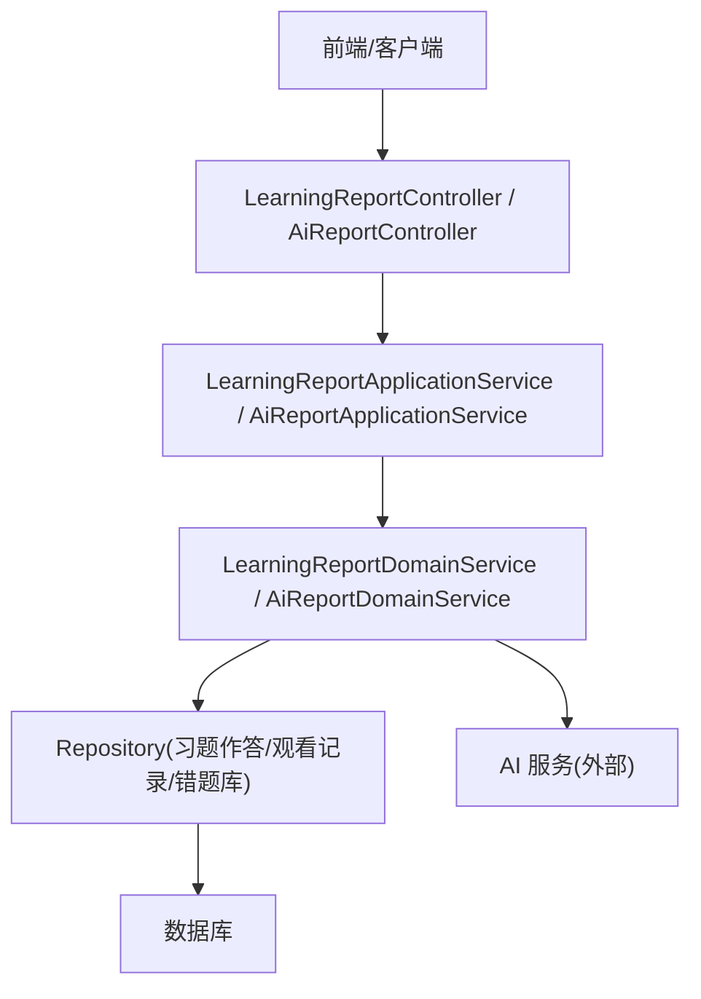
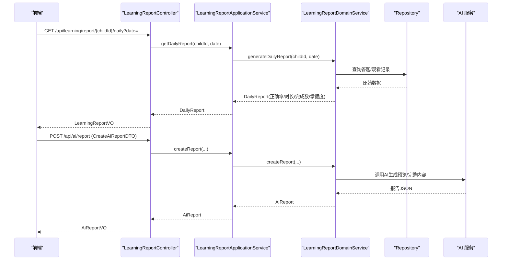
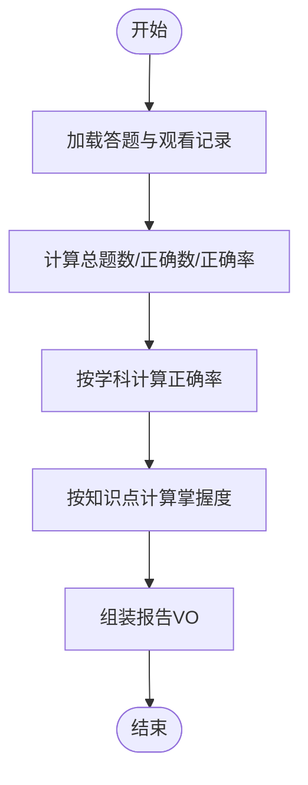
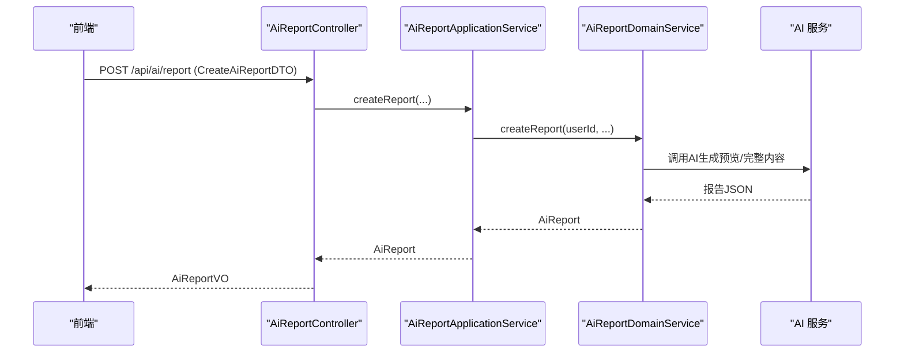
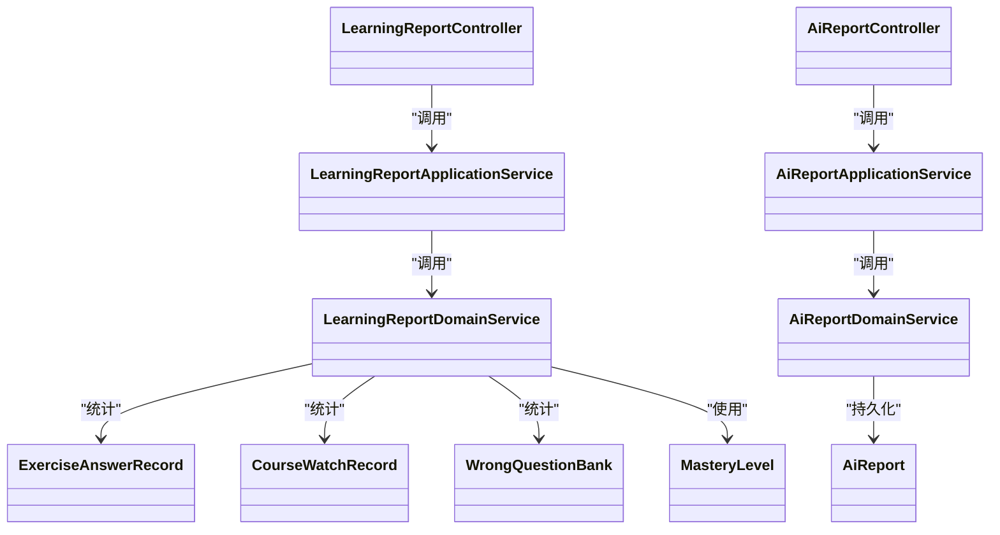

# 学情报告接口

<cite>
**本文引用的文件**
- [LearningReportController.java](file://wzoto-backend/wzoto-interfaces/src/main/java/com/wzoto/interfaces/controller/LearningReportController.java)
- [LearningReportApplicationService.java](file://wzoto-backend/wzoto-application/src/main/java/com/wzoto/application/service/LearningReportApplicationService.java)
- [LearningReportDomainService.java](file://wzoto-backend/wzoto-domain/src/main/java/com/wzoto/domain/service/LearningReportDomainService.java)
- [AiReportController.java](file://wzoto-backend/wzoto-interfaces/src/main/java/com/wzoto/interfaces/controller/AiReportController.java)
- [AiReportApplicationService.java](file://wzoto-backend/wzoto-application/src/main/java/com/wzoto/application/service/AiReportApplicationService.java)
- [CreateAiReportDTO.java](file://wzoto-backend/wzoto-interfaces/src/main/java/com/wzoto/interfaces/dto/ai/CreateAiReportDTO.java)
- [LearningReportVO.java](file://wzoto-backend/wzoto-interfaces/src/main/java/com/wzoto/interfaces/vo/learning/LearningReportVO.java)
- [WeakPointVO.java](file://wzoto-backend/wzoto-interfaces/src/main/java/com/wzoto/interfaces/vo/learning/WeakPointVO.java)
- [ExerciseAnswerRecord.java](file://wzoto-backend/wzoto-domain/src/main/java/com/wzoto/domain/entity/ExerciseAnswerRecord.java)
- [CourseWatchRecord.java](file://wzoto-backend/wzoto-domain/src/main/java/com/wzoto/domain/entity/CourseWatchRecord.java)
- [WrongQuestionBank.java](file://wzoto-backend/wzoto-domain/src/main/java/com/wzoto/domain/entity/WrongQuestionBank.java)
- [MasteryLevel.java](file://wzoto-backend/wzoto-domain/src/main/java/com/wzoto/domain/valobj/MasteryLevel.java)
- [AiReport.java](file://wzoto-backend/wzoto-domain/src/main/java/com/wzoto/domain/entity/AiReport.java)
- [AiReportVO.java](file://wzoto-backend/wzoto-interfaces/src/main/java/com/wzoto/interfaces/vo/ai/AiReportVO.java)
</cite>

## 目录
1. [简介](#简介)
2. [项目结构](#项目结构)
3. [核心组件](#核心组件)
4. [架构总览](#架构总览)
5. [详细组件分析](#详细组件分析)
6. [依赖关系分析](#依赖关系分析)
7. [性能考虑](#性能考虑)
8. [故障排查指南](#故障排查指南)
9. [结论](#结论)
10. [附录：API 规范与调用示例](#附录api-规范与调用示例)

## 简介
本文件为“学情报告”功能的完整 API 接口文档，覆盖学习报告生成、能力评估、进度分析、AI 学情诊断等能力。文档包含：
- 每个接口的 HTTP 方法、URL 路径、请求参数、响应结构与字段说明
- 数据分析算法与指标计算（正确率、掌握度、薄弱点排行）
- AI 能力调用流程（数据收集、分析计算、报告渲染）
- 错误处理策略（数据缺失、分析失败、生成异常）
- 性能优化建议（大数据量、缓存、异步生成）

## 项目结构
后端采用分层架构：
- 接口层（Interfaces）：控制器暴露 REST API，负责入参校验、日志记录、统一响应封装
- 应用层（Application）：编排领域服务，进行权限校验与业务流程协调
- 领域层（Domain）：实现业务规则与统计计算，定义实体与值对象
- 基础设施层（Infrastructure）：仓储实现、外部服务集成（如 AI 服务）

图表来源
- [LearningReportController.java:20-141](file://wzoto-backend/wzoto-interfaces/src/main/java/com/wzoto/interfaces/controller/LearningReportController.java#L20-L141)
- [AiReportController.java:20-122](file://wzoto-backend/wzoto-interfaces/src/main/java/com/wzoto/interfaces/controller/AiReportController.java#L20-L122)
- [LearningReportApplicationService.java:15-59](file://wzoto-backend/wzoto-application/src/main/java/com/wzoto/application/service/LearningReportApplicationService.java#L15-L59)
- [AiReportApplicationService.java:13-81](file://wzoto-backend/wzoto-application/src/main/java/com/wzoto/application/service/AiReportApplicationService.java#L13-L81)
- [LearningReportDomainService.java:19-160](file://wzoto-backend/wzoto-domain/src/main/java/com/wzoto/domain/service/LearningReportDomainService.java#L19-L160)

章节来源
- [LearningReportController.java:20-141](file://wzoto-backend/wzoto-interfaces/src/main/java/com/wzoto/interfaces/controller/LearningReportController.java#L20-L141)
- [AiReportController.java:20-122](file://wzoto-backend/wzoto-interfaces/src/main/java/com/wzoto/interfaces/controller/AiReportController.java#L20-L122)

## 核心组件
- LearningReportController：提供日/周/月报告、薄弱点、错题导出等接口
- AiReportController：提供 AI 学情诊断报告的创建、查询、付费解锁、会员状态查询
- LearningReportApplicationService：权限校验与领域服务编排
- AiReportApplicationService：AI 报告流程编排（创建、列表、详情、支付解锁、会员状态）
- LearningReportDomainService：统计计算（正确率、观看时长、完成视频数、学科正确率、知识点掌握度）、薄弱点排行、错题导出
- AiReportDomainService：AI 报告生命周期管理（创建预览/完整报告、付费解锁、免费额度控制）

章节来源
- [LearningReportController.java:20-141](file://wzoto-backend/wzoto-interfaces/src/main/java/com/wzoto/interfaces/controller/LearningReportController.java#L20-L141)
- [AiReportController.java:20-122](file://wzoto-backend/wzoto-interfaces/src/main/java/com/wzoto/interfaces/controller/AiReportController.java#L20-L122)
- [LearningReportApplicationService.java:15-59](file://wzoto-backend/wzoto-application/src/main/java/com/wzoto/application/service/LearningReportApplicationService.java#L15-L59)
- [AiReportApplicationService.java:13-81](file://wzoto-backend/wzoto-application/src/main/java/com/wzoto/application/service/AiReportApplicationService.java#L13-L81)
- [LearningReportDomainService.java:19-160](file://wzoto-backend/wzoto-domain/src/main/java/com/wzoto/domain/service/LearningReportDomainService.java#L19-L160)

## 架构总览
学情报告由两部分组成：
- 传统统计型报告：基于答题与观看记录，计算正确率、观看时长、完成视频数、学科正确率、知识点掌握度
- AI 学情诊断报告：基于用户输入与历史数据，调用 AI 生成个性化诊断与建议，支持预览与付费解锁

图表来源
- [LearningReportController.java:31-82](file://wzoto-backend/wzoto-interfaces/src/main/java/com/wzoto/interfaces/controller/LearningReportController.java#L31-L82)
- [AiReportController.java:31-74](file://wzoto-backend/wzoto-interfaces/src/main/java/com/wzoto/interfaces/controller/AiReportController.java#L31-L74)
- [LearningReportApplicationService.java:26-49](file://wzoto-backend/wzoto-application/src/main/java/com/wzoto/application/service/LearningReportApplicationService.java#L26-L49)
- [AiReportApplicationService.java:23-55](file://wzoto-backend/wzoto-application/src/main/java/com/wzoto/application/service/AiReportApplicationService.java#L23-L55)
- [LearningReportDomainService.java:34-69](file://wzoto-backend/wzoto-domain/src/main/java/com/wzoto/domain/service/LearningReportDomainService.java#L34-L69)

## 详细组件分析

### 学习报告（统计型）
- 功能特性
  - 日/周/月报告：统计答题数量、正确数、正确率、观看时长、完成视频数、学科正确率、知识点掌握度
  - 薄弱点排行：按知识点错误次数降序，支持按学科过滤与 topN 限制
  - 错题导出：按子女维度导出错题清单，支持按学科过滤
- 关键算法
  - 正确率 = 正确题数 / 总题数（无题时返回 0）
  - 学科正确率：按学科分组后分别计算
  - 知识点掌握度：根据该知识点的正确率映射到 MasteryLevel（≥0.85 熟练；≥0.60 一般；否则未掌握）
  - 薄弱点：汇总错题库中各知识点的错误次数并排序
- 数据结构
  - 报告 VO：LearningReportVO（包含 childId、reportType、totalQuestions、correctCount、accuracy、watchDurationSeconds、completedVideos、subjectAccuracy、masteryMap）
  - 薄弱点 VO：WeakPointVO（knowledgePoint、mistakeCount）
  - 实体：ExerciseAnswerRecord、CourseWatchRecord、WrongQuestionBank
  - 值对象：MasteryLevel（NOT_MASTERED/GENERAL/PROFICIENT）

图表来源
- [LearningReportDomainService.java:34-100](file://wzoto-backend/wzoto-domain/src/main/java/com/wzoto/domain/service/LearningReportDomainService.java#L34-L100)
- [MasteryLevel.java:35-46](file://wzoto-backend/wzoto-domain/src/main/java/com/wzoto/domain/valobj/MasteryLevel.java#L35-L46)

章节来源
- [LearningReportController.java:31-82](file://wzoto-backend/wzoto-interfaces/src/main/java/com/wzoto/interfaces/controller/LearningReportController.java#L31-L82)
- [LearningReportApplicationService.java:26-49](file://wzoto-backend/wzoto-application/src/main/java/com/wzoto/application/service/LearningReportApplicationService.java#L26-L49)
- [LearningReportDomainService.java:34-135](file://wzoto-backend/wzoto-domain/src/main/java/com/wzoto/domain/service/LearningReportDomainService.java#L34-L135)
- [LearningReportVO.java:8-21](file://wzoto-backend/wzoto-interfaces/src/main/java/com/wzoto/interfaces/vo/learning/LearningReportVO.java#L8-L21)
- [WeakPointVO.java:6-12](file://wzoto-backend/wzoto-interfaces/src/main/java/com/wzoto/interfaces/vo/learning/WeakPointVO.java#L6-L12)
- [ExerciseAnswerRecord.java:10-99](file://wzoto-backend/wzoto-domain/src/main/java/com/wzoto/domain/entity/ExerciseAnswerRecord.java#L10-L99)
- [CourseWatchRecord.java:10-120](file://wzoto-backend/wzoto-domain/src/main/java/com/wzoto/domain/entity/CourseWatchRecord.java#L10-L120)
- [WrongQuestionBank.java:10-133](file://wzoto-backend/wzoto-domain/src/main/java/com/wzoto/domain/entity/WrongQuestionBank.java#L10-L133)
- [MasteryLevel.java:9-48](file://wzoto-backend/wzoto-domain/src/main/java/com/wzoto/domain/valobj/MasteryLevel.java#L9-L48)

### AI 学情诊断报告
- 功能特性
  - 创建报告：提交子女姓名、薄弱学科、近期分数、薄弱知识点描述、照片 URL，生成预览或完整报告
  - 报告列表：获取当前用户的报告集合
  - 报告详情：查看指定报告内容（非会员仅预览）
  - 付费解锁：模拟支付成功后解锁完整报告
  - 会员状态：查询家长会员身份、免费报告使用次数、有效期等
- 报告数据结构
  - 输入 DTO：CreateAiReportDTO（childName、weakSubjects、recentScores、weakPointDesc、photoUrls）
  - 输出 VO：AiReportVO（id、childName、weakSubjects、recentScores、weakPointDesc、photoUrls、reportContent、previewContent、reportType、isMemberReport、price、paymentStatus、createdAt）
  - 领域实体：AiReport（支持 FREE/UNPAID/PAID 状态流转）

图表来源
- [AiReportController.java:31-74](file://wzoto-backend/wzoto-interfaces/src/main/java/com/wzoto/interfaces/controller/AiReportController.java#L31-L74)
- [AiReportApplicationService.java:23-55](file://wzoto-backend/wzoto-application/src/main/java/com/wzoto/application/service/AiReportApplicationService.java#L23-L55)
- [AiReport.java:43-105](file://wzoto-backend/wzoto-domain/src/main/java/com/wzoto/domain/entity/AiReport.java#L43-L105)

章节来源
- [AiReportController.java:31-95](file://wzoto-backend/wzoto-interfaces/src/main/java/com/wzoto/interfaces/controller/AiReportController.java#L31-L95)
- [AiReportApplicationService.java:23-79](file://wzoto-backend/wzoto-application/src/main/java/com/wzoto/application/service/AiReportApplicationService.java#L23-L79)
- [CreateAiReportDTO.java:9-28](file://wzoto-backend/wzoto-interfaces/src/main/java/com/wzoto/interfaces/dto/ai/CreateAiReportDTO.java#L9-L28)
- [AiReportVO.java:12-33](file://wzoto-backend/wzoto-interfaces/src/main/java/com/wzoto/interfaces/vo/ai/AiReportVO.java#L12-L33)
- [AiReport.java:18-105](file://wzoto-backend/wzoto-domain/src/main/java/com/wzoto/domain/entity/AiReport.java#L18-L105)

## 依赖关系分析
- 控制器依赖应用服务，应用服务依赖领域服务，领域服务依赖仓储与外部 AI 服务
- 数据源：
  - 答题记录：ExerciseAnswerRecordRepository
  - 观看记录：CourseWatchRecordRepository
  - 错题库：WrongQuestionBankRepository
- 值对象与实体：
  - MasteryLevel：掌握度枚举，用于可视化（红黄绿）
  - WrongQuestionBank：错题记录，维护错误次数与掌握度
  - CourseWatchRecord：观看记录，维护进度与完成状态
  - ExerciseAnswerRecord：答题记录，维护答案与耗时

图表来源
- [LearningReportController.java:20-141](file://wzoto-backend/wzoto-interfaces/src/main/java/com/wzoto/interfaces/controller/LearningReportController.java#L20-L141)
- [LearningReportApplicationService.java:15-59](file://wzoto-backend/wzoto-application/src/main/java/com/wzoto/application/service/LearningReportApplicationService.java#L15-L59)
- [LearningReportDomainService.java:19-160](file://wzoto-backend/wzoto-domain/src/main/java/com/wzoto/domain/service/LearningReportDomainService.java#L19-L160)
- [AiReportController.java:20-122](file://wzoto-backend/wzoto-interfaces/src/main/java/com/wzoto/interfaces/controller/AiReportController.java#L20-L122)
- [AiReportApplicationService.java:13-81](file://wzoto-backend/wzoto-application/src/main/java/com/wzoto/application/service/AiReportApplicationService.java#L13-L81)
- [ExerciseAnswerRecord.java:10-99](file://wzoto-backend/wzoto-domain/src/main/java/com/wzoto/domain/entity/ExerciseAnswerRecord.java#L10-L99)
- [CourseWatchRecord.java:10-120](file://wzoto-backend/wzoto-domain/src/main/java/com/wzoto/domain/entity/CourseWatchRecord.java#L10-L120)
- [WrongQuestionBank.java:10-133](file://wzoto-backend/wzoto-domain/src/main/java/com/wzoto/domain/entity/WrongQuestionBank.java#L10-L133)
- [MasteryLevel.java:9-48](file://wzoto-backend/wzoto-domain/src/main/java/com/wzoto/domain/valobj/MasteryLevel.java#L9-L48)
- [AiReport.java:18-105](file://wzoto-backend/wzoto-domain/src/main/java/com/wzoto/domain/entity/AiReport.java#L18-L105)

## 性能考虑
- 大数据量处理
  - 在领域层对答题与观看记录进行流式过滤与聚合，避免中间大对象膨胀
  - 薄弱点排行使用 Map 聚合与排序，限制 topN 减少前端渲染压力
- 缓存策略
  - 对日/周/月报告结果可按 childId+时间窗口进行缓存（例如 Redis），降低重复计算
  - 对薄弱点排行可设置短期缓存（分钟级），提升高频访问性能
- 异步生成
  - AI 报告生成耗时较长，建议采用异步任务（消息队列 + 任务状态轮询）
  - 前端通过报告 ID 查询状态，完成后推送通知
- 分页与限流
  - 错题导出接口应增加分页参数与最大条数限制，防止超大响应
  - 对 AI 报告创建接口增加频率限制，避免滥用

[本节为通用性能建议，不直接分析具体文件]

## 故障排查指南
- 数据缺失
  - 症状：报告正确率为 0、观看时长为 0、薄弱点为空
  - 排查：确认答题与观看记录是否存在于对应时间段；检查 Repository 查询条件
  - 参考：LearningReportDomainService 的日期过滤逻辑
- 分析失败
  - 症状：接口返回错误或空数据
  - 排查：检查入库数据的 subject/knowledgePoint 是否为空；确保 MasteryLevel.fromAccuracy 的阈值合理
- 生成异常（AI）
  - 症状：AI 报告创建失败或内容为空
  - 排查：检查 AI 服务可用性、入参校验（弱科、薄弱点描述必填）、网络超时与重试策略
- 权限问题
  - 症状：无法获取他人子女的报告
  - 排查：LearningReportApplicationService.validateOwnership 校验父子关系；确认 UserContext 中的 userId 有效

章节来源
- [LearningReportDomainService.java:34-100](file://wzoto-backend/wzoto-domain/src/main/java/com/wzoto/domain/service/LearningReportDomainService.java#L34-L100)
- [LearningReportApplicationService.java:51-57](file://wzoto-backend/wzoto-application/src/main/java/com/wzoto/application/service/LearningReportApplicationService.java#L51-L57)
- [MasteryLevel.java:35-46](file://wzoto-backend/wzoto-domain/src/main/java/com/wzoto/domain/valobj/MasteryLevel.java#L35-L46)

## 结论
本系统提供了完整的学情报告能力：
- 统计型报告：基于答题与观看记录，提供多维度分析与可视化基础（正确率、掌握度、薄弱点）
- AI 学情诊断：支持预览与付费解锁，结合用户输入与历史数据生成个性化建议
- 架构清晰、职责分明，便于扩展与优化
- 建议在生产环境引入缓存与异步机制，提升用户体验与系统稳定性

[本节为总结性内容，不直接分析具体文件]

## 附录：API 规范与调用示例

### 学习报告接口
- 获取概览
  - 方法：GET
  - 路径：/api/learning/report/{childId}
  - 参数：childId（路径）
  - 响应：LearningReportVO（reportType="overview"）
- 获取日报
  - 方法：GET
  - 路径：/api/learning/report/{childId}/daily
  - 参数：date（可选，默认今日）
  - 响应：LearningReportVO（reportType="daily"）
- 获取周报
  - 方法：GET
  - 路径：/api/learning/report/{childId}/weekly
  - 参数：weekStart（可选，默认本周周一）
  - 响应：LearningReportVO（reportType="weekly"）
- 获取月报
  - 方法：GET
  - 路径：/api/learning/report/{childId}/monthly
  - 参数：year、month（可选，默认当前年月）
  - 响应：LearningReportVO（reportType="monthly"）
- 获取薄弱点
  - 方法：GET
  - 路径：/api/learning/report/{childId}/weak-points
  - 参数：subject（可选）、topN（可选，默认10）
  - 响应：List<WeakPointVO>
- 导出错题
  - 方法：GET
  - 路径：/api/learning/report/{childId}/wrong-questions/export
  - 参数：subject（可选）
  - 响应：List<WrongQuestionBank>

章节来源
- [LearningReportController.java:31-82](file://wzoto-backend/wzoto-interfaces/src/main/java/com/wzoto/interfaces/controller/LearningReportController.java#L31-L82)
- [LearningReportVO.java:8-21](file://wzoto-backend/wzoto-interfaces/src/main/java/com/wzoto/interfaces/vo/learning/LearningReportVO.java#L8-L21)
- [WeakPointVO.java:6-12](file://wzoto-backend/wzoto-interfaces/src/main/java/com/wzoto/interfaces/vo/learning/WeakPointVO.java#L6-L12)
- [WrongQuestionBank.java:10-133](file://wzoto-backend/wzoto-domain/src/main/java/com/wzoto/domain/entity/WrongQuestionBank.java#L10-L133)

### AI 学情诊断接口
- 创建报告
  - 方法：POST
  - 路径：/api/ai/report
  - 请求体：CreateAiReportDTO（childName、weakSubjects、recentScores、weakPointDesc、photoUrls）
  - 响应：AiReportVO（reportType 可为 PREVIEW/FULL，取决于会员与付费状态）
- 获取我的报告列表
  - 方法：GET
  - 路径：/api/ai/reports
  - 响应：List<AiReportVO>
- 获取报告详情
  - 方法：GET
  - 路径：/api/ai/report/{id}
  - 响应：AiReportVO（非会员仅 previewContent）
- 付费解锁报告
  - 方法：POST
  - 路径：/api/ai/report/{id}/pay
  - 响应：AiReportVO（解锁后 reportType="FULL"，paymentStatus="PAID"）
- 会员状态
  - 方法：GET
  - 路径：/api/ai/membership-status
  - 响应：Map（isMember、freeReportUsed、freeReportQuota、memberType、expireTime、isActive）

章节来源
- [AiReportController.java:31-95](file://wzoto-backend/wzoto-interfaces/src/main/java/com/wzoto/interfaces/controller/AiReportController.java#L31-L95)
- [CreateAiReportDTO.java:9-28](file://wzoto-backend/wzoto-interfaces/src/main/java/com/wzoto/interfaces/dto/ai/CreateAiReportDTO.java#L9-L28)
- [AiReportVO.java:12-33](file://wzoto-backend/wzoto-interfaces/src/main/java/com/wzoto/interfaces/vo/ai/AiReportVO.java#L12-L33)
- [AiReport.java:43-105](file://wzoto-backend/wzoto-domain/src/main/java/com/wzoto/domain/entity/AiReport.java#L43-L105)

### 数据分析算法与可视化
- 正确率与掌握度
  - 正确率：正确题数/总题数
  - 掌握度：根据正确率映射到 MasteryLevel（≥0.85 熟练；≥0.60 一般；否则未掌握）
- 薄弱点排行
  - 按知识点汇总错误次数，降序取 topN
- 能力雷达图
  - 使用 masteryMap（知识点→掌握度）作为雷达图数据源
  - 前端可将 MasteryLevel 的颜色映射为红黄绿三色

章节来源
- [LearningReportDomainService.java:71-100](file://wzoto-backend/wzoto-domain/src/main/java/com/wzoto/domain/service/LearningReportDomainService.java#L71-L100)
- [MasteryLevel.java:35-46](file://wzoto-backend/wzoto-domain/src/main/java/com/wzoto/domain/valobj/MasteryLevel.java#L35-L46)

### 报告生成流程
- 数据收集
  - 从答题与观看记录仓库拉取指定时间范围的数据
- 分析计算
  - 计算正确率、观看时长、完成视频数、学科正确率、知识点掌握度
- 报告渲染
  - 将领域模型转换为 VO，返回给前端进行展示
- AI 生成
  - 调用 AI 服务生成预览或完整报告内容，支持付费解锁

章节来源
- [LearningReportDomainService.java:34-100](file://wzoto-backend/wzoto-domain/src/main/java/com/wzoto/domain/service/LearningReportDomainService.java#L34-L100)
- [AiReportController.java:31-74](file://wzoto-backend/wzoto-interfaces/src/main/java/com/wzoto/interfaces/controller/AiReportController.java#L31-L74)