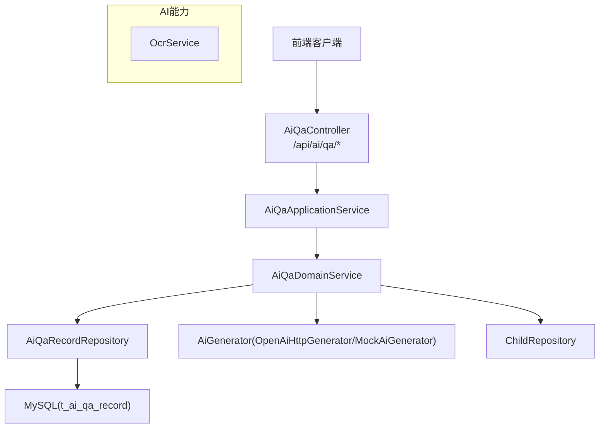
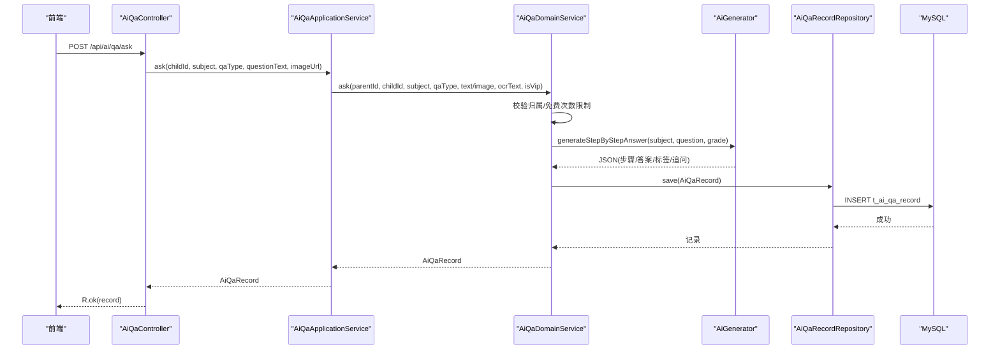
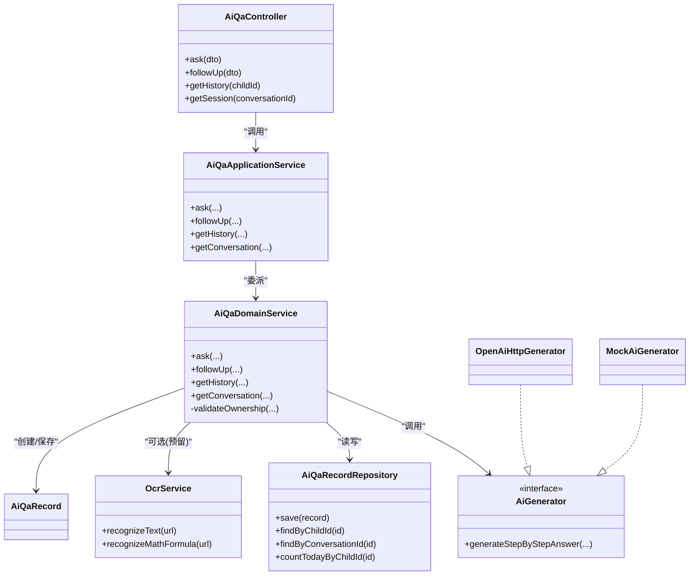

# 智能答疑接口

<cite>
**本文引用的文件**
- [AiQaController.java](file://wzoto-backend/wzoto-interfaces/src/main/java/com/wzoto/interfaces/controller/AiQaController.java)
- [AiQaApplicationService.java](file://wzoto-backend/wzoto-application/src/main/java/com/wzoto/application/service/AiQaApplicationService.java)
- [AiQaDomainService.java](file://wzoto-backend/wzoto-domain/src/main/java/com/wzoto/domain/service/AiQaDomainService.java)
- [OpenAiHttpGenerator.java](file://wzoto-backend/wzoto-infrastructure/src/main/java/com/wzoto/infrastructure/ai/OpenAiHttpGenerator.java)
- [MockAiGenerator.java](file://wzoto-backend/wzoto-infrastructure/src/main/java/com/wzoto/infrastructure/ai/MockAiGenerator.java)
- [OcrService.java](file://wzoto-backend/wzoto-infrastructure/src/main/java/com/wzoto/infrastructure/ai/OcrService.java)
- [AiQaRecord.java](file://wzoto-backend/wzoto-domain/src/main/java/com/wzoto/domain/entity/AiQaRecord.java)
- [AiQaAskDTO.java](file://wzoto-backend/wzoto-interfaces/src/main/java/com/wzoto/interfaces/dto/AiQaAskDTO.java)
- [AiQaFollowUpDTO.java](file://wzoto-backend/wzoto-interfaces/src/main/java/com/wzoto/interfaces/dto/AiQaFollowUpDTO.java)
- [WebMvcConfig.java](file://wzoto-backend/wzoto-infrastructure/src/main/java/com/wzoto/infrastructure/config/WebMvcConfig.java)
- [t_ai_qa_record.sql](file://wzoto-backend/sql/t_ai_qa_record.sql)
</cite>

## 目录
1. [简介](#简介)
2. [项目结构](#项目结构)
3. [核心组件](#核心组件)
4. [架构总览](#架构总览)
5. [详细组件分析](#详细组件分析)
6. [依赖关系分析](#依赖关系分析)
7. [性能考虑](#性能考虑)
8. [故障排查指南](#故障排查指南)
9. [结论](#结论)
10. [附录](#附录)

## 简介
本文件为“智能答疑”功能的完整API接口文档，覆盖问答提问、追问对话、历史记录与会话查询等能力。系统支持OCR图片识别、自然语言处理（AI分步启发式答疑）、上下文管理（会话ID保持多轮对话）等AI能力调用。文档包含每个接口的HTTP方法、URL路径、请求参数、响应格式、错误处理策略以及性能优化建议，帮助前后端快速集成与稳定运行。

## 项目结构
后端采用分层架构：
- 接口层（Interfaces）：暴露REST API，负责参数校验与统一响应封装
- 应用层（Application）：编排业务流程，协调领域服务
- 领域层（Domain）：承载业务规则（权限校验、次数限制、会话管理）
- 基础设施层（Infrastructure）：实现AI生成器（OpenAI兼容或Mock）、OCR识别、持久化仓储

图表来源
- [AiQaController.java:16-50](file://wzoto-backend/wzoto-interfaces/src/main/java/com/wzoto/interfaces/controller/AiQaController.java#L16-L50)
- [AiQaApplicationService.java:13-43](file://wzoto-backend/wzoto-application/src/main/java/com/wzoto/application/service/AiQaApplicationService.java#L13-L43)
- [AiQaDomainService.java:17-106](file://wzoto-backend/wzoto-domain/src/main/java/com/wzoto/domain/service/AiQaDomainService.java#L17-L106)
- [OpenAiHttpGenerator.java:18-394](file://wzoto-backend/wzoto-infrastructure/src/main/java/com/wzoto/infrastructure/ai/OpenAiHttpGenerator.java#L18-L394)
- [MockAiGenerator.java:8-302](file://wzoto-backend/wzoto-infrastructure/src/main/java/com/wzoto/infrastructure/ai/MockAiGenerator.java#L8-L302)
- [OcrService.java:6-38](file://wzoto-backend/wzoto-infrastructure/src/main/java/com/wzoto/infrastructure/ai/OcrService.java#L6-L38)
- [t_ai_qa_record.sql:5-29](file://wzoto-backend/sql/t_ai_qa_record.sql#L5-L29)

章节来源
- [AiQaController.java:16-50](file://wzoto-backend/wzoto-interfaces/src/main/java/com/wzoto/interfaces/controller/AiQaController.java#L16-L50)
- [WebMvcConfig.java:15-42](file://wzoto-backend/wzoto-infrastructure/src/main/java/com/wzoto/infrastructure/config/WebMvcConfig.java#L15-L42)

## 核心组件
- 控制器：提供REST接口，统一返回R包装对象
- 应用服务：接收请求参数，转换类型，委派领域服务
- 领域服务：权限校验、免费次数限制、会话ID生成、AI调用、记录持久化
- AI生成器：OpenAI兼容HTTP实现或Mock实现，输出结构化JSON（分步解题、知识点标签、追问问题等）
- OCR服务：预留百度/腾讯OCR端口，开发阶段使用Mock返回示例文本
- 数据模型：AiQaRecord实体，含会话ID、学科、年级、提问内容、AI回复JSON等字段

章节来源
- [AiQaController.java:16-50](file://wzoto-backend/wzoto-interfaces/src/main/java/com/wzoto/interfaces/controller/AiQaController.java#L16-L50)
- [AiQaApplicationService.java:13-43](file://wzoto-backend/wzoto-application/src/main/java/com/wzoto/application/service/AiQaApplicationService.java#L13-L43)
- [AiQaDomainService.java:17-106](file://wzoto-backend/wzoto-domain/src/main/java/com/wzoto/domain/service/AiQaDomainService.java#L17-L106)
- [AiQaRecord.java:12-73](file://wzoto-backend/wzoto-domain/src/main/java/com/wzoto/domain/entity/AiQaRecord.java#L12-L73)

## 架构总览

图表来源
- [AiQaController.java:25-31](file://wzoto-backend/wzoto-interfaces/src/main/java/com/wzoto/interfaces/controller/AiQaController.java#L25-L31)
- [AiQaApplicationService.java:21-27](file://wzoto-backend/wzoto-application/src/main/java/com/wzoto/application/service/AiQaApplicationService.java#L21-L27)
- [AiQaDomainService.java:31-57](file://wzoto-backend/wzoto-domain/src/main/java/com/wzoto/domain/service/AiQaDomainService.java#L31-L57)
- [OpenAiHttpGenerator.java:340-349](file://wzoto-backend/wzoto-infrastructure/src/main/java/com/wzoto/infrastructure/ai/OpenAiHttpGenerator.java#L340-L349)
- [t_ai_qa_record.sql:5-29](file://wzoto-backend/sql/t_ai_qa_record.sql#L5-L29)

## 详细组件分析

### 接口清单与规范
- 基础路径：/api/ai/qa
- 认证：全局JWT拦截器对/api/**生效，登录相关路径已排除
- 跨域：允许所有来源与方法，携带凭证

章节来源
- [WebMvcConfig.java:21-41](file://wzoto-backend/wzoto-infrastructure/src/main/java/com/wzoto/infrastructure/config/WebMvcConfig.java#L21-L41)

#### 1) 提问接口（拍照/文字）
- 方法：POST
- 路径：/api/ai/qa/ask
- 请求体（AiQaAskDTO）
  - childId: Long，必填
  - subject: String，必填（如MATH/CHINESE/ENGLISH）
  - qaType: String，可选（PHOTO/TEXT），未传默认TEXT
  - questionText: String，可选（文字题）
  - questionImageUrl: String，可选（拍照题图）
- 响应：R<AiQaRecord>
  - 包含：id、childId、parentId、conversationId、subject、grade、qaType、questionText、questionImageUrl、ocrText、aiResponseJson、knowledgeTags、isFollowUp、stepCount、createdAt、updatedAt
- 行为说明
  - 非VIP用户每日免费次数限制（默认3次）
  - 自动生成conversationId用于会话关联
  - 调用AI生成器获取分步解答JSON
  - 保存记录并返回

章节来源
- [AiQaController.java:25-31](file://wzoto-backend/wzoto-interfaces/src/main/java/com/wzoto/interfaces/controller/AiQaController.java#L25-L31)
- [AiQaApplicationService.java:21-27](file://wzoto-backend/wzoto-application/src/main/java/com/wzoto/application/service/AiQaApplicationService.java#L21-L27)
- [AiQaDomainService.java:31-57](file://wzoto-backend/wzoto-domain/src/main/java/com/wzoto/domain/service/AiQaDomainService.java#L31-L57)
- [AiQaRecord.java:12-73](file://wzoto-backend/wzoto-domain/src/main/java/com/wzoto/domain/entity/AiQaRecord.java#L12-L73)
- [t_ai_qa_record.sql:5-29](file://wzoto-backend/sql/t_ai_qa_record.sql#L5-L29)

#### 2) 追问接口（同一会话续问）
- 方法：POST
- 路径：/api/ai/qa/follow-up
- 请求体（AiQaFollowUpDTO）
  - childId: Long，必填
  - conversationId: String，必填（来自首次提问返回）
  - questionText: String，必填
- 响应：R<AiQaRecord>
- 行为说明
  - 校验会话存在性
  - 复用首条记录的学科与年级信息
  - 调用AI生成器继续生成回答
  - 保存追问记录（isFollowUp=true）

章节来源
- [AiQaController.java:33-39](file://wzoto-backend/wzoto-interfaces/src/main/java/com/wzoto/interfaces/controller/AiQaController.java#L33-L39)
- [AiQaApplicationService.java:29-32](file://wzoto-backend/wzoto-application/src/main/java/com/wzoto/application/service/AiQaApplicationService.java#L29-L32)
- [AiQaDomainService.java:59-82](file://wzoto-backend/wzoto-domain/src/main/java/com/wzoto/domain/service/AiQaDomainService.java#L59-L82)

#### 3) 历史记录查询
- 方法：GET
- 路径：/api/ai/qa/history/{childId}
- 路径参数：childId
- 响应：R<List<AiQaRecord>>
- 行为说明：按子女ID查询其全部提问记录

章节来源
- [AiQaController.java:41-44](file://wzoto-backend/wzoto-interfaces/src/main/java/com/wzoto/interfaces/controller/AiQaController.java#L41-L44)
- [AiQaDomainService.java:84-90](file://wzoto-backend/wzoto-domain/src/main/java/com/wzoto/domain/service/AiQaDomainService.java#L84-L90)

#### 4) 会话详情查询
- 方法：GET
- 路径：/api/ai/qa/session/{conversationId}
- 路径参数：conversationId
- 响应：R<List<AiQaRecord>>
- 行为说明：按会话ID查询该轮对话的所有记录（首问+多次追问）

章节来源
- [AiQaController.java:46-49](file://wzoto-backend/wzoto-interfaces/src/main/java/com/wzoto/interfaces/controller/AiQaController.java#L46-L49)
- [AiQaDomainService.java:92-97](file://wzoto-backend/wzoto-domain/src/main/java/com/wzoto/domain/service/AiQaDomainService.java#L92-L97)

### 对话会话管理机制
- 会话ID生成：在首次提问时生成唯一conversationId（UUID去横杠），用于后续追问关联
- 上下文保持：追问接口通过conversationId定位首条记录，复用subject与grade，保证上下文一致
- 多轮对话支持：同一会话可多次追问，每条记录以isFollowUp区分首问与追问

章节来源
- [AiQaDomainService.java:31-57](file://wzoto-backend/wzoto-domain/src/main/java/com/wzoto/domain/service/AiQaDomainService.java#L31-L57)
- [AiQaDomainService.java:59-82](file://wzoto-backend/wzoto-domain/src/main/java/com/wzoto/domain/service/AiQaDomainService.java#L59-L82)
- [AiQaRecord.java:12-73](file://wzoto-backend/wzoto-domain/src/main/java/com/wzoto/domain/entity/AiQaRecord.java#L12-L73)

### AI能力调用示例
- OCR图片识别（预留）
  - 接口：OcrService.recognizeText(imageUrl)
  - 说明：当前为Mock实现，生产环境可替换为百度/腾讯OCR
  - 参考：[OcrService.java:14-25](file://wzoto-backend/wzoto-infrastructure/src/main/java/com/wzoto/infrastructure/ai/OcrService.java#L14-L25)
- 自然语言处理（分步启发式答疑）
  - 接口：AiGenerator.generateStepByStepAnswer(subject, questionText, grade)
  - 实现：OpenAiHttpGenerator（OpenAI兼容）或 MockAiGenerator（开发环境）
  - 返回：JSON结构包含steps数组、answer、knowledgeTags、followUpQuestion等
  - 参考：
    - [OpenAiHttpGenerator.java:340-349](file://wzoto-backend/wzoto-infrastructure/src/main/java/com/wzoto/infrastructure/ai/OpenAiHttpGenerator.java#L340-L349)
    - [MockAiGenerator.java:181-198](file://wzoto-backend/wzoto-infrastructure/src/main/java/com/wzoto/infrastructure/ai/MockAiGenerator.java#L181-L198)

章节来源
- [OcrService.java:14-25](file://wzoto-backend/wzoto-infrastructure/src/main/java/com/wzoto/infrastructure/ai/OcrService.java#L14-L25)
- [OpenAiHttpGenerator.java:340-349](file://wzoto-backend/wzoto-infrastructure/src/main/java/com/wzoto/infrastructure/ai/OpenAiHttpGenerator.java#L340-L349)
- [MockAiGenerator.java:181-198](file://wzoto-backend/wzoto-infrastructure/src/main/java/com/wzoto/infrastructure/ai/MockAiGenerator.java#L181-L198)

### 数据模型与存储
- 表名：t_ai_qa_record
- 关键字段：child_id、parent_id、conversation_id、subject、grade、qa_type、question_text、question_image_url、ocr_text、ai_response_json、knowledge_tags、is_follow_up、step_count
- 索引：child_id、parent_id、conversation_id、subject、created_at、child_subject复合索引

章节来源
- [t_ai_qa_record.sql:5-29](file://wzoto-backend/sql/t_ai_qa_record.sql#L5-L29)

## 依赖关系分析

图表来源
- [AiQaController.java:16-50](file://wzoto-backend/wzoto-interfaces/src/main/java/com/wzoto/interfaces/controller/AiQaController.java#L16-L50)
- [AiQaApplicationService.java:13-43](file://wzoto-backend/wzoto-application/src/main/java/com/wzoto/application/service/AiQaApplicationService.java#L13-L43)
- [AiQaDomainService.java:17-106](file://wzoto-backend/wzoto-domain/src/main/java/com/wzoto/domain/service/AiQaDomainService.java#L17-L106)
- [OpenAiHttpGenerator.java:18-394](file://wzoto-backend/wzoto-infrastructure/src/main/java/com/wzoto/infrastructure/ai/OpenAiHttpGenerator.java#L18-L394)
- [MockAiGenerator.java:8-302](file://wzoto-backend/wzoto-infrastructure/src/main/java/com/wzoto/infrastructure/ai/MockAiGenerator.java#L8-L302)
- [OcrService.java:6-38](file://wzoto-backend/wzoto-infrastructure/src/main/java/com/wzoto/infrastructure/ai/OcrService.java#L6-L38)

章节来源
- [AiQaController.java:16-50](file://wzoto-backend/wzoto-interfaces/src/main/java/com/wzoto/interfaces/controller/AiQaController.java#L16-L50)
- [AiQaDomainService.java:17-106](file://wzoto-backend/wzoto-domain/src/main/java/com/wzoto/domain/service/AiQaDomainService.java#L17-L106)

## 性能考虑
- 缓存策略
  - 对高频的学科知识标签、常见题型模板结果进行短期缓存（如Redis），减少重复AI调用
  - 会话列表可按conversationId做轻量级缓存，降低数据库读取压力
- 异步处理
  - 将AI生成过程改为异步任务（消息队列/线程池），先返回会话ID，前端轮询或WebSocket推送结果
  - OCR识别耗时较长，建议异步处理并回调通知
- 并发控制
  - 对免费用户的每日次数限制采用原子计数或分布式锁，避免超卖
  - 对AI服务调用增加限流与熔断保护，防止雪崩
- 连接与超时
  - 合理设置HTTP客户端连接/读取超时（如30s/60s），避免长尾请求阻塞
- 分页与索引
  - 历史与会话查询建议使用分页；利用现有索引（child_id、conversation_id、subject）提升查询效率

[本节为通用性能建议，不直接分析具体文件]

## 故障排查指南
- AI服务超时
  - 现象：OpenAI兼容接口调用失败或超时
  - 处理：捕获异常后降级为Mock或本地模板输出，确保用户体验可用
  - 参考：[OpenAiHttpGenerator.java:284-310](file://wzoto-backend/wzoto-infrastructure/src/main/java/com/wzoto/infrastructure/ai/OpenAiHttpGenerator.java#L284-L310)
- 识别失败（OCR）
  - 现象：图片无法识别或返回空
  - 处理：降级为文字提示或引导用户重新上传；记录日志便于追踪
  - 参考：[OcrService.java:14-25](file://wzoto-backend/wzoto-infrastructure/src/main/java/com/wzoto/infrastructure/ai/OcrService.java#L14-L25)
- 网络异常
  - 现象：HTTP请求异常或解析失败
  - 处理：重试机制（指数退避）、熔断降级、返回友好错误码与消息
- 权限与次数限制
  - 现象：无权操作子女档案或免费次数用完
  - 处理：抛出明确异常，前端提示开通会员或切换账号
  - 参考：[AiQaDomainService.java:31-43](file://wzoto-backend/wzoto-domain/src/main/java/com/wzoto/domain/service/AiQaDomainService.java#L31-L43)、[AiQaDomainService.java:99-104](file://wzoto-backend/wzoto-domain/src/main/java/com/wzoto/domain/service/AiQaDomainService.java#L99-L104)

章节来源
- [OpenAiHttpGenerator.java:284-310](file://wzoto-backend/wzoto-infrastructure/src/main/java/com/wzoto/infrastructure/ai/OpenAiHttpGenerator.java#L284-L310)
- [OcrService.java:14-25](file://wzoto-backend/wzoto-infrastructure/src/main/java/com/wzoto/infrastructure/ai/OcrService.java#L14-L25)
- [AiQaDomainService.java:31-43](file://wzoto-backend/wzoto-domain/src/main/java/com/wzoto/domain/service/AiQaDomainService.java#L31-L43)
- [AiQaDomainService.java:99-104](file://wzoto-backend/wzoto-domain/src/main/java/com/wzoto/domain/service/AiQaDomainService.java#L99-L104)

## 结论
智能答疑接口通过清晰的层次划分与领域驱动设计，实现了拍照搜题、文字提问、多轮追问、历史记录与会话管理等核心能力。结合OCR与AI生成器，系统能够为用户提供分步启发式解答与个性化学习建议。在生产环境中，建议引入异步处理、缓存、限流与熔断等机制，以提升稳定性与可扩展性。

[本节为总结性内容，不直接分析具体文件]

## 附录

### 错误码与异常说明
- 非法参数：如缺少必填字段、会话不存在、无权操作子女档案
- 次数限制：免费用户超过每日上限
- 外部服务异常：AI服务不可用、OCR识别失败、网络异常
- 建议：统一返回R结构，包含code、message、data，便于前端统一处理

[本节为通用说明，不直接分析具体文件]

### 数据库表结构要点
- 主键：id
- 会话关联：conversation_id
- 权限与归属：child_id、parent_id
- 内容与扩展：subject、grade、qa_type、question_text、question_image_url、ocr_text、ai_response_json、knowledge_tags、is_follow_up、step_count
- 时间戳：created_at、updated_at
- 索引：child_id、parent_id、conversation_id、subject、created_at、child_subject

章节来源
- [t_ai_qa_record.sql:5-29](file://wzoto-backend/sql/t_ai_qa_record.sql#L5-L29)