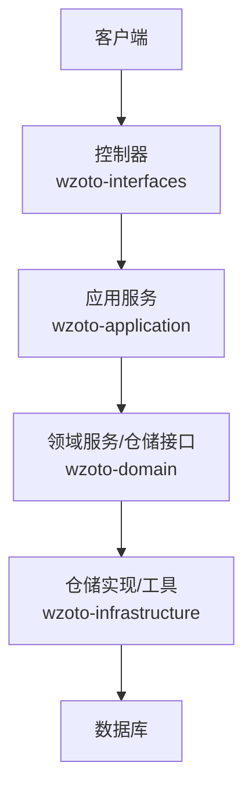
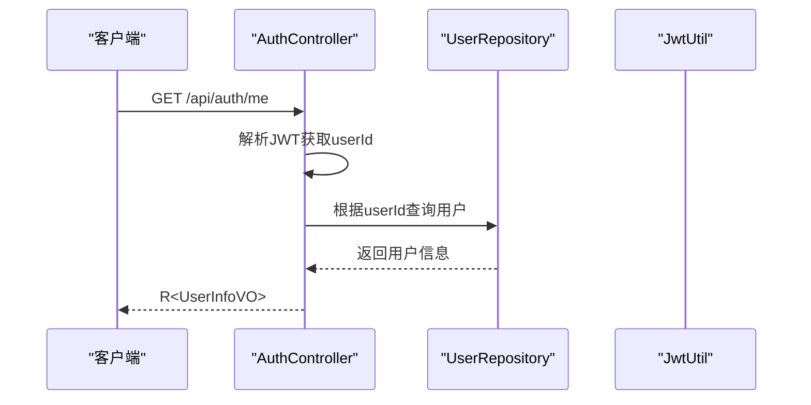
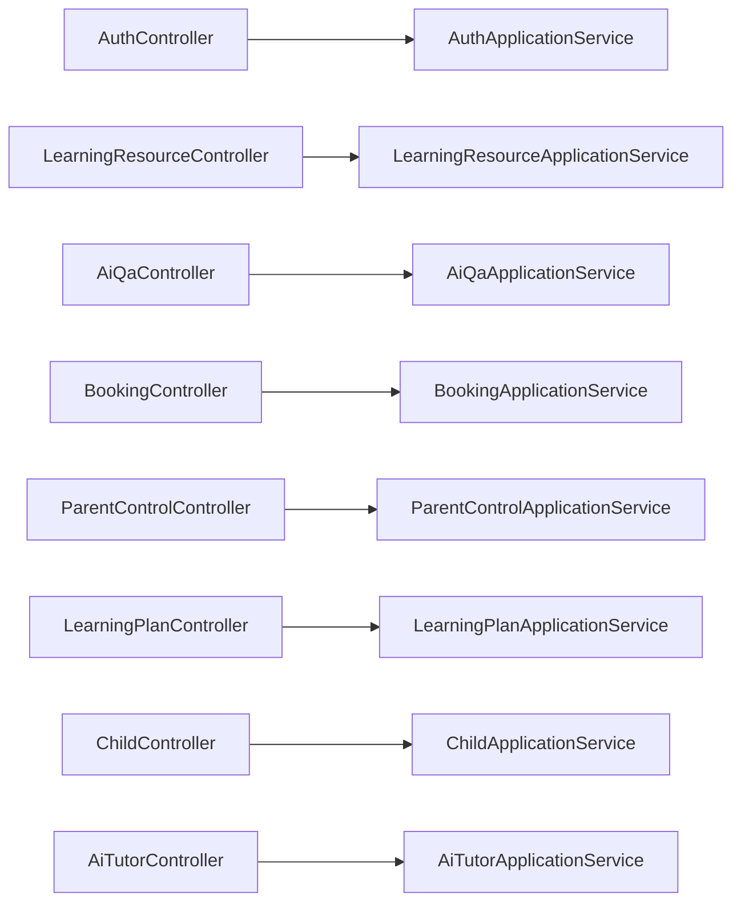
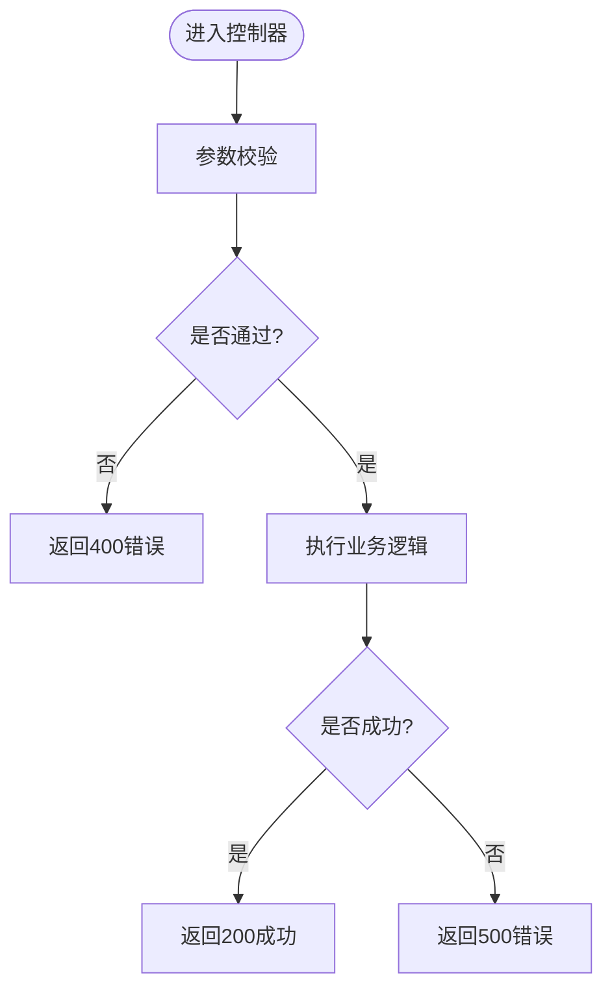

# API接口文档

<cite>
**本文引用的文件**
- [AuthController.java](file://wzoto-backend/wzoto-interfaces/src/main/java/com/wzoto/interfaces/controller/AuthController.java)
- [R.java](file://wzoto-backend/wzoto-interfaces/src/main/java/com/wzoto/interfaces/common/R.java)
- [GlobalExceptionHandler.java](file://wzoto-backend/wzoto-interfaces/src/main/java/com/wzoto/interfaces/common/GlobalExceptionHandler.java)
- [LearningResourceController.java](file://wzoto-backend/wzoto-interfaces/src/main/java/com/wzoto/interfaces/controller/LearningResourceController.java)
- [AiQaController.java](file://wzoto-backend/wzoto-interfaces/src/main/java/com/wzoto/interfaces/controller/AiQaController.java)
- [BookingController.java](file://wzoto-backend/wzoto-interfaces/src/main/java/com/wzoto/interfaces/controller/BookingController.java)
- [ParentControlController.java](file://wzoto-backend/wzoto-interfaces/src/main/java/com/wzoto/interfaces/controller/ParentControlController.java)
- [LearningPlanController.java](file://wzoto-backend/wzoto-interfaces/src/main/java/com/wzoto/interfaces/controller/LearningPlanController.java)
- [ChildController.java](file://wzoto-backend/wzoto-interfaces/src/main/java/com/wzoto/interfaces/controller/ChildController.java)
- [AiTutorController.java](file://wzoto-backend/wzoto-interfaces/src/main/java/com/wzoto/interfaces/controller/AiTutorController.java)
</cite>

## 目录
1. [简介](#简介)
2. [项目结构](#项目结构)
3. [核心组件](#核心组件)
4. [架构总览](#架构总览)
5. [详细组件分析](#详细组件分析)
6. [依赖关系分析](#依赖关系分析)
7. [性能考虑](#性能考虑)
8. [故障排查指南](#故障排查指南)
9. [结论](#结论)
10. [附录](#附录)

## 简介
本文件为 wzoto 后端项目的完整 RESTful API 接口文档。内容覆盖认证、学习资源、AI答疑与教员优化、预约、家长管控、学习计划、子女档案等模块，统一使用 JSON 请求/响应格式，并提供状态码定义、错误处理策略、鉴权机制说明以及调试建议。所有接口均基于 Spring Boot 控制器实现，返回统一结果对象 R<T>。

## 项目结构
后端采用分层架构：
- 接口层（interfaces）：控制器暴露 HTTP 接口，负责参数校验、日志记录、调用应用服务并返回统一响应。
- 应用层（application）：编排业务用例，协调领域服务与仓储。
- 领域层（domain）：实体、值对象、领域服务与仓储接口。
- 基础设施层（infrastructure）：持久化实现、工具类（如 JWT）、外部服务集成。

图表来源
- [AuthController.java:21-149](file://wzoto-backend/wzoto-interfaces/src/main/java/com/wzoto/interfaces/controller/AuthController.java#L21-L149)
- [LearningResourceController.java:16-79](file://wzoto-backend/wzoto-interfaces/src/main/java/com/wzoto/interfaces/controller/LearningResourceController.java#L16-L79)
- [AiQaController.java:16-51](file://wzoto-backend/wzoto-interfaces/src/main/java/com/wzoto/interfaces/controller/AiQaController.java#L16-L51)
- [BookingController.java:19-96](file://wzoto-backend/wzoto-interfaces/src/main/java/com/wzoto/interfaces/controller/BookingController.java#L19-L96)
- [ParentControlController.java:13-75](file://wzoto-backend/wzoto-interfaces/src/main/java/com/wzoto/interfaces/controller/ParentControlController.java#L13-L75)
- [LearningPlanController.java:20-78](file://wzoto-backend/wzoto-interfaces/src/main/java/com/wzoto/interfaces/controller/LearningPlanController.java#L20-L78)
- [ChildController.java:20-77](file://wzoto-backend/wzoto-interfaces/src/main/java/com/wzoto/interfaces/controller/ChildController.java#L20-L77)
- [AiTutorController.java:18-115](file://wzoto-backend/wzoto-interfaces/src/main/java/com/wzoto/interfaces/controller/AiTutorController.java#L18-L115)

章节来源
- [AuthController.java:21-149](file://wzoto-backend/wzoto-interfaces/src/main/java/com/wzoto/interfaces/controller/AuthController.java#L21-L149)
- [LearningResourceController.java:16-79](file://wzoto-backend/wzoto-interfaces/src/main/java/com/wzoto/interfaces/controller/LearningResourceController.java#L16-L79)
- [AiQaController.java:16-51](file://wzoto-backend/wzoto-interfaces/src/main/java/com/wzoto/interfaces/controller/AiQaController.java#L16-L51)
- [BookingController.java:19-96](file://wzoto-backend/wzoto-interfaces/src/main/java/com/wzoto/interfaces/controller/BookingController.java#L19-L96)
- [ParentControlController.java:13-75](file://wzoto-backend/wzoto-interfaces/src/main/java/com/wzoto/interfaces/controller/ParentControlController.java#L13-L75)
- [LearningPlanController.java:20-78](file://wzoto-backend/wzoto-interfaces/src/main/java/com/wzoto/interfaces/controller/LearningPlanController.java#L20-L78)
- [ChildController.java:20-77](file://wzoto-backend/wzoto-interfaces/src/main/java/com/wzoto/interfaces/controller/ChildController.java#L20-L77)
- [AiTutorController.java:18-115](file://wzoto-backend/wzoto-interfaces/src/main/java/com/wzoto/interfaces/controller/AiTutorController.java#L18-L115)

## 核心组件
- 统一响应体 R<T>：包含 code、msg、data 三个字段，提供 ok/fail/unauthorized/badRequest 等便捷构造方法。
- 全局异常处理器：将常见异常转换为统一的 R 响应，包括参数校验失败、业务规则违反、运行时异常等。
- 认证与鉴权：通过 JWT 令牌进行身份识别与权限控制；部分接口需登录态。

章节来源
- [R.java:1-43](file://wzoto-backend/wzoto-interfaces/src/main/java/com/wzoto/interfaces/common/R.java#L1-L43)
- [GlobalExceptionHandler.java:11-67](file://wzoto-backend/wzoto-interfaces/src/main/java/com/wzoto/interfaces/common/GlobalExceptionHandler.java#L11-L67)
- [AuthController.java:34-127](file://wzoto-backend/wzoto-interfaces/src/main/java/com/wzoto/interfaces/controller/AuthController.java#L34-L127)

## 架构总览
下图展示典型请求从客户端到数据层的调用链，以“获取当前用户信息”为例：

图表来源
- [AuthController.java:34-63](file://wzoto-backend/wzoto-interfaces/src/main/java/com/wzoto/interfaces/controller/AuthController.java#L34-L63)

## 详细组件分析

### 认证接口
- 基础路径：/api/auth
- 鉴权：部分接口需要携带有效 JWT 令牌；开发环境支持昵称直登。

| 方法 | 路径 | 说明 | 请求体/参数 | 成功响应 | 状态码 |
|---|---|---|---|---|---|
| POST | /api/auth/wx-login | 微信登录 | WxLoginDTO(code) | LoginVO(token, userId, nickname, avatar, identityType, hasIdentity, verifyStatus) | 200 |
| POST | /api/auth/select-identity | 选择身份 | SelectIdentityDTO(userId, identityType) | LoginVO | 200 |
| POST | /api/auth/bind-phone | 绑定手机号 | BindPhoneDTO(userId, phone) | LoginVO(含phone) | 200 |
| POST | /api/auth/dev-login | 开发环境登录 | DevLoginDTO(nickname) | LoginVO | 200 |
| GET | /api/auth/me | 获取当前用户信息 | 无 | UserInfoVO(userId, openid, phone, nickname, avatar, identityType, verifyStatus, realName) | 200 |

示例
- 请求示例（微信登录）
  - 方法：POST
  - URL：/api/auth/wx-login
  - 请求体：{"code": "wx_code"}
- 响应示例（成功）
  - { "code": 200, "msg": "success", "data": { "token": "...", "userId": 1, "nickname": "张三", "avatar": "...", "identityType": "PARENT", "hasIdentity": true, "verifyStatus": "NONE" } }

章节来源
- [AuthController.java:65-127](file://wzoto-backend/wzoto-interfaces/src/main/java/com/wzoto/interfaces/controller/AuthController.java#L65-L127)
- [AuthController.java:34-63](file://wzoto-backend/wzoto-interfaces/src/main/java/com/wzoto/interfaces/controller/AuthController.java#L34-L63)

### 学习资源接口
- 基础路径：/api/learning
- 鉴权：部分接口需登录态（读取资源列表、解锁VIP资源）。

| 方法 | 路径 | 说明 | 参数 | 成功响应 | 状态码 |
|---|---|---|---|---|---|
| GET | /api/learning/resources | 按条件查询学习资源 | childId, subject?, resourceType?, includeVip? | List<LearningResourceVO> | 200 |
| GET | /api/learning/resource/{id} | 获取资源详情 | id | LearningResourceVO | 200 |
| POST | /api/learning/resource/{id}/unlock | 解锁资源（可能触发付费） | id | FeatureOrder? | 200 |

示例
- 请求示例（查询资源）
  - 方法：GET
  - URL：/api/learning/resources?childId=1&subject=MATH&resourceType=VIDEO
- 响应示例（成功）
  - { "code": 200, "msg": "success", "data": [ {...}, {...} ] }

章节来源
- [LearningResourceController.java:27-51](file://wzoto-backend/wzoto-interfaces/src/main/java/com/wzoto/interfaces/controller/LearningResourceController.java#L27-L51)

### AI答疑接口
- 基础路径：/api/ai/qa
- 鉴权：需登录态。

| 方法 | 路径 | 说明 | 请求体/参数 | 成功响应 | 状态码 |
|---|---|---|---|---|---|
| POST | /api/ai/qa/ask | 发起答疑 | AiQaAskDTO(childId, subject, qaType, questionText, questionImageUrl?) | AiQaRecord | 200 |
| POST | /api/ai/qa/follow-up | 追问 | AiQaFollowUpDTO(childId, conversationId, questionText) | AiQaRecord | 200 |
| GET | /api/ai/qa/history/{childId} | 历史问答 | childId | List<AiQaRecord> | 200 |
| GET | /api/ai/qa/session/{conversationId} | 会话消息 | conversationId | List<AiQaRecord> | 200 |

示例
- 请求示例（发起答疑）
  - 方法：POST
  - URL：/api/ai/qa/ask
  - 请求体：{"childId": 1, "subject": "MATH", "qaType": "EXPLANATION", "questionText": "请解释二次函数顶点式"}
- 响应示例（成功）
  - { "code": 200, "msg": "success", "data": { "conversationId": "...", "answer": "...", ... } }

章节来源
- [AiQaController.java:25-49](file://wzoto-backend/wzoto-interfaces/src/main/java/com/wzoto/interfaces/controller/AiQaController.java#L25-L49)

### 预约接口
- 基础路径：/api/booking
- 鉴权：需登录态。

| 方法 | 路径 | 说明 | 请求体/参数 | 成功响应 | 状态码 |
|---|---|---|---|---|---|
| POST | /api/booking | 创建预约 | CreateBookingDTO(tutorProfileId, subject, bookingDate, startTime, endTime, address?, message?) | BookingVO | 200 |
| POST | /api/booking/{id}/confirm | 确认预约 | id | BookingVO | 200 |
| POST | /api/booking/{id}/reject | 拒绝预约 | id, reason? | BookingVO | 200 |
| POST | /api/booking/{id}/cancel | 取消预约 | id | BookingVO | 200 |
| GET | /api/booking/my | 我的预约 | 无 | List<BookingVO> | 200 |
| GET | /api/booking/{id} | 预约详情 | id | BookingVO | 200 |

示例
- 请求示例（创建预约）
  - 方法：POST
  - URL：/api/booking
  - 请求体：{"tutorProfileId": 10, "subject": "MATH", "bookingDate": "2025-12-01", "startTime": "10:00", "endTime": "11:00", "address": "线上", "message": "请讲解导数"}
- 响应示例（成功）
  - { "code": 200, "msg": "success", "data": { "id": 1, "parentId": 1, "parentName": "家长", "tutorId": 2, "tutorName": "教员", "tutorProfileId": 10, "subject": "MATH", "bookingDate": "2025-12-01", "startTime": "10:00", "endTime": "11:00", "address": "线上", "message": "请讲解导数", "status": "PENDING", "statusDesc": "待确认", "reply": null, "createdAt": "..." } }

章节来源
- [BookingController.java:28-72](file://wzoto-backend/wzoto-interfaces/src/main/java/com/wzoto/interfaces/controller/BookingController.java#L28-L72)

### 家长管控接口
- 基础路径：/api/learning/control
- 鉴权：需登录态。

| 方法 | 路径 | 说明 | 请求体/参数 | 成功响应 | 状态码 |
|---|---|---|---|---|---|
| GET | /api/learning/control/{childId} | 获取管控配置 | childId | ControlConfigVO | 200 |
| POST | /api/learning/control/{childId} | 保存管控配置 | childId, ControlConfigDTO(dailyLimitMinutes, restIntervalMinutes, forbiddenStartTime, forbiddenEndTime, eyeProtectionMode, blueLightFilter, postureReminder) | ControlConfigVO | 200 |
| POST | /api/learning/control/{childId}/lock | 锁定设备 | childId | ControlConfigVO | 200 |
| POST | /api/learning/control/{childId}/unlock | 解锁设备 | childId | ControlConfigVO | 200 |

示例
- 请求示例（保存配置）
  - 方法：POST
  - URL：/api/learning/control/1
  - 请求体：{"dailyLimitMinutes": 60, "restIntervalMinutes": 10, "forbiddenStartTime": "22:00", "forbiddenEndTime": "07:00", "eyeProtectionMode": true, "blueLightFilter": true, "postureReminder": true}
- 响应示例（成功）
  - { "code": 200, "msg": "success", "data": { "id": 1, "parentId": 1, "childId": 1, "dailyLimitMinutes": 60, "restIntervalMinutes": 10, "forbiddenStartTime": "22:00", "forbiddenEndTime": "07:00", "locked": false, "eyeProtectionMode": true, "blueLightFilter": true, "postureReminder": true } }

章节来源
- [ParentControlController.java:24-57](file://wzoto-backend/wzoto-interfaces/src/main/java/com/wzoto/interfaces/controller/ParentControlController.java#L24-L57)

### 学习计划接口
- 基础路径：/api/learning/plan
- 鉴权：需登录态。

| 方法 | 路径 | 说明 | 请求体/参数 | 成功响应 | 状态码 |
|---|---|---|---|---|---|
| GET | /api/learning/plan/{childId} | 获取计划配置 | childId | LearningPlanConfig | 200 |
| POST | /api/learning/plan/{childId} | 保存计划配置 | childId, LearningPlanConfigDTO(dailyDurationMinutes, chineseWeight, mathWeight, englishWeight, specialCalculationEnabled, specialApplicationEnabled, specialLiteracyEnabled, specialWordsEnabled) | LearningPlanConfig | 200 |
| POST | /api/learning/plan/{childId}/special-task | 布置专项任务 | childId, CreateTaskDTO(specialType, count) | List<LearningTaskVO> | 200 |

示例
- 请求示例（布置专项任务）
  - 方法：POST
  - URL：/api/learning/plan/1/special-task
  - 请求体：{"specialType": "CALCULATION", "count": 5}
- 响应示例（成功）
  - { "code": 200, "msg": "success", "data": [ { "id": 1, "childId": 1, "taskType": "CALCULATION", "taskTypeDesc": "计算专项", "subject": "MATH", "title": "练习1", "resourceId": 100, "taskDate": "2025-12-01", "status": "TODO", "statusDesc": "未完成", "startTime": null, "completeTime": null, "spentSeconds": 0 }, ... ] }

章节来源
- [LearningPlanController.java:31-58](file://wzoto-backend/wzoto-interfaces/src/main/java/com/wzoto/interfaces/controller/LearningPlanController.java#L31-L58)

### 子女档案接口
- 基础路径：/api
- 鉴权：需登录态。

| 方法 | 路径 | 说明 | 请求体/参数 | 成功响应 | 状态码 |
|---|---|---|---|---|---|
| POST | /api/child | 新增子女 | CreateChildDTO(name, grade, textbookVersion) | ChildVO | 200 |
| PUT | /api/child/{id} | 更新子女 | id, UpdateChildDTO(name?, grade?, textbookVersion?, school?, avatar?) | ChildVO | 200 |
| DELETE | /api/child/{id} | 删除子女 | id | Boolean | 200 |
| GET | /api/children | 我的子女 | 无 | List<ChildVO> | 200 |
| GET | /api/child/{id} | 子女详情 | id | ChildVO | 200 |

示例
- 请求示例（新增子女）
  - 方法：POST
  - URL：/api/child
  - 请求体：{"name": "小明", "grade": "GRADE_5", "textbookVersion": "PEP_MATH"}
- 响应示例（成功）
  - { "code": 200, "msg": "success", "data": { "id": 1, "parentId": 1, "name": "小明", "grade": "GRADE_5", "gradeDesc": "五年级", "textbookVersion": "PEP_MATH", "textbookVersionDesc": "人教版数学", "school": "XX小学", "avatar": "...", "createdAt": "..." } }

章节来源
- [ChildController.java:31-60](file://wzoto-backend/wzoto-interfaces/src/main/java/com/wzoto/interfaces/controller/ChildController.java#L31-L60)

### AI教员优化接口
- 基础路径：/api/ai/tutor
- 鉴权：需登录态。

| 方法 | 路径 | 说明 | 请求体/参数 | 成功响应 | 状态码 |
|---|---|---|---|---|---|
| POST | /api/ai/tutor/resume | 简历优化 | CreateResumeOptimizationDTO(university, major, grade, subjects[], bio?, experience?) | AiTutorOptimizationVO | 200 |
| POST | /api/ai/tutor/pricing | 定价分析 | CreatePricingAnalysisDTO(university, major, grade, subjects[], experience?, currentRate?) | AiTutorOptimizationVO | 200 |
| GET | /api/ai/tutor/optimizations | 我的优化记录 | 无 | List<AiTutorOptimizationVO> | 200 |
| GET | /api/ai/tutor/{id} | 优化详情 | id | AiTutorOptimizationVO | 200 |
| POST | /api/ai/tutor/{id}/pay | 付费解锁 | id | AiTutorOptimizationVO | 200 |

示例
- 请求示例（简历优化）
  - 方法：POST
  - URL：/api/ai/tutor/resume
  - 请求体：{"university": "XX大学", "major": "数学与应用数学", "grade": "大三", "subjects": ["MATH", "ENGLISH"], "bio": "热爱教育...", "experience": "家教经验..."}
- 响应示例（成功）
  - { "code": 200, "msg": "success", "data": { "id": 1, "optimizationType": "RESUME", "university": "XX大学", "major": "数学与应用数学", "grade": "大三", "subjects": ["MATH", "ENGLISH"], "currentBio": "...", "currentExperience": "...", "optimizedContent": "...", "previewContent": "...", "isMemberReport": false, "price": 9.9, "paymentStatus": "UNPAID", "createdAt": "..." } }

章节来源
- [AiTutorController.java:29-88](file://wzoto-backend/wzoto-interfaces/src/main/java/com/wzoto/interfaces/controller/AiTutorController.java#L29-L88)

## 依赖关系分析
控制器之间的耦合度较低，主要通过应用服务解耦业务逻辑。各控制器依赖的仓储或工具类在基础设施层实现，便于替换与扩展。

图表来源
- [AuthController.java:21-149](file://wzoto-backend/wzoto-interfaces/src/main/java/com/wzoto/interfaces/controller/AuthController.java#L21-L149)
- [LearningResourceController.java:16-79](file://wzoto-backend/wzoto-interfaces/src/main/java/com/wzoto/interfaces/controller/LearningResourceController.java#L16-L79)
- [AiQaController.java:16-51](file://wzoto-backend/wzoto-interfaces/src/main/java/com/wzoto/interfaces/controller/AiQaController.java#L16-L51)
- [BookingController.java:19-96](file://wzoto-backend/wzoto-interfaces/src/main/java/com/wzoto/interfaces/controller/BookingController.java#L19-L96)
- [ParentControlController.java:13-75](file://wzoto-backend/wzoto-interfaces/src/main/java/com/wzoto/interfaces/controller/ParentControlController.java#L13-L75)
- [LearningPlanController.java:20-78](file://wzoto-backend/wzoto-interfaces/src/main/java/com/wzoto/interfaces/controller/LearningPlanController.java#L20-L78)
- [ChildController.java:20-77](file://wzoto-backend/wzoto-interfaces/src/main/java/com/wzoto/interfaces/controller/ChildController.java#L20-L77)
- [AiTutorController.java:18-115](file://wzoto-backend/wzoto-interfaces/src/main/java/com/wzoto/interfaces/controller/AiTutorController.java#L18-L115)

章节来源
- [AuthController.java:21-149](file://wzoto-backend/wzoto-interfaces/src/main/java/com/wzoto/interfaces/controller/AuthController.java#L21-L149)
- [LearningResourceController.java:16-79](file://wzoto-backend/wzoto-interfaces/src/main/java/com/wzoto/interfaces/controller/LearningResourceController.java#L16-L79)
- [AiQaController.java:16-51](file://wzoto-backend/wzoto-interfaces/src/main/java/com/wzoto/interfaces/controller/AiQaController.java#L16-L51)
- [BookingController.java:19-96](file://wzoto-backend/wzoto-interfaces/src/main/java/com/wzoto/interfaces/controller/BookingController.java#L19-L96)
- [ParentControlController.java:13-75](file://wzoto-backend/wzoto-interfaces/src/main/java/com/wzoto/interfaces/controller/ParentControlController.java#L13-L75)
- [LearningPlanController.java:20-78](file://wzoto-backend/wzoto-interfaces/src/main/java/com/wzoto/interfaces/controller/LearningPlanController.java#L20-L78)
- [ChildController.java:20-77](file://wzoto-backend/wzoto-interfaces/src/main/java/com/wzoto/interfaces/controller/ChildController.java#L20-L77)
- [AiTutorController.java:18-115](file://wzoto-backend/wzoto-interfaces/src/main/java/com/wzoto/interfaces/controller/AiTutorController.java#L18-L115)

## 性能考虑
- 批量查询：对资源列表、历史记录等接口建议使用分页与过滤参数，减少无效数据传输。
- 缓存策略：对热点数据（如课程树、资源目录）可引入缓存层降低数据库压力。
- 异步处理：AI生成类操作（答疑、报告）可采用异步任务+轮询或WebSocket推送，提升用户体验。
- 连接池与索引：确保数据库连接池合理配置，并为高频查询字段建立索引。

## 故障排查指南
- 统一错误格式：所有错误响应遵循 R<T> 结构，包含 code、msg、data。
- 常见错误码
  - 200：成功
  - 400：参数校验失败或业务规则违反
  - 401：未授权（缺少或无效JWT）
  - 500：系统异常
- 异常处理流程
  - 参数校验失败：MethodArgumentNotValidException/BindException -> 400 + 字段错误拼接
  - 业务异常：IllegalStateException -> 400 + 业务提示
  - 运行时异常：RuntimeException -> 500 + 错误信息
  - 其他异常：Exception -> 500 + 通用提示

图表来源
- [GlobalExceptionHandler.java:18-66](file://wzoto-backend/wzoto-interfaces/src/main/java/com/wzoto/interfaces/common/GlobalExceptionHandler.java#L18-L66)
- [R.java:19-41](file://wzoto-backend/wzoto-interfaces/src/main/java/com/wzoto/interfaces/common/R.java#L19-L41)

章节来源
- [GlobalExceptionHandler.java:18-66](file://wzoto-backend/wzoto-interfaces/src/main/java/com/wzoto/interfaces/common/GlobalExceptionHandler.java#L18-L66)
- [R.java:19-41](file://wzoto-backend/wzoto-interfaces/src/main/java/com/wzoto/interfaces/common/R.java#L19-L41)

## 结论
本文档系统化梳理了 wzoto 后端的 RESTful API，涵盖认证、学习资源、AI答疑与教员优化、预约、家长管控、学习计划、子女档案等模块。所有接口采用统一响应体与全局异常处理，便于前端集成与问题定位。建议在后续迭代中补充接口版本管理与自动化测试用例，以提升可维护性与稳定性。

## 附录
- 认证机制说明
  - JWT 令牌获取：通过微信登录或开发环境直登接口返回 token。
  - 接口鉴权：需在请求头携带有效的 JWT 令牌；未授权时返回 401。
  - 权限控制：根据用户身份类型与验证状态限制访问敏感功能。
- 错误处理
  - 统一错误格式：{ "code": 数字, "msg": "字符串", "data": 任意 }
  - 错误码定义：见“故障排查指南”。
  - 异常处理策略：见“全局异常处理器”。
- 接口版本管理
  - 向后兼容：新增字段不破坏旧客户端解析。
  - 废弃接口：保留过渡期并提前公告，逐步下线。
  - 升级指南：发布前提供变更说明与迁移脚本。
- Postman 集合与 Swagger
  - 可在本地启动后端服务后导出 Postman 集合。
  - 若启用 OpenAPI/Swagger，可通过 /swagger-ui.html 查看在线文档。
- 接口测试与调试
  - 使用 curl 或 Postman 发送请求，检查响应结构与状态码。
  - 关注日志中的 BI 埋点键（如 resource_list、control_save），用于追踪关键行为。