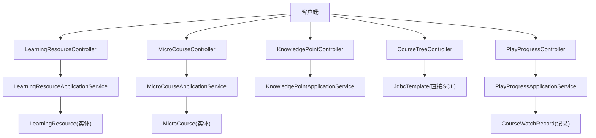
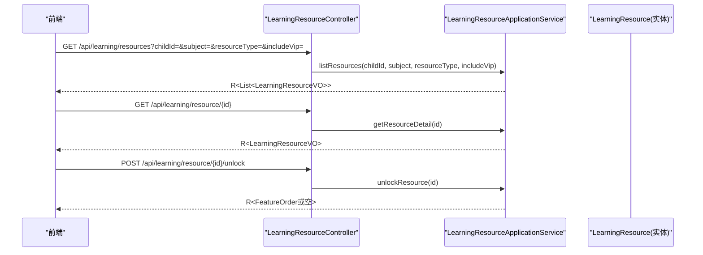
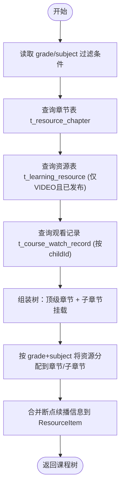
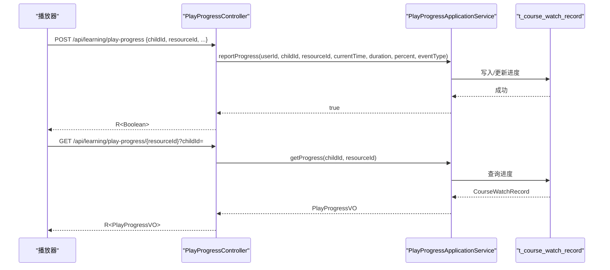
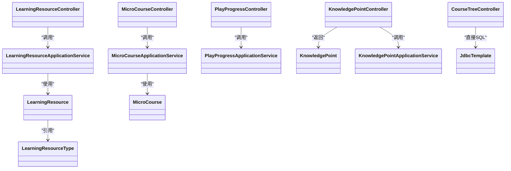

# 学习接口

<cite>
**本文引用的文件**
- [LearningResourceController.java](file://wzoto-backend/wzoto-interfaces/src/main/java/com/wzoto/interfaces/controller/LearningResourceController.java)
- [MicroCourseController.java](file://wzoto-backend/wzoto-interfaces/src/main/java/com/wzoto/interfaces/controller/MicroCourseController.java)
- [KnowledgePointController.java](file://wzoto-backend/wzoto-interfaces/src/main/java/com/wzoto/interfaces/controller/KnowledgePointController.java)
- [CourseTreeController.java](file://wzoto-backend/wzoto-interfaces/src/main/java/com/wzoto/interfaces/controller/CourseTreeController.java)
- [PlayProgressController.java](file://wzoto-backend/wzoto-interfaces/src/main/java/com/wzoto/interfaces/controller/PlayProgressController.java)
- [LearningResourceApplicationService.java](file://wzoto-backend/wzoto-application/src/main/java/com/wzoto/application/service/LearningResourceApplicationService.java)
- [MicroCourseApplicationService.java](file://wzoto-backend/wzoto-application/src/main/java/com/wzoto/application/service/MicroCourseApplicationService.java)
- [LearningResourceVO.java](file://wzoto-backend/wzoto-interfaces/src/main/java/com/wzoto/interfaces/vo/learning/LearningResourceVO.java)
- [CourseTreeVO.java](file://wzoto-backend/wzoto-interfaces/src/main/java/com/wzoto/interfaces/vo/learning/CourseTreeVO.java)
- [PlayProgressVO.java](file://wzoto-backend/wzoto-interfaces/src/main/java/com/wzoto/interfaces/vo/learning/PlayProgressVO.java)
- [LearningResource.java](file://wzoto-backend/wzoto-domain/src/main/java/com/wzoto/domain/entity/LearningResource.java)
- [MicroCourse.java](file://wzoto-backend/wzoto-domain/src/main/java/com/wzoto/domain/entity/MicroCourse.java)
- [KnowledgePoint.java](file://wzoto-backend/wzoto-domain/src/main/java/com/wzoto/domain/entity/KnowledgePoint.java)
- [LearningResourceType.java](file://wzoto-backend/wzoto-domain/src/main/java/com/wzoto/domain/valobj/LearningResourceType.java)
</cite>

## 目录
1. [简介](#简介)
2. [项目结构](#项目结构)
3. [核心组件](#核心组件)
4. [架构总览](#架构总览)
5. [详细组件分析](#详细组件分析)
6. [依赖分析](#依赖分析)
7. [性能考虑](#性能考虑)
8. [故障排查指南](#故障排查指南)
9. [结论](#结论)
10. [附录：接口清单与示例](#附录接口清单与示例)

## 简介
本文件为“学习模块”的完整API接口文档，覆盖学习资源管理、微课课程、知识点管理、课程树结构、播放进度跟踪等核心能力。文档面向前后端开发与测试人员，提供每个接口的功能说明、请求参数、响应数据结构、调用示例以及数据模型与批量操作建议，并给出分页查询、缓存策略与大数据量处理方案等性能优化建议。

## 项目结构
学习模块采用分层架构：
- 接口层（Controller）：暴露HTTP API，负责参数校验、日志埋点、统一响应封装。
- 应用服务层（Application Service）：编排领域服务，完成用例级流程。
- 领域层（Domain）：实体与值对象定义业务规则与状态。
- 基础设施层（Infrastructure）：持久化与外部集成（本仓库中由Mapper/Repository实现）。

图表来源
- [LearningResourceController.java:1-79](file://wzoto-backend/wzoto-interfaces/src/main/java/com/wzoto/interfaces/controller/LearningResourceController.java#L1-L79)
- [MicroCourseController.java:1-46](file://wzoto-backend/wzoto-interfaces/src/main/java/com/wzoto/interfaces/controller/MicroCourseController.java#L1-L46)
- [KnowledgePointController.java:1-38](file://wzoto-backend/wzoto-interfaces/src/main/java/com/wzoto/interfaces/controller/KnowledgePointController.java#L1-L38)
- [CourseTreeController.java:1-187](file://wzoto-backend/wzoto-interfaces/src/main/java/com/wzoto/interfaces/controller/CourseTreeController.java#L1-L187)
- [PlayProgressController.java:1-69](file://wzoto-backend/wzoto-interfaces/src/main/java/com/wzoto/interfaces/controller/PlayProgressController.java#L1-L69)
- [LearningResourceApplicationService.java:1-40](file://wzoto-backend/wzoto-application/src/main/java/com/wzoto/application/service/LearningResourceApplicationService.java#L1-L40)
- [MicroCourseApplicationService.java:1-39](file://wzoto-backend/wzoto-application/src/main/java/com/wzoto/application/service/MicroCourseApplicationService.java#L1-L39)

章节来源
- [LearningResourceController.java:1-79](file://wzoto-backend/wzoto-interfaces/src/main/java/com/wzoto/interfaces/controller/LearningResourceController.java#L1-L79)
- [MicroCourseController.java:1-46](file://wzoto-backend/wzoto-interfaces/src/main/java/com/wzoto/interfaces/controller/MicroCourseController.java#L1-L46)
- [KnowledgePointController.java:1-38](file://wzoto-backend/wzoto-interfaces/src/main/java/com/wzoto/interfaces/controller/KnowledgePointController.java#L1-L38)
- [CourseTreeController.java:1-187](file://wzoto-backend/wzoto-interfaces/src/main/java/com/wzoto/interfaces/controller/CourseTreeController.java#L1-L187)
- [PlayProgressController.java:1-69](file://wzoto-backend/wzoto-interfaces/src/main/java/com/wzoto/interfaces/controller/PlayProgressController.java#L1-L69)

## 核心组件
- 学习资源管理：按年级、学科、教材版本组织视频、练习、PDF等资源；支持VIP限制与解锁；返回资源列表与详情。
- 微课课程：微课列表、详情、推荐、进度上报。
- 知识点管理：知识点树、子节点、单点查询。
- 课程树结构：年级>学科>章节>课时（资源）的目录树，附带观看进度。
- 播放进度跟踪：断点续播、心跳上报、累计观看时长。

章节来源
- [LearningResourceApplicationService.java:1-40](file://wzoto-backend/wzoto-application/src/main/java/com/wzoto/application/service/LearningResourceApplicationService.java#L1-L40)
- [MicroCourseApplicationService.java:1-39](file://wzoto-backend/wzoto-application/src/main/java/com/wzoto/application/service/MicroCourseApplicationService.java#L1-L39)
- [KnowledgePointController.java:1-38](file://wzoto-backend/wzoto-interfaces/src/main/java/com/wzoto/interfaces/controller/KnowledgePointController.java#L1-L38)
- [CourseTreeController.java:1-187](file://wzoto-backend/wzoto-interfaces/src/main/java/com/wzoto/interfaces/controller/CourseTreeController.java#L1-L187)
- [PlayProgressController.java:1-69](file://wzoto-backend/wzoto-interfaces/src/main/java/com/wzoto/interfaces/controller/PlayProgressController.java#L1-L69)

## 架构总览
学习模块通过控制器暴露REST接口，应用服务协调领域服务与仓储，领域实体承载业务规则与状态。课程树接口使用JdbcTemplate直接查询章节与资源，并合并观看进度形成树形结构。

图表来源
- [LearningResourceController.java:27-51](file://wzoto-backend/wzoto-interfaces/src/main/java/com/wzoto/interfaces/controller/LearningResourceController.java#L27-L51)
- [LearningResourceApplicationService.java:24-38](file://wzoto-backend/wzoto-application/src/main/java/com/wzoto/application/service/LearningResourceApplicationService.java#L24-L38)
- [LearningResource.java:21-153](file://wzoto-backend/wzoto-domain/src/main/java/com/wzoto/domain/entity/LearningResource.java#L21-L153)

## 详细组件分析

### 学习资源管理接口
- 功能用途
  - 列出学习资源：支持按年级、学科、资源类型过滤，是否包含VIP资源。
  - 获取资源详情：根据资源ID返回详细信息。
  - 解锁资源：对VIP资源进行单次解锁或引导购买。
- 请求参数
  - 列表：childId（必填）、subject（可选）、resourceType（可选，枚举见下）、includeVip（可选）
  - 详情：id（路径参数）
  - 解锁：id（路径参数）
- 响应数据
  - 列表：R<List<LearningResourceVO>>
  - 详情：R<LearningResourceVO>
  - 解锁：R<FeatureOrder或空>
- 常用示例
  - 获取数学三年级视频资源：GET /api/learning/resources?childId=2&subject=MATH&resourceType=VIDEO
  - 获取资源详情：GET /api/learning/resource/1001
  - 解锁VIP资源：POST /api/learning/resource/1001/unlock

章节来源
- [LearningResourceController.java:27-51](file://wzoto-backend/wzoto-interfaces/src/main/java/com/wzoto/interfaces/controller/LearningResourceController.java#L27-L51)
- [LearningResourceVO.java:1-37](file://wzoto-backend/wzoto-interfaces/src/main/java/com/wzoto/interfaces/vo/learning/LearningResourceVO.java#L1-L37)
- [LearningResourceType.java:1-33](file://wzoto-backend/wzoto-domain/src/main/java/com/wzoto/domain/valobj/LearningResourceType.java#L1-L33)

### 微课课程接口
- 功能用途
  - 微课列表：按年级、学科、是否VIP筛选。
  - 微课详情：按ID获取。
  - 进度上报：标记课程学习进度。
  - 推荐：基于学生画像推荐微课。
- 请求参数
  - 列表：grade（可选）、subject（可选）、vipOnly（可选）
  - 详情：id（路径参数）
  - 进度上报：courseId（查询参数）
  - 推荐：childId（路径参数）、limit（默认10）
- 响应数据
  - 列表/详情/推荐：R<List<MicroCourse>> 或 R<MicroCourse>
  - 进度上报：R<MicroCourse>
- 常用示例
  - 列表：GET /api/course/list?grade=GRADE_4&subject=MATH
  - 详情：GET /api/course/1002
  - 上报进度：POST /api/course/progress?courseId=1002
  - 推荐：GET /api/course/recommend/2?limit=10

章节来源
- [MicroCourseController.java:22-44](file://wzoto-backend/wzoto-interfaces/src/main/java/com/wzoto/interfaces/controller/MicroCourseController.java#L22-L44)
- [MicroCourse.java:1-52](file://wzoto-backend/wzoto-domain/src/main/java/com/wzoto/domain/entity/MicroCourse.java#L1-L52)

### 知识点管理接口
- 功能用途
  - 获取知识点树：按年级、学科、教材版本过滤。
  - 获取子节点：根据父节点ID获取下一级知识点。
  - 获取单点：根据ID获取知识点详情。
- 请求参数
  - 树：grade（可选）、subject（可选）、textbookVersion（可选）
  - 子节点：parentId（路径参数）
  - 单点：id（路径参数）
- 响应数据
  - 树/子节点：R<List<KnowledgePoint>>
  - 单点：R<KnowledgePoint>
- 常用示例
  - 获取树：GET /api/knowledge/tree?grade=GRADE_4&subject=CHINESE
  - 子节点：GET /api/knowledge/children/100
  - 单点：GET /api/knowledge/101

章节来源
- [KnowledgePointController.java:21-36](file://wzoto-backend/wzoto-interfaces/src/main/java/com/wzoto/interfaces/controller/KnowledgePointController.java#L21-L36)
- [KnowledgePoint.java:1-39](file://wzoto-backend/wzoto-domain/src/main/java/com/wzoto/domain/entity/KnowledgePoint.java#L1-L39)

### 课程树结构接口
- 功能用途
  - 返回“年级 > 学科 > 章节 > 课时（资源）”的目录树，并在课时中附带断点续播信息（上次位置、进度百分比、是否完成）。
- 请求参数
  - childId（必填）、grade（可选）、subject（可选）
- 响应数据
  - R<List<CourseTreeVO>>，其中CourseTreeVO包含children与resources（ResourceItem），ResourceItem包含lastPositionSeconds、progressPercent、completed等字段。
- 常用示例
  - GET /api/learning/courses?childId=2&grade=GRADE_4&subject=MATH

图表来源
- [CourseTreeController.java:29-158](file://wzoto-backend/wzoto-interfaces/src/main/java/com/wzoto/interfaces/controller/CourseTreeController.java#L29-L158)
- [CourseTreeVO.java:1-65](file://wzoto-backend/wzoto-interfaces/src/main/java/com/wzoto/interfaces/vo/learning/CourseTreeVO.java#L1-L65)

章节来源
- [CourseTreeController.java:29-187](file://wzoto-backend/wzoto-interfaces/src/main/java/com/wzoto/interfaces/controller/CourseTreeController.java#L29-L187)

### 播放进度跟踪接口
- 功能用途
  - 上报播放进度：支持心跳上报（每数秒一次），记录当前位置、总时长、百分比、事件类型。
  - 获取断点位置：用于续播，返回上次位置、进度百分比、是否完成、累计观看时长。
- 请求参数
  - 上报：body={childId, resourceId, currentTime?, duration?, percent?, eventType?}
  - 获取：childId（查询参数）、resourceId（路径参数）
- 响应数据
  - 上报：R<Boolean>
  - 获取：R<PlayProgressVO>
- 常用示例
  - 上报：POST /api/learning/play-progress {childId:2, resourceId:1001, currentTime:120, duration:600, percent:20, eventType:"HEARTBEAT"}
  - 获取断点：GET /api/learning/play-progress/1001?childId=2

图表来源
- [PlayProgressController.java:25-67](file://wzoto-backend/wzoto-interfaces/src/main/java/com/wzoto/interfaces/controller/PlayProgressController.java#L25-L67)

章节来源
- [PlayProgressController.java:25-67](file://wzoto-backend/wzoto-interfaces/src/main/java/com/wzoto/interfaces/controller/PlayProgressController.java#L25-L67)

## 依赖分析
- 控制器与应用服务解耦：控制器只负责入参解析与响应封装，业务编排在应用服务。
- 领域实体承载规则：如资源类型枚举、微课播放计数、知识点叶子判断等。
- 课程树直连数据库：通过JdbcTemplate直接拼装SQL，减少中间层开销，但需关注可维护性与安全性。

图表来源
- [LearningResourceController.java:1-79](file://wzoto-backend/wzoto-interfaces/src/main/java/com/wzoto/interfaces/controller/LearningResourceController.java#L1-L79)
- [MicroCourseController.java:1-46](file://wzoto-backend/wzoto-interfaces/src/main/java/com/wzoto/interfaces/controller/MicroCourseController.java#L1-L46)
- [KnowledgePointController.java:1-38](file://wzoto-backend/wzoto-interfaces/src/main/java/com/wzoto/interfaces/controller/KnowledgePointController.java#L1-L38)
- [CourseTreeController.java:1-187](file://wzoto-backend/wzoto-interfaces/src/main/java/com/wzoto/interfaces/controller/CourseTreeController.java#L1-L187)
- [PlayProgressController.java:1-69](file://wzoto-backend/wzoto-interfaces/src/main/java/com/wzoto/interfaces/controller/PlayProgressController.java#L1-L69)
- [LearningResourceApplicationService.java:1-40](file://wzoto-backend/wzoto-application/src/main/java/com/wzoto/application/service/LearningResourceApplicationService.java#L1-L40)
- [MicroCourseApplicationService.java:1-39](file://wzoto-backend/wzoto-application/src/main/java/com/wzoto/application/service/MicroCourseApplicationService.java#L1-L39)
- [LearningResource.java:1-153](file://wzoto-backend/wzoto-domain/src/main/java/com/wzoto/domain/entity/LearningResource.java#L1-L153)
- [MicroCourse.java:1-52](file://wzoto-backend/wzoto-domain/src/main/java/com/wzoto/domain/entity/MicroCourse.java#L1-L52)
- [KnowledgePoint.java:1-39](file://wzoto-backend/wzoto-domain/src/main/java/com/wzoto/domain/entity/KnowledgePoint.java#L1-L39)
- [LearningResourceType.java:1-33](file://wzoto-backend/wzoto-domain/src/main/java/com/wzoto/domain/valobj/LearningResourceType.java#L1-L33)

## 性能考虑
- 分页查询
  - 建议在资源列表与微课列表增加分页参数（page、size），避免一次性返回大量数据。
  - 课程树接口当前全量加载章节与资源，建议按年级/学科维度分页或懒加载子章节。
- 缓存策略
  - 知识点树与课程树适合读多写少，可在应用层引入缓存（如本地缓存或Redis），设置合理TTL与失效策略。
  - 资源列表可按年级+学科+资源类型维度缓存热点数据。
- 大数据量处理
  - 课程树组装在内存中进行，当资源量大时建议分片查询与分批组装，或使用数据库侧视图/物化视图预聚合。
  - 播放进度上报高频写入，建议异步落库或批量写入，降低主链路延迟。
- 其他优化
  - 列表接口增加必要索引（年级、学科、资源类型、状态）。
  - VIP资源解锁走独立接口，避免在列表接口中做复杂权限计算。

[本节为通用性能建议，不直接分析具体文件]

## 故障排查指南
- 常见问题定位
  - 资源列表为空：检查传入的年级、学科、资源类型是否正确；确认资源状态是否为已发布。
  - 课程树无资源：确认资源类型为VIDEO且状态为已发布；检查年级/学科过滤条件。
  - 进度未生效：确认上报频率合理（建议每数秒一次），并检查childId与resourceId是否正确。
- 日志与埋点
  - 控制器内已记录关键操作日志（如资源列表、解锁、课程进度上报），便于问题追踪。
- 数据一致性
  - 课程树中的进度来自观看记录表，若不一致请核对记录是否存在及是否被删除。

章节来源
- [LearningResourceController.java:27-51](file://wzoto-backend/wzoto-interfaces/src/main/java/com/wzoto/interfaces/controller/LearningResourceController.java#L27-L51)
- [MicroCourseController.java:34-38](file://wzoto-backend/wzoto-interfaces/src/main/java/com/wzoto/interfaces/controller/MicroCourseController.java#L34-L38)
- [CourseTreeController.java:75-82](file://wzoto-backend/wzoto-interfaces/src/main/java/com/wzoto/interfaces/controller/CourseTreeController.java#L75-L82)
- [PlayProgressController.java:28-43](file://wzoto-backend/wzoto-interfaces/src/main/java/com/wzoto/interfaces/controller/PlayProgressController.java#L28-L43)

## 结论
本学习模块提供了完整的资源管理、微课课程、知识点树、课程目录与播放进度能力。通过清晰的接口设计与领域模型，满足前端展示与交互需求。后续建议完善分页、缓存与批量操作能力，进一步提升系统可扩展性与性能。

## 附录：接口清单与示例

### 学习资源
- 列表
  - 方法：GET
  - 路径：/api/learning/resources
  - 参数：childId（必填）、subject（可选）、resourceType（可选，枚举：VIDEO/EXERCISE/PDF/QUESTION）、includeVip（可选）
  - 响应：R<List<LearningResourceVO>>
  - 示例：GET /api/learning/resources?childId=2&subject=MATH&resourceType=VIDEO
- 详情
  - 方法：GET
  - 路径：/api/learning/resource/{id}
  - 响应：R<LearningResourceVO>
  - 示例：GET /api/learning/resource/1001
- 解锁
  - 方法：POST
  - 路径：/api/learning/resource/{id}/unlock
  - 响应：R<FeatureOrder或空>
  - 示例：POST /api/learning/resource/1001/unlock

章节来源
- [LearningResourceController.java:27-51](file://wzoto-backend/wzoto-interfaces/src/main/java/com/wzoto/interfaces/controller/LearningResourceController.java#L27-L51)
- [LearningResourceVO.java:1-37](file://wzoto-backend/wzoto-interfaces/src/main/java/com/wzoto/interfaces/vo/learning/LearningResourceVO.java#L1-L37)
- [LearningResourceType.java:1-33](file://wzoto-backend/wzoto-domain/src/main/java/com/wzoto/domain/valobj/LearningResourceType.java#L1-L33)

### 微课课程
- 列表
  - 方法：GET
  - 路径：/api/course/list
  - 参数：grade（可选）、subject（可选）、vipOnly（可选）
  - 响应：R<List<MicroCourse>>
  - 示例：GET /api/course/list?grade=GRADE_4&subject=MATH
- 详情
  - 方法：GET
  - 路径：/api/course/{id}
  - 响应：R<MicroCourse>
  - 示例：GET /api/course/1002
- 进度上报
  - 方法：POST
  - 路径：/api/course/progress
  - 参数：courseId（查询参数）
  - 响应：R<MicroCourse>
  - 示例：POST /api/course/progress?courseId=1002
- 推荐
  - 方法：GET
  - 路径：/api/course/recommend/{childId}
  - 参数：limit（默认10）
  - 响应：R<List<MicroCourse>>
  - 示例：GET /api/course/recommend/2?limit=10

章节来源
- [MicroCourseController.java:22-44](file://wzoto-backend/wzoto-interfaces/src/main/java/com/wzoto/interfaces/controller/MicroCourseController.java#L22-L44)
- [MicroCourse.java:1-52](file://wzoto-backend/wzoto-domain/src/main/java/com/wzoto/domain/entity/MicroCourse.java#L1-L52)

### 知识点
- 树
  - 方法：GET
  - 路径：/api/knowledge/tree
  - 参数：grade（可选）、subject（可选）、textbookVersion（可选）
  - 响应：R<List<KnowledgePoint>>
  - 示例：GET /api/knowledge/tree?grade=GRADE_4&subject=CHINESE
- 子节点
  - 方法：GET
  - 路径：/api/knowledge/children/{parentId}
  - 响应：R<List<KnowledgePoint>>
  - 示例：GET /api/knowledge/children/100
- 单点
  - 方法：GET
  - 路径：/api/knowledge/{id}
  - 响应：R<KnowledgePoint>
  - 示例：GET /api/knowledge/101

章节来源
- [KnowledgePointController.java:21-36](file://wzoto-backend/wzoto-interfaces/src/main/java/com/wzoto/interfaces/controller/KnowledgePointController.java#L21-L36)
- [KnowledgePoint.java:1-39](file://wzoto-backend/wzoto-domain/src/main/java/com/wzoto/domain/entity/KnowledgePoint.java#L1-L39)

### 课程树
- 获取课程树
  - 方法：GET
  - 路径：/api/learning/courses
  - 参数：childId（必填）、grade（可选）、subject（可选）
  - 响应：R<List<CourseTreeVO>>
  - 示例：GET /api/learning/courses?childId=2&grade=GRADE_4&subject=MATH

章节来源
- [CourseTreeController.java:29-158](file://wzoto-backend/wzoto-interfaces/src/main/java/com/wzoto/interfaces/controller/CourseTreeController.java#L29-L158)
- [CourseTreeVO.java:1-65](file://wzoto-backend/wzoto-interfaces/src/main/java/com/wzoto/interfaces/vo/learning/CourseTreeVO.java#L1-L65)

### 播放进度
- 上报进度
  - 方法：POST
  - 路径：/api/learning/play-progress
  - 请求体：{childId, resourceId, currentTime?, duration?, percent?, eventType?}
  - 响应：R<Boolean>
  - 示例：POST /api/learning/play-progress {childId:2, resourceId:1001, currentTime:120, duration:600, percent:20, eventType:"HEARTBEAT"}
- 获取断点
  - 方法：GET
  - 路径：/api/learning/play-progress/{resourceId}
  - 参数：childId（查询参数）
  - 响应：R<PlayProgressVO>
  - 示例：GET /api/learning/play-progress/1001?childId=2

章节来源
- [PlayProgressController.java:25-67](file://wzoto-backend/wzoto-interfaces/src/main/java/com/wzoto/interfaces/controller/PlayProgressController.java#L25-L67)
- [PlayProgressVO.java:1-28](file://wzoto-backend/wzoto-interfaces/src/main/java/com/wzoto/interfaces/vo/learning/PlayProgressVO.java#L1-L28)

### 学习数据模型
- 课程层级关系
  - 知识点：按年级、学科、教材版本组织，支持多级深度，叶子节点表示最细粒度知识点。
  - 课程树：年级 > 学科 > 章节 > 课时（资源），课时即资源项，附带断点续播信息。
- 资源类型分类
  - VIDEO：动画微课
  - EXERCISE：互动练习
  - PDF：PDF资料
  - QUESTION：题库题目
- 学习状态管理
  - 资源状态：如PUBLISHED表示已发布。
  - 播放进度：记录上次位置、进度百分比、是否完成、累计观看时长。

章节来源
- [KnowledgePoint.java:1-39](file://wzoto-backend/wzoto-domain/src/main/java/com/wzoto/domain/entity/KnowledgePoint.java#L1-L39)
- [LearningResourceType.java:1-33](file://wzoto-backend/wzoto-domain/src/main/java/com/wzoto/domain/valobj/LearningResourceType.java#L1-L33)
- [CourseTreeController.java:75-82](file://wzoto-backend/wzoto-interfaces/src/main/java/com/wzoto/interfaces/controller/CourseTreeController.java#L75-L82)
- [PlayProgressController.java:48-67](file://wzoto-backend/wzoto-interfaces/src/main/java/com/wzoto/interfaces/controller/PlayProgressController.java#L48-L67)

### 批量操作建议
- 批量导入
  - 建议新增接口：POST /api/learning/resources/import，支持CSV/Excel批量导入资源，服务端进行去重、校验与幂等处理。
- 批量更新
  - 建议新增接口：PUT /api/learning/resources/batch-update，支持按ID集合批量更新排序、状态、标签等字段。
- 注意事项
  - 控制单次批量大小（如每次不超过500条），失败重试与错误明细返回。
  - 导入前进行数据校验（年级、学科、资源类型、URL有效性等）。
  - 对VIP资源批量导入需结合会员体系进行权限校验。

[本节为扩展建议，不直接分析具体文件]