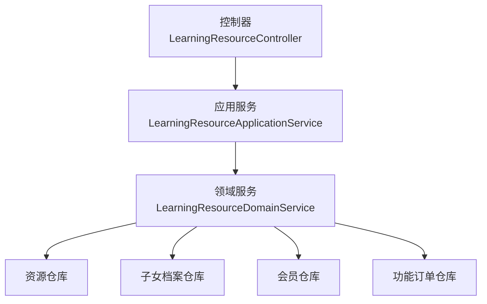
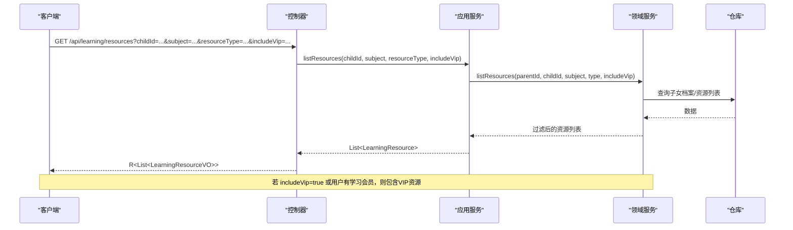
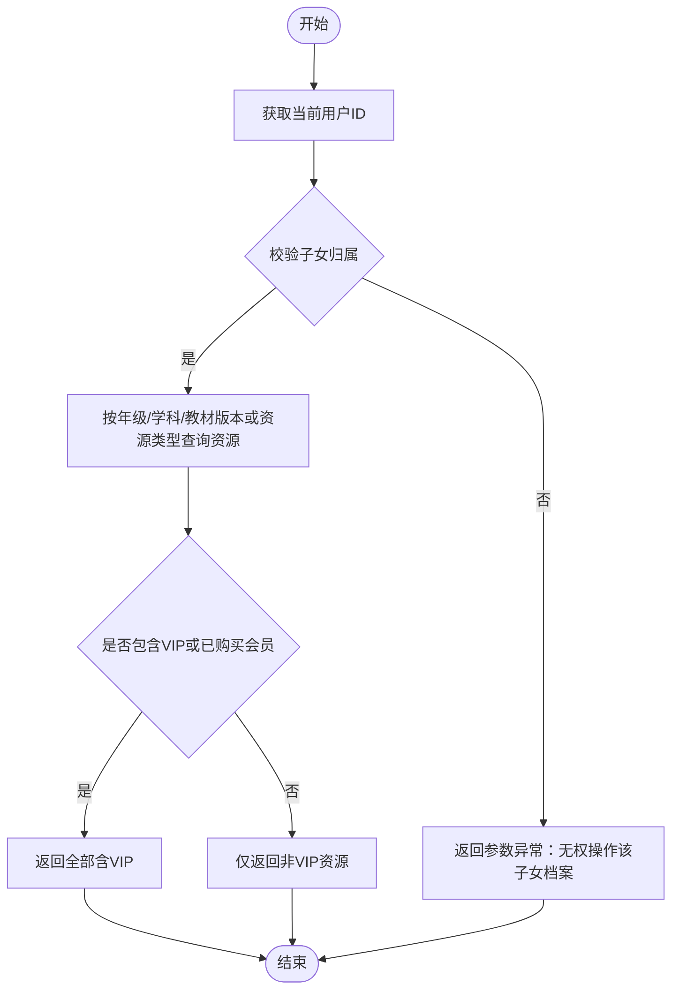
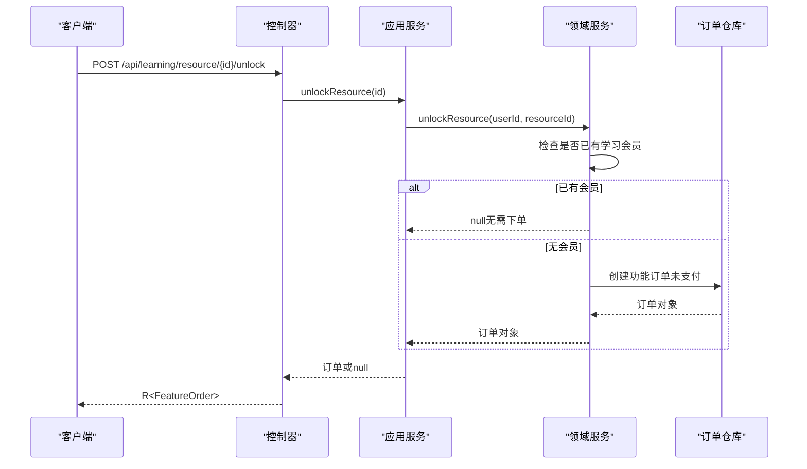
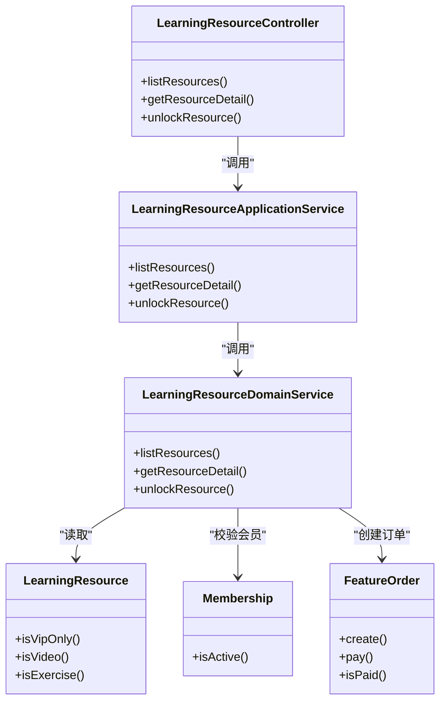

# 学习资源接口

<cite>
**本文引用的文件**
- [LearningResourceController.java](file://wzoto-backend/wzoto-interfaces/src/main/java/com/wzoto/interfaces/controller/LearningResourceController.java)
- [LearningResourceApplicationService.java](file://wzoto-backend/wzoto-application/src/main/java/com/wzoto/application/service/LearningResourceApplicationService.java)
- [LearningResourceDomainService.java](file://wzoto-backend/wzoto-domain/src/main/java/com/wzoto/domain/service/LearningResourceDomainService.java)
- [LearningResourceVO.java](file://wzoto-backend/wzoto-interfaces/src/main/java/com/wzoto/interfaces/vo/learning/LearningResourceVO.java)
- [LearningResource.java](file://wzoto-backend/wzoto-domain/src/main/java/com/wzoto/domain/entity/LearningResource.java)
- [LearningResourceType.java](file://wzoto-backend/wzoto-domain/src/main/java/com/wzoto/domain/valobj/LearningResourceType.java)
- [FeatureOrder.java](file://wzoto-backend/wzoto-domain/src/main/java/com/wzoto/domain/entity/FeatureOrder.java)
- [Membership.java](file://wzoto-backend/wzoto-domain/src/main/java/com/wzoto/domain/entity/Membership.java)
- [UserContext.java](file://wzoto-backend/wzoto-domain/src/main/java/com/wzoto/domain/context/UserContext.java)
- [R.java](file://wzoto-backend/wzoto-interfaces/src/main/java/com/wzoto/interfaces/common/R.java)
- [GlobalExceptionHandler.java](file://wzoto-backend/wzoto-interfaces/src/main/java/com/wzoto/interfaces/common/GlobalExceptionHandler.java)
- [t_learning_resource.sql](file://wzoto-backend/sql/t_learning_resource.sql)
</cite>

## 目录
1. [简介](#简介)
2. [项目结构](#项目结构)
3. [核心组件](#核心组件)
4. [架构总览](#架构总览)
5. [详细组件分析](#详细组件分析)
6. [依赖关系分析](#依赖关系分析)
7. [性能考虑](#性能考虑)
8. [故障排查指南](#故障排查指南)
9. [结论](#结论)
10. [附录：API 参考与示例](#附录api-参考与示例)

## 简介
本文件为“学习资源管理”的完整 API 接口文档，覆盖以下能力：
- 查询学习资源列表：GET /api/learning/resources
- 获取资源详情：GET /api/learning/resource/{id}
- VIP 资源解锁：POST /api/learning/resource/{id}/unlock

重点说明：
- 列表查询参数：childId（儿童ID）、subject（科目）、resourceType（资源类型）、includeVip（是否包含VIP内容）
- 资源详情响应数据结构：LearningResourceVO
- VIP 解锁流程：普通用户与 VIP 用户的访问差异、订单创建逻辑
- 资源类型分类：视频、音频、文档等（以系统枚举为准）
- 权限控制：基于当前登录用户上下文与会员状态进行过滤与校验
- 错误处理：统一异常捕获与返回格式

## 项目结构
学习资源相关代码采用分层架构：
- 接口层（interfaces）：控制器负责路由与入参出参转换
- 应用层（application）：编排领域服务调用
- 领域层（domain）：业务规则、实体与值对象、领域服务
- 基础设施层（infrastructure）：数据持久化（通过仓库接口由领域层使用）

图表来源
- [LearningResourceController.java:27-51](file://wzoto-backend/wzoto-interfaces/src/main/java/com/wzoto/interfaces/controller/LearningResourceController.java#L27-L51)
- [LearningResourceApplicationService.java:24-38](file://wzoto-backend/wzoto-application/src/main/java/com/wzoto/application/service/LearningResourceApplicationService.java#L24-L38)
- [LearningResourceDomainService.java:37-86](file://wzoto-backend/wzoto-domain/src/main/java/com/wzoto/domain/service/LearningResourceDomainService.java#L37-L86)

章节来源
- [LearningResourceController.java:17-51](file://wzoto-backend/wzoto-interfaces/src/main/java/com/wzoto/interfaces/controller/LearningResourceController.java#L17-L51)
- [LearningResourceApplicationService.java:14-38](file://wzoto-backend/wzoto-application/src/main/java/com/wzoto/application/service/LearningResourceApplicationService.java#L14-L38)
- [LearningResourceDomainService.java:21-86](file://wzoto-backend/wzoto-domain/src/main/java/com/wzoto/domain/service/LearningResourceDomainService.java#L21-L86)

## 核心组件
- 控制器：暴露 REST 接口，记录埋点日志，完成 VO 转换
- 应用服务：从上下文取用户信息，转换资源类型枚举，委托领域服务
- 领域服务：权限校验（子女归属）、会员资格判断、资源过滤、解锁订单创建
- 实体与值对象：资源实体、资源类型枚举、会员、功能订单
- 全局异常处理器：统一错误码与消息封装

章节来源
- [LearningResourceController.java:27-77](file://wzoto-backend/wzoto-interfaces/src/main/java/com/wzoto/interfaces/controller/LearningResourceController.java#L27-L77)
- [LearningResourceApplicationService.java:24-38](file://wzoto-backend/wzoto-application/src/main/java/com/wzoto/application/service/LearningResourceApplicationService.java#L24-L38)
- [LearningResourceDomainService.java:37-86](file://wzoto-backend/wzoto-domain/src/main/java/com/wzoto/domain/service/LearningResourceDomainService.java#L37-L86)
- [LearningResourceType.java:9-31](file://wzoto-backend/wzoto-domain/src/main/java/com/wzoto/domain/valobj/LearningResourceType.java#L9-L31)
- [Membership.java:19-79](file://wzoto-backend/wzoto-domain/src/main/java/com/wzoto/domain/entity/Membership.java#L19-L79)
- [FeatureOrder.java:20-83](file://wzoto-backend/wzoto-domain/src/main/java/com/wzoto/domain/entity/FeatureOrder.java#L20-L83)
- [GlobalExceptionHandler.java:18-66](file://wzoto-backend/wzoto-interfaces/src/main/java/com/wzoto/interfaces/common/GlobalExceptionHandler.java#L18-L66)

## 架构总览
请求从控制器进入，应用服务解析参数并调用领域服务。领域服务根据子女档案与会员状态进行资源过滤或解锁处理，最终返回统一结果。

图表来源
- [LearningResourceController.java:27-35](file://wzoto-backend/wzoto-interfaces/src/main/java/com/wzoto/interfaces/controller/LearningResourceController.java#L27-L35)
- [LearningResourceApplicationService.java:24-29](file://wzoto-backend/wzoto-application/src/main/java/com/wzoto/application/service/LearningResourceApplicationService.java#L24-L29)
- [LearningResourceDomainService.java:37-57](file://wzoto-backend/wzoto-domain/src/main/java/com/wzoto/domain/service/LearningResourceDomainService.java#L37-L57)

## 详细组件分析

### 接口一：查询学习资源列表
- 路径：GET /api/learning/resources
- 请求参数
  - childId：必填，儿童ID
  - subject：可选，学科（如 chinese/math/english）
  - resourceType：可选，资源类型编码（VIDEO/EXERCISE/PDF/QUESTION）
  - includeVip：可选，是否包含VIP内容；当为 true 或用户拥有学习会员时，将包含VIP资源
- 行为说明
  - 从用户上下文获取当前父账号ID
  - 校验子女归属权限
  - 按年级、学科、教材版本或资源类型查询资源
  - 根据 includeVip 与会员状态过滤VIP资源
- 响应
  - 统一包装 R<List<LearningResourceVO>>

章节来源
- [LearningResourceController.java:27-35](file://wzoto-backend/wzoto-interfaces/src/main/java/com/wzoto/interfaces/controller/LearningResourceController.java#L27-L35)
- [LearningResourceApplicationService.java:24-29](file://wzoto-backend/wzoto-application/src/main/java/com/wzoto/application/service/LearningResourceApplicationService.java#L24-L29)
- [LearningResourceDomainService.java:37-57](file://wzoto-backend/wzoto-domain/src/main/java/com/wzoto/domain/service/LearningResourceDomainService.java#L37-L57)
- [LearningResourceType.java:9-31](file://wzoto-backend/wzoto-domain/src/main/java/com/wzoto/domain/valobj/LearningResourceType.java#L9-L31)

#### 流程图：资源列表过滤

图表来源
- [LearningResourceDomainService.java:37-57](file://wzoto-backend/wzoto-domain/src/main/java/com/wzoto/domain/service/LearningResourceDomainService.java#L37-L57)
- [Membership.java:54-56](file://wzoto-backend/wzoto-domain/src/main/java/com/wzoto/domain/entity/Membership.java#L54-L56)

### 接口二：获取资源详情
- 路径：GET /api/learning/resource/{id}
- 路径参数
  - id：资源ID
- 行为说明
  - 根据ID查询资源，不存在则抛出参数异常
- 响应
  - 统一包装 R<LearningResourceVO>

章节来源
- [LearningResourceController.java:37-41](file://wzoto-backend/wzoto-interfaces/src/main/java/com/wzoto/interfaces/controller/LearningResourceController.java#L37-L41)
- [LearningResourceDomainService.java:62-68](file://wzoto-backend/wzoto-domain/src/main/java/com/wzoto/domain/service/LearningResourceDomainService.java#L62-L68)

### 接口三：VIP 资源解锁
- 路径：POST /api/learning/resource/{id}/unlock
- 路径参数
  - id：资源ID
- 行为说明
  - 若用户已持有学习会员，无需再次解锁，直接返回成功且无订单
  - 否则创建“课程解锁”功能订单（未支付），返回订单信息
- 响应
  - 统一包装 R<FeatureOrder>（可能为 null 表示无需下单）

章节来源
- [LearningResourceController.java:43-51](file://wzoto-backend/wzoto-interfaces/src/main/java/com/wzoto/interfaces/controller/LearningResourceController.java#L43-L51)
- [LearningResourceApplicationService.java:35-38](file://wzoto-backend/wzoto-application/src/main/java/com/wzoto/application/service/LearningResourceApplicationService.java#L35-L38)
- [LearningResourceDomainService.java:73-86](file://wzoto-backend/wzoto-domain/src/main/java/com/wzoto/domain/service/LearningResourceDomainService.java#L73-L86)
- [FeatureOrder.java:40-50](file://wzoto-backend/wzoto-domain/src/main/java/com/wzoto/domain/entity/FeatureOrder.java#L40-L50)

#### 序列图：VIP 解锁流程

图表来源
- [LearningResourceController.java:43-51](file://wzoto-backend/wzoto-interfaces/src/main/java/com/wzoto/interfaces/controller/LearningResourceController.java#L43-L51)
- [LearningResourceApplicationService.java:35-38](file://wzoto-backend/wzoto-application/src/main/java/com/wzoto/application/service/LearningResourceApplicationService.java#L35-L38)
- [LearningResourceDomainService.java:73-86](file://wzoto-backend/wzoto-domain/src/main/java/com/wzoto/domain/service/LearningResourceDomainService.java#L73-L86)
- [FeatureOrder.java:40-50](file://wzoto-backend/wzoto-domain/src/main/java/com/wzoto/domain/entity/FeatureOrder.java#L40-L50)

### LearningResourceVO 数据结构
- 字段说明（节选关键项）
  - id：资源ID
  - grade/textbookVersion：年级与教材版本编码
  - subject：学科
  - resourceType/resourceTypeDesc：资源类型编码与描述
  - title/description：标题与描述
  - coverUrl/contentUrl/subtitleUrl：封面、内容与字幕URL
  - durationSeconds：时长（秒）
  - knowledgePoint/knowledgeMarkers：知识点与标记
  - tags/sourceType/qualityLevels：标签、来源类型、画质等级
  - status：资源状态
  - vipOnly：是否仅VIP可用
  - lastPositionSeconds/progressPercent/completed：播放进度相关（VO扩展）
  - createdAt：创建时间

章节来源
- [LearningResourceVO.java:10-36](file://wzoto-backend/wzoto-interfaces/src/main/java/com/wzoto/interfaces/vo/learning/LearningResourceVO.java#L10-L36)
- [LearningResource.java:23-87](file://wzoto-backend/wzoto-domain/src/main/java/com/wzoto/domain/entity/LearningResource.java#L23-L87)

### 资源类型分类
- VIDEO：动画微课（视频）
- EXERCISE：互动练习（习题）
- PDF：PDF资料（文档）
- QUESTION：题库题目（问答/题目）

章节来源
- [LearningResourceType.java:9-14](file://wzoto-backend/wzoto-domain/src/main/java/com/wzoto/domain/valobj/LearningResourceType.java#L9-L14)

### 权限控制逻辑
- 列表查询
  - 校验 childId 所属父账号权限
  - 根据 includeVip 与用户是否拥有学习会员决定是否包含VIP资源
- 详情查询
  - 仅校验资源是否存在
- 解锁
  - 若用户已有学习会员，跳过下单
  - 否则创建“课程解锁”功能订单（未支付）

章节来源
- [LearningResourceDomainService.java:37-57](file://wzoto-backend/wzoto-domain/src/main/java/com/wzoto/domain/service/LearningResourceDomainService.java#L37-L57)
- [LearningResourceDomainService.java:73-86](file://wzoto-backend/wzoto-domain/src/main/java/com/wzoto/domain/service/LearningResourceDomainService.java#L73-L86)
- [Membership.java:54-56](file://wzoto-backend/wzoto-domain/src/main/java/com/wzoto/domain/entity/Membership.java#L54-L56)
- [UserContext.java:39-42](file://wzoto-backend/wzoto-domain/src/main/java/com/wzoto/domain/context/UserContext.java#L39-L42)

## 依赖关系分析
- 控制器依赖应用服务
- 应用服务依赖领域服务
- 领域服务依赖多个仓库（资源、子女、会员、订单）
- 值对象与实体贯穿各层

图表来源
- [LearningResourceController.java:27-51](file://wzoto-backend/wzoto-interfaces/src/main/java/com/wzoto/interfaces/controller/LearningResourceController.java#L27-L51)
- [LearningResourceApplicationService.java:24-38](file://wzoto-backend/wzoto-application/src/main/java/com/wzoto/application/service/LearningResourceApplicationService.java#L24-L38)
- [LearningResourceDomainService.java:37-86](file://wzoto-backend/wzoto-domain/src/main/java/com/wzoto/domain/service/LearningResourceDomainService.java#L37-L86)
- [LearningResource.java:135-151](file://wzoto-backend/wzoto-domain/src/main/java/com/wzoto/domain/entity/LearningResource.java#L135-L151)
- [Membership.java:54-56](file://wzoto-backend/wzoto-domain/src/main/java/com/wzoto/domain/entity/Membership.java#L54-L56)
- [FeatureOrder.java:40-73](file://wzoto-backend/wzoto-domain/src/main/java/com/wzoto/domain/entity/FeatureOrder.java#L40-L73)

## 性能考虑
- 列表查询按年级、学科、教材版本或资源类型索引优化（数据库索引见DDL）
- 资源过滤在内存中进行，建议对大数据集分页（当前实现为全量过滤）
- 会员状态与订单查询可结合缓存降低重复计算
- 详情查询为单条主键检索，性能开销低

[本节为通用性能建议，不直接分析具体文件]

## 故障排查指南
- 参数异常（非法参数）
  - 常见原因：无效的资源类型编码、子女归属校验失败、资源不存在
  - 返回码：400，消息来自异常信息
- 业务规则违反
  - 常见原因：重复支付、非法状态变更
  - 返回码：400，自定义业务消息
- 参数绑定/校验失败
  - 常见原因：请求体或参数格式错误
  - 返回码：400，字段级错误拼接
- 运行时异常
  - 常见原因：空指针、外部依赖异常
  - 返回码：500，堆栈日志记录
- 系统异常兜底
  - 返回码：500，固定提示

章节来源
- [GlobalExceptionHandler.java:18-66](file://wzoto-backend/wzoto-interfaces/src/main/java/com/wzoto/interfaces/common/GlobalExceptionHandler.java#L18-L66)
- [R.java:19-41](file://wzoto-backend/wzoto-interfaces/src/main/java/com/wzoto/interfaces/common/R.java#L19-L41)

## 结论
本接口实现了学习资源的查询、详情获取与VIP解锁三大核心能力，并通过领域服务完成权限校验与会员策略控制。统一异常处理与返回结构便于前端集成与问题定位。建议在后续迭代中增加分页、缓存与更细粒度的权限控制以提升可扩展性与性能。

[本节为总结性内容，不直接分析具体文件]

## 附录：API 参考与示例

### 接口一：查询学习资源列表
- 方法：GET
- 路径：/api/learning/resources
- 请求参数
  - childId：Long，必填
  - subject：String，可选
  - resourceType：String，可选（VIDEO/EXERCISE/PDF/QUESTION）
  - includeVip：Boolean，可选
- 响应体：R<List<LearningResourceVO>>
- 示例请求
  - GET /api/learning/resources?childId=123&subject=math&resourceType=VIDEO&includeVip=true
- 示例响应
  - {
      "code": 200,
      "msg": "success",
      "data": [
        {
          "id": 1,
          "grade": "GRADE_5",
          "gradeDesc": "五年级",
          "subject": "math",
          "textbookVersion": "PEP",
          "resourceType": "VIDEO",
          "resourceTypeDesc": "动画微课",
          "title": "分数加减法",
          "coverUrl": "https://...",
          "contentUrl": "https://...",
          "durationSeconds": 600,
          "knowledgePoint": "分数加减",
          "tags": "基础,计算",
          "sourceType": "MP4",
          "subtitleUrl": "https://...",
          "qualityLevels": "['720p','1080p']",
          "knowledgeMarkers": "{}",
          "status": "PUBLISHED",
          "description": "讲解分数加减法的基本概念与运算",
          "vipOnly": false,
          "createdAt": "2024-01-01T10:00:00"
        }
      ]
    }

章节来源
- [LearningResourceController.java:27-35](file://wzoto-backend/wzoto-interfaces/src/main/java/com/wzoto/interfaces/controller/LearningResourceController.java#L27-L35)
- [LearningResourceVO.java:10-36](file://wzoto-backend/wzoto-interfaces/src/main/java/com/wzoto/interfaces/vo/learning/LearningResourceVO.java#L10-L36)
- [LearningResourceType.java:9-14](file://wzoto-backend/wzoto-domain/src/main/java/com/wzoto/domain/valobj/LearningResourceType.java#L9-L14)
- [t_learning_resource.sql:4-35](file://wzoto-backend/sql/t_learning_resource.sql#L4-L35)

### 接口二：获取资源详情
- 方法：GET
- 路径：/api/learning/resource/{id}
- 路径参数
  - id：Long，必填
- 响应体：R<LearningResourceVO>
- 示例请求
  - GET /api/learning/resource/1
- 示例响应
  - {
      "code": 200,
      "msg": "success",
      "data": {
        "id": 1,
        "grade": "GRADE_5",
        "subject": "math",
        "resourceType": "VIDEO",
        "title": "分数加减法",
        "contentUrl": "https://...",
        "vipOnly": false,
        "createdAt": "2024-01-01T10:00:00"
      }
    }

章节来源
- [LearningResourceController.java:37-41](file://wzoto-backend/wzoto-interfaces/src/main/java/com/wzoto/interfaces/controller/LearningResourceController.java#L37-L41)
- [LearningResourceDomainService.java:62-68](file://wzoto-backend/wzoto-domain/src/main/java/com/wzoto/domain/service/LearningResourceDomainService.java#L62-L68)

### 接口三：VIP 资源解锁
- 方法：POST
- 路径：/api/learning/resource/{id}/unlock
- 路径参数
  - id：Long，必填
- 响应体：R<FeatureOrder>（可能为 null）
- 示例请求
  - POST /api/learning/resource/1/unlock
- 示例响应（需下单）
  - {
      "code": 200,
      "msg": "success",
      "data": {
        "id": 1001,
        "userId": 123,
        "featureType": "FULL_COURSE_UNLOCK",
        "targetId": 1,
        "amount": 9.90,
        "paymentStatus": "UNPAID",
        "createdAt": "2024-01-01T10:00:00"
      }
    }
- 示例响应（已有会员，无需下单）
  - {
      "code": 200,
      "msg": "success",
      "data": null
    }

章节来源
- [LearningResourceController.java:43-51](file://wzoto-backend/wzoto-interfaces/src/main/java/com/wzoto/interfaces/controller/LearningResourceController.java#L43-L51)
- [LearningResourceDomainService.java:73-86](file://wzoto-backend/wzoto-domain/src/main/java/com/wzoto/domain/service/LearningResourceDomainService.java#L73-L86)
- [FeatureOrder.java:40-50](file://wzoto-backend/wzoto-domain/src/main/java/com/wzoto/domain/entity/FeatureOrder.java#L40-L50)

### 错误处理与异常场景
- 参数异常：非法参数或资源不存在
  - 返回码：400
  - 示例：{ "code": 400, "msg": "资源不存在", "data": null }
- 业务规则违反：重复支付等
  - 返回码：400
  - 示例：{ "code": 400, "msg": "订单已支付，请勿重复支付", "data": null }
- 参数绑定/校验失败
  - 返回码：400
  - 示例：{ "code": 400, "msg": "字段: 默认消息; 字段: 默认消息", "data": null }
- 运行时异常
  - 返回码：500
  - 示例：{ "code": 500, "msg": "具体异常信息", "data": null }
- 系统异常兜底
  - 返回码：500
  - 示例：{ "code": 500, "msg": "系统异常，请稍后重试", "data": null }

章节来源
- [GlobalExceptionHandler.java:18-66](file://wzoto-backend/wzoto-interfaces/src/main/java/com/wzoto/interfaces/common/GlobalExceptionHandler.java#L18-L66)
- [R.java:19-41](file://wzoto-backend/wzoto-interfaces/src/main/java/com/wzoto/interfaces/common/R.java#L19-L41)