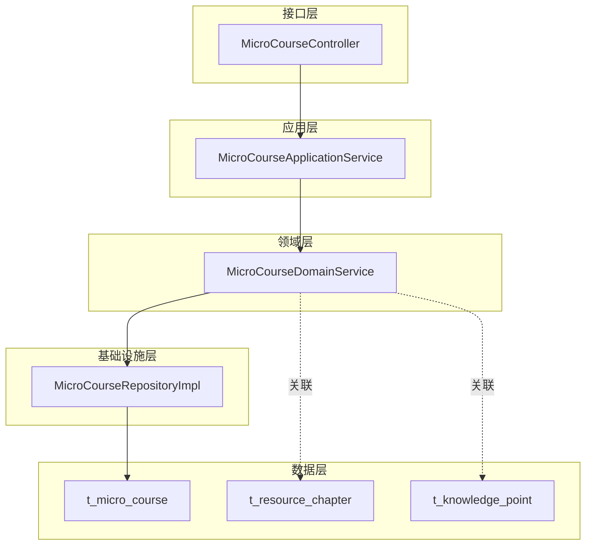
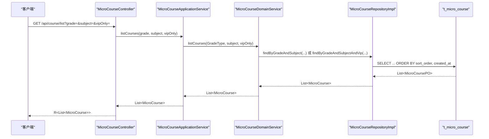
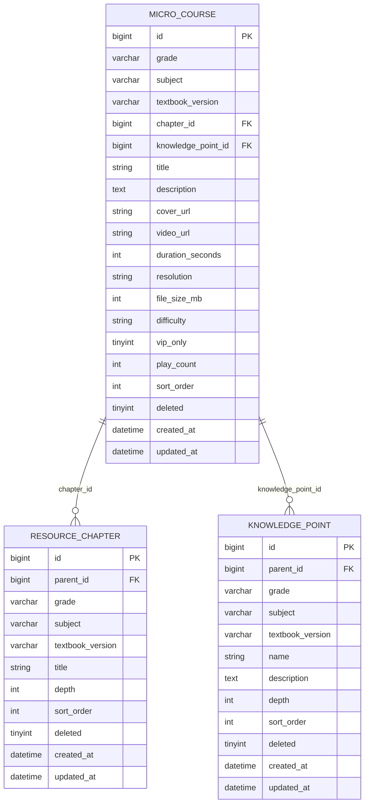
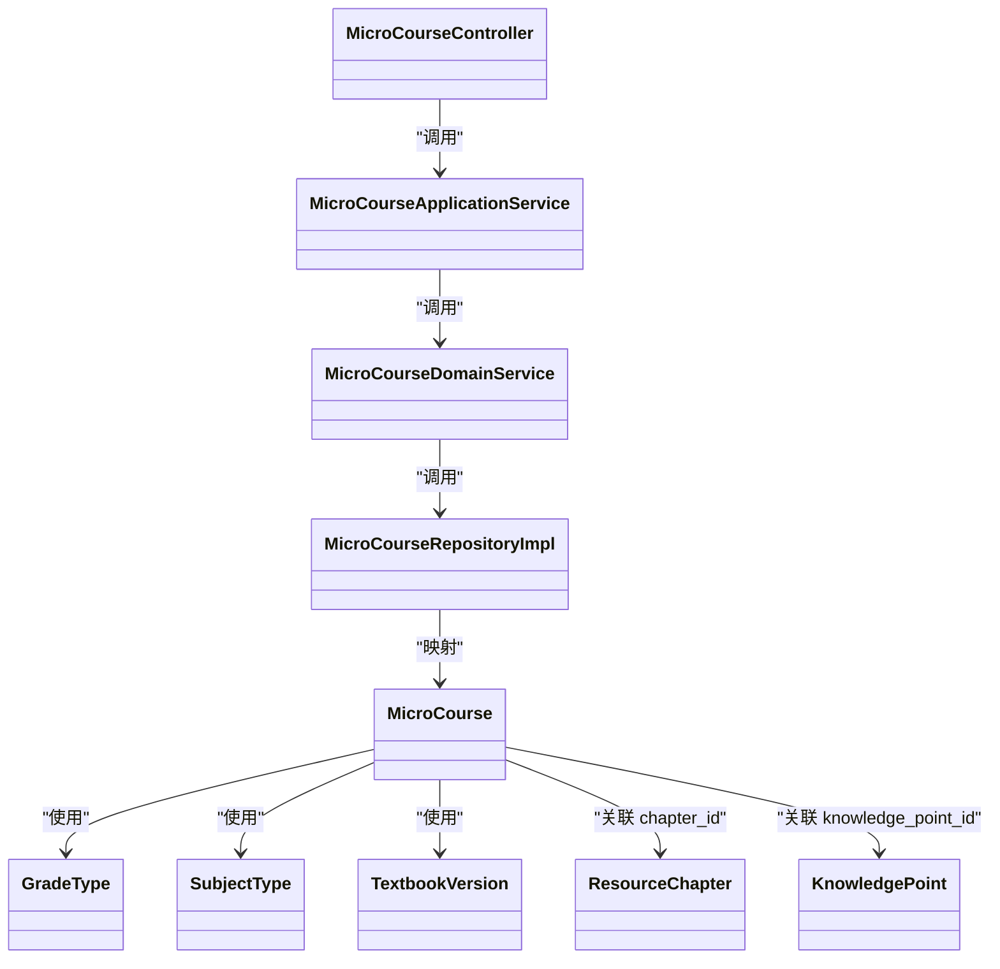

# 微课课程接口

<cite>
**本文引用的文件**
- [MicroCourseController.java](file://wzoto-backend/wzoto-interfaces/src/main/java/com/wzoto/interfaces/controller/MicroCourseController.java)
- [MicroCourseApplicationService.java](file://wzoto-backend/wzoto-application/src/main/java/com/wzoto/application/service/MicroCourseApplicationService.java)
- [MicroCourseDomainService.java](file://wzoto-backend/wzoto-domain/src/main/java/com/wzoto/domain/service/MicroCourseDomainService.java)
- [MicroCourseRepositoryImpl.java](file://wzoto-backend/wzoto-infrastructure/src/main/java/com/wzoto/infrastructure/repository/MicroCourseRepositoryImpl.java)
- [MicroCourse.java](file://wzoto-backend/wzoto-domain/src/main/java/com/wzoto/domain/entity/MicroCourse.java)
- [ResourceChapter.java](file://wzoto-backend/wzoto-domain/src/main/java/com/wzoto/domain/entity/ResourceChapter.java)
- [KnowledgePoint.java](file://wzoto-backend/wzoto-domain/src/main/java/com/wzoto/domain/entity/KnowledgePoint.java)
- [GradeType.java](file://wzoto-backend/wzoto-domain/src/main/java/com/wzoto/domain/valobj/GradeType.java)
- [SubjectType.java](file://wzoto-backend/wzoto-domain/src/main/java/com/wzoto/domain/valobj/SubjectType.java)
- [TextbookVersion.java](file://wzoto-backend/wzoto-domain/src/main/java/com/wzoto/domain/valobj/TextbookVersion.java)
- [t_micro_course.sql](file://wzoto-backend/sql/t_micro_course.sql)
- [t_resource_chapter.sql](file://wzoto-backend/sql/t_resource_chapter.sql)
- [t_knowledge_point.sql](file://wzoto-backend/sql/t_knowledge_point.sql)
- [seed_data_micro_course.sql](file://wzoto-backend/sql/seed_data_micro_course.sql)
</cite>

## 目录
1. [简介](#简介)
2. [项目结构](#项目结构)
3. [核心组件](#核心组件)
4. [架构总览](#架构总览)
5. [详细组件分析](#详细组件分析)
6. [依赖关系分析](#依赖关系分析)
7. [性能考虑](#性能考虑)
8. [故障排查指南](#故障排查指南)
9. [结论](#结论)
10. [附录：API 规范与示例](#附录api-规范与示例)

## 简介
本文件面向“微课课程管理”的完整 API 文档，覆盖课程列表查询、课程详情、观看进度上报、推荐课程等核心能力；并说明课程分类体系（年级、学科、教材版本）、章节与知识点关联、以及状态管理与扩展建议。当前实现以“年级+学科+是否VIP”为筛选维度，支持按排序号与创建时间排序；未提供关键词搜索接口，但已给出可扩展方案。

## 项目结构
后端采用分层架构：接口层（Controller）→ 应用服务（Application Service）→ 领域服务（Domain Service）→ 仓储实现（Repository Impl）→ 数据表。微课相关实体包括 MicroCourse、ResourceChapter、KnowledgePoint，值对象包含 GradeType、SubjectType、TextbookVersion。

图表来源
- [MicroCourseController.java:13-45](file://wzoto-backend/wzoto-interfaces/src/main/java/com/wzoto/interfaces/controller/MicroCourseController.java#L13-L45)
- [MicroCourseApplicationService.java:14-38](file://wzoto-backend/wzoto-application/src/main/java/com/wzoto/application/service/MicroCourseApplicationService.java#L14-L38)
- [MicroCourseDomainService.java:14-69](file://wzoto-backend/wzoto-domain/src/main/java/com/wzoto/domain/service/MicroCourseDomainService.java#L14-L69)
- [MicroCourseRepositoryImpl.java:17-73](file://wzoto-backend/wzoto-infrastructure/src/main/java/com/wzoto/infrastructure/repository/MicroCourseRepositoryImpl.java#L17-L73)
- [t_micro_course.sql:4-31](file://wzoto-backend/sql/t_micro_course.sql#L4-L31)
- [t_resource_chapter.sql:5-20](file://wzoto-backend/sql/t_resource_chapter.sql#L5-L20)
- [t_knowledge_point.sql:5-22](file://wzoto-backend/sql/t_knowledge_point.sql#L5-L22)

章节来源
- [MicroCourseController.java:13-45](file://wzoto-backend/wzoto-interfaces/src/main/java/com/wzoto/interfaces/controller/MicroCourseController.java#L13-L45)
- [MicroCourseApplicationService.java:14-38](file://wzoto-backend/wzoto-application/src/main/java/com/wzoto/application/service/MicroCourseApplicationService.java#L14-L38)
- [MicroCourseDomainService.java:14-69](file://wzoto-backend/wzoto-domain/src/main/java/com/wzoto/domain/service/MicroCourseDomainService.java#L14-L69)
- [MicroCourseRepositoryImpl.java:17-73](file://wzoto-backend/wzoto-infrastructure/src/main/java/com/wzoto/infrastructure/repository/MicroCourseRepositoryImpl.java#L17-L73)

## 核心组件
- 控制器：提供课程列表、详情、进度上报、推荐等 HTTP 端点。
- 应用服务：参数校验与转换（如 grade 字符串转枚举），编排领域服务。
- 领域服务：业务规则（权限校验、播放次数累加、推荐逻辑）。
- 仓储实现：基于 MyBatis-Plus 的条件构造器进行查询与更新。
- 实体与值对象：描述课程、章节、知识点及年级、学科、教材版本等。

章节来源
- [MicroCourseController.java:22-44](file://wzoto-backend/wzoto-interfaces/src/main/java/com/wzoto/interfaces/controller/MicroCourseController.java#L22-L44)
- [MicroCourseApplicationService.java:21-37](file://wzoto-backend/wzoto-application/src/main/java/com/wzoto/application/service/MicroCourseApplicationService.java#L21-L37)
- [MicroCourseDomainService.java:25-68](file://wzoto-backend/wzoto-domain/src/main/java/com/wzoto/domain/service/MicroCourseDomainService.java#L25-L68)
- [MicroCourseRepositoryImpl.java:24-73](file://wzoto-backend/wzoto-infrastructure/src/main/java/com/wzoto/infrastructure/repository/MicroCourseRepositoryImpl.java#L24-L73)
- [MicroCourse.java:16-51](file://wzoto-backend/wzoto-domain/src/main/java/com/wzoto/domain/entity/MicroCourse.java#L16-L51)
- [GradeType.java:8-45](file://wzoto-backend/wzoto-domain/src/main/java/com/wzoto/domain/valobj/GradeType.java#L8-L45)
- [SubjectType.java:8-35](file://wzoto-backend/wzoto-domain/src/main/java/com/wzoto/domain/valobj/SubjectType.java#L8-L35)
- [TextbookVersion.java:8-35](file://wzoto-backend/wzoto-domain/src/main/java/com/wzoto/domain/valobj/TextbookVersion.java#L8-L35)

## 架构总览
下图展示一次“课程列表查询”的调用链路与数据流向。

图表来源
- [MicroCourseController.java:22-27](file://wzoto-backend/wzoto-interfaces/src/main/java/com/wzoto/interfaces/controller/MicroCourseController.java#L22-L27)
- [MicroCourseApplicationService.java:21-24](file://wzoto-backend/wzoto-application/src/main/java/com/wzoto/application/service/MicroCourseApplicationService.java#L21-L24)
- [MicroCourseDomainService.java:25-33](file://wzoto-backend/wzoto-domain/src/main/java/com/wzoto/domain/service/MicroCourseDomainService.java#L25-L33)
- [MicroCourseRepositoryImpl.java:45-53](file://wzoto-backend/wzoto-infrastructure/src/main/java/com/wzoto/infrastructure/repository/MicroCourseRepositoryImpl.java#L45-L53)
- [t_micro_course.sql:4-31](file://wzoto-backend/sql/t_micro_course.sql#L4-L31)

## 详细组件分析

### 课程列表查询接口
- 端点：GET /api/course/list
- 查询参数
  - grade：年级代码，取值见 GradeType（如 GRADE_1~GRADE_6）
  - subject：学科代码，取值见 SubjectType（MATH/CHINESE/ENGLISH）
  - vipOnly：是否仅返回 VIP 资源（true/false）
- 排序与分页
  - 默认排序：先按 sort_order 升序，再按 created_at 降序
  - 当前未提供分页参数；如需分页可在 Controller/Application 层扩展 page/size 参数并在 Repository 层使用分页查询
- 过滤能力
  - 支持按年级、学科、是否 VIP 精确过滤
  - 不支持关键词模糊搜索（可参考“扩展建议”）

章节来源
- [MicroCourseController.java:22-27](file://wzoto-backend/wzoto-interfaces/src/main/java/com/wzoto/interfaces/controller/MicroCourseController.java#L22-L27)
- [MicroCourseApplicationService.java:21-24](file://wzoto-backend/wzoto-application/src/main/java/com/wzoto/application/service/MicroCourseApplicationService.java#L21-L24)
- [MicroCourseDomainService.java:25-33](file://wzoto-backend/wzoto-domain/src/main/java/com/wzoto/domain/service/MicroCourseDomainService.java#L25-L33)
- [MicroCourseRepositoryImpl.java:45-63](file://wzoto-backend/wzoto-infrastructure/src/main/java/com/wzoto/infrastructure/repository/MicroCourseRepositoryImpl.java#L45-L63)
- [GradeType.java:8-45](file://wzoto-backend/wzoto-domain/src/main/java/com/wzoto/domain/valobj/GradeType.java#L8-L45)
- [SubjectType.java:8-35](file://wzoto-backend/wzoto-domain/src/main/java/com/wzoto/domain/valobj/SubjectType.java#L8-L35)

### 课程详情接口
- 端点：GET /api/course/{id}
- 响应主体：MicroCourse 实体字段
  - 基本信息：id、title、description、coverUrl、videoUrl、durationSeconds、resolution、fileSizeMb、difficulty、vipOnly、playCount、sortOrder
  - 分类与关联：grade、subject、textbookVersion、chapterId、knowledgePointId
  - 元数据：deleted、createdAt、updatedAt
- 业务规则
  - 不存在时抛出异常（由领域服务校验）

章节来源
- [MicroCourseController.java:29-32](file://wzoto-backend/wzoto-interfaces/src/main/java/com/wzoto/interfaces/controller/MicroCourseController.java#L29-L32)
- [MicroCourseDomainService.java:35-44](file://wzoto-backend/wzoto-domain/src/main/java/com/wzoto/domain/service/MicroCourseDomainService.java#L35-L44)
- [MicroCourse.java:16-51](file://wzoto-backend/wzoto-domain/src/main/java/com/wzoto/domain/entity/MicroCourse.java#L16-L51)

### 观看进度上报接口
- 端点：POST /api/course/progress?courseId=...
- 行为：将对应课程的播放次数 +1 并持久化
- 日志：记录用户ID与课程ID用于 BI 统计

章节来源
- [MicroCourseController.java:34-38](file://wzoto-backend/wzoto-interfaces/src/main/java/com/wzoto/interfaces/controller/MicroCourseController.java#L34-L38)
- [MicroCourseDomainService.java:46-56](file://wzoto-backend/wzoto-domain/src/main/java/com/wzoto/domain/service/MicroCourseDomainService.java#L46-L56)
- [MicroCourseRepositoryImpl.java:38-43](file://wzoto-backend/wzoto-infrastructure/src/main/java/com/wzoto/infrastructure/repository/MicroCourseRepositoryImpl.java#L38-L43)

### 推荐课程接口
- 端点：GET /api/course/recommend/{childId}?limit=10
- 行为：根据 childId 所属年级，按播放量降序返回推荐课程
- 权限：校验 parent 与 child 归属关系

章节来源
- [MicroCourseController.java:40-44](file://wzoto-backend/wzoto-interfaces/src/main/java/com/wzoto/interfaces/controller/MicroCourseController.java#L40-L44)
- [MicroCourseDomainService.java:58-68](file://wzoto-backend/wzoto-domain/src/main/java/com/wzoto/domain/service/MicroCourseDomainService.java#L58-L68)
- [MicroCourseRepositoryImpl.java:65-73](file://wzoto-backend/wzoto-infrastructure/src/main/java/com/wzoto/infrastructure/repository/MicroCourseRepositoryImpl.java#L65-L73)

### 课程分类体系
- 年级：GradeType（GRADE_1~GRADE_6）
- 学科：SubjectType（MATH/CHINESE/ENGLISH）
- 教材版本：TextbookVersion（RENJIAO、BEISHIDA、JIAOSHE、SUDAJIAO、WAIXIN、SHANGHAJIAO、OTHER）
- 章节树：ResourceChapter（parent_id 自关联，depth 表示层级）
- 知识点树：KnowledgePoint（parent_id 自关联，depth 表示层级，isLeaf 判断叶子节点）

章节来源
- [GradeType.java:8-45](file://wzoto-backend/wzoto-domain/src/main/java/com/wzoto/domain/valobj/GradeType.java#L8-L45)
- [SubjectType.java:8-35](file://wzoto-backend/wzoto-domain/src/main/java/com/wzoto/domain/valobj/SubjectType.java#L8-L35)
- [TextbookVersion.java:8-35](file://wzoto-backend/wzoto-domain/src/main/java/com/wzoto/domain/valobj/TextbookVersion.java#L8-L35)
- [ResourceChapter.java:12-31](file://wzoto-backend/wzoto-domain/src/main/java/com/wzoto/domain/entity/ResourceChapter.java#L12-L31)
- [KnowledgePoint.java:12-38](file://wzoto-backend/wzoto-domain/src/main/java/com/wzoto/domain/entity/KnowledgePoint.java#L12-L38)
- [t_resource_chapter.sql:5-20](file://wzoto-backend/sql/t_resource_chapter.sql#L5-L20)
- [t_knowledge_point.sql:5-22](file://wzoto-backend/sql/t_knowledge_point.sql#L5-L22)

### 课程与知识点/章节关联
- 课程通过 chapterId 与 ResourceChapter 关联
- 课程通过 knowledgePointId 与 KnowledgePoint 关联
- 章节与知识点均为树形结构，便于组织知识体系与导航

图表来源
- [t_micro_course.sql:4-31](file://wzoto-backend/sql/t_micro_course.sql#L4-L31)
- [t_resource_chapter.sql:5-20](file://wzoto-backend/sql/t_resource_chapter.sql#L5-L20)
- [t_knowledge_point.sql:5-22](file://wzoto-backend/sql/t_knowledge_point.sql#L5-L22)

### 课程状态管理
- 当前模型中无显式“发布/下架”状态字段，仅有 deleted 软删除标记
- 建议扩展：在 t_micro_course 增加 status 字段（如 DRAFT/PUBLISHED/OFF_SHELF），并在应用/领域层实现状态机与权限控制
- 若需对外暴露状态，可在 VO 层映射并做显示控制

[本节为通用设计建议，不直接分析具体文件]

### 课程搜索功能（扩展建议）
- 当前未提供关键词搜索接口
- 建议方案
  - 在 Controller 新增 search 接口，接收 keyword 参数
  - 在 Repository 层对 title/description 使用 LIKE 模糊匹配
  - 结合年级、学科、教材版本等多条件组合查询
  - 注意索引与性能：可对 title/description 建立全文索引或使用搜索引擎

[本节为通用设计建议，不直接分析具体文件]

## 依赖关系分析
- 控制器依赖应用服务；应用服务依赖领域服务；领域服务依赖仓储；仓储依赖数据库表
- 值对象被多处复用，保证枚举一致性
- 章节与知识点通过 ID 与课程关联，形成多对一关系

图表来源
- [MicroCourseController.java:13-45](file://wzoto-backend/wzoto-interfaces/src/main/java/com/wzoto/interfaces/controller/MicroCourseController.java#L13-L45)
- [MicroCourseApplicationService.java:14-38](file://wzoto-backend/wzoto-application/src/main/java/com/wzoto/application/service/MicroCourseApplicationService.java#L14-L38)
- [MicroCourseDomainService.java:14-69](file://wzoto-backend/wzoto-domain/src/main/java/com/wzoto/domain/service/MicroCourseDomainService.java#L14-L69)
- [MicroCourseRepositoryImpl.java:17-125](file://wzoto-backend/wzoto-infrastructure/src/main/java/com/wzoto/infrastructure/repository/MicroCourseRepositoryImpl.java#L17-L125)
- [MicroCourse.java:16-51](file://wzoto-backend/wzoto-domain/src/main/java/com/wzoto/domain/entity/MicroCourse.java#L16-L51)
- [ResourceChapter.java:12-31](file://wzoto-backend/wzoto-domain/src/main/java/com/wzoto/domain/entity/ResourceChapter.java#L12-L31)
- [KnowledgePoint.java:12-38](file://wzoto-backend/wzoto-domain/src/main/java/com/wzoto/domain/entity/KnowledgePoint.java#L12-L38)
- [GradeType.java:8-45](file://wzoto-backend/wzoto-domain/src/main/java/com/wzoto/domain/valobj/GradeType.java#L8-L45)
- [SubjectType.java:8-35](file://wzoto-backend/wzoto-domain/src/main/java/com/wzoto/domain/valobj/SubjectType.java#L8-L35)
- [TextbookVersion.java:8-35](file://wzoto-backend/wzoto-domain/src/main/java/com/wzoto/domain/valobj/TextbookVersion.java#L8-L35)

## 性能考虑
- 查询优化
  - 列表查询已按 sort_order、created_at 排序，建议在 grade+subject 上保持复合索引（DDL 已有 idx_grade_subject）
  - 推荐查询按 play_count 降序，必要时可增加索引或异步统计
- 大数据量
  - 建议引入分页参数（page、size）避免一次性返回过多数据
- 缓存
  - 对热门课程详情、推荐结果可引入缓存（如 Redis）降低数据库压力
- 视频资源
  - 大文件传输建议使用 CDN 与分片下载，减少服务器带宽占用

[本节为通用指导，不直接分析具体文件]

## 故障排查指南
- 课程不存在
  - 现象：获取详情时报错
  - 原因：领域服务在找不到课程时抛出异常
  - 处理：检查传入 id 是否正确，确认数据是否存在
- 无效年级/学科/教材版本
  - 现象：参数转换失败抛出异常
  - 原因：传入值不在枚举范围内
  - 处理：使用合法枚举值（参考值对象定义）
- 权限错误
  - 现象：推荐接口报无权操作
  - 原因：parent 与 child 归属校验失败
  - 处理：确保 childId 属于当前父账号

章节来源
- [MicroCourseDomainService.java:35-44](file://wzoto-backend/wzoto-domain/src/main/java/com/wzoto/domain/service/MicroCourseDomainService.java#L35-L44)
- [MicroCourseDomainService.java:46-56](file://wzoto-backend/wzoto-domain/src/main/java/com/wzoto/domain/service/MicroCourseDomainService.java#L46-L56)
- [MicroCourseDomainService.java:58-68](file://wzoto-backend/wzoto-domain/src/main/java/com/wzoto/domain/service/MicroCourseDomainService.java#L58-L68)
- [GradeType.java:28-45](file://wzoto-backend/wzoto-domain/src/main/java/com/wzoto/domain/valobj/GradeType.java#L28-L45)
- [SubjectType.java:27-35](file://wzoto-backend/wzoto-domain/src/main/java/com/wzoto/domain/valobj/SubjectType.java#L27-L35)
- [TextbookVersion.java:27-35](file://wzoto-backend/wzoto-domain/src/main/java/com/wzoto/domain/valobj/TextbookVersion.java#L27-L35)

## 结论
当前微课课程 API 已具备基础的列表查询、详情获取、进度上报与推荐能力，分类体系完善（年级、学科、教材版本），章节与知识点通过 ID 关联。后续可按需扩展关键词搜索、分页、状态机等能力，以提升用户体验与系统可维护性。

## 附录：API 规范与示例

### 接口清单
- 课程列表
  - 方法：GET
  - 路径：/api/course/list
  - 参数：grade（可选）、subject（可选）、vipOnly（可选）
  - 返回：R<List<MicroCourse>>
- 课程详情
  - 方法：GET
  - 路径：/api/course/{id}
  - 返回：R<MicroCourse>
- 观看进度上报
  - 方法：POST
  - 路径：/api/course/progress
  - 参数：courseId
  - 返回：R<MicroCourse>
- 推荐课程
  - 方法：GET
  - 路径：/api/course/recommend/{childId}
  - 参数：limit（默认10）
  - 返回：R<List<MicroCourse>>

### 请求示例
- 课程列表（一年级数学，仅VIP）
  - GET /api/course/list?grade=GRADE_1&subject=MATH&vipOnly=true
- 课程详情
  - GET /api/course/123
- 上报进度
  - POST /api/course/progress?courseId=123
- 推荐课程
  - GET /api/course/recommend/456?limit=10

### 响应数据结构（MicroCourse）
- 字段说明
  - id：课程ID
  - grade：年级（枚举编码）
  - subject：学科（枚举编码）
  - textbookVersion：教材版本（枚举编码）
  - chapterId：章节ID
  - knowledgePointId：知识点ID
  - title：标题
  - description：简介
  - coverUrl：封面图URL
  - videoUrl：视频URL
  - durationSeconds：时长（秒）
  - resolution：分辨率
  - fileSizeMb：文件大小（MB）
  - difficulty：难度（枚举编码）
  - vipOnly：是否仅会员
  - playCount：播放次数
  - sortOrder：排序号
  - deleted：是否删除
  - createdAt：创建时间
  - updatedAt：更新时间

章节来源
- [MicroCourseController.java:22-44](file://wzoto-backend/wzoto-interfaces/src/main/java/com/wzoto/interfaces/controller/MicroCourseController.java#L22-L44)
- [MicroCourse.java:16-51](file://wzoto-backend/wzoto-domain/src/main/java/com/wzoto/domain/entity/MicroCourse.java#L16-L51)
- [GradeType.java:8-45](file://wzoto-backend/wzoto-domain/src/main/java/com/wzoto/domain/valobj/GradeType.java#L8-L45)
- [SubjectType.java:8-35](file://wzoto-backend/wzoto-domain/src/main/java/com/wzoto/domain/valobj/SubjectType.java#L8-L35)
- [TextbookVersion.java:8-35](file://wzoto-backend/wzoto-domain/src/main/java/com/wzoto/domain/valobj/TextbookVersion.java#L8-L35)

### 数据模型与索引
- 表：t_micro_course
  - 关键字段：grade、subject、textbook_version、chapter_id、knowledge_point_id、vip_only、difficulty、sort_order、play_count
  - 索引：idx_grade_subject、idx_textbook_version、idx_chapter_id、idx_knowledge_point_id、idx_vip_only、idx_difficulty
- 表：t_resource_chapter
  - 关键字段：parent_id、grade、subject、textbook_version、title、depth、sort_order
- 表：t_knowledge_point
  - 关键字段：parent_id、grade、subject、textbook_version、name、depth、sort_order

章节来源
- [t_micro_course.sql:4-31](file://wzoto-backend/sql/t_micro_course.sql#L4-L31)
- [t_resource_chapter.sql:5-20](file://wzoto-backend/sql/t_resource_chapter.sql#L5-L20)
- [t_knowledge_point.sql:5-22](file://wzoto-backend/sql/t_knowledge_point.sql#L5-L22)

### 种子数据
- 提供了各年级、学科的微课样例数据，便于联调与演示

章节来源
- [seed_data_micro_course.sql:1-156](file://wzoto-backend/sql/seed_data_micro_course.sql#L1-L156)