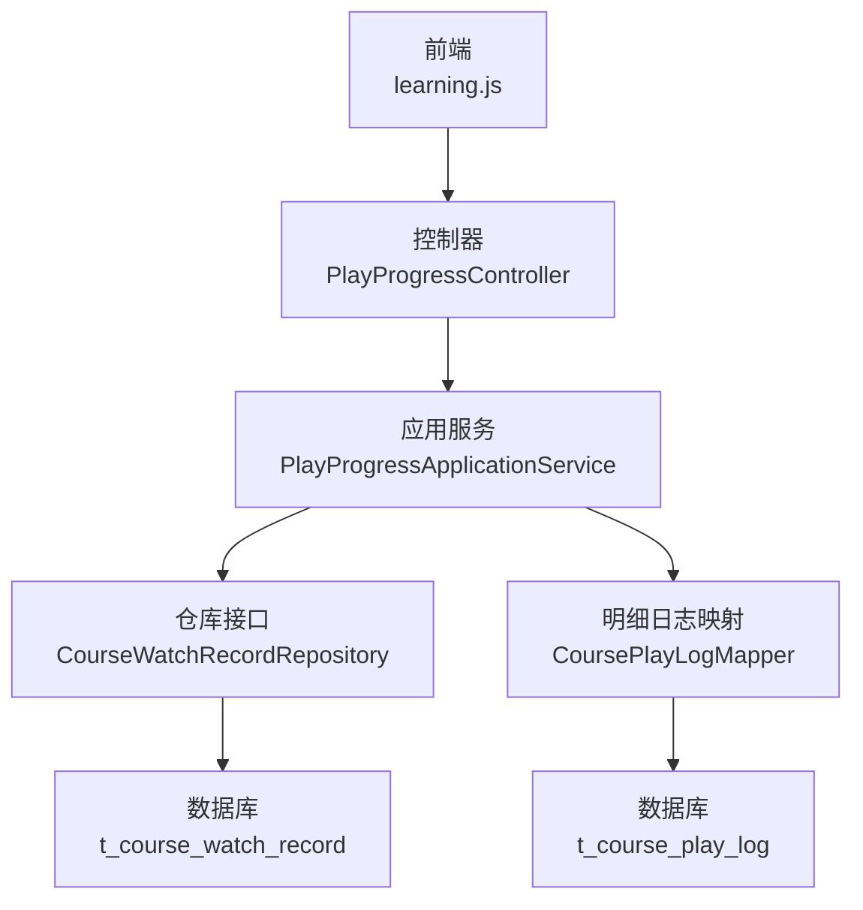
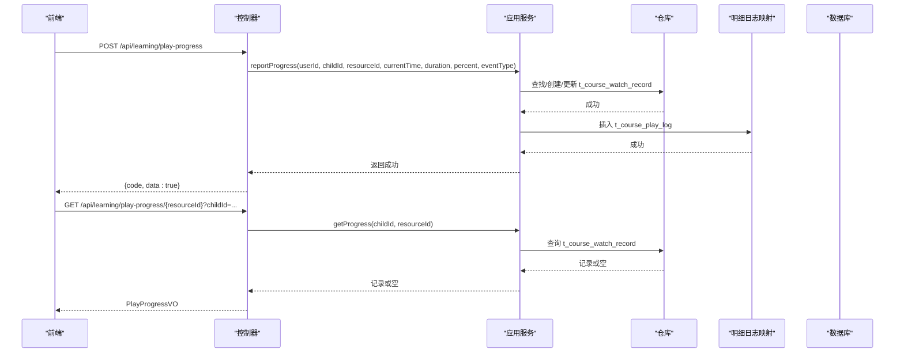
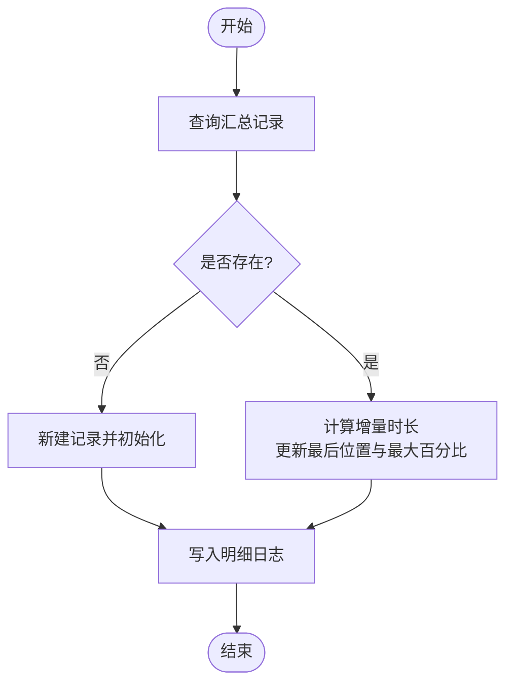
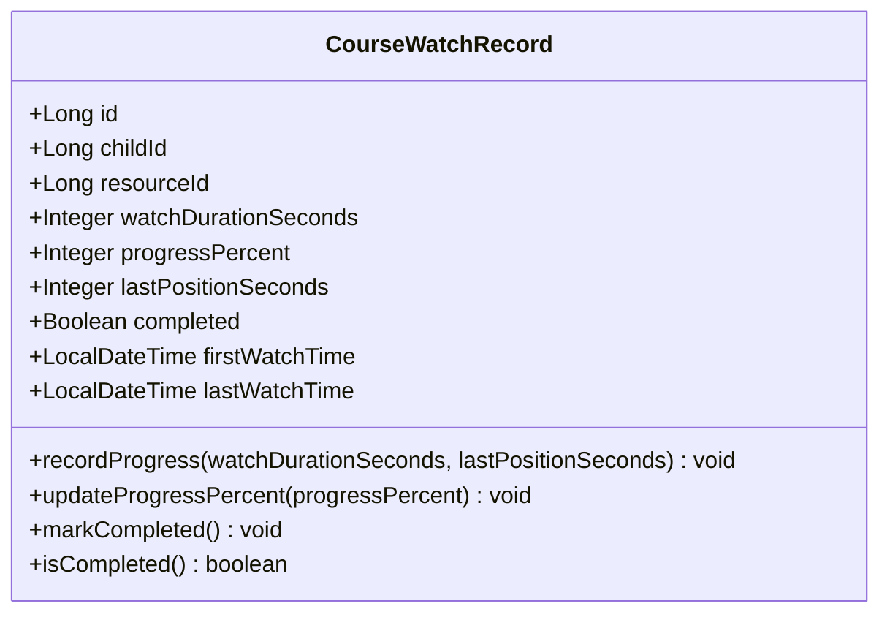
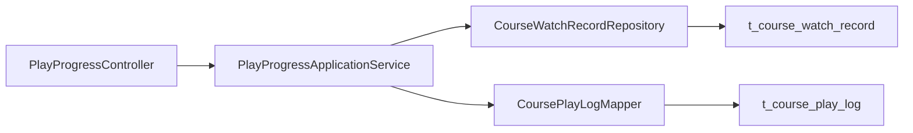

# 播放进度接口

<cite>
**本文引用的文件**
- [PlayProgressController.java](file://wzoto-backend/wzoto-interfaces/src/main/java/com/wzoto/interfaces/controller/PlayProgressController.java)
- [PlayProgressApplicationService.java](file://wzoto-backend/wzoto-application/src/main/java/com/wzoto/application/service/PlayProgressApplicationService.java)
- [CourseWatchRecord.java](file://wzoto-backend/wzoto-domain/src/main/java/com/wzoto/domain/entity/CourseWatchRecord.java)
- [CoursePlayLogPO.java](file://wzoto-backend/wzoto-infrastructure/src/main/java/com/wzoto/infrastructure/pojo/CoursePlayLogPO.java)
- [PlayProgressVO.java](file://wzoto-backend/wzoto-interfaces/src/main/java/com/wzoto/interfaces/vo/learning/PlayProgressVO.java)
- [LearningReportController.java](file://wzoto-backend/wzoto-interfaces/src/main/java/com/wzoto/interfaces/controller/LearningReportController.java)
- [learning.js](file://wzoto-frontend/src/api/learning.js)
</cite>

## 目录
1. [简介](#简介)
2. [项目结构](#项目结构)
3. [核心组件](#核心组件)
4. [架构总览](#架构总览)
5. [详细组件分析](#详细组件分析)
6. [依赖关系分析](#依赖关系分析)
7. [性能与持久化策略](#性能与持久化策略)
8. [数据准确性与防作弊](#数据准确性与防作弊)
9. [API 参考](#api-参考)
10. [故障排查指南](#故障排查指南)
11. [结论](#结论)

## 简介
本文件面向“播放进度跟踪”的完整 API 文档，覆盖学习进度的上报、查询、统计等核心能力。重点说明：
- 进度上报接口的参数与语义（资源ID、播放位置、总时长、百分比、事件类型）
- 进度查询接口的响应字段（断点续播所需信息）
- 多设备同步与断点续播的实现思路
- 学习统计能力（观看时长、完成率、趋势）
- 进度数据的持久化策略（汇总+明细）与准确性保障（边界校验、异常处理）
- 常用调用示例（批量上报、进度查询、统计分析）

## 项目结构
播放进度相关功能在后端采用分层架构：
- 接口层：控制器暴露 REST 接口
- 应用层：编排业务逻辑（更新汇总记录、写入明细日志）
- 领域层：实体定义与业务规则（观看记录、完成判定）
- 基础设施层：持久化对象与映射（明细日志 PO、Mapper）

图表来源
- [PlayProgressController.java:18-67](file://wzoto-backend/wzoto-interfaces/src/main/java/com/wzoto/interfaces/controller/PlayProgressController.java#L18-L67)
- [PlayProgressApplicationService.java:24-74](file://wzoto-backend/wzoto-application/src/main/java/com/wzoto/application/service/PlayProgressApplicationService.java#L24-L74)
- [CoursePlayLogPO.java:12-47](file://wzoto-backend/wzoto-infrastructure/src/main/java/com/wzoto/infrastructure/pojo/CoursePlayLogPO.java#L12-L47)

章节来源
- [PlayProgressController.java:18-67](file://wzoto-backend/wzoto-interfaces/src/main/java/com/wzoto/interfaces/controller/PlayProgressController.java#L18-L67)
- [PlayProgressApplicationService.java:24-74](file://wzoto-backend/wzoto-application/src/main/java/com/wzoto/application/service/PlayProgressApplicationService.java#L24-L74)
- [CoursePlayLogPO.java:12-47](file://wzoto-backend/wzoto-infrastructure/src/main/java/com/wzoto/infrastructure/pojo/CoursePlayLogPO.java#L12-L47)

## 核心组件
- 播放进度控制器：提供上报与查询两个接口
- 播放进度应用服务：负责汇总记录更新与明细日志写入
- 课程观看记录实体：定义观看时长、进度百分比、完成状态等业务规则
- 播放明细日志 PO：用于记录每次上报的明细数据
- 播放进度 VO：返回给前端的断点续播信息

章节来源
- [PlayProgressController.java:18-67](file://wzoto-backend/wzoto-interfaces/src/main/java/com/wzoto/interfaces/controller/PlayProgressController.java#L18-L67)
- [PlayProgressApplicationService.java:24-74](file://wzoto-backend/wzoto-application/src/main/java/com/wzoto/application/service/PlayProgressApplicationService.java#L24-L74)
- [CourseWatchRecord.java:14-119](file://wzoto-backend/wzoto-domain/src/main/java/com/wzoto/domain/entity/CourseWatchRecord.java#L14-L119)
- [CoursePlayLogPO.java:12-47](file://wzoto-backend/wzoto-infrastructure/src/main/java/com/wzoto/infrastructure/pojo/CoursePlayLogPO.java#L12-L47)
- [PlayProgressVO.java:9-27](file://wzoto-backend/wzoto-interfaces/src/main/java/com/wzoto/interfaces/vo/learning/PlayProgressVO.java#L9-L27)

## 架构总览
播放进度的核心流程包括：
- 上报：前端按固定频率上报当前播放位置、总时长、百分比与事件类型；后端更新汇总记录并写入明细日志
- 查询：根据资源ID与子女ID获取断点续播信息
- 统计：通过学情报告接口聚合观看时长、完成率等指标

图表来源
- [PlayProgressController.java:28-67](file://wzoto-backend/wzoto-interfaces/src/main/java/com/wzoto/interfaces/controller/PlayProgressController.java#L28-L67)
- [PlayProgressApplicationService.java:32-74](file://wzoto-backend/wzoto-application/src/main/java/com/wzoto/application/service/PlayProgressApplicationService.java#L32-L74)

## 详细组件分析

### 播放进度控制器
- 上报接口：POST /api/learning/play-progress
  - 请求体字段：childId、resourceId、currentTime、duration、percent、eventType（可选，默认 HEARTBEAT）
  - 行为：解析参数后调用应用服务进行汇总更新与明细写入
- 查询接口：GET /api/learning/play-progress/{resourceId}?childId=...
  - 响应：若存在记录则返回上次位置、进度百分比、是否完成、累计观看时长；否则返回初始值

章节来源
- [PlayProgressController.java:28-67](file://wzoto-backend/wzoto-interfaces/src/main/java/com/wzoto/interfaces/controller/PlayProgressController.java#L28-L67)

### 播放进度应用服务
- 上报流程
  - 先查汇总记录：不存在则新建并初始化；存在则计算增量时长、更新最后位置与最大进度百分比
  - 再写明细日志：包含用户、子女、资源、会话、时间、时长、百分比、事件类型等
- 查询流程
  - 直接读取汇总记录并返回

图表来源
- [PlayProgressApplicationService.java:32-66](file://wzoto-backend/wzoto-application/src/main/java/com/wzoto/application/service/PlayProgressApplicationService.java#L32-L66)

章节来源
- [PlayProgressApplicationService.java:32-74](file://wzoto-backend/wzoto-application/src/main/java/com/wzoto/application/service/PlayProgressApplicationService.java#L32-L74)

### 领域实体：课程观看记录
- 关键属性：观看时长、进度百分比、最后位置、完成状态、首次/最后观看时间
- 业务规则：
  - 观看时长与位置不能为负数
  - 进度百分比范围 0-100
  - 达到 90% 视为完成

图表来源
- [CourseWatchRecord.java:14-119](file://wzoto-backend/wzoto-domain/src/main/java/com/wzoto/domain/entity/CourseWatchRecord.java#L14-L119)

章节来源
- [CourseWatchRecord.java:14-119](file://wzoto-backend/wzoto-domain/src/main/java/com/wzoto/domain/entity/CourseWatchRecord.java#L14-L119)

### 播放明细日志 PO
- 用途：记录每次上报的明细，便于后续分析与审计
- 关键字段：用户ID、子女ID、资源ID、会话ID、当前时间、总时长、百分比、事件类型、创建时间

章节来源
- [CoursePlayLogPO.java:12-47](file://wzoto-backend/wzoto-infrastructure/src/main/java/com/wzoto/infrastructure/pojo/CoursePlayLogPO.java#L12-L47)

### 播放进度 VO
- 返回字段：资源ID、上次播放位置（秒）、进度百分比、是否已完成、累计观看时长（秒）

章节来源
- [PlayProgressVO.java:9-27](file://wzoto-backend/wzoto-interfaces/src/main/java/com/wzoto/interfaces/vo/learning/PlayProgressVO.java#L9-L27)

### 学习统计接口
- 概览与日报：GET /api/learning/report/{childId}
- 日报：GET /api/learning/report/{childId}/daily?date=...
- 周报：GET /api/learning/report/{childId}/weekly?weekStart=...
- 月报：GET /api/learning/report/{childId}/monthly?year=...&month=...
- 薄弱点：GET /api/learning/report/{childId}/weak-points?subject=...&topN=...
- 错题导出：GET /api/learning/report/{childId}/wrong-questions/export?subject=...

章节来源
- [LearningReportController.java:31-82](file://wzoto-backend/wzoto-interfaces/src/main/java/com/wzoto/interfaces/controller/LearningReportController.java#L31-L82)

## 依赖关系分析
- 控制器依赖应用服务
- 应用服务依赖仓库与明细日志映射
- 领域实体承载业务规则
- 基础设施 PO 与 Mapper 对接数据库

图表来源
- [PlayProgressController.java:18-67](file://wzoto-backend/wzoto-interfaces/src/main/java/com/wzoto/interfaces/controller/PlayProgressController.java#L18-L67)
- [PlayProgressApplicationService.java:24-74](file://wzoto-backend/wzoto-application/src/main/java/com/wzoto/application/service/PlayProgressApplicationService.java#L24-L74)

章节来源
- [PlayProgressController.java:18-67](file://wzoto-backend/wzoto-interfaces/src/main/java/com/wzoto/interfaces/controller/PlayProgressController.java#L18-L67)
- [PlayProgressApplicationService.java:24-74](file://wzoto-backend/wzoto-application/src/main/java/com/wzoto/application/service/PlayProgressApplicationService.java#L24-L74)

## 性能与持久化策略
- 双表设计
  - 汇总表（t_course_watch_record）：快速查询断点续播与整体进度
  - 明细表（t_course_play_log）：支撑回放分析、去重、异常检测
- 上报频率建议
  - 每 5 秒上报一次心跳，避免频繁写库造成压力
- 批量上报方案
  - 前端可合并多次上报为批次，服务端可扩展批量接收接口（当前实现为逐条上报）
- 去重与幂等
  - 基于 sessionId 与 currentTime 做简单去重，防止重复上报导致时长虚增
- 缓存与异步
  - 可在应用层引入本地缓存减少热点键竞争；对明细日志可异步落库提升吞吐

[本节为通用指导，不直接分析具体文件]

## 数据准确性与防作弊
- 输入校验
  - 观看时长与位置非负；进度百分比在 0-100
- 完成判定
  - 进度达到 90% 即标记完成，避免仅凭最后一次上报决定完成状态
- 异常处理
  - 非法参数抛出异常，由全局异常处理器统一返回错误码
- 异常数据处理
  - 对明显跳变（如 currentTime 远大于 duration）进行过滤或修正
- 多设备同步
  - 以 childId + resourceId 为维度维护唯一汇总记录，天然支持多设备合并
  - 使用 sessionId 区分单次播放会话，便于跨设备识别不同会话

章节来源
- [CourseWatchRecord.java:79-119](file://wzoto-backend/wzoto-domain/src/main/java/com/wzoto/domain/entity/CourseWatchRecord.java#L79-L119)
- [PlayProgressApplicationService.java:32-66](file://wzoto-backend/wzoto-application/src/main/java/com/wzoto/application/service/PlayProgressApplicationService.java#L32-L66)

## API 参考

### 上报播放进度
- 方法：POST
- 路径：/api/learning/play-progress
- 请求体字段
  - childId: 子女ID（必填）
  - resourceId: 资源ID（必填）
  - currentTime: 当前播放位置（秒，必填）
  - duration: 视频总时长（秒，必填）
  - percent: 播放进度百分比（0-100，必填）
  - eventType: 事件类型（可选，默认 HEARTBEAT）
- 响应
  - code/data: 布尔值表示成功

章节来源
- [PlayProgressController.java:28-43](file://wzoto-backend/wzoto-interfaces/src/main/java/com/wzoto/interfaces/controller/PlayProgressController.java#L28-L43)

### 查询播放进度（断点续播）
- 方法：GET
- 路径：/api/learning/play-progress/{resourceId}
- 查询参数
  - childId: 子女ID（必填）
- 响应字段
  - resourceId: 资源ID
  - lastPositionSeconds: 上次播放位置（秒）
  - progressPercent: 进度百分比
  - completed: 是否已完成
  - watchDurationSeconds: 累计观看时长（秒）

章节来源
- [PlayProgressController.java:48-67](file://wzoto-backend/wzoto-interfaces/src/main/java/com/wzoto/interfaces/controller/PlayProgressController.java#L48-L67)
- [PlayProgressVO.java:9-27](file://wzoto-backend/wzoto-interfaces/src/main/java/com/wzoto/interfaces/vo/learning/PlayProgressVO.java#L9-L27)

### 学习统计接口
- 概览：GET /api/learning/report/{childId}
- 日报：GET /api/learning/report/{childId}/daily?date=YYYY-MM-DD
- 周报：GET /api/learning/report/{childId}/weekly?weekStart=YYYY-MM-DD
- 月报：GET /api/learning/report/{childId}/monthly?year=YYYY&month=MM
- 薄弱点：GET /api/learning/report/{childId}/weak-points?subject=科目&topN=数量
- 错题导出：GET /api/learning/report/{childId}/wrong-questions/export?subject=科目

章节来源
- [LearningReportController.java:31-82](file://wzoto-backend/wzoto-interfaces/src/main/java/com/wzoto/interfaces/controller/LearningReportController.java#L31-L82)

### 前端调用示例
- 上报进度
  - 函数：reportPlayProgress(data)
  - 路径：/learning/play-progress
- 查询进度
  - 函数：getPlayProgress(resourceId, childId)
  - 路径：/learning/play-progress/{resourceId}?childId=...
- 统计接口
  - 概览：getLearningReportOverview(childId)
  - 日报：getDailyReport(childId, date)
  - 周报：getWeeklyReport(childId, weekStart)
  - 月报：getMonthlyReport(childId, year, month)
  - 薄弱点：getWeakPoints(childId, subject, topN)
  - 错题导出：exportWrongQuestions(childId, subject)

章节来源
- [learning.js:109-117](file://wzoto-frontend/src/api/learning.js#L109-L117)
- [learning.js:28-61](file://wzoto-frontend/src/api/learning.js#L28-L61)

## 故障排查指南
- 常见问题
  - 上报无响应：检查网络与鉴权；确认 childId/resourceId 有效
  - 进度不更新：确认 currentTime 递增且不超过 duration；percent 在 0-100
  - 完成状态异常：检查是否达到 90% 阈值；确认未出现负数或越界
- 定位手段
  - 查看明细日志表 t_course_play_log，核对 sessionId、currentTime、percent、eventType
  - 核对汇总表 t_course_watch_record 的 watchDurationSeconds、progressPercent、completed
- 日志与监控
  - 关注控制器与应用服务的日志输出，定位异常堆栈与入参

章节来源
- [PlayProgressController.java:38-42](file://wzoto-backend/wzoto-interfaces/src/main/java/com/wzoto/interfaces/controller/PlayProgressController.java#L38-L42)
- [PlayProgressApplicationService.java:52-66](file://wzoto-backend/wzoto-application/src/main/java/com/wzoto/application/service/PlayProgressApplicationService.java#L52-L66)

## 结论
本系统通过“汇总+明细”的双表设计与严格的领域规则，实现了稳定可靠的播放进度跟踪能力。上报接口支持高频心跳，查询接口提供断点续播所需信息，统计接口覆盖日/周/月维度的学习分析。结合合理的上报频率、去重与异常处理机制，能够在多设备场景下保证数据一致性与准确性。