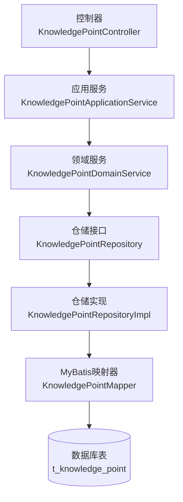
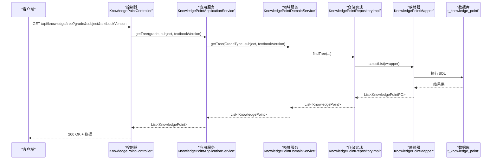
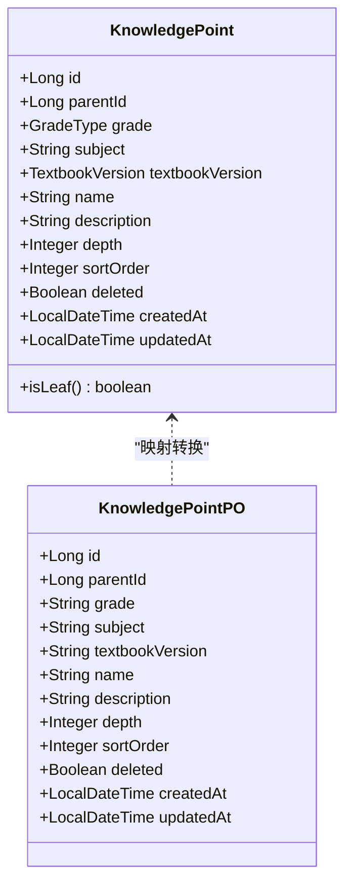
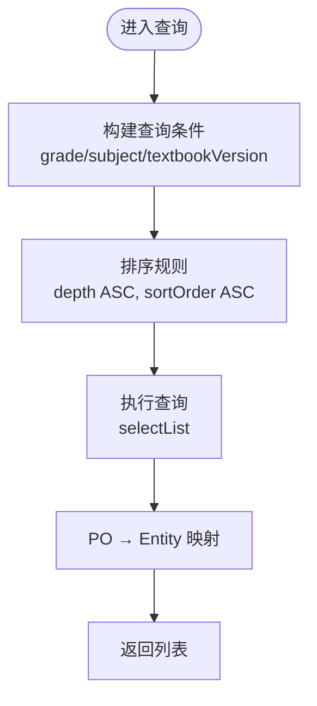
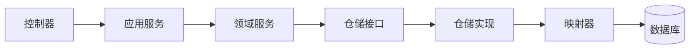

# 知识点接口

<cite>
**本文引用的文件**
- [KnowledgePointController.java](file://wzoto-backend/wzoto-interfaces/src/main/java/com/wzoto/interfaces/controller/KnowledgePointController.java)
- [KnowledgePointApplicationService.java](file://wzoto-backend/wzoto-application/src/main/java/com/wzoto/application/service/KnowledgePointApplicationService.java)
- [KnowledgePointDomainService.java](file://wzoto-backend/wzoto-domain/src/main/java/com/wzoto/domain/service/KnowledgePointDomainService.java)
- [KnowledgePointRepository.java](file://wzoto-backend/wzoto-domain/src/main/java/com/wzoto/domain/repository/KnowledgePointRepository.java)
- [KnowledgePointRepositoryImpl.java](file://wzoto-backend/wzoto-infrastructure/src/main/java/com/wzoto/infrastructure/repository/KnowledgePointRepositoryImpl.java)
- [KnowledgePointMapper.java](file://wzoto-backend/wzoto-infrastructure/src/main/java/com/wzoto/infrastructure/mapper/KnowledgePointMapper.java)
- [KnowledgePointPO.java](file://wzoto-backend/wzoto-infrastructure/src/main/java/com/wzoto/infrastructure/pojo/KnowledgePointPO.java)
- [KnowledgePoint.java](file://wzoto-backend/wzoto-domain/src/main/java/com/wzoto/domain/entity/KnowledgePoint.java)
- [GradeType.java](file://wzoto-backend/wzoto-domain/src/main/java/com/wzoto/domain/valobj/GradeType.java)
- [t_knowledge_point.sql](file://wzoto-backend/sql/t_knowledge_point.sql)
- [init_all_learning_tables.sql](file://wzoto-backend/sql/init_all_learning_tables.sql)
</cite>

## 目录
1. [简介](#简介)
2. [项目结构](#项目结构)
3. [核心组件](#核心组件)
4. [架构总览](#架构总览)
5. [详细组件分析](#详细组件分析)
6. [依赖分析](#依赖分析)
7. [性能考虑](#性能考虑)
8. [故障排查指南](#故障排查指南)
9. [结论](#结论)
10. [附录](#附录)

## 简介
本文件为“知识点管理”的完整API接口文档，覆盖以下能力：
- 树形结构查询：根节点查询、子节点获取、按年级/学科/教材版本筛选。
- 知识点详情：返回名称、描述、难度等级（深度）、掌握程度等字段说明。
- 与学习资源的关联关系：一个知识点对应多个学习资源（通过资源表与章节/知识点进行关联）。
- 搜索功能：按名称、学科、年级的筛选查询（基于现有树查询参数扩展）。
- 掌握度计算逻辑：基于答题正确率和学习时长（领域服务预留扩展点）。
- 前置依赖关系：用于学习路径规划的基础（通过parent_id自关联体现）。
- API调用示例：包含树形遍历、路径查找等复杂查询场景。

## 项目结构
后端采用分层架构：接口层（Controller）→ 应用层（Application Service）→ 领域层（Domain Service + Repository 接口）→ 基础设施层（Repository 实现 + MyBatis Mapper + PO）。知识点相关数据持久化在 t_knowledge_point 表中，支持 parent_id 自关联形成树形结构。

图表来源
- [KnowledgePointController.java:12-36](file://wzoto-backend/wzoto-interfaces/src/main/java/com/wzoto/interfaces/controller/KnowledgePointController.java#L12-L36)
- [KnowledgePointApplicationService.java:12-31](file://wzoto-backend/wzoto-application/src/main/java/com/wzoto/application/service/KnowledgePointApplicationService.java#L12-L31)
- [KnowledgePointDomainService.java:12-39](file://wzoto-backend/wzoto-domain/src/main/java/com/wzoto/domain/service/KnowledgePointDomainService.java#L12-L39)
- [KnowledgePointRepository.java:7-13](file://wzoto-backend/wzoto-domain/src/main/java/com/wzoto/domain/repository/KnowledgePointRepository.java#L7-L13)
- [KnowledgePointRepositoryImpl.java:16-75](file://wzoto-backend/wzoto-infrastructure/src/main/java/com/wzoto/infrastructure/repository/KnowledgePointRepositoryImpl.java#L16-L75)
- [KnowledgePointMapper.java:7-9](file://wzoto-backend/wzoto-infrastructure/src/main/java/com/wzoto/infrastructure/mapper/KnowledgePointMapper.java#L7-L9)
- [t_knowledge_point.sql:5-22](file://wzoto-backend/sql/t_knowledge_point.sql#L5-L22)

章节来源
- [KnowledgePointController.java:12-36](file://wzoto-backend/wzoto-interfaces/src/main/java/com/wzoto/interfaces/controller/KnowledgePointController.java#L12-L36)
- [KnowledgePointApplicationService.java:12-31](file://wzoto-backend/wzoto-application/src/main/java/com/wzoto/application/service/KnowledgePointApplicationService.java#L12-L31)
- [KnowledgePointDomainService.java:12-39](file://wzoto-backend/wzoto-domain/src/main/java/com/wzoto/domain/service/KnowledgePointDomainService.java#L12-L39)
- [KnowledgePointRepository.java:7-13](file://wzoto-backend/wzoto-domain/src/main/java/com/wzoto/domain/repository/KnowledgePointRepository.java#L7-L13)
- [KnowledgePointRepositoryImpl.java:16-75](file://wzoto-backend/wzoto-infrastructure/src/main/java/com/wzoto/infrastructure/repository/KnowledgePointRepositoryImpl.java#L16-L75)
- [KnowledgePointMapper.java:7-9](file://wzoto-backend/wzoto-infrastructure/src/main/java/com/wzoto/infrastructure/mapper/KnowledgePointMapper.java#L7-L9)
- [t_knowledge_point.sql:5-22](file://wzoto-backend/sql/t_knowledge_point.sql#L5-L22)

## 核心组件
- 控制器：提供 REST 端点，接收请求并委托应用服务处理。
- 应用服务：编排领域服务调用，做参数转换（如年级代码到枚举）。
- 领域服务：封装知识点树查询、子节点查询、详情查询等业务规则。
- 仓储接口与实现：定义数据访问契约，并在实现中构建查询条件、排序与实体映射。
- 数据模型：领域实体 KnowledgePoint 与持久化对象 KnowledgePointPO，以及值对象 GradeType。

章节来源
- [KnowledgePointController.java:12-36](file://wzoto-backend/wzoto-interfaces/src/main/java/com/wzoto/interfaces/controller/KnowledgePointController.java#L12-L36)
- [KnowledgePointApplicationService.java:12-31](file://wzoto-backend/wzoto-application/src/main/java/com/wzoto/application/service/KnowledgePointApplicationService.java#L12-L31)
- [KnowledgePointDomainService.java:12-39](file://wzoto-backend/wzoto-domain/src/main/java/com/wzoto/domain/service/KnowledgePointDomainService.java#L12-L39)
- [KnowledgePointRepository.java:7-13](file://wzoto-backend/wzoto-domain/src/main/java/com/wzoto/domain/repository/KnowledgePointRepository.java#L7-L13)
- [KnowledgePointRepositoryImpl.java:16-75](file://wzoto-backend/wzoto-infrastructure/src/main/java/com/wzoto/infrastructure/repository/KnowledgePointRepositoryImpl.java#L16-L75)
- [KnowledgePoint.java:12-38](file://wzoto-backend/wzoto-domain/src/main/java/com/wzoto/domain/entity/KnowledgePoint.java#L12-L38)
- [KnowledgePointPO.java:7-27](file://wzoto-backend/wzoto-infrastructure/src/main/java/com/wzoto/infrastructure/pojo/KnowledgePointPO.java#L7-L27)
- [GradeType.java:8-45](file://wzoto-backend/wzoto-domain/src/main/java/com/wzoto/domain/valobj/GradeType.java#L8-L45)

## 架构总览
下图展示了从HTTP请求到数据库查询的完整调用链，以及关键的数据流转。

图表来源
- [KnowledgePointController.java:21-26](file://wzoto-backend/wzoto-interfaces/src/main/java/com/wzoto/interfaces/controller/KnowledgePointController.java#L21-L26)
- [KnowledgePointApplicationService.java:20-23](file://wzoto-backend/wzoto-application/src/main/java/com/wzoto/application/service/KnowledgePointApplicationService.java#L20-L23)
- [KnowledgePointDomainService.java:20-22](file://wzoto-backend/wzoto-domain/src/main/java/com/wzoto/domain/service/KnowledgePointDomainService.java#L20-L22)
- [KnowledgePointRepositoryImpl.java:47-56](file://wzoto-backend/wzoto-infrastructure/src/main/java/com/wzoto/infrastructure/repository/KnowledgePointRepositoryImpl.java#L47-L56)
- [KnowledgePointMapper.java:7-9](file://wzoto-backend/wzoto-infrastructure/src/main/java/com/wzoto/infrastructure/mapper/KnowledgePointMapper.java#L7-L9)
- [t_knowledge_point.sql:5-22](file://wzoto-backend/sql/t_knowledge_point.sql#L5-L22)

## 详细组件分析

### 接口定义与路由
- 基础路径：/api/knowledge
- 端点列表：
  - GET /api/knowledge/tree?grade=&subject=&textbookVersion=
    - 作用：按年级、学科、教材版本获取知识点树（已按 depth、sort_order 升序返回）。
  - GET /api/knowledge/children/{parentId}
    - 作用：获取指定父节点的子节点列表（同级按 sort_order 升序）。
  - GET /api/knowledge/{id}
    - 作用：根据ID获取知识点详情；不存在时抛出业务异常。

章节来源
- [KnowledgePointController.java:21-36](file://wzoto-backend/wzoto-interfaces/src/main/java/com/wzoto/interfaces/controller/KnowledgePointController.java#L21-L36)
- [KnowledgePointDomainService.java:28-34](file://wzoto-backend/wzoto-domain/src/main/java/com/wzoto/domain/service/KnowledgePointDomainService.java#L28-L34)

### 数据模型与树形结构
- 树形组织：通过 parent_id 自关联形成层级；depth 表示层级深度（1=册，2=单元，3=章，4=节，5=知识点），isLeaf() 当 depth≥5 时为叶子节点。
- 关键字段：
  - id、parentId：主键与父节点ID
  - grade、subject、textbookVersion：年级、学科、教材版本
  - name、description：名称与描述
  - depth、sortOrder：层级与同级排序
  - deleted、createdAt、updatedAt：软删除与时间戳

图表来源
- [KnowledgePoint.java:12-38](file://wzoto-backend/wzoto-domain/src/main/java/com/wzoto/domain/entity/KnowledgePoint.java#L12-L38)
- [KnowledgePointPO.java:7-27](file://wzoto-backend/wzoto-infrastructure/src/main/java/com/wzoto/infrastructure/pojo/KnowledgePointPO.java#L7-L27)

章节来源
- [KnowledgePoint.java:12-38](file://wzoto-backend/wzoto-domain/src/main/java/com/wzoto/domain/entity/KnowledgePoint.java#L12-L38)
- [KnowledgePointPO.java:7-27](file://wzoto-backend/wzoto-infrastructure/src/main/java/com/wzoto/infrastructure/pojo/KnowledgePointPO.java#L7-L27)
- [t_knowledge_point.sql:5-22](file://wzoto-backend/sql/t_knowledge_point.sql#L5-L22)

### 查询流程与排序策略
- 树查询：按 grade、subject、textbookVersion 过滤，并按 depth、sortOrder 升序返回，便于前端直接构建树。
- 子节点查询：按 parentId 过滤，同级按 sortOrder 升序。
- 详情查询：按 id 精确查找，不存在则抛异常。

图表来源
- [KnowledgePointRepositoryImpl.java:47-56](file://wzoto-backend/wzoto-infrastructure/src/main/java/com/wzoto/infrastructure/repository/KnowledgePointRepositoryImpl.java#L47-L56)
- [KnowledgePointRepositoryImpl.java:33-39](file://wzoto-backend/wzoto-infrastructure/src/main/java/com/wzoto/infrastructure/repository/KnowledgePointRepositoryImpl.java#L33-L39)
- [KnowledgePointRepositoryImpl.java:58-73](file://wzoto-backend/wzoto-infrastructure/src/main/java/com/wzoto/infrastructure/repository/KnowledgePointRepositoryImpl.java#L58-L73)

章节来源
- [KnowledgePointRepositoryImpl.java:23-56](file://wzoto-backend/wzoto-infrastructure/src/main/java/com/wzoto/infrastructure/repository/KnowledgePointRepositoryImpl.java#L23-L56)

### 知识点详情响应字段说明
- 名称：name
- 描述：description
- 难度等级：depth（1~5，越大越细粒度；≥5视为叶子）
- 掌握程度：当前实体未直接暴露掌握度字段，可在上层聚合答题记录与学习时长计算后返回（见“掌握度计算逻辑”）
- 其他：id、parentId、grade、subject、textbookVersion、sortOrder、deleted、createdAt、updatedAt

章节来源
- [KnowledgePoint.java:12-38](file://wzoto-backend/wzoto-domain/src/main/java/com/wzoto/domain/entity/KnowledgePoint.java#L12-L38)

### 知识点与学习资源的关联关系
- 关系说明：一个知识点对应多个学习资源。资源表与章节/知识点存在关联（通过资源表与章节表、知识点表建立联系）。
- 查询建议：先通过知识点接口获取目标知识点，再结合学习资源接口按知识点维度筛选资源列表。

章节来源
- [init_all_learning_tables.sql:18-27](file://wzoto-backend/sql/init_all_learning_tables.sql#L18-L27)

### 搜索功能（按名称、学科、年级）
- 现有能力：
  - 按年级、学科、教材版本筛选树：GET /api/knowledge/tree?grade=&subject=&textbookVersion=
- 扩展建议：
  - 名称模糊搜索：可在仓库层增加 LIKE 条件或全文检索。
  - 组合筛选：将名称与学科、年级组合为多条件查询。
- 注意：当前实现未包含名称搜索，需在仓储层新增查询方法并暴露至控制器。

章节来源
- [KnowledgePointRepositoryImpl.java:47-56](file://wzoto-backend/wzoto-infrastructure/src/main/java/com/wzoto/infrastructure/repository/KnowledgePointRepositoryImpl.java#L47-L56)

### 掌握度计算逻辑（基于答题正确率与学习时长）
- 输入指标：
  - 答题正确率：该知识点下所有答题记录的命中率。
  - 学习时长：该知识点下学习资源播放时长累计。
- 计算思路：
  - 正确率权重 w1，时长权重 w2（可配置）。
  - 掌握度 = f(正确率, 学习时长)，例如加权归一化后映射到等级区间。
- 集成位置：
  - 可在领域服务或应用服务中聚合答题记录与播放进度，计算后附加到知识点详情响应中。
- 当前状态：
  - 领域服务已预留扩展点，可按需实现具体算法。

章节来源
- [KnowledgePointDomainService.java:12-39](file://wzoto-backend/wzoto-domain/src/main/java/com/wzoto/domain/service/KnowledgePointDomainService.java#L12-L39)

### 前置依赖关系（学习路径规划基础）
- 数据结构：parent_id 自关联体现父子依赖；depth 表示层级。
- 用途：
  - 路径规划：从根节点到目标知识点的路径由父子关系构成。
  - 解锁策略：仅当父级掌握达到阈值，方可解锁子级资源。
- 查询方式：
  - 通过 children/{parentId} 逐级展开，或结合 tree 全量数据在前端构建树与路径。

章节来源
- [KnowledgePoint.java:12-38](file://wzoto-backend/wzoto-domain/src/main/java/com/wzoto/domain/entity/KnowledgePoint.java#L12-L38)
- [KnowledgePointRepositoryImpl.java:33-39](file://wzoto-backend/wzoto-infrastructure/src/main/java/com/wzoto/infrastructure/repository/KnowledgePointRepositoryImpl.java#L33-L39)

### API 调用示例
- 获取知识点树（按年级/学科/教材版本）
  - 请求：GET /api/knowledge/tree?grade=GRADE_5&subject=MATH&textbookVersion=RENJIAO
  - 响应：List<KnowledgePoint>，已按 depth、sortOrder 升序
- 获取子节点
  - 请求：GET /api/knowledge/children/123
  - 响应：List<KnowledgePoint>，同级按 sortOrder 升序
- 获取详情
  - 请求：GET /api/knowledge/456
  - 响应：KnowledgePoint；若不存在，抛出异常

章节来源
- [KnowledgePointController.java:21-36](file://wzoto-backend/wzoto-interfaces/src/main/java/com/wzoto/interfaces/controller/KnowledgePointController.java#L21-L36)

### 复杂查询场景
- 树形遍历
  - 步骤：
    1) 调用 tree 获取全量有序节点
    2) 前端以 parentId 构建父子关系
    3) 使用 isLeaf() 判断叶子节点
- 路径查找
  - 步骤：
    1) 给定目标 id，递归向上查父节点（可通过多次调用 children 或在上层实现回溯）
    2) 收集路径节点，形成从根到目标的路径
- 资源关联查询
  - 步骤：
    1) 通过知识点接口定位目标知识点
    2) 调用学习资源接口，按知识点维度筛选资源列表

章节来源
- [KnowledgePoint.java:34-38](file://wzoto-backend/wzoto-domain/src/main/java/com/wzoto/domain/entity/KnowledgePoint.java#L34-L38)
- [KnowledgePointRepositoryImpl.java:47-56](file://wzoto-backend/wzoto-infrastructure/src/main/java/com/wzoto/infrastructure/repository/KnowledgePointRepositoryImpl.java#L47-L56)

## 依赖分析
- 组件耦合：
  - 控制器依赖应用服务；应用服务依赖领域服务；领域服务依赖仓储接口；仓储实现依赖MyBatis映射器与数据库。
- 外部依赖：
  - MyBatis Plus（BaseMapper、LambdaQueryWrapper）
  - 数据库 InnoDB（InnoDB引擎、utf8mb4字符集）
- 潜在循环依赖：无（分层清晰）

图表来源
- [KnowledgePointController.java:12-36](file://wzoto-backend/wzoto-interfaces/src/main/java/com/wzoto/interfaces/controller/KnowledgePointController.java#L12-L36)
- [KnowledgePointApplicationService.java:12-31](file://wzoto-backend/wzoto-application/src/main/java/com/wzoto/application/service/KnowledgePointApplicationService.java#L12-L31)
- [KnowledgePointDomainService.java:12-39](file://wzoto-backend/wzoto-domain/src/main/java/com/wzoto/domain/service/KnowledgePointDomainService.java#L12-L39)
- [KnowledgePointRepository.java:7-13](file://wzoto-backend/wzoto-domain/src/main/java/com/wzoto/domain/repository/KnowledgePointRepository.java#L7-L13)
- [KnowledgePointRepositoryImpl.java:16-75](file://wzoto-backend/wzoto-infrastructure/src/main/java/com/wzoto/infrastructure/repository/KnowledgePointRepositoryImpl.java#L16-L75)
- [KnowledgePointMapper.java:7-9](file://wzoto-backend/wzoto-infrastructure/src/main/java/com/wzoto/infrastructure/mapper/KnowledgePointMapper.java#L7-L9)

章节来源
- [KnowledgePointRepositoryImpl.java:16-75](file://wzoto-backend/wzoto-infrastructure/src/main/java/com/wzoto/infrastructure/repository/KnowledgePointRepositoryImpl.java#L16-L75)

## 性能考虑
- 查询排序：tree 与 children 均按 depth、sortOrder 升序，减少前端排序开销。
- 索引优化：
  - idx_grade_subject：加速按年级+学科筛选
  - idx_parent_id：加速子节点查询
  - idx_textbook_version：加速教材版本筛选
  - idx_depth：辅助层级范围查询
- 分页建议：当树规模较大时，可在仓储层引入分页或按需加载（当前实现为全量返回）。
- 缓存建议：对热点树数据可引入缓存层（如Redis）以减少数据库压力。

章节来源
- [t_knowledge_point.sql:18-22](file://wzoto-backend/sql/t_knowledge_point.sql#L18-L22)
- [KnowledgePointRepositoryImpl.java:23-56](file://wzoto-backend/wzoto-infrastructure/src/main/java/com/wzoto/infrastructure/repository/KnowledgePointRepositoryImpl.java#L23-L56)

## 故障排查指南
- 知识点不存在
  - 现象：调用详情接口返回异常
  - 原因：id 不存在或已被软删除
  - 处理：检查传入 id 是否正确；确认数据是否被标记删除
- 年级参数无效
  - 现象：调用 tree 时报错
  - 原因：grade 编码不在枚举范围内
  - 处理：确保 grade 为 GRADE_1~GRADE_6 之一
- 排序不符合预期
  - 现象：同级顺序不一致
  - 原因：sortOrder 未设置或重复
  - 处理：检查数据中 sortOrder 的唯一性与合理性

章节来源
- [KnowledgePointDomainService.java:28-34](file://wzoto-backend/wzoto-domain/src/main/java/com/wzoto/domain/service/KnowledgePointDomainService.java#L28-L34)
- [GradeType.java:28-45](file://wzoto-backend/wzoto-domain/src/main/java/com/wzoto/domain/valobj/GradeType.java#L28-L45)

## 结论
本接口提供了知识点树形结构的完整查询能力，并通过 parent_id 与 depth 表达层级与依赖关系，为学习路径规划奠定基础。掌握度计算与资源关联可在上层服务中扩展实现，以满足个性化学习需求。建议在大规模数据场景下引入分页与缓存以提升性能。

## 附录
- 数据库初始化脚本引用了知识点表与其他学习资源表，确保环境一致性。
- 如需新增名称搜索或更复杂的筛选条件，可在仓储层扩展查询方法并暴露至控制器。

章节来源
- [init_all_learning_tables.sql:18-27](file://wzoto-backend/sql/init_all_learning_tables.sql#L18-L27)