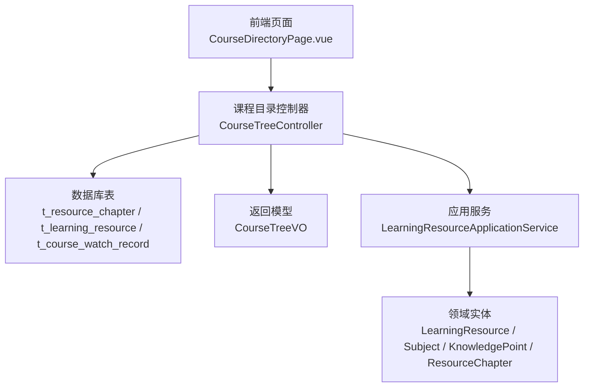
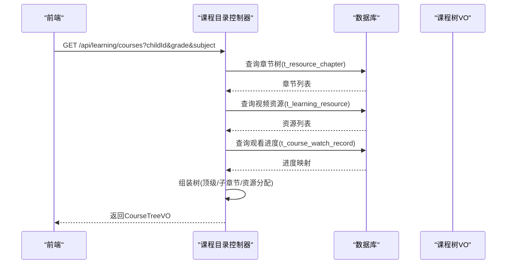
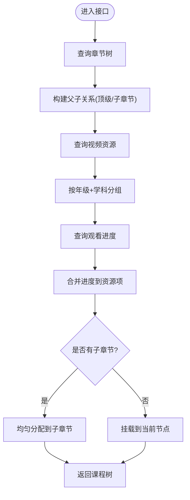
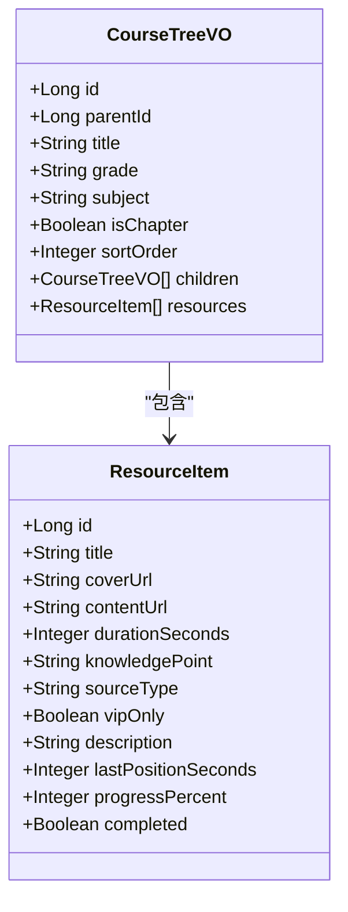
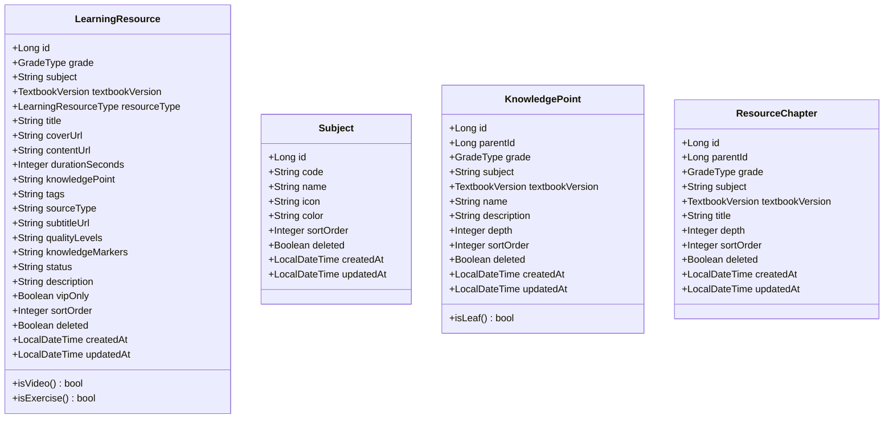
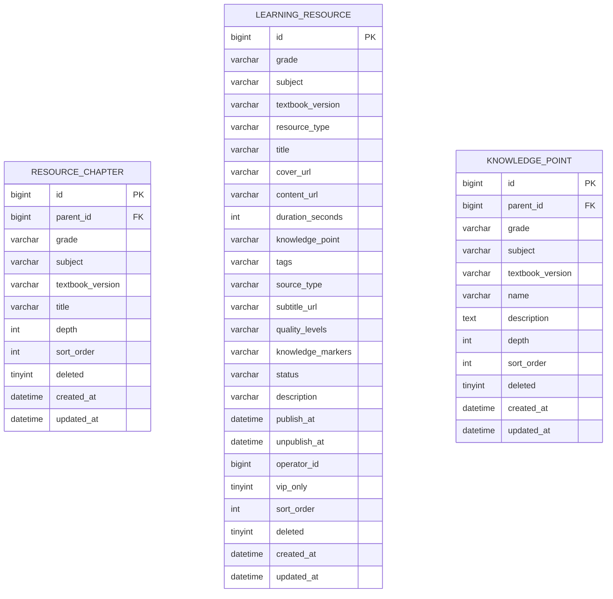
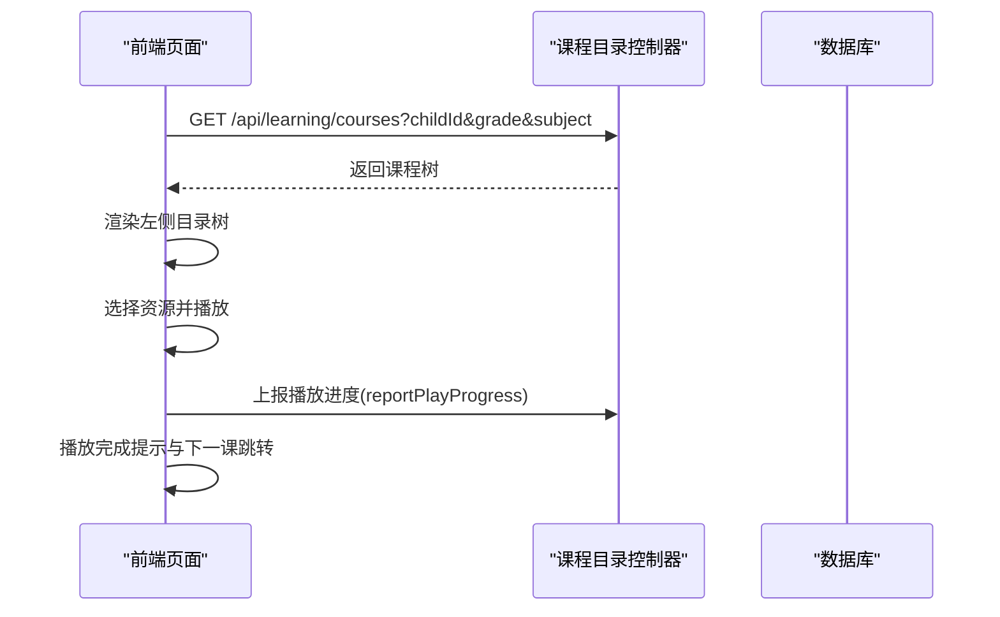
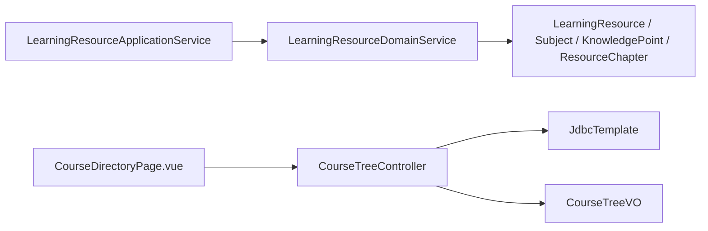

# 课程树接口

<cite>
**本文引用的文件**
- [CourseTreeController.java](file://wzoto-backend/wzoto-interfaces/src/main/java/com/wzoto/interfaces/controller/CourseTreeController.java)
- [CourseTreeVO.java](file://wzoto-backend/wzoto-interfaces/src/main/java/com/wzoto/interfaces/vo/learning/CourseTreeVO.java)
- [LearningResourceApplicationService.java](file://wzoto-backend/wzoto-application/src/main/java/com/wzoto/application/service/LearningResourceApplicationService.java)
- [LearningResource.java](file://wzoto-backend/wzoto-domain/src/main/java/com/wzoto/domain/entity/LearningResource.java)
- [Subject.java](file://wzoto-backend/wzoto-domain/src/main/java/com/wzoto/domain/entity/Subject.java)
- [KnowledgePoint.java](file://wzoto-backend/wzoto-domain/src/main/java/com/wzoto/domain/entity/KnowledgePoint.java)
- [ResourceChapter.java](file://wzoto-backend/wzoto-domain/src/main/java/com/wzoto/domain/entity/ResourceChapter.java)
- [t_resource_chapter.sql](file://wzoto-backend/sql/t_resource_chapter.sql)
- [t_learning_resource.sql](file://wzoto-backend/sql/t_learning_resource.sql)
- [t_knowledge_point.sql](file://wzoto-backend/sql/t_knowledge_point.sql)
- [CourseDirectoryPage.vue](file://wzoto-frontend/src/pages/learning/CourseDirectoryPage.vue)
</cite>

## 目录
1. [简介](#简介)
2. [项目结构](#项目结构)
3. [核心组件](#核心组件)
4. [架构总览](#架构总览)
5. [详细组件分析](#详细组件分析)
6. [依赖关系分析](#依赖关系分析)
7. [性能考虑](#性能考虑)
8. [故障排查指南](#故障排查指南)
9. [结论](#结论)
10. [附录：API 调用示例](#附录api-调用示例)

## 简介
本接口文档围绕“课程树结构管理”展开，覆盖课程体系从年级→学科→章节→知识点的四级结构构建、层级导航、路径规划与进度展示等核心能力。重点说明课程树查询接口的参数与响应格式（支持递归树形与扁平化两种模式）、课程路径计算算法（根节点到目标节点的完整路径）、课程导航（上一节/下一节/目录跳转）以及课程进度在树中的状态标识（已完成、进行中、未开始）。同时给出缓存策略建议与完整的 API 调用示例，包括复杂路径查询与批量操作场景。

## 项目结构
后端采用分层架构：接口层暴露 REST API，应用层编排业务服务，领域层定义实体与规则，基础设施层提供数据访问。前端通过页面组件调用接口并渲染课程目录树与播放器。

图表来源
- [CourseTreeController.java:1-187](file://wzoto-backend/wzoto-interfaces/src/main/java/com/wzoto/interfaces/controller/CourseTreeController.java#L1-L187)
- [CourseTreeVO.java:1-65](file://wzoto-backend/wzoto-interfaces/src/main/java/com/wzoto/interfaces/vo/learning/CourseTreeVO.java#L1-L65)
- [LearningResourceApplicationService.java:1-40](file://wzoto-backend/wzoto-application/src/main/java/com/wzoto/application/service/LearningResourceApplicationService.java#L1-L40)
- [LearningResource.java:1-153](file://wzoto-backend/wzoto-domain/src/main/java/com/wzoto/domain/entity/LearningResource.java#L1-L153)
- [Subject.java:1-28](file://wzoto-backend/wzoto-domain/src/main/java/com/wzoto/domain/entity/Subject.java#L1-L28)
- [KnowledgePoint.java:1-39](file://wzoto-backend/wzoto-domain/src/main/java/com/wzoto/domain/entity/KnowledgePoint.java#L1-L39)
- [ResourceChapter.java:1-32](file://wzoto-backend/wzoto-domain/src/main/java/com/wzoto/domain/entity/ResourceChapter.java#L1-L32)
- [t_resource_chapter.sql:1-21](file://wzoto-backend/sql/t_resource_chapter.sql#L1-L21)
- [t_learning_resource.sql:1-36](file://wzoto-backend/sql/t_learning_resource.sql#L1-L36)
- [t_knowledge_point.sql:1-23](file://wzoto-backend/sql/t_knowledge_point.sql#L1-L23)

章节来源
- [CourseTreeController.java:1-187](file://wzoto-backend/wzoto-interfaces/src/main/java/com/wzoto/interfaces/controller/CourseTreeController.java#L1-L187)
- [CourseDirectoryPage.vue:1-611](file://wzoto-frontend/src/pages/learning/CourseDirectoryPage.vue#L1-L611)

## 核心组件
- 课程目录控制器：提供课程树查询接口，按年级与学科过滤，组装章节树与资源列表，并注入观看进度。
- 课程树 VO：定义树节点与课时资源项的返回结构，包含进度字段与 VIP 标记。
- 学习资源应用服务：封装资源列表、详情与解锁等业务编排。
- 领域实体：资源、学科、知识点、教材章节等核心数据模型及行为。
- 数据库表：章节、资源、知识点、观看记录等持久化结构。

章节来源
- [CourseTreeController.java:25-159](file://wzoto-backend/wzoto-interfaces/src/main/java/com/wzoto/interfaces/controller/CourseTreeController.java#L25-L159)
- [CourseTreeVO.java:13-63](file://wzoto-backend/wzoto-interfaces/src/main/java/com/wzoto/interfaces/vo/learning/CourseTreeVO.java#L13-L63)
- [LearningResourceApplicationService.java:24-38](file://wzoto-backend/wzoto-application/src/main/java/com/wzoto/application/service/LearningResourceApplicationService.java#L24-L38)
- [LearningResource.java:21-153](file://wzoto-backend/wzoto-domain/src/main/java/com/wzoto/domain/entity/LearningResource.java#L21-L153)
- [t_resource_chapter.sql:5-20](file://wzoto-backend/sql/t_resource_chapter.sql#L5-L20)
- [t_learning_resource.sql:4-35](file://wzoto-backend/sql/t_learning_resource.sql#L4-L35)
- [t_knowledge_point.sql:5-22](file://wzoto-backend/sql/t_knowledge_point.sql#L5-L22)

## 架构总览
课程树构建流程：
- 读取章节树（t_resource_chapter），按 depth 区分顶级与子章节，构建父子关系。
- 读取视频资源（t_learning_resource，resource_type=VIDEO），按 grade+subject 分组。
- 读取观看进度（t_course_watch_record），以 childId 为维度聚合进度。
- 将资源分配到章节节点：若有子章节则均匀分配；否则挂载到当前节点。
- 组装 CourseTreeVO 返回给前端。

图表来源
- [CourseTreeController.java:29-159](file://wzoto-backend/wzoto-interfaces/src/main/java/com/wzoto/interfaces/controller/CourseTreeController.java#L29-L159)
- [t_resource_chapter.sql:5-20](file://wzoto-backend/sql/t_resource_chapter.sql#L5-L20)
- [t_learning_resource.sql:4-35](file://wzoto-backend/sql/t_learning_resource.sql#L4-L35)

## 详细组件分析

### 课程目录控制器（GET 课程树）
- 功能：根据 childId、grade、subject 获取课程目录树，返回章节树与课时资源，附带进度信息。
- 关键逻辑：
  - 查询章节并按 depth 分类，构建父子关系。
  - 查询 VIDEO 类型资源，按 grade+subject 分组。
  - 查询观看进度，合并到资源项中。
  - 资源分配策略：有子章节时均匀分配；无子章节时直接挂载到当前节点。
- 返回：List<CourseTreeVO>，每个节点包含 children 与 resources。

图表来源
- [CourseTreeController.java:38-159](file://wzoto-backend/wzoto-interfaces/src/main/java/com/wzoto/interfaces/controller/CourseTreeController.java#L38-L159)

章节来源
- [CourseTreeController.java:29-159](file://wzoto-backend/wzoto-interfaces/src/main/java/com/wzoto/interfaces/controller/CourseTreeController.java#L29-L159)

### 课程树 VO 数据结构
- 节点字段：id、parentId、title、grade、subject、isChapter、sortOrder、children、resources。
- 资源项字段：id、title、coverUrl、contentUrl、durationSeconds、knowledgePoint、sourceType、vipOnly、description、lastPositionSeconds、progressPercent、completed。
- 用途：统一前后端交互的数据契约，承载树结构与进度信息。

图表来源
- [CourseTreeVO.java:13-63](file://wzoto-backend/wzoto-interfaces/src/main/java/com/wzoto/interfaces/vo/learning/CourseTreeVO.java#L13-L63)

章节来源
- [CourseTreeVO.java:13-63](file://wzoto-backend/wzoto-interfaces/src/main/java/com/wzoto/interfaces/vo/learning/CourseTreeVO.java#L13-L63)

### 领域实体与数据模型
- LearningResource：学习资源实体，包含年级、学科、资源类型、时长、知识点、VIP 标记、排序等。
- Subject：学科实体，用于学科元数据。
- KnowledgePoint：知识点实体，支持树形结构（parent_id、depth）。
- ResourceChapter：教材章节实体，支撑章节树组织。

图表来源
- [LearningResource.java:21-153](file://wzoto-backend/wzoto-domain/src/main/java/com/wzoto/domain/entity/LearningResource.java#L21-L153)
- [Subject.java:13-27](file://wzoto-backend/wzoto-domain/src/main/java/com/wzoto/domain/entity/Subject.java#L13-L27)
- [KnowledgePoint.java:16-38](file://wzoto-backend/wzoto-domain/src/main/java/com/wzoto/domain/entity/KnowledgePoint.java#L16-L38)
- [ResourceChapter.java:15-31](file://wzoto-backend/wzoto-domain/src/main/java/com/wzoto/domain/entity/ResourceChapter.java#L15-L31)

章节来源
- [LearningResource.java:21-153](file://wzoto-backend/wzoto-domain/src/main/java/com/wzoto/domain/entity/LearningResource.java#L21-L153)
- [Subject.java:13-27](file://wzoto-backend/wzoto-domain/src/main/java/com/wzoto/domain/entity/Subject.java#L13-L27)
- [KnowledgePoint.java:16-38](file://wzoto-backend/wzoto-domain/src/main/java/com/wzoto/domain/entity/KnowledgePoint.java#L16-L38)
- [ResourceChapter.java:15-31](file://wzoto-backend/wzoto-domain/src/main/java/com/wzoto/domain/entity/ResourceChapter.java#L15-L31)

### 数据库表结构
- t_resource_chapter：章节表，支持 parent_id 自关联与 depth 层级，索引优化查询。
- t_learning_resource：资源表，包含资源类型、知识点、VIP 标记、排序等，索引覆盖常用查询。
- t_knowledge_point：知识点表，树形结构，depth 表示层级深度。

图表来源
- [t_resource_chapter.sql:5-20](file://wzoto-backend/sql/t_resource_chapter.sql#L5-L20)
- [t_learning_resource.sql:4-35](file://wzoto-backend/sql/t_learning_resource.sql#L4-L35)
- [t_knowledge_point.sql:5-22](file://wzoto-backend/sql/t_knowledge_point.sql#L5-L22)

章节来源
- [t_resource_chapter.sql:5-20](file://wzoto-backend/sql/t_resource_chapter.sql#L5-L20)
- [t_learning_resource.sql:4-35](file://wzoto-backend/sql/t_learning_resource.sql#L4-L35)
- [t_knowledge_point.sql:5-22](file://wzoto-backend/sql/t_knowledge_point.sql#L5-L22)

### 前端课程目录与导航
- 页面职责：加载课程树、切换学科与年级、选择资源播放、上报播放进度、完成提示与下一课跳转。
- 关键交互：
  - 调用 getCourseTree 获取树结构。
  - 点击资源进行播放，OnionPlayer 上报进度。
  - 播放完成显示提示并提供“下一课”按钮。
  - 使用 flattenResources 实现扁平化遍历以定位下一节。

图表来源
- [CourseDirectoryPage.vue:248-320](file://wzoto-frontend/src/pages/learning/CourseDirectoryPage.vue#L248-L320)

章节来源
- [CourseDirectoryPage.vue:248-320](file://wzoto-frontend/src/pages/learning/CourseDirectoryPage.vue#L248-L320)

## 依赖关系分析
- 控制器依赖 JdbcTemplate 直接访问数据库，组装 VO 返回。
- 应用服务依赖领域服务，提供资源列表、详情与解锁能力。
- 领域实体定义业务规则与行为（如是否视频、是否习题、是否为叶子知识点）。
- 前端依赖课程目录控制器与播放器组件，完成用户交互与进度上报。

图表来源
- [CourseTreeController.java:23-159](file://wzoto-backend/wzoto-interfaces/src/main/java/com/wzoto/interfaces/controller/CourseTreeController.java#L23-L159)
- [LearningResourceApplicationService.java:22-38](file://wzoto-backend/wzoto-application/src/main/java/com/wzoto/application/service/LearningResourceApplicationService.java#L22-L38)
- [CourseDirectoryPage.vue:248-320](file://wzoto-frontend/src/pages/learning/CourseDirectoryPage.vue#L248-L320)

章节来源
- [CourseTreeController.java:23-159](file://wzoto-backend/wzoto-interfaces/src/main/java/com/wzoto/interfaces/controller/CourseTreeController.java#L23-L159)
- [LearningResourceApplicationService.java:22-38](file://wzoto-backend/wzoto-application/src/main/java/com/wzoto/application/service/LearningResourceApplicationService.java#L22-L38)
- [CourseDirectoryPage.vue:248-320](file://wzoto-frontend/src/pages/learning/CourseDirectoryPage.vue#L248-L320)

## 性能考虑
- 查询优化：
  - 章节与资源查询均按 grade、subject 过滤，利用索引 idx_grade_subject 提升性能。
  - 进度查询按 childId 一次性拉取并内存映射，避免 N+1 查询。
- 资源分配：
  - 当前实现按 grade+subject 分组后均匀分配到子章节，减少复杂匹配开销。
- 缓存策略建议：
  - 对课程树结果进行短期缓存（如 5-10 分钟），键基于 childId、grade、subject。
  - 对进度数据可结合 Redis 缓存，按 childId 聚合，降低重复查询。
  - 热点章节或资源可使用本地缓存（如 Caffeine）以减少数据库压力。
- 扩展性：
  - 若资源与知识点存在多对多关系，建议引入中间表并通过 JOIN 优化查询。
  - 增加分页或懒加载机制，避免一次性加载大量资源。

[本节为通用性能指导，不直接分析具体文件]

## 故障排查指南
- 常见问题：
  - 课程树为空：检查 grade、subject 参数是否正确；确认章节与资源数据是否存在且未删除。
  - 进度未更新：确认前端上报接口是否正常；检查 t_course_watch_record 写入是否成功。
  - VIP 资源不可用：确认用户会员状态与资源 vip_only 标记。
- 日志与监控：
  - 控制器已记录 BI 日志，便于追踪请求参数与用户上下文。
  - 前端错误捕获与提示，便于快速定位问题。

章节来源
- [CourseTreeController.java:35-36](file://wzoto-backend/wzoto-interfaces/src/main/java/com/wzoto/interfaces/controller/CourseTreeController.java#L35-L36)
- [CourseDirectoryPage.vue:288-294](file://wzoto-frontend/src/pages/learning/CourseDirectoryPage.vue#L288-L294)

## 结论
本课程树接口实现了年级→学科→章节→知识点的四级结构构建与展示，支持递归树形与扁平化查询，提供路径规划与导航能力，并在树中直观展示学习进度。通过合理的查询与分配策略，兼顾了性能与可扩展性。建议在生产环境引入缓存与更精细的资源-知识点关联以提升效率与准确性。

[本节为总结性内容，不直接分析具体文件]

## 附录：API 调用示例
- 获取课程树（递归模式）
  - 方法：GET
  - 路径：/api/learning/courses
  - 参数：
    - childId: Long，必填，学生 ID
    - grade: String，可选，年级（如 GRADE_4）
    - subject: String，可选，学科（如 MATH）
  - 响应：List<CourseTreeVO>，包含章节树与资源列表，资源项含进度与 VIP 标记
  - 示例：GET /api/learning/courses?childId=2&grade=GRADE_4&subject=MATH

- 获取课程树（扁平化模式）
  - 在前端通过遍历树结构生成扁平列表，便于顺序导航与批量操作
  - 参考前端函数：flattenResources（用于收集所有资源项）

- 上报播放进度
  - 方法：POST（由前端调用 reportPlayProgress）
  - 路径：/api/learning/progress（假设）
  - 参数：resourceId、childId、lastPositionSeconds、progressPercent、completed
  - 作用：更新 t_course_watch_record，驱动课程树进度展示

- 复杂路径查询示例
  - 场景：从根节点到目标知识点的完整路径
  - 步骤：
    - 查询章节树，定位目标章节节点
    - 回溯父节点直至根节点，形成路径数组
    - 返回路径供前端高亮或导航

- 批量操作场景
  - 批量解锁 VIP 资源：调用 unlockResource（应用服务）
  - 批量标记完成：批量更新 t_course_watch_record 的 completed 字段
  - 批量导出课程清单：基于课程树生成 CSV/Excel

章节来源
- [CourseTreeController.java:29-159](file://wzoto-backend/wzoto-interfaces/src/main/java/com/wzoto/interfaces/controller/CourseTreeController.java#L29-L159)
- [CourseDirectoryPage.vue:313-320](file://wzoto-frontend/src/pages/learning/CourseDirectoryPage.vue#L313-L320)
- [LearningResourceApplicationService.java:35-38](file://wzoto-backend/wzoto-application/src/main/java/com/wzoto/application/service/LearningResourceApplicationService.java#L35-L38)