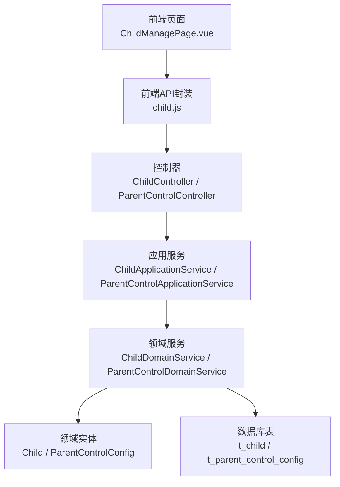
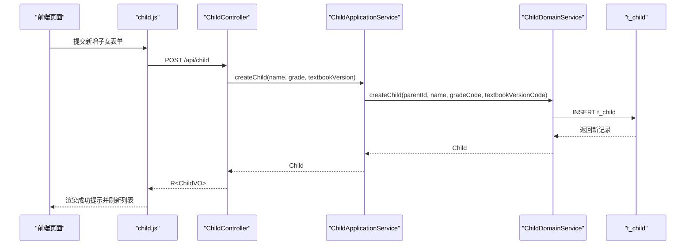
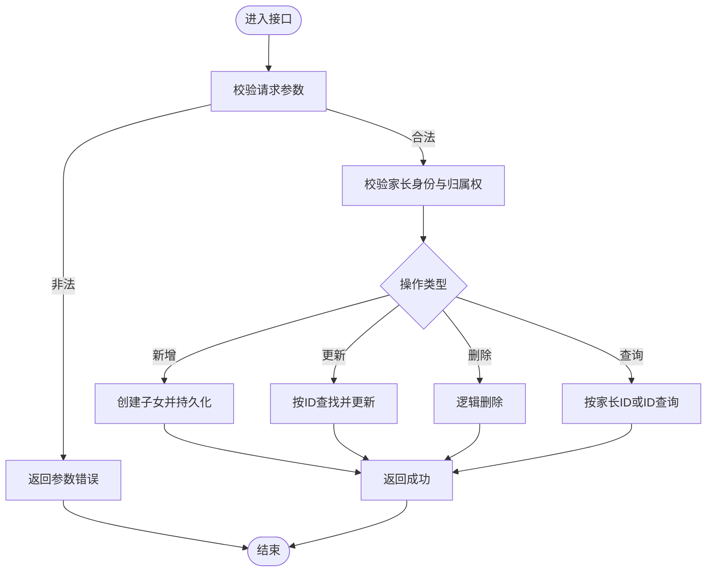
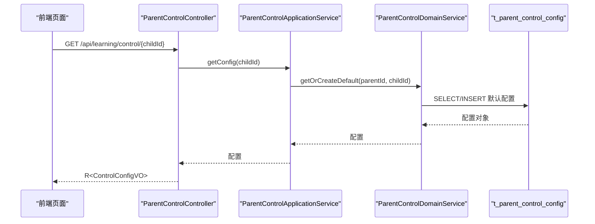
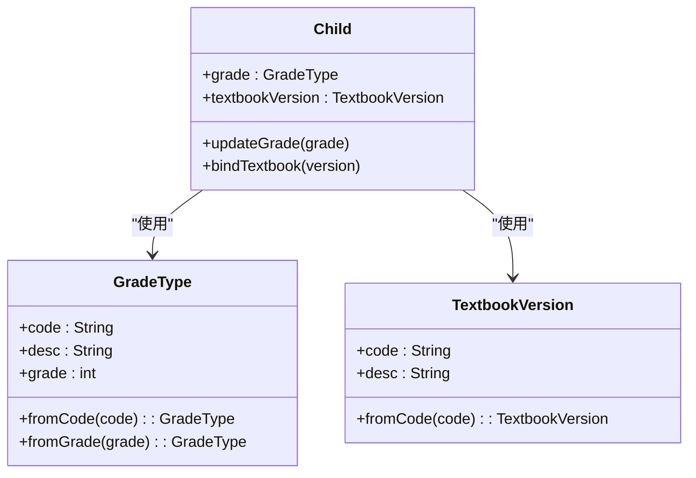
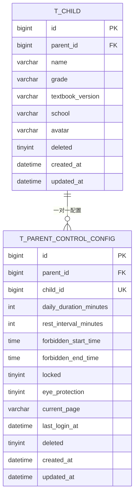
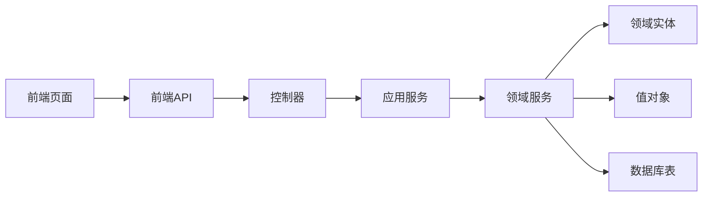

# 子女管理接口

<cite>
**本文引用的文件**
- [ChildController.java](file://wzoto-backend/wzoto-interfaces/src/main/java/com/wzoto/interfaces/controller/ChildController.java)
- [ChildApplicationService.java](file://wzoto-backend/wzoto-application/src/main/java/com/wzoto/application/service/ChildApplicationService.java)
- [ChildDomainService.java](file://wzoto-backend/wzoto-domain/src/main/java/com/wzoto/domain/service/ChildDomainService.java)
- [Child.java](file://wzoto-backend/wzoto-domain/src/main/java/com/wzoto/domain/entity/Child.java)
- [GradeType.java](file://wzoto-backend/wzoto-domain/src/main/java/com/wzoto/domain/valobj/GradeType.java)
- [TextbookVersion.java](file://wzoto-backend/wzoto-domain/src/main/java/com/wzoto/domain/valobj/TextbookVersion.java)
- [CreateChildDTO.java](file://wzoto-backend/wzoto-interfaces/src/main/java/com/wzoto/interfaces/dto/child/CreateChildDTO.java)
- [UpdateChildDTO.java](file://wzoto-backend/wzoto-interfaces/src/main/java/com/wzoto/interfaces/dto/child/UpdateChildDTO.java)
- [ChildVO.java](file://wzoto-backend/wzoto-interfaces/src/main/java/com/wzoto/interfaces/vo/child/ChildVO.java)
- [t_child.sql](file://wzoto-backend/sql/t_child.sql)
- [ParentControlController.java](file://wzoto-backend/wzoto-interfaces/src/main/java/com/wzoto/interfaces/controller/ParentControlController.java)
- [ParentControlApplicationService.java](file://wzoto-backend/wzoto-application/src/main/java/com/wzoto/application/service/ParentControlApplicationService.java)
- [ParentControlConfig.java](file://wzoto-backend/wzoto-domain/src/main/java/com/wzoto/domain/entity/ParentControlConfig.java)
- [t_parent_control_config.sql](file://wzoto-backend/sql/t_parent_control_config.sql)
- [child.js](file://wzoto-frontend/src/api/child.js)
- [ChildManagePage.vue](file://wzoto-frontend/src/pages/learning/ChildManagePage.vue)
</cite>

## 目录
1. [简介](#简介)
2. [项目结构](#项目结构)
3. [核心组件](#核心组件)
4. [架构总览](#架构总览)
5. [详细组件分析](#详细组件分析)
6. [依赖关系分析](#依赖关系分析)
7. [性能考虑](#性能考虑)
8. [故障排查指南](#故障排查指南)
9. [结论](#结论)
10. [附录：API 接口清单](#附录api-接口清单)

## 简介
本文件面向“家长管控-子女管理”功能，提供完整的 API 接口文档与实现说明。覆盖以下能力：
- 子女档案管理：基本信息录入、年级设置、教材版本选择等
- 完整操作：新增、修改、删除、查询（列表与详情）
- 年龄适配机制：基于年级值对象进行内容难度、学习进度与权限的个性化配置基础
- 多子女支持：家庭账户维度数据隔离、统一管理界面
- 家长管控联动：为每个子女维护每日时长、休息间隔、禁用时段、锁定与护眼模式等

## 项目结构
后端采用分层架构：接口层（Controller）→ 应用服务（Application Service）→ 领域服务（Domain Service）→ 仓储与实体（Repository/Entity）。前端通过 API 模块调用后端接口，并在页面中组织表单与交互。

图表来源
- [ChildController.java:20-77](file://wzoto-backend/wzoto-interfaces/src/main/java/com/wzoto/interfaces/controller/ChildController.java#L20-L77)
- [ParentControlController.java:13-75](file://wzoto-backend/wzoto-interfaces/src/main/java/com/wzoto/interfaces/controller/ParentControlController.java#L13-L75)
- [ChildApplicationService.java:12-48](file://wzoto-backend/wzoto-application/src/main/java/com/wzoto/application/service/ChildApplicationService.java#L12-L48)
- [ParentControlApplicationService.java:11-44](file://wzoto-backend/wzoto-application/src/main/java/com/wzoto/application/service/ParentControlApplicationService.java#L11-L44)
- [ChildDomainService.java:16-86](file://wzoto-backend/wzoto-domain/src/main/java/com/wzoto/domain/service/ChildDomainService.java#L16-L86)
- [Child.java:12-122](file://wzoto-backend/wzoto-domain/src/main/java/com/wzoto/domain/entity/Child.java#L12-L122)
- [ParentControlConfig.java:10-164](file://wzoto-backend/wzoto-domain/src/main/java/com/wzoto/domain/entity/ParentControlConfig.java#L10-L164)
- [t_child.sql:1-18](file://wzoto-backend/sql/t_child.sql#L1-L18)
- [t_parent_control_config.sql:1-23](file://wzoto-backend/sql/t_parent_control_config.sql#L1-L23)

章节来源
- [ChildController.java:20-77](file://wzoto-backend/wzoto-interfaces/src/main/java/com/wzoto/interfaces/controller/ChildController.java#L20-L77)
- [ParentControlController.java:13-75](file://wzoto-backend/wzoto-interfaces/src/main/java/com/wzoto/interfaces/controller/ParentControlController.java#L13-L75)
- [ChildManagePage.vue:1-200](file://wzoto-frontend/src/pages/learning/ChildManagePage.vue#L1-L200)
- [child.js:1-37](file://wzoto-frontend/src/api/child.js#L1-L37)

## 核心组件
- 控制器层
  - 子女档案控制器：提供新增、更新、删除、查询列表与详情的 REST 接口
  - 家长管控控制器：提供获取/保存管控配置、锁定/解锁子项的接口
- 应用服务层
  - 子女应用服务：从当前登录用户上下文提取家长ID，委派领域服务完成业务编排
  - 家长管控应用服务：封装配置获取、保存与锁定/解锁事务性操作
- 领域服务与实体
  - 子女领域服务：校验家长身份、创建/更新/删除子女、归属权校验
  - 子女实体：包含年级、教材版本、学校、头像等字段及领域行为（更新、绑定教材、逻辑删除）
  - 家长管控配置实体：定义每日时长、休息间隔、禁用时段、锁定、护眼、蓝光过滤、坐姿提醒等
- 值对象
  - 年级枚举：GRADE_1~GRADE_6，提供 code/desc/grade 映射与转换
  - 教材版本枚举：人教版、北师大版等，提供 code/desc 映射与转换
- 数据模型
  - 子女表：parent_id、name、grade、textbook_version、school、avatar、deleted、时间戳
  - 家长管控配置表：parent_id、child_id、daily_duration_minutes、rest_interval_minutes、forbidden_start/end_time、locked、eye_protection、current_page、last_login_at、deleted、时间戳

章节来源
- [ChildController.java:20-77](file://wzoto-backend/wzoto-interfaces/src/main/java/com/wzoto/interfaces/controller/ChildController.java#L20-L77)
- [ParentControlController.java:13-75](file://wzoto-backend/wzoto-interfaces/src/main/java/com/wzoto/interfaces/controller/ParentControlController.java#L13-L75)
- [ChildApplicationService.java:12-48](file://wzoto-backend/wzoto-application/src/main/java/com/wzoto/application/service/ChildApplicationService.java#L12-L48)
- [ParentControlApplicationService.java:11-44](file://wzoto-backend/wzoto-application/src/main/java/com/wzoto/application/service/ParentControlApplicationService.java#L11-L44)
- [ChildDomainService.java:16-86](file://wzoto-backend/wzoto-domain/src/main/java/com/wzoto/domain/service/ChildDomainService.java#L16-L86)
- [Child.java:12-122](file://wzoto-backend/wzoto-domain/src/main/java/com/wzoto/domain/entity/Child.java#L12-L122)
- [ParentControlConfig.java:10-164](file://wzoto-backend/wzoto-domain/src/main/java/com/wzoto/domain/entity/ParentControlConfig.java#L10-L164)
- [GradeType.java:5-46](file://wzoto-backend/wzoto-domain/src/main/java/com/wzoto/domain/valobj/GradeType.java#L5-L46)
- [TextbookVersion.java:5-36](file://wzoto-backend/wzoto-domain/src/main/java/com/wzoto/domain/valobj/TextbookVersion.java#L5-L36)
- [t_child.sql:1-18](file://wzoto-backend/sql/t_child.sql#L1-L18)
- [t_parent_control_config.sql:1-23](file://wzoto-backend/sql/t_parent_control_config.sql#L1-L23)

## 架构总览
下图展示一次“新增子女”的端到端调用链：前端发起请求 → 控制器接收并校验 → 应用服务解析参数并委派领域服务 → 领域服务校验家长身份与值对象 → 持久化并返回结果。

图表来源
- [ChildController.java:31-36](file://wzoto-backend/wzoto-interfaces/src/main/java/com/wzoto/interfaces/controller/ChildController.java#L31-L36)
- [ChildApplicationService.java:22-25](file://wzoto-backend/wzoto-application/src/main/java/com/wzoto/application/service/ChildApplicationService.java#L22-L25)
- [ChildDomainService.java:27-41](file://wzoto-backend/wzoto-domain/src/main/java/com/wzoto/domain/service/ChildDomainService.java#L27-L41)
- [t_child.sql:4-17](file://wzoto-backend/sql/t_child.sql#L4-L17)
- [child.js:6-8](file://wzoto-frontend/src/api/child.js#L6-L8)
- [ChildManagePage.vue:135-153](file://wzoto-frontend/src/pages/learning/ChildManagePage.vue#L135-L153)

## 详细组件分析

### 子女档案管理接口
- 新增子女
  - 路径与方法：POST /api/child
  - 请求体：CreateChildDTO（姓名必填、年级必填、教材版本必填；可选学校、头像）
  - 响应：R<ChildVO>（包含id、parentId、name、grade、gradeDesc、textbookVersion、textbookVersionDesc、school、avatar、createdAt）
  - 行为要点：
    - 从上下文获取当前家长ID
    - 将字符串年级/教材版本转换为值对象
    - 创建子女并持久化
- 更新子女
  - 路径与方法：PUT /api/child/{id}
  - 请求体：UpdateChildDTO（可部分更新姓名、年级、教材版本、学校、头像）
  - 响应：R<ChildVO>
  - 行为要点：先校验归属权再更新
- 删除子女
  - 路径与方法：DELETE /api/child/{id}
  - 响应：R<Boolean>
  - 行为要点：逻辑删除
- 查询我的子女列表
  - 路径与方法：GET /api/children
  - 响应：R<List<ChildVO>>
- 查询子女详情
  - 路径与方法：GET /api/child/{id}
  - 响应：R<ChildVO>

图表来源
- [ChildController.java:31-60](file://wzoto-backend/wzoto-interfaces/src/main/java/com/wzoto/interfaces/controller/ChildController.java#L31-L60)
- [ChildDomainService.java:27-84](file://wzoto-backend/wzoto-domain/src/main/java/com/wzoto/domain/service/ChildDomainService.java#L27-L84)
- [CreateChildDTO.java:6-21](file://wzoto-backend/wzoto-interfaces/src/main/java/com/wzoto/interfaces/dto/child/CreateChildDTO.java#L6-L21)
- [UpdateChildDTO.java:5-13](file://wzoto-backend/wzoto-interfaces/src/main/java/com/wzoto/interfaces/dto/child/UpdateChildDTO.java#L5-L13)
- [ChildVO.java:8-22](file://wzoto-backend/wzoto-interfaces/src/main/java/com/wzoto/interfaces/vo/child/ChildVO.java#L8-L22)

章节来源
- [ChildController.java:31-60](file://wzoto-backend/wzoto-interfaces/src/main/java/com/wzoto/interfaces/controller/ChildController.java#L31-L60)
- [ChildApplicationService.java:22-46](file://wzoto-backend/wzoto-application/src/main/java/com/wzoto/application/service/ChildApplicationService.java#L22-L46)
- [ChildDomainService.java:27-84](file://wzoto-backend/wzoto-domain/src/main/java/com/wzoto/domain/service/ChildDomainService.java#L27-L84)
- [Child.java:52-122](file://wzoto-backend/wzoto-domain/src/main/java/com/wzoto/domain/entity/Child.java#L52-L122)
- [t_child.sql:4-17](file://wzoto-backend/sql/t_child.sql#L4-L17)

### 家长管控配置接口
- 获取管控配置
  - 路径与方法：GET /api/learning/control/{childId}
  - 响应：R<ControlConfigVO>
  - 行为：若不存在则创建默认配置
- 保存管控配置
  - 路径与方法：POST /api/learning/control/{childId}
  - 请求体：ControlConfigDTO（每日时长、休息间隔、禁用时段、护眼模式、蓝光过滤、坐姿提醒等）
  - 响应：R<ControlConfigVO>
  - 行为：事务性保存
- 锁定/解锁
  - 路径与方法：POST /api/learning/control/{childId}/lock | unlock
  - 响应：R<ControlConfigVO>
  - 行为：切换锁定状态

图表来源
- [ParentControlController.java:24-43](file://wzoto-backend/wzoto-interfaces/src/main/java/com/wzoto/interfaces/controller/ParentControlController.java#L24-L43)
- [ParentControlApplicationService.java:21-30](file://wzoto-backend/wzoto-application/src/main/java/com/wzoto/application/service/ParentControlApplicationService.java#L21-L30)
- [ParentControlConfig.java:64-81](file://wzoto-backend/wzoto-domain/src/main/java/com/wzoto/domain/entity/ParentControlConfig.java#L64-L81)
- [t_parent_control_config.sql:4-22](file://wzoto-backend/sql/t_parent_control_config.sql#L4-L22)

章节来源
- [ParentControlController.java:24-57](file://wzoto-backend/wzoto-interfaces/src/main/java/com/wzoto/interfaces/controller/ParentControlController.java#L24-L57)
- [ParentControlApplicationService.java:21-42](file://wzoto-backend/wzoto-application/src/main/java/com/wzoto/application/service/ParentControlApplicationService.java#L21-L42)
- [ParentControlConfig.java:64-164](file://wzoto-backend/wzoto-domain/src/main/java/com/wzoto/domain/entity/ParentControlConfig.java#L64-L164)
- [t_parent_control_config.sql:4-22](file://wzoto-backend/sql/t_parent_control_config.sql#L4-L22)

### 年龄适配机制（基于年级与教材版本）
- 年级值对象：GRADE_1~GRADE_6，提供 code、desc、grade 数字映射，用于后续内容难度、学习进度与权限控制的基础
- 教材版本值对象：支持人教版、北师大版等多版本，便于资源与课程匹配
- 使用方式：在资源检索、任务推荐、报告生成等场景中，依据子女的 grade 与 textbookVersion 进行筛选与排序
- 复杂度说明：枚举查找为 O(1)，整体适配逻辑对查询影响可忽略

图表来源
- [GradeType.java:5-46](file://wzoto-backend/wzoto-domain/src/main/java/com/wzoto/domain/valobj/GradeType.java#L5-L46)
- [TextbookVersion.java:5-36](file://wzoto-backend/wzoto-domain/src/main/java/com/wzoto/domain/valobj/TextbookVersion.java#L5-L36)
- [Child.java:31-35](file://wzoto-backend/wzoto-domain/src/main/java/com/wzoto/domain/entity/Child.java#L31-L35)
- [Child.java:88-106](file://wzoto-backend/wzoto-domain/src/main/java/com/wzoto/domain/entity/Child.java#L88-L106)

章节来源
- [GradeType.java:5-46](file://wzoto-backend/wzoto-domain/src/main/java/com/wzoto/domain/valobj/GradeType.java#L5-L46)
- [TextbookVersion.java:5-36](file://wzoto-backend/wzoto-domain/src/main/java/com/wzoto/domain/valobj/TextbookVersion.java#L5-L36)
- [Child.java:31-35](file://wzoto-backend/wzoto-domain/src/main/java/com/wzoto/domain/entity/Child.java#L31-L35)

### 多子女支持与数据隔离
- 数据隔离：所有子女记录通过 parent_id 关联，查询与更新均基于当前登录家长上下文，确保不同家庭数据隔离
- 统一界面：前端“子女管理”页面集中展示列表、新增、编辑、删除等操作
- 管控配置：按 child_id 唯一索引，保证每个子女独立配置

图表来源
- [t_child.sql:4-17](file://wzoto-backend/sql/t_child.sql#L4-L17)
- [t_parent_control_config.sql:4-22](file://wzoto-backend/sql/t_parent_control_config.sql#L4-L22)

章节来源
- [ChildDomainService.java:65-84](file://wzoto-backend/wzoto-domain/src/main/java/com/wzoto/domain/service/ChildDomainService.java#L65-L84)
- [t_child.sql:4-17](file://wzoto-backend/sql/t_child.sql#L4-L17)
- [t_parent_control_config.sql:4-22](file://wzoto-backend/sql/t_parent_control_config.sql#L4-L22)

## 依赖关系分析
- 控制器依赖应用服务，应用服务依赖领域服务，领域服务依赖实体与仓储
- 值对象被领域实体广泛复用，保证年级与教材版本的一致性
- 前端通过统一的 API 封装调用后端，页面负责表单与交互

图表来源
- [ChildController.java:20-77](file://wzoto-backend/wzoto-interfaces/src/main/java/com/wzoto/interfaces/controller/ChildController.java#L20-L77)
- [ChildApplicationService.java:12-48](file://wzoto-backend/wzoto-application/src/main/java/com/wzoto/application/service/ChildApplicationService.java#L12-L48)
- [ChildDomainService.java:16-86](file://wzoto-backend/wzoto-domain/src/main/java/com/wzoto/domain/service/ChildDomainService.java#L16-L86)
- [GradeType.java:5-46](file://wzoto-backend/wzoto-domain/src/main/java/com/wzoto/domain/valobj/GradeType.java#L5-L46)
- [TextbookVersion.java:5-36](file://wzoto-backend/wzoto-domain/src/main/java/com/wzoto/domain/valobj/TextbookVersion.java#L5-L36)

章节来源
- [ChildController.java:20-77](file://wzoto-backend/wzoto-interfaces/src/main/java/com/wzoto/interfaces/controller/ChildController.java#L20-L77)
- [ChildApplicationService.java:12-48](file://wzoto-backend/wzoto-application/src/main/java/com/wzoto/application/service/ChildApplicationService.java#L12-L48)
- [ChildDomainService.java:16-86](file://wzoto-backend/wzoto-domain/src/main/java/com/wzoto/domain/service/ChildDomainService.java#L16-L86)

## 性能考虑
- 查询优化：子女表对 parent_id 与 grade 建立索引，利于按家庭与年级快速检索
- 配置表：对 child_id 建立唯一索引，避免重复配置；parent_id 建索引便于按家庭聚合
- 值对象转换：枚举查找为常数时间，不影响主流程性能
- 建议：在高频场景下可对热门年级/教材版本做缓存；批量操作时注意分页与限流

[本节为通用性能建议，不直接分析具体文件]

## 故障排查指南
- 参数校验失败
  - 现象：新增/更新时报错
  - 可能原因：姓名、年级、教材版本为空或无效
  - 处理：检查 CreateChildDTO/UpdateChildDTO 必填字段与枚举值
- 无权限操作
  - 现象：更新/删除时报错
  - 可能原因：当前用户非家长或无权操作该子女
  - 处理：确认登录身份与 parentId 归属
- 配置冲突
  - 现象：保存管控配置异常
  - 可能原因：child_id 已存在且约束冲突
  - 处理：先获取现有配置再更新，或使用“获取-修改-保存”流程
- 前端交互问题
  - 现象：页面未刷新或提示异常
  - 可能原因：API 调用失败或未捕获异常
  - 处理：检查 child.js 调用与页面 catch 分支

章节来源
- [ChildDomainService.java:27-84](file://wzoto-backend/wzoto-domain/src/main/java/com/wzoto/domain/service/ChildDomainService.java#L27-L84)
- [ParentControlApplicationService.java:21-42](file://wzoto-backend/wzoto-application/src/main/java/com/wzoto/application/service/ParentControlApplicationService.java#L21-L42)
- [ChildManagePage.vue:135-165](file://wzoto-frontend/src/pages/learning/ChildManagePage.vue#L135-L165)
- [child.js:6-37](file://wzoto-frontend/src/api/child.js#L6-L37)

## 结论
本方案以清晰的层次化设计与严格的归属权校验，实现了家长对子女档案与学习管控的统一管理。通过年级与教材版本的值对象抽象，为后续的内容难度、学习进度与权限控制提供了可扩展的基础。多子女场景下的数据隔离与统一界面提升了用户体验与管理效率。

[本节为总结性内容，不直接分析具体文件]

## 附录：API 接口清单
- 子女档案
  - POST /api/child
    - 请求体：CreateChildDTO（name、grade、textbookVersion 必填；school、avatar 可选）
    - 响应：R<ChildVO>
  - PUT /api/child/{id}
    - 请求体：UpdateChildDTO（可部分更新）
    - 响应：R<ChildVO>
  - DELETE /api/child/{id}
    - 响应：R<Boolean>
  - GET /api/children
    - 响应：R<List<ChildVO>>
  - GET /api/child/{id}
    - 响应：R<ChildVO>
- 家长管控
  - GET /api/learning/control/{childId}
    - 响应：R<ControlConfigVO>
  - POST /api/learning/control/{childId}
    - 请求体：ControlConfigDTO（dailyLimitMinutes、restIntervalMinutes、forbiddenStartTime、forbiddenEndTime、eyeProtectionMode、blueLightFilter、postureReminder 等）
    - 响应：R<ControlConfigVO>
  - POST /api/learning/control/{childId}/lock
    - 响应：R<ControlConfigVO>
  - POST /api/learning/control/{childId}/unlock
    - 响应：R<ControlConfigVO>

章节来源
- [ChildController.java:31-60](file://wzoto-backend/wzoto-interfaces/src/main/java/com/wzoto/interfaces/controller/ChildController.java#L31-L60)
- [ParentControlController.java:24-57](file://wzoto-backend/wzoto-interfaces/src/main/java/com/wzoto/interfaces/controller/ParentControlController.java#L24-L57)
- [CreateChildDTO.java:6-21](file://wzoto-backend/wzoto-interfaces/src/main/java/com/wzoto/interfaces/dto/child/CreateChildDTO.java#L6-L21)
- [UpdateChildDTO.java:5-13](file://wzoto-backend/wzoto-interfaces/src/main/java/com/wzoto/interfaces/dto/child/UpdateChildDTO.java#L5-L13)
- [ChildVO.java:8-22](file://wzoto-backend/wzoto-interfaces/src/main/java/com/wzoto/interfaces/vo/child/ChildVO.java#L8-L22)