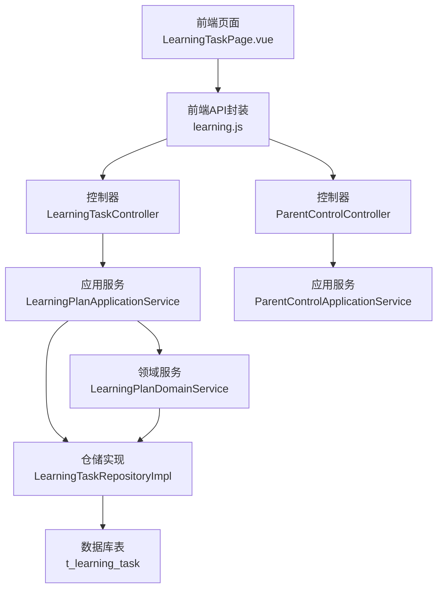
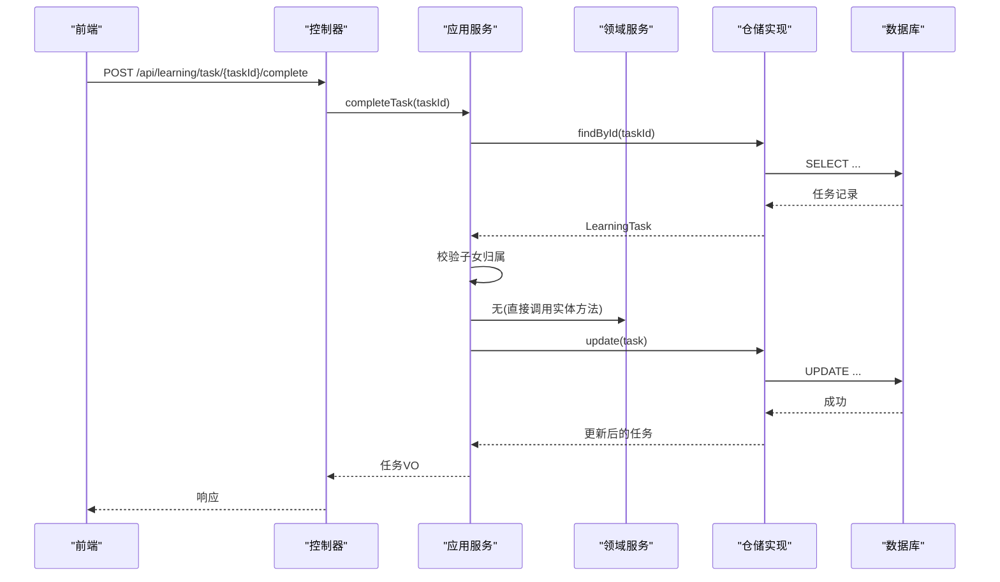
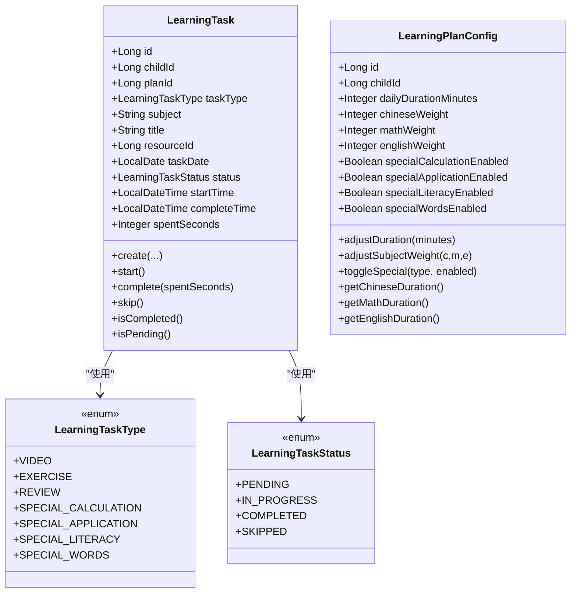
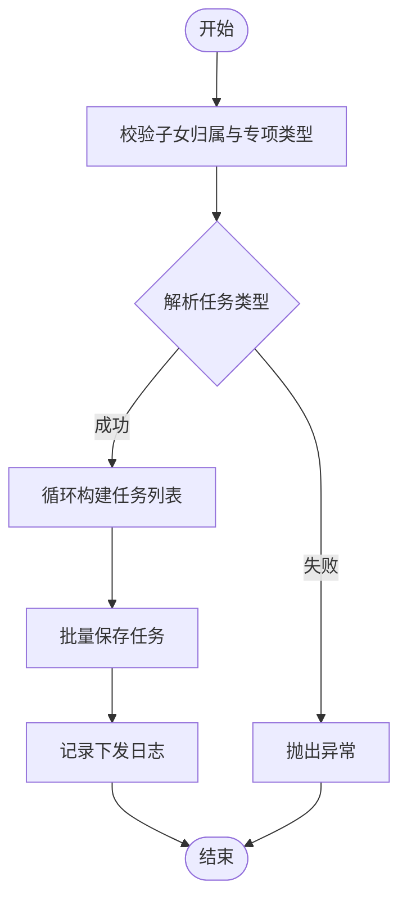
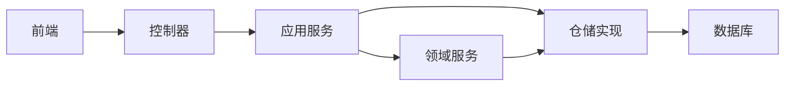

# 学习任务接口

<cite>
**本文引用的文件**
- [LearningTaskController.java](file://wzoto-backend/wzoto-interfaces/src/main/java/com/wzoto/interfaces/controller/LearningTaskController.java)
- [ParentControlController.java](file://wzoto-backend/wzoto-interfaces/src/main/java/com/wzoto/interfaces/controller/ParentControlController.java)
- [LearningPlanApplicationService.java](file://wzoto-backend/wzoto-application/src/main/java/com/wzoto/application/service/LearningPlanApplicationService.java)
- [ParentControlApplicationService.java](file://wzoto-backend/wzoto-application/src/main/java/com/wzoto/application/service/ParentControlApplicationService.java)
- [LearningTask.java](file://wzoto-backend/wzoto-domain/src/main/java/com/wzoto/domain/entity/LearningTask.java)
- [LearningPlanConfig.java](file://wzoto-backend/wzoto-domain/src/main/java/com/wzoto/domain/entity/LearningPlanConfig.java)
- [LearningTaskType.java](file://wzoto-backend/wzoto-domain/src/main/java/com/wzoto/domain/valobj/LearningTaskType.java)
- [LearningTaskStatus.java](file://wzoto-backend/wzoto-domain/src/main/java/com/wzoto/domain/valobj/LearningTaskStatus.java)
- [LearningPlanDomainService.java](file://wzoto-backend/wzoto-domain/src/main/java/com/wzoto/domain/service/LearningPlanDomainService.java)
- [LearningTaskRepositoryImpl.java](file://wzoto-backend/wzoto-infrastructure/src/main/java/com/wzoto/infrastructure/repository/LearningTaskRepositoryImpl.java)
- [t_learning_task.sql](file://wzoto-backend/sql/t_learning_task.sql)
- [learning.js](file://wzoto-frontend/src/api/learning.js)
- [LearningTaskPage.vue](file://wzoto-frontend/src/pages/learning/LearningTaskPage.vue)
</cite>

## 目录
1. [简介](#简介)
2. [项目结构](#项目结构)
3. [核心组件](#核心组件)
4. [架构总览](#架构总览)
5. [详细组件分析](#详细组件分析)
6. [依赖关系分析](#依赖关系分析)
7. [性能考虑](#性能考虑)
8. [故障排查指南](#故障排查指南)
9. [结论](#结论)
10. [附录：API 接口定义与数据模型](#附录api-接口定义与数据模型)

## 简介
本文件面向“家长管控学习任务”功能，提供端到端的 API 文档与实现说明。覆盖任务创建、批量分配、状态管理、完成确认等核心流程；阐述任务类型（视频学习、在线练习、阅读/复习等）的配置与管理；说明执行机制（优先级排序、时间调度、进度同步、完成验证）与效果评估（完成质量评分、学习效果分析、改进建议生成）。文档同时给出前后端调用路径与关键数据结构，便于快速集成与排错。

## 项目结构
后端采用分层架构：接口层（Controller）→ 应用服务（Application Service）→ 领域服务（Domain Service）→ 仓储实现（Infrastructure Repository），配合领域实体与值对象表达业务规则。前端通过统一的 HTTP 客户端封装调用后端接口，并在页面中组织任务列表与操作。

图表来源
- [LearningTaskController.java:18-62](file://wzoto-backend/wzoto-interfaces/src/main/java/com/wzoto/interfaces/controller/LearningTaskController.java#L18-L62)
- [ParentControlController.java:13-75](file://wzoto-backend/wzoto-interfaces/src/main/java/com/wzoto/interfaces/controller/ParentControlController.java#L13-L75)
- [LearningPlanApplicationService.java:1-68](file://wzoto-backend/wzoto-application/src/main/java/com/wzoto/application/service/LearningPlanApplicationService.java#L1-L68)
- [ParentControlApplicationService.java:1-44](file://wzoto-backend/wzoto-application/src/main/java/com/wzoto/application/service/ParentControlApplicationService.java#L1-L44)
- [LearningPlanDomainService.java:1-108](file://wzoto-backend/wzoto-domain/src/main/java/com/wzoto/domain/service/LearningPlanDomainService.java#L1-L108)
- [LearningTaskRepositoryImpl.java:1-125](file://wzoto-backend/wzoto-infrastructure/src/main/java/com/wzoto/infrastructure/repository/LearningTaskRepositoryImpl.java#L1-L125)
- [t_learning_task.sql:1-25](file://wzoto-backend/sql/t_learning_task.sql#L1-L25)

章节来源
- [LearningTaskController.java:18-62](file://wzoto-backend/wzoto-interfaces/src/main/java/com/wzoto/interfaces/controller/LearningTaskController.java#L18-L62)
- [ParentControlController.java:13-75](file://wzoto-backend/wzoto-interfaces/src/main/java/com/wzoto/interfaces/controller/ParentControlController.java#L13-L75)
- [LearningPlanApplicationService.java:1-68](file://wzoto-backend/wzoto-application/src/main/java/com/wzoto/application/service/LearningPlanApplicationService.java#L1-L68)
- [ParentControlApplicationService.java:1-44](file://wzoto-backend/wzoto-application/src/main/java/com/wzoto/application/service/ParentControlApplicationService.java#L1-L44)
- [LearningTaskRepositoryImpl.java:1-125](file://wzoto-backend/wzoto-infrastructure/src/main/java/com/wzoto/infrastructure/repository/LearningTaskRepositoryImpl.java#L1-L125)
- [t_learning_task.sql:1-25](file://wzoto-backend/sql/t_learning_task.sql#L1-L25)

## 核心组件
- 控制器层
  - 学习任务控制器：提供按子女查询任务列表、完成任务等接口。
  - 家长管控控制器：提供获取/保存管控配置、锁定/解锁设备能力。
- 应用服务层
  - 学习计划应用服务：负责权限校验、计划配置读写、专项任务下发、任务完成处理。
  - 家长管控应用服务：封装管控配置的读取、保存与锁屏/解锁逻辑。
- 领域层
  - 学习任务实体：定义任务字段与状态流转行为（开始、完成、跳过）。
  - 学习计划配置实体：维护每日时长、学科权重、专项开关等策略。
  - 值对象：任务类型枚举、任务状态枚举。
  - 领域服务：默认计划创建、配置更新、专项任务批量下发。
- 基础设施层
  - 仓储实现：任务记录的增删改查、分页与条件查询、批量写入。
- 数据库
  - 学习任务记录表：存储任务基础信息、状态、耗时、日期等。

章节来源
- [LearningTask.java:14-139](file://wzoto-backend/wzoto-domain/src/main/java/com/wzoto/domain/entity/LearningTask.java#L14-L139)
- [LearningPlanConfig.java:10-155](file://wzoto-backend/wzoto-domain/src/main/java/com/wzoto/domain/entity/LearningPlanConfig.java#L10-L155)
- [LearningTaskType.java:1-36](file://wzoto-backend/wzoto-domain/src/main/java/com/wzoto/domain/valobj/LearningTaskType.java#L1-L36)
- [LearningTaskStatus.java:1-33](file://wzoto-backend/wzoto-domain/src/main/java/com/wzoto/domain/valobj/LearningTaskStatus.java#L1-L33)
- [LearningPlanDomainService.java:1-108](file://wzoto-backend/wzoto-domain/src/main/java/com/wzoto/domain/service/LearningPlanDomainService.java#L1-L108)
- [LearningTaskRepositoryImpl.java:1-125](file://wzoto-backend/wzoto-infrastructure/src/main/java/com/wzoto/infrastructure/repository/LearningTaskRepositoryImpl.java#L1-L125)
- [t_learning_task.sql:1-25](file://wzoto-backend/sql/t_learning_task.sql#L1-L25)

## 架构总览
下图展示一次“完成任务”的完整调用链：前端发起请求 → 控制器接收并转发 → 应用服务进行权限校验与领域行为调用 → 仓储持久化 → 返回结果。

图表来源
- [LearningTaskController.java:37-42](file://wzoto-backend/wzoto-interfaces/src/main/java/com/wzoto/interfaces/controller/LearningTaskController.java#L37-L42)
- [LearningPlanApplicationService.java:56-66](file://wzoto-backend/wzoto-application/src/main/java/com/wzoto/application/service/LearningPlanApplicationService.java#L56-L66)
- [LearningTaskRepositoryImpl.java:65-70](file://wzoto-backend/wzoto-infrastructure/src/main/java/com/wzoto/infrastructure/repository/LearningTaskRepositoryImpl.java#L65-L70)
- [t_learning_task.sql:1-25](file://wzoto-backend/sql/t_learning_task.sql#L1-L25)

## 详细组件分析

### 学习任务控制器
- 职责
  - 列出某子女的学习任务（支持按日期筛选）。
  - 标记任务为已完成。
- 关键点
  - 将领域对象转换为视图对象返回给前端。
  - 记录完成事件埋点日志。

章节来源
- [LearningTaskController.java:29-42](file://wzoto-backend/wzoto-interfaces/src/main/java/com/wzoto/interfaces/controller/LearningTaskController.java#L29-L42)
- [LearningTaskController.java:44-60](file://wzoto-backend/wzoto-interfaces/src/main/java/com/wzoto/interfaces/controller/LearningTaskController.java#L44-L60)

### 家长管控控制器
- 职责
  - 获取/保存家长管控配置（每日时长限制、休息间隔、禁学时段、护眼模式、蓝光过滤、坐姿提醒等）。
  - 锁定/解锁设备。
- 关键点
  - 统一包装为 R 响应体。
  - 记录管控操作埋点日志。

章节来源
- [ParentControlController.java:24-57](file://wzoto-backend/wzoto-interfaces/src/main/java/com/wzoto/interfaces/controller/ParentControlController.java#L24-L57)
- [ParentControlController.java:59-73](file://wzoto-backend/wzoto-interfaces/src/main/java/com/wzoto/interfaces/controller/ParentControlController.java#L59-L73)

### 学习计划应用服务
- 职责
  - 获取/保存学习计划配置。
  - 按子女与日期查询任务。
  - 下发专项练习任务（批量）。
  - 完成任务（含权限校验与状态更新）。
- 关键点
  - 使用子域服务校验父子关系，确保越权保护。
  - 事务性操作保证一致性。

章节来源
- [LearningPlanApplicationService.java:28-41](file://wzoto-backend/wzoto-application/src/main/java/com/wzoto/application/service/LearningPlanApplicationService.java#L28-L41)
- [LearningPlanApplicationService.java:50-54](file://wzoto-backend/wzoto-application/src/main/java/com/wzoto/application/service/LearningPlanApplicationService.java#L50-L54)
- [LearningPlanApplicationService.java:56-66](file://wzoto-backend/wzoto-application/src/main/java/com/wzoto/application/service/LearningPlanApplicationService.java#L56-L66)

### 家长管控应用服务
- 职责
  - 获取或创建默认管控配置。
  - 保存管控配置。
  - 锁定/解锁设备。
- 关键点
  - 所有写操作均开启事务。

章节来源
- [ParentControlApplicationService.java:21-42](file://wzoto-backend/wzoto-application/src/main/java/com/wzoto/application/service/ParentControlApplicationService.java#L21-L42)

### 领域实体与值对象
- 学习任务实体
  - 提供创建、开始、完成、跳过等行为方法，内置状态机校验。
- 学习计划配置实体
  - 维护每日时长、学科权重、专项开关；提供计算各学科时长的方法。
- 值对象
  - 任务类型：视频学习、在线练习、复习巩固、计算专项、应用题专项、识字专项、背单词专项。
  - 任务状态：待完成、进行中、已完成、已跳过。

图表来源
- [LearningTask.java:14-139](file://wzoto-backend/wzoto-domain/src/main/java/com/wzoto/domain/entity/LearningTask.java#L14-L139)
- [LearningPlanConfig.java:10-155](file://wzoto-backend/wzoto-domain/src/main/java/com/wzoto/domain/entity/LearningPlanConfig.java#L10-L155)
- [LearningTaskType.java:1-36](file://wzoto-backend/wzoto-domain/src/main/java/com/wzoto/domain/valobj/LearningTaskType.java#L1-L36)
- [LearningTaskStatus.java:1-33](file://wzoto-backend/wzoto-domain/src/main/java/com/wzoto/domain/valobj/LearningTaskStatus.java#L1-L33)

章节来源
- [LearningTask.java:14-139](file://wzoto-backend/wzoto-domain/src/main/java/com/wzoto/domain/entity/LearningTask.java#L14-L139)
- [LearningPlanConfig.java:10-155](file://wzoto-backend/wzoto-domain/src/main/java/com/wzoto/domain/entity/LearningPlanConfig.java#L10-L155)
- [LearningTaskType.java:1-36](file://wzoto-backend/wzoto-domain/src/main/java/com/wzoto/domain/valobj/LearningTaskType.java#L1-L36)
- [LearningTaskStatus.java:1-33](file://wzoto-backend/wzoto-domain/src/main/java/com/wzoto/domain/valobj/LearningTaskStatus.java#L1-L33)

### 领域服务：专项任务下发
- 职责
  - 根据专项类型映射到具体任务类型与学科。
  - 批量创建任务并持久化。
- 关键点
  - 参数校验与默认数量处理。
  - 日志记录下发过程。

图表来源
- [LearningPlanDomainService.java:64-87](file://wzoto-backend/wzoto-domain/src/main/java/com/wzoto/domain/service/LearningPlanDomainService.java#L64-L87)
- [LearningPlanDomainService.java:89-106](file://wzoto-backend/wzoto-domain/src/main/java/com/wzoto/domain/service/LearningPlanDomainService.java#L89-L106)

章节来源
- [LearningPlanDomainService.java:64-106](file://wzoto-backend/wzoto-domain/src/main/java/com/wzoto/domain/service/LearningPlanDomainService.java#L64-L106)

### 仓储实现：任务记录
- 职责
  - 单条与批量插入、更新。
  - 按子女ID、日期、状态查询。
  - 实体与持久化对象转换。
- 关键点
  - 使用条件构造器组合查询。
  - 批量保存逐条插入（可优化为真正的批处理）。

章节来源
- [LearningTaskRepositoryImpl.java:26-83](file://wzoto-backend/wzoto-infrastructure/src/main/java/com/wzoto/infrastructure/repository/LearningTaskRepositoryImpl.java#L26-L83)
- [LearningTaskRepositoryImpl.java:85-123](file://wzoto-backend/wzoto-infrastructure/src/main/java/com/wzoto/infrastructure/repository/LearningTaskRepositoryImpl.java#L85-L123)

### 前端调用与页面
- 前端 API 封装
  - 学习计划、任务、报告、资源、管控、错题、播放进度、课程目录、成就等接口统一封装。
- 任务页面
  - 选择子女与日期加载任务列表。
  - 点击“完成”触发完成接口，成功后刷新列表。

章节来源
- [learning.js:5-26](file://wzoto-frontend/src/api/learning.js#L5-L26)
- [LearningTaskPage.vue:70-89](file://wzoto-frontend/src/pages/learning/LearningTaskPage.vue#L70-L89)

## 依赖关系分析
- 控制器依赖应用服务，应用服务依赖领域服务与仓储。
- 领域服务依赖仓储与子域服务进行权限校验。
- 仓储实现依赖 MyBatis Mapper 与数据库表结构。
- 前端通过 HTTP 客户端调用控制器暴露的 REST 接口。

图表来源
- [LearningTaskController.java:18-62](file://wzoto-backend/wzoto-interfaces/src/main/java/com/wzoto/interfaces/controller/LearningTaskController.java#L18-L62)
- [LearningPlanApplicationService.java:1-68](file://wzoto-backend/wzoto-application/src/main/java/com/wzoto/application/service/LearningPlanApplicationService.java#L1-L68)
- [LearningPlanDomainService.java:1-108](file://wzoto-backend/wzoto-domain/src/main/java/com/wzoto/domain/service/LearningPlanDomainService.java#L1-L108)
- [LearningTaskRepositoryImpl.java:1-125](file://wzoto-backend/wzoto-infrastructure/src/main/java/com/wzoto/infrastructure/repository/LearningTaskRepositoryImpl.java#L1-L125)
- [t_learning_task.sql:1-25](file://wzoto-backend/sql/t_learning_task.sql#L1-L25)

章节来源
- [LearningTaskController.java:18-62](file://wzoto-backend/wzoto-interfaces/src/main/java/com/wzoto/interfaces/controller/LearningTaskController.java#L18-L62)
- [LearningPlanApplicationService.java:1-68](file://wzoto-backend/wzoto-application/src/main/java/com/wzoto/application/service/LearningPlanApplicationService.java#L1-L68)
- [LearningPlanDomainService.java:1-108](file://wzoto-backend/wzoto-domain/src/main/java/com/wzoto/domain/service/LearningPlanDomainService.java#L1-L108)
- [LearningTaskRepositoryImpl.java:1-125](file://wzoto-backend/wzoto-infrastructure/src/main/java/com/wzoto/infrastructure/repository/LearningTaskRepositoryImpl.java#L1-L125)
- [t_learning_task.sql:1-25](file://wzoto-backend/sql/t_learning_task.sql#L1-L25)

## 性能考虑
- 查询优化
  - 按子女ID与日期查询时使用索引字段，避免全表扫描。
  - 列表接口建议增加分页与排序参数（当前实现按日期倒序/正序）。
- 批量写入
  - 专项任务下发采用循环插入，建议在大数据量场景下改为真正的批处理以减少网络往返。
- 事务边界
  - 写操作（保存配置、完成任务、下发任务）均在应用服务层加事务，保证一致性。
- 缓存建议
  - 学习计划配置与管控配置可引入本地缓存减少重复读取。
- 并发控制
  - 任务完成需防重入（领域实体已做状态校验），可在仓储层增加乐观锁或版本号提升并发安全。

[本节为通用指导，不直接分析具体文件]

## 故障排查指南
- 常见错误
  - 任务不存在：完成接口会抛出“任务不存在”异常。
  - 无权操作子女档案：下发或完成任务时若父子关系校验失败，抛出异常。
  - 无效的任务类型/状态：值对象解析失败时抛出异常。
  - 非法参数：如每日时长不在允许范围、权重总和为0等。
- 定位步骤
  - 检查请求路径与参数是否与前端一致。
  - 查看控制器与应用服务的日志输出（包含用户ID、子女ID、任务ID）。
  - 核对数据库中任务状态是否符合预期。
  - 检查领域实体的状态机是否允许当前操作。

章节来源
- [LearningPlanApplicationService.java:56-66](file://wzoto-backend/wzoto-application/src/main/java/com/wzoto/application/service/LearningPlanApplicationService.java#L56-L66)
- [LearningPlanDomainService.java:64-72](file://wzoto-backend/wzoto-domain/src/main/java/com/wzoto/domain/service/LearningPlanDomainService.java#L64-L72)
- [LearningTask.java:92-123](file://wzoto-backend/wzoto-domain/src/main/java/com/wzoto/domain/entity/LearningTask.java#L92-L123)
- [LearningTaskType.java:27-34](file://wzoto-backend/wzoto-domain/src/main/java/com/wzoto/domain/valobj/LearningTaskType.java#L27-L34)
- [LearningTaskStatus.java:24-31](file://wzoto-backend/wzoto-domain/src/main/java/com/wzoto/domain/valobj/LearningTaskStatus.java#L24-L31)

## 结论
本方案以领域驱动设计为核心，围绕“学习任务”构建了清晰的层次结构与严谨的状态机，支持家长对子女学习任务的创建、分配、跟踪与完成闭环管理。结合学习计划配置与家长管控能力，形成从策略制定到执行落地的完整体系。后续可在此基础上扩展更丰富的评估指标与智能推荐能力。

[本节为总结性内容，不直接分析具体文件]

## 附录：API 接口定义与数据模型

### 接口清单
- 学习任务
  - 获取任务列表
    - 方法：GET
    - 路径：/api/learning/tasks/{childId}
    - 查询参数：date（可选，格式 YYYY-MM-DD）
    - 响应：任务列表（包含任务类型、学科、标题、状态、时间戳、耗时等）
  - 完成任务
    - 方法：POST
    - 路径：/api/learning/task/{taskId}/complete
    - 响应：更新后的任务视图对象
- 家长管控
  - 获取管控配置
    - 方法：GET
    - 路径：/api/learning/control/{childId}
    - 响应：管控配置视图对象
  - 保存管控配置
    - 方法：POST
    - 路径：/api/learning/control/{childId}
    - 请求体：管控配置（每日时长限制、休息间隔、禁学时段、护眼模式、蓝光过滤、坐姿提醒等）
    - 响应：保存后的配置
  - 锁定设备
    - 方法：POST
    - 路径：/api/learning/control/{childId}/lock
    - 响应：更新后的配置
  - 解锁设备
    - 方法：POST
    - 路径：/api/learning/control/{childId}/unlock
    - 响应：更新后的配置
- 学习计划（关联）
  - 获取计划配置
    - 方法：GET
    - 路径：/api/learning/plan/{childId}
    - 响应：学习计划配置
  - 保存计划配置
    - 方法：POST
    - 路径：/api/learning/plan/{childId}
    - 请求体：计划配置（每日时长、学科权重、专项开关）
    - 响应：保存后的配置
  - 下发专项任务
    - 方法：POST
    - 路径：/api/learning/plan/{childId}/special-task
    - 请求体：专项类型与数量
    - 响应：下发的任务列表

章节来源
- [LearningTaskController.java:29-42](file://wzoto-backend/wzoto-interfaces/src/main/java/com/wzoto/interfaces/controller/LearningTaskController.java#L29-L42)
- [ParentControlController.java:24-57](file://wzoto-backend/wzoto-interfaces/src/main/java/com/wzoto/interfaces/controller/ParentControlController.java#L24-L57)
- [LearningPlanApplicationService.java:28-54](file://wzoto-backend/wzoto-application/src/main/java/com/wzoto/application/service/LearningPlanApplicationService.java#L28-L54)
- [learning.js:5-26](file://wzoto-frontend/src/api/learning.js#L5-L26)

### 数据模型
- 学习任务记录表
  - 字段：id、child_id、plan_config_id、task_type、subject、title、content、resource_id、status、assigned_date、completed_at、deleted、created_at、updated_at
  - 索引：child_id、assigned_date、status、child_id+assigned_date、child_id+status
- 学习计划配置
  - 字段：id、child_id、daily_duration_minutes、chinese_weight、math_weight、english_weight、special_calculation_enabled、special_application_enabled、special_literacy_enabled、special_words_enabled、deleted、created_at、updated_at
- 值对象
  - 任务类型：VIDEO、EXERCISE、REVIEW、SPECIAL_CALCULATION、SPECIAL_APPLICATION、SPECIAL_LITERACY、SPECIAL_WORDS
  - 任务状态：PENDING、IN_PROGRESS、COMPLETED、SKIPPED

章节来源
- [t_learning_task.sql:1-25](file://wzoto-backend/sql/t_learning_task.sql#L1-L25)
- [LearningPlanConfig.java:10-155](file://wzoto-backend/wzoto-domain/src/main/java/com/wzoto/domain/entity/LearningPlanConfig.java#L10-L155)
- [LearningTaskType.java:1-36](file://wzoto-backend/wzoto-domain/src/main/java/com/wzoto/domain/valobj/LearningTaskType.java#L1-L36)
- [LearningTaskStatus.java:1-33](file://wzoto-backend/wzoto-domain/src/main/java/com/wzoto/domain/valobj/LearningTaskStatus.java#L1-L33)

### 执行机制说明
- 任务优先级排序
  - 当前实现未显式实现优先级队列，可通过任务类型与学科权重在查询层排序（例如优先显示未完成的高权重学科任务）。
- 时间调度
  - 任务日期用于区分不同日期的任务集合；可按 assigned_date 进行调度与统计。
- 进度同步
  - 前端通过播放进度接口上报观看进度，可用于辅助判断任务完成度（与任务完成状态解耦）。
- 完成验证
  - 领域实体在完成任务前进行状态校验，防止重复完成或非法状态迁移。

章节来源
- [LearningTaskRepositoryImpl.java:41-63](file://wzoto-backend/wzoto-infrastructure/src/main/java/com/wzoto/infrastructure/repository/LearningTaskRepositoryImpl.java#L41-L63)
- [LearningTask.java:100-123](file://wzoto-backend/wzoto-domain/src/main/java/com/wzoto/domain/entity/LearningTask.java#L100-L123)

### 效果评估（规划与建议）
- 完成质量评分
  - 基于练习正确率、视频观看完成率、用时合理性等维度综合打分。
- 学习效果分析
  - 按学科与知识点聚合完成数据，识别薄弱点与进步趋势。
- 改进建议生成
  - 结合 AI 能力生成个性化学习建议与下一步任务推荐。

[本节为概念性内容，不直接分析具体文件]