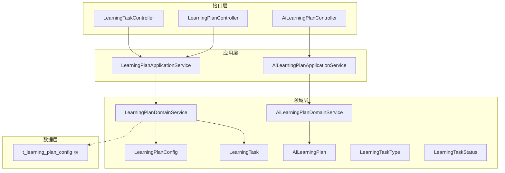
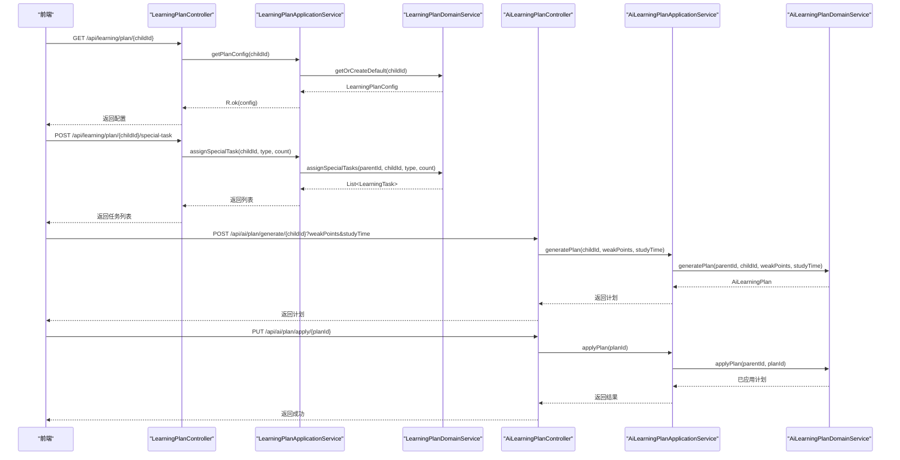
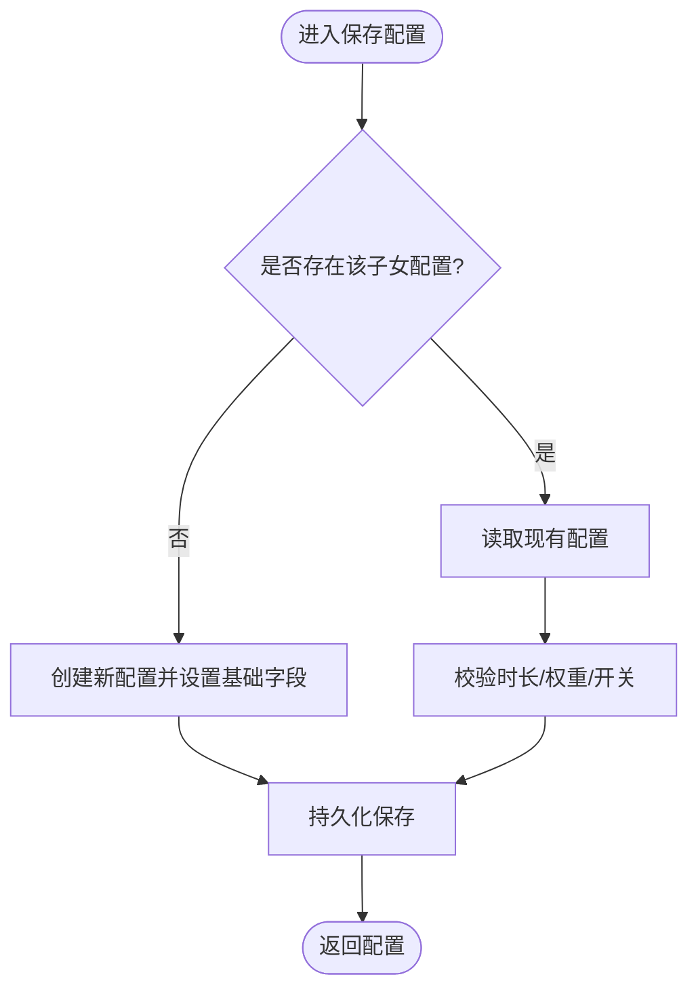
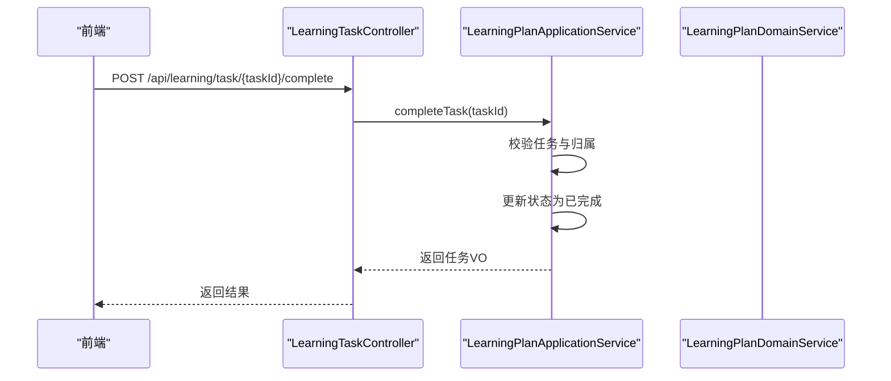
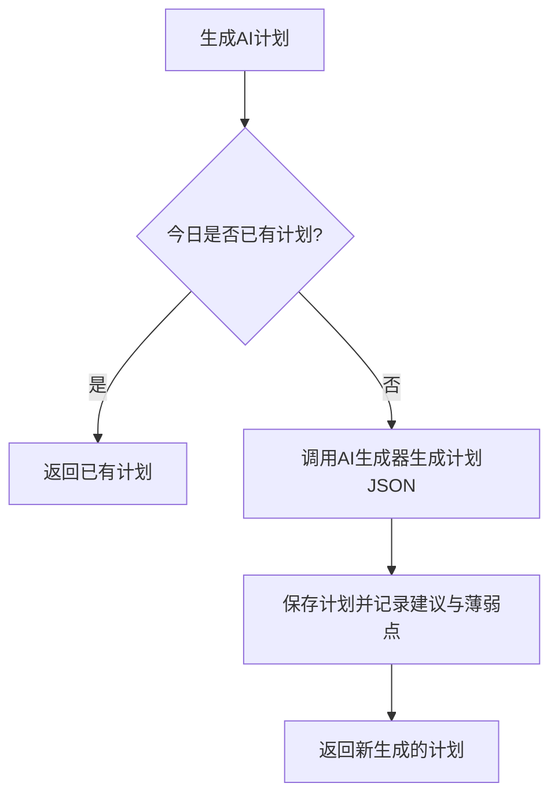
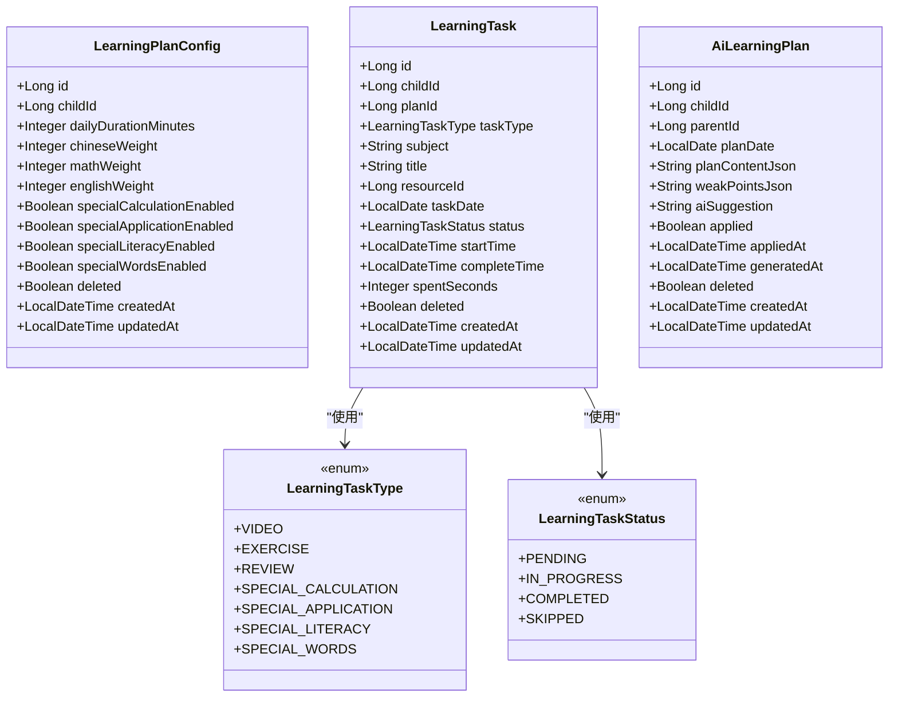
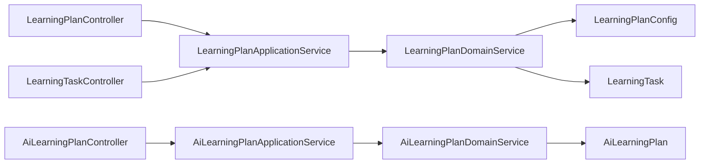

# 学习计划接口

<cite>
**本文引用的文件**
- [LearningPlanController.java](file://wzoto-backend/wzoto-interfaces/src/main/java/com/wzoto/interfaces/controller/LearningPlanController.java)
- [LearningTaskController.java](file://wzoto-backend/wzoto-interfaces/src/main/java/com/wzoto/interfaces/controller/LearningTaskController.java)
- [AiLearningPlanController.java](file://wzoto-backend/wzoto-interfaces/src/main/java/com/wzoto/interfaces/controller/AiLearningPlanController.java)
- [LearningPlanApplicationService.java](file://wzoto-backend/wzoto-application/src/main/java/com/wzoto/application/service/LearningPlanApplicationService.java)
- [AiLearningPlanApplicationService.java](file://wzoto-backend/wzoto-application/src/main/java/com/wzoto/application/service/AiLearningPlanApplicationService.java)
- [LearningPlanDomainService.java](file://wzoto-backend/wzoto-domain/src/main/java/com/wzoto/domain/service/LearningPlanDomainService.java)
- [AiLearningPlanDomainService.java](file://wzoto-backend/wzoto-domain/src/main/java/com/wzoto/domain/service/AiLearningPlanDomainService.java)
- [LearningPlanConfig.java](file://wzoto-backend/wzoto-domain/src/main/java/com/wzoto/domain/entity/LearningPlanConfig.java)
- [LearningTask.java](file://wzoto-backend/wzoto-domain/src/main/java/com/wzoto/domain/entity/LearningTask.java)
- [AiLearningPlan.java](file://wzoto-backend/wzoto-domain/src/main/java/com/wzoto/domain/entity/AiLearningPlan.java)
- [LearningTaskType.java](file://wzoto-backend/wzoto-domain/src/main/java/com/wzoto/domain/valobj/LearningTaskType.java)
- [LearningTaskStatus.java](file://wzoto-backend/wzoto-domain/src/main/java/com/wzoto/domain/valobj/LearningTaskStatus.java)
- [LearningPlanConfigDTO.java](file://wzoto-backend/wzoto-interfaces/src/main/java/com/wzoto/interfaces/dto/larning/LearningPlanConfigDTO.java)
- [CreateTaskDTO.java](file://wzoto-backend/wzoto-interfaces/src/main/java/com/wzoto/interfaces/dto/larning/CreateTaskDTO.java)
- [t_learning_plan_config.sql](file://wzoto-backend/sql/t_learning_plan_config.sql)
</cite>

## 目录
1. [简介](#简介)
2. [项目结构](#项目结构)
3. [核心组件](#核心组件)
4. [架构总览](#架构总览)
5. [详细组件分析](#详细组件分析)
6. [依赖关系分析](#依赖关系分析)
7. [性能考虑](#性能考虑)
8. [故障排查指南](#故障排查指南)
9. [结论](#结论)
10. [附录：API 定义与数据模型](#附录api-定义与数据模型)

## 简介
本文件面向家长管控“学习计划”功能的完整 API 文档，覆盖计划制定、任务分配、进度跟踪与智能推荐等核心能力。内容包括：
- 学习计划配置：科目安排、时间安排、难度设置等规则
- 操作流程：创建/修改/删除（通过配置更新体现）、查看状态
- 智能推荐机制：基于学生能力的个性化计划生成、知识点关联分析与学习路径优化
- 执行监控：完成度统计、进度更新、异常处理

## 项目结构
后端采用分层架构：接口层（Controller）→ 应用服务（Application Service）→ 领域服务（Domain Service）→ 仓储/实体/值对象。学习计划相关的主要模块如下：
- 接口层：学习计划、学习任务、AI 学习计划控制器
- 应用层：学习计划应用服务、AI 学习计划应用服务
- 领域层：学习计划配置、学习任务、AI 学习计划实体；任务类型与状态值对象；领域服务
- 数据层：学习计划配置表 DDL

图表来源
- [LearningPlanController.java:20-78](file://wzoto-backend/wzoto-interfaces/src/main/java/com/wzoto/interfaces/controller/LearningPlanController.java#L20-L78)
- [LearningTaskController.java:18-62](file://wzoto-backend/wzoto-interfaces/src/main/java/com/wzoto/interfaces/controller/LearningTaskController.java#L18-L62)
- [AiLearningPlanController.java:13-47](file://wzoto-backend/wzoto-interfaces/src/main/java/com/wzoto/interfaces/controller/AiLearningPlanController.java#L13-L47)
- [LearningPlanApplicationService.java:16-68](file://wzoto-backend/wzoto-application/src/main/java/com/wzoto/application/service/LearningPlanApplicationService.java#L16-L68)
- [AiLearningPlanApplicationService.java:12-40](file://wzoto-backend/wzoto-application/src/main/java/com/wzoto/application/service/AiLearningPlanApplicationService.java#L12-L40)
- [LearningPlanDomainService.java:18-108](file://wzoto-backend/wzoto-domain/src/main/java/com/wzoto/domain/service/LearningPlanDomainService.java#L18-L108)
- [AiLearningPlanDomainService.java:15-91](file://wzoto-backend/wzoto-domain/src/main/java/com/wzoto/domain/service/AiLearningPlanDomainService.java#L15-L91)
- [t_learning_plan_config.sql:1-22](file://wzoto-backend/sql/t_learning_plan_config.sql#L1-L22)

章节来源
- [LearningPlanController.java:20-78](file://wzoto-backend/wzoto-interfaces/src/main/java/com/wzoto/interfaces/controller/LearningPlanController.java#L20-L78)
- [LearningTaskController.java:18-62](file://wzoto-backend/wzoto-interfaces/src/main/java/com/wzoto/interfaces/controller/LearningTaskController.java#L18-L62)
- [AiLearningPlanController.java:13-47](file://wzoto-backend/wzoto-interfaces/src/main/java/com/wzoto/interfaces/controller/AiLearningPlanController.java#L13-L47)

## 核心组件
- 学习计划配置（LearningPlanConfig）：维护每日学习时长、学科权重、专项练习开关，提供默认配置与时长/权重计算行为
- 学习任务（LearningTask）：记录任务类型、学科、资源、日期、状态、耗时等，支持开始、完成、跳过等状态流转
- AI 学习计划（AiLearningPlan）：存储 AI 生成的每日计划内容、薄弱点与建议，支持标记已应用
- 领域服务：负责计划配置保存、专项任务下发、AI 计划生成与应用、权限校验等
- 应用服务：编排调用领域服务，统一鉴权与事务边界
- 控制器：暴露 RESTful 接口，接收 DTO，返回 VO

章节来源
- [LearningPlanConfig.java:10-155](file://wzoto-backend/wzoto-domain/src/main/java/com/wzoto/domain/entity/LearningPlanConfig.java#L10-L155)
- [LearningTask.java:14-139](file://wzoto-backend/wzoto-domain/src/main/java/com/wzoto/domain/entity/LearningTask.java#L14-L139)
- [AiLearningPlan.java:11-56](file://wzoto-backend/wzoto-domain/src/main/java/com/wzoto/domain/entity/AiLearningPlan.java#L11-L56)
- [LearningPlanDomainService.java:18-108](file://wzoto-backend/wzoto-domain/src/main/java/com/wzoto/domain/service/LearningPlanDomainService.java#L18-L108)
- [AiLearningPlanDomainService.java:15-91](file://wzoto-backend/wzoto-domain/src/main/java/com/wzoto/domain/service/AiLearningPlanDomainService.java#L15-L91)
- [LearningPlanApplicationService.java:16-68](file://wzoto-backend/wzoto-application/src/main/java/com/wzoto/application/service/LearningPlanApplicationService.java#L16-L68)
- [AiLearningPlanApplicationService.java:12-40](file://wzoto-backend/wzoto-application/src/main/java/com/wzoto/application/service/AiLearningPlanApplicationService.java#L12-L40)

## 架构总览
下图展示从前端到后端的请求链路，涵盖计划配置、任务下发与完成、AI 计划生成与应用。

图表来源
- [LearningPlanController.java:31-58](file://wzoto-backend/wzoto-interfaces/src/main/java/com/wzoto/interfaces/controller/LearningPlanController.java#L31-L58)
- [LearningPlanApplicationService.java:28-54](file://wzoto-backend/wzoto-application/src/main/java/com/wzoto/application/service/LearningPlanApplicationService.java#L28-L54)
- [LearningPlanDomainService.java:30-87](file://wzoto-backend/wzoto-domain/src/main/java/com/wzoto/domain/service/LearningPlanDomainService.java#L30-L87)
- [AiLearningPlanController.java:22-45](file://wzoto-backend/wzoto-interfaces/src/main/java/com/wzoto/interfaces/controller/AiLearningPlanController.java#L22-L45)
- [AiLearningPlanApplicationService.java:20-38](file://wzoto-backend/wzoto-application/src/main/java/com/wzoto/application/service/AiLearningPlanApplicationService.java#L20-L38)
- [AiLearningPlanDomainService.java:30-74](file://wzoto-backend/wzoto-domain/src/main/java/com/wzoto/domain/service/AiLearningPlanDomainService.java#L30-L74)

## 详细组件分析

### 学习计划配置管理
- 获取配置：根据子女 ID 获取或创建默认配置，包含每日学习时长与学科权重
- 保存配置：更新每日时长、学科权重与专项练习开关；若不存在则新建
- 业务规则：
  - 每日时长范围限制
  - 学科权重总和需大于 0
  - 专项练习可独立开关

图表来源
- [LearningPlanDomainService.java:43-59](file://wzoto-backend/wzoto-domain/src/main/java/com/wzoto/domain/service/LearningPlanDomainService.java#L43-L59)
- [LearningPlanConfig.java:61-103](file://wzoto-backend/wzoto-domain/src/main/java/com/wzoto/domain/entity/LearningPlanConfig.java#L61-L103)

章节来源
- [LearningPlanController.java:31-51](file://wzoto-backend/wzoto-interfaces/src/main/java/com/wzoto/interfaces/controller/LearningPlanController.java#L31-L51)
- [LearningPlanApplicationService.java:28-48](file://wzoto-backend/wzoto-application/src/main/java/com/wzoto/application/service/LearningPlanApplicationService.java#L28-L48)
- [LearningPlanDomainService.java:30-59](file://wzoto-backend/wzoto-domain/src/main/java/com/wzoto/domain/service/LearningPlanDomainService.java#L30-L59)
- [LearningPlanConfig.java:61-103](file://wzoto-backend/wzoto-domain/src/main/java/com/wzoto/domain/entity/LearningPlanConfig.java#L61-L103)

### 任务下发与完成
- 专项任务下发：按专项类型与数量批量创建学习任务，绑定今日日期与对应学科
- 任务完成：校验任务存在性与归属权，更新状态为已完成并记录完成时间与耗时

图表来源
- [LearningTaskController.java:37-42](file://wzoto-backend/wzoto-interfaces/src/main/java/com/wzoto/interfaces/controller/LearningTaskController.java#L37-L42)
- [LearningPlanApplicationService.java:56-66](file://wzoto-backend/wzoto-application/src/main/java/com/wzoto/application/service/LearningPlanApplicationService.java#L56-L66)
- [LearningTask.java:100-112](file://wzoto-backend/wzoto-domain/src/main/java/com/wzoto/domain/entity/LearningTask.java#L100-L112)

章节来源
- [LearningPlanController.java:53-58](file://wzoto-backend/wzoto-interfaces/src/main/java/com/wzoto/interfaces/controller/LearningPlanController.java#L53-L58)
- [LearningPlanDomainService.java:61-87](file://wzoto-backend/wzoto-domain/src/main/java/com/wzoto/domain/service/LearningPlanDomainService.java#L61-L87)
- [LearningTaskController.java:29-42](file://wzoto-backend/wzoto-interfaces/src/main/java/com/wzoto/interfaces/controller/LearningTaskController.java#L29-L42)
- [LearningTask.java:71-123](file://wzoto-backend/wzoto-domain/src/main/java/com/wzoto/domain/entity/LearningTask.java#L71-L123)

### 智能推荐机制（AI 学习计划）
- 生成计划：基于学生姓名、年级、薄弱点与学习时间，调用 AI 生成器产出当日计划 JSON 并落库
- 获取今日计划：查询当天是否已有计划
- 应用计划：将计划标记为已应用，便于后续联动任务生成与追踪
- 历史查询：按子女维度查询历史计划

图表来源
- [AiLearningPlanDomainService.java:30-51](file://wzoto-backend/wzoto-domain/src/main/java/com/wzoto/domain/service/AiLearningPlanDomainService.java#L30-L51)
- [AiLearningPlanController.java:22-34](file://wzoto-backend/wzoto-interfaces/src/main/java/com/wzoto/interfaces/controller/AiLearningPlanController.java#L22-L34)
- [AiLearningPlanApplicationService.java:20-28](file://wzoto-backend/wzoto-application/src/main/java/com/wzoto/application/service/AiLearningPlanApplicationService.java#L20-L28)

章节来源
- [AiLearningPlanController.java:22-45](file://wzoto-backend/wzoto-interfaces/src/main/java/com/wzoto/interfaces/controller/AiLearningPlanController.java#L22-L45)
- [AiLearningPlanApplicationService.java:20-38](file://wzoto-backend/wzoto-application/src/main/java/com/wzoto/application/service/AiLearningPlanApplicationService.java#L20-L38)
- [AiLearningPlanDomainService.java:30-82](file://wzoto-backend/wzoto-domain/src/main/java/com/wzoto/domain/service/AiLearningPlanDomainService.java#L30-L82)
- [AiLearningPlan.java:19-56](file://wzoto-backend/wzoto-domain/src/main/java/com/wzoto/domain/entity/AiLearningPlan.java#L19-L56)

### 数据模型与枚举
- 学习计划配置：包含每日时长、学科权重、专项开关、软删除与时间戳
- 学习任务：包含任务类型、学科、资源、日期、状态、耗时等
- 任务类型：微课、练习、复习、专项（计算/应用题/识字/背单词）
- 任务状态：待完成、进行中、已完成、已跳过

图表来源
- [LearningPlanConfig.java:10-155](file://wzoto-backend/wzoto-domain/src/main/java/com/wzoto/domain/entity/LearningPlanConfig.java#L10-L155)
- [LearningTask.java:14-139](file://wzoto-backend/wzoto-domain/src/main/java/com/wzoto/domain/entity/LearningTask.java#L14-L139)
- [AiLearningPlan.java:11-56](file://wzoto-backend/wzoto-domain/src/main/java/com/wzoto/domain/entity/AiLearningPlan.java#L11-L56)
- [LearningTaskType.java:8-36](file://wzoto-backend/wzoto-domain/src/main/java/com/wzoto/domain/valobj/LearningTaskType.java#L8-L36)
- [LearningTaskStatus.java:8-33](file://wzoto-backend/wzoto-domain/src/main/java/com/wzoto/domain/valobj/LearningTaskStatus.java#L8-L33)

## 依赖关系分析
- 控制器依赖应用服务，应用服务依赖领域服务，领域服务依赖仓储与实体
- 学习计划配置与任务通过子女维度进行关联，确保数据隔离
- AI 计划与学习任务解耦，通过“应用”动作建立关联关系
- 权限校验在应用/领域层统一进行，避免越权访问

图表来源
- [LearningPlanController.java:20-78](file://wzoto-backend/wzoto-interfaces/src/main/java/com/wzoto/interfaces/controller/LearningPlanController.java#L20-L78)
- [LearningTaskController.java:18-62](file://wzoto-backend/wzoto-interfaces/src/main/java/com/wzoto/interfaces/controller/LearningTaskController.java#L18-L62)
- [AiLearningPlanController.java:13-47](file://wzoto-backend/wzoto-interfaces/src/main/java/com/wzoto/interfaces/controller/AiLearningPlanController.java#L13-L47)
- [LearningPlanApplicationService.java:16-68](file://wzoto-backend/wzoto-application/src/main/java/com/wzoto/application/service/LearningPlanApplicationService.java#L16-L68)
- [AiLearningPlanApplicationService.java:12-40](file://wzoto-backend/wzoto-application/src/main/java/com/wzoto/application/service/AiLearningPlanApplicationService.java#L12-L40)
- [LearningPlanDomainService.java:18-108](file://wzoto-backend/wzoto-domain/src/main/java/com/wzoto/domain/service/LearningPlanDomainService.java#L18-L108)
- [AiLearningPlanDomainService.java:15-91](file://wzoto-backend/wzoto-domain/src/main/java/com/wzoto/domain/service/AiLearningPlanDomainService.java#L15-L91)

章节来源
- [LearningPlanDomainService.java:18-108](file://wzoto-backend/wzoto-domain/src/main/java/com/wzoto/domain/service/LearningPlanDomainService.java#L18-L108)
- [AiLearningPlanDomainService.java:15-91](file://wzoto-backend/wzoto-domain/src/main/java/com/wzoto/domain/service/AiLearningPlanDomainService.java#L15-L91)

## 性能考虑
- 批量下发专项任务：通过批量保存减少数据库往返
- 计划生成幂等：同日内重复生成直接返回已有计划，避免重复计算
- 配置更新原子性：使用事务保证时长、权重与开关的一致性
- 索引设计：配置表按 child_id 唯一索引，提升查询效率

[本节为通用性能建议，不直接分析具体代码文件]

## 故障排查指南
- 任务不存在：完成接口会抛出参数非法异常，检查 taskId 是否正确
- 无权操作：当父子关系校验失败时抛出非法参数异常，确认当前用户是否为该子女的家长
- 无效的任务状态/类型：枚举转换失败会抛异常，检查传入的 code 是否在允许范围内
- 计划未生成：若今日已有计划，再次生成将返回已有计划；如需重新生成，先应用或等待次日

章节来源
- [LearningPlanApplicationService.java:56-66](file://wzoto-backend/wzoto-application/src/main/java/com/wzoto/application/service/LearningPlanApplicationService.java#L56-L66)
- [LearningTask.java:92-123](file://wzoto-backend/wzoto-domain/src/main/java/com/wzoto/domain/entity/LearningTask.java#L92-L123)
- [LearningTaskType.java:27-34](file://wzoto-backend/wzoto-domain/src/main/java/com/wzoto/domain/valobj/LearningTaskType.java#L27-L34)
- [LearningTaskStatus.java:24-31](file://wzoto-backend/wzoto-domain/src/main/java/com/wzoto/domain/valobj/LearningTaskStatus.java#L24-L31)
- [AiLearningPlanDomainService.java:30-51](file://wzoto-backend/wzoto-domain/src/main/java/com/wzoto/domain/service/AiLearningPlanDomainService.java#L30-L51)

## 结论
本方案通过清晰的层次划分与领域建模，实现了家长端学习计划的配置、任务下发与完成、以及 AI 智能推荐的全流程闭环。配置项灵活可控，任务状态流转严谨，AI 计划具备幂等与可追溯特性，满足日常教学管理与个性化学习需求。

## 附录：API 定义与数据模型

### 接口清单
- 学习计划配置
  - 获取配置：GET /api/learning/plan/{childId}
  - 保存配置：POST /api/learning/plan/{childId}
  - 下发专项任务：POST /api/learning/plan/{childId}/special-task
- 学习任务
  - 查询任务列表：GET /api/learning/tasks/{childId}?date=YYYY-MM-DD
  - 完成任务：POST /api/learning/task/{taskId}/complete
- AI 学习计划
  - 生成计划：POST /api/ai/plan/generate/{childId}?weakPoints=...&studyTime=...
  - 获取今日计划：GET /api/ai/plan/today/{childId}
  - 应用计划：PUT /api/ai/plan/apply/{planId}
  - 查询历史：GET /api/ai/plan/history/{childId}

章节来源
- [LearningPlanController.java:31-58](file://wzoto-backend/wzoto-interfaces/src/main/java/com/wzoto/interfaces/controller/LearningPlanController.java#L31-L58)
- [LearningTaskController.java:29-42](file://wzoto-backend/wzoto-interfaces/src/main/java/com/wzoto/interfaces/controller/LearningTaskController.java#L29-L42)
- [AiLearningPlanController.java:22-45](file://wzoto-backend/wzoto-interfaces/src/main/java/com/wzoto/interfaces/controller/AiLearningPlanController.java#L22-L45)

### 请求/响应要点
- 学习计划配置 DTO：包含每日时长、学科权重、专项开关
- 专项任务 DTO：包含专项类型与数量
- 任务列表：返回任务类型、学科、标题、资源、日期、状态、耗时等
- AI 计划：返回计划内容 JSON、薄弱点、建议、是否已应用

章节来源
- [LearningPlanConfigDTO.java:5-24](file://wzoto-backend/wzoto-interfaces/src/main/java/com/wzoto/interfaces/dto/larning/LearningPlanConfigDTO.java#L5-L24)
- [CreateTaskDTO.java:6-14](file://wzoto-backend/wzoto-interfaces/src/main/java/com/wzoto/interfaces/dto/larning/CreateTaskDTO.java#L6-L14)
- [LearningTask.java:24-67](file://wzoto-backend/wzoto-domain/src/main/java/com/wzoto/domain/entity/LearningTask.java#L24-L67)
- [AiLearningPlan.java:19-56](file://wzoto-backend/wzoto-domain/src/main/java/com/wzoto/domain/entity/AiLearningPlan.java#L19-L56)

### 数据模型（DDL 摘要）
- 学习计划配置表：包含子女 ID、每日时长、学科权重、专项开关、自动生成标志、软删除与时间戳

章节来源
- [t_learning_plan_config.sql:4-21](file://wzoto-backend/sql/t_learning_plan_config.sql#L4-L21)