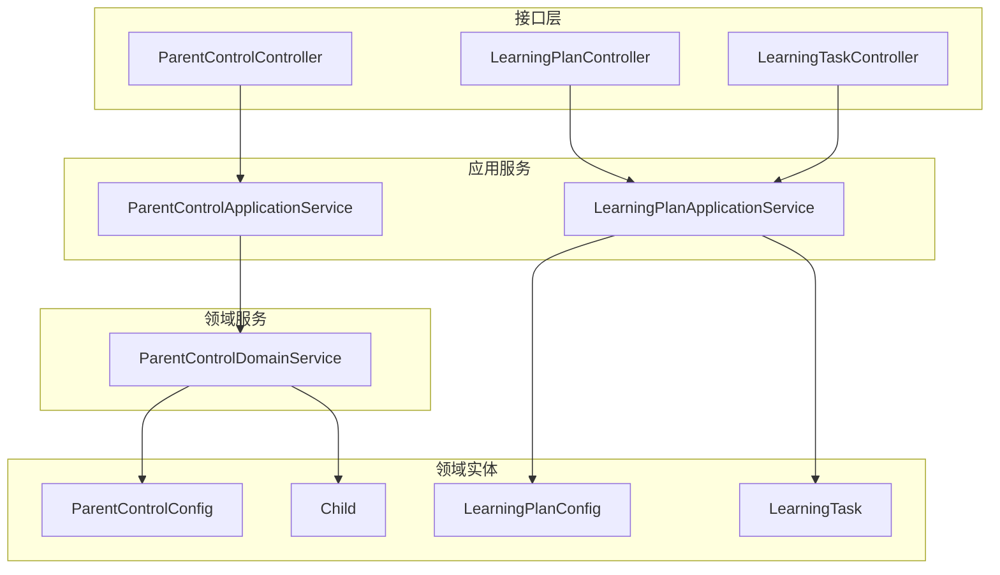
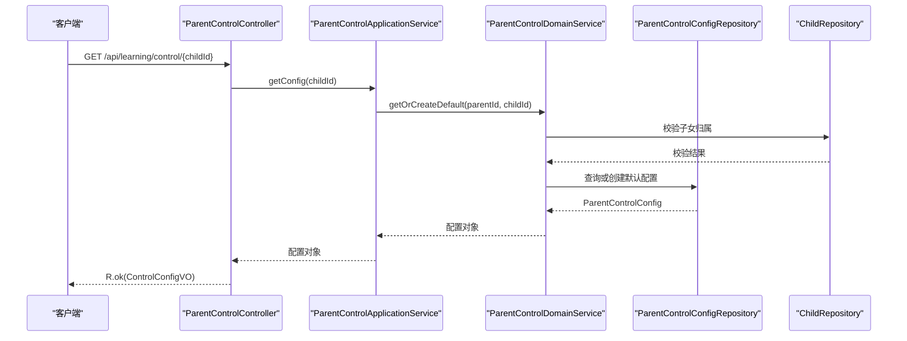
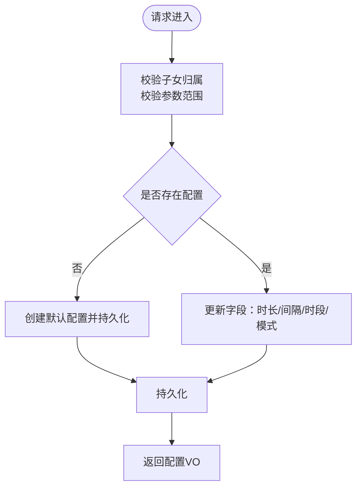
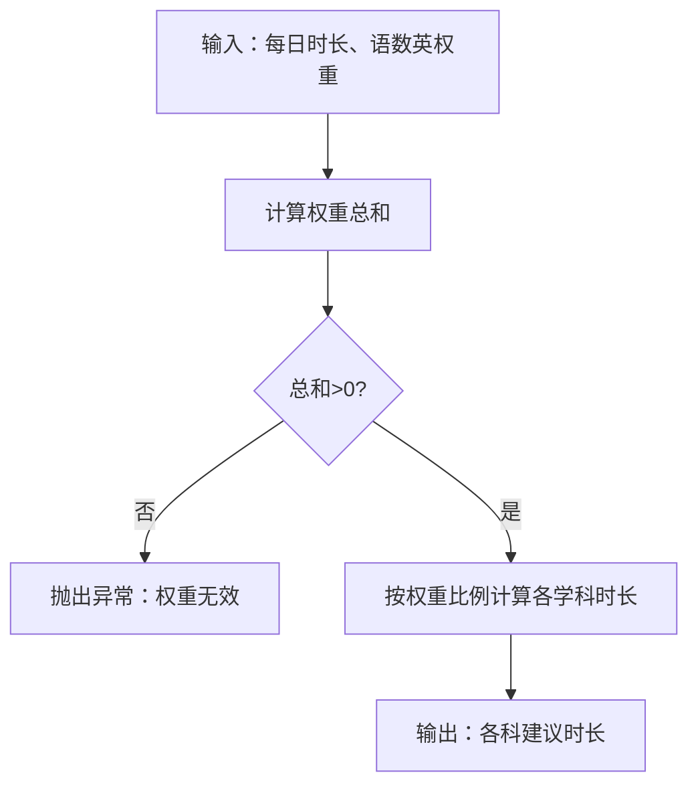
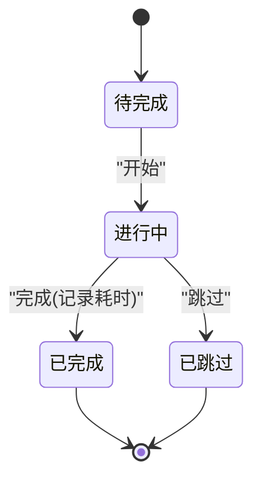
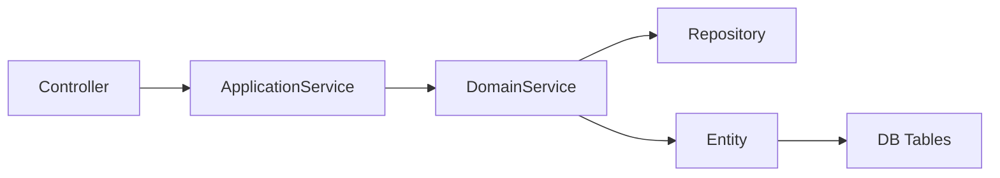
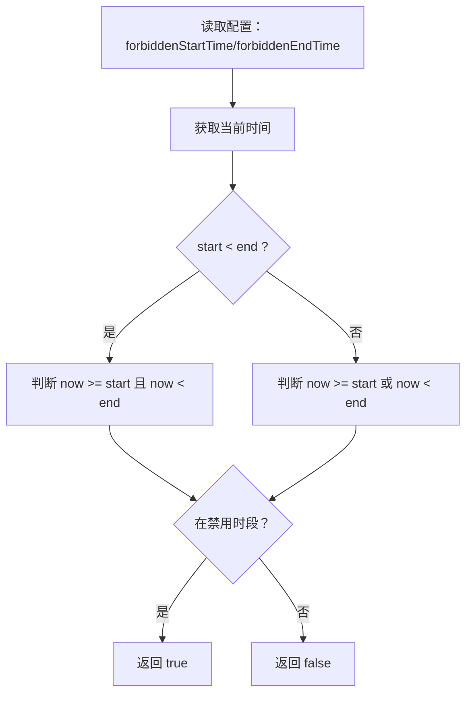

# 家长管控接口

<cite>
**本文引用的文件**
- [ParentControlController.java](file://wzoto-backend/wzoto-interfaces/src/main/java/com/wzoto/interfaces/controller/ParentControlController.java)
- [ParentControlApplicationService.java](file://wzoto-backend/wzoto-application/src/main/java/com/wzoto/application/service/ParentControlApplicationService.java)
- [ParentControlDomainService.java](file://wzoto-backend/wzoto-domain/src/main/java/com/wzoto/domain/service/ParentControlDomainService.java)
- [ParentControlConfig.java](file://wzoto-backend/wzoto-domain/src/main/java/com/wzoto/domain/entity/ParentControlConfig.java)
- [LearningPlanController.java](file://wzoto-backend/wzoto-interfaces/src/main/java/com/wzoto/interfaces/controller/LearningPlanController.java)
- [LearningPlanApplicationService.java](file://wzoto-backend/wzoto-application/src/main/java/com/wzoto/application/service/LearningPlanApplicationService.java)
- [LearningTaskController.java](file://wzoto-backend/wzoto-interfaces/src/main/java/com/wzoto/interfaces/controller/LearningTaskController.java)
- [LearningPlanConfig.java](file://wzoto-backend/wzoto-domain/src/main/java/com/wzoto/domain/entity/LearningPlanConfig.java)
- [LearningTask.java](file://wzoto-backend/wzoto-domain/src/main/java/com/wzoto/domain/entity/LearningTask.java)
- [Child.java](file://wzoto-backend/wzoto-domain/src/main/java/com/wzoto/domain/entity/Child.java)
- [ControlConfigDTO.java](file://wzoto-backend/wzoto-interfaces/src/main/java/com/wzoto/interfaces/dto/learning/ControlConfigDTO.java)
- [ControlConfigVO.java](file://wzoto-backend/wzoto-interfaces/src/main/java/com/wzoto/interfaces/vo/learning/ControlConfigVO.java)
- [t_parent_control_config.sql](file://wzoto-backend/sql/t_parent_control_config.sql)
- [t_learning_plan_config.sql](file://wzoto-backend/sql/t_learning_plan_config.sql)
- [t_learning_task.sql](file://wzoto-backend/sql/t_learning_task.sql)
</cite>

## 目录
1. [简介](#简介)
2. [项目结构](#项目结构)
3. [核心组件](#核心组件)
4. [架构总览](#架构总览)
5. [详细组件分析](#详细组件分析)
6. [依赖关系分析](#依赖关系分析)
7. [性能考虑](#性能考虑)
8. [故障排查指南](#故障排查指南)
9. [结论](#结论)
10. [附录：API 接口定义与示例](#附录api-接口定义与示例)

## 简介
本文件为“家长管控模块”的完整 API 接口文档，覆盖时长控制、学习计划、学习任务、子女管理等能力。内容包含：
- 学习时长限制配置、使用时间统计、禁用时段与锁定策略
- 学习计划制定、任务分配、进度跟踪
- 管控规则引擎：条件判断（禁用时段、每日时长）、动态调整（权重与专项开关）、个性化配置（护眼模式、蓝光过滤、坐姿提醒）
- 数据统计：学习行为分析、效果评估、报告生成（通过相关应用服务与领域模型支撑）
- 安全机制：权限校验（基于子女归属）、数据隔离（按 childId/parentId）、隐私保护（最小化字段暴露）

## 项目结构
后端采用分层架构：接口层（Controller）→ 应用服务（Application Service）→ 领域服务（Domain Service）→ 仓储/实体（Repository/Entity）。家长管控与学习计划/任务分别由独立控制器与服务编排，共享子女归属校验与领域规则。

图表来源
- [ParentControlController.java:18-57](file://wzoto-backend/wzoto-interfaces/src/main/java/com/wzoto/interfaces/controller/ParentControlController.java#L18-L57)
- [LearningPlanController.java:24-58](file://wzoto-backend/wzoto-interfaces/src/main/java/com/wzoto/interfaces/controller/LearningPlanController.java#L24-L58)
- [LearningTaskController.java:22-42](file://wzoto-backend/wzoto-interfaces/src/main/java/com/wzoto/interfaces/controller/LearningTaskController.java#L22-L42)
- [ParentControlApplicationService.java:21-42](file://wzoto-backend/wzoto-application/src/main/java/com/wzoto/application/service/ParentControlApplicationService.java#L21-L42)
- [LearningPlanApplicationService.java:28-66](file://wzoto-backend/wzoto-application/src/main/java/com/wzoto/application/service/LearningPlanApplicationService.java#L28-L66)
- [ParentControlDomainService.java:27-119](file://wzoto-backend/wzoto-domain/src/main/java/com/wzoto/domain/service/ParentControlDomainService.java#L27-L119)
- [ParentControlConfig.java:67-162](file://wzoto-backend/wzoto-domain/src/main/java/com/wzoto/domain/entity/ParentControlConfig.java#L67-L162)
- [LearningPlanConfig.java:64-153](file://wzoto-backend/wzoto-domain/src/main/java/com/wzoto/domain/entity/LearningPlanConfig.java#L64-L153)
- [LearningTask.java:74-137](file://wzoto-backend/wzoto-domain/src/main/java/com/wzoto/domain/entity/LearningTask.java#L74-L137)
- [Child.java:111-113](file://wzoto-backend/wzoto-domain/src/main/java/com/wzoto/domain/entity/Child.java#L111-L113)

章节来源
- [ParentControlController.java:18-57](file://wzoto-backend/wzoto-interfaces/src/main/java/com/wzoto/interfaces/controller/ParentControlController.java#L18-L57)
- [LearningPlanController.java:24-58](file://wzoto-backend/wzoto-interfaces/src/main/java/com/wzoto/interfaces/controller/LearningPlanController.java#L24-L58)
- [LearningTaskController.java:22-42](file://wzoto-backend/wzoto-interfaces/src/main/java/com/wzoto/interfaces/controller/LearningTaskController.java#L22-L42)

## 核心组件
- 家长管控配置：支持每日可用时长、单次休息间隔、禁用时段、一键锁定、护眼模式、蓝光过滤、坐姿提醒等策略。
- 学习计划配置：按学科权重拆分每日学习时长，支持计算/应用题/识字/背单词等专项练习开关。
- 学习任务：状态机流转（待完成→进行中→已完成/已跳过），记录开始/完成时间与耗时。
- 子女管理：绑定家长与子女关系，所有操作需校验子女归属，确保数据隔离与安全。

章节来源
- [ParentControlConfig.java:67-162](file://wzoto-backend/wzoto-domain/src/main/java/com/wzoto/domain/entity/ParentControlConfig.java#L67-L162)
- [LearningPlanConfig.java:64-153](file://wzoto-backend/wzoto-domain/src/main/java/com/wzoto/domain/entity/LearningPlanConfig.java#L64-L153)
- [LearningTask.java:74-137](file://wzoto-backend/wzoto-domain/src/main/java/com/wzoto/domain/entity/LearningTask.java#L74-L137)
- [Child.java:111-113](file://wzoto-backend/wzoto-domain/src/main/java/com/wzoto/domain/entity/Child.java#L111-L113)

## 架构总览
家长管控与学习计划/任务在接口层暴露 RESTful API，应用服务负责事务与上下文注入，领域服务承载业务规则与校验，实体封装领域行为。

图表来源
- [ParentControlController.java:24-28](file://wzoto-backend/wzoto-interfaces/src/main/java/com/wzoto/interfaces/controller/ParentControlController.java#L24-L28)
- [ParentControlApplicationService.java:21-24](file://wzoto-backend/wzoto-application/src/main/java/com/wzoto/application/service/ParentControlApplicationService.java#L21-L24)
- [ParentControlDomainService.java:27-36](file://wzoto-backend/wzoto-domain/src/main/java/com/wzoto/domain/service/ParentControlDomainService.java#L27-L36)

## 详细组件分析

### 家长管控配置（时长控制、禁用时段、锁定、护眼）
- 能力概览
  - 获取/保存管控配置：设置每日可用时长、休息间隔、禁用时段、护眼模式、蓝光过滤、坐姿提醒。
  - 一键锁定/解锁：快速冻结学习入口。
  - 规则引擎：禁用时段判断、超出每日时长拦截、锁定状态优先。
- 关键流程（保存配置）

图表来源
- [ParentControlController.java:30-43](file://wzoto-backend/wzoto-interfaces/src/main/java/com/wzoto/interfaces/controller/ParentControlController.java#L30-L43)
- [ParentControlApplicationService.java:26-30](file://wzoto-backend/wzoto-application/src/main/java/com/wzoto/application/service/ParentControlApplicationService.java#L26-L30)
- [ParentControlDomainService.java:41-60](file://wzoto-backend/wzoto-domain/src/main/java/com/wzoto/domain/service/ParentControlDomainService.java#L41-L60)
- [ParentControlConfig.java:86-113](file://wzoto-backend/wzoto-domain/src/main/java/com/wzoto/domain/entity/ParentControlConfig.java#L86-L113)

章节来源
- [ParentControlController.java:24-57](file://wzoto-backend/wzoto-interfaces/src/main/java/com/wzoto/interfaces/controller/ParentControlController.java#L24-L57)
- [ParentControlApplicationService.java:21-42](file://wzoto-backend/wzoto-application/src/main/java/com/wzoto/application/service/ParentControlApplicationService.java#L21-L42)
- [ParentControlDomainService.java:27-119](file://wzoto-backend/wzoto-domain/src/main/java/com/wzoto/domain/service/ParentControlDomainService.java#L27-L119)
- [ParentControlConfig.java:67-162](file://wzoto-backend/wzoto-domain/src/main/java/com/wzoto/domain/entity/ParentControlConfig.java#L67-L162)

### 学习计划（权重拆分、专项练习开关）
- 能力概览
  - 获取/保存计划配置：设定每日学习时长与各学科权重，开启/关闭专项练习。
  - 专项任务分配：按专项类型批量生成学习任务。
- 权重计算与时长拆分

图表来源
- [LearningPlanConfig.java:92-153](file://wzoto-backend/wzoto-domain/src/main/java/com/wzoto/domain/entity/LearningPlanConfig.java#L92-L153)

章节来源
- [LearningPlanController.java:31-58](file://wzoto-backend/wzoto-interfaces/src/main/java/com/wzoto/interfaces/controller/LearningPlanController.java#L31-L58)
- [LearningPlanApplicationService.java:28-54](file://wzoto-backend/wzoto-application/src/main/java/com/wzoto/application/service/LearningPlanApplicationService.java#L28-L54)
- [LearningPlanConfig.java:64-153](file://wzoto-backend/wzoto-domain/src/main/java/com/wzoto/domain/entity/LearningPlanConfig.java#L64-L153)

### 学习任务（状态机、进度跟踪）
- 能力概览
  - 列表查询：按子女与日期筛选任务。
  - 完成任务：状态从“进行中”到“已完成”，记录完成时间与耗时。
- 状态流转

图表来源
- [LearningTask.java:74-137](file://wzoto-backend/wzoto-domain/src/main/java/com/wzoto/domain/entity/LearningTask.java#L74-L137)
- [LearningTaskController.java:29-42](file://wzoto-backend/wzoto-interfaces/src/main/java/com/wzoto/interfaces/controller/LearningTaskController.java#L29-L42)

章节来源
- [LearningTaskController.java:29-42](file://wzoto-backend/wzoto-interfaces/src/main/java/com/wzoto/interfaces/controller/LearningTaskController.java#L29-L42)
- [LearningPlanApplicationService.java:34-66](file://wzoto-backend/wzoto-application/src/main/java/com/wzoto/application/service/LearningPlanApplicationService.java#L34-L66)
- [LearningTask.java:74-137](file://wzoto-backend/wzoto-domain/src/main/java/com/wzoto/domain/entity/LearningTask.java#L74-L137)

### 子女管理与权限校验
- 所有涉及子女的操作均进行归属校验，确保仅本人可操作其子女数据。
- 校验逻辑位于领域服务中，结合子女实体的归属方法实现数据隔离。

章节来源
- [ParentControlDomainService.java:121-126](file://wzoto-backend/wzoto-domain/src/main/java/com/wzoto/domain/service/ParentControlDomainService.java#L121-L126)
- [Child.java:111-113](file://wzoto-backend/wzoto-domain/src/main/java/com/wzoto/domain/entity/Child.java#L111-L113)

## 依赖关系分析
- 控制器依赖应用服务；应用服务依赖领域服务；领域服务依赖仓储与实体。
- 数据表与实体映射清晰，索引设计满足常用查询场景（按子女、日期、状态组合）。

图表来源
- [ParentControlController.java:18-57](file://wzoto-backend/wzoto-interfaces/src/main/java/com/wzoto/interfaces/controller/ParentControlController.java#L18-L57)
- [LearningPlanController.java:24-58](file://wzoto-backend/wzoto-interfaces/src/main/java/com/wzoto/interfaces/controller/LearningPlanController.java#L24-L58)
- [LearningTaskController.java:22-42](file://wzoto-backend/wzoto-interfaces/src/main/java/com/wzoto/interfaces/controller/LearningTaskController.java#L22-L42)
- [t_parent_control_config.sql:4-22](file://wzoto-backend/sql/t_parent_control_config.sql#L4-L22)
- [t_learning_plan_config.sql:4-21](file://wzoto-backend/sql/t_learning_plan_config.sql#L4-L21)
- [t_learning_task.sql:4-24](file://wzoto-backend/sql/t_learning_task.sql#L4-L24)

章节来源
- [t_parent_control_config.sql:4-22](file://wzoto-backend/sql/t_parent_control_config.sql#L4-L22)
- [t_learning_plan_config.sql:4-21](file://wzoto-backend/sql/t_learning_plan_config.sql#L4-L21)
- [t_learning_task.sql:4-24](file://wzoto-backend/sql/t_learning_task.sql#L4-L24)

## 性能考虑
- 数据库索引：按 child_id、assigned_date、status 建立索引，提升任务查询效率。
- 配置唯一键：按 child_id 唯一约束，避免重复配置。
- 轻量 DTO/VO：减少不必要字段传输，降低网络开销。
- 事务边界：写操作使用事务保证一致性。

章节来源
- [t_learning_task.sql:19-23](file://wzoto-backend/sql/t_learning_task.sql#L19-L23)
- [t_parent_control_config.sql:20-21](file://wzoto-backend/sql/t_parent_control_config.sql#L20-L21)
- [t_learning_plan_config.sql:19-20](file://wzoto-backend/sql/t_learning_plan_config.sql#L19-L20)

## 故障排查指南
- 常见错误
  - 无权操作该子女档案：未通过子女归属校验。
  - 参数非法：如每日时长不在允许范围、权重总和为负或零。
  - 任务状态非法：对已完成/已跳过任务重复操作。
- 定位建议
  - 检查请求中的 childId 与当前登录用户是否匹配。
  - 检查配置参数是否在领域规则允许范围内。
  - 查看任务当前状态是否符合状态机转换规则。

章节来源
- [ParentControlDomainService.java:121-126](file://wzoto-backend/wzoto-domain/src/main/java/com/wzoto/domain/service/ParentControlDomainService.java#L121-L126)
- [ParentControlConfig.java:86-113](file://wzoto-backend/wzoto-domain/src/main/java/com/wzoto/domain/entity/ParentControlConfig.java#L86-L113)
- [LearningPlanConfig.java:92-103](file://wzoto-backend/wzoto-domain/src/main/java/com/wzoto/domain/entity/LearningPlanConfig.java#L92-L103)
- [LearningTask.java:92-123](file://wzoto-backend/wzoto-domain/src/main/java/com/wzoto/domain/entity/LearningTask.java#L92-L123)

## 结论
家长管控模块通过清晰的领域建模与分层架构，实现了时长控制、学习计划、任务管理与权限校验等核心能力。规则引擎以实体方法形式内聚，便于扩展与维护。配合合理的数据库索引与事务控制，可满足高并发与一致性要求。后续可扩展学习行为分析与报告生成能力，进一步赋能家长决策。

## 附录：API 接口定义与示例

### 家长管控配置
- 基础信息
  - 路径前缀：/api/learning/control
  - 认证：需要登录态（通过 UserContext 获取 parentId）
  - 数据隔离：按 childId 访问，服务端校验子女归属
- 接口清单
  - 获取管控配置
    - 方法：GET
    - 路径：/api/learning/control/{childId}
    - 响应：R<ControlConfigVO>
  - 保存管控配置
    - 方法：POST
    - 路径：/api/learning/control/{childId}
    - 请求体：ControlConfigDTO
    - 响应：R<ControlConfigVO>
  - 一键锁定
    - 方法：POST
    - 路径：/api/learning/control/{childId}/lock
    - 响应：R<ControlConfigVO>
  - 一键解锁
    - 方法：POST
    - 路径：/api/learning/control/{childId}/unlock
    - 响应：R<ControlConfigVO>
- 请求/响应字段说明
  - ControlConfigDTO：dailyLimitMinutes、restIntervalMinutes、forbiddenStartTime、forbiddenEndTime、eyeProtectionMode、blueLightFilter、postureReminder
  - ControlConfigVO：id、parentId、childId、dailyLimitMinutes、restIntervalMinutes、forbiddenStartTime、forbiddenEndTime、locked、eyeProtectionMode、blueLightFilter、postureReminder
- 示例
  - 保存配置
    - 请求：POST /api/learning/control/123 {"dailyLimitMinutes":60,"restIntervalMinutes":20,"forbiddenStartTime":"22:00","forbiddenEndTime":"07:00","eyeProtectionMode":true,"blueLightFilter":false,"postureReminder":true}
    - 响应：R.ok(ControlConfigVO)

章节来源
- [ParentControlController.java:24-57](file://wzoto-backend/wzoto-interfaces/src/main/java/com/wzoto/interfaces/controller/ParentControlController.java#L24-L57)
- [ControlConfigDTO.java:6-21](file://wzoto-backend/wzoto-interfaces/src/main/java/com/wzoto/interfaces/dto/learning/ControlConfigDTO.java#L6-L21)
- [ControlConfigVO.java:8-21](file://wzoto-backend/wzoto-interfaces/src/main/java/com/wzoto/interfaces/vo/learning/ControlConfigVO.java#L8-L21)

### 学习计划
- 基础信息
  - 路径前缀：/api/learning/plan
  - 认证：需要登录态
  - 数据隔离：按 childId 访问，服务端校验子女归属
- 接口清单
  - 获取计划配置
    - 方法：GET
    - 路径：/api/learning/plan/{childId}
    - 响应：R<LearningPlanConfig>
  - 保存计划配置
    - 方法：POST
    - 路径：/api/learning/plan/{childId}
    - 请求体：LearningPlanConfigDTO（字段见控制器映射）
    - 响应：R<LearningPlanConfig>
  - 分配专项任务
    - 方法：POST
    - 路径：/api/learning/plan/{childId}/special-task
    - 请求体：CreateTaskDTO（specialType、count）
    - 响应：R<List<LearningTaskVO>>
- 示例
  - 保存计划配置
    - 请求：POST /api/learning/plan/123 {"dailyDurationMinutes":30,"chineseWeight":30,"mathWeight":40,"englishWeight":30,"specialCalculationEnabled":false,"specialApplicationEnabled":false,"specialLiteracyEnabled":false,"specialWordsEnabled":false}
    - 响应：R.ok(LearningPlanConfig)
  - 分配专项任务
    - 请求：POST /api/learning/plan/123/special-task {"specialType":"calculation","count":3}
    - 响应：R.ok([LearningTaskVO...])

章节来源
- [LearningPlanController.java:31-58](file://wzoto-backend/wzoto-interfaces/src/main/java/com/wzoto/interfaces/controller/LearningPlanController.java#L31-L58)
- [LearningPlanApplicationService.java:28-54](file://wzoto-backend/wzoto-application/src/main/java/com/wzoto/application/service/LearningPlanApplicationService.java#L28-L54)

### 学习任务
- 基础信息
  - 路径前缀：/api/learning
  - 认证：需要登录态
  - 数据隔离：按 childId 访问，服务端校验子女归属
- 接口清单
  - 查询任务列表
    - 方法：GET
    - 路径：/api/learning/tasks/{childId}?date=YYYY-MM-DD（可选）
    - 响应：R<List<LearningTaskVO>>
  - 完成任务
    - 方法：POST
    - 路径：/api/learning/task/{taskId}/complete
    - 响应：R<LearningTaskVO>
- 示例
  - 查询任务列表
    - 请求：GET /api/learning/tasks/123?date=2025-10-11
    - 响应：R.ok([LearningTaskVO...])
  - 完成任务
    - 请求：POST /api/learning/task/456/complete
    - 响应：R.ok(LearningTaskVO)

章节来源
- [LearningTaskController.java:29-42](file://wzoto-backend/wzoto-interfaces/src/main/java/com/wzoto/interfaces/controller/LearningTaskController.java#L29-L42)
- [LearningPlanApplicationService.java:34-66](file://wzoto-backend/wzoto-application/src/main/java/com/wzoto/application/service/LearningPlanApplicationService.java#L34-L66)

### 管控规则引擎（条件判断、动态调整、个性化配置）
- 条件判断
  - 禁用时段：根据配置的 HH:mm 区间判断当前时间是否处于禁用时段。
  - 每日时长：累计使用分钟达到上限时触发限制。
- 动态调整
  - 学习计划权重：实时调整语数英权重，自动重新计算各学科建议时长。
  - 专项开关：按需开启/关闭专项练习，影响任务生成策略。
- 个性化配置
  - 护眼模式、蓝光过滤、坐姿提醒：按子女维度独立配置。
- 流程图（禁用时段判断）

图表来源
- [ParentControlDomainService.java:95-108](file://wzoto-backend/wzoto-domain/src/main/java/com/wzoto/domain/service/ParentControlDomainService.java#L95-L108)

章节来源
- [ParentControlDomainService.java:95-119](file://wzoto-backend/wzoto-domain/src/main/java/com/wzoto/domain/service/ParentControlDomainService.java#L95-L119)
- [LearningPlanConfig.java:92-153](file://wzoto-backend/wzoto-domain/src/main/java/com/wzoto/domain/entity/LearningPlanConfig.java#L92-L153)

### 数据统计（学习行为分析、效果评估、报告生成）
- 数据来源
  - 学习任务记录：状态、开始/完成时间、耗时、学科、资源ID。
  - 学习计划配置：权重与专项开关，用于解释学习分布。
- 分析维度
  - 学习时长分布：按日/周/月统计各学科时长。
  - 完成率与跳过率：评估任务执行质量。
  - 专项练习参与情况：衡量专项训练投入。
- 报告生成
  - 基于任务与配置聚合指标，输出可视化报表（前端展示或导出）。

章节来源
- [t_learning_task.sql:4-24](file://wzoto-backend/sql/t_learning_task.sql#L4-L24)
- [t_learning_plan_config.sql:4-21](file://wzoto-backend/sql/t_learning_plan_config.sql#L4-L21)

### 安全机制（权限控制、数据隔离、隐私保护）
- 权限控制
  - 所有接口通过 UserContext 获取当前家长 ID，并在领域服务中校验子女归属。
- 数据隔离
  - 所有查询与更新均以 childId 为限定条件，避免越权访问。
- 隐私保护
  - VO 仅暴露必要字段，不返回敏感信息。

章节来源
- [ParentControlDomainService.java:121-126](file://wzoto-backend/wzoto-domain/src/main/java/com/wzoto/domain/service/ParentControlDomainService.java#L121-L126)
- [Child.java:111-113](file://wzoto-backend/wzoto-domain/src/main/java/com/wzoto/domain/entity/Child.java#L111-L113)