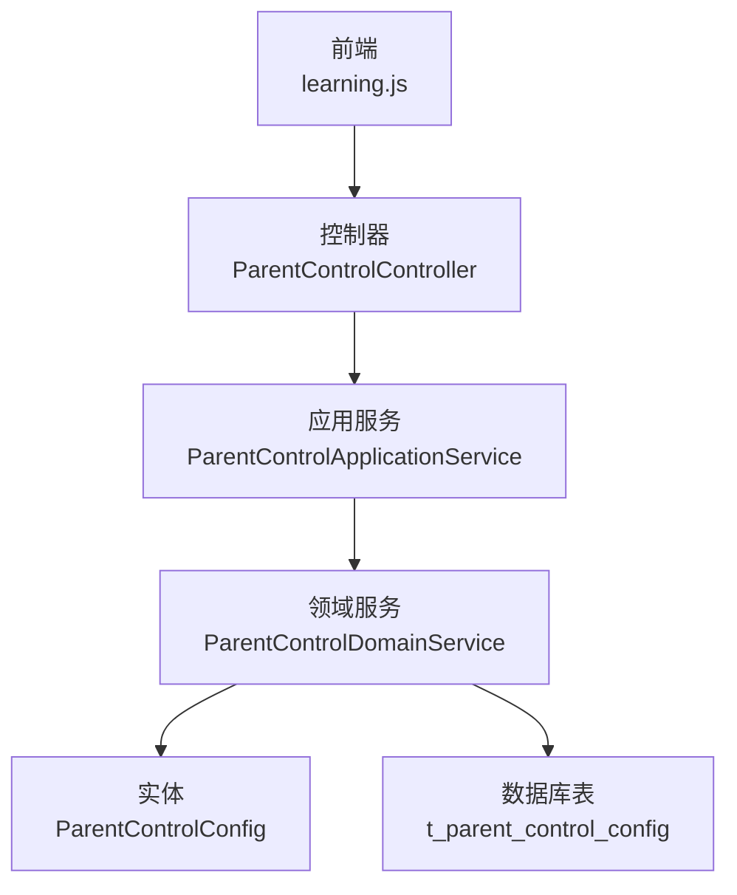
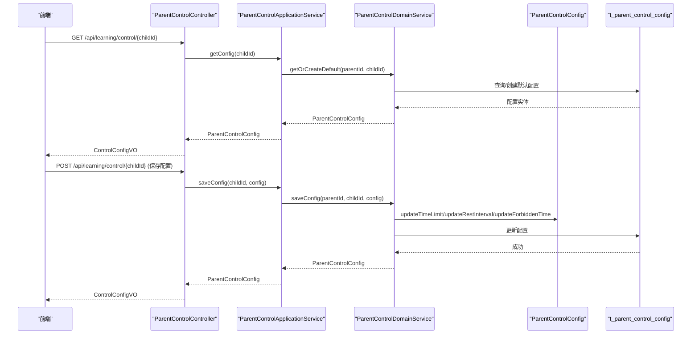
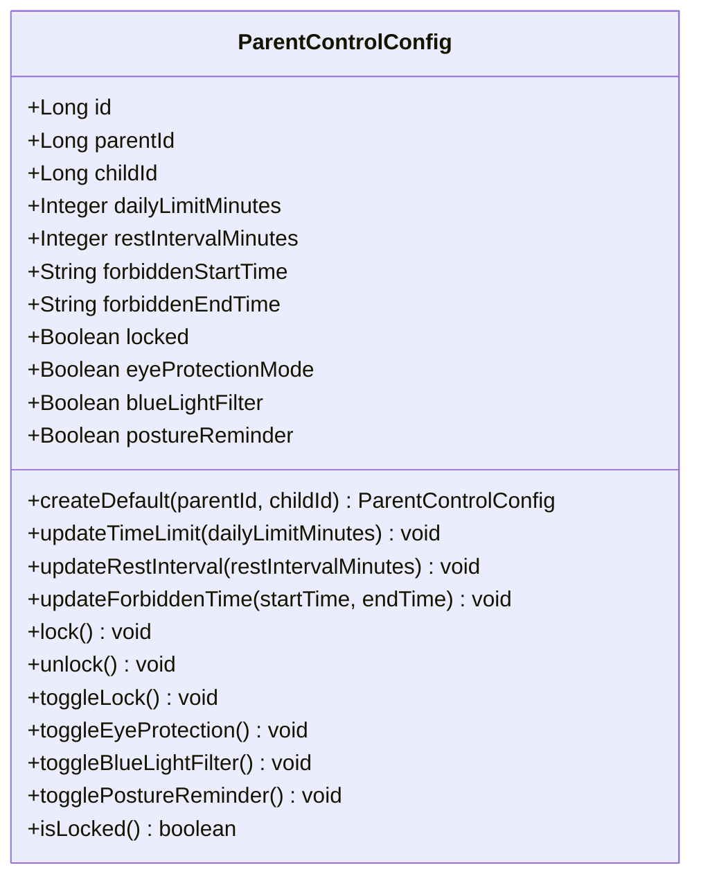
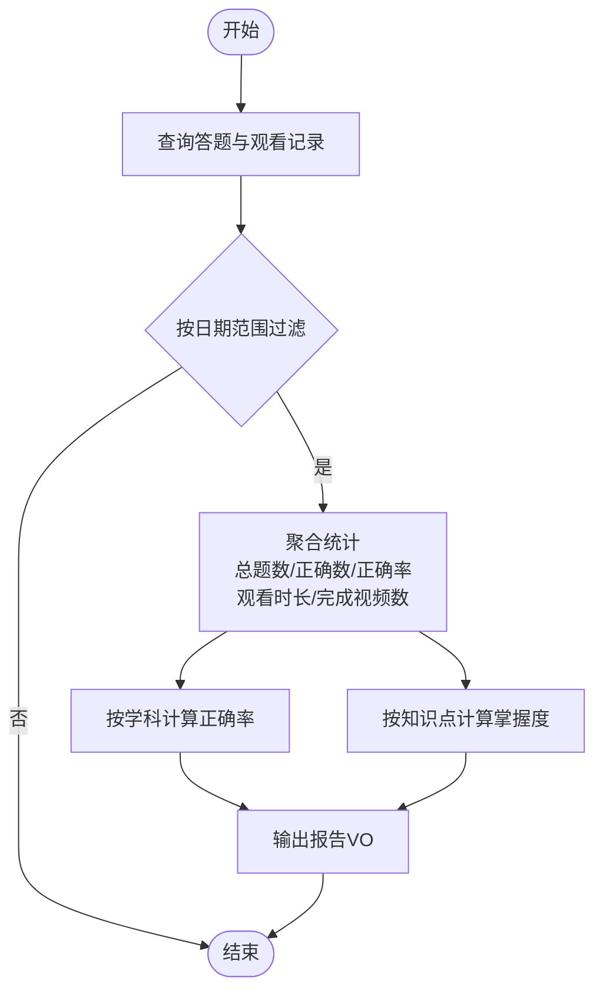
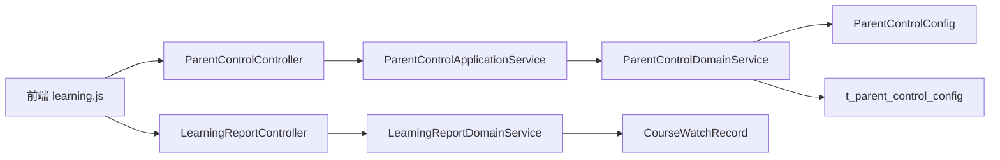

# 时长控制接口

<cite>
**本文引用的文件**
- [ParentControlController.java](file://wzoto-backend/wzoto-interfaces/src/main/java/com/wzoto/interfaces/controller/ParentControlController.java)
- [ParentControlApplicationService.java](file://wzoto-backend/wzoto-application/src/main/java/com/wzoto/application/service/ParentControlApplicationService.java)
- [ParentControlDomainService.java](file://wzoto-backend/wzoto-domain/src/main/java/com/wzoto/domain/service/ParentControlDomainService.java)
- [ParentControlConfig.java](file://wzoto-backend/wzoto-domain/src/main/java/com/wzoto/domain/entity/ParentControlConfig.java)
- [ControlConfigDTO.java](file://wzoto-backend/wzoto-interfaces/src/main/java/com/wzoto/interfaces/dto/learning/ControlConfigDTO.java)
- [ControlConfigVO.java](file://wzoto-backend/wzoto-interfaces/src/main/java/com/wzoto/interfaces/vo/learning/ControlConfigVO.java)
- [t_parent_control_config.sql](file://wzoto-backend/sql/t_parent_control_config.sql)
- [LearningReportController.java](file://wzoto-backend/wzoto-interfaces/src/main/java/com/wzoto/interfaces/controller/LearningReportController.java)
- [LearningReportDomainService.java](file://wzoto-backend/wzoto-domain/src/main/java/com/wzoto/domain/service/LearningReportDomainService.java)
- [CourseWatchRecord.java](file://wzoto-backend/wzoto-domain/src/main/java/com/wzoto/domain/entity/CourseWatchRecord.java)
- [learning.js](file://wzoto-frontend/src/api/learning.js)
</cite>

## 目录
1. [简介](#简介)
2. [项目结构](#项目结构)
3. [核心组件](#核心组件)
4. [架构总览](#架构总览)
5. [详细组件分析](#详细组件分析)
6. [依赖关系分析](#依赖关系分析)
7. [性能考虑](#性能考虑)
8. [故障排查指南](#故障排查指南)
9. [结论](#结论)
10. [附录：完整调用示例](#附录完整调用示例)

## 简介
本接口文档聚焦“家长管控时长控制”能力，覆盖以下核心功能：
- 学习时长限制配置：每日可用时长、单次休息间隔、禁用时段设置
- 设备锁屏与解锁：一键锁定/解除锁定
- 健康保护：护眼模式、蓝光过滤、坐姿提醒开关
- 时长统计与报告：学习时间计算、观看时长汇总、完成视频数、学科正确率等
- 前端调用方式：获取配置、保存配置、锁定/解锁设备、查询报告

## 项目结构
后端采用分层架构：
- 接口层（interfaces）：暴露 REST API，负责参数接收与响应封装
- 应用层（application）：编排业务用例，事务边界管理
- 领域层（domain）：实体、领域服务、值对象，承载核心规则
- 基础设施层（infrastructure）：持久化实现、外部集成

图表来源
- [ParentControlController.java:1-75](file://wzoto-backend/wzoto-interfaces/src/main/java/com/wzoto/interfaces/controller/ParentControlController.java#L1-L75)
- [ParentControlApplicationService.java:1-44](file://wzoto-backend/wzoto-application/src/main/java/com/wzoto/application/service/ParentControlApplicationService.java#L1-L44)
- [ParentControlDomainService.java:1-101](file://wzoto-backend/wzoto-domain/src/main/java/com/wzoto/domain/service/ParentControlDomainService.java#L1-L101)
- [ParentControlConfig.java:1-164](file://wzoto-backend/wzoto-domain/src/main/java/com/wzoto/domain/entity/ParentControlConfig.java#L1-L164)
- [t_parent_control_config.sql:1-23](file://wzoto-backend/sql/t_parent_control_config.sql#L1-L23)

章节来源
- [ParentControlController.java:1-75](file://wzoto-backend/wzoto-interfaces/src/main/java/com/wzoto/interfaces/controller/ParentControlController.java#L1-L75)
- [t_parent_control_config.sql:1-23](file://wzoto-backend/sql/t_parent_control_config.sql#L1-L23)

## 核心组件
- 控制器：提供家长管控相关REST端点，统一返回包装类型
- 应用服务：处理用户上下文、事务边界，调用领域服务
- 领域服务：实现时长管控、锁定/解锁、护眼模式切换、禁用时段判断等规则
- 实体：承载配置数据与领域行为（校验、状态切换）
- DTO/VO：接口入参与出参定义
- 报告服务：聚合观看记录与答题记录，生成日/周/月报告

章节来源
- [ParentControlController.java:1-75](file://wzoto-backend/wzoto-interfaces/src/main/java/com/wzoto/interfaces/controller/ParentControlController.java#L1-L75)
- [ParentControlApplicationService.java:1-44](file://wzoto-backend/wzoto-application/src/main/java/com/wzoto/application/service/ParentControlApplicationService.java#L1-L44)
- [ParentControlDomainService.java:1-101](file://wzoto-backend/wzoto-domain/src/main/java/com/wzoto/domain/service/ParentControlDomainService.java#L1-L101)
- [ParentControlConfig.java:1-164](file://wzoto-backend/wzoto-domain/src/main/java/com/wzoto/domain/entity/ParentControlConfig.java#L1-L164)
- [ControlConfigDTO.java:1-22](file://wzoto-backend/wzoto-interfaces/src/main/java/com/wzoto/interfaces/dto/learning/ControlConfigDTO.java#L1-L22)
- [ControlConfigVO.java:1-22](file://wzoto-backend/wzoto-interfaces/src/main/java/com/wzoto/interfaces/vo/learning/ControlConfigVO.java#L1-L22)

## 架构总览
家长管控时长控制的核心流程如下：
- 获取配置：按子女ID获取或创建默认配置
- 保存配置：更新每日时长、休息间隔、禁用时段与健康防护开关
- 锁定/解锁：切换设备锁定状态
- 报告查询：基于观看与答题记录生成学习报告

图表来源
- [ParentControlController.java:24-43](file://wzoto-backend/wzoto-interfaces/src/main/java/com/wzoto/interfaces/controller/ParentControlController.java#L24-L43)
- [ParentControlApplicationService.java:21-30](file://wzoto-backend/wzoto-application/src/main/java/com/wzoto/application/service/ParentControlApplicationService.java#L21-L30)
- [ParentControlDomainService.java:24-60](file://wzoto-backend/wzoto-domain/src/main/java/com/wzoto/domain/service/ParentControlDomainService.java#L24-L60)
- [ParentControlConfig.java:67-113](file://wzoto-backend/wzoto-domain/src/main/java/com/wzoto/domain/entity/ParentControlConfig.java#L67-L113)
- [t_parent_control_config.sql:4-22](file://wzoto-backend/sql/t_parent_control_config.sql#L4-L22)

## 详细组件分析

### 家长管控控制器（ParentControlController）
- 路径前缀：/api/learning/control
- 主要端点：
  - 获取配置：GET /{childId}
  - 保存配置：POST /{childId}
  - 锁定设备：POST /{childId}/lock
  - 解锁设备：POST /{childId}/unlock
- 请求体：ControlConfigDTO
- 响应体：ControlConfigVO（统一包装R）

章节来源
- [ParentControlController.java:1-75](file://wzoto-backend/wzoto-interfaces/src/main/java/com/wzoto/interfaces/controller/ParentControlController.java#L1-L75)
- [ControlConfigDTO.java:1-22](file://wzoto-backend/wzoto-interfaces/src/main/java/com/wzoto/interfaces/dto/learning/ControlConfigDTO.java#L1-L22)
- [ControlConfigVO.java:1-22](file://wzoto-backend/wzoto-interfaces/src/main/java/com/wzoto/interfaces/vo/learning/ControlConfigVO.java#L1-L22)

### 应用服务（ParentControlApplicationService）
- 职责：从用户上下文获取parentId，调用领域服务，提供事务边界
- 关键方法：getConfig、saveConfig、lock、unlock

章节来源
- [ParentControlApplicationService.java:1-44](file://wzoto-backend/wzoto-application/src/main/java/com/wzoto/application/service/ParentControlApplicationService.java#L1-L44)

### 领域服务（ParentControlDomainService）
- 职责：实现时长管控、锁定/解锁、护眼模式切换、禁用时段判断
- 关键逻辑：
  - 获取或创建默认配置（默认每日60分钟、休息20分钟、禁用时段22:00-07:00）
  - 保存配置时进行字段更新与校验
  - 锁定/解锁：切换locked标志
  - 护眼模式：toggleEyeProtection
  - 禁用时段检查：根据当前时间与配置的起止时间判断是否处于禁用时段

章节来源
- [ParentControlDomainService.java:1-101](file://wzoto-backend/wzoto-domain/src/main/java/com/wzoto/domain/service/ParentControlDomainService.java#L1-L101)

### 实体（ParentControlConfig）
- 字段：每日时长、休息间隔、禁用时段、锁定标志、护眼模式、蓝光过滤、坐姿提醒
- 领域行为：
  - 创建默认配置
  - 更新每日时长（0-240分钟）
  - 更新休息间隔（5-120分钟）
  - 更新禁用时段
  - 锁定/解锁/切换锁定
  - 切换护眼模式、蓝光过滤、坐姿提醒

图表来源
- [ParentControlConfig.java:1-164](file://wzoto-backend/wzoto-domain/src/main/java/com/wzoto/domain/entity/ParentControlConfig.java#L1-L164)

### 数据库表（t_parent_control_config）
- 关键字段：
  - parent_id、child_id（唯一索引child_id）
  - daily_duration_minutes（默认60）
  - rest_interval_minutes（默认20）
  - rest_duration_minutes（默认5）
  - forbidden_start_time（默认22:00）、forbidden_end_time（默认07:00）
  - locked（默认0）、eye_protection（默认0）
  - current_page、last_login_at、deleted、created_at、updated_at

章节来源
- [t_parent_control_config.sql:1-23](file://wzoto-backend/sql/t_parent_control_config.sql#L1-L23)

### 时长统计与报告（LearningReportController & LearningReportDomainService）
- 报告端点：
  - 概览：GET /{childId}
  - 日报：GET /{childId}/daily?date=YYYY-MM-DD
  - 周报：GET /{childId}/weekly?weekStart=YYYY-MM-DD
  - 月报：GET /{childId}/monthly?year&month
  - 薄弱点：GET /{childId}/weak-points?subject&topN
  - 错题导出：GET /{childId}/wrong-questions/export?subject
- 统计维度：
  - 总题数、正确数、正确率
  - 观看时长（秒）、完成视频数
  - 学科正确率映射、知识点掌握度映射

图表来源
- [LearningReportController.java:31-82](file://wzoto-backend/wzoto-interfaces/src/main/java/com/wzoto/interfaces/controller/LearningReportController.java#L31-L82)
- [LearningReportDomainService.java:34-100](file://wzoto-backend/wzoto-domain/src/main/java/com/wzoto/domain/service/LearningReportDomainService.java#L34-L100)

章节来源
- [LearningReportController.java:1-141](file://wzoto-backend/wzoto-interfaces/src/main/java/com/wzoto/interfaces/controller/LearningReportController.java#L1-L141)
- [LearningReportDomainService.java:1-160](file://wzoto-backend/wzoto-domain/src/main/java/com/wzoto/domain/service/LearningReportDomainService.java#L1-L160)

### 观看记录（CourseWatchRecord）
- 作用：记录每次观看的时长、进度、完成状态、首次/最后观看时间
- 关键行为：创建记录、记录进度、更新完成状态

章节来源
- [CourseWatchRecord.java:54-93](file://wzoto-backend/wzoto-domain/src/main/java/com/wzoto/domain/entity/CourseWatchRecord.java#L54-L93)

## 依赖关系分析
- 控制器依赖应用服务，应用服务依赖领域服务，领域服务操作实体并访问数据库
- 报告控制器依赖报告领域服务，聚合答题与观看记录生成报告
- 前端通过learning.js调用后端接口

图表来源
- [learning.js:77-93](file://wzoto-frontend/src/api/learning.js#L77-L93)
- [ParentControlController.java:1-75](file://wzoto-backend/wzoto-interfaces/src/main/java/com/wzoto/interfaces/controller/ParentControlController.java#L1-L75)
- [ParentControlApplicationService.java:1-44](file://wzoto-backend/wzoto-application/src/main/java/com/wzoto/application/service/ParentControlApplicationService.java#L1-L44)
- [ParentControlDomainService.java:1-101](file://wzoto-backend/wzoto-domain/src/main/java/com/wzoto/domain/service/ParentControlDomainService.java#L1-L101)
- [LearningReportController.java:1-141](file://wzoto-backend/wzoto-interfaces/src/main/java/com/wzoto/interfaces/controller/LearningReportController.java#L1-L141)
- [LearningReportDomainService.java:1-160](file://wzoto-backend/wzoto-domain/src/main/java/com/wzoto/domain/service/LearningReportDomainService.java#L1-L160)
- [CourseWatchRecord.java:54-93](file://wzoto-backend/wzoto-domain/src/main/java/com/wzoto/domain/entity/CourseWatchRecord.java#L54-L93)

## 性能考虑
- 配置读写：按child_id唯一索引快速定位，避免全表扫描
- 报告聚合：按日期范围过滤后聚合，建议在答题与观看记录表上建立时间索引以提升查询效率
- 事务边界：保存配置与锁定/解锁使用事务保证一致性
- 前端缓存：可在前端对配置进行短期缓存，减少重复请求

[本节为通用指导，不直接分析具体文件]

## 故障排查指南
- 配置保存失败：
  - 检查每日时长是否在0-240分钟之间
  - 检查休息间隔是否在5-120分钟之间
  - 确认禁用时段格式为HH:mm
- 锁定/解锁无效：
  - 确认当前用户具备对应子女的管控权限（parentId与childId匹配）
  - 检查数据库locked字段是否正确更新
- 报告数据异常：
  - 确认答题与观看记录的时间戳是否正确写入
  - 检查报告查询的日期范围是否合理

章节来源
- [ParentControlConfig.java:86-113](file://wzoto-backend/wzoto-domain/src/main/java/com/wzoto/domain/entity/ParentControlConfig.java#L86-L113)
- [ParentControlDomainService.java:24-80](file://wzoto-backend/wzoto-domain/src/main/java/com/wzoto/domain/service/ParentControlDomainService.java#L24-L80)
- [LearningReportDomainService.java:34-100](file://wzoto-backend/wzoto-domain/src/main/java/com/wzoto/domain/service/LearningReportDomainService.java#L34-L100)

## 结论
本接口实现了家长管控时长控制的核心能力，包括配置管理、设备锁定/解锁、健康防护开关以及学习时长统计与报告。通过清晰的层次化设计与严格的领域规则，确保管控策略可配置、可执行、可审计。结合前端调用，可形成完整的家长管控闭环。

[本节为总结性内容，不直接分析具体文件]

## 附录：完整调用示例
以下为常见操作的调用示例（以HTTP形式描述，实际调用请参考前端learning.js中的封装函数）：

- 获取管控配置
  - 方法：GET
  - 路径：/api/learning/control/{childId}
  - 说明：返回ControlConfigVO，包含每日时长、休息间隔、禁用时段、锁定状态与健康防护开关

- 保存管控配置
  - 方法：POST
  - 路径：/api/learning/control/{childId}
  - 请求体：ControlConfigDTO（dailyLimitMinutes、restIntervalMinutes、forbiddenStartTime、forbiddenEndTime、eyeProtectionMode、blueLightFilter、postureReminder）
  - 说明：更新配置并返回最新ControlConfigVO

- 锁定设备
  - 方法：POST
  - 路径：/api/learning/control/{childId}/lock
  - 说明：将locked置为true，返回ControlConfigVO

- 解锁设备
  - 方法：POST
  - 路径：/api/learning/control/{childId}/unlock
  - 说明：将locked置为false，返回ControlConfigVO

- 获取学习报告
  - 概览：GET /api/learning/report/{childId}
  - 日报：GET /api/learning/report/{childId}/daily?date=YYYY-MM-DD
  - 周报：GET /api/learning/report/{childId}/weekly?weekStart=YYYY-MM-DD
  - 月报：GET /api/learning/report/{childId}/monthly?year&month
  - 薄弱点：GET /api/learning/report/{childId}/weak-points?subject&topN
  - 错题导出：GET /api/learning/report/{childId}/wrong-questions/export?subject

- 前端调用参考
  - 获取配置：getControlConfig(childId)
  - 保存配置：saveControlConfig(childId, data)
  - 锁定：lockControl(childId)
  - 解锁：unlockControl(childId)
  - 报告：getDailyReport/getWeeklyReport/getMonthlyReport/getWeakPoints/exportWrongQuestions

章节来源
- [ParentControlController.java:24-57](file://wzoto-backend/wzoto-interfaces/src/main/java/com/wzoto/interfaces/controller/ParentControlController.java#L24-L57)
- [ControlConfigDTO.java:1-22](file://wzoto-backend/wzoto-interfaces/src/main/java/com/wzoto/interfaces/dto/learning/ControlConfigDTO.java#L1-L22)
- [ControlConfigVO.java:1-22](file://wzoto-backend/wzoto-interfaces/src/main/java/com/wzoto/interfaces/vo/learning/ControlConfigVO.java#L1-L22)
- [LearningReportController.java:31-82](file://wzoto-backend/wzoto-interfaces/src/main/java/com/wzoto/interfaces/controller/LearningReportController.java#L31-L82)
- [learning.js:77-93](file://wzoto-frontend/src/api/learning.js#L77-L93)