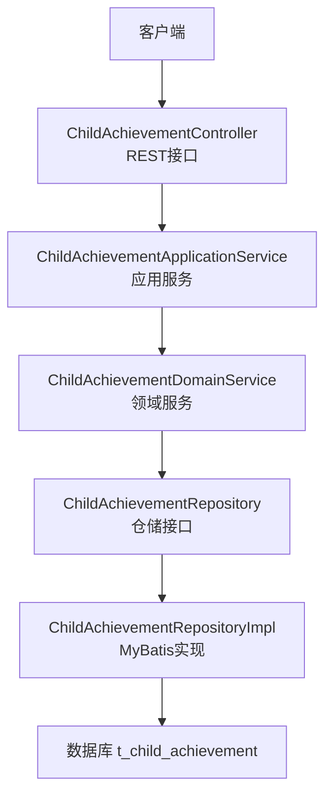
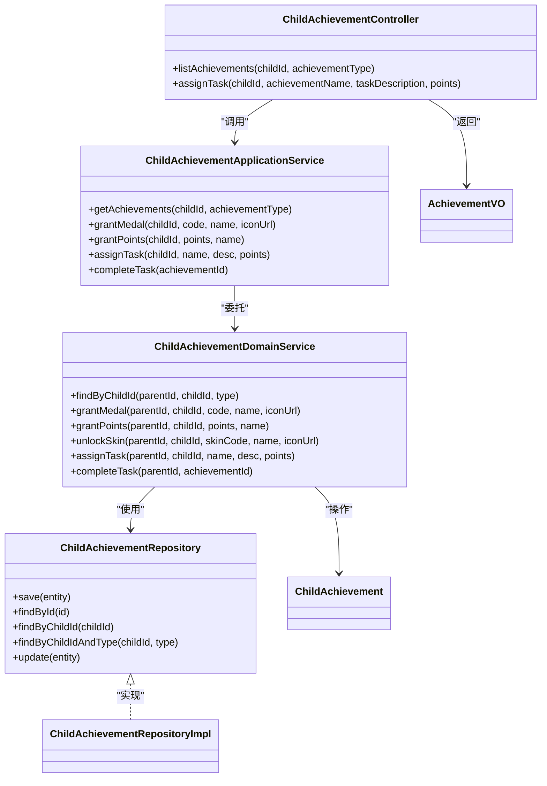
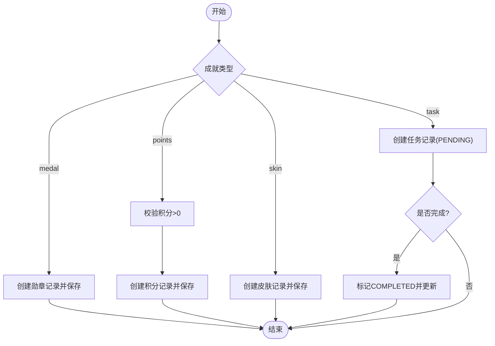
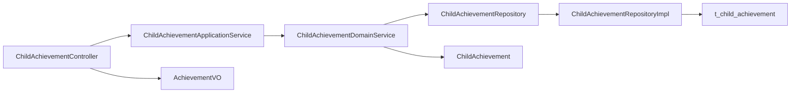
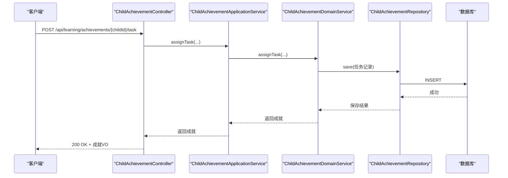

# 成就系统接口

<cite>
**本文引用的文件**
- [ChildAchievementController.java](file://wzoto-backend/wzoto-interfaces/src/main/java/com/wzoto/interfaces/controller/ChildAchievementController.java)
- [ChildAchievementApplicationService.java](file://wzoto-backend/wzoto-application/src/main/java/com/wzoto/application/service/ChildAchievementApplicationService.java)
- [ChildAchievementDomainService.java](file://wzoto-backend/wzoto-domain/src/main/java/com/wzoto/domain/service/ChildAchievementDomainService.java)
- [ChildAchievement.java](file://wzoto-backend/wzoto-domain/src/main/java/com/wzoto/domain/entity/ChildAchievement.java)
- [ChildAchievementRepository.java](file://wzoto-backend/wzoto-domain/src/main/java/com/wzoto/domain/repository/ChildAchievementRepository.java)
- [ChildAchievementRepositoryImpl.java](file://wzoto-backend/wzoto-infrastructure/src/main/java/com/wzoto/infrastructure/repository/ChildAchievementRepositoryImpl.java)
- [AchievementVO.java](file://wzoto-backend/wzoto-interfaces/src/main/java/com/wzoto/interfaces/vo/learning/AchievementVO.java)
- [t_child_achievement.sql](file://wzoto-backend/sql/t_child_achievement.sql)
- [ExerciseAnswerRecord.java](file://wzoto-backend/wzoto-domain/src/main/java/com/wzoto/domain/entity/ExerciseAnswerRecord.java)
- [CourseWatchRecord.java](file://wzoto-backend/wzoto-domain/src/main/java/com/wzoto/domain/entity/CourseWatchRecord.java)
</cite>

## 目录
1. [简介](#简介)
2. [项目结构](#项目结构)
3. [核心组件](#核心组件)
4. [架构总览](#架构总览)
5. [详细组件分析](#详细组件分析)
6. [依赖关系分析](#依赖关系分析)
7. [性能考虑](#性能考虑)
8. [故障排查指南](#故障排查指南)
9. [结论](#结论)
10. [附录](#附录)

## 简介
本文件为“成就系统”的API与实现说明，覆盖成就解锁条件检查、进度追踪、奖励发放、通知机制以及统计查询等能力。当前代码库已提供家长侧的成就（勋章、积分、皮肤）管理与任务下发/完成流程；同时提供了习题作答与课程观看记录实体，可作为连续答题、正确率、学习时长等成就类型的计算依据。

## 项目结构
成就系统采用分层架构：接口层暴露REST API，应用层编排业务流程，领域层封装业务规则与状态变更，基础设施层负责数据持久化。

图示来源
- [ChildAchievementController.java:1-60](file://wzoto-backend/wzoto-interfaces/src/main/java/com/wzoto/interfaces/controller/ChildAchievementController.java#L1-L60)
- [ChildAchievementApplicationService.java:1-52](file://wzoto-backend/wzoto-application/src/main/java/com/wzoto/application/service/ChildAchievementApplicationService.java#L1-L52)
- [ChildAchievementDomainService.java:1-101](file://wzoto-backend/wzoto-domain/src/main/java/com/wzoto/domain/service/ChildAchievementDomainService.java#L1-L101)
- [ChildAchievementRepository.java:1-22](file://wzoto-backend/wzoto-domain/src/main/java/com/wzoto/domain/repository/ChildAchievementRepository.java#L1-L22)
- [ChildAchievementRepositoryImpl.java:1-98](file://wzoto-backend/wzoto-infrastructure/src/main/java/com/wzoto/infrastructure/repository/ChildAchievementRepositoryImpl.java#L1-L98)
- [t_child_achievement.sql:1-21](file://wzoto-backend/sql/t_child_achievement.sql#L1-L21)

章节来源
- [ChildAchievementController.java:1-60](file://wzoto-backend/wzoto-interfaces/src/main/java/com/wzoto/interfaces/controller/ChildAchievementController.java#L1-L60)
- [ChildAchievementApplicationService.java:1-52](file://wzoto-backend/wzoto-application/src/main/java/com/wzoto/application/service/ChildAchievementApplicationService.java#L1-L52)
- [ChildAchievementDomainService.java:1-101](file://wzoto-backend/wzoto-domain/src/main/java/com/wzoto/domain/service/ChildAchievementDomainService.java#L1-L101)
- [ChildAchievementRepositoryImpl.java:1-98](file://wzoto-backend/wzoto-infrastructure/src/main/java/com/wzoto/infrastructure/repository/ChildAchievementRepositoryImpl.java#L1-L98)
- [t_child_achievement.sql:1-21](file://wzoto-backend/sql/t_child_achievement.sql#L1-L21)

## 核心组件
- 控制器：提供成就列表、任务下发等HTTP端点，统一返回包装类型。
- 应用服务：协调领域服务，处理事务边界与上下文用户身份。
- 领域服务：校验归属权、执行业务规则（如积分必须大于0）、调用仓储保存或更新。
- 领域实体：承载成就数据模型与行为（创建勋章/积分/皮肤/任务、完成任务）。
- 仓储接口与实现：定义CRUD与按子女ID及类型查询，使用MyBatis进行持久化。
- VO：对外返回的成就视图对象。

章节来源
- [ChildAchievementController.java:1-60](file://wzoto-backend/wzoto-interfaces/src/main/java/com/wzoto/interfaces/controller/ChildAchievementController.java#L1-L60)
- [ChildAchievementApplicationService.java:1-52](file://wzoto-backend/wzoto-application/src/main/java/com/wzoto/application/service/ChildAchievementApplicationService.java#L1-L52)
- [ChildAchievementDomainService.java:1-101](file://wzoto-backend/wzoto-domain/src/main/java/com/wzoto/domain/service/ChildAchievementDomainService.java#L1-L101)
- [ChildAchievement.java:1-148](file://wzoto-backend/wzoto-domain/src/main/java/com/wzoto/domain/entity/ChildAchievement.java#L1-L148)
- [ChildAchievementRepository.java:1-22](file://wzoto-backend/wzoto-domain/src/main/java/com/wzoto/domain/repository/ChildAchievementRepository.java#L1-L22)
- [ChildAchievementRepositoryImpl.java:1-98](file://wzoto-backend/wzoto-infrastructure/src/main/java/com/wzoto/infrastructure/repository/ChildAchievementRepositoryImpl.java#L1-L98)
- [AchievementVO.java:1-24](file://wzoto-backend/wzoto-interfaces/src/main/java/com/wzoto/interfaces/vo/learning/AchievementVO.java#L1-L24)

## 架构总览
成就系统遵循DDD分层：接口层仅做参数接收与响应转换；应用层负责用例编排与事务；领域层维护一致性与规则；基础设施层屏蔽存储细节。

图示来源
- [ChildAchievementController.java:1-60](file://wzoto-backend/wzoto-interfaces/src/main/java/com/wzoto/interfaces/controller/ChildAchievementController.java#L1-L60)
- [ChildAchievementApplicationService.java:1-52](file://wzoto-backend/wzoto-application/src/main/java/com/wzoto/application/service/ChildAchievementApplicationService.java#L1-L52)
- [ChildAchievementDomainService.java:1-101](file://wzoto-backend/wzoto-domain/src/main/java/com/wzoto/domain/service/ChildAchievementDomainService.java#L1-L101)
- [ChildAchievementRepository.java:1-22](file://wzoto-backend/wzoto-domain/src/main/java/com/wzoto/domain/repository/ChildAchievementRepository.java#L1-L22)
- [ChildAchievementRepositoryImpl.java:1-98](file://wzoto-backend/wzoto-infrastructure/src/main/java/com/wzoto/infrastructure/repository/ChildAchievementRepositoryImpl.java#L1-L98)
- [ChildAchievement.java:1-148](file://wzoto-backend/wzoto-domain/src/main/java/com/wzoto/domain/entity/ChildAchievement.java#L1-L148)
- [AchievementVO.java:1-24](file://wzoto-backend/wzoto-interfaces/src/main/java/com/wzoto/interfaces/vo/learning/AchievementVO.java#L1-L24)

## 详细组件分析

### REST API 定义
- 获取成就列表
  - 路径：GET /api/learning/achievements/{childId}
  - 查询参数：achievementType（可选）
  - 功能：按子女ID与可选类型查询成就记录，返回列表
  - 返回：统一包装的成功结果，包含成就VO列表
- 下发激励任务
  - 路径：POST /api/learning/achievements/{childId}/task
  - 表单参数：achievementName、taskDescription、points（默认0）
  - 功能：家长为子女下发激励任务，生成任务型成就记录
  - 返回：统一包装的成功结果，包含新任务的成就VO

章节来源
- [ChildAchievementController.java:26-42](file://wzoto-backend/wzoto-interfaces/src/main/java/com/wzoto/interfaces/controller/ChildAchievementController.java#L26-L42)

### 成就数据类型与字段
- 成就类型
  - medal：勋章
  - points：积分
  - skin：皮肤
  - task：家长任务
- 关键字段
  - id、childId、achievementType、achievementCode、achievementName、iconUrl
  - points、skinCode、taskDescription、taskStatus、obtainedAt、deleted、createdAt、updatedAt
- 数据库表
  - 表名：t_child_achievement
  - 字段：id、child_id、achievement_type、title、icon、points、skin、source、task_name、deleted、created_at、updated_at
  - 索引：child_id、achievement_type、created_at

章节来源
- [ChildAchievement.java:20-60](file://wzoto-backend/wzoto-domain/src/main/java/com/wzoto/domain/entity/ChildAchievement.java#L20-L60)
- [AchievementVO.java:10-23](file://wzoto-backend/wzoto-interfaces/src/main/java/com/wzoto/interfaces/vo/learning/AchievementVO.java#L10-L23)
- [t_child_achievement.sql:4-20](file://wzoto-backend/sql/t_child_achievement.sql#L4-L20)

### 成就解锁算法与状态更新
- 授予勋章
  - 输入：childId、achievementCode、achievementName、iconUrl
  - 行为：创建勋章类型成就并持久化
  - 校验：父对子权限校验
- 发放积分
  - 输入：childId、points、achievementName
  - 行为：创建积分类型成就并持久化
  - 校验：points必须大于0；父对子权限校验
- 解锁皮肤
  - 输入：childId、skinCode、achievementName、iconUrl
  - 行为：创建皮肤类型成就并持久化
  - 校验：父对子权限校验
- 家长任务
  - 下发：创建任务型成就，初始状态为待完成
  - 完成：根据achievementId查找记录，调用领域方法标记完成并更新
  - 校验：任务类型才能完成；避免重复完成；父对子权限校验

图示来源
- [ChildAchievementDomainService.java:38-92](file://wzoto-backend/wzoto-domain/src/main/java/com/wzoto/domain/service/ChildAchievementDomainService.java#L38-L92)
- [ChildAchievement.java:67-146](file://wzoto-backend/wzoto-domain/src/main/java/com/wzoto/domain/entity/ChildAchievement.java#L67-L146)

章节来源
- [ChildAchievementDomainService.java:27-92](file://wzoto-backend/wzoto-domain/src/main/java/com/wzoto/domain/service/ChildAchievementDomainService.java#L27-L92)
- [ChildAchievement.java:67-146](file://wzoto-backend/wzoto-domain/src/main/java/com/wzoto/domain/entity/ChildAchievement.java#L67-L146)

### 成就进度追踪（与学习行为集成）
- 连续答题成就
  - 依据：ExerciseAnswerRecord（学科、知识点、是否正确、耗时）
  - 建议：以childId+时间窗口统计连续正确次数或累计作答次数，达到阈值触发成就
- 正确率成就
  - 依据：ExerciseAnswerRecord.correct
  - 建议：在指定周期内计算正确率=正确数/总题数，达到阈值触发成就
- 学习时长成就
  - 依据：CourseWatchRecord.watchDurationSeconds、progressPercent、completed
  - 建议：累计观看时长或完成视频比例达阈值触发成就

注意：上述为基于现有实体的扩展建议，具体触发逻辑可在后续领域服务中实现。

章节来源
- [ExerciseAnswerRecord.java:18-99](file://wzoto-backend/wzoto-domain/src/main/java/com/wzoto/domain/entity/ExerciseAnswerRecord.java#L18-L99)
- [CourseWatchRecord.java:18-120](file://wzoto-backend/wzoto-domain/src/main/java/com/wzoto/domain/entity/CourseWatchRecord.java#L18-L120)

### 成就通知机制
- 现状：当前代码未包含消息推送或通知模块
- 建议方案：
  - 在颁发勋章/积分/皮肤或完成任务时，通过事件或回调触发通知
  - 可集成站内信、短信或微信模板消息
  - 将通知作为独立服务，通过异步方式发送，避免阻塞主流程

[本节为概念性建议，不直接分析具体文件]

### 成就统计接口
- 获取成就列表
  - 支持按childId与achievementType筛选
  - 用于展示历史成就与当前进度
- 扩展建议：
  - 新增聚合统计接口：累计积分、勋章数量、任务完成率、最近达成时间等
  - 结合学习记录提供“连续答题天数”“本周正确率”“累计学习时长”等指标

章节来源
- [ChildAchievementController.java:26-32](file://wzoto-backend/wzoto-interfaces/src/main/java/com/wzoto/interfaces/controller/ChildAchievementController.java#L26-L32)
- [ChildAchievementRepositoryImpl.java:37-51](file://wzoto-backend/wzoto-infrastructure/src/main/java/com/wzoto/infrastructure/repository/ChildAchievementRepositoryImpl.java#L37-L51)

## 依赖关系分析
- 控制器依赖应用服务，应用服务依赖领域服务，领域服务依赖仓储接口，仓储由基础设施实现
- 领域实体被领域服务操作，VO用于对外返回
- 数据库表结构与实体字段映射清晰，索引优化查询性能

图示来源
- [ChildAchievementController.java:1-60](file://wzoto-backend/wzoto-interfaces/src/main/java/com/wzoto/interfaces/controller/ChildAchievementController.java#L1-L60)
- [ChildAchievementApplicationService.java:1-52](file://wzoto-backend/wzoto-application/src/main/java/com/wzoto/application/service/ChildAchievementApplicationService.java#L1-L52)
- [ChildAchievementDomainService.java:1-101](file://wzoto-backend/wzoto-domain/src/main/java/com/wzoto/domain/service/ChildAchievementDomainService.java#L1-L101)
- [ChildAchievementRepository.java:1-22](file://wzoto-backend/wzoto-domain/src/main/java/com/wzoto/domain/repository/ChildAchievementRepository.java#L1-L22)
- [ChildAchievementRepositoryImpl.java:1-98](file://wzoto-backend/wzoto-infrastructure/src/main/java/com/wzoto/infrastructure/repository/ChildAchievementRepositoryImpl.java#L1-L98)
- [t_child_achievement.sql:1-21](file://wzoto-backend/sql/t_child_achievement.sql#L1-L21)

章节来源
- [ChildAchievementRepositoryImpl.java:37-51](file://wzoto-backend/wzoto-infrastructure/src/main/java/com/wzoto/infrastructure/repository/ChildAchievementRepositoryImpl.java#L37-L51)
- [t_child_achievement.sql:17-19](file://wzoto-backend/sql/t_child_achievement.sql#L17-L19)

## 性能考虑
- 查询优化：按child_id与achievement_type建立索引，提升列表与筛选效率
- 分页与限流：当成就数量较大时，建议在接口层增加分页参数与限流策略
- 事务范围：仅在写入类操作（发放、完成）开启事务，减少锁持有时间
- 缓存策略：对只读列表可引入短期缓存，降低数据库压力

[本节提供通用指导，不直接分析具体文件]

## 故障排查指南
- 权限校验失败
  - 现象：提示无权操作该子女档案
  - 原因：父对子关系校验未通过
  - 处理：确认传入parentId与childId的归属关系
- 积分参数非法
  - 现象：抛出参数异常
  - 原因：points为空或不大于0
  - 处理：确保points为正整数
- 任务重复完成
  - 现象：抛出状态异常
  - 原因：任务已完成或类型不符
  - 处理：检查任务类型与状态，避免重复提交
- 记录不存在
  - 现象：提示激励记录不存在
  - 原因：achievementId无效
  - 处理：确认传入ID有效且属于当前父账号

章节来源
- [ChildAchievementDomainService.java:50-57](file://wzoto-backend/wzoto-domain/src/main/java/com/wzoto/domain/service/ChildAchievementDomainService.java#L50-L57)
- [ChildAchievementDomainService.java:84-92](file://wzoto-backend/wzoto-domain/src/main/java/com/wzoto/domain/service/ChildAchievementDomainService.java#L84-L92)
- [ChildAchievement.java:131-146](file://wzoto-backend/wzoto-domain/src/main/java/com/wzoto/domain/entity/ChildAchievement.java#L131-L146)

## 结论
当前成就系统已具备基础的成就记录、发放与任务管理功能，并通过清晰的DDD分层与仓储抽象保证可扩展性。结合习题作答与课程观看记录，可进一步实现连续答题、正确率与学习时长等成就类型。建议补充通知机制与统计聚合接口，以提升用户体验与运营分析能力。

[本节为总结性内容，不直接分析具体文件]

## 附录

### API 请求与响应示例（路径与字段说明）
- 获取成就列表
  - 请求：GET /api/learning/achievements/{childId}?achievementType=medal
  - 响应：包含成就VO列表，字段见AchievementVO
- 下发激励任务
  - 请求：POST /api/learning/achievements/{childId}/task?achievementName=...&taskDescription=...&points=...
  - 响应：返回新任务的成就VO

章节来源
- [ChildAchievementController.java:26-42](file://wzoto-backend/wzoto-interfaces/src/main/java/com/wzoto/interfaces/controller/ChildAchievementController.java#L26-L42)
- [AchievementVO.java:10-23](file://wzoto-backend/wzoto-interfaces/src/main/java/com/wzoto/interfaces/vo/learning/AchievementVO.java#L10-L23)

### 关键流程图（任务完成）

图示来源
- [ChildAchievementController.java:34-42](file://wzoto-backend/wzoto-interfaces/src/main/java/com/wzoto/interfaces/controller/ChildAchievementController.java#L34-L42)
- [ChildAchievementApplicationService.java:41-44](file://wzoto-backend/wzoto-application/src/main/java/com/wzoto/application/service/ChildAchievementApplicationService.java#L41-L44)
- [ChildAchievementDomainService.java:72-79](file://wzoto-backend/wzoto-domain/src/main/java/com/wzoto/domain/service/ChildAchievementDomainService.java#L72-L79)
- [ChildAchievementRepositoryImpl.java:23-29](file://wzoto-backend/wzoto-infrastructure/src/main/java/com/wzoto/infrastructure/repository/ChildAchievementRepositoryImpl.java#L23-L29)