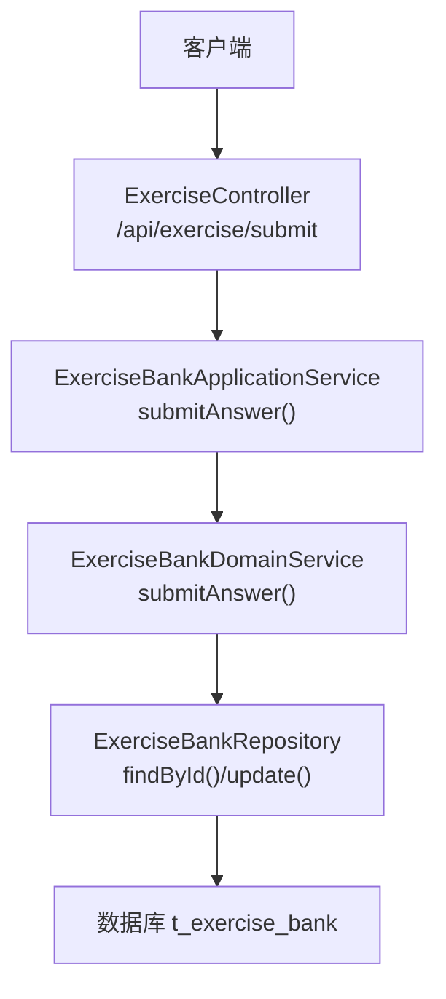
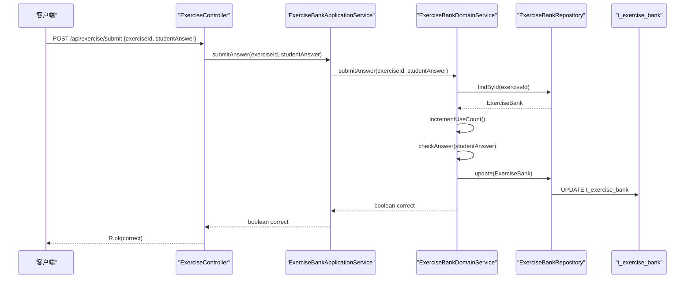
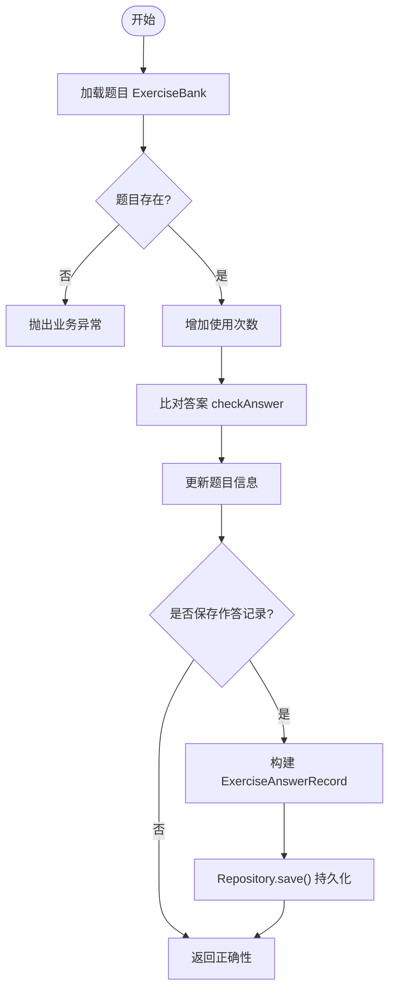
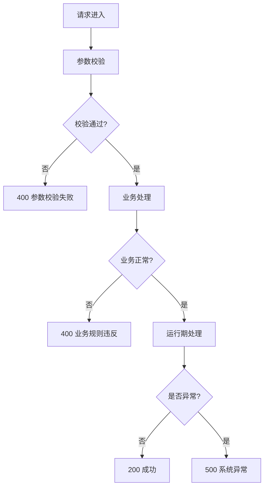
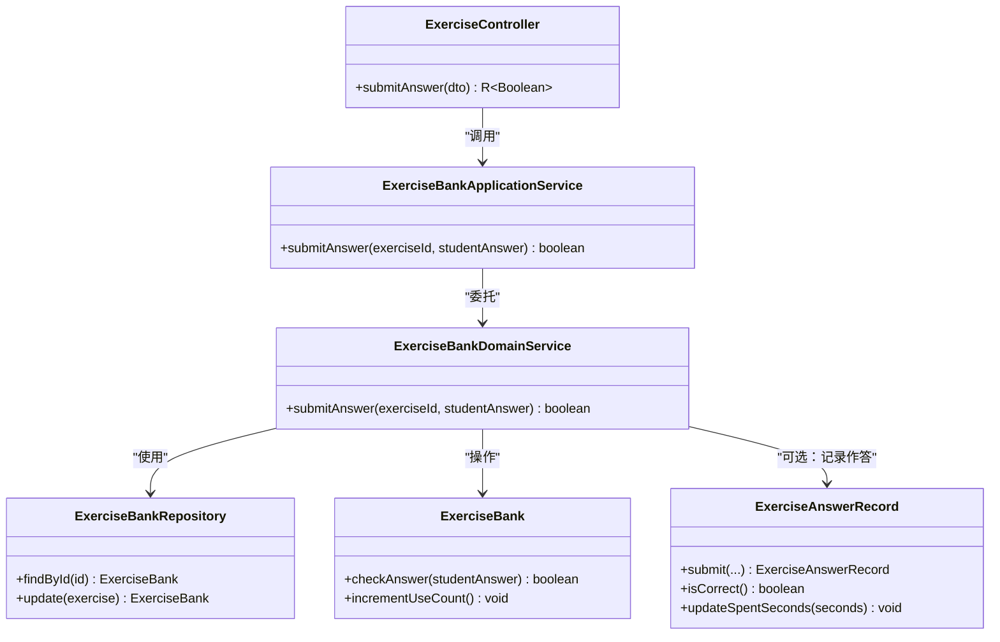

# 答题提交接口

<cite>
**本文引用的文件**
- [ExerciseController.java](file://wzoto-backend/wzoto-interfaces/src/main/java/com/wzoto/interfaces/controller/ExerciseController.java)
- [SubmitAnswerDTO.java](file://wzoto-backend/wzoto-interfaces/src/main/java/com/wzoto/interfaces/dto/SubmitAnswerDTO.java)
- [ExerciseBankApplicationService.java](file://wzoto-backend/wzoto-application/src/main/java/com/wzoto/application/service/ExerciseBankApplicationService.java)
- [ExerciseBankDomainService.java](file://wzoto-backend/wzoto-domain/src/main/java/com/wzoto/domain/service/ExerciseBankDomainService.java)
- [ExerciseBankRepository.java](file://wzoto-backend/wzoto-domain/src/main/java/com/wzoto/domain/repository/ExerciseBankRepository.java)
- [ExerciseBankRepositoryImpl.java](file://wzoto-backend/wzoto-infrastructure/src/main/java/com/wzoto/infrastructure/repository/ExerciseBankRepositoryImpl.java)
- [ExerciseBank.java](file://wzoto-backend/wzoto-domain/src/main/java/com/wzoto/domain/entity/ExerciseBank.java)
- [ExerciseAnswerRecord.java](file://wzoto-backend/wzoto-domain/src/main/java/com/wzoto/domain/entity/ExerciseAnswerRecord.java)
- [ExerciseAnswerRecordRepository.java](file://wzoto-backend/wzoto-domain/src/main/java/com/wzoto/domain/repository/ExerciseAnswerRecordRepository.java)
- [ExerciseAnswerRecordRepositoryImpl.java](file://wzoto-backend/wzoto-infrastructure/src/main/java/com/wzoto/infrastructure/repository/ExerciseAnswerRecordRepositoryImpl.java)
- [t_exercise_answer_record.sql](file://wzoto-backend/sql/t_exercise_answer_record.sql)
- [GlobalExceptionHandler.java](file://wzoto-backend/wzoto-interfaces/src/main/java/com/wzoto/interfaces/common/GlobalExceptionHandler.java)
- [R.java](file://wzoto-backend/wzoto-interfaces/src/main/java/com/wzoto/interfaces/common/R.java)
</cite>

## 目录
1. [简介](#简介)
2. [项目结构](#项目结构)
3. [核心组件](#核心组件)
4. [架构总览](#架构总览)
5. [详细组件分析](#详细组件分析)
6. [依赖关系分析](#依赖关系分析)
7. [性能考虑](#性能考虑)
8. [故障排查指南](#故障排查指南)
9. [结论](#结论)
10. [附录](#附录)

## 简介
本文件为“答题提交接口”的完整API文档，聚焦于POST /api/exercise/submit的实现与行为说明。内容包括：
- 请求参数SubmitAnswerDTO字段定义
- 答案正确性判断逻辑（标准答案比对、模糊匹配现状、扩展建议）
- 部分得分机制（当前未实现，提供扩展方案）
- 答题记录持久化流程（当前未自动落库，提供集成点）
- 学习进度更新机制（当前未联动，提供集成点）
- 错误处理策略（参数校验、业务异常、系统异常）

## 项目结构
该接口位于后端多模块工程中的接口层、应用层、领域层与基础设施层之间协作完成：
- 接口层：控制器接收请求并返回统一结果
- 应用层：编排领域服务调用
- 领域层：承载题目实体与领域服务，封装答案判定与使用次数统计
- 基础设施层：仓储实现负责数据库读写

图表来源
- [ExerciseController.java:38-42](file://wzoto-backend/wzoto-interfaces/src/main/java/com/wzoto/interfaces/controller/ExerciseController.java#L38-L42)
- [ExerciseBankApplicationService.java:30-32](file://wzoto-backend/wzoto-application/src/main/java/com/wzoto/application/service/ExerciseBankApplicationService.java#L30-L32)
- [ExerciseBankDomainService.java:47-56](file://wzoto-backend/wzoto-domain/src/main/java/com/wzoto/domain/service/ExerciseBankDomainService.java#L47-L56)
- [ExerciseBankRepository.java:8-14](file://wzoto-backend/wzoto-domain/src/main/java/com/wzoto/domain/repository/ExerciseBankRepository.java#L8-L14)

章节来源
- [ExerciseController.java:1-56](file://wzoto-backend/wzoto-interfaces/src/main/java/com/wzoto/interfaces/controller/ExerciseController.java#L1-L56)
- [ExerciseBankApplicationService.java:1-43](file://wzoto-backend/wzoto-application/src/main/java/com/wzoto/application/service/ExerciseBankApplicationService.java#L1-L43)
- [ExerciseBankDomainService.java:1-87](file://wzoto-backend/wzoto-domain/src/main/java/com/wzoto/domain/service/ExerciseBankDomainService.java#L1-L87)

## 核心组件
- 控制器：暴露POST /api/exercise/submit，接收SubmitAnswerDTO并调用应用服务
- DTO：包含exerciseId与studentAnswer，带非空校验
- 应用服务：透传参数到领域服务
- 领域服务：根据exerciseId获取题目，增加使用次数，执行答案比对，更新题目
- 领域实体：ExerciseBank提供checkAnswer方法；ExerciseAnswerRecord提供提交记录的构建与耗时更新能力
- 仓储：ExerciseBankRepository负责题目查询与更新；ExerciseAnswerRecordRepository负责作答记录持久化（当前提交流程未调用）

章节来源
- [SubmitAnswerDTO.java:1-15](file://wzoto-backend/wzoto-interfaces/src/main/java/com/wzoto/interfaces/dto/SubmitAnswerDTO.java#L1-L15)
- [ExerciseBank.java:41-50](file://wzoto-backend/wzoto-domain/src/main/java/com/wzoto/domain/entity/ExerciseBank.java#L41-L50)
- [ExerciseAnswerRecord.java:64-97](file://wzoto-backend/wzoto-domain/src/main/java/com/wzoto/domain/entity/ExerciseAnswerRecord.java#L64-L97)
- [ExerciseBankRepository.java:8-14](file://wzoto-backend/wzoto-domain/src/main/java/com/wzoto/domain/repository/ExerciseBankRepository.java#L8-L14)
- [ExerciseAnswerRecordRepository.java:10-21](file://wzoto-backend/wzoto-domain/src/main/java/com/wzoto/domain/repository/ExerciseAnswerRecordRepository.java#L10-L21)

## 架构总览
下图展示从HTTP请求到领域处理的完整调用链，以及数据流向。

图表来源
- [ExerciseController.java:38-42](file://wzoto-backend/wzoto-interfaces/src/main/java/com/wzoto/interfaces/controller/ExerciseController.java#L38-L42)
- [ExerciseBankApplicationService.java:30-32](file://wzoto-backend/wzoto-application/src/main/java/com/wzoto/application/service/ExerciseBankApplicationService.java#L30-L32)
- [ExerciseBankDomainService.java:47-56](file://wzoto-backend/wzoto-domain/src/main/java/com/wzoto/domain/service/ExerciseBankDomainService.java#L47-L56)
- [ExerciseBankRepositoryImpl.java:32-39](file://wzoto-backend/wzoto-infrastructure/src/main/java/com/wzoto/infrastructure/repository/ExerciseBankRepositoryImpl.java#L32-L39)

## 详细组件分析

### API定义与请求响应
- 接口路径：POST /api/exercise/submit
- 请求体：SubmitAnswerDTO
  - exerciseId：Long，必填，题目ID
  - studentAnswer：String，必填，学生答案
- 响应体：统一包装R<Boolean>
  - code：200表示成功
  - msg：success
  - data：布尔值，true表示答案正确，false表示不正确

章节来源
- [ExerciseController.java:38-42](file://wzoto-backend/wzoto-interfaces/src/main/java/com/wzoto/interfaces/controller/ExerciseController.java#L38-L42)
- [SubmitAnswerDTO.java:7-14](file://wzoto-backend/wzoto-interfaces/src/main/java/com/wzoto/interfaces/dto/SubmitAnswerDTO.java#L7-L14)
- [R.java:13-41](file://wzoto-backend/wzoto-interfaces/src/main/java/com/wzoto/interfaces/common/R.java#L13-L41)

### 答案正确性判断逻辑
- 标准答案比对：
  - 通过ExerciseBank.checkAnswer进行大小写不敏感且忽略前后空格的字符串比较
  - 若正确答案或学生答案为null，则判错
- 模糊匹配算法：
  - 当前实现为精确比对，无模糊匹配逻辑
  - 可扩展方向：基于编辑距离、关键词匹配、正则归一化等
- 部分得分机制：
  - 当前接口仅返回布尔值，无分数计算
  - 可扩展方向：按题型拆分评分、按步骤给分、AI辅助评分

章节来源
- [ExerciseBank.java:41-45](file://wzoto-backend/wzoto-domain/src/main/java/com/wzoto/domain/entity/ExerciseBank.java#L41-L45)
- [ExerciseBankDomainService.java:47-56](file://wzoto-backend/wzoto-domain/src/main/java/com/wzoto/domain/service/ExerciseBankDomainService.java#L47-L56)

### 答题记录持久化流程
- 当前提交流程：
  - 仅更新题目的使用次数与返回是否正确，未写入作答记录表
- 可集成的持久化点：
  - 在领域服务中构造ExerciseAnswerRecord并提交至ExerciseAnswerRecordRepository.save
  - 记录字段包括：childId、resourceId、taskId、subject、knowledgePoint、userAnswer、correctAnswer、correct、spentSeconds
- 数据库表结构：
  - t_exercise_answer_record：包含id、child_id、resource_id、question_id、subject、knowledge_point、answer、correct、cost_seconds、deleted、created_at、updated_at及索引

图表来源
- [ExerciseBankDomainService.java:47-56](file://wzoto-backend/wzoto-domain/src/main/java/com/wzoto/domain/service/ExerciseBankDomainService.java#L47-L56)
- [ExerciseAnswerRecord.java:64-97](file://wzoto-backend/wzoto-domain/src/main/java/com/wzoto/domain/entity/ExerciseAnswerRecord.java#L64-L97)
- [ExerciseAnswerRecordRepository.java:10-21](file://wzoto-backend/wzoto-domain/src/main/java/com/wzoto/domain/repository/ExerciseAnswerRecordRepository.java#L10-L21)
- [t_exercise_answer_record.sql:4-22](file://wzoto-backend/sql/t_exercise_answer_record.sql#L4-L22)

章节来源
- [ExerciseAnswerRecord.java:64-97](file://wzoto-backend/wzoto-domain/src/main/java/com/wzoto/domain/entity/ExerciseAnswerRecord.java#L64-L97)
- [ExerciseAnswerRecordRepositoryImpl.java:23-29](file://wzoto-backend/wzoto-infrastructure/src/main/java/com/wzoto/infrastructure/repository/ExerciseAnswerRecordRepositoryImpl.java#L23-L29)
- [t_exercise_answer_record.sql:4-22](file://wzoto-backend/sql/t_exercise_answer_record.sql#L4-L22)

### 学习进度更新机制
- 当前状态：
  - 提交接口未直接更新学习进度或掌握度
- 可集成点：
  - 基于ExerciseAnswerRecord的correct与spentSeconds，结合知识点维度累计正确率与耗时
  - 可联动学习报告或成就系统，提升掌握度等级或发放积分
  - 建议在领域服务或应用服务中增加事务边界，确保一致性

章节来源
- [ExerciseAnswerRecord.java:64-97](file://wzoto-backend/wzoto-domain/src/main/java/com/wzoto/domain/entity/ExerciseAnswerRecord.java#L64-L97)
- [ChildAchievementApplicationService.java:34-51](file://wzoto-backend/wzoto-application/src/main/java/com/wzoto/application/service/ChildAchievementApplicationService.java#L34-L51)

### 错误处理说明
- 参数校验失败：
  - 当exerciseId为空或studentAnswer为空时，触发MethodArgumentNotValidException
  - 全局处理器返回400与具体字段错误信息
- 业务规则违反：
  - 题目不存在时抛出IllegalArgumentException
  - 全局处理器返回400与错误消息
- 运行时异常：
  - 其他RuntimeException返回500与错误消息
- 系统异常：
  - 兜底捕获Exception返回500与通用提示

图表来源
- [GlobalExceptionHandler.java:18-66](file://wzoto-backend/wzoto-interfaces/src/main/java/com/wzoto/interfaces/common/GlobalExceptionHandler.java#L18-L66)

章节来源
- [GlobalExceptionHandler.java:18-66](file://wzoto-backend/wzoto-interfaces/src/main/java/com/wzoto/interfaces/common/GlobalExceptionHandler.java#L18-L66)

## 依赖关系分析
- 控制器依赖应用服务
- 应用服务依赖领域服务
- 领域服务依赖仓储接口
- 基础设施层实现仓储接口，映射PO与实体
- 领域实体包含答案比对与使用次数自增逻辑

图表来源
- [ExerciseController.java:38-42](file://wzoto-backend/wzoto-interfaces/src/main/java/com/wzoto/interfaces/controller/ExerciseController.java#L38-L42)
- [ExerciseBankApplicationService.java:30-32](file://wzoto-backend/wzoto-application/src/main/java/com/wzoto/application/service/ExerciseBankApplicationService.java#L30-L32)
- [ExerciseBankDomainService.java:47-56](file://wzoto-backend/wzoto-domain/src/main/java/com/wzoto/domain/service/ExerciseBankDomainService.java#L47-L56)
- [ExerciseBankRepository.java:8-14](file://wzoto-backend/wzoto-domain/src/main/java/com/wzoto/domain/repository/ExerciseBankRepository.java#L8-L14)
- [ExerciseBank.java:41-50](file://wzoto-backend/wzoto-domain/src/main/java/com/wzoto/domain/entity/ExerciseBank.java#L41-L50)
- [ExerciseAnswerRecord.java:64-97](file://wzoto-backend/wzoto-domain/src/main/java/com/wzoto/domain/entity/ExerciseAnswerRecord.java#L64-L97)

章节来源
- [ExerciseBankRepositoryImpl.java:32-39](file://wzoto-backend/wzoto-infrastructure/src/main/java/com/wzoto/infrastructure/repository/ExerciseBankRepositoryImpl.java#L32-L39)

## 性能考虑
- 答案比对为O(n)字符串比较，开销低
- 使用次数自增为内存操作，更新一次数据库
- 建议：
  - 在高并发场景下对题目查询与更新加缓存（如Redis），减少热点行竞争
  - 将作答记录异步落库，降低主流程延迟
  - 对长文本答案进行预处理（去空白、标准化）以减少比较成本

[本节为通用指导，无需特定文件引用]

## 故障排查指南
- 参数校验失败：
  - 检查exerciseId是否为数字且非空
  - 检查studentAnswer是否非空
  - 参考全局处理器对MethodArgumentNotValidException的处理
- 题目不存在：
  - 确认exerciseId有效
  - 参考全局处理器对IllegalArgumentException的处理
- 系统异常：
  - 查看日志堆栈定位问题
  - 参考全局处理器对Exception的兜底处理

章节来源
- [GlobalExceptionHandler.java:18-66](file://wzoto-backend/wzoto-interfaces/src/main/java/com/wzoto/interfaces/common/GlobalExceptionHandler.java#L18-L66)

## 结论
- POST /api/exercise/submit实现了基础的答题提交与答案比对，返回布尔结果
- 当前未自动持久化作答记录与更新学习进度，但提供了清晰的集成点
- 可扩展模糊匹配与部分得分机制，以满足更复杂的题型与评分需求
- 统一的异常处理与返回格式便于前端消费与排障

[本节为总结，无需特定文件引用]

## 附录
- 数据库表：t_exercise_answer_record
  - 关键字段：child_id、resource_id、question_id、subject、knowledge_point、answer、correct、cost_seconds
  - 索引：child_id、subject、resource_id、created_at、child_subject

章节来源
- [t_exercise_answer_record.sql:4-22](file://wzoto-backend/sql/t_exercise_answer_record.sql#L4-L22)