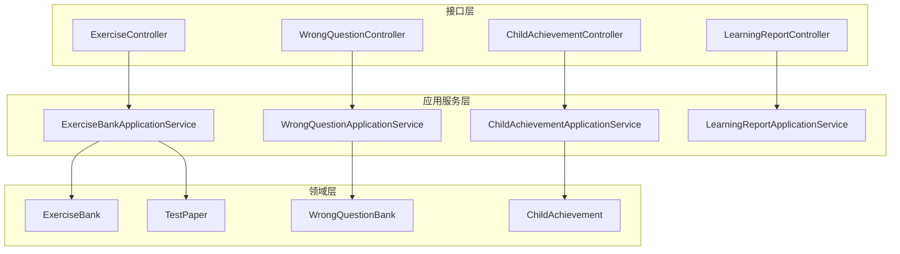
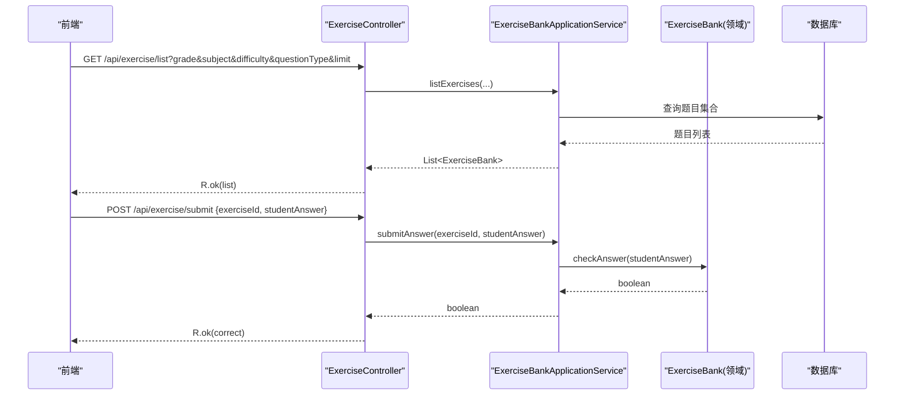
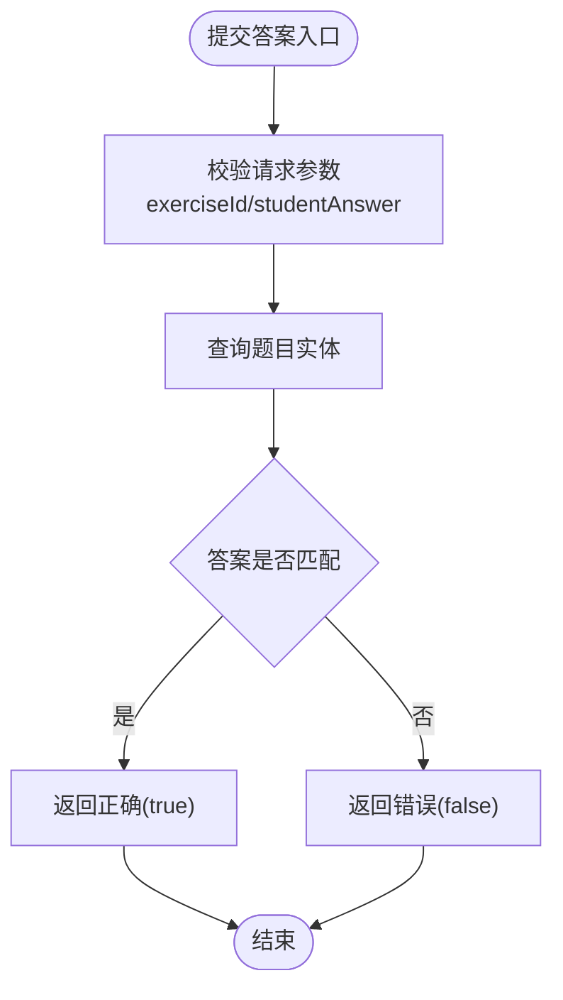
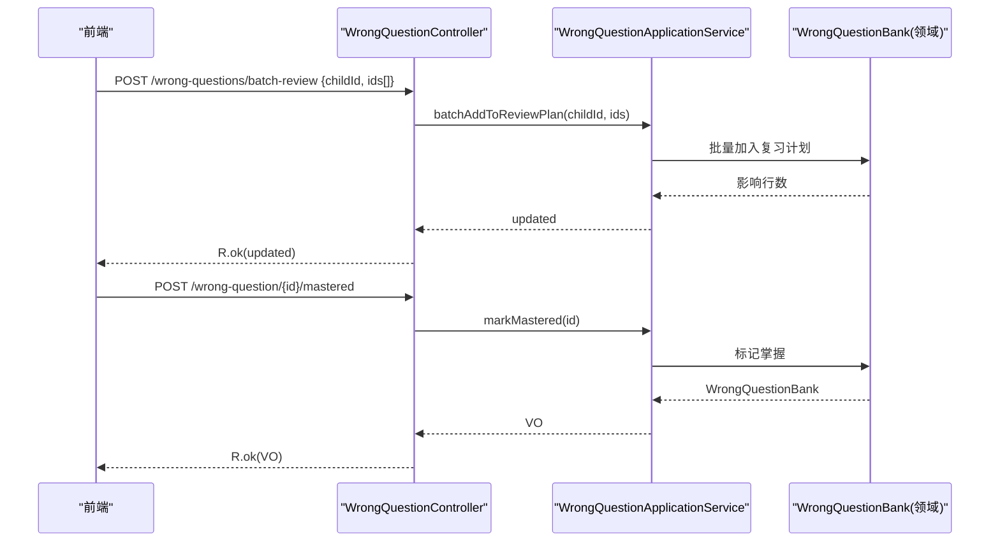
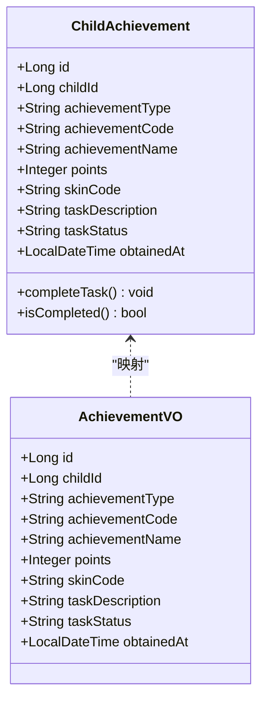
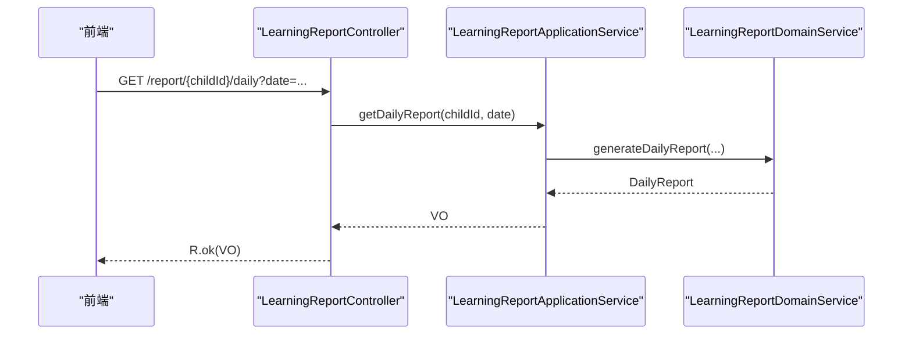
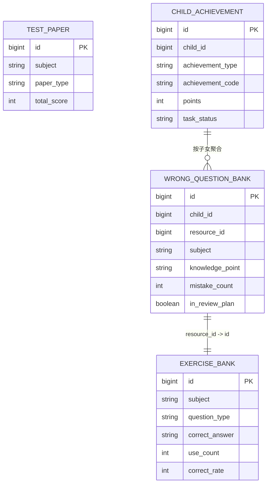
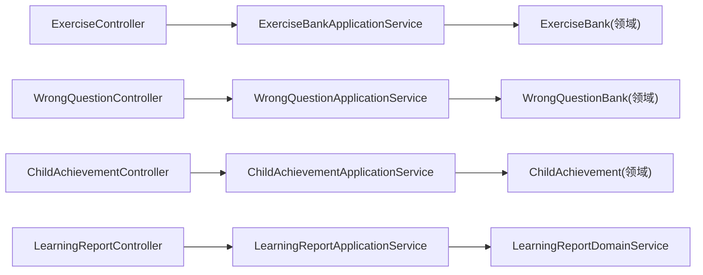

# 练习接口

<cite>
**本文引用的文件**
- [ExerciseController.java](file://wzoto-backend/wzoto-interfaces/src/main/java/com/wzoto/interfaces/controller/ExerciseController.java)
- [WrongQuestionController.java](file://wzoto-backend/wzoto-interfaces/src/main/java/com/wzoto/interfaces/controller/WrongQuestionController.java)
- [ChildAchievementController.java](file://wzoto-backend/wzoto-interfaces/src/main/java/com/wzoto/interfaces/controller/ChildAchievementController.java)
- [LearningReportController.java](file://wzoto-backend/wzoto-interfaces/src/main/java/com/wzoto/interfaces/controller/LearningReportController.java)
- [SubmitAnswerDTO.java](file://wzoto-backend/wzoto-interfaces/src/main/java/com/wzoto/interfaces/dto/SubmitAnswerDTO.java)
- [WrongQuestionVO.java](file://wzoto-backend/wzoto-interfaces/src/main/java/com/wzoto/interfaces/vo/learning/WrongQuestionVO.java)
- [AchievementVO.java](file://wzoto-backend/wzoto-interfaces/src/main/java/com/wzoto/interfaces/vo/learning/AchievementVO.java)
- [LearningReportVO.java](file://wzoto-backend/wzoto-interfaces/src/main/java/com/wzoto/interfaces/vo/learning/LearningReportVO.java)
- [ExerciseBankApplicationService.java](file://wzoto-backend/wzoto-application/src/main/java/com/wzoto/application/service/ExerciseBankApplicationService.java)
- [WrongQuestionApplicationService.java](file://wzoto-backend/wzoto-application/src/main/java/com/wzoto/application/service/WrongQuestionApplicationService.java)
- [ChildAchievementApplicationService.java](file://wzoto-backend/wzoto-application/src/main/java/com/wzoto/application/service/ChildAchievementApplicationService.java)
- [LearningReportApplicationService.java](file://wzoto-backend/wzoto-application/src/main/java/com/wzoto/application/service/LearningReportApplicationService.java)
- [ExerciseBank.java](file://wzoto-backend/wzoto-domain/src/main/java/com/wzoto/domain/entity/ExerciseBank.java)
- [WrongQuestionBank.java](file://wzoto-backend/wzoto-domain/src/main/java/com/wzoto/domain/entity/WrongQuestionBank.java)
- [ChildAchievement.java](file://wzoto-backend/wzoto-domain/src/main/java/com/wzoto/domain/entity/ChildAchievement.java)
- [TestPaper.java](file://wzoto-backend/wzoto-domain/src/main/java/com/wzoto/domain/entity/TestPaper.java)
</cite>

## 目录
1. [简介](#简介)
2. [项目结构](#项目结构)
3. [核心组件](#核心组件)
4. [架构总览](#架构总览)
5. [详细组件分析](#详细组件分析)
6. [依赖分析](#依赖分析)
7. [性能考虑](#性能考虑)
8. [故障排查指南](#故障排查指南)
9. [结论](#结论)
10. [附录](#附录)

## 简介
本文件为“练习模块”的完整API接口文档，覆盖题库管理、答题记录、错题收集、成就系统、学习分析与个性化推荐等能力。重点说明题目获取、答案提交、正确性判断、分数计算、错题本管理（添加、分类、复习计划）、成就解锁与进度追踪、学习统计与薄弱点识别、以及基于学习历史的题目推荐与难度自适应等流程。

## 项目结构
后端采用分层架构：接口层（Controller）暴露REST API；应用服务层（Application Service）编排业务用例；领域层（Domain）承载实体与领域规则；基础设施层负责持久化与外部集成。练习相关的主要入口集中在以下控制器与应用服务中。

图表来源
- [ExerciseController.java:1-56](file://wzoto-backend/wzoto-interfaces/src/main/java/com/wzoto/interfaces/controller/ExerciseController.java#L1-L56)
- [WrongQuestionController.java:1-71](file://wzoto-backend/wzoto-interfaces/src/main/java/com/wzoto/interfaces/controller/WrongQuestionController.java#L1-L71)
- [ChildAchievementController.java:1-60](file://wzoto-backend/wzoto-interfaces/src/main/java/com/wzoto/interfaces/controller/ChildAchievementController.java#L1-L60)
- [LearningReportController.java:1-141](file://wzoto-backend/wzoto-interfaces/src/main/java/com/wzoto/interfaces/controller/LearningReportController.java#L1-L141)
- [ExerciseBankApplicationService.java:1-43](file://wzoto-backend/wzoto-application/src/main/java/com/wzoto/application/service/ExerciseBankApplicationService.java#L1-L43)
- [WrongQuestionApplicationService.java:1-45](file://wzoto-backend/wzoto-application/src/main/java/com/wzoto/application/service/WrongQuestionApplicationService.java#L1-L45)
- [ChildAchievementApplicationService.java:1-52](file://wzoto-backend/wzoto-application/src/main/java/com/wzoto/application/service/ChildAchievementApplicationService.java#L1-L52)
- [LearningReportApplicationService.java:1-59](file://wzoto-backend/wzoto-application/src/main/java/com/wzoto/application/service/LearningReportApplicationService.java#L1-L59)
- [ExerciseBank.java:1-52](file://wzoto-backend/wzoto-domain/src/main/java/com/wzoto/domain/entity/ExerciseBank.java#L1-L52)
- [WrongQuestionBank.java:1-133](file://wzoto-backend/wzoto-domain/src/main/java/com/wzoto/domain/entity/WrongQuestionBank.java#L1-L133)
- [ChildAchievement.java:1-148](file://wzoto-backend/wzoto-domain/src/main/java/com/wzoto/domain/entity/ChildAchievement.java#L1-L148)
- [TestPaper.java:1-47](file://wzoto-backend/wzoto-domain/src/main/java/com/wzoto/domain/entity/TestPaper.java#L1-L47)

章节来源
- [ExerciseController.java:1-56](file://wzoto-backend/wzoto-interfaces/src/main/java/com/wzoto/interfaces/controller/ExerciseController.java#L1-L56)
- [WrongQuestionController.java:1-71](file://wzoto-backend/wzoto-interfaces/src/main/java/com/wzoto/interfaces/controller/WrongQuestionController.java#L1-L71)
- [ChildAchievementController.java:1-60](file://wzoto-backend/wzoto-interfaces/src/main/java/com/wzoto/interfaces/controller/ChildAchievementController.java#L1-L60)
- [LearningReportController.java:1-141](file://wzoto-backend/wzoto-interfaces/src/main/java/com/wzoto/interfaces/controller/LearningReportController.java#L1-L141)

## 核心组件
- 题库与试卷：提供题目列表、详情、答案提交、试卷获取与列表。
- 错题管理：按子女维度查询错题、批量加入复习计划、标记掌握。
- 成就系统：查询成就、下发任务、完成/授予勋章或积分。
- 学情报告：日/周/月报告、薄弱点排名、错题导出。

章节来源
- [ExerciseBankApplicationService.java:1-43](file://wzoto-backend/wzoto-application/src/main/java/com/wzoto/application/service/ExerciseBankApplicationService.java#L1-L43)
- [WrongQuestionApplicationService.java:1-45](file://wzoto-backend/wzoto-application/src/main/java/com/wzoto/application/service/WrongQuestionApplicationService.java#L1-L45)
- [ChildAchievementApplicationService.java:1-52](file://wzoto-backend/wzoto-application/src/main/java/com/wzoto/application/service/ChildAchievementApplicationService.java#L1-L52)
- [LearningReportApplicationService.java:1-59](file://wzoto-backend/wzoto-application/src/main/java/com/wzoto/application/service/LearningReportApplicationService.java#L1-L59)

## 架构总览
练习模块遵循“接口层→应用服务→领域服务→仓储/数据库”的分层调用路径。控制器仅做参数校验与响应封装，应用服务负责用例编排与权限上下文注入，领域层封装业务规则（如答案判定、掌握度重算、任务完成约束）。

图表来源
- [ExerciseController.java:24-42](file://wzoto-backend/wzoto-interfaces/src/main/java/com/wzoto/interfaces/controller/ExerciseController.java#L24-L42)
- [ExerciseBankApplicationService.java:21-32](file://wzoto-backend/wzoto-application/src/main/java/com/wzoto/application/service/ExerciseBankApplicationService.java#L21-L32)
- [ExerciseBank.java:41-45](file://wzoto-backend/wzoto-domain/src/main/java/com/wzoto/domain/entity/ExerciseBank.java#L41-L45)

## 详细组件分析

### 题库与试卷接口
- 获取题目列表
  - 路径与方法：GET /api/exercise/list
  - 请求参数：
    - grade: 年级编码（可选）
    - subject: 学科（可选）
    - difficulty: 难度（可选）
    - questionType: 题型（可选）
    - limit: 返回数量上限（默认20）
  - 响应：统一包装R<List<ExerciseBank>>
  - 说明：通过应用服务转换为领域枚举并调用领域服务查询。

- 获取题目详情
  - 路径与方法：GET /api/exercise/{id}
  - 响应：R<ExerciseBank>

- 提交答案
  - 路径与方法：POST /api/exercise/submit
  - 请求体：SubmitAnswerDTO
    - exerciseId: 题目ID（必填）
    - studentAnswer: 学生答案（必填）
  - 响应：R<Boolean>（是否正确）
  - 说明：答案正确性由领域实体的比较逻辑判定。

- 获取试卷
  - 路径与方法：GET /api/exercise/paper/{id}
  - 响应：R<TestPaper>

- 获取试卷列表
  - 路径与方法：GET /api/exercise/paper/list
  - 请求参数：grade、subject、paperType（均可选）
  - 响应：R<List<TestPaper>>

图表来源
- [ExerciseController.java:38-42](file://wzoto-backend/wzoto-interfaces/src/main/java/com/wzoto/interfaces/controller/ExerciseController.java#L38-L42)
- [SubmitAnswerDTO.java:1-15](file://wzoto-backend/wzoto-interfaces/src/main/java/com/wzoto/interfaces/dto/SubmitAnswerDTO.java#L1-L15)
- [ExerciseBank.java:41-45](file://wzoto-backend/wzoto-domain/src/main/java/com/wzoto/domain/entity/ExerciseBank.java#L41-L45)

章节来源
- [ExerciseController.java:24-54](file://wzoto-backend/wzoto-interfaces/src/main/java/com/wzoto/interfaces/controller/ExerciseController.java#L24-L54)
- [ExerciseBankApplicationService.java:21-41](file://wzoto-backend/wzoto-application/src/main/java/com/wzoto/application/service/ExerciseBankApplicationService.java#L21-L41)
- [ExerciseBank.java:20-52](file://wzoto-backend/wzoto-domain/src/main/java/com/wzoto/domain/entity/ExerciseBank.java#L20-L52)
- [TestPaper.java:20-47](file://wzoto-backend/wzoto-domain/src/main/java/com/wzoto/domain/entity/TestPaper.java#L20-L47)
- [SubmitAnswerDTO.java:1-15](file://wzoto-backend/wzoto-interfaces/src/main/java/com/wzoto/interfaces/dto/SubmitAnswerDTO.java#L1-L15)

### 错题管理接口
- 查询错题列表
  - 路径与方法：GET /api/learning/wrong-questions/{childId}
  - 请求参数：
    - childId: 子女ID（路径）
    - subject: 学科过滤（可选）
    - inReviewPlan: 是否在复习计划（可选）
  - 响应：R<List<WrongQuestionVO>>

- 批量加入复习计划
  - 路径与方法：POST /api/learning/wrong-questions/batch-review
  - 请求参数：
    - childId: 子女ID（查询参数）
    - ids: 错题ID列表（请求体）
  - 响应：R<Integer>（更新条数）

- 标记已掌握
  - 路径与方法：POST /api/learning/wrong-question/{id}/mastered
  - 响应：R<WrongQuestionVO>

图表来源
- [WrongQuestionController.java:35-52](file://wzoto-backend/wzoto-interfaces/src/main/java/com/wzoto/interfaces/controller/WrongQuestionController.java#L35-L52)
- [WrongQuestionApplicationService.java:28-38](file://wzoto-backend/wzoto-application/src/main/java/com/wzoto/application/service/WrongQuestionApplicationService.java#L28-L38)
- [WrongQuestionBank.java:80-124](file://wzoto-backend/wzoto-domain/src/main/java/com/wzoto/domain/entity/WrongQuestionBank.java#L80-L124)

章节来源
- [WrongQuestionController.java:26-52](file://wzoto-backend/wzoto-interfaces/src/main/java/com/wzoto/interfaces/controller/WrongQuestionController.java#L26-L52)
- [WrongQuestionApplicationService.java:23-38](file://wzoto-backend/wzoto-application/src/main/java/com/wzoto/application/service/WrongQuestionApplicationService.java#L23-L38)
- [WrongQuestionBank.java:60-133](file://wzoto-backend/wzoto-domain/src/main/java/com/wzoto/domain/entity/WrongQuestionBank.java#L60-L133)
- [WrongQuestionVO.java:1-25](file://wzoto-backend/wzoto-interfaces/src/main/java/com/wzoto/interfaces/vo/learning/WrongQuestionVO.java#L1-L25)

### 成就系统接口
- 查询成就列表
  - 路径与方法：GET /api/learning/achievements/{childId}
  - 请求参数：achievementType（可选）
  - 响应：R<List<AchievementVO>>

- 下发激励任务
  - 路径与方法：POST /api/learning/achievements/{childId}/task
  - 请求参数：
    - achievementName: 任务名称
    - taskDescription: 任务描述
    - points: 奖励积分（默认0）
  - 响应：R<AchievementVO>

- 授予勋章/积分（应用服务）
  - grantMedal(childId, code, name, iconUrl)
  - grantPoints(childId, points, name)
  - completeTask(achievementId)

图表来源
- [ChildAchievement.java:18-148](file://wzoto-backend/wzoto-domain/src/main/java/com/wzoto/domain/entity/ChildAchievement.java#L18-L148)
- [AchievementVO.java:1-24](file://wzoto-backend/wzoto-interfaces/src/main/java/com/wzoto/interfaces/vo/learning/AchievementVO.java#L1-L24)

章节来源
- [ChildAchievementController.java:26-42](file://wzoto-backend/wzoto-interfaces/src/main/java/com/wzoto/interfaces/controller/ChildAchievementController.java#L26-L42)
- [ChildAchievementApplicationService.java:23-50](file://wzoto-backend/wzoto-application/src/main/java/com/wzoto/application/service/ChildAchievementApplicationService.java#L23-L50)
- [ChildAchievement.java:64-148](file://wzoto-backend/wzoto-domain/src/main/java/com/wzoto/domain/entity/ChildAchievement.java#L64-L148)
- [AchievementVO.java:1-24](file://wzoto-backend/wzoto-interfaces/src/main/java/com/wzoto/interfaces/vo/learning/AchievementVO.java#L1-L24)

### 学习分析与报告接口
- 概览报告
  - 路径与方法：GET /api/learning/report/{childId}
  - 响应：R<LearningReportVO>（今日概览）

- 日报
  - 路径与方法：GET /api/learning/report/{childId}/daily?date=YYYY-MM-DD
  - 响应：R<LearningReportVO>

- 周报
  - 路径与方法：GET /api/learning/report/{childId}/weekly?weekStart=YYYY-MM-DD
  - 响应：R<LearningReportVO>

- 月报
  - 路径与方法：GET /api/learning/report/{childId}/monthly?year=&month=
  - 响应：R<LearningReportVO>

- 薄弱点排名
  - 路径与方法：GET /api/learning/report/{childId}/weak-points?subject=&topN=10
  - 响应：R<List<WeakPointVO>>

- 错题导出
  - 路径与方法：GET /api/learning/report/{childId}/wrong-questions/export?subject=
  - 响应：R<List<WrongQuestionBank>>

图表来源
- [LearningReportController.java:38-44](file://wzoto-backend/wzoto-interfaces/src/main/java/com/wzoto/interfaces/controller/LearningReportController.java#L38-L44)
- [LearningReportApplicationService.java:26-29](file://wzoto-backend/wzoto-application/src/main/java/com/wzoto/application/service/LearningReportApplicationService.java#L26-L29)

章节来源
- [LearningReportController.java:31-82](file://wzoto-backend/wzoto-interfaces/src/main/java/com/wzoto/interfaces/controller/LearningReportController.java#L31-L82)
- [LearningReportApplicationService.java:26-49](file://wzoto-backend/wzoto-application/src/main/java/com/wzoto/application/service/LearningReportApplicationService.java#L26-L49)
- [LearningReportVO.java:1-22](file://wzoto-backend/wzoto-interfaces/src/main/java/com/wzoto/interfaces/vo/learning/LearningReportVO.java#L1-L22)

### 数据模型关系图

图表来源
- [ExerciseBank.java:20-52](file://wzoto-backend/wzoto-domain/src/main/java/com/wzoto/domain/entity/ExerciseBank.java#L20-L52)
- [TestPaper.java:20-47](file://wzoto-backend/wzoto-domain/src/main/java/com/wzoto/domain/entity/TestPaper.java#L20-L47)
- [WrongQuestionBank.java:20-58](file://wzoto-backend/wzoto-domain/src/main/java/com/wzoto/domain/entity/WrongQuestionBank.java#L20-L58)
- [ChildAchievement.java:20-60](file://wzoto-backend/wzoto-domain/src/main/java/com/wzoto/domain/entity/ChildAchievement.java#L20-L60)

## 依赖分析
- 控制器到应用服务：松耦合，仅做入参校验与结果封装。
- 应用服务到领域服务：通过领域服务进行复杂编排与规则执行。
- 领域实体内聚：答案判定、掌握度重算、任务完成状态机均在实体内部实现，保证业务一致性。
- 权限与上下文：应用服务通过UserContext获取当前家长ID，并对子账号进行归属校验（学情报告）。

图表来源
- [ExerciseController.java:1-56](file://wzoto-backend/wzoto-interfaces/src/main/java/com/wzoto/interfaces/controller/ExerciseController.java#L1-L56)
- [WrongQuestionController.java:1-71](file://wzoto-backend/wzoto-interfaces/src/main/java/com/wzoto/interfaces/controller/WrongQuestionController.java#L1-L71)
- [ChildAchievementController.java:1-60](file://wzoto-backend/wzoto-interfaces/src/main/java/com/wzoto/interfaces/controller/ChildAchievementController.java#L1-L60)
- [LearningReportController.java:1-141](file://wzoto-backend/wzoto-interfaces/src/main/java/com/wzoto/interfaces/controller/LearningReportController.java#L1-L141)
- [ExerciseBankApplicationService.java:1-43](file://wzoto-backend/wzoto-application/src/main/java/com/wzoto/application/service/ExerciseBankApplicationService.java#L1-L43)
- [WrongQuestionApplicationService.java:1-45](file://wzoto-backend/wzoto-application/src/main/java/com/wzoto/application/service/WrongQuestionApplicationService.java#L1-L45)
- [ChildAchievementApplicationService.java:1-52](file://wzoto-backend/wzoto-application/src/main/java/com/wzoto/application/service/ChildAchievementApplicationService.java#L1-L52)
- [LearningReportApplicationService.java:1-59](file://wzoto-backend/wzoto-application/src/main/java/com/wzoto/application/service/LearningReportApplicationService.java#L1-L59)

章节来源
- 同上“图表来源”所列文件

## 性能考虑
- 列表分页与限制：题目与试卷列表支持limit/topN控制，避免一次性返回过多数据。
- 批量操作：错题批量加入复习计划使用批量更新，减少往返次数。
- 只读优化：报告类接口多为聚合查询，建议对常用维度建立索引（如childId、subject、时间字段）。
- 缓存策略：热点题目与试卷可引入缓存层降低数据库压力。
- 事务边界：写操作（标记掌握、批量加入复习计划、成就发放）使用事务保障一致性。

[本节为通用指导，不直接分析具体文件]

## 故障排查指南
- 参数校验失败
  - 提交答案时exerciseId或studentAnswer为空将触发校验异常。
  - 批量加入复习计划未传ids将抛出非法参数异常。
- 权限与归属
  - 学情报告接口会校验子女归属，不存在则抛出异常。
- 业务规则冲突
  - 成就任务重复完成会抛出状态异常。
- 日志定位
  - 关键操作包含BI埋点日志（如错题列表、导出、成就分配），便于问题回溯。

章节来源
- [SubmitAnswerDTO.java:1-15](file://wzoto-backend/wzoto-interfaces/src/main/java/com/wzoto/interfaces/dto/SubmitAnswerDTO.java#L1-L15)
- [WrongQuestionController.java:35-45](file://wzoto-backend/wzoto-interfaces/src/main/java/com/wzoto/interfaces/controller/WrongQuestionController.java#L35-L45)
- [LearningReportApplicationService.java:51-57](file://wzoto-backend/wzoto-application/src/main/java/com/wzoto/application/service/LearningReportApplicationService.java#L51-L57)
- [ChildAchievement.java:128-148](file://wzoto-backend/wzoto-domain/src/main/java/com/wzoto/domain/entity/ChildAchievement.java#L128-L148)

## 结论
本练习模块以清晰的层次划分与领域驱动设计实现了题库管理、答题判分、错题本、成就系统与学习分析等核心能力。接口简洁稳定，领域规则内聚于实体与服务，便于扩展与维护。后续可在推荐与难度自适应方面结合学习历史与知识图谱进一步智能化。

[本节为总结性内容，不直接分析具体文件]

## 附录

### 接口清单速查
- 题库与试卷
  - GET /api/exercise/list
  - GET /api/exercise/{id}
  - POST /api/exercise/submit
  - GET /api/exercise/paper/{id}
  - GET /api/exercise/paper/list
- 错题管理
  - GET /api/learning/wrong-questions/{childId}
  - POST /api/learning/wrong-questions/batch-review
  - POST /api/learning/wrong-question/{id}/mastered
- 成就系统
  - GET /api/learning/achievements/{childId}
  - POST /api/learning/achievements/{childId}/task
  - 应用服务：grantMedal/grantPoints/completeTask
- 学习分析
  - GET /api/learning/report/{childId}
  - GET /api/learning/report/{childId}/daily
  - GET /api/learning/report/{childId}/weekly
  - GET /api/learning/report/{childId}/monthly
  - GET /api/learning/report/{childId}/weak-points
  - GET /api/learning/report/{childId}/wrong-questions/export

章节来源
- [ExerciseController.java:24-54](file://wzoto-backend/wzoto-interfaces/src/main/java/com/wzoto/interfaces/controller/ExerciseController.java#L24-L54)
- [WrongQuestionController.java:26-52](file://wzoto-backend/wzoto-interfaces/src/main/java/com/wzoto/interfaces/controller/WrongQuestionController.java#L26-L52)
- [ChildAchievementController.java:26-42](file://wzoto-backend/wzoto-interfaces/src/main/java/com/wzoto/interfaces/controller/ChildAchievementController.java#L26-L42)
- [LearningReportController.java:31-82](file://wzoto-backend/wzoto-interfaces/src/main/java/com/wzoto/interfaces/controller/LearningReportController.java#L31-L82)