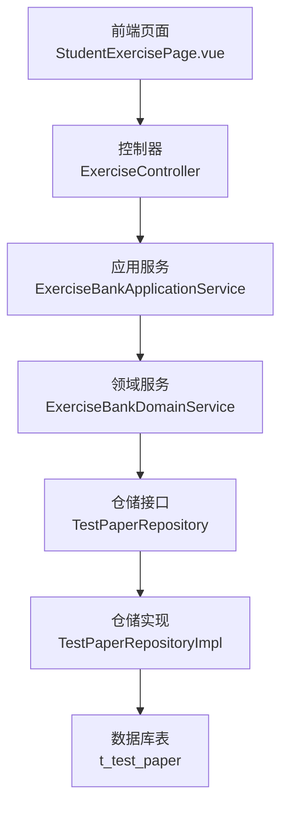
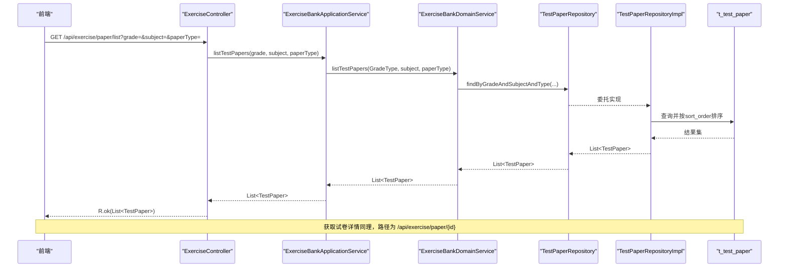
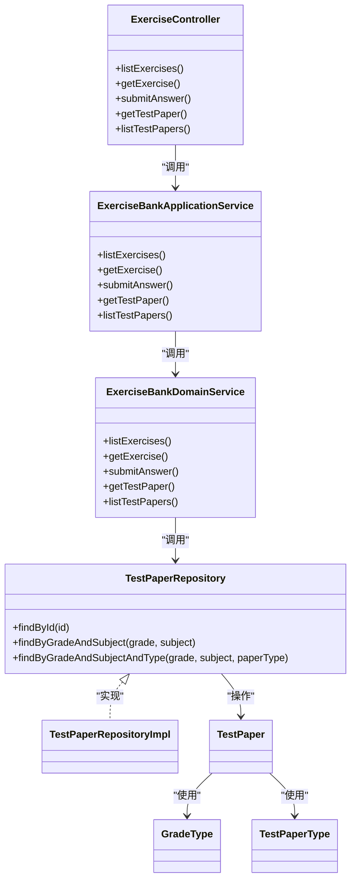

# 试卷管理接口

<cite>
**本文引用的文件**
- [ExerciseController.java](file://wzoto-backend/wzoto-interfaces/src/main/java/com/wzoto/interfaces/controller/ExerciseController.java)
- [ExerciseBankApplicationService.java](file://wzoto-backend/wzoto-application/src/main/java/com/wzoto/application/service/ExerciseBankApplicationService.java)
- [ExerciseBankDomainService.java](file://wzoto-backend/wzoto-domain/src/main/java/com/wzoto/domain/service/ExerciseBankDomainService.java)
- [TestPaperRepository.java](file://wzoto-backend/wzoto-domain/src/main/java/com/wzoto/domain/repository/TestPaperRepository.java)
- [TestPaperRepositoryImpl.java](file://wzoto-backend/wzoto-infrastructure/src/main/java/com/wzoto/infrastructure/repository/TestPaperRepositoryImpl.java)
- [TestPaper.java](file://wzoto-backend/wzoto-domain/src/main/java/com/wzoto/domain/entity/TestPaper.java)
- [TestPaperPO.java](file://wzoto-backend/wzoto-infrastructure/src/main/java/com/wzoto/infrastructure/pojo/TestPaperPO.java)
- [GradeType.java](file://wzoto-backend/wzoto-domain/src/main/java/com/wzoto/domain/valobj/GradeType.java)
- [TestPaperType.java](file://wzoto-backend/wzoto-domain/src/main/java/com/wzoto/domain/valobj/TestPaperType.java)
- [t_test_paper.sql](file://wzoto-backend/sql/t_test_paper.sql)
- [seed_data_paper_audio.sql](file://wzoto-backend/sql/seed_data_paper_audio.sql)
- [StudentExercisePage.vue](file://wzoto-frontend/src/pages/student/StudentExercisePage.vue)
</cite>

## 目录
1. [简介](#简介)
2. [项目结构](#项目结构)
3. [核心组件](#核心组件)
4. [架构总览](#架构总览)
5. [详细组件分析](#详细组件分析)
6. [依赖关系分析](#依赖关系分析)
7. [性能考虑](#性能考虑)
8. [故障排查指南](#故障排查指南)
9. [结论](#结论)
10. [附录](#附录)

## 简介
本章节面向“试卷管理”能力，提供以下API的完整说明：
- 获取试卷列表：GET /api/exercise/paper/list
- 获取试卷详情：GET /api/exercise/paper/{id}

同时给出试卷数据结构定义、题目集合组织方式与评分规则配置，并说明当前代码库中试卷生成逻辑（随机抽题算法与难度平衡策略）的现状与建议。

## 项目结构
后端采用分层架构：接口层（Controller）→ 应用服务（Application Service）→ 领域服务（Domain Service）→ 仓储接口（Repository）→ 基础设施实现（Infrastructure）。前端通过页面调用相关接口完成试卷列表展示与详情加载。

图表来源
- [ExerciseController.java:18-54](file://wzoto-backend/wzoto-interfaces/src/main/java/com/wzoto/interfaces/controller/ExerciseController.java#L18-L54)
- [ExerciseBankApplicationService.java:17-41](file://wzoto-backend/wzoto-application/src/main/java/com/wzoto/application/service/ExerciseBankApplicationService.java#L17-L41)
- [ExerciseBankDomainService.java:17-86](file://wzoto-backend/wzoto-domain/src/main/java/com/wzoto/domain/service/ExerciseBankDomainService.java#L17-L86)
- [TestPaperRepository.java:7-12](file://wzoto-backend/wzoto-domain/src/main/java/com/wzoto/domain/repository/TestPaperRepository.java#L7-L12)
- [TestPaperRepositoryImpl.java:34-70](file://wzoto-backend/wzoto-infrastructure/src/main/java/com/wzoto/infrastructure/repository/TestPaperRepositoryImpl.java#L34-L70)
- [t_test_paper.sql:4-26](file://wzoto-backend/sql/t_test_paper.sql#L4-L26)

章节来源
- [ExerciseController.java:18-54](file://wzoto-backend/wzoto-interfaces/src/main/java/com/wzoto/interfaces/controller/ExerciseController.java#L18-L54)
- [ExerciseBankApplicationService.java:17-41](file://wzoto-backend/wzoto-application/src/main/java/com/wzoto/application/service/ExerciseBankApplicationService.java#L17-L41)
- [ExerciseBankDomainService.java:17-86](file://wzoto-backend/wzoto-domain/src/main/java/com/wzoto/domain/service/ExerciseBankDomainService.java#L17-L86)
- [TestPaperRepository.java:7-12](file://wzoto-backend/wzoto-domain/src/main/java/com/wzoto/domain/repository/TestPaperRepository.java#L7-L12)
- [TestPaperRepositoryImpl.java:34-70](file://wzoto-backend/wzoto-infrastructure/src/main/java/com/wzoto/infrastructure/repository/TestPaperRepositoryImpl.java#L34-L70)
- [t_test_paper.sql:4-26](file://wzoto-backend/sql/t_test_paper.sql#L4-L26)

## 核心组件
- 控制器：暴露REST接口，接收请求参数并返回统一响应体。
- 应用服务：负责参数转换与编排调用领域服务。
- 领域服务：封装业务规则，按条件查询试卷或获取详情。
- 仓储接口与实现：基于MyBatis-Plus进行数据访问，支持按年级、学科、试卷类型筛选。
- 实体与值对象：描述试卷元数据、类型枚举等。

章节来源
- [ExerciseController.java:18-54](file://wzoto-backend/wzoto-interfaces/src/main/java/com/wzoto/interfaces/controller/ExerciseController.java#L18-L54)
- [ExerciseBankApplicationService.java:17-41](file://wzoto-backend/wzoto-application/src/main/java/com/wzoto/application/service/ExerciseBankApplicationService.java#L17-L41)
- [ExerciseBankDomainService.java:17-86](file://wzoto-backend/wzoto-domain/src/main/java/com/wzoto/domain/service/ExerciseBankDomainService.java#L17-L86)
- [TestPaperRepository.java:7-12](file://wzoto-backend/wzoto-domain/src/main/java/com/wzoto/domain/repository/TestPaperRepository.java#L7-L12)
- [TestPaperRepositoryImpl.java:34-70](file://wzoto-backend/wzoto-infrastructure/src/main/java/com/wzoto/infrastructure/repository/TestPaperRepositoryImpl.java#L34-L70)

## 架构总览
下图展示了从前端到数据库的完整调用链路，以及关键的数据流转。

图表来源
- [ExerciseController.java:44-54](file://wzoto-backend/wzoto-interfaces/src/main/java/com/wzoto/interfaces/controller/ExerciseController.java#L44-L54)
- [ExerciseBankApplicationService.java:34-41](file://wzoto-backend/wzoto-application/src/main/java/com/wzoto/application/service/ExerciseBankApplicationService.java#L34-L41)
- [ExerciseBankDomainService.java:59-78](file://wzoto-backend/wzoto-domain/src/main/java/com/wzoto/domain/service/ExerciseBankDomainService.java#L59-L78)
- [TestPaperRepositoryImpl.java:34-47](file://wzoto-backend/wzoto-infrastructure/src/main/java/com/wzoto/infrastructure/repository/TestPaperRepositoryImpl.java#L34-L47)
- [t_test_paper.sql:4-26](file://wzoto-backend/sql/t_test_paper.sql#L4-L26)

## 详细组件分析

### API：获取试卷列表
- 接口地址：GET /api/exercise/paper/list
- 功能：根据年级、学科、试卷类型筛选并返回试卷列表，默认按sort_order升序排列。
- 请求参数
  - grade：字符串，表示年级，如 GRADE_1~GRADE_6；可选
  - subject：字符串，表示学科，如 MATH/CHINESE/ENGLISH；可选
  - paperType：字符串，表示试卷类型，如 UNIT/MID_TERM/FINAL/MOCK；可选
- 响应体：统一包装 R<List<TestPaper>>，其中 TestPaper 字段见“数据结构定义”。

章节来源
- [ExerciseController.java:49-54](file://wzoto-backend/wzoto-interfaces/src/main/java/com/wzoto/interfaces/controller/ExerciseController.java#L49-L54)
- [ExerciseBankApplicationService.java:38-41](file://wzoto-backend/wzoto-application/src/main/java/com/wzoto/application/service/ExerciseBankApplicationService.java#L38-L41)
- [ExerciseBankDomainService.java:70-78](file://wzoto-backend/wzoto-domain/src/main/java/com/wzoto/domain/service/ExerciseBankDomainService.java#L70-L78)
- [TestPaperRepositoryImpl.java:40-47](file://wzoto-backend/wzoto-infrastructure/src/main/java/com/wzoto/infrastructure/repository/TestPaperRepositoryImpl.java#L40-L47)

### API：获取试卷详情
- 接口地址：GET /api/exercise/paper/{id}
- 功能：根据试卷ID返回试卷详情。
- 路径参数
  - id：Long，试卷主键ID
- 响应体：统一包装 R<TestPaper>。

章节来源
- [ExerciseController.java:44-47](file://wzoto-backend/wzoto-interfaces/src/main/java/com/wzoto/interfaces/controller/ExerciseController.java#L44-L47)
- [ExerciseBankApplicationService.java:34-36](file://wzoto-backend/wzoto-application/src/main/java/com/wzoto/application/service/ExerciseBankApplicationService.java#L34-L36)
- [ExerciseBankDomainService.java:59-68](file://wzoto-backend/wzoto-domain/src/main/java/com/wzoto/domain/service/ExerciseBankDomainService.java#L59-L68)

### 数据结构定义
- 试卷实体 TestPaper 主要字段
  - id：Long，主键
  - grade：GradeType，年级枚举
  - subject：String，学科
  - textbookVersion：TextbookVersion，教材版本
  - title：String，标题
  - paperType：TestPaperType，试卷类型枚举
  - description：String，说明
  - totalScore：Integer，总分
  - durationMinutes：Integer，建议用时（分钟）
  - questionsJson：String，题目集合JSON（包含题目ID和分值）
  - coverUrl：String，封面图URL
  - vipOnly：Boolean，是否仅会员
  - useCount：Integer，使用次数
  - sortOrder：Integer，排序号
  - deleted：Boolean，软删除标记
  - createdAt/updatedAt：时间戳

- 值对象
  - GradeType：GRADE_1~GRADE_6
  - TestPaperType：UNIT（单元测试）、MID_TERM（期中考试）、FINAL（期末考试）、MOCK（模拟测试）

- 数据库表 t_test_paper 字段与约束
  - 关键字段：grade、subject、textbook_version、title、paper_type、description、total_score、duration_minutes、questions_json、cover_url、vip_only、use_count、sort_order、deleted、created_at、updated_at
  - 索引：idx_grade_subject、idx_paper_type、idx_textbook_version、idx_vip_only

章节来源
- [TestPaper.java:16-46](file://wzoto-backend/wzoto-domain/src/main/java/com/wzoto/domain/entity/TestPaper.java#L16-L46)
- [GradeType.java:8-45](file://wzoto-backend/wzoto-domain/src/main/java/com/wzoto/domain/valobj/GradeType.java#L8-L45)
- [TestPaperType.java:8-32](file://wzoto-backend/wzoto-domain/src/main/java/com/wzoto/domain/valobj/TestPaperType.java#L8-L32)
- [t_test_paper.sql:4-26](file://wzoto-backend/sql/t_test_paper.sql#L4-L26)

### 题目集合组织与评分规则配置
- 题目集合存储于 TestPaper.questionsJson，示例结构包含两个数组：
  - questionIds：题目ID列表
  - scores：对应题目的分值列表
- 该结构与种子数据一致，便于前端渲染题目顺序与分值分布。
- 总分 totalScore 与 scores 之和应保持一致，用于校验与展示。

章节来源
- [TestPaper.java:20-37](file://wzoto-backend/wzoto-domain/src/main/java/com/wzoto/domain/entity/TestPaper.java#L20-L37)
- [seed_data_paper_audio.sql:7-13](file://wzoto-backend/sql/seed_data_paper_audio.sql#L7-L13)
- [seed_data_paper_audio.sql:16-21](file://wzoto-backend/sql/seed_data_paper_audio.sql#L16-L21)

### 试卷生成逻辑说明（现状与建议）
- 现状
  - 当前代码库未实现动态组卷（随机抽题与难度平衡）逻辑。
  - 试卷以静态数据形式存在，questionsJson 直接指定题目ID与分值。
  - 列表与详情接口均基于静态数据查询与返回。
- 建议方案（供后续扩展）
  - 随机抽题算法
    - 输入：年级、学科、题型、难度分布、题目数量、总分目标
    - 步骤：
      1) 按年级+学科+题型过滤题库
      2) 按难度分层抽样（如基础/中等/提高比例）
      3) 去重与顺序打乱
      4) 计算累计分值，调整题目使总分等于 totalScore
  - 难度平衡策略
    - 设定难度权重与目标分布（例如 易:中:难 = 4:4:2）
    - 在抽样阶段按权重分配各难度题目数量
    - 若某难度题目不足，回退至相邻难度并记录告警
  - 评分规则
    - 每题分值由抽取的题目决定，最终 scores 数组与题目一一对应
    - 提交答案后逐题判分，汇总得到总分与正确率
  - 可观测性
    - 记录组卷参数、实际抽取题目、难度分布与总分偏差，便于审计与优化

[本节为概念性说明，不直接分析具体文件]

## 依赖关系分析
- 控制器依赖应用服务，应用服务依赖领域服务，领域服务依赖仓储接口，仓储接口由基础设施实现。
- 值对象 GradeType、TestPaperType 被多处引用，保证类型一致性。
- 数据库表 t_test_paper 是持久化核心，索引设计支撑常见查询场景。

图表来源
- [ExerciseController.java:18-54](file://wzoto-backend/wzoto-interfaces/src/main/java/com/wzoto/interfaces/controller/ExerciseController.java#L18-L54)
- [ExerciseBankApplicationService.java:17-41](file://wzoto-backend/wzoto-application/src/main/java/com/wzoto/application/service/ExerciseBankApplicationService.java#L17-L41)
- [ExerciseBankDomainService.java:17-86](file://wzoto-backend/wzoto-domain/src/main/java/com/wzoto/domain/service/ExerciseBankDomainService.java#L17-L86)
- [TestPaperRepository.java:7-12](file://wzoto-backend/wzoto-domain/src/main/java/com/wzoto/domain/repository/TestPaperRepository.java#L7-L12)
- [TestPaperRepositoryImpl.java:34-70](file://wzoto-backend/wzoto-infrastructure/src/main/java/com/wzoto/infrastructure/repository/TestPaperRepositoryImpl.java#L34-L70)
- [TestPaper.java:16-46](file://wzoto-backend/wzoto-domain/src/main/java/com/wzoto/domain/entity/TestPaper.java#L16-L46)
- [GradeType.java:8-45](file://wzoto-backend/wzoto-domain/src/main/java/com/wzoto/domain/valobj/GradeType.java#L8-L45)
- [TestPaperType.java:8-32](file://wzoto-backend/wzoto-domain/src/main/java/com/wzoto/domain/valobj/TestPaperType.java#L8-L32)

章节来源
- [ExerciseController.java:18-54](file://wzoto-backend/wzoto-interfaces/src/main/java/com/wzoto/interfaces/controller/ExerciseController.java#L18-L54)
- [ExerciseBankApplicationService.java:17-41](file://wzoto-backend/wzoto-application/src/main/java/com/wzoto/application/service/ExerciseBankApplicationService.java#L17-L41)
- [ExerciseBankDomainService.java:17-86](file://wzoto-backend/wzoto-domain/src/main/java/com/wzoto/domain/service/ExerciseBankDomainService.java#L17-L86)
- [TestPaperRepository.java:7-12](file://wzoto-backend/wzoto-domain/src/main/java/com/wzoto/domain/repository/TestPaperRepository.java#L7-L12)
- [TestPaperRepositoryImpl.java:34-70](file://wzoto-backend/wzoto-infrastructure/src/main/java/com/wzoto/infrastructure/repository/TestPaperRepositoryImpl.java#L34-L70)

## 性能考虑
- 查询优化
  - 利用索引 idx_grade_subject、idx_paper_type、idx_textbook_version 提升筛选效率
  - 列表查询默认按 sort_order 升序，避免额外排序开销
- 数据量控制
  - 列表接口可按需增加分页参数（当前未实现），避免一次性返回过多数据
- JSON解析
  - questionsJson 在前端解析时注意异常处理，确保容错

[本节为通用指导，不直接分析具体文件]

## 故障排查指南
- 常见问题
  - 参数无效：当传入的 grade 或 paperType 不在枚举范围内，可能抛出非法参数异常
  - 数据不存在：获取详情时若ID不存在，将抛出“试卷不存在”异常
  - 前端提示：当前前端在调用详情接口时会提示“试卷功能开发中”，需确认后端已就绪
- 定位方法
  - 检查请求参数是否符合枚举定义
  - 核对数据库中是否存在对应ID的记录
  - 查看日志输出，确认调用链路与异常堆栈

章节来源
- [ExerciseBankDomainService.java:59-68](file://wzoto-backend/wzoto-domain/src/main/java/com/wzoto/domain/service/ExerciseBankDomainService.java#L59-L68)
- [StudentExercisePage.vue:149-153](file://wzoto-frontend/src/pages/student/StudentExercisePage.vue#L149-L153)

## 结论
- 已实现的接口：
  - GET /api/exercise/paper/list：支持按年级、学科、试卷类型筛选
  - GET /api/exercise/paper/{id}：根据ID获取试卷详情
- 数据结构清晰：TestPaper 实体与 t_test_paper 表字段一致，questionsJson 明确题目集合与分值
- 当前未实现动态组卷：试卷为静态数据，后续可扩展随机抽题与难度平衡策略以提升灵活性

[本节为总结，不直接分析具体文件]

## 附录
- 前端调用示例（参考）
  - 列表：调用 listTestPapers(params)，params 可包含 grade、subject
  - 详情：调用 getTestPaper(paper.id)
- 相关脚本与数据
  - 种子数据中包含多套试卷样例，questionsJson 格式可作为参考

章节来源
- [StudentExercisePage.vue:129-153](file://wzoto-frontend/src/pages/student/StudentExercisePage.vue#L129-L153)
- [seed_data_paper_audio.sql:7-21](file://wzoto-backend/sql/seed_data_paper_audio.sql#L7-L21)