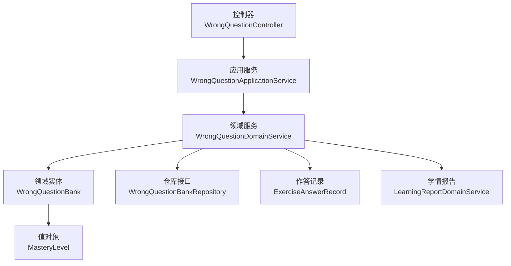
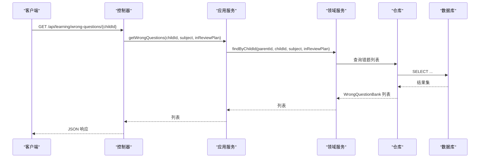
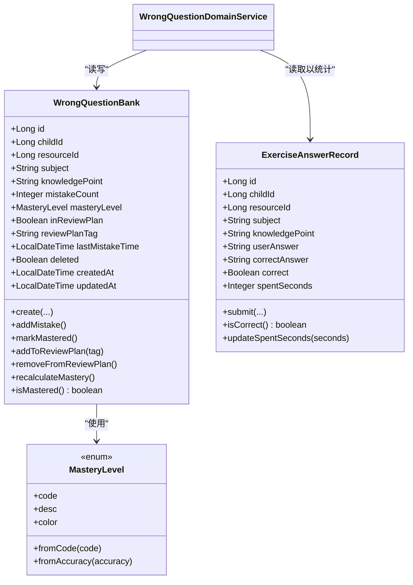
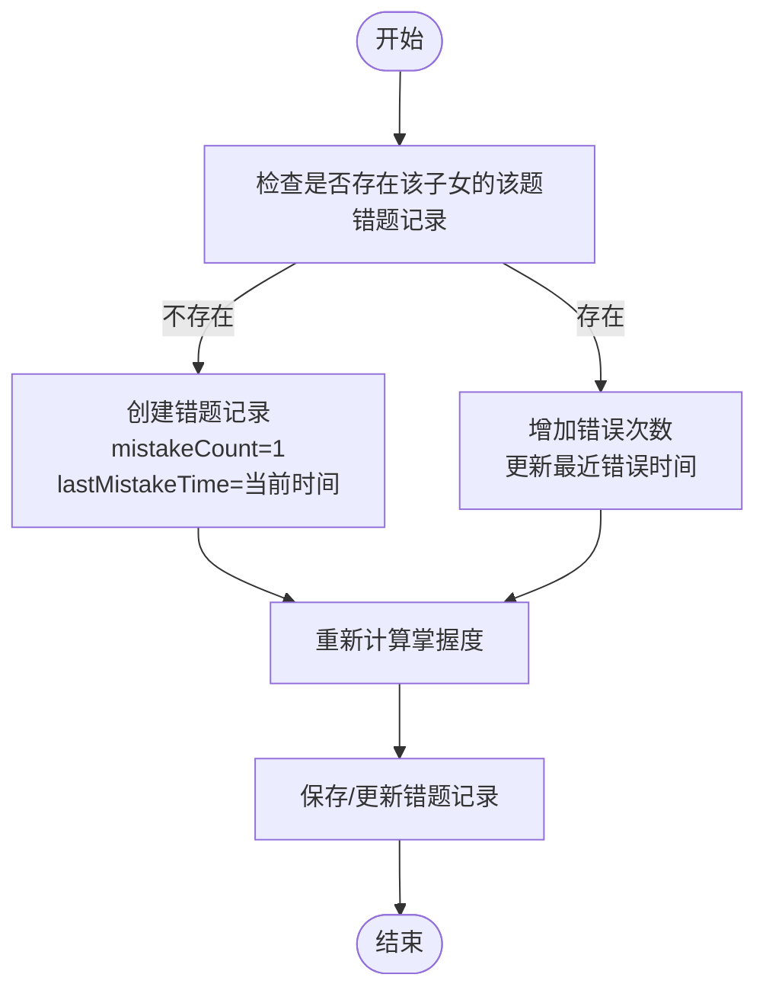
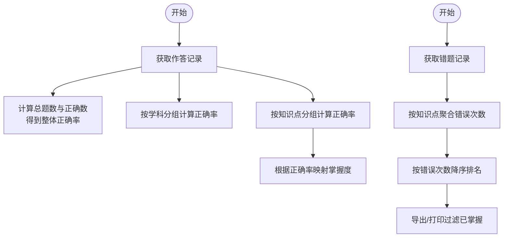
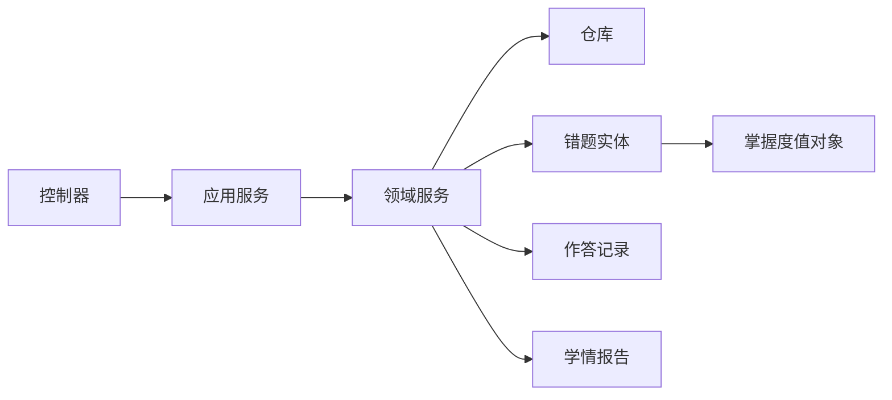

# 错题本接口

<cite>
**本文引用的文件**
- [WrongQuestionController.java](file://wzoto-backend/wzoto-interfaces/src/main/java/com/wzoto/interfaces/controller/WrongQuestionController.java)
- [WrongQuestionApplicationService.java](file://wzoto-backend/wzoto-application/src/main/java/com/wzoto/application/service/WrongQuestionApplicationService.java)
- [WrongQuestionDomainService.java](file://wzoto-backend/wzoto-domain/src/main/java/com/wzoto/domain/service/WrongQuestionDomainService.java)
- [WrongQuestionBank.java](file://wzoto-backend/wzoto-domain/src/main/java/com/wzoto/domain/entity/WrongQuestionBank.java)
- [MasteryLevel.java](file://wzoto-backend/wzoto-domain/src/main/java/com/wzoto/domain/valobj/MasteryLevel.java)
- [ExerciseAnswerRecord.java](file://wzoto-backend/wzoto-domain/src/main/java/com/wzoto/domain/entity/ExerciseAnswerRecord.java)
- [LearningReportDomainService.java](file://wzoto-backend/wzoto-domain/src/main/java/com/wzoto/domain/service/LearningReportDomainService.java)
- [t_wrong_question_bank.sql](file://wzoto-backend/sql/t_wrong_question_bank.sql)
- [WrongQuestionVO.java](file://wzoto-backend/wzoto-interfaces/src/main/java/com/wzoto/interfaces/vo/learning/WrongQuestionVO.java)
</cite>

## 目录
1. [简介](#简介)
2. [项目结构](#项目结构)
3. [核心组件](#核心组件)
4. [架构总览](#架构总览)
5. [详细组件分析](#详细组件分析)
6. [依赖关系分析](#依赖关系分析)
7. [性能考虑](#性能考虑)
8. [故障排查指南](#故障排查指南)
9. [结论](#结论)
10. [附录](#附录)

## 简介
本接口文档面向“错题本管理”能力，覆盖以下功能：
- 错题添加与自动收集：基于答题错误记录智能识别并生成错题。
- 错题列表查询：支持按子女、学科、是否进入复习计划等维度筛选。
- 错题分类整理：按学科、知识点进行聚合与统计。
- 错题复习：批量加入复习计划、标记掌握状态。
- 统计分析：错误率计算、薄弱知识点识别、导出打印数据。

错题数据模型包含题目信息（资源ID、学科、知识点）、错误答案与正确答案、错误次数、最近错误时间、掌握程度、是否进入复习计划及复习计划标识等字段。

## 项目结构
错题本相关代码采用分层架构：
- 接口层：控制器暴露REST API。
- 应用层：编排用例，处理事务边界与上下文。
- 领域层：承载业务规则（错题实体、值对象、领域服务）。
- 基础设施层：持久化映射与存储（由仓库接口抽象）。

图表来源
- [WrongQuestionController.java:1-71](file://wzoto-backend/wzoto-interfaces/src/main/java/com/wzoto/interfaces/controller/WrongQuestionController.java#L1-L71)
- [WrongQuestionApplicationService.java:1-45](file://wzoto-backend/wzoto-application/src/main/java/com/wzoto/application/service/WrongQuestionApplicationService.java#L1-L45)
- [WrongQuestionDomainService.java:1-101](file://wzoto-backend/wzoto-domain/src/main/java/com/wzoto/domain/service/WrongQuestionDomainService.java#L1-L101)
- [WrongQuestionBank.java:1-133](file://wzoto-backend/wzoto-domain/src/main/java/com/wzoto/domain/entity/WrongQuestionBank.java#L1-L133)
- [MasteryLevel.java:1-48](file://wzoto-backend/wzoto-domain/src/main/java/com/wzoto/domain/valobj/MasteryLevel.java#L1-L48)
- [ExerciseAnswerRecord.java:1-99](file://wzoto-backend/wzoto-domain/src/main/java/com/wzoto/domain/entity/ExerciseAnswerRecord.java#L1-L99)
- [LearningReportDomainService.java:1-160](file://wzoto-backend/wzoto-domain/src/main/java/com/wzoto/domain/service/LearningReportDomainService.java#L1-L160)

章节来源
- [WrongQuestionController.java:1-71](file://wzoto-backend/wzoto-interfaces/src/main/java/com/wzoto/interfaces/controller/WrongQuestionController.java#L1-L71)
- [WrongQuestionApplicationService.java:1-45](file://wzoto-backend/wzoto-application/src/main/java/com/wzoto/application/service/WrongQuestionApplicationService.java#L1-L45)
- [WrongQuestionDomainService.java:1-101](file://wzoto-backend/wzoto-domain/src/main/java/com/wzoto/domain/service/WrongQuestionDomainService.java#L1-L101)

## 核心组件
- 控制器：提供错题列表查询、批量加入复习计划、标记掌握等HTTP端点。
- 应用服务：封装用例流程，维护事务边界，调用领域服务。
- 领域服务：实现错题查询、批量复习计划、标记掌握、打印数据准备、错题记录同步等核心逻辑。
- 领域实体：错题记录的数据结构与行为（错误计数、掌握度重算、复习计划加入/移除）。
- 值对象：掌握度枚举，支持从正确率推导掌握度。
- 作答记录：用于触发错题自动收集的来源。
- 学情报告：错误率计算、薄弱知识点排行、导出错题。

章节来源
- [WrongQuestionController.java:1-71](file://wzoto-backend/wzoto-interfaces/src/main/java/com/wzoto/interfaces/controller/WrongQuestionController.java#L1-L71)
- [WrongQuestionApplicationService.java:1-45](file://wzoto-backend/wzoto-application/src/main/java/com/wzoto/application/service/WrongQuestionApplicationService.java#L1-L45)
- [WrongQuestionDomainService.java:1-101](file://wzoto-backend/wzoto-domain/src/main/java/com/wzoto/domain/service/WrongQuestionDomainService.java#L1-L101)
- [WrongQuestionBank.java:1-133](file://wzoto-backend/wzoto-domain/src/main/java/com/wzoto/domain/entity/WrongQuestionBank.java#L1-L133)
- [MasteryLevel.java:1-48](file://wzoto-backend/wzoto-domain/src/main/java/com/wzoto/domain/valobj/MasteryLevel.java#L1-L48)
- [ExerciseAnswerRecord.java:1-99](file://wzoto-backend/wzoto-domain/src/main/java/com/wzoto/domain/entity/ExerciseAnswerRecord.java#L1-L99)
- [LearningReportDomainService.java:1-160](file://wzoto-backend/wzoto-domain/src/main/java/com/wzoto/domain/service/LearningReportDomainService.java#L1-L160)

## 架构总览
错题本API的请求链路如下：
- 客户端调用控制器端点。
- 控制器将请求参数转换为领域输入，调用应用服务。
- 应用服务在事务中调用领域服务完成业务操作。
- 领域服务通过仓库访问持久化层，必要时结合作答记录与学情报告进行统计。

图表来源
- [WrongQuestionController.java:26-33](file://wzoto-backend/wzoto-interfaces/src/main/java/com/wzoto/interfaces/controller/WrongQuestionController.java#L26-L33)
- [WrongQuestionApplicationService.java:23-26](file://wzoto-backend/wzoto-application/src/main/java/com/wzoto/application/service/WrongQuestionApplicationService.java#L23-L26)
- [WrongQuestionDomainService.java:28-40](file://wzoto-backend/wzoto-domain/src/main/java/com/wzoto/domain/service/WrongQuestionDomainService.java#L28-L40)

## 详细组件分析

### 接口定义与使用
- 获取错题列表
  - 路径：GET /api/learning/wrong-questions/{childId}
  - 查询参数：
    - subject：可选，按学科过滤
    - inReviewPlan：可选，是否仅返回进入复习计划的错题
  - 响应：错题列表（包含掌握度描述与颜色）
- 批量加入复习计划
  - 路径：POST /api/learning/wrong-questions/batch-review
  - 请求体：ids 数组（错题主键）
  - 说明：为指定错题设置复习计划标签（日期格式），并标记进入复习计划
- 标记已掌握
  - 路径：POST /api/learning/wrong-question/{id}/mastered
  - 说明：将错题掌握度设置为“熟练”，并从复习计划中移除（由领域行为控制）

章节来源
- [WrongQuestionController.java:26-52](file://wzoto-backend/wzoto-interfaces/src/main/java/com/wzoto/interfaces/controller/WrongQuestionController.java#L26-L52)
- [WrongQuestionApplicationService.java:23-38](file://wzoto-backend/wzoto-application/src/main/java/com/wzoto/application/service/WrongQuestionApplicationService.java#L23-L38)
- [WrongQuestionDomainService.java:45-67](file://wzoto-backend/wzoto-domain/src/main/java/com/wzoto/domain/service/WrongQuestionDomainService.java#L45-L67)

### 错题数据模型
- 实体字段
  - id：主键
  - childId：子女ID
  - resourceId：学习资源ID（题库题目）
  - subject：学科
  - knowledgePoint：知识点
  - mistakeCount：错误次数
  - masteryLevel：掌握度（未掌握/一般/熟练）
  - inReviewPlan：是否进入复习计划
  - reviewPlanTag：复习计划标识
  - lastMistakeTime：最近错误时间
  - deleted：软删除标志
  - createdAt/updatedAt：时间戳
- 值对象
  - MasteryLevel：掌握度枚举，支持从正确率推导掌握度
- 关联数据
  - ExerciseAnswerRecord：作答记录，用于触发错题自动收集
- 数据库表
  - t_wrong_question_bank：错题库表，含索引优化查询

图表来源
- [WrongQuestionBank.java:1-133](file://wzoto-backend/wzoto-domain/src/main/java/com/wzoto/domain/entity/WrongQuestionBank.java#L1-L133)
- [MasteryLevel.java:1-48](file://wzoto-backend/wzoto-domain/src/main/java/com/wzoto/domain/valobj/MasteryLevel.java#L1-L48)
- [ExerciseAnswerRecord.java:1-99](file://wzoto-backend/wzoto-domain/src/main/java/com/wzoto/domain/entity/ExerciseAnswerRecord.java#L1-L99)
- [WrongQuestionDomainService.java:1-101](file://wzoto-backend/wzoto-domain/src/main/java/com/wzoto/domain/service/WrongQuestionDomainService.java#L1-L101)

章节来源
- [WrongQuestionBank.java:1-133](file://wzoto-backend/wzoto-domain/src/main/java/com/wzoto/domain/entity/WrongQuestionBank.java#L1-L133)
- [MasteryLevel.java:1-48](file://wzoto-backend/wzoto-domain/src/main/java/com/wzoto/domain/valobj/MasteryLevel.java#L1-L48)
- [ExerciseAnswerRecord.java:1-99](file://wzoto-backend/wzoto-domain/src/main/java/com/wzoto/domain/entity/ExerciseAnswerRecord.java#L1-L99)
- [t_wrong_question_bank.sql:1-28](file://wzoto-backend/sql/t_wrong_question_bank.sql#L1-L28)

### 自动收集机制（基于答题错误的智能识别）
- 触发源：习题作答记录（ExerciseAnswerRecord）
- 规则：
  - 当用户作答错误时，系统根据 childId 与 resourceId 查找或创建错题记录。
  - 若不存在则新建，mistakeCount 初始为1；若存在则增加错误次数并更新最近错误时间。
  - 每次错误后重新计算掌握度（依据错误次数阈值）。
- 集成点：
  - 领域服务提供 recordMistake 方法，供外部流程（如提交答案后）调用以同步错题。

图表来源
- [WrongQuestionDomainService.java:82-92](file://wzoto-backend/wzoto-domain/src/main/java/com/wzoto/domain/service/WrongQuestionDomainService.java#L82-L92)
- [WrongQuestionBank.java:65-87](file://wzoto-backend/wzoto-domain/src/main/java/com/wzoto/domain/entity/WrongQuestionBank.java#L65-L87)

章节来源
- [WrongQuestionDomainService.java:82-92](file://wzoto-backend/wzoto-domain/src/main/java/com/wzoto/domain/service/WrongQuestionDomainService.java#L82-L92)
- [WrongQuestionBank.java:65-87](file://wzoto-backend/wzoto-domain/src/main/java/com/wzoto/domain/entity/WrongQuestionBank.java#L65-L87)

### 错题复习计划生成与间隔重复算法
- 当前实现：
  - 批量加入复习计划：为错题设置复习计划标签（例如“PLAN_日期”），并标记进入复习计划。
  - 标记掌握：将掌握度设为“熟练”，并移除复习计划标识。
- 间隔重复算法：
  - 当前代码未直接实现间隔重复调度；可通过扩展领域服务或引入定时任务，基于 lastMistakeTime、mistakeCount、masteryLevel 计算下次复习时间与周期。
  - 建议策略：
    - 根据错误次数与掌握度动态调整复习间隔（错误越多、掌握度越低，间隔越短）。
    - 结合复习计划标签分组，按日/周批次推送复习任务。
    - 复习成功后提升掌握度并延长间隔，失败则缩短间隔并重置进度。

章节来源
- [WrongQuestionDomainService.java:45-54](file://wzoto-backend/wzoto-domain/src/main/java/com/wzoto/domain/service/WrongQuestionDomainService.java#L45-L54)
- [WrongQuestionBank.java:99-110](file://wzoto-backend/wzoto-domain/src/main/java/com/wzoto/domain/entity/WrongQuestionBank.java#L99-L110)

### 错题统计分析（错误率与薄弱知识点）
- 错误率计算：
  - 基于作答记录的总数与正确数计算整体正确率。
  - 按学科分组计算各学科正确率。
- 薄弱知识点识别：
  - 汇总错题的知识点与错误次数，按错误次数降序排序，输出Top N薄弱知识点。
- 导出与打印：
  - 支持按子女与学科导出错题，过滤已掌握的错题用于打印。

图表来源
- [LearningReportDomainService.java:72-100](file://wzoto-backend/wzoto-domain/src/main/java/com/wzoto/domain/service/LearningReportDomainService.java#L72-L100)
- [LearningReportDomainService.java:105-124](file://wzoto-backend/wzoto-domain/src/main/java/com/wzoto/domain/service/LearningReportDomainService.java#L105-L124)
- [LearningReportDomainService.java:129-135](file://wzoto-backend/wzoto-domain/src/main/java/com/wzoto/domain/service/LearningReportDomainService.java#L129-L135)
- [WrongQuestionDomainService.java:72-77](file://wzoto-backend/wzoto-domain/src/main/java/com/wzoto/domain/service/WrongQuestionDomainService.java#L72-L77)

章节来源
- [LearningReportDomainService.java:72-100](file://wzoto-backend/wzoto-domain/src/main/java/com/wzoto/domain/service/LearningReportDomainService.java#L72-L100)
- [LearningReportDomainService.java:105-124](file://wzoto-backend/wzoto-domain/src/main/java/com/wzoto/domain/service/LearningReportDomainService.java#L105-L124)
- [LearningReportDomainService.java:129-135](file://wzoto-backend/wzoto-domain/src/main/java/com/wzoto/domain/service/LearningReportDomainService.java#L129-L135)
- [WrongQuestionDomainService.java:72-77](file://wzoto-backend/wzoto-domain/src/main/java/com/wzoto/domain/service/WrongQuestionDomainService.java#L72-L77)

## 依赖关系分析
- 控制器依赖应用服务，应用服务依赖领域服务，领域服务依赖仓库与实体。
- 领域实体依赖值对象（掌握度）。
- 学情报告依赖作答记录与错题记录，用于统计与导出。

图表来源
- [WrongQuestionController.java:1-71](file://wzoto-backend/wzoto-interfaces/src/main/java/com/wzoto/interfaces/controller/WrongQuestionController.java#L1-L71)
- [WrongQuestionApplicationService.java:1-45](file://wzoto-backend/wzoto-application/src/main/java/com/wzoto/application/service/WrongQuestionApplicationService.java#L1-L45)
- [WrongQuestionDomainService.java:1-101](file://wzoto-backend/wzoto-domain/src/main/java/com/wzoto/domain/service/WrongQuestionDomainService.java#L1-L101)
- [WrongQuestionBank.java:1-133](file://wzoto-backend/wzoto-domain/src/main/java/com/wzoto/domain/entity/WrongQuestionBank.java#L1-L133)
- [MasteryLevel.java:1-48](file://wzoto-backend/wzoto-domain/src/main/java/com/wzoto/domain/valobj/MasteryLevel.java#L1-L48)
- [ExerciseAnswerRecord.java:1-99](file://wzoto-backend/wzoto-domain/src/main/java/com/wzoto/domain/entity/ExerciseAnswerRecord.java#L1-L99)
- [LearningReportDomainService.java:1-160](file://wzoto-backend/wzoto-domain/src/main/java/com/wzoto/domain/service/LearningReportDomainService.java#L1-L160)

章节来源
- [WrongQuestionController.java:1-71](file://wzoto-backend/wzoto-interfaces/src/main/java/com/wzoto/interfaces/controller/WrongQuestionController.java#L1-L71)
- [WrongQuestionApplicationService.java:1-45](file://wzoto-backend/wzoto-application/src/main/java/com/wzoto/application/service/WrongQuestionApplicationService.java#L1-L45)
- [WrongQuestionDomainService.java:1-101](file://wzoto-backend/wzoto-domain/src/main/java/com/wzoto/domain/service/WrongQuestionDomainService.java#L1-L101)

## 性能考虑
- 查询优化：
  - 数据库表对 child_id、subject、knowledge_point、mastery_level、in_review_plan 建立索引，提升筛选与聚合效率。
- 批量操作：
  - 批量加入复习计划使用批量更新减少往返次数。
- 统计计算：
  - 学情报告按时间范围过滤作答与观看记录，避免全量扫描。
- 建议：
  - 对高频查询接口增加缓存（如Redis）以减少数据库压力。
  - 对大报表导出使用分页或异步任务。

章节来源
- [t_wrong_question_bank.sql:1-28](file://wzoto-backend/sql/t_wrong_question_bank.sql#L1-L28)
- [WrongQuestionDomainService.java:45-54](file://wzoto-backend/wzoto-domain/src/main/java/com/wzoto/domain/service/WrongQuestionDomainService.java#L45-L54)
- [LearningReportDomainService.java:61-69](file://wzoto-backend/wzoto-domain/src/main/java/com/wzoto/domain/service/LearningReportDomainService.java#L61-L69)

## 故障排查指南
- 无权操作异常：
  - 现象：提示“无权操作该子女档案”。
  - 原因：父ID与子女ID不匹配或子女不存在。
  - 处理：校验登录用户与目标子女归属关系。
- 错题记录不存在：
  - 现象：标记掌握时报错“错题记录不存在”。
  - 原因：传入的错题ID无效或被删除。
  - 处理：确认ID有效性，检查软删除状态。
- 批量复习为空：
  - 现象：批量加入复习计划返回0。
  - 原因：传入的ids为空或全部无效。
  - 处理：校验请求参数，确保ids非空且有效。

章节来源
- [WrongQuestionDomainService.java:94-99](file://wzoto-backend/wzoto-domain/src/main/java/com/wzoto/domain/service/WrongQuestionDomainService.java#L94-L99)
- [WrongQuestionDomainService.java:59-67](file://wzoto-backend/wzoto-domain/src/main/java/com/wzoto/domain/service/WrongQuestionDomainService.java#L59-L67)
- [WrongQuestionDomainService.java:45-54](file://wzoto-backend/wzoto-domain/src/main/java/com/wzoto/domain/service/WrongQuestionDomainService.java#L45-L54)

## 结论
错题本接口提供了完整的错题生命周期管理能力：自动收集、列表查询、复习计划、掌握度管理与统计分析。通过清晰的领域建模与分层架构，系统具备良好的可扩展性与可维护性。后续可进一步增强间隔重复算法与可视化报表，以提升学习体验与效果。

## 附录

### API 清单与参数说明
- 获取错题列表
  - 方法：GET
  - 路径：/api/learning/wrong-questions/{childId}
  - 参数：
    - childId：路径参数，必填
    - subject：查询参数，可选
    - inReviewPlan：查询参数，可选
  - 响应：错题列表（包含掌握度描述与颜色）
- 批量加入复习计划
  - 方法：POST
  - 路径：/api/learning/wrong-questions/batch-review
  - 请求体：ids（数组）
  - 响应：更新的条数
- 标记已掌握
  - 方法：POST
  - 路径：/api/learning/wrong-question/{id}/mastered
  - 响应：更新后的错题信息

章节来源
- [WrongQuestionController.java:26-52](file://wzoto-backend/wzoto-interfaces/src/main/java/com/wzoto/interfaces/controller/WrongQuestionController.java#L26-L52)
- [WrongQuestionVO.java:1-25](file://wzoto-backend/wzoto-interfaces/src/main/java/com/wzoto/interfaces/vo/learning/WrongQuestionVO.java#L1-L25)

### 数据字典（关键字段）
- 学科：chinese/math/english
- 掌握度：NOT_MASTERED（未掌握）、GENERAL（一般）、PROFICIENT（熟练）
- 复习计划：inReviewPlan（布尔）、reviewPlanTag（字符串，如“PLAN_日期”）
- 错误统计：mistakeCount（整数）、lastMistakeTime（时间戳）

章节来源
- [WrongQuestionBank.java:21-58](file://wzoto-backend/wzoto-domain/src/main/java/com/wzoto/domain/entity/WrongQuestionBank.java#L21-L58)
- [MasteryLevel.java:10-24](file://wzoto-backend/wzoto-domain/src/main/java/com/wzoto/domain/valobj/MasteryLevel.java#L10-L24)