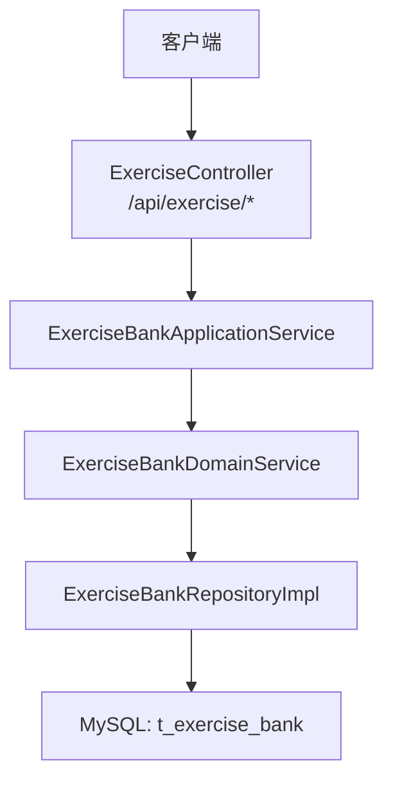
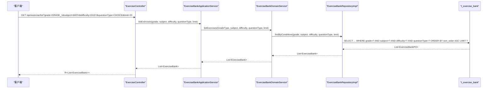
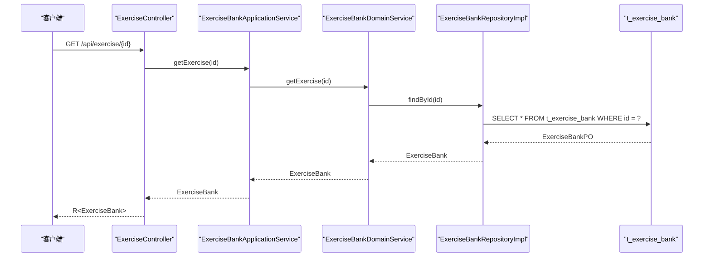
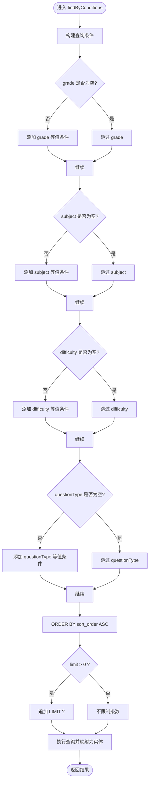
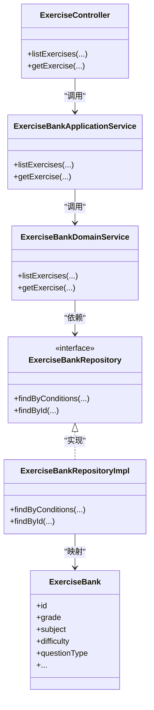

# 题库管理接口

<cite>
**本文引用的文件**
- [ExerciseController.java](file://wzoto-backend/wzoto-interfaces/src/main/java/com/wzoto/interfaces/controller/ExerciseController.java)
- [ExerciseBankApplicationService.java](file://wzoto-backend/wzoto-application/src/main/java/com/wzoto/application/service/ExerciseBankApplicationService.java)
- [ExerciseBankDomainService.java](file://wzoto-backend/wzoto-domain/src/main/java/com/wzoto/domain/service/ExerciseBankDomainService.java)
- [ExerciseBankRepository.java](file://wzoto-backend/wzoto-domain/src/main/java/com/wzoto/domain/repository/ExerciseBankRepository.java)
- [ExerciseBankRepositoryImpl.java](file://wzoto-backend/wzoto-infrastructure/src/main/java/com/wzoto/infrastructure/repository/ExerciseBankRepositoryImpl.java)
- [ExerciseBank.java](file://wzoto-backend/wzoto-domain/src/main/java/com/wzoto/domain/entity/ExerciseBank.java)
- [GradeType.java](file://wzoto-backend/wzoto-domain/src/main/java/com/wzoto/domain/valobj/GradeType.java)
- [ExerciseDifficulty.java](file://wzoto-backend/wzoto-domain/src/main/java/com/wzoto/domain/valobj/ExerciseDifficulty.java)
- [TextbookVersion.java](file://wzoto-backend/wzoto-domain/src/main/java/com/wzoto/domain/valobj/TextbookVersion.java)
- [t_exercise_bank.sql](file://wzoto-backend/sql/t_exercise_bank.sql)
- [seed_data_exercise.sql](file://wzoto-backend/sql/seed_data_exercise.sql)
</cite>

## 目录
1. [简介](#简介)
2. [项目结构](#项目结构)
3. [核心组件](#核心组件)
4. [架构总览](#架构总览)
5. [详细组件分析](#详细组件分析)
6. [依赖关系分析](#依赖关系分析)
7. [性能考虑](#性能考虑)
8. [故障排查指南](#故障排查指南)
9. [结论](#结论)
10. [附录](#附录)

## 简介
本文件为“题库管理”模块的API文档，聚焦题目列表查询、题目详情获取与题目筛选能力。重点说明：
- GET /api/exercise/list：支持按年级(grade)、科目(subject)、难度(difficulty)、题型(questionType)、限制数量(limit)进行筛选与分页式返回。
- GET /api/exercise/{id}：根据题目ID获取单个题目的详细信息。
- 题目数据结构定义、字段说明与类型约束。
- 筛选条件的组合使用示例，展示如何按不同维度查找题目。

## 项目结构
该功能采用分层架构：接口层（Controller）→ 应用服务（Application Service）→ 领域服务（Domain Service）→ 仓储实现（Infrastructure Repository）→ 数据库表。

图表来源
- [ExerciseController.java:15-55](file://wzoto-backend/wzoto-interfaces/src/main/java/com/wzoto/interfaces/controller/ExerciseController.java#L15-L55)
- [ExerciseBankApplicationService.java:17-41](file://wzoto-backend/wzoto-application/src/main/java/com/wzoto/application/service/ExerciseBankApplicationService.java#L17-L41)
- [ExerciseBankDomainService.java:17-85](file://wzoto-backend/wzoto-domain/src/main/java/com/wzoto/domain/service/ExerciseBankDomainService.java#L17-L85)
- [ExerciseBankRepositoryImpl.java:17-72](file://wzoto-backend/wzoto-infrastructure/src/main/java/com/wzoto/infrastructure/repository/ExerciseBankRepositoryImpl.java#L17-L72)
- [t_exercise_bank.sql:4-30](file://wzoto-backend/sql/t_exercise_bank.sql#L4-L30)

章节来源
- [ExerciseController.java:15-55](file://wzoto-backend/wzoto-interfaces/src/main/java/com/wzoto/interfaces/controller/ExerciseController.java#L15-L55)
- [ExerciseBankApplicationService.java:17-41](file://wzoto-backend/wzoto-application/src/main/java/com/wzoto/application/service/ExerciseBankApplicationService.java#L17-L41)
- [ExerciseBankDomainService.java:17-85](file://wzoto-backend/wzoto-domain/src/main/java/com/wzoto/domain/service/ExerciseBankDomainService.java#L17-L85)
- [ExerciseBankRepositoryImpl.java:17-72](file://wzoto-backend/wzoto-infrastructure/src/main/java/com/wzoto/infrastructure/repository/ExerciseBankRepositoryImpl.java#L17-L72)
- [t_exercise_bank.sql:4-30](file://wzoto-backend/sql/t_exercise_bank.sql#L4-L30)

## 核心组件
- 控制器：暴露REST接口，接收请求参数并调用应用服务。
- 应用服务：负责参数转换（如年级代码转枚举）与编排调用。
- 领域服务：业务规则与数据访问编排（如校验题目存在性）。
- 仓储实现：构建动态查询条件，执行SQL并按排序与限制返回结果。
- 实体与值对象：统一表示题目与枚举值（年级、难度、教材版本等）。

章节来源
- [ExerciseController.java:24-36](file://wzoto-backend/wzoto-interfaces/src/main/java/com/wzoto/interfaces/controller/ExerciseController.java#L24-L36)
- [ExerciseBankApplicationService.java:21-28](file://wzoto-backend/wzoto-application/src/main/java/com/wzoto/application/service/ExerciseBankApplicationService.java#L21-L28)
- [ExerciseBankDomainService.java:25-42](file://wzoto-backend/wzoto-domain/src/main/java/com/wzoto/domain/service/ExerciseBankDomainService.java#L25-L42)
- [ExerciseBankRepositoryImpl.java:62-72](file://wzoto-backend/wzoto-infrastructure/src/main/java/com/wzoto/infrastructure/repository/ExerciseBankRepositoryImpl.java#L62-L72)
- [ExerciseBank.java:20-39](file://wzoto-backend/wzoto-domain/src/main/java/com/wzoto/domain/entity/ExerciseBank.java#L20-L39)

## 架构总览
下图展示了从HTTP请求到数据库查询的完整调用链，以及关键的数据流转。

图表来源
- [ExerciseController.java:24-31](file://wzoto-backend/wzoto-interfaces/src/main/java/com/wzoto/interfaces/controller/ExerciseController.java#L24-L31)
- [ExerciseBankApplicationService.java:21-24](file://wzoto-backend/wzoto-application/src/main/java/com/wzoto/application/service/ExerciseBankApplicationService.java#L21-L24)
- [ExerciseBankDomainService.java:25-31](file://wzoto-backend/wzoto-domain/src/main/java/com/wzoto/domain/service/ExerciseBankDomainService.java#L25-L31)
- [ExerciseBankRepositoryImpl.java:62-72](file://wzoto-backend/wzoto-infrastructure/src/main/java/com/wzoto/infrastructure/repository/ExerciseBankRepositoryImpl.java#L62-L72)
- [t_exercise_bank.sql:4-30](file://wzoto-backend/sql/t_exercise_bank.sql#L4-L30)

## 详细组件分析

### API：GET /api/exercise/list
- 功能：按条件查询题目列表，支持多条件组合与数量限制。
- URL：/api/exercise/list
- 方法：GET
- 请求参数（Query String）
  - grade：字符串，可选。年级编码，取值见“值对象”。
  - subject：字符串，可选。学科编码，如 MATH、CHINESE、ENGLISH。
  - difficulty：字符串，可选。难度编码，取值见“值对象”。
  - questionType：字符串，可选。题型编码，如 CHOICE、FILL、TRUE_FALSE、SHORT_ANSWER。
  - limit：整数，可选，默认20。返回条数上限。
- 响应体：统一包装对象 R<List<ExerciseBank>>，data为题目列表。
- 行为说明
  - 未传入的参数将不参与过滤。
  - 结果按 sort_order 升序排列。
  - 当 limit > 0 时，使用 LIMIT 限制返回条数。

章节来源
- [ExerciseController.java:24-31](file://wzoto-backend/wzoto-interfaces/src/main/java/com/wzoto/interfaces/controller/ExerciseController.java#L24-L31)
- [ExerciseBankRepositoryImpl.java:62-72](file://wzoto-backend/wzoto-infrastructure/src/main/java/com/wzoto/infrastructure/repository/ExerciseBankRepositoryImpl.java#L62-L72)
- [t_exercise_bank.sql:4-30](file://wzoto-backend/sql/t_exercise_bank.sql#L4-L30)

#### 参数校验与错误处理
- 年级参数会转换为枚举值，若传入无效值将抛出非法参数异常。
- 其他参数为空时将被忽略，不会导致错误。

章节来源
- [GradeType.java:28-35](file://wzoto-backend/wzoto-domain/src/main/java/com/wzoto/domain/valobj/GradeType.java#L28-L35)
- [ExerciseBankApplicationService.java:21-24](file://wzoto-backend/wzoto-application/src/main/java/com/wzoto/application/service/ExerciseBankApplicationService.java#L21-L24)

### API：GET /api/exercise/{id}
- 功能：根据题目ID获取单个题目详情。
- URL：/api/exercise/{id}
- 路径参数
  - id：长整型，必填。
- 响应体：统一包装对象 R<ExerciseBank>，data为题目详情。
- 行为说明
  - 若题目不存在，将抛出非法参数异常（题目不存在）。

章节来源
- [ExerciseController.java:33-36](file://wzoto-backend/wzoto-interfaces/src/main/java/com/wzoto/interfaces/controller/ExerciseController.java#L33-L36)
- [ExerciseBankDomainService.java:33-42](file://wzoto-backend/wzoto-domain/src/main/java/com/wzoto/domain/service/ExerciseBankDomainService.java#L33-L42)

### 题目数据结构定义
- 实体：ExerciseBank
- 字段说明与类型约束（基于领域实体与数据库表映射）
  - id：Long，主键，自增。
  - grade：GradeType（枚举），年级，取值为 GRADE_1~GRADE_6。
  - subject：String，学科，如 MATH、CHINESE、ENGLISH。
  - textbookVersion：TextbookVersion（枚举），教材版本，如 RENJIAO、BEISHIDA、JIAOSHE、SUDAJIAO、WAIXIN、SHANGHAJIAO、OTHER。
  - knowledgePointId：Long，关联知识点ID（可为空）。
  - questionType：String，题型，如 CHOICE、FILL、TRUE_FALSE、SHORT_ANSWER。
  - questionContent：String，题目内容JSON（题干+选项）。
  - options：String，选项JSON数组（选择题用，可为空）。
  - correctAnswer：String，正确答案。
  - explanation：String，答案解析（可为空）。
  - difficulty：ExerciseDifficulty（枚举），难度，取值为 EASY、MEDIUM、HARD。
  - sourceType：String，来源，如 SYSTEM、AI生成、USER自定义。
  - vipOnly：Boolean，是否仅会员。
  - useCount：Integer，使用次数。
  - correctRate：Integer，正确率（百分比，可为空）。
  - sortOrder：Integer，排序号。
  - deleted：Boolean，逻辑删除标记。
  - createdAt：LocalDateTime，创建时间。
  - updatedAt：LocalDateTime，更新时间。

章节来源
- [ExerciseBank.java:20-39](file://wzoto-backend/wzoto-domain/src/main/java/com/wzoto/domain/entity/ExerciseBank.java#L20-L39)
- [t_exercise_bank.sql:4-30](file://wzoto-backend/sql/t_exercise_bank.sql#L4-L30)
- [GradeType.java:9-16](file://wzoto-backend/wzoto-domain/src/main/java/com/wzoto/domain/valobj/GradeType.java#L9-L16)
- [ExerciseDifficulty.java:9-13](file://wzoto-backend/wzoto-domain/src/main/java/com/wzoto/domain/valobj/ExerciseDifficulty.java#L9-L13)
- [TextbookVersion.java:9-17](file://wzoto-backend/wzoto-domain/src/main/java/com/wzoto/domain/valobj/TextbookVersion.java#L9-L17)

### 值对象与枚举
- 年级 GradeType：GRADE_1~GRADE_6，提供 fromCode/fromGrade 转换。
- 难度 ExerciseDifficulty：EASY、MEDIUM、HARD，提供 fromCode 转换。
- 教材版本 TextbookVersion：RENJIAO、BEISHIDA、JIAOSHE、SUDAJIAO、WAIXIN、SHANGHAJIAO、OTHER，提供 fromCode 转换。

章节来源
- [GradeType.java:9-45](file://wzoto-backend/wzoto-domain/src/main/java/com/wzoto/domain/valobj/GradeType.java#L9-L45)
- [ExerciseDifficulty.java:9-31](file://wzoto-backend/wzoto-domain/src/main/java/com/wzoto/domain/valobj/ExerciseDifficulty.java#L9-L31)
- [TextbookVersion.java:9-35](file://wzoto-backend/wzoto-domain/src/main/java/com/wzoto/domain/valobj/TextbookVersion.java#L9-L35)

### 筛选条件组合与示例
- 基础用法
  - 获取一年级数学的基础题，最多20条：
    - GET /api/exercise/list?grade=GRADE_1&subject=MATH&difficulty=EASY&limit=20
- 组合筛选
  - 三年级英语的选择题，最多10条：
    - GET /api/exercise/list?grade=GRADE_3&subject=ENGLISH&questionType=CHOICE&limit=10
- 单维度筛选
  - 所有语文填空题：
    - GET /api/exercise/list?subject=CHINESE&questionType=FILL
- 不传参
  - 直接返回默认前20条（按排序号升序）。

注意
- 未提供的参数会被忽略，不会报错。
- 年级参数必须为有效枚举值，否则将触发参数校验异常。

章节来源
- [ExerciseController.java:24-31](file://wzoto-backend/wzoto-interfaces/src/main/java/com/wzoto/interfaces/controller/ExerciseController.java#L24-L31)
- [ExerciseBankRepositoryImpl.java:62-72](file://wzoto-backend/wzoto-infrastructure/src/main/java/com/wzoto/infrastructure/repository/ExerciseBankRepositoryImpl.java#L62-L72)
- [GradeType.java:28-35](file://wzoto-backend/wzoto-domain/src/main/java/com/wzoto/domain/valobj/GradeType.java#L28-L35)

### 题目详情获取流程

图表来源
- [ExerciseController.java:33-36](file://wzoto-backend/wzoto-interfaces/src/main/java/com/wzoto/interfaces/controller/ExerciseController.java#L33-L36)
- [ExerciseBankApplicationService.java:26-28](file://wzoto-backend/wzoto-application/src/main/java/com/wzoto/application/service/ExerciseBankApplicationService.java#L26-L28)
- [ExerciseBankDomainService.java:33-42](file://wzoto-backend/wzoto-domain/src/main/java/com/wzoto/domain/service/ExerciseBankDomainService.java#L33-L42)
- [ExerciseBankRepositoryImpl.java:32-36](file://wzoto-backend/wzoto-infrastructure/src/main/java/com/wzoto/infrastructure/repository/ExerciseBankRepositoryImpl.java#L32-L36)
- [t_exercise_bank.sql:4-30](file://wzoto-backend/sql/t_exercise_bank.sql#L4-L30)

### 复杂逻辑流程图（筛选查询）

图表来源
- [ExerciseBankRepositoryImpl.java:62-72](file://wzoto-backend/wzoto-infrastructure/src/main/java/com/wzoto/infrastructure/repository/ExerciseBankRepositoryImpl.java#L62-L72)

## 依赖关系分析
- 控制器依赖应用服务；应用服务依赖领域服务；领域服务依赖仓储接口；仓储实现依赖MyBatis Mapper与数据库表。
- 值对象在应用服务中进行参数转换，确保领域层只接受合法枚举。
- 数据库表包含多个索引以优化查询性能（年级+学科、知识点、题型、难度、来源、是否VIP）。

图表来源
- [ExerciseController.java:15-55](file://wzoto-backend/wzoto-interfaces/src/main/java/com/wzoto/interfaces/controller/ExerciseController.java#L15-L55)
- [ExerciseBankApplicationService.java:17-41](file://wzoto-backend/wzoto-application/src/main/java/com/wzoto/application/service/ExerciseBankApplicationService.java#L17-L41)
- [ExerciseBankDomainService.java:17-85](file://wzoto-backend/wzoto-domain/src/main/java/com/wzoto/domain/service/ExerciseBankDomainService.java#L17-L85)
- [ExerciseBankRepository.java:1-15](file://wzoto-backend/wzoto-domain/src/main/java/com/wzoto/domain/repository/ExerciseBankRepository.java#L1-L15)
- [ExerciseBankRepositoryImpl.java:17-122](file://wzoto-backend/wzoto-infrastructure/src/main/java/com/wzoto/infrastructure/repository/ExerciseBankRepositoryImpl.java#L17-L122)
- [ExerciseBank.java:20-39](file://wzoto-backend/wzoto-domain/src/main/java/com/wzoto/domain/entity/ExerciseBank.java#L20-L39)

## 性能考虑
- 查询优化
  - 使用索引：grade+subject、knowledge_point_id、question_type、difficulty、source_type、vip_only。
  - 排序与限制：ORDER BY sort_order ASC + LIMIT，减少网络传输与前端渲染压力。
- 建议
  - 合理设置 limit，避免过大导致响应缓慢。
  - 在高并发场景下，可结合缓存策略（如Redis）对热点查询结果进行缓存。
  - 针对高频筛选维度建立复合索引（例如 grade+subject+difficulty）。

[本节为通用性能建议，无需特定文件引用]

## 故障排查指南
- 常见错误
  - 年级参数无效：检查传入的 grade 是否在枚举范围内（GRADE_1~GRADE_6）。
  - 题目不存在：确认传入的 id 是否存在于数据库。
- 定位步骤
  - 查看控制器日志与统一异常处理输出。
  - 检查应用服务与领域服务的异常抛出点。
  - 核对数据库记录与索引使用情况。

章节来源
- [GradeType.java:28-35](file://wzoto-backend/wzoto-domain/src/main/java/com/wzoto/domain/valobj/GradeType.java#L28-L35)
- [ExerciseBankDomainService.java:33-42](file://wzoto-backend/wzoto-domain/src/main/java/com/wzoto/domain/service/ExerciseBankDomainService.java#L33-L42)

## 结论
题库管理接口提供了灵活的题目筛选与详情获取能力，通过多层架构与值对象约束，保证了接口的健壮性与可维护性。配合合理的数据库索引与查询策略，可在保证性能的同时满足多样化的教学场景需求。

[本节为总结性内容，无需特定文件引用]

## 附录
- 示例数据参考：种子数据中包含各年级、学科的习题样例，便于测试与验证接口行为。

章节来源
- [seed_data_exercise.sql:7-143](file://wzoto-backend/sql/seed_data_exercise.sql#L7-L143)