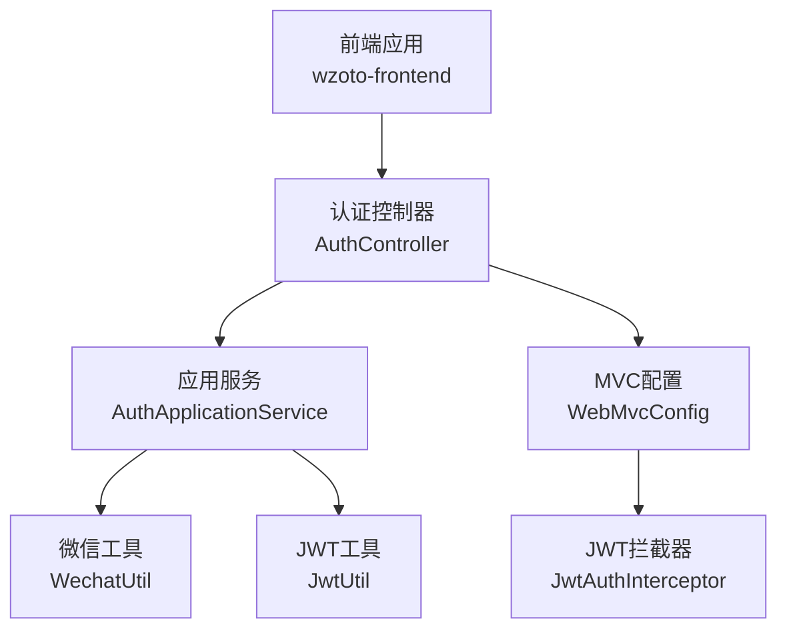
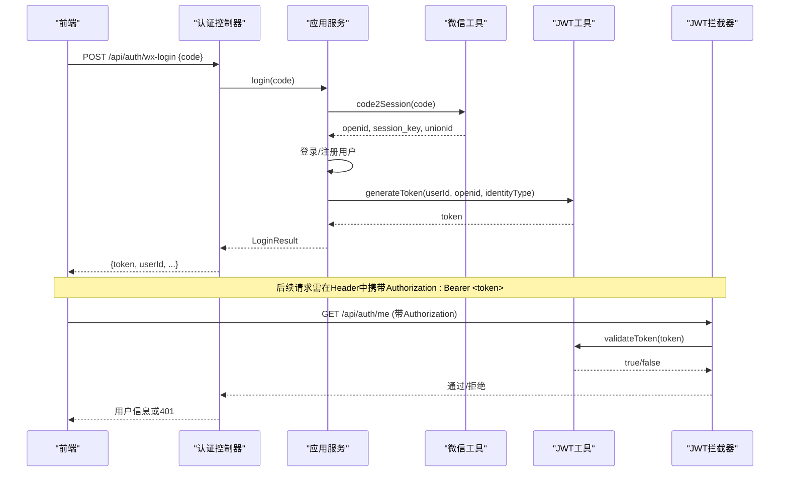
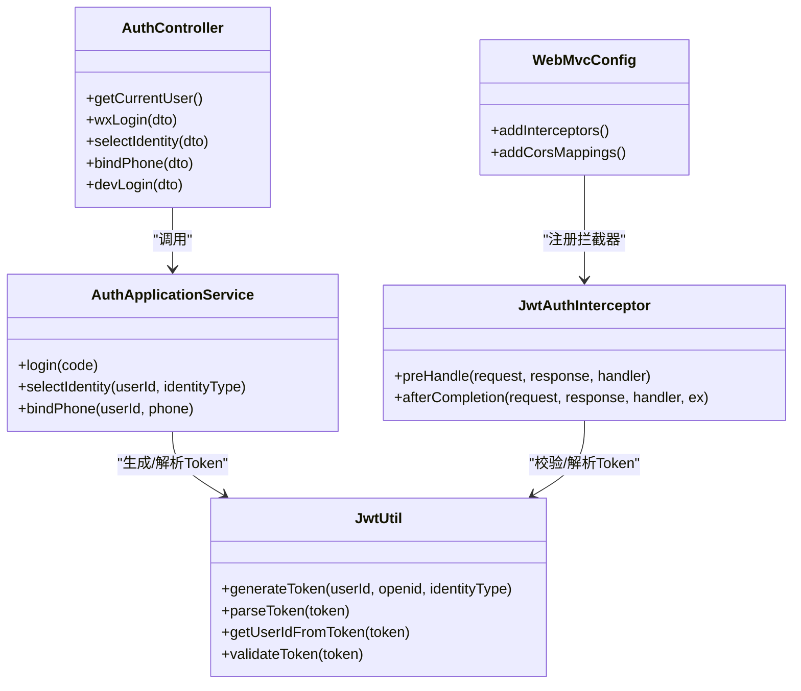

# 认证接口

<cite>
**本文引用的文件**
- [AuthController.java](file://wzoto-backend/wzoto-interfaces/src/main/java/com/wzoto/interfaces/controller/AuthController.java)
- [AuthApplicationService.java](file://wzoto-backend/wzoto-application/src/main/java/com/wzoto/application/service/AuthApplicationService.java)
- [JwtUtil.java](file://wzoto-backend/wzoto-infrastructure/src/main/java/com/wzoto/infrastructure/util/JwtUtil.java)
- [JwtProperties.java](file://wzoto-backend/wzoto-infrastructure/src/main/java/com/wzoto/infrastructure/config/JwtProperties.java)
- [WechatProperties.java](file://wzoto-backend/wzoto-infrastructure/src/main/java/com/wzoto/infrastructure/config/WechatProperties.java)
- [WebMvcConfig.java](file://wzoto-backend/wzoto-infrastructure/src/main/java/com/wzoto/infrastructure/config/WebMvcConfig.java)
- [JwtAuthInterceptor.java](file://wzoto-backend/wzoto-infrastructure/src/main/java/com/wzoto/infrastructure/interceptor/JwtAuthInterceptor.java)
- [WxLoginDTO.java](file://wzoto-backend/wzoto-interfaces/src/main/java/com/wzoto/interfaces/dto/WxLoginDTO.java)
- [SelectIdentityDTO.java](file://wzoto-backend/wzoto-interfaces/src/main/java/com/wzoto/interfaces/dto/SelectIdentityDTO.java)
- [BindPhoneDTO.java](file://wzoto-backend/wzoto-interfaces/src/main/java/com/wzoto/interfaces/dto/BindPhoneDTO.java)
- [LoginVO.java](file://wzoto-backend/wzoto-interfaces/src/main/java/com/wzoto/interfaces/vo/LoginVO.java)
- [UserInfoVO.java](file://wzoto-backend/wzoto-interfaces/src/main/java/com/wzoto/interfaces/vo/UserInfoVO.java)
- [R.java](file://wzoto-backend/wzoto-interfaces/src/main/java/com/wzoto/interfaces/common/R.java)
- [auth.js](file://wzoto-frontend/src/api/auth.js)
- [request.js](file://wzoto-frontend/src/utils/request.js)
</cite>

## 目录
1. [简介](#简介)
2. [项目结构](#项目结构)
3. [核心组件](#核心组件)
4. [架构总览](#架构总览)
5. [详细接口说明](#详细接口说明)
6. [依赖关系分析](#依赖关系分析)
7. [性能与安全性考虑](#性能与安全性考虑)
8. [故障排查指南](#故障排查指南)
9. [结论](#结论)
10. [附录：前端集成与调试](#附录前端集成与调试)

## 简介
本文件为认证子系统API文档，覆盖微信登录、身份选择、手机号绑定、获取当前用户信息等核心能力。文档包含每个接口的HTTP方法、URL路径、请求参数、响应格式、状态码、完整示例以及JWT令牌的使用方式。同时给出认证流程（微信OAuth授权、用户身份验证、令牌生成与刷新机制）和错误处理策略，并提供前端集成示例与调试方法。

## 项目结构
认证相关代码采用分层架构：
- 接口层（interfaces）：控制器定义REST API，接收并返回统一结果对象。
- 应用层（application）：编排业务用例，协调微信登录、领域服务与JWT生成。
- 基础设施层（infrastructure）：提供JWT工具、拦截器、配置等横切能力。
- 前端（frontend）：封装请求、自动注入Authorization头、统一错误处理。

图表来源
- [AuthController.java:21-149](file://wzoto-backend/wzoto-interfaces/src/main/java/com/wzoto/interfaces/controller/AuthController.java#L21-L149)
- [AuthApplicationService.java:13-119](file://wzoto-backend/wzoto-application/src/main/java/com/wzoto/application/service/AuthApplicationService.java#L13-L119)
- [JwtUtil.java:17-81](file://wzoto-backend/wzoto-infrastructure/src/main/java/com/wzoto/infrastructure/util/JwtUtil.java#L17-L81)
- [WebMvcConfig.java:10-42](file://wzoto-backend/wzoto-infrastructure/src/main/java/com/wzoto/infrastructure/config/WebMvcConfig.java#L10-L42)
- [JwtAuthInterceptor.java:15-65](file://wzoto-backend/wzoto-infrastructure/src/main/java/com/wzoto/infrastructure/interceptor/JwtAuthInterceptor.java#L15-L65)

章节来源
- [AuthController.java:21-149](file://wzoto-backend/wzoto-interfaces/src/main/java/com/wzoto/interfaces/controller/AuthController.java#L21-L149)
- [WebMvcConfig.java:10-42](file://wzoto-backend/wzoto-infrastructure/src/main/java/com/wzoto/infrastructure/config/WebMvcConfig.java#L10-L42)

## 核心组件
- 认证控制器：暴露微信登录、身份选择、手机号绑定、获取当前用户信息、开发环境登录等接口。
- 应用服务：编排微信code2Session、用户登录或注册、JWT生成与返回。
- JWT工具：生成、解析、校验Token；从Token提取用户信息。
- MVC配置与拦截器：对/api/**启用JWT鉴权，排除登录相关路径；全局CORS配置。
- 统一返回体：标准响应结构，含code、msg、data。

章节来源
- [AuthController.java:21-149](file://wzoto-backend/wzoto-interfaces/src/main/java/com/wzoto/interfaces/controller/AuthController.java#L21-L149)
- [AuthApplicationService.java:13-119](file://wzoto-backend/wzoto-application/src/main/java/com/wzoto/application/service/AuthApplicationService.java#L13-L119)
- [JwtUtil.java:17-81](file://wzoto-backend/wzoto-infrastructure/src/main/java/com/wzoto/infrastructure/util/JwtUtil.java#L17-L81)
- [WebMvcConfig.java:10-42](file://wzoto-backend/wzoto-infrastructure/src/main/java/com/wzoto/infrastructure/config/WebMvcConfig.java#L10-L42)
- [JwtAuthInterceptor.java:15-65](file://wzoto-backend/wzoto-infrastructure/src/main/java/com/wzoto/infrastructure/interceptor/JwtAuthInterceptor.java#L15-L65)
- [R.java:7-43](file://wzoto-backend/wzoto-interfaces/src/main/java/com/wzoto/interfaces/common/R.java#L7-L43)

## 架构总览
认证主流程：
- 微信登录：前端调用微信获取code → 后端通过code换取openid/session_key → 登录或注册用户 → 生成JWT → 返回token与用户信息。
- 身份选择：更新用户身份类型 → 重新签发包含新身份的JWT。
- 手机号绑定：绑定成功后不重新签发token，但返回最新用户信息。
- 鉴权：除登录相关接口外，其他接口需携带Authorization: Bearer <token>，由拦截器校验并注入上下文。

图表来源
- [AuthController.java:65-100](file://wzoto-backend/wzoto-interfaces/src/main/java/com/wzoto/interfaces/controller/AuthController.java#L65-L100)
- [AuthApplicationService.java:26-100](file://wzoto-backend/wzoto-application/src/main/java/com/wzoto/application/service/AuthApplicationService.java#L26-L100)
- [JwtUtil.java:27-81](file://wzoto-backend/wzoto-infrastructure/src/main/java/com/wzoto/infrastructure/util/JwtUtil.java#L27-L81)
- [WebMvcConfig.java:21-31](file://wzoto-backend/wzoto-infrastructure/src/main/java/com/wzoto/infrastructure/config/WebMvcConfig.java#L21-L31)
- [JwtAuthInterceptor.java:27-59](file://wzoto-backend/wzoto-infrastructure/src/main/java/com/wzoto/infrastructure/interceptor/JwtAuthInterceptor.java#L27-L59)

## 详细接口说明

### 通用约定
- 基础路径：/api
- 统一响应体：{ code, msg, data }
  - code: 200 成功；400 参数错误；401 未认证/令牌无效；500 服务器错误
  - msg: 提示信息
  - data: 业务数据
- 认证方式：除登录相关接口外，所有接口需在请求头携带 Authorization: Bearer <token>

章节来源
- [R.java:7-43](file://wzoto-backend/wzoto-interfaces/src/main/java/com/wzoto/interfaces/common/R.java#L7-L43)
- [WebMvcConfig.java:21-31](file://wzoto-backend/wzoto-infrastructure/src/main/java/com/wzoto/infrastructure/config/WebMvcConfig.java#L21-L31)
- [JwtAuthInterceptor.java:27-59](file://wzoto-backend/wzoto-infrastructure/src/main/java/com/wzoto/infrastructure/interceptor/JwtAuthInterceptor.java#L27-L59)

### 1) 微信登录
- 方法：POST
- 路径：/api/auth/wx-login
- 请求体：
  - code: 字符串，必填，微信登录凭证
- 响应体：
  - token: 字符串，JWT令牌
  - userId: 长整型，用户ID
  - nickname: 字符串，昵称
  - avatar: 字符串，头像地址
  - identityType: 字符串，身份类型（PARENT/STUDENT），未选择为空串
  - hasIdentity: 布尔，是否已选择身份
  - verifyStatus: 字符串，实名认证状态（NONE/PENDING/APPROVED/REJECTED）
- 状态码：
  - 200：成功
  - 400：参数校验失败
  - 401：微信侧异常或系统内部错误（由上层统一返回）
- 示例
  - 请求示例
    - POST /api/auth/wx-login
    - Body: { "code": "wx_code_123" }
  - 响应示例
    - { "code": 200, "msg": "success", "data": { "token": "eyJhbGc...", "userId": 1001, "nickname": "小明", "avatar": "https://...", "identityType": "", "hasIdentity": false, "verifyStatus": "NONE" } }

章节来源
- [AuthController.java:65-75](file://wzoto-backend/wzoto-interfaces/src/main/java/com/wzoto/interfaces/controller/AuthController.java#L65-L75)
- [WxLoginDTO.java:1-15](file://wzoto-backend/wzoto-interfaces/src/main/java/com/wzoto/interfaces/dto/WxLoginDTO.java#L1-L15)
- [AuthApplicationService.java:26-57](file://wzoto-backend/wzoto-application/src/main/java/com/wzoto/application/service/AuthApplicationService.java#L26-L57)
- [LoginVO.java:1-40](file://wzoto-backend/wzoto-interfaces/src/main/java/com/wzoto/interfaces/vo/LoginVO.java#L1-L40)

### 2) 选择身份
- 方法：POST
- 路径：/api/auth/select-identity
- 请求体：
  - userId: 长整型，必填，用户ID
  - identityType: 字符串，必填，身份类型（PARENT/STUDENT）
- 响应体：同“微信登录”响应体
- 行为说明：选择身份后会重新签发JWT，新token中包含新的身份类型
- 状态码：
  - 200：成功
  - 400：参数校验失败
- 示例
  - 请求示例
    - POST /api/auth/select-identity
    - Body: { "userId": 1001, "identityType": "PARENT" }
  - 响应示例
    - { "code": 200, "msg": "success", "data": { "token": "eyJhbGc...", "userId": 1001, "nickname": "小明", "avatar": "https://...", "identityType": "PARENT", "hasIdentity": true, "verifyStatus": "NONE" } }

章节来源
- [AuthController.java:77-87](file://wzoto-backend/wzoto-interfaces/src/main/java/com/wzoto/interfaces/controller/AuthController.java#L77-L87)
- [SelectIdentityDTO.java:1-20](file://wzoto-backend/wzoto-interfaces/src/main/java/com/wzoto/interfaces/dto/SelectIdentityDTO.java#L1-L20)
- [AuthApplicationService.java:59-79](file://wzoto-backend/wzoto-application/src/main/java/com/wzoto/application/service/AuthApplicationService.java#L59-L79)
- [LoginVO.java:1-40](file://wzoto-backend/wzoto-interfaces/src/main/java/com/wzoto/interfaces/vo/LoginVO.java#L1-L40)

### 3) 绑定手机号
- 方法：POST
- 路径：/api/auth/bind-phone
- 请求体：
  - userId: 长整型，必填，用户ID
  - phone: 字符串，必填，手机号
- 响应体：同“微信登录”响应体（注意：绑定手机号不重新签发token）
- 状态码：
  - 200：成功
  - 400：参数校验失败
- 示例
  - 请求示例
    - POST /api/auth/bind-phone
    - Body: { "userId": 1001, "phone": "13800138000" }
  - 响应示例
    - { "code": 200, "msg": "success", "data": { "token": null, "userId": 1001, "nickname": "小明", "avatar": "https://...", "identityType": "PARENT", "hasIdentity": true, "verifyStatus": "NONE", "phone": "13800138000" } }

章节来源
- [AuthController.java:89-100](file://wzoto-backend/wzoto-interfaces/src/main/java/com/wzoto/interfaces/controller/AuthController.java#L89-L100)
- [BindPhoneDTO.java:1-20](file://wzoto-backend/wzoto-interfaces/src/main/java/com/wzoto/interfaces/dto/BindPhoneDTO.java#L1-L20)
- [AuthApplicationService.java:81-100](file://wzoto-backend/wzoto-application/src/main/java/com/wzoto/application/service/AuthApplicationService.java#L81-L100)
- [LoginVO.java:1-40](file://wzoto-backend/wzoto-interfaces/src/main/java/com/wzoto/interfaces/vo/LoginVO.java#L1-L40)

### 4) 获取当前用户信息
- 方法：GET
- 路径：/api/auth/me
- 请求头：Authorization: Bearer <token>
- 响应体：
  - userId: 长整型
  - openid: 字符串
  - phone: 字符串
  - nickname: 字符串
  - avatar: 字符串
  - identityType: 字符串
  - identityTypeDesc: 字符串，中文描述
  - hasIdentity: 布尔
  - verifyStatus: 字符串
  - verifyStatusDesc: 字符串，中文描述
  - realName: 字符串，仅已通过认证时返回
- 状态码：
  - 200：成功
  - 401：未认证或令牌无效
- 示例
  - 请求示例
    - GET /api/auth/me
    - Headers: Authorization: Bearer eyJhbGc...
  - 响应示例
    - { "code": 200, "msg": "success", "data": { "userId": 1001, "openid": "wx_openid_...", "phone": "13800138000", "nickname": "小明", "avatar": "https://...", "identityType": "PARENT", "identityTypeDesc": "家长", "hasIdentity": true, "verifyStatus": "APPROVED", "verifyStatusDesc": "已通过", "realName": "张三" } }

章节来源
- [AuthController.java:34-63](file://wzoto-backend/wzoto-interfaces/src/main/java/com/wzoto/interfaces/controller/AuthController.java#L34-L63)
- [UserInfoVO.java:1-45](file://wzoto-backend/wzoto-interfaces/src/main/java/com/wzoto/interfaces/vo/UserInfoVO.java#L1-L45)
- [JwtAuthInterceptor.java:27-59](file://wzoto-backend/wzoto-infrastructure/src/main/java/com/wzoto/infrastructure/interceptor/JwtAuthInterceptor.java#L27-L59)

### 5) 开发环境登录（可选）
- 方法：POST
- 路径：/api/auth/dev-login
- 请求体：
  - nickname: 字符串，用于查找用户
- 响应体：同“微信登录”响应体
- 说明：仅开发环境使用，通过昵称直接登录并签发JWT
- 状态码：
  - 200：成功
  - 400：用户不存在或参数错误

章节来源
- [AuthController.java:102-127](file://wzoto-backend/wzoto-interfaces/src/main/java/com/wzoto/interfaces/controller/AuthController.java#L102-L127)

## 依赖关系分析
- 控制器依赖应用服务进行业务编排。
- 应用服务依赖微信工具与JWT工具完成登录与令牌签发。
- MVC配置将JWT拦截器注册到/api/**，并排除登录相关路径。
- 拦截器负责从请求头提取Token、校验、解析并注入用户上下文。

图表来源
- [AuthController.java:21-149](file://wzoto-backend/wzoto-interfaces/src/main/java/com/wzoto/interfaces/controller/AuthController.java#L21-L149)
- [AuthApplicationService.java:13-119](file://wzoto-backend/wzoto-application/src/main/java/com/wzoto/application/service/AuthApplicationService.java#L13-L119)
- [JwtUtil.java:17-81](file://wzoto-backend/wzoto-infrastructure/src/main/java/com/wzoto/infrastructure/util/JwtUtil.java#L17-L81)
- [WebMvcConfig.java:10-42](file://wzoto-backend/wzoto-infrastructure/src/main/java/com/wzoto/infrastructure/config/WebMvcConfig.java#L10-L42)
- [JwtAuthInterceptor.java:15-65](file://wzoto-backend/wzoto-infrastructure/src/main/java/com/wzoto/infrastructure/interceptor/JwtAuthInterceptor.java#L15-L65)

章节来源
- [AuthController.java:21-149](file://wzoto-backend/wzoto-interfaces/src/main/java/com/wzoto/interfaces/controller/AuthController.java#L21-L149)
- [AuthApplicationService.java:13-119](file://wzoto-backend/wzoto-application/src/main/java/com/wzoto/application/service/AuthApplicationService.java#L13-L119)
- [JwtUtil.java:17-81](file://wzoto-backend/wzoto-infrastructure/src/main/java/com/wzoto/infrastructure/util/JwtUtil.java#L17-L81)
- [WebMvcConfig.java:10-42](file://wzoto-backend/wzoto-infrastructure/src/main/java/com/wzoto/infrastructure/config/WebMvcConfig.java#L10-L42)
- [JwtAuthInterceptor.java:15-65](file://wzoto-backend/wzoto-infrastructure/src/main/java/com/wzoto/infrastructure/interceptor/JwtAuthInterceptor.java#L15-L65)

## 性能与安全性考虑
- 令牌有效期：默认72小时，可通过配置调整。生产环境建议缩短过期时间并结合刷新机制。
- 密钥安全：JWT密钥应使用强随机值并在生产环境配置。
- 传输安全：务必使用HTTPS，避免中间人攻击。
- 跨域：已开启全局CORS，便于前后端联调；生产环境可收紧允许的来源。
- 鉴权拦截：除登录相关接口外，均强制校验JWT，防止未授权访问。
- 日志与审计：关键步骤记录日志，便于问题定位与安全审计。

章节来源
- [JwtProperties.java:7-26](file://wzoto-backend/wzoto-infrastructure/src/main/java/com/wzoto/infrastructure/config/JwtProperties.java#L7-L26)
- [WebMvcConfig.java:33-41](file://wzoto-backend/wzoto-infrastructure/src/main/java/com/wzoto/infrastructure/config/WebMvcConfig.java#L33-L41)
- [JwtAuthInterceptor.java:27-59](file://wzoto-backend/wzoto-infrastructure/src/main/java/com/wzoto/infrastructure/interceptor/JwtAuthInterceptor.java#L27-L59)

## 故障排查指南
- 登录失败
  - 检查微信code是否有效且未过期
  - 查看后端日志中微信code2Session的返回
  - 确认小程序AppId与AppSecret配置正确
- 令牌过期或无效
  - 检查请求头是否携带正确的Authorization: Bearer <token>
  - 确认JWT密钥一致且未变更
  - 若频繁过期，考虑实现令牌刷新机制
- 权限不足
  - 确认用户已选择身份且具备相应权限
  - 检查业务逻辑中对身份类型的判断
- 常见问题
  - 401：未携带Token或Token无效
  - 400：请求参数缺失或格式错误
  - 500：服务端异常，查看日志定位

章节来源
- [JwtAuthInterceptor.java:27-59](file://wzoto-backend/wzoto-infrastructure/src/main/java/com/wzoto/infrastructure/interceptor/JwtAuthInterceptor.java#L27-L59)
- [R.java:19-41](file://wzoto-backend/wzoto-interfaces/src/main/java/com/wzoto/interfaces/common/R.java#L19-L41)
- [WechatProperties.java:7-23](file://wzoto-backend/wzoto-infrastructure/src/main/java/com/wzoto/infrastructure/config/WechatProperties.java#L7-L23)

## 结论
本认证模块提供了完整的微信登录、身份选择、手机号绑定与用户信息查询能力，并通过JWT实现无状态鉴权。结合拦截器与统一返回体，保证了接口的一致性与安全性。建议在生产环境完善令牌刷新机制、加强密钥管理与日志审计，以提升用户体验与系统健壮性。

## 附录：前端集成与调试
- 前端API封装
  - 微信登录：调用 /auth/wx-login
  - 选择身份：调用 /auth/select-identity
  - 绑定手机号：调用 /auth/bind-phone
  - 获取用户信息：调用 /auth/me
- 自动注入Authorization
  - 请求拦截器会在存在token时自动添加Authorization: Bearer <token>
- 统一错误处理
  - 响应拦截器统一处理非200响应，401时清除本地状态并跳转登录页
- 调试建议
  - 使用浏览器开发者工具查看请求头与响应体
  - 在登录成功后保存token至本地存储（如localStorage或状态管理）
  - 遇到401时检查token是否过期或丢失
  - 使用开发环境登录接口快速验证流程

章节来源
- [auth.js:1-30](file://wzoto-frontend/src/api/auth.js#L1-L30)
- [request.js:1-59](file://wzoto-frontend/src/utils/request.js#L1-L59)