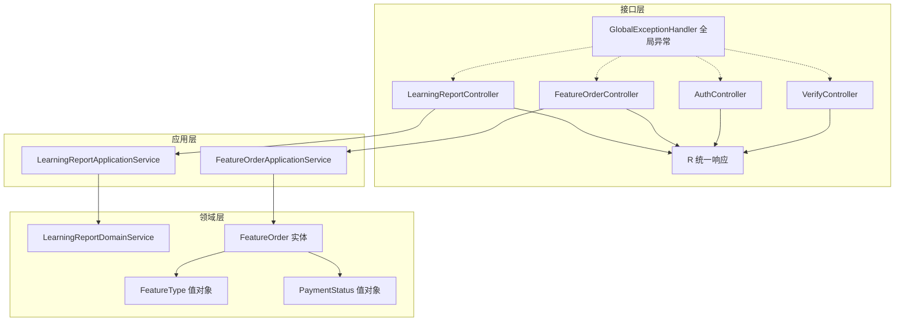
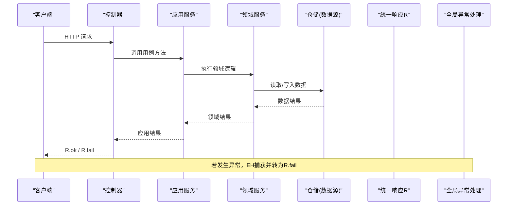
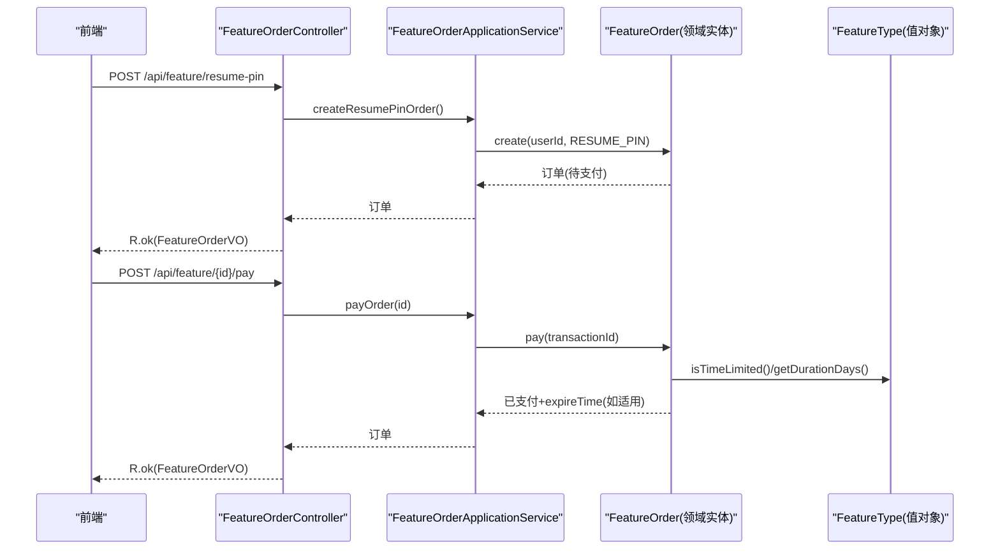
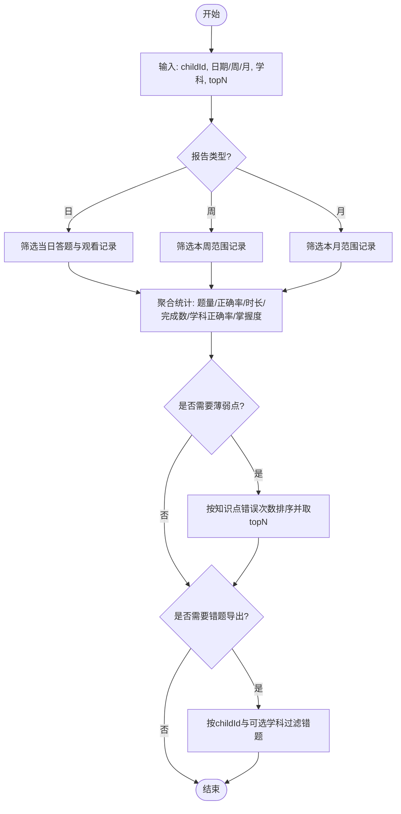
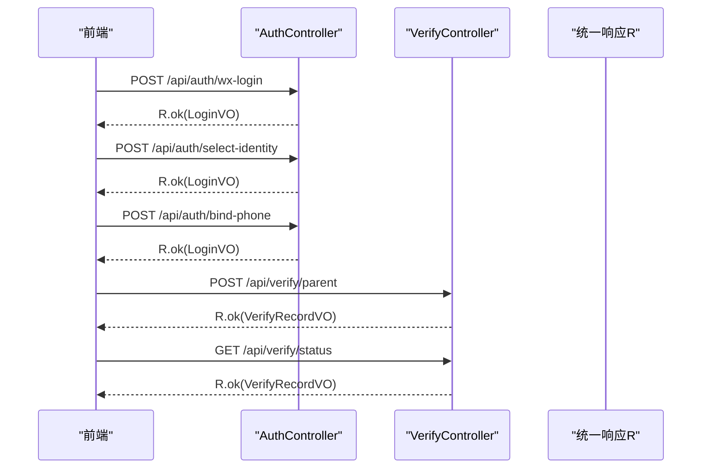
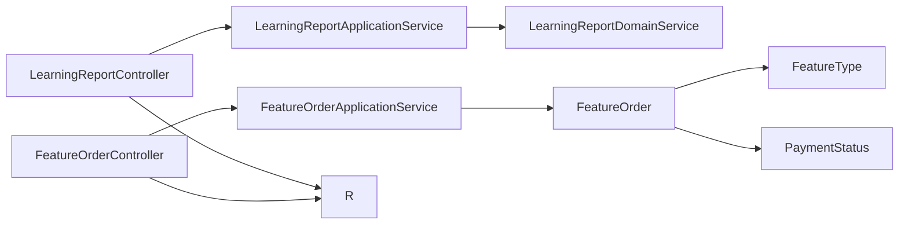

# 通用接口

<cite>
**本文引用的文件**
- [R.java](file://wzoto-backend/wzoto-interfaces/src/main/java/com/wzoto/interfaces/common/R.java)
- [GlobalExceptionHandler.java](file://wzoto-backend/wzoto-interfaces/src/main/java/com/wzoto/interfaces/common/GlobalExceptionHandler.java)
- [LearningReportController.java](file://wzoto-backend/wzoto-interfaces/src/main/java/com/wzoto/interfaces/controller/LearningReportController.java)
- [FeatureOrderController.java](file://wzoto-backend/wzoto-interfaces/src/main/java/com/wzoto/interfaces/controller/FeatureOrderController.java)
- [AuthController.java](file://wzoto-backend/wzoto-interfaces/src/main/java/com/wzoto/interfaces/controller/AuthController.java)
- [VerifyController.java](file://wzoto-backend/wzoto-interfaces/src/main/java/com/wzoto/interfaces/controller/VerifyController.java)
- [LearningReportApplicationService.java](file://wzoto-backend/wzoto-application/src/main/java/com/wzoto/application/service/LearningReportApplicationService.java)
- [FeatureOrderApplicationService.java](file://wzoto-backend/wzoto-application/src/main/java/com/wzoto/application/service/FeatureOrderApplicationService.java)
- [LearningReportDomainService.java](file://wzoto-backend/wzoto-domain/src/main/java/com/wzoto/domain/service/LearningReportDomainService.java)
- [FeatureOrder.java](file://wzoto-backend/wzoto-domain/src/main/java/com/wzoto/domain/entity/FeatureOrder.java)
- [FeatureType.java](file://wzoto-backend/wzoto-domain/src/main/java/com/wzoto/domain/valobj/FeatureType.java)
- [PaymentStatus.java](file://wzoto-backend/wzoto-domain/src/main/java/com/wzoto/domain/valobj/PaymentStatus.java)
- [LearningReportVO.java](file://wzoto-backend/wzoto-interfaces/src/main/java/com/wzoto/interfaces/vo/learning/LearningReportVO.java)
- [FeatureOrderVO.java](file://wzoto-backend/wzoto-interfaces/src/main/java/com/wzoto/interfaces/vo/feature/FeatureOrderVO.java)
</cite>

## 目录
1. [简介](#简介)
2. [项目结构](#项目结构)
3. [核心组件](#核心组件)
4. [架构总览](#架构总览)
5. [详细组件分析](#详细组件分析)
6. [依赖关系分析](#依赖关系分析)
7. [性能考虑](#性能考虑)
8. [故障排查指南](#故障排查指南)
9. [结论](#结论)
10. [附录：接口清单与规范](#附录接口清单与规范)

## 简介
本文件为“通用接口”的完整API文档，覆盖以下基础能力：
- 功能订单管理：套餐购买、权限开通、有效期管理等商业功能。
- 学习报告生成：学习数据分析、能力评估、改进建议等报告生成功能。
- 统一响应格式：R类的结构定义、状态码规范、错误信息封装等标准化设计。
- 全局异常处理：异常捕获、错误转换、日志记录等统一的错误处理机制。
- 认证与实名认证：微信登录、身份选择、手机号绑定、家长/学生认证。
- 通用工具接口：验证码、短信发送、文件上传下载（当前仓库未提供对应控制器实现，本节给出接入指引）。

## 项目结构
后端采用分层架构：
- 接口层（interfaces）：REST 控制器、统一返回体 R、全局异常处理器、DTO/VO。
- 应用层（application）：编排领域服务，完成用例级流程。
- 领域层（domain）：实体、值对象、领域服务与仓储接口。
- 基础设施层（infrastructure）：持久化实现、外部服务调用、配置与工具。

图示来源
- [LearningReportController.java:1-141](file://wzoto-backend/wzoto-interfaces/src/main/java/com/wzoto/interfaces/controller/LearningReportController.java#L1-L141)
- [FeatureOrderController.java:1-97](file://wzoto-backend/wzoto-interfaces/src/main/java/com/wzoto/interfaces/controller/FeatureOrderController.java#L1-L97)
- [AuthController.java:1-149](file://wzoto-backend/wzoto-interfaces/src/main/java/com/wzoto/interfaces/controller/AuthController.java#L1-L149)
- [VerifyController.java:1-88](file://wzoto-backend/wzoto-interfaces/src/main/java/com/wzoto/interfaces/controller/VerifyController.java#L1-L88)
- [R.java:1-43](file://wzoto-backend/wzoto-interfaces/src/main/java/com/wzoto/interfaces/common/R.java#L1-L43)
- [GlobalExceptionHandler.java](file://wzoto-backend/wzoto-interfaces/src/main/java/com/wzoto/interfaces/common/GlobalExceptionHandler.java)

章节来源
- [LearningReportController.java:1-141](file://wzoto-backend/wzoto-interfaces/src/main/java/com/wzoto/interfaces/controller/LearningReportController.java#L1-L141)
- [FeatureOrderController.java:1-97](file://wzoto-backend/wzoto-interfaces/src/main/java/com/wzoto/interfaces/controller/FeatureOrderController.java#L1-L97)
- [AuthController.java:1-149](file://wzoto-backend/wzoto-interfaces/src/main/java/com/wzoto/interfaces/controller/AuthController.java#L1-L149)
- [VerifyController.java:1-88](file://wzoto-backend/wzoto-interfaces/src/main/java/com/wzoto/interfaces/controller/VerifyController.java#L1-L88)
- [R.java:1-43](file://wzoto-backend/wzoto-interfaces/src/main/java/com/wzoto/interfaces/common/R.java#L1-L43)

## 核心组件
- 统一响应体 R<T>：包含 code、msg、data；提供 ok/fail/unauthorized/badRequest 静态工厂方法，用于统一返回结构与状态码。
- 全局异常处理器：集中捕获异常并转换为 R.fail 或业务特定响应，保证对外一致性。
- 功能订单：FeatureOrder 实体配合 FeatureType、PaymentStatus 值对象，支撑单次付费、时效性权益与到期管理。
- 学习报告：LearningReportDomainService 聚合答题与观看记录，输出日/周/月报告、薄弱点排行与错题导出。
- 认证与实名：AuthController 提供微信登录、身份选择、手机号绑定；VerifyController 提供家长/学生认证与状态查询。

章节来源
- [R.java:1-43](file://wzoto-backend/wzoto-interfaces/src/main/java/com/wzoto/interfaces/common/R.java#L1-L43)
- [FeatureOrder.java:1-83](file://wzoto-backend/wzoto-domain/src/main/java/com/wzoto/domain/entity/FeatureOrder.java#L1-L83)
- [FeatureType.java:1-47](file://wzoto-backend/wzoto-domain/src/main/java/com/wzoto/domain/valobj/FeatureType.java#L1-L47)
- [PaymentStatus.java:1-29](file://wzoto-backend/wzoto-domain/src/main/java/com/wzoto/domain/valobj/PaymentStatus.java#L1-L29)
- [LearningReportDomainService.java:1-160](file://wzoto-backend/wzoto-domain/src/main/java/com/wzoto/domain/service/LearningReportDomainService.java#L1-L160)
- [AuthController.java:1-149](file://wzoto-backend/wzoto-interfaces/src/main/java/com/wzoto/interfaces/controller/AuthController.java#L1-L149)
- [VerifyController.java:1-88](file://wzoto-backend/wzoto-interfaces/src/main/java/com/wzoto/interfaces/controller/VerifyController.java#L1-L88)

## 架构总览
请求从控制器进入应用服务，再进入领域服务进行计算与聚合，最终通过统一响应体返回。全局异常处理器在控制器层之上拦截异常，确保所有错误以一致格式返回。

图示来源
- [LearningReportController.java:1-141](file://wzoto-backend/wzoto-interfaces/src/main/java/com/wzoto/interfaces/controller/LearningReportController.java#L1-L141)
- [FeatureOrderController.java:1-97](file://wzoto-backend/wzoto-interfaces/src/main/java/com/wzoto/interfaces/controller/FeatureOrderController.java#L1-L97)
- [LearningReportApplicationService.java:1-59](file://wzoto-backend/wzoto-application/src/main/java/com/wzoto/application/service/LearningReportApplicationService.java#L1-L59)
- [FeatureOrderApplicationService.java:1-62](file://wzoto-backend/wzoto-application/src/main/java/com/wzoto/application/service/FeatureOrderApplicationService.java#L1-L62)
- [LearningReportDomainService.java:1-160](file://wzoto-backend/wzoto-domain/src/main/java/com/wzoto/domain/service/LearningReportDomainService.java#L1-L160)
- [R.java:1-43](file://wzoto-backend/wzoto-interfaces/src/main/java/com/wzoto/interfaces/common/R.java#L1-L43)
- [GlobalExceptionHandler.java](file://wzoto-backend/wzoto-interfaces/src/main/java/com/wzoto/interfaces/common/GlobalExceptionHandler.java)

## 详细组件分析

### 功能订单管理（购买、支付、有效期）
- 创建订单：支持简历置顶、加急审核等一次性或时效性功能。
- 支付订单：模拟支付回调，更新支付状态与交易号；时效性功能设置到期时间。
- 查询订单：我的订单列表与订单详情。
- 有效期管理：基于 FeatureType.durationDays 判断是否时效性，并在支付时计算 expireTime。

图示来源
- [FeatureOrderController.java:1-97](file://wzoto-backend/wzoto-interfaces/src/main/java/com/wzoto/interfaces/controller/FeatureOrderController.java#L1-L97)
- [FeatureOrderApplicationService.java:1-62](file://wzoto-backend/wzoto-application/src/main/java/com/wzoto/application/service/FeatureOrderApplicationService.java#L1-L62)
- [FeatureOrder.java:1-83](file://wzoto-backend/wzoto-domain/src/main/java/com/wzoto/domain/entity/FeatureOrder.java#L1-L83)
- [FeatureType.java:1-47](file://wzoto-backend/wzoto-domain/src/main/java/com/wzoto/domain/valobj/FeatureType.java#L1-L47)

章节来源
- [FeatureOrderController.java:1-97](file://wzoto-backend/wzoto-interfaces/src/main/java/com/wzoto/interfaces/controller/FeatureOrderController.java#L1-L97)
- [FeatureOrderApplicationService.java:1-62](file://wzoto-backend/wzoto-application/src/main/java/com/wzoto/application/service/FeatureOrderApplicationService.java#L1-L62)
- [FeatureOrder.java:1-83](file://wzoto-backend/wzoto-domain/src/main/java/com/wzoto/domain/entity/FeatureOrder.java#L1-L83)
- [FeatureType.java:1-47](file://wzoto-backend/wzoto-domain/src/main/java/com/wzoto/domain/valobj/FeatureType.java#L1-L47)
- [PaymentStatus.java:1-29](file://wzoto-backend/wzoto-domain/src/main/java/com/wzoto/domain/valobj/PaymentStatus.java#L1-L29)
- [FeatureOrderVO.java:1-45](file://wzoto-backend/wzoto-interfaces/src/main/java/com/wzoto/interfaces/vo/feature/FeatureOrderVO.java#L1-L45)

### 学习报告生成（日/周/月、薄弱点、错题导出）
- 报告维度：日/周/月三种粒度，统计题目数、正确数、正确率、观看时长、完成视频数、学科正确率、知识点掌握度。
- 薄弱点排行：按知识点错误次数降序，支持按学科过滤与 topN 限制。
- 错题导出：按儿童ID与可选学科过滤导出错题集合。

图示来源
- [LearningReportController.java:1-141](file://wzoto-backend/wzoto-interfaces/src/main/java/com/wzoto/interfaces/controller/LearningReportController.java#L1-L141)
- [LearningReportApplicationService.java:1-59](file://wzoto-backend/wzoto-application/src/main/java/com/wzoto/application/service/LearningReportApplicationService.java#L1-L59)
- [LearningReportDomainService.java:1-160](file://wzoto-backend/wzoto-domain/src/main/java/com/wzoto/domain/service/LearningReportDomainService.java#L1-L160)

章节来源
- [LearningReportController.java:1-141](file://wzoto-backend/wzoto-interfaces/src/main/java/com/wzoto/interfaces/controller/LearningReportController.java#L1-L141)
- [LearningReportApplicationService.java:1-59](file://wzoto-backend/wzoto-application/src/main/java/com/wzoto/application/service/LearningReportApplicationService.java#L1-L59)
- [LearningReportDomainService.java:1-160](file://wzoto-backend/wzoto-domain/src/main/java/com/wzoto/domain/service/LearningReportDomainService.java#L1-L160)
- [LearningReportVO.java:1-22](file://wzoto-backend/wzoto-interfaces/src/main/java/com/wzoto/interfaces/vo/learning/LearningReportVO.java#L1-L22)

### 认证与实名认证
- 认证：微信登录、选择身份、绑定手机号、开发环境快捷登录。
- 实名：家长与学生两类认证提交，查询当前用户认证状态。

图示来源
- [AuthController.java:1-149](file://wzoto-backend/wzoto-interfaces/src/main/java/com/wzoto/interfaces/controller/AuthController.java#L1-L149)
- [VerifyController.java:1-88](file://wzoto-backend/wzoto-interfaces/src/main/java/com/wzoto/interfaces/controller/VerifyController.java#L1-L88)
- [R.java:1-43](file://wzoto-backend/wzoto-interfaces/src/main/java/com/wzoto/interfaces/common/R.java#L1-L43)

章节来源
- [AuthController.java:1-149](file://wzoto-backend/wzoto-interfaces/src/main/java/com/wzoto/interfaces/controller/AuthController.java#L1-L149)
- [VerifyController.java:1-88](file://wzoto-backend/wzoto-interfaces/src/main/java/com/wzoto/interfaces/controller/VerifyController.java#L1-L88)

### 统一响应格式与状态码规范
- 结构：code（数字）、msg（字符串）、data（泛型）。
- 常用工厂：ok(data)、ok()、fail(msg)、fail(code,msg)、unauthorized(msg)、badRequest(msg)。
- 约定：
  - 200：成功
  - 400：参数错误
  - 401：未授权
  - 500：服务器内部错误
  - 其他业务码由 fail(code,msg) 自定义

章节来源
- [R.java:1-43](file://wzoto-backend/wzoto-interfaces/src/main/java/com/wzoto/interfaces/common/R.java#L1-L43)

### 全局异常处理
- 职责：集中捕获控制器层抛出的异常，转换为 R.fail 或业务特定响应，避免裸异常泄露。
- 行为：记录日志、统一错误消息、保持接口契约稳定。
- 扩展：可按模块细分异常类型，映射到不同业务码。

章节来源
- [GlobalExceptionHandler.java](file://wzoto-backend/wzoto-interfaces/src/main/java/com/wzoto/interfaces/common/GlobalExceptionHandler.java)

### 通用工具接口（接入指引）
- 验证码生成：建议在接口层新增 Controller，结合缓存存储验证码与过期时间，提供获取与校验接口。
- 短信发送：在基础设施层集成短信网关，暴露服务供应用层调用；接口层仅做入参校验与异步任务触发。
- 文件上传下载：使用分片/流式上传，服务端落盘至对象存储；下载接口需鉴权与防盗链签名。
说明：当前仓库未提供上述控制器的具体实现，以上为推荐接入方案。

[本节为概念性说明，不直接分析具体文件]

## 依赖关系分析
- 控制器依赖应用服务，应用服务依赖领域服务与仓储接口。
- 领域实体与值对象构成业务语义边界，控制器仅负责协议转换与编排。
- 统一响应与全局异常贯穿全链路，降低耦合度。

图示来源
- [LearningReportController.java:1-141](file://wzoto-backend/wzoto-interfaces/src/main/java/com/wzoto/interfaces/controller/LearningReportController.java#L1-L141)
- [FeatureOrderController.java:1-97](file://wzoto-backend/wzoto-interfaces/src/main/java/com/wzoto/interfaces/controller/FeatureOrderController.java#L1-L97)
- [LearningReportApplicationService.java:1-59](file://wzoto-backend/wzoto-application/src/main/java/com/wzoto/application/service/LearningReportApplicationService.java#L1-L59)
- [FeatureOrderApplicationService.java:1-62](file://wzoto-backend/wzoto-application/src/main/java/com/wzoto/application/service/FeatureOrderApplicationService.java#L1-L62)
- [LearningReportDomainService.java:1-160](file://wzoto-backend/wzoto-domain/src/main/java/com/wzoto/domain/service/LearningReportDomainService.java#L1-L160)
- [FeatureOrder.java:1-83](file://wzoto-backend/wzoto-domain/src/main/java/com/wzoto/domain/entity/FeatureOrder.java#L1-L83)
- [FeatureType.java:1-47](file://wzoto-backend/wzoto-domain/src/main/java/com/wzoto/domain/valobj/FeatureType.java#L1-L47)
- [PaymentStatus.java:1-29](file://wzoto-backend/wzoto-domain/src/main/java/com/wzoto/domain/valobj/PaymentStatus.java#L1-L29)
- [R.java:1-43](file://wzoto-backend/wzoto-interfaces/src/main/java/com/wzoto/interfaces/common/R.java#L1-L43)

章节来源
- [LearningReportController.java:1-141](file://wzoto-backend/wzoto-interfaces/src/main/java/com/wzoto/interfaces/controller/LearningReportController.java#L1-L141)
- [FeatureOrderController.java:1-97](file://wzoto-backend/wzoto-interfaces/src/main/java/com/wzoto/interfaces/controller/FeatureOrderController.java#L1-L97)
- [LearningReportApplicationService.java:1-59](file://wzoto-backend/wzoto-application/src/main/java/com/wzoto/application/service/LearningReportApplicationService.java#L1-L59)
- [FeatureOrderApplicationService.java:1-62](file://wzoto-backend/wzoto-application/src/main/java/com/wzoto/application/service/FeatureOrderApplicationService.java#L1-L62)
- [LearningReportDomainService.java:1-160](file://wzoto-backend/wzoto-domain/src/main/java/com/wzoto/domain/service/LearningReportDomainService.java#L1-L160)
- [FeatureOrder.java:1-83](file://wzoto-backend/wzoto-domain/src/main/java/com/wzoto/domain/entity/FeatureOrder.java#L1-L83)
- [FeatureType.java:1-47](file://wzoto-backend/wzoto-domain/src/main/java/com/wzoto/domain/valobj/FeatureType.java#L1-L47)
- [PaymentStatus.java:1-29](file://wzoto-backend/wzoto-domain/src/main/java/com/wzoto/domain/valobj/PaymentStatus.java#L1-L29)
- [R.java:1-43](file://wzoto-backend/wzoto-interfaces/src/main/java/com/wzoto/interfaces/common/R.java#L1-L43)

## 性能考虑
- 报告聚合：按 childId 拉取全部记录后在内存中过滤与分组，适合中小规模数据；大数据场景可引入数据库侧聚合或预报表。
- 薄弱点排行：按知识点聚合错误次数，注意 topN 限制以减少传输体积。
- 幂等性：支付接口应支持幂等，防止重复回调导致状态不一致。
- 缓存：验证码、用户会话、热点报告可引入缓存层降低数据库压力。
- 分页与限流：对列表类接口增加分页；对敏感接口实施限流策略。

[本节为通用指导，不直接分析具体文件]

## 故障排查指南
- 统一错误码：优先检查 R.code 与 msg，定位是参数错误、未授权还是系统错误。
- 认证失败：确认 Token 是否有效、用户是否存在、身份是否选择。
- 订单异常：检查 FeatureType 是否合法、支付状态是否为 PAID、时效性功能是否过期。
- 报告为空：核对 childId 是否正确、日期范围是否合理、数据是否已产生。
- 全局异常：查看 GlobalExceptionHandler 日志，定位异常堆栈与上下文。

章节来源
- [R.java:1-43](file://wzoto-backend/wzoto-interfaces/src/main/java/com/wzoto/interfaces/common/R.java#L1-L43)
- [GlobalExceptionHandler.java](file://wzoto-backend/wzoto-interfaces/src/main/java/com/wzoto/interfaces/common/GlobalExceptionHandler.java)
- [FeatureOrder.java:1-83](file://wzoto-backend/wzoto-domain/src/main/java/com/wzoto/domain/entity/FeatureOrder.java#L1-L83)
- [AuthController.java:1-149](file://wzoto-backend/wzoto-interfaces/src/main/java/com/wzoto/interfaces/controller/AuthController.java#L1-L149)

## 结论
本系统通过清晰的分层与统一响应、全局异常处理，提供了稳定的通用接口能力。功能订单模块实现了单次付费与有效期管理；学习报告模块提供了多维度的学情分析与错题导出；认证与实名认证完善了用户体系。后续可在通用工具接口（验证码、短信、文件）方面继续完善，以提升平台易用性与扩展性。

[本节为总结性内容，不直接分析具体文件]

## 附录：接口清单与规范

### 统一响应体 R<T>
- 字段
  - code: 整数，状态码
  - msg: 字符串，提示信息
  - data: 任意类型，业务数据
- 工厂方法
  - ok(data)：成功且携带数据
  - ok()：成功无数据
  - fail(msg)：默认失败
  - fail(code, msg)：自定义状态码失败
  - unauthorized(msg)：未授权
  - badRequest(msg)：参数错误

章节来源
- [R.java:1-43](file://wzoto-backend/wzoto-interfaces/src/main/java/com/wzoto/interfaces/common/R.java#L1-L43)

### 功能订单接口
- 创建简历置顶订单
  - 路径：POST /api/feature/resume-pin
  - 响应：R<FeatureOrderVO>
- 创建加急审核订单
  - 路径：POST /api/feature/expedite-verify
  - 响应：R<FeatureOrderVO>
- 支付订单
  - 路径：POST /api/feature/{id}/pay
  - 响应：R<FeatureOrderVO>
- 我的订单列表
  - 路径：GET /api/feature/orders
  - 响应：R<List<FeatureOrderVO>>
- 订单详情
  - 路径：GET /api/feature/{id}
  - 响应：R<FeatureOrderVO>

章节来源
- [FeatureOrderController.java:1-97](file://wzoto-backend/wzoto-interfaces/src/main/java/com/wzoto/interfaces/controller/FeatureOrderController.java#L1-L97)
- [FeatureOrderVO.java:1-45](file://wzoto-backend/wzoto-interfaces/src/main/java/com/wzoto/interfaces/vo/feature/FeatureOrderVO.java#L1-L45)

### 学习报告接口
- 报告概览
  - 路径：GET /api/learning/report/{childId}
  - 响应：R<LearningReportVO>
- 日报
  - 路径：GET /api/learning/report/{childId}/daily?date=yyyy-MM-dd
  - 响应：R<LearningReportVO>
- 周报
  - 路径：GET /api/learning/report/{childId}/weekly?weekStart=yyyy-MM-dd
  - 响应：R<LearningReportVO>
- 月报
  - 路径：GET /api/learning/report/{childId}/monthly?year=&month=
  - 响应：R<LearningReportVO>
- 薄弱点排行
  - 路径：GET /api/learning/report/{childId}/weak-points?subject=&topN=
  - 响应：R<List<WeakPointVO>>
- 错题导出
  - 路径：GET /api/learning/report/{childId}/wrong-questions/export?subject=
  - 响应：R<List<WrongQuestionBank>>

章节来源
- [LearningReportController.java:1-141](file://wzoto-backend/wzoto-interfaces/src/main/java/com/wzoto/interfaces/controller/LearningReportController.java#L1-L141)
- [LearningReportVO.java:1-22](file://wzoto-backend/wzoto-interfaces/src/main/java/com/wzoto/interfaces/vo/learning/LearningReportVO.java#L1-L22)

### 认证与实名认证接口
- 获取当前用户
  - 路径：GET /api/auth/me
  - 响应：R<UserInfoVO>
- 微信登录
  - 路径：POST /api/auth/wx-login
  - 响应：R<LoginVO>
- 选择身份
  - 路径：POST /api/auth/select-identity
  - 响应：R<LoginVO>
- 绑定手机号
  - 路径：POST /api/auth/bind-phone
  - 响应：R<LoginVO>
- 家长认证
  - 路径：POST /api/verify/parent
  - 响应：R<VerifyRecordVO>
- 学生认证
  - 路径：POST /api/verify/student
  - 响应：R<VerifyRecordVO>
- 认证状态
  - 路径：GET /api/verify/status
  - 响应：R<VerifyRecordVO>

章节来源
- [AuthController.java:1-149](file://wzoto-backend/wzoto-interfaces/src/main/java/com/wzoto/interfaces/controller/AuthController.java#L1-L149)
- [VerifyController.java:1-88](file://wzoto-backend/wzoto-interfaces/src/main/java/com/wzoto/interfaces/controller/VerifyController.java#L1-L88)