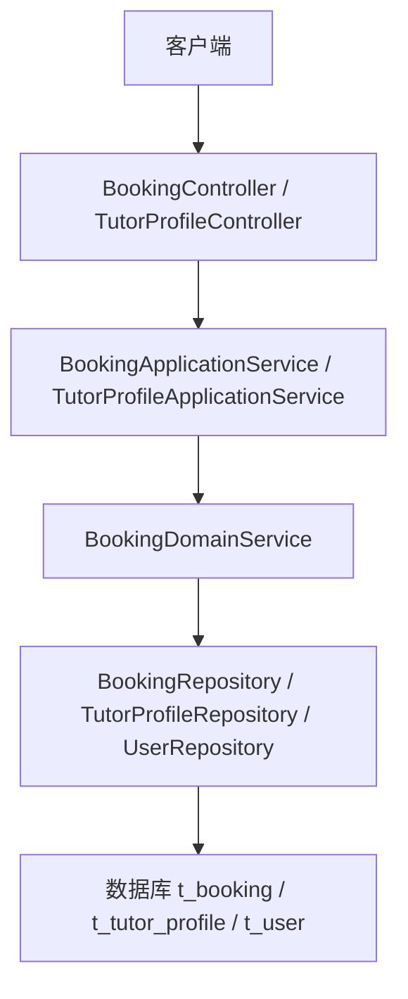
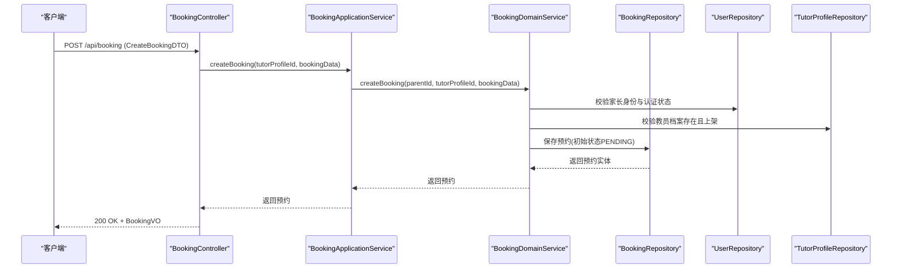
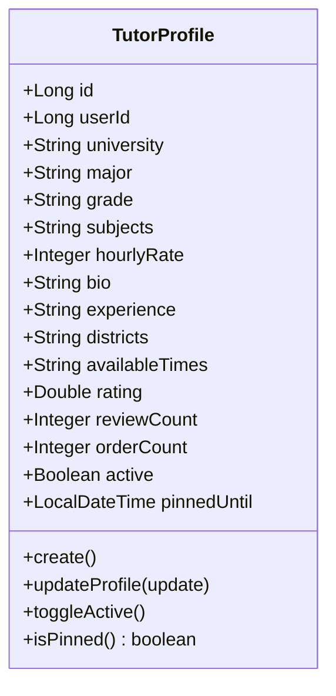
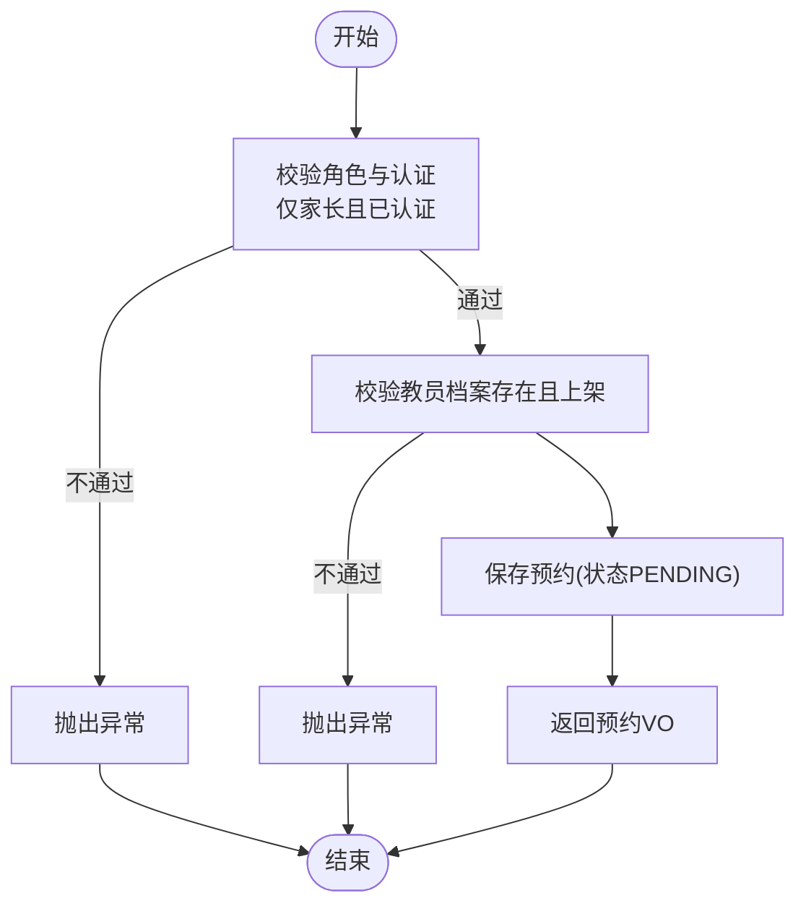
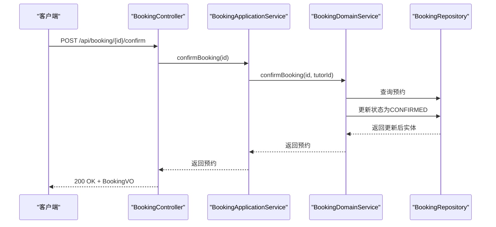
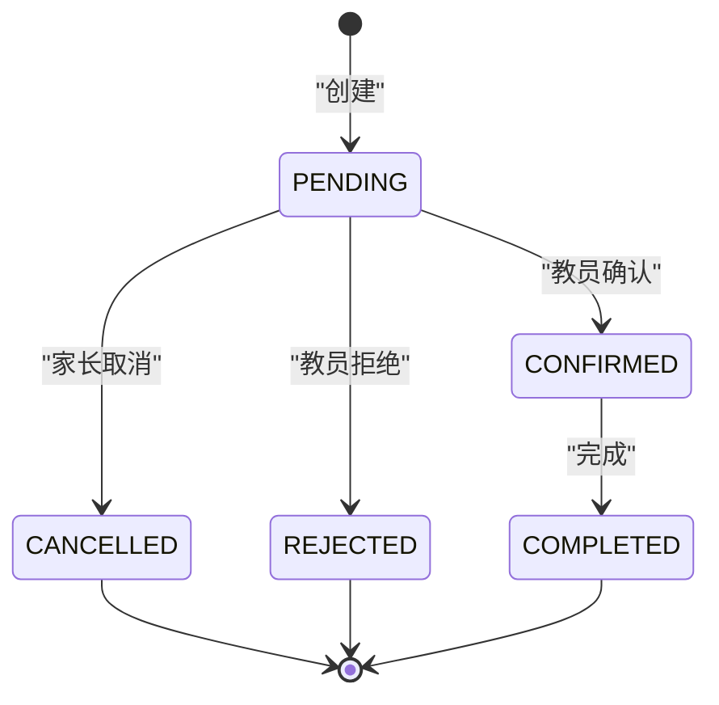
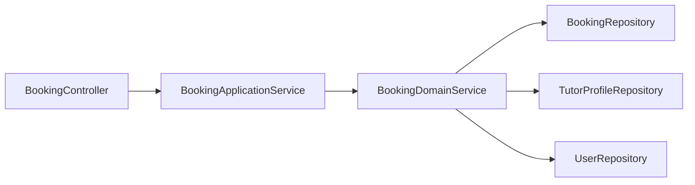

# 预约接口

<cite>
**本文引用的文件**
- [BookingController.java](file://wzoto-backend/wzoto-interfaces/src/main/java/com/wzoto/interfaces/controller/BookingController.java)
- [BookingApplicationService.java](file://wzoto-backend/wzoto-application/src/main/java/com/wzoto/application/service/BookingApplicationService.java)
- [BookingDomainService.java](file://wzoto-backend/wzoto-domain/src/main/java/com/wzoto/domain/service/BookingDomainService.java)
- [Booking.java](file://wzoto-backend/wzoto-domain/src/main/java/com/wzoto/domain/entity/Booking.java)
- [TutorProfile.java](file://wzoto-backend/wzoto-domain/src/main/java/com/wzoto/domain/entity/TutorProfile.java)
- [TutorProfileController.java](file://wzoto-backend/wzoto-interfaces/src/main/java/com/wzoto/interfaces/controller/TutorProfileController.java)
- [CreateBookingDTO.java](file://wzoto-backend/wzoto-interfaces/src/main/java/com/wzoto/interfaces/dto/booking/CreateBookingDTO.java)
- [BookingVO.java](file://wzoto-backend/wzoto-interfaces/src/main/java/com/wzoto/interfaces/vo/booking/BookingVO.java)
- [TutorProfileCreateDTO.java](file://wzoto-backend/wzoto-interfaces/src/main/java/com/wzoto/interfaces/dto/profile/TutorProfileCreateDTO.java)
- [TutorProfileUpdateDTO.java](file://wzoto-backend/wzoto-interfaces/src/main/java/com/wzoto/interfaces/dto/profile/TutorProfileUpdateDTO.java)
- [TutorProfileVO.java](file://wzoto-backend/wzoto-interfaces/src/main/java/com/wzoto/interfaces/vo/profile/TutorProfileVO.java)
- [BookingStatus.java](file://wzoto-backend/wzoto-domain/src/main/java/com/wzoto/domain/valobj/BookingStatus.java)
- [t_booking.sql](file://wzoto-backend/sql/t_booking.sql)
- [t_tutor_profile.sql](file://wzoto-backend/sql/t_tutor_profile.sql)
</cite>

## 目录
1. [简介](#简介)
2. [项目结构](#项目结构)
3. [核心组件](#核心组件)
4. [架构总览](#架构总览)
5. [详细组件分析](#详细组件分析)
6. [依赖关系分析](#依赖关系分析)
7. [性能与扩展建议](#性能与扩展建议)
8. [故障排查指南](#故障排查指南)
9. [结论](#结论)
10. [附录：API 定义与示例](#附录api-定义与示例)

## 简介
本模块提供“预约管理”的完整后端能力，覆盖教员档案管理、在线预约创建/确认/拒绝/取消/查询、以及预约状态流转等核心业务。文档面向前后端开发者与产品人员，既给出清晰的接口契约，也解释关键业务规则（如仅家长可预约、需实名认证、教员档案必须上架等），并基于现有代码梳理了数据模型、调用链路与可扩展点。

## 项目结构
本模块采用分层架构：
- 接口层（interfaces）：REST 控制器，负责参数校验、请求路由与响应封装。
- 应用层（application）：编排用例，处理身份上下文、权限与跨领域协作。
- 领域层（domain）：核心业务实体、值对象与领域服务，承载业务规则与状态机。
- 基础设施层（infrastructure）：持久化实现（Mapper/Repository）、外部集成等。

图表来源
- [BookingController.java:20-96](file://wzoto-backend/wzoto-interfaces/src/main/java/com/wzoto/interfaces/controller/BookingController.java#L20-L96)
- [TutorProfileController.java:20-116](file://wzoto-backend/wzoto-interfaces/src/main/java/com/wzoto/interfaces/controller/TutorProfileController.java#L20-L116)
- [BookingApplicationService.java:13-53](file://wzoto-backend/wzoto-application/src/main/java/com/wzoto/application/service/BookingApplicationService.java#L13-L53)
- [BookingDomainService.java:18-122](file://wzoto-backend/wzoto-domain/src/main/java/com/wzoto/domain/service/BookingDomainService.java#L18-L122)

章节来源
- [BookingController.java:20-96](file://wzoto-backend/wzoto-interfaces/src/main/java/com/wzoto/interfaces/controller/BookingController.java#L20-L96)
- [TutorProfileController.java:20-116](file://wzoto-backend/wzoto-interfaces/src/main/java/com/wzoto/interfaces/controller/TutorProfileController.java#L20-L116)

## 核心组件
- 预约实体 Booking：承载预约单信息、时间槽、地址、留言与状态机（待确认/已确认/已完成/已取消/已拒绝）。
- 教员档案实体 TutorProfile：教员基本信息、可辅导科目、时薪、上课区域、可用时段 JSON、评分与订单统计、上架状态。
- 预约状态 BookingStatus：枚举类型，定义状态码与描述。
- 控制器与 DTO/VO：对外暴露 REST API，统一入参出参格式。

章节来源
- [Booking.java:14-114](file://wzoto-backend/wzoto-domain/src/main/java/com/wzoto/domain/entity/Booking.java#L14-L114)
- [TutorProfile.java:11-106](file://wzoto-backend/wzoto-domain/src/main/java/com/wzoto/domain/entity/TutorProfile.java#L11-L106)
- [BookingStatus.java:9-30](file://wzoto-backend/wzoto-domain/src/main/java/com/wzoto/domain/valobj/BookingStatus.java#L9-L30)
- [CreateBookingDTO.java:10-30](file://wzoto-backend/wzoto-interfaces/src/main/java/com/wzoto/interfaces/dto/booking/CreateBookingDTO.java#L10-L30)
- [BookingVO.java:10-30](file://wzoto-backend/wzoto-interfaces/src/main/java/com/wzoto/interfaces/vo/booking/BookingVO.java#L10-L30)
- [TutorProfileCreateDTO.java:7-31](file://wzoto-backend/wzoto-interfaces/src/main/java/com/wzoto/interfaces/dto/profile/TutorProfileCreateDTO.java#L7-L31)
- [TutorProfileUpdateDTO.java:5-17](file://wzoto-backend/wzoto-interfaces/src/main/java/com/wzoto/interfaces/dto/profile/TutorProfileUpdateDTO.java#L5-L17)
- [TutorProfileVO.java:8-37](file://wzoto-backend/wzoto-interfaces/src/main/java/com/wzoto/interfaces/vo/profile/TutorProfileVO.java#L8-L37)

## 架构总览
预约流程从 Controller 进入，经 Application Service 注入当前用户身份，再交由 Domain Service 执行业务规则与状态变更，最终通过 Repository 持久化。

图表来源
- [BookingController.java:28-41](file://wzoto-backend/wzoto-interfaces/src/main/java/com/wzoto/interfaces/controller/BookingController.java#L28-L41)
- [BookingApplicationService.java:20-23](file://wzoto-backend/wzoto-application/src/main/java/com/wzoto/application/service/BookingApplicationService.java#L20-L23)
- [BookingDomainService.java:31-53](file://wzoto-backend/wzoto-domain/src/main/java/com/wzoto/domain/service/BookingDomainService.java#L31-L53)

## 详细组件分析

### 教员档案管理（CRUD 与搜索）
- 创建教员档案：POST /api/tutor-profile
  - 入参：TutorProfileCreateDTO（学校、专业、年级、科目、时薪、简介、经验、区域、可用时段）
  - 行为：创建档案并默认上架，初始化评分与计数
- 更新教员档案：PUT /api/tutor-profile
  - 入参：TutorProfileUpdateDTO（部分字段更新）
- 切换上架状态：POST /api/tutor-profile/toggle-active
- 获取我的档案：GET /api/tutor-profile/mine
- 搜索教员：GET /api/tutor-profile/search?subject=&district=&page=1&size=10
- 按 ID 获取：GET /api/tutor-profile/{id}

图表来源
- [TutorProfile.java:11-106](file://wzoto-backend/wzoto-domain/src/main/java/com/wzoto/domain/entity/TutorProfile.java#L11-L106)
- [TutorProfileController.java:29-89](file://wzoto-backend/wzoto-interfaces/src/main/java/com/wzoto/interfaces/controller/TutorProfileController.java#L29-L89)

章节来源
- [TutorProfileController.java:29-89](file://wzoto-backend/wzoto-interfaces/src/main/java/com/wzoto/interfaces/controller/TutorProfileController.java#L29-L89)
- [TutorProfileCreateDTO.java:7-31](file://wzoto-backend/wzoto-interfaces/src/main/java/com/wzoto/interfaces/dto/profile/TutorProfileCreateDTO.java#L7-L31)
- [TutorProfileUpdateDTO.java:5-17](file://wzoto-backend/wzoto-interfaces/src/main/java/com/wzoto/interfaces/dto/profile/TutorProfileUpdateDTO.java#L5-L17)
- [TutorProfileVO.java:8-37](file://wzoto-backend/wzoto-interfaces/src/main/java/com/wzoto/interfaces/vo/profile/TutorProfileVO.java#L8-L37)

### 预约核心操作（创建、确认、拒绝、取消、查询）
- 创建预约：POST /api/booking
  - 入参：CreateBookingDTO（教员档案ID、科目、日期、开始/结束时间、地址、留言）
  - 规则：仅家长可预约；家长需完成实名认证；教员档案必须存在且上架
- 确认预约：POST /api/booking/{id}/confirm
  - 由教员执行，将状态从 PENDING 转为 CONFIRMED
- 拒绝预约：POST /api/booking/{id}/reject?reason=...
  - 由教员执行，将状态从 PENDING 转为 REJECTED，并记录回复
- 取消预约：POST /api/booking/{id}/cancel
  - 由家长执行，将状态转为 CANCELLED（已完成或已取消不可再次取消）
- 查询我的预约：GET /api/booking/my
  - 根据当前用户身份（家长/学生）返回不同视角的预约列表
- 按 ID 查询：GET /api/booking/{id}

图表来源
- [BookingDomainService.java:31-53](file://wzoto-backend/wzoto-domain/src/main/java/com/wzoto/domain/service/BookingDomainService.java#L31-L53)
- [BookingController.java:28-41](file://wzoto-backend/wzoto-interfaces/src/main/java/com/wzoto/interfaces/controller/BookingController.java#L28-L41)

图表来源
- [BookingController.java:43-47](file://wzoto-backend/wzoto-interfaces/src/main/java/com/wzoto/interfaces/controller/BookingController.java#L43-L47)
- [BookingApplicationService.java:25-28](file://wzoto-backend/wzoto-application/src/main/java/com/wzoto/application/service/BookingApplicationService.java#L25-L28)
- [BookingDomainService.java:58-65](file://wzoto-backend/wzoto-domain/src/main/java/com/wzoto/domain/service/BookingDomainService.java#L58-L65)

章节来源
- [BookingController.java:28-72](file://wzoto-backend/wzoto-interfaces/src/main/java/com/wzoto/interfaces/controller/BookingController.java#L28-L72)
- [BookingApplicationService.java:20-53](file://wzoto-backend/wzoto-application/src/main/java/com/wzoto/application/service/BookingApplicationService.java#L20-L53)
- [BookingDomainService.java:31-122](file://wzoto-backend/wzoto-domain/src/main/java/com/wzoto/domain/service/BookingDomainService.java#L31-L122)
- [BookingStatus.java:9-30](file://wzoto-backend/wzoto-domain/src/main/java/com/wzoto/domain/valobj/BookingStatus.java#L9-L30)

### 预约状态机
- 初始状态：PENDING（待确认）
- 确认：PENDING → CONFIRMED（教员确认）
- 拒绝：PENDING → REJECTED（教员拒绝，含原因）
- 取消：非 COMPLETED/CANCELLED → CANCELLED（家长取消）
- 完成：CONFIRMED → COMPLETED（线下完成后标记）

图表来源
- [Booking.java:58-114](file://wzoto-backend/wzoto-domain/src/main/java/com/wzoto/domain/entity/Booking.java#L58-L114)
- [BookingStatus.java:9-30](file://wzoto-backend/wzoto-domain/src/main/java/com/wzoto/domain/valobj/BookingStatus.java#L9-L30)

章节来源
- [Booking.java:58-114](file://wzoto-backend/wzoto-domain/src/main/java/com/wzoto/domain/entity/Booking.java#L58-L114)
- [BookingStatus.java:9-30](file://wzoto-backend/wzoto-domain/src/main/java/com/wzoto/domain/valobj/BookingStatus.java#L9-L30)

### 数据模型与索引
- 预约表 t_booking：包含家长ID、教员ID、教员档案ID、科目、日期、起止时间、地址、留言、状态、回复、逻辑删除、创建/更新时间，并提供多列索引以优化查询。
- 教员档案表 t_tutor_profile：包含用户ID、学校、专业、年级、科目、时薪、简介、经验、区域、可用时段JSON、评分、评价数、订单数、是否上架、逻辑删除、创建/更新时间，并提供唯一索引与常用查询索引。

章节来源
- [t_booking.sql:1-23](file://wzoto-backend/sql/t_booking.sql#L1-L23)
- [t_tutor_profile.sql:1-24](file://wzoto-backend/sql/t_tutor_profile.sql#L1-L24)

## 依赖关系分析
- 控制器依赖应用服务，应用服务依赖领域服务，领域服务依赖多个仓库（预约、教员档案、用户）。
- 控制器在构建 VO 时会读取用户信息以填充姓名等展示字段。
- 领域服务在创建预约时进行身份与档案有效性校验，确保业务一致性。

图表来源
- [BookingController.java:20-96](file://wzoto-backend/wzoto-interfaces/src/main/java/com/wzoto/interfaces/controller/BookingController.java#L20-L96)
- [BookingApplicationService.java:13-53](file://wzoto-backend/wzoto-application/src/main/java/com/wzoto/application/service/BookingApplicationService.java#L13-L53)
- [BookingDomainService.java:18-122](file://wzoto-backend/wzoto-domain/src/main/java/com/wzoto/domain/service/BookingDomainService.java#L18-L122)

章节来源
- [BookingController.java:20-96](file://wzoto-backend/wzoto-interfaces/src/main/java/com/wzoto/interfaces/controller/BookingController.java#L20-L96)
- [BookingApplicationService.java:13-53](file://wzoto-backend/wzoto-application/src/main/java/com/wzoto/application/service/BookingApplicationService.java#L13-L53)
- [BookingDomainService.java:18-122](file://wzoto-backend/wzoto-domain/src/main/java/com/wzoto/domain/service/BookingDomainService.java#L18-L122)

## 性能与扩展建议
- 查询优化：利用 t_booking 的多列索引（parent_id、tutor_id、status、booking_date、tutor_id+status）提升列表与筛选性能。
- 并发控制：当前未实现时间槽冲突检测与容量限制，建议在创建预约前增加“时间重叠检查”与“教员可用性验证”，并在领域服务中引入分布式锁或乐观锁避免超卖。
- 可扩展点：
  - 冲突检测：基于 booking_date 与 start_time/end_time 计算时间区间，检查同一教员在同一时间段是否存在其他 CONFIRMED/PENDING 的预约。
  - 容量限制：若支持多人课程，可增加 capacity 字段并在创建时校验剩余名额。
  - 通知机制：在状态变更处（确认、拒绝、取消、完成）触发消息推送（站内信/短信/微信模板消息）。
  - 智能排课：结合教员 available_times 与历史评分/order_count，提供推荐排序与自动匹配。

[本节为通用建议，无需具体文件引用]

## 故障排查指南
- 常见错误与定位：
  - “仅家长可发起预约”：检查当前用户身份是否为家长。
  - “请先完成实名认证”：检查家长用户的 verify_status 是否为已通过。
  - “教员档案不存在或已下架”：检查 tutor_profile_id 对应记录是否存在且 active=true。
  - “无权操作此预约”：确认操作者是否为预约对应的家长或教员。
  - “当前状态不允许确认/拒绝/取消/完成”：检查预约当前状态是否符合状态机约束。
- 日志与追踪：
  - 控制器与应用服务均记录关键操作日志，便于定位问题。
  - 可通过预约 ID 查询 t_booking 记录，核对状态与时间字段。

章节来源
- [BookingDomainService.java:31-122](file://wzoto-backend/wzoto-domain/src/main/java/com/wzoto/domain/service/BookingDomainService.java#L31-L122)
- [BookingController.java:28-72](file://wzoto-backend/wzoto-interfaces/src/main/java/com/wzoto/interfaces/controller/BookingController.java#L28-L72)

## 结论
本模块提供了完整的预约管理与教员档案管理能力，涵盖创建、确认、拒绝、取消、查询等核心流程，并通过清晰的状态机保障业务一致性。后续可在冲突检测、容量控制、通知与智能排课方面进一步增强，以提升用户体验与资源利用率。

[本节为总结性内容，无需具体文件引用]

## 附录：API 定义与示例

### 教员档案管理
- 创建教员档案
  - 方法：POST /api/tutor-profile
  - 入参：TutorProfileCreateDTO
  - 返回：TutorProfileVO
- 更新教员档案
  - 方法：PUT /api/tutor-profile
  - 入参：TutorProfileUpdateDTO
  - 返回：TutorProfileVO
- 切换上架状态
  - 方法：POST /api/tutor-profile/toggle-active
  - 返回：TutorProfileVO
- 获取我的档案
  - 方法：GET /api/tutor-profile/mine
  - 返回：TutorProfileVO
- 搜索教员
  - 方法：GET /api/tutor-profile/search?subject=&district=&page=1&size=10
  - 返回：List<TutorProfileVO>
- 按 ID 获取
  - 方法：GET /api/tutor-profile/{id}
  - 返回：TutorProfileVO

章节来源
- [TutorProfileController.java:29-89](file://wzoto-backend/wzoto-interfaces/src/main/java/com/wzoto/interfaces/controller/TutorProfileController.java#L29-L89)
- [TutorProfileCreateDTO.java:7-31](file://wzoto-backend/wzoto-interfaces/src/main/java/com/wzoto/interfaces/dto/profile/TutorProfileCreateDTO.java#L7-L31)
- [TutorProfileUpdateDTO.java:5-17](file://wzoto-backend/wzoto-interfaces/src/main/java/com/wzoto/interfaces/dto/profile/TutorProfileUpdateDTO.java#L5-L17)
- [TutorProfileVO.java:8-37](file://wzoto-backend/wzoto-interfaces/src/main/java/com/wzoto/interfaces/vo/profile/TutorProfileVO.java#L8-L37)

### 预约管理
- 创建预约
  - 方法：POST /api/booking
  - 入参：CreateBookingDTO（tutorProfileId、subject、bookingDate、startTime、endTime、address、message）
  - 返回：BookingVO
- 确认预约
  - 方法：POST /api/booking/{id}/confirm
  - 返回：BookingVO
- 拒绝预约
  - 方法：POST /api/booking/{id}/reject?reason=...
  - 返回：BookingVO
- 取消预约
  - 方法：POST /api/booking/{id}/cancel
  - 返回：BookingVO
- 查询我的预约
  - 方法：GET /api/booking/my
  - 返回：List<BookingVO>
- 按 ID 查询
  - 方法：GET /api/booking/{id}
  - 返回：BookingVO

章节来源
- [BookingController.java:28-72](file://wzoto-backend/wzoto-interfaces/src/main/java/com/wzoto/interfaces/controller/BookingController.java#L28-L72)
- [CreateBookingDTO.java:10-30](file://wzoto-backend/wzoto-interfaces/src/main/java/com/wzoto/interfaces/dto/booking/CreateBookingDTO.java#L10-L30)
- [BookingVO.java:10-30](file://wzoto-backend/wzoto-interfaces/src/main/java/com/wzoto/interfaces/vo/booking/BookingVO.java#L10-L30)

### 业务规则与状态流转
- 创建预约前校验：
  - 仅家长可预约
  - 家长需完成实名认证
  - 教员档案必须存在且上架
- 状态流转：
  - PENDING → CONFIRMED（教员确认）
  - PENDING → REJECTED（教员拒绝，含原因）
  - 非 COMPLETED/CANCELLED → CANCELLED（家长取消）
  - CONFIRMED → COMPLETED（完成）

章节来源
- [BookingDomainService.java:31-122](file://wzoto-backend/wzoto-domain/src/main/java/com/wzoto/domain/service/BookingDomainService.java#L31-L122)
- [Booking.java:58-114](file://wzoto-backend/wzoto-domain/src/main/java/com/wzoto/domain/entity/Booking.java#L58-L114)
- [BookingStatus.java:9-30](file://wzoto-backend/wzoto-domain/src/main/java/com/wzoto/domain/valobj/BookingStatus.java#L9-L30)