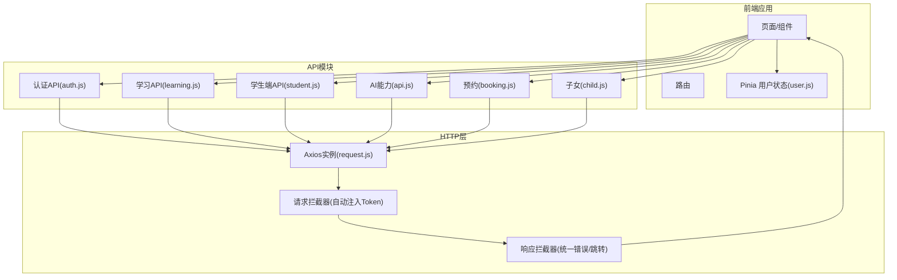
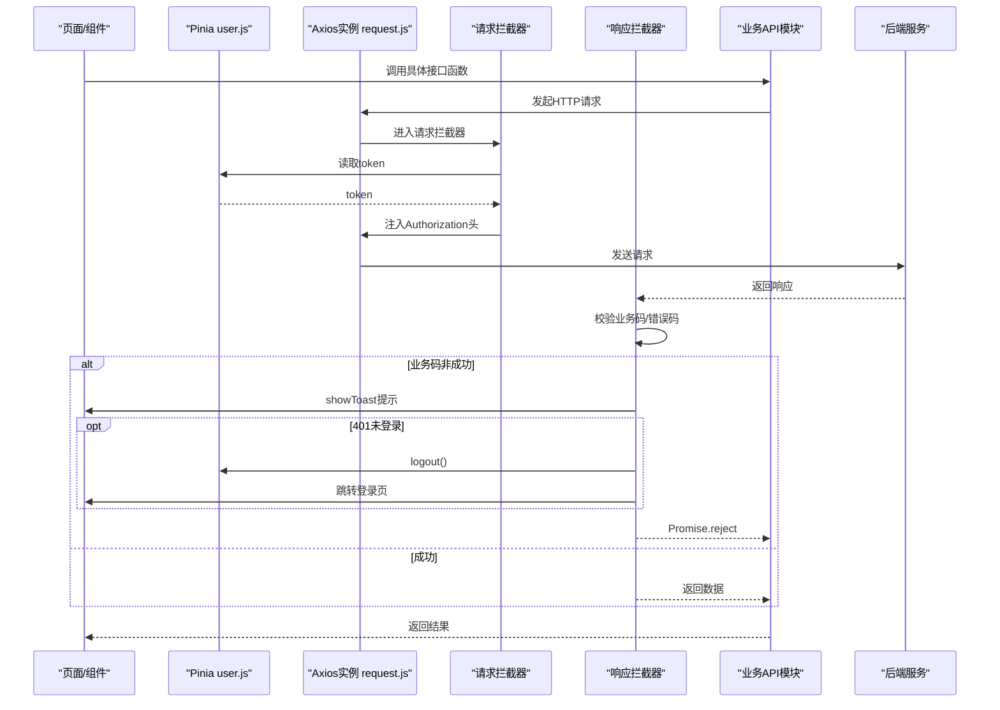
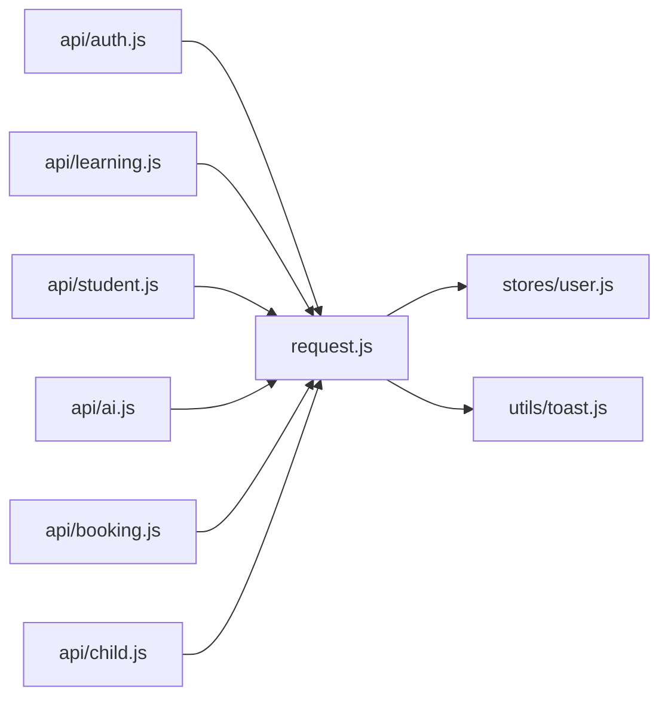

# API集成

<cite>
**本文引用的文件**
- [request.js](file://wzoto-frontend/src/utils/request.js)
- [toast.js](file://wzoto-frontend/src/utils/toast.js)
- [user.js](file://wzoto-frontend/src/stores/user.js)
- [auth.js](file://wzoto-frontend/src/api/auth.js)
- [learning.js](file://wzoto-frontend/src/api/learning.js)
- [student.js](file://wzoto-frontend/src/api/student.js)
- [ai.js](file://wzoto-frontend/src/api/ai.js)
- [booking.js](file://wzoto-frontend/src/api/booking.js)
- [child.js](file://wzoto-frontend/src/api/child.js)
- [package.json](file://wzoto-frontend/package.json)
</cite>

## 目录
1. [简介](#简介)
2. [项目结构](#项目结构)
3. [核心组件](#核心组件)
4. [架构总览](#架构总览)
5. [详细组件分析](#详细组件分析)
6. [依赖关系分析](#依赖关系分析)
7. [性能与优化建议](#性能与优化建议)
8. [故障排查指南](#故障排查指南)
9. [结论](#结论)
10. [附录：API示例与使用方式](#附录api示例与使用方式)

## 简介
本文件面向wzoto前端项目的API集成，重点说明Axios请求封装与配置、请求/响应拦截器、模块化API设计、错误处理策略以及实际API示例（认证、学习、学生端）。文档同时给出可落地的优化建议（缓存、并发控制、取消重复请求、去重），帮助在现有基础上进一步提升稳定性与性能。

## 项目结构
前端采用Vue 3 + Vite + Pinia + Element Plus + Axios的技术栈。API相关代码集中在以下位置：
- 请求封装与拦截器：src/utils/request.js
- 用户状态管理（Token存储与注入）：src/stores/user.js
- 业务API模块：src/api/*.js（按功能划分：认证、学习、学生端、AI、预约、子女等）
- 提示工具：src/utils/toast.js

图表来源
- [request.js:1-59](file://wzoto-frontend/src/utils/request.js#L1-L59)
- [user.js:1-126](file://wzoto-frontend/src/stores/user.js#L1-L126)
- [auth.js:1-30](file://wzoto-frontend/src/api/auth.js#L1-L30)
- [learning.js:1-135](file://wzoto-frontend/src/api/learning.js#L1-L135)
- [student.js:1-94](file://wzoto-frontend/src/api/student.js#L1-L94)
- [ai.js:1-79](file://wzoto-frontend/src/api/ai.js#L1-L79)
- [booking.js:1-25](file://wzoto-frontend/src/api/booking.js#L1-L25)
- [child.js:1-37](file://wzoto-frontend/src/api/child.js#L1-L37)

章节来源
- [package.json:1-27](file://wzoto-frontend/package.json#L1-L27)

## 核心组件
- Axios实例与基础配置：统一baseURL、超时、Content-Type
- 请求拦截器：从Pinia读取token并注入Authorization头
- 响应拦截器：统一处理业务码、网络错误、401跳转登录
- 用户状态管理：持久化token、提供登录/登出/获取用户信息等方法
- Toast提示：基于Element Plus的轻量提示

章节来源
- [request.js:1-59](file://wzoto-frontend/src/utils/request.js#L1-L59)
- [toast.js:1-14](file://wzoto-frontend/src/utils/toast.js#L1-L14)
- [user.js:1-126](file://wzoto-frontend/src/stores/user.js#L1-L126)

## 架构总览
下图展示了从页面发起请求到后端返回的完整链路，包括拦截器与状态管理的交互。

图表来源
- [request.js:13-56](file://wzoto-frontend/src/utils/request.js#L13-L56)
- [user.js:36-102](file://wzoto-frontend/src/stores/user.js#L36-L102)

## 详细组件分析

### Axios请求封装与配置
- 基础配置
  - baseURL：统一为/api，便于代理与跨域
  - timeout：默认15秒，避免长时间阻塞
  - headers：设置application/json
- 扩展点
  - 可在请求拦截器中增加请求日志、埋点、重试策略、取消令牌等
  - 可在响应拦截器中做数据格式化、全局错误上报

章节来源
- [request.js:5-11](file://wzoto-frontend/src/utils/request.js#L5-L11)

### 请求拦截器：预处理、Token注入、日志、超时
- Token注入：从Pinia store读取token并写入Authorization头
- 预处理：可扩展参数序列化、签名、请求体清洗
- 日志记录：可在此处打印请求方法、URL、时间戳、耗时（需配合响应拦截器）
- 超时：由axios实例统一配置，也可针对特定请求覆盖

章节来源
- [request.js:13-23](file://wzoto-frontend/src/utils/request.js#L13-L23)

### 响应拦截器：统一处理、错误码、自动重试、数据格式化
- 统一处理：对后端返回的业务码进行判断，非成功则提示并拒绝Promise
- 错误码处理：401时清空用户态并跳转登录；其他网络错误显示状态码提示
- 自动重试：当前未实现，建议在网络错误且幂等请求上增加指数退避重试
- 数据格式化：可将data字段直接透传或包装为标准结构，便于上层消费

章节来源
- [request.js:25-56](file://wzoto-frontend/src/utils/request.js#L25-L56)

### 用户状态管理（Token与鉴权）
- 状态字段：token、userId、openid、phone、nickname、avatar、identityType、hasIdentity、verifyStatus、realName
- 计算属性：isLoggedIn、isParent、isStudent、身份描述、认证描述
- 关键动作：
  - login：微信登录后保存token与用户信息
  - chooseIdentity：选择身份后更新状态
  - bindUserPhone：绑定手机号
  - fetchUserInfo：拉取当前用户信息
  - logout：清理本地与内存中的用户态
- 与拦截器联动：当响应拦截器检测到401时调用logout并跳转

章节来源
- [user.js:1-126](file://wzoto-frontend/src/stores/user.js#L1-L126)
- [request.js:31-48](file://wzoto-frontend/src/utils/request.js#L31-L48)

### API模块化设计
- 按功能划分模块：
  - 认证：auth.js（微信登录、选择身份、绑定手机、获取用户信息）
  - 学习：learning.js（学习计划、任务、报告、资源、家长管控、错题、播放进度、课程树、成就）
  - 学生端：student.js（AI答疑、批改、规划、习题库、微课、知识点）
  - AI能力：ai.js（学情报告、教员优化、定价分析、会员状态、开发环境登录）
  - 预约：booking.js（创建、确认、拒绝、取消、查询）
  - 子女：child.js（CRUD与列表）
- 接口统一管理：每个模块导出纯函数，集中维护路径与参数
- 类型定义规范：当前未引入TS类型，建议在后续引入TypeScript或JSDoc标注接口入参与返回值结构，提升可维护性

章节来源
- [auth.js:1-30](file://wzoto-frontend/src/api/auth.js#L1-L30)
- [learning.js:1-135](file://wzoto-frontend/src/api/learning.js#L1-L135)
- [student.js:1-94](file://wzoto-frontend/src/api/student.js#L1-L94)
- [ai.js:1-79](file://wzoto-frontend/src/api/ai.js#L1-L79)
- [booking.js:1-25](file://wzoto-frontend/src/api/booking.js#L1-L25)
- [child.js:1-37](file://wzoto-frontend/src/api/child.js#L1-L37)

### 错误处理策略
- 网络错误：无response时提示“网络连接失败，请检查网络”
- HTTP状态码：401触发登出并跳转；其他状态码提示“网络错误(status)”
- 业务错误：后端返回code非200时，提示msg并reject
- 用户友好提示：通过Toast统一展示，避免控制台噪音
- 错误日志记录：可在拦截器中收集错误上下文（URL、参数、堆栈）并上报

章节来源
- [request.js:25-56](file://wzoto-frontend/src/utils/request.js#L25-L56)
- [toast.js:1-14](file://wzoto-frontend/src/utils/toast.js#L1-L14)

### 请求优化（建议）
- 请求缓存
  - 适用场景：GET类、幂等、数据变化不频繁（如课程树、知识树、配置）
  - 方案：在请求拦截器前加一层缓存层，以URL+参数为key缓存响应与过期时间
- 并发控制
  - 适用场景：批量加载、瀑布流、分页合并
  - 方案：限制最大并发数，队列执行，避免瞬时压垮后端
- 取消重复请求
  - 适用场景：快速切换页面、搜索输入防抖
  - 方案：使用AbortController，相同请求未完成时取消旧请求
- 请求去重
  - 适用场景：同一请求短时间内多次触发
  - 方案：维护pendingMap，相同请求只发一次，多个调用共享同一Promise

[本节为通用优化建议，不直接对应具体源码]

## 依赖关系分析
- 技术栈依赖
  - axios：HTTP客户端
  - pinia：状态管理（用户态、token）
  - element-plus：UI与消息提示
  - vue/vue-router：框架与路由
- 模块耦合
  - request.js依赖user.js（读取token）、toast.js（提示）
  - 各API模块依赖request.js
  - user.js依赖auth.js（登录流程）

图表来源
- [request.js:1-59](file://wzoto-frontend/src/utils/request.js#L1-L59)
- [user.js:1-126](file://wzoto-frontend/src/stores/user.js#L1-L126)
- [toast.js:1-14](file://wzoto-frontend/src/utils/toast.js#L1-L14)
- [auth.js:1-30](file://wzoto-frontend/src/api/auth.js#L1-L30)
- [learning.js:1-135](file://wzoto-frontend/src/api/learning.js#L1-L135)
- [student.js:1-94](file://wzoto-frontend/src/api/student.js#L1-L94)
- [ai.js:1-79](file://wzoto-frontend/src/api/ai.js#L1-L79)
- [booking.js:1-25](file://wzoto-frontend/src/api/booking.js#L1-L25)
- [child.js:1-37](file://wzoto-frontend/src/api/child.js#L1-L37)

章节来源
- [package.json:11-20](file://wzoto-frontend/package.json#L11-L20)

## 性能与优化建议
- 合理设置超时与重试：对长耗时接口适当延长超时；对幂等GET可增加有限次重试
- 减少不必要请求：结合路由守卫与组件生命周期，避免重复拉取
- 数据分层与懒加载：首屏仅加载必要数据，其余按需加载
- 图片与媒体资源：使用CDN与压缩，降低带宽占用
- 监控与埋点：在拦截器中记录请求耗时、错误率，辅助定位瓶颈

[本节为通用指导，不直接对应具体源码]

## 故障排查指南
- 401未登录
  - 现象：响应拦截器触发登出并跳转登录页
  - 排查：检查token是否存在、是否过期；确认请求是否携带Authorization头
- 网络错误
  - 现象：提示“网络错误(status)”或“网络连接失败”
  - 排查：检查代理配置、CORS、后端可达性、浏览器控制台Network面板
- 业务错误
  - 现象：提示后端返回的msg
  - 排查：核对请求参数、权限、业务规则；查看后端日志
- 登录流程异常
  - 现象：登录后状态未更新或无法获取用户信息
  - 排查：检查store.login/setLoginData逻辑、localStorage是否被清理

章节来源
- [request.js:25-56](file://wzoto-frontend/src/utils/request.js#L25-L56)
- [user.js:36-102](file://wzoto-frontend/src/stores/user.js#L36-L102)

## 结论
当前wzoto前端已具备清晰的Axios封装与拦截器机制，实现了Token自动注入、统一错误处理与用户态联动。API按功能模块划分，职责清晰。建议在后续迭代中补充类型定义、请求缓存、并发控制、取消与去重等优化，以提升用户体验与系统稳定性。

## 附录：API示例与使用方式

### 认证API（auth.js）
- 微信登录：传入code，成功后保存token与用户信息
- 选择身份：根据userId与身份类型设置角色
- 绑定手机号：绑定并更新用户信息
- 获取用户信息：拉取当前用户详情

使用要点
- 登录成功后，后续请求将自动携带Authorization头
- 若响应401，将自动登出并跳转登录页

章节来源
- [auth.js:1-30](file://wzoto-frontend/src/api/auth.js#L1-L30)
- [user.js:36-102](file://wzoto-frontend/src/stores/user.js#L36-L102)
- [request.js:13-23](file://wzoto-frontend/src/utils/request.js#L13-L23)

### 学习API（learning.js）
- 学习计划：获取/保存配置、分配特殊任务
- 学习任务：列出任务、完成任务
- 学情报告：概览、日/周/月报、薄弱点、错题导出
- 学习资源：列表、详情、解锁
- 家长管控：配置、锁定/解锁
- 错题管理：列表、批量加入复习、标记掌握
- 播放进度：上报与查询
- 课程目录树：获取课程树
- 成长激励：成就列表、分配成就任务

使用要点
- 多数接口需要childId作为路径或参数
- 列表接口支持分页与筛选参数

章节来源
- [learning.js:1-135](file://wzoto-frontend/src/api/learning.js#L1-L135)

### 学生端API（student.js）
- AI答疑：提问、追问、历史会话
- AI批改：作文批改、发音评测、历史记录
- AI学习规划：生成计划、今日计划、应用计划
- 习题库：题目列表、试卷详情、提交答案、试卷列表
- 微课：课程列表、详情、进度上报、推荐课程
- 知识点：知识树、掌握度

使用要点
- 涉及大量异步与流式交互的场景，建议结合取消与重试策略
- 注意上传大文件或音频时的超时与错误处理

章节来源
- [student.js:1-94](file://wzoto-frontend/src/api/student.js#L1-L94)

### 其他API模块
- AI能力（ai.js）：学情报告、教员优化、定价分析、会员状态、开发环境登录
- 预约（booking.js）：创建、确认、拒绝、取消、查询
- 子女（child.js）：CRUD与列表

章节来源
- [ai.js:1-79](file://wzoto-frontend/src/api/ai.js#L1-L79)
- [booking.js:1-25](file://wzoto-frontend/src/api/booking.js#L1-L25)
- [child.js:1-37](file://wzoto-frontend/src/api/child.js#L1-L37)