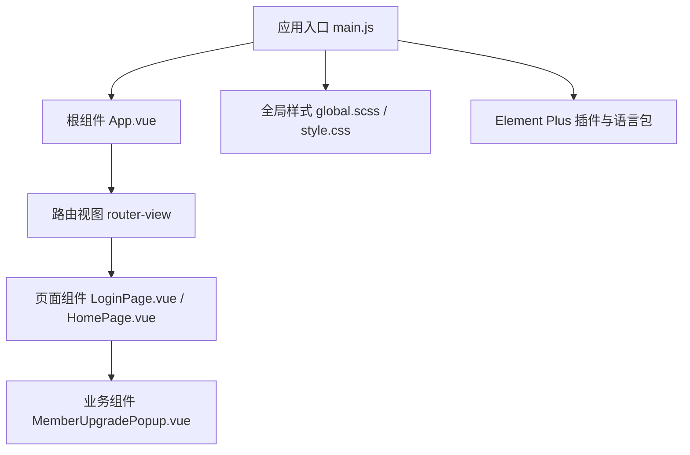
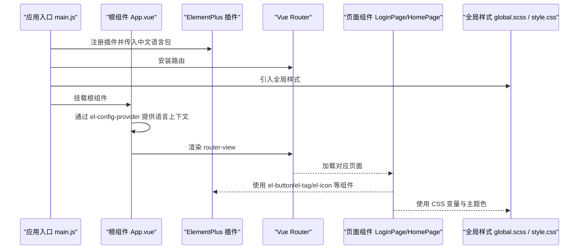
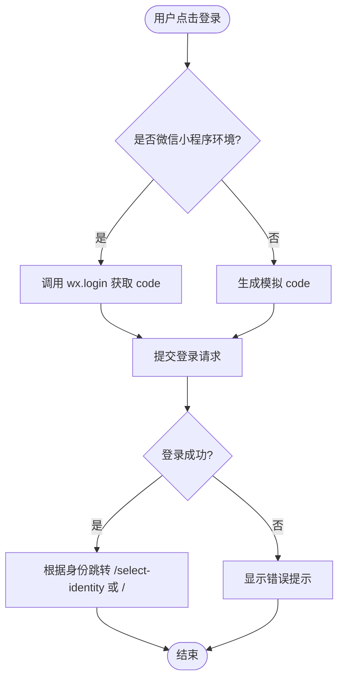
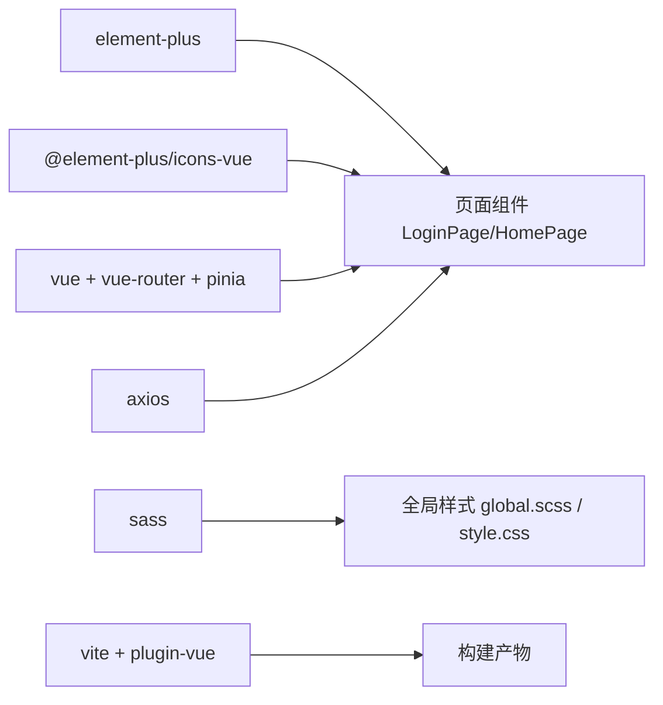

# UI组件库集成

<cite>
**本文引用的文件**
- [package.json](file://wzoto-frontend/package.json)
- [vite.config.js](file://wzoto-frontend/vite.config.js)
- [main.js](file://wzoto-frontend/src/main.js)
- [App.vue](file://wzoto-frontend/src/App.vue)
- [style.css](file://wzoto-frontend/src/style.css)
- [global.scss](file://wzoto-frontend/src/assets/styles/global.scss)
- [LoginPage.vue](file://wzoto-frontend/src/pages/auth/LoginPage.vue)
- [HomePage.vue](file://wzoto-frontend/src/pages/home/HomePage.vue)
- [MemberUpgradePopup.vue](file://wzoto-frontend/src/components/MemberUpgradePopup.vue)
</cite>

## 目录
1. [简介](#简介)
2. [项目结构](#项目结构)
3. [核心组件与集成点](#核心组件与集成点)
4. [架构总览](#架构总览)
5. [详细组件分析](#详细组件分析)
6. [依赖关系分析](#依赖关系分析)
7. [性能与构建优化](#性能与构建优化)
8. [样式规范与主题定制](#样式规范与主题定制)
9. [故障排查指南](#故障排查指南)
10. [结论](#结论)

## 简介
本文件聚焦于 wzoto 前端项目中 Element Plus 的集成与定制，涵盖：
- 主题定制：主题变量、颜色系统、字体与响应式适配
- 样式管理：全局样式组织、组件样式隔离、CSS 模块化、优先级策略
- 组件扩展：自定义组件、第三方组件集成、二次封装与通用库建设思路
- 构建配置：Vite 配置优化、插件使用、资源压缩与打包优化
- 样式规范：BEM 命名、CSS 变量、移动端适配、浏览器兼容性
- 实战示例：Element Plus 在登录页、首页等页面的使用与主题覆盖

## 项目结构
wzoto 前端采用 Vue 3 + Vite + Element Plus 的技术栈。入口文件负责安装 Pinia、路由与 Element Plus，并引入全局样式；页面按功能域划分（auth、learning、student 等），组件集中在 components 目录；样式分为全局 SCSS 与默认 CSS。

图表来源
- [main.js:1-17](file://wzoto-frontend/src/main.js#L1-L17)
- [App.vue:1-10](file://wzoto-frontend/src/App.vue#L1-L10)
- [LoginPage.vue:1-301](file://wzoto-frontend/src/pages/auth/LoginPage.vue#L1-L301)
- [HomePage.vue:1-202](file://wzoto-frontend/src/pages/home/HomePage.vue#L1-L202)

章节来源
- [package.json:1-27](file://wzoto-frontend/package.json#L1-L27)
- [vite.config.js:1-21](file://wzoto-frontend/vite.config.js#L1-L21)
- [main.js:1-17](file://wzoto-frontend/src/main.js#L1-L17)
- [App.vue:1-10](file://wzoto-frontend/src/App.vue#L1-L10)

## 核心组件与集成点
- Element Plus 安装与国际化
  - 在应用入口注册 Element Plus 并传入中文语言包
  - 在根组件通过 el-config-provider 提供统一语言上下文
- 图标库
  - 通过 @element-plus/icons-vue 按需引入图标
- 表单与交互
  - 登录页使用 el-button、el-input 完成基础交互
  - 首页使用 el-tag、el-icon 展示状态与导航
- 弹窗与业务组件
  - 会员升级弹窗使用 el-button 组合业务操作

章节来源
- [main.js:1-17](file://wzoto-frontend/src/main.js#L1-L17)
- [App.vue:1-10](file://wzoto-frontend/src/App.vue#L1-L10)
- [LoginPage.vue:1-301](file://wzoto-frontend/src/pages/auth/LoginPage.vue#L1-L301)
- [HomePage.vue:1-202](file://wzoto-frontend/src/pages/home/HomePage.vue#L1-L202)
- [MemberUpgradePopup.vue:1-164](file://wzoto-frontend/src/components/MemberUpgradePopup.vue#L1-L164)

## 架构总览
下图展示了从应用启动到页面渲染过程中，Element Plus 的注入、语言包配置以及样式生效路径。

图表来源
- [main.js:1-17](file://wzoto-frontend/src/main.js#L1-L17)
- [App.vue:1-10](file://wzoto-frontend/src/App.vue#L1-L10)
- [LoginPage.vue:1-301](file://wzoto-frontend/src/pages/auth/LoginPage.vue#L1-L301)
- [HomePage.vue:1-202](file://wzoto-frontend/src/pages/home/HomePage.vue#L1-L202)

## 详细组件分析

### 登录页（LoginPage）中的 Element Plus 使用
- 使用 el-button 实现微信一键登录与开发模式快捷登录
- 使用 el-input 输入模拟验证码
- 使用 @element-plus/icons-vue 的 ChatDotRound 图标增强按钮语义
- 通过全局 CSS 变量与自定义类名对按钮进行尺寸、圆角与全宽适配

图表来源
- [LoginPage.vue:1-301](file://wzoto-frontend/src/pages/auth/LoginPage.vue#L1-L301)

章节来源
- [LoginPage.vue:1-301](file://wzoto-frontend/src/pages/auth/LoginPage.vue#L1-L301)

### 首页（HomePage）中的 Element Plus 使用
- 使用 el-tag 展示用户身份与认证状态
- 使用 el-icon 作为导航箭头
- 使用 el-button text 类型实现退出登录入口
- 结合全局卡片与网格布局，形成清晰的功能入口

章节来源
- [HomePage.vue:1-202](file://wzoto-frontend/src/pages/home/HomePage.vue#L1-L202)

### 会员升级弹窗（MemberUpgradePopup）
- 使用 el-button 组合“取消”“去开通会员”等操作
- 针对 AI 报告场景提供双选项（单次购买/开通会员）
- 通过 scoped 样式与 CSS 变量保持视觉一致性

章节来源
- [MemberUpgradePopup.vue:1-164](file://wzoto-frontend/src/components/MemberUpgradePopup.vue#L1-L164)

## 依赖关系分析
- 运行时依赖
  - element-plus：UI 组件库
  - @element-plus/icons-vue：图标库
  - vue、vue-router、pinia：框架与生态
  - axios：网络请求
  - echarts：图表
  - sass：样式预处理
- 开发依赖
  - vite、@vitejs/plugin-vue：构建与 Vue 支持
  - playwright：端到端测试

图表来源
- [package.json:1-27](file://wzoto-frontend/package.json#L1-L27)

章节来源
- [package.json:1-27](file://wzoto-frontend/package.json#L1-L27)

## 性能与构建优化
当前 Vite 配置已启用 Vue 插件与别名解析，并提供开发代理。建议后续优化方向：
- 按需引入 Element Plus 组件与样式，减少首屏体积
- 开启生产环境的代码分割与资源压缩（如 cssnano、terser）
- 图片与静态资源使用现代格式与懒加载
- 利用 Vite 的预构建缓存与依赖外置提升冷启动速度

章节来源
- [vite.config.js:1-21](file://wzoto-frontend/vite.config.js#L1-L21)

## 样式规范与主题定制

### 主题变量与颜色系统
- 全局 SCSS 中定义品牌主色、辅助色、文本色、背景色、边框色、圆角与字号体系
- 通过 CSS 变量统一管理，便于多端复用与主题切换
- 在 Element Plus 按钮上通过 CSS 变量覆盖默认样式，使其与品牌色一致

章节来源
- [global.scss:1-111](file://wzoto-frontend/src/assets/styles/global.scss#L1-L111)

### 字体与响应式
- 全局字体栈优先系统字体与中文友好字体，保证可读性
- 通过媒体查询调整字号与间距，适配移动端
- 在根级设置基础字号与行高，配合 CSS 变量实现整体缩放

章节来源
- [style.css:1-297](file://wzoto-frontend/src/style.css#L1-L297)
- [global.scss:1-111](file://wzoto-frontend/src/assets/styles/global.scss#L1-L111)

### 样式管理与优先级
- 全局样式集中放置在 assets/styles/global.scss，并在入口引入
- 组件样式使用 scoped 避免污染，必要时通过 CSS 变量影响第三方组件
- Element Plus 样式通过 CSS 变量覆盖，确保主题一致性且易于维护

章节来源
- [main.js:1-17](file://wzoto-frontend/src/main.js#L1-L17)
- [global.scss:1-111](file://wzoto-frontend/src/assets/styles/global.scss#L1-L111)

### 实际集成示例
- 登录页按钮
  - 使用 el-button 并配合全局 .btn-full 类实现全宽与圆角
  - 通过 CSS 变量控制主色、悬停态与激活态
- 首页标签
  - 使用 el-tag 展示身份与认证状态，结合全局色彩体系
- 弹窗按钮
  - 使用 el-button 组合业务动作，保持统一的交互反馈

章节来源
- [LoginPage.vue:1-301](file://wzoto-frontend/src/pages/auth/LoginPage.vue#L1-L301)
- [HomePage.vue:1-202](file://wzoto-frontend/src/pages/home/HomePage.vue#L1-L202)
- [MemberUpgradePopup.vue:1-164](file://wzoto-frontend/src/components/MemberUpgradePopup.vue#L1-L164)

## 故障排查指南
- 主题未生效
  - 检查是否在入口引入全局样式，确认 CSS 变量已定义
  - 确认 Element Plus 样式未被其他样式覆盖
- 图标不显示
  - 确认已安装并正确引入 @element-plus/icons-vue
- 移动端布局异常
  - 检查媒体查询与全局字号设置，确保容器宽度与内边距合理
- 构建体积过大
  - 考虑按需引入 Element Plus 组件与样式，减少打包体积

章节来源
- [main.js:1-17](file://wzoto-frontend/src/main.js#L1-L17)
- [global.scss:1-111](file://wzoto-frontend/src/assets/styles/global.scss#L1-L111)
- [vite.config.js:1-21](file://wzoto-frontend/vite.config.js#L1-L21)

## 结论
本项目已基于 Element Plus 完成了基础的 UI 集成与主题定制，形成了以 CSS 变量为核心的样式体系，并通过全局样式与组件 scoped 样式实现了良好的可维护性与一致性。后续可在按需引入、构建优化与组件二次封装方面持续完善，进一步提升性能与开发效率。