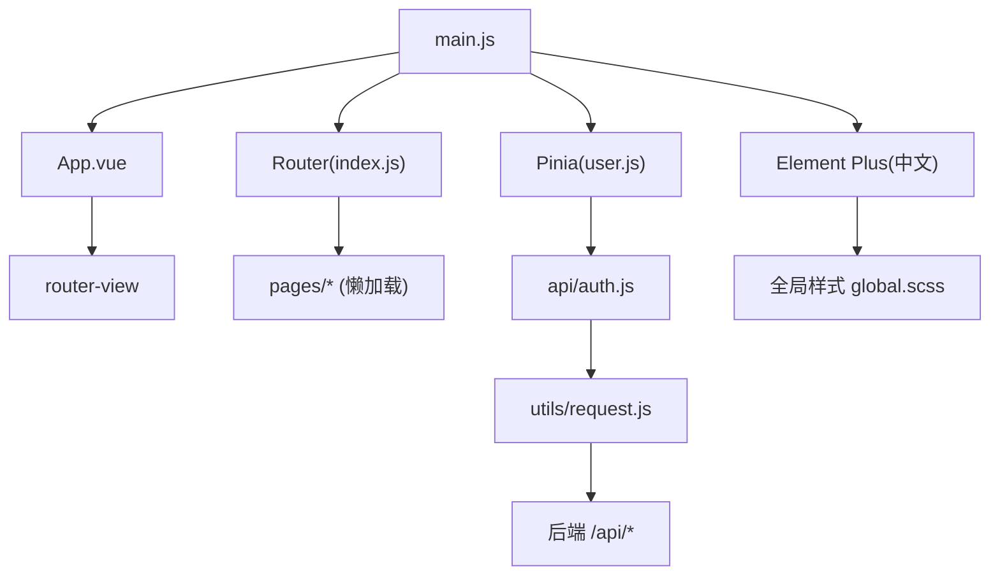
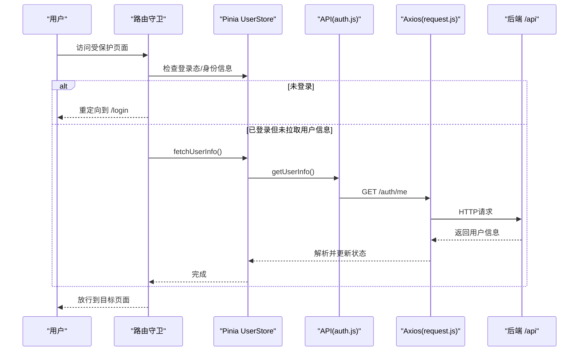
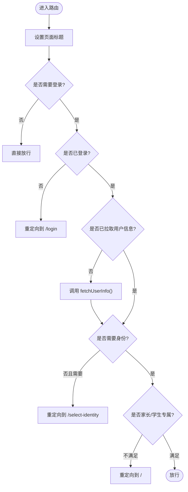
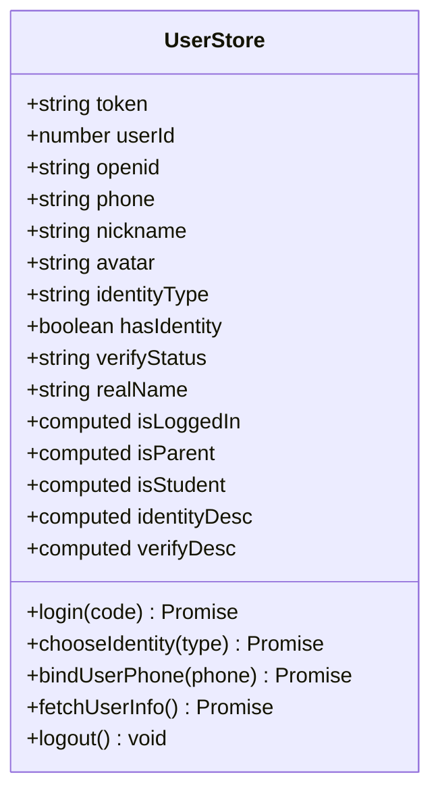
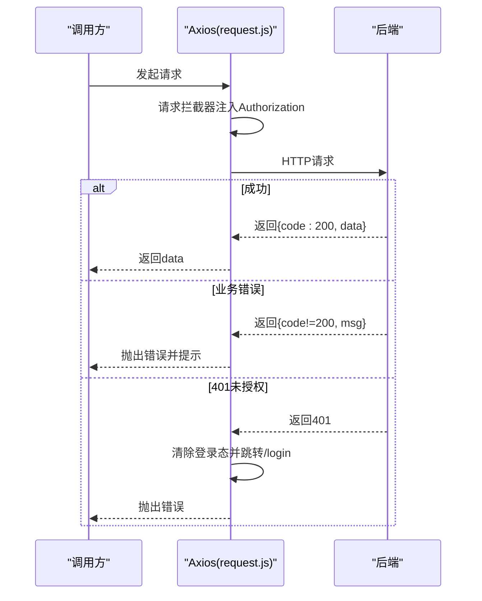
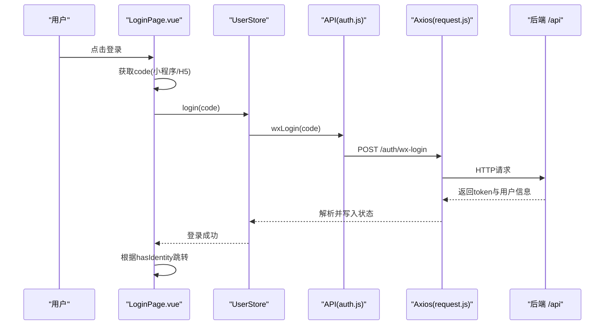
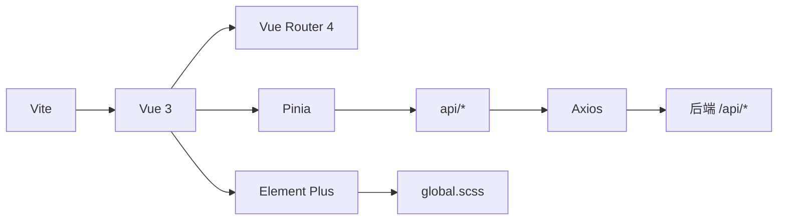

# 前端架构设计

<cite>
**本文引用的文件**
- [package.json](file://wzoto-frontend\package.json)
- [vite.config.js](file://wzoto-frontend\vite.config.js)
- [main.js](file://wzoto-frontend\src\main.js)
- [App.vue](file://wzoto-frontend\src\App.vue)
- [index.js（路由）](file://wzoto-frontend\src\router\index.js)
- [user.js（Pinia Store）](file://wzoto-frontend\src\stores\user.js)
- [request.js（Axios封装）](file://wzoto-frontend\src\utils\request.js)
- [auth.js（认证API）](file://wzoto-frontend\src\api\auth.js)
- [global.scss（全局样式）](file://wzoto-frontend\src\assets\styles\global.scss)
- [LoginPage.vue（登录页）](file://wzoto-frontend\src\pages\auth\LoginPage.vue)
- [toast.js（提示工具）](file://wzoto-frontend\src\utils\toast.js)
</cite>

## 目录
1. [简介](#简介)
2. [项目结构](#项目结构)
3. [核心组件](#核心组件)
4. [架构总览](#架构总览)
5. [详细组件分析](#详细组件分析)
6. [依赖关系分析](#依赖关系分析)
7. [性能优化策略](#性能优化策略)
8. [故障排查指南](#故障排查指南)
9. [结论](#结论)
10. [附录：开发规范与最佳实践](#附录：开发规范与最佳实践)

## 简介
本文件面向wzoto前端项目的架构设计与实现说明，聚焦于Vue 3 + Vite技术栈选型、组件架构、路由设计、状态管理（Pinia）、API请求封装（Axios）、UI组件库集成（Element Plus）、以及性能优化与开发规范。文档以仓库实际代码为依据，提供可追溯的源码路径与图示，帮助读者快速理解并落地工程化实践。

## 项目结构
- 构建与依赖
  - 使用Vite作为构建工具，配置了别名与开发代理，便于本地联调。
  - 依赖包含Vue 3、Vue Router 4、Pinia、Element Plus、Axios、Sass等。
- 应用入口
  - main.js负责创建Vue应用实例，挂载Pinia、Router、Element Plus（含中文语言包），并引入全局样式。
  - App.vue通过ElConfigProvider统一注入Element Plus中文语言包，并通过router-view承载页面。
- 路由
  - 采用vue-router 4，基于createWebHistory模式；所有页面使用动态导入实现懒加载；通过meta字段控制标题、鉴权、身份限制等。
- 状态管理
  - 使用Pinia定义用户相关的全局状态（token、用户信息、身份类型、认证状态等），并提供登录、选择身份、绑定手机、拉取用户信息、退出等方法。
- API层
  - Axios封装在utils/request.js中，设置baseURL、超时、请求头；通过拦截器自动注入Authorization头、统一错误处理、401时登出并重定向。
  - api/auth.js集中暴露认证相关接口方法，供Store或页面调用。
- 样式体系
  - 全局样式位于assets/styles/global.scss，定义了CSS变量、基础重置、通用工具类，并对Element Plus主题进行覆盖，形成统一的移动端风格。
- 工具与提示
  - utils/toast.js基于Element Plus Message封装轻量Toast提示，用于成功/失败反馈。

图表来源
- [main.js:1-17](file://wzoto-frontend\src\main.js#L1-L17)
- [App.vue:1-10](file://wzoto-frontend\src\App.vue#L1-L10)
- [index.js（路由）:1-250](file://wzoto-frontend\src\router\index.js#L1-L250)
- [user.js（Pinia Store）:1-126](file://wzoto-frontend\src\stores\user.js#L1-L126)
- [auth.js（认证API）:1-30](file://wzoto-frontend\src\api\auth.js#L1-L30)
- [request.js（Axios封装）:1-59](file://wzoto-frontend\src\utils\request.js#L1-L59)
- [global.scss（全局样式）:1-111](file://wzoto-frontend\src\assets\styles\global.scss#L1-L111)

章节来源
- [package.json:1-27](file://wzoto-frontend\package.json#L1-L27)
- [vite.config.js:1-21](file://wzoto-frontend\vite.config.js#L1-L21)
- [main.js:1-17](file://wzoto-frontend\src\main.js#L1-L17)
- [App.vue:1-10](file://wzoto-frontend\src\App.vue#L1-L10)

## 核心组件
- 应用壳与国际化
  - App.vue通过ElConfigProvider注入Element Plus中文语言包，确保全应用统一文案。
- 路由与守卫
  - 路由集中定义，使用动态import实现按需加载；beforeEach守卫负责设置标题、鉴权、身份校验、未选身份引导、家长/学生专属页面权限控制。
- 状态管理（Pinia）
  - user.js维护登录态、用户信息、身份类型、认证状态等；提供login、chooseIdentity、bindUserPhone、fetchUserInfo、logout等方法；token持久化到localStorage。
- API请求封装（Axios）
  - request.js统一配置baseURL、超时、请求头；请求拦截器自动注入Authorization；响应拦截器统一处理业务码、401跳转、网络错误提示。
- UI组件库集成
  - Element Plus作为主UI库，配合@element-plus/icons-vue图标；通过全局样式覆盖主题色、圆角、按钮尺寸等，适配移动端体验。
- 工具与提示
  - toast.js封装ElMessage为轻量提示，支持居中显示与消息分组，避免重复提示。

章节来源
- [App.vue:1-10](file://wzoto-frontend\src\App.vue#L1-L10)
- [index.js（路由）:1-250](file://wzoto-frontend\src\router\index.js#L1-L250)
- [user.js（Pinia Store）:1-126](file://wzoto-frontend\src\stores\user.js#L1-L126)
- [request.js（Axios封装）:1-59](file://wzoto-frontend\src\utils\request.js#L1-L59)
- [auth.js（认证API）:1-30](file://wzoto-frontend\src\api\auth.js#L1-L30)
- [global.scss（全局样式）:1-111](file://wzoto-frontend\src\assets\styles\global.scss#L1-L111)
- [toast.js:1-14](file://wzoto-frontend\src\utils\toast.js#L1-L14)

## 架构总览
整体采用“页面-组件-Store-API”的分层架构：
- 页面层：按功能域划分（auth、learning、student、profile等），每个页面职责单一，通过路由懒加载减少首屏体积。
- 组件层：公共组件（如播放器、弹窗）抽取至components，复用性强。
- 状态层：Pinia统一管理用户与跨页面共享数据，避免props透传过深。
- API层：按模块拆分（auth、learning等），统一通过Axios封装发起请求，屏蔽底层差异。
- 构建与运行：Vite提供极速HMR与按需打包；开发环境通过代理转发/api到后端服务。

图表来源
- [index.js（路由）:197-247](file://wzoto-frontend\src\router\index.js#L197-L247)
- [user.js（Pinia Store）:67-85](file://wzoto-frontend\src\stores\user.js#L67-L85)
- [auth.js（认证API）:24-30](file://wzoto-frontend\src\api\auth.js#L24-L30)
- [request.js（Axios封装）:1-59](file://wzoto-frontend\src\utils\request.js#L1-L59)

## 详细组件分析

### 路由与导航
- 路由组织
  - 所有页面通过动态import懒加载，降低首屏资源体积。
  - meta字段承载title、noAuth、needIdentity、parentOnly、studentOnly等权限与展示控制。
- 路由守卫
  - beforeEach中设置document.title；根据noAuth放行或要求登录；若已登录但未拉取用户信息则先fetchUserInfo；对需要身份、家长/学生专属页面进行权限判断与跳转。
- 嵌套路由
  - 当前路由扁平化组织，但可按需将学习中心、学生中心等拆分为布局+子路由，提升可维护性。

图表来源
- [index.js（路由）:197-247](file://wzoto-frontend\src\router\index.js#L197-L247)

章节来源
- [index.js（路由）:1-250](file://wzoto-frontend\src\router\index.js#L1-L250)

### 状态管理（Pinia Store）
- 状态设计
  - token、userId、openid、phone、nickname、avatar、identityType、hasIdentity、verifyStatus、realName等。
  - 计算属性：isLoggedIn、isParent、isStudent、identityDesc、verifyDesc，简化模板逻辑。
- 动作设计
  - login(code)：调用微信登录接口，写入token与用户信息。
  - chooseIdentity(type)：选择身份（不可更改）。
  - bindUserPhone(phone)：绑定手机号。
  - fetchUserInfo()：拉取当前用户信息并填充状态。
  - logout()：清空状态并移除本地token。
- 数据持久化
  - token通过localStorage持久化，保证刷新后保持登录态。

图表来源
- [user.js（Pinia Store）:1-126](file://wzoto-frontend\src\stores\user.js#L1-L126)

章节来源
- [user.js（Pinia Store）:1-126](file://wzoto-frontend\src\stores\user.js#L1-L126)

### API请求封装（Axios）
- 基础配置
  - baseURL为/api，超时15秒，Content-Type为application/json。
- 请求拦截器
  - 自动从Pinia读取token并注入Authorization头，实现无感鉴权。
- 响应拦截器
  - 统一处理业务码非200的情况，弹出提示；当code为401时清除登录态并跳转登录页。
  - 捕获HTTP错误（如网络异常、服务端5xx），给出友好提示。
- 重试机制
  - 当前未实现自动重试；可在响应拦截器中针对特定错误码增加重试逻辑（例如网络抖动时的指数退避重试）。

图表来源
- [request.js（Axios封装）:1-59](file://wzoto-frontend\src\utils\request.js#L1-L59)

章节来源
- [request.js（Axios封装）:1-59](file://wzoto-frontend\src\utils\request.js#L1-L59)
- [auth.js（认证API）:1-30](file://wzoto-frontend\src\api\auth.js#L1-L30)

### UI组件库集成（Element Plus）
- 初始化
  - main.js中注册Element Plus并传入中文语言包；App.vue通过ElConfigProvider再次注入语言包，确保全局一致。
- 主题定制
  - 通过CSS变量覆盖Element Plus默认主题色、圆角、按钮尺寸等，形成品牌一致的视觉风格。
- 图标
  - 使用@element-plus/icons-vue提供的图标，增强交互表达。
- 样式管理
  - 全局样式集中在global.scss，提供卡片、段落、颜色、字号等通用样式，减少重复代码。

章节来源
- [main.js:1-17](file://wzoto-frontend\src\main.js#L1-L17)
- [App.vue:1-10](file://wzoto-frontend\src\App.vue#L1-L10)
- [global.scss（全局样式）:1-111](file://wzoto-frontend\src\assets\styles\global.scss#L1-L111)

### 页面示例：登录流程
- 登录入口
  - LoginPage.vue支持微信小程序wx.login获取code，或在H5环境下使用模拟code；开发模式提供快捷登录。
- 流程
  - 点击登录后调用userStore.login(code)，成功后根据是否有身份选择跳转到相应页面；错误由request拦截器统一处理。

图表来源
- [LoginPage.vue:89-172](file://wzoto-frontend\src\pages\auth\LoginPage.vue#L89-L172)
- [user.js（Pinia Store）:33-51](file://wzoto-frontend\src\stores\user.js#L33-L51)
- [auth.js（认证API）:3-8](file://wzoto-frontend\src\api\auth.js#L3-L8)
- [request.js（Axios封装）:13-23](file://wzoto-frontend\src\utils\request.js#L13-L23)

章节来源
- [LoginPage.vue:1-301](file://wzoto-frontend\src\pages\auth\LoginPage.vue#L1-L301)

## 依赖关系分析
- 构建与插件
  - Vite + @vitejs/plugin-vue，启用Vue单文件组件与热更新。
- 运行时依赖
  - Vue 3、Vue Router 4、Pinia、Element Plus、Axios、ECharts、Sass。
- 开发依赖
  - Playwright用于自动化测试。
- 模块耦合
  - 路由依赖Pinia进行鉴权；Store依赖API模块；API依赖Axios封装；页面依赖Store与API；样式通过全局SCSS统一。

图表来源
- [package.json:1-27](file://wzoto-frontend\package.json#L1-L27)
- [vite.config.js:1-21](file://wzoto-frontend\vite.config.js#L1-L21)

章节来源
- [package.json:1-27](file://wzoto-frontend\package.json#L1-L27)
- [vite.config.js:1-21](file://wzoto-frontend\vite.config.js#L1-L21)

## 性能优化策略
- 路由懒加载
  - 所有页面通过动态import按需加载，减少首屏体积，提升首次渲染速度。
- 构建优化
  - Vite原生支持ESM与按需编译，结合生产构建可进一步开启压缩、Tree Shaking。
- 资源缓存
  - 建议在生产环境开启浏览器缓存策略（静态资源带哈希文件名），利用Service Worker或CDN缓存提升二次访问速度。
- 图片与媒体
  - 建议使用现代图片格式（WebP/AVIF）、按需加载与懒加载，视频播放考虑分片与预加载策略。
- 网络优化
  - 合理设置超时与重试（可在request.js中扩展），合并小请求，使用Gzip/Brotli压缩。
- 样式优化
  - 使用SCSS变量与模块化样式，避免重复定义；按需引入Element Plus组件以减少包体。

[本节为通用指导，无需具体源码引用]

## 故障排查指南
- 401未授权
  - 现象：请求返回401，页面跳转登录。
  - 原因：token过期或缺失。
  - 处理：request.js会在响应拦截器中清除登录态并跳转/login；确认后端JWT有效性与前端存储一致性。
- 网络错误
  - 现象：提示网络连接失败。
  - 原因：服务器不可达或跨域问题。
  - 处理：检查vite.config.js代理配置与后端服务状态；确认域名与端口正确。
- 路由守卫死循环
  - 现象：反复跳转登录或首页。
  - 原因：条件判断错误或用户信息未正确拉取。
  - 处理：检查beforeEach中的noAuth、needIdentity、parentOnly/studentOnly逻辑；确保fetchUserInfo成功后再放行。
- 主题不一致
  - 现象：Element Plus样式与品牌不符。
  - 处理：在global.scss中覆盖CSS变量；确保ElConfigProvider注入语言包生效。

章节来源
- [request.js（Axios封装）:25-55](file://wzoto-frontend\src\utils\request.js#L25-L55)
- [index.js（路由）:197-247](file://wzoto-frontend\src\router\index.js#L197-L247)
- [global.scss（全局样式）:89-111](file://wzoto-frontend\src\assets\styles\global.scss#L89-L111)

## 结论
wzoto前端采用Vue 3 + Vite + Pinia + Element Plus的现代技术栈，具备高开发效率与良好用户体验。通过路由懒加载、Axios统一封装、Pinia集中状态管理、Element Plus主题定制与全局样式规范，形成了清晰的分层架构与一致的交互体验。建议在后续迭代中进一步完善错误重试、监控埋点与性能指标采集，持续提升稳定性与可维护性。

## 附录：开发规范与最佳实践
- 代码风格
  - 使用<script setup>语法；组件命名采用PascalCase；文件命名与目录结构遵循功能域划分。
- 命名约定
  - 路由name使用PascalCase；Store使用useXxxStore命名；API函数使用动词+名词形式。
- 文件组织结构
  - pages按功能域划分；components存放可复用组件；stores集中状态；utils放置工具函数；assets/styles统一管理样式。
- 状态管理
  - 仅将跨组件共享的状态放入Store；局部状态尽量使用组件内ref/reactive。
- API调用
  - 所有HTTP请求必须通过Axios封装；禁止在页面中直接使用axios；统一错误处理与提示。
- 路由与权限
  - 使用meta描述页面权限；在beforeEach中集中处理鉴权逻辑；避免在组件内重复判断。
- 样式与主题
  - 优先使用CSS变量与全局样式；组件内样式使用scoped；避免全局污染。
- 性能与可维护性
  - 合理使用懒加载与按需引入；避免大对象频繁更新；关键路径添加埋点与日志。

[本节为通用指导，无需具体源码引用]