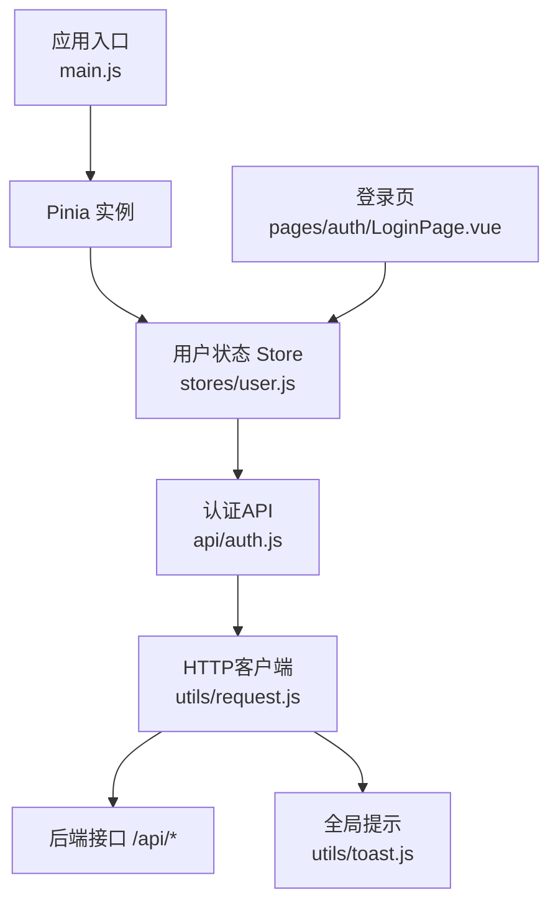
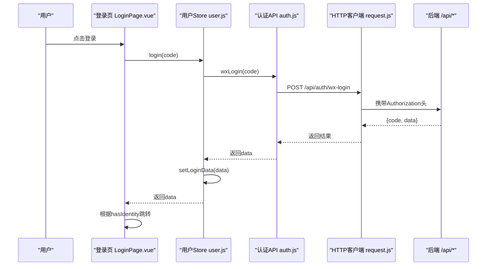
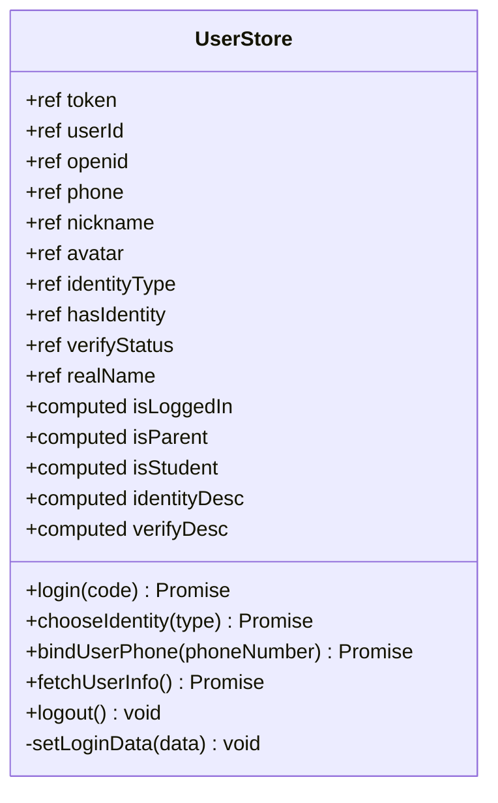
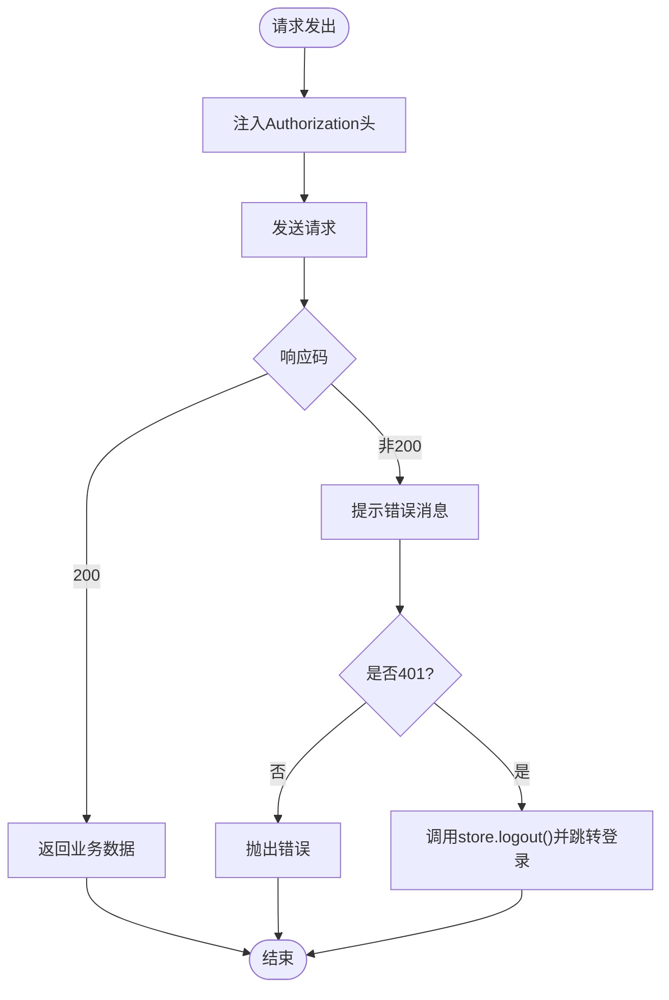
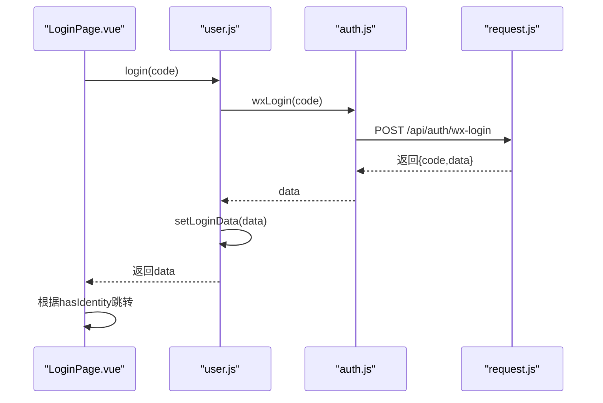
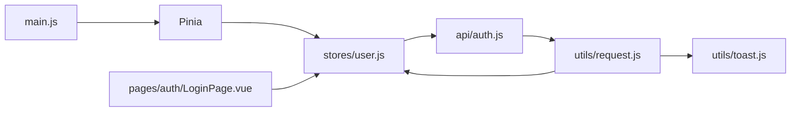

# 状态管理

<cite>
**本文引用的文件**
- [main.js](file://wzoto-frontend/src/main.js)
- [package.json](file://wzoto-frontend/package.json)
- [user.js](file://wzoto-frontend/src/stores/user.js)
- [auth.js](file://wzoto-frontend/src/api/auth.js)
- [request.js](file://wzoto-frontend/src/utils/request.js)
- [LoginPage.vue](file://wzoto-frontend/src/pages/auth/LoginPage.vue)
- [toast.js](file://wzoto-frontend/src/utils/toast.js)
- [auto-test.mjs](file://wzoto-frontend/tests/auto-test.mjs)
</cite>

## 目录
1. [简介](#简介)
2. [项目结构](#项目结构)
3. [核心组件](#核心组件)
4. [架构总览](#架构总览)
5. [详细组件分析](#详细组件分析)
6. [依赖关系分析](#依赖关系分析)
7. [性能与优化](#性能与优化)
8. [故障排查指南](#故障排查指南)
9. [结论](#结论)
10. [附录：测试与实践](#附录测试与实践)

## 简介
本文件系统性梳理 wzoto 前端的状态管理方案，聚焦 Pinia 的使用与设计模式。围绕用户态 Store 的架构设计、响应式状态定义、计算属性、动作方法、持久化策略、数据流（单向流、异步更新、错误处理、同步机制）、性能优化与调试、以及端到端测试实践展开说明，帮助读者快速理解并扩展该项目的状态管理体系。

## 项目结构
- 应用入口初始化 Pinia，并在路由与 UI 框架之前挂载，确保全局可用。
- 状态按领域拆分，当前已实现用户域 Store；后续可按业务域继续扩展。
- API 层统一封装请求与拦截器，自动注入鉴权令牌并集中处理错误。
- 页面通过调用 Store 的动作完成登录、身份选择、绑定手机、拉取用户信息等流程。

图表来源
- [main.js:1-17](file://wzoto-frontend/src/main.js#L1-L17)
- [user.js:1-126](file://wzoto-frontend/src/stores/user.js#L1-L126)
- [auth.js:1-30](file://wzoto-frontend/src/api/auth.js#L1-L30)
- [request.js:1-59](file://wzoto-frontend/src/utils/request.js#L1-L59)
- [LoginPage.vue:70-172](file://wzoto-frontend/src/pages/auth/LoginPage.vue#L70-L172)
- [toast.js:1-14](file://wzoto-frontend/src/utils/toast.js#L1-L14)

章节来源
- [main.js:1-17](file://wzoto-frontend/src/main.js#L1-L17)
- [package.json:11-20](file://wzoto-frontend/package.json#L11-L20)

## 核心组件
- 用户状态 Store（stores/user.js）
  - 职责：维护登录态、用户信息、身份类型、认证状态等；提供登录、选择身份、绑定手机、拉取用户信息、退出登录等动作。
  - 特点：使用 ref 定义响应式状态，computed 派生布尔与描述字段；内部 setLoginData 统一写入，避免重复逻辑。
- HTTP 客户端（utils/request.js）
  - 职责：基于 axios 创建实例；请求拦截器自动注入 Authorization；响应拦截器统一处理业务码与 401 未登录跳转；失败时通过 toast 提示。
  - 与 Store 的关系：Store 中的动作直接调用 API，错误由拦截器统一处理，Store 仅关注成功路径。
- 认证 API（api/auth.js）
  - 职责：封装微信登录、选择身份、绑定手机、获取用户信息等接口。
- 登录页（pages/auth/LoginPage.vue）
  - 职责：触发登录流程，根据返回的用户状态决定跳转；开发环境支持快捷登录。
- 全局提示（utils/toast.js）
  - 职责：轻量级消息提示，被 request 拦截器在错误场景调用。

章节来源
- [user.js:1-126](file://wzoto-frontend/src/stores/user.js#L1-L126)
- [request.js:1-59](file://wzoto-frontend/src/utils/request.js#L1-L59)
- [auth.js:1-30](file://wzoto-frontend/src/api/auth.js#L1-L30)
- [LoginPage.vue:70-172](file://wzoto-frontend/src/pages/auth/LoginPage.vue#L70-L172)
- [toast.js:1-14](file://wzoto-frontend/src/utils/toast.js#L1-L14)

## 架构总览
下图展示从页面到 Store、再到 API 与后端的完整调用链，体现“单向数据流”和“集中式错误处理”。

图表来源
- [LoginPage.vue:70-172](file://wzoto-frontend/src/pages/auth/LoginPage.vue#L70-L172)
- [user.js:31-51](file://wzoto-frontend/src/stores/user.js#L31-L51)
- [auth.js:1-30](file://wzoto-frontend/src/api/auth.js#L1-L30)
- [request.js:13-39](file://wzoto-frontend/src/utils/request.js#L13-L39)

## 详细组件分析

### 用户状态 Store（stores/user.js）
- 状态设计
  - 基础信息：token、userId、openid、phone、nickname、avatar
  - 身份与认证：identityType、hasIdentity、verifyStatus、realName
  - 持久化：token 初始值来自 localStorage，登出时移除
- 计算属性
  - isLoggedIn：是否已登录
  - isParent/isStudent：角色判断
  - identityDesc/verifyDesc：面向UI的描述文本
- 动作方法
  - login：调用微信登录，成功后统一写入状态
  - chooseIdentity：选择身份并刷新状态
  - bindUserPhone：绑定手机号并更新本地 phone
  - fetchUserInfo：拉取当前用户信息，填充各字段
  - logout：清空所有状态并移除 token
- 内部方法
  - setLoginData：集中写入 token、用户信息与身份相关字段，保证一致性

图表来源
- [user.js:1-126](file://wzoto-frontend/src/stores/user.js#L1-L126)

章节来源
- [user.js:1-126](file://wzoto-frontend/src/stores/user.js#L1-L126)

### HTTP 客户端与错误处理（utils/request.js）
- 请求拦截器
  - 自动读取当前 Store 的 token 并注入 Authorization 头
- 响应拦截器
  - 统一校验业务码，非 200 时提示并拒绝 Promise
  - 401 未登录：调用 Store 的 logout 并跳转到登录页
- 网络异常
  - 捕获并提示网络错误

图表来源
- [request.js:13-55](file://wzoto-frontend/src/utils/request.js#L13-L55)
- [user.js:87-102](file://wzoto-frontend/src/stores/user.js#L87-L102)

章节来源
- [request.js:1-59](file://wzoto-frontend/src/utils/request.js#L1-59)
- [toast.js:1-14](file://wzoto-frontend/src/utils/toast.js#L1-14)

### 登录流程（LoginPage.vue + user.js）
- 页面侧：收集 code（或开发模式模拟），调用 store.login
- Store 侧：调用认证 API，成功后统一写入状态
- 路由侧：根据 hasIdentity 决定是否进入身份选择页

图表来源
- [LoginPage.vue:70-172](file://wzoto-frontend/src/pages/auth/LoginPage.vue#L70-L172)
- [user.js:31-51](file://wzoto-frontend/src/stores/user.js#L31-L51)
- [auth.js:1-30](file://wzoto-frontend/src/api/auth.js#L1-L30)
- [request.js:13-39](file://wzoto-frontend/src/utils/request.js#L13-L39)

章节来源
- [LoginPage.vue:70-172](file://wzoto-frontend/src/pages/auth/LoginPage.vue#L70-L172)
- [user.js:31-51](file://wzoto-frontend/src/stores/user.js#L31-L51)

### 数据流与同步机制
- 单向数据流：页面调用 Store 动作 → Store 调用 API → 更新状态 → 视图自动响应
- 异步更新：所有涉及网络的动作为 async，调用方 await 后再做路由跳转或提示
- 错误处理：集中在 request 拦截器，Store 不分散 try/catch，简化调用方逻辑
- 状态同步：setLoginData 统一写入，避免多处赋值导致不一致

章节来源
- [user.js:31-117](file://wzoto-frontend/src/stores/user.js#L31-L117)
- [request.js:13-55](file://wzoto-frontend/src/utils/request.js#L13-L55)

## 依赖关系分析
- 应用启动阶段：main.js 创建并安装 Pinia，使 useUserStore 可在任意模块使用
- 运行时依赖：
  - Store 依赖 api/auth.js 提供的接口函数
  - api/auth.js 依赖 utils/request.js 进行网络请求
  - request.js 依赖 stores/user.js 获取 token
  - 登录页依赖 user.js 执行登录流程
  - 错误提示依赖 utils/toast.js

图表来源
- [main.js:1-17](file://wzoto-frontend/src/main.js#L1-L17)
- [user.js:1-126](file://wzoto-frontend/src/stores/user.js#L1-L126)
- [auth.js:1-30](file://wzoto-frontend/src/api/auth.js#L1-L30)
- [request.js:1-59](file://wzoto-frontend/src/utils/request.js#L1-L59)
- [LoginPage.vue:70-172](file://wzoto-frontend/src/pages/auth/LoginPage.vue#L70-L172)
- [toast.js:1-14](file://wzoto-frontend/src/utils/toast.js#L1-L14)

章节来源
- [package.json:11-20](file://wzoto-frontend/package.json#L11-L20)

## 性能与优化
- 状态拆分原则
  - 将用户态独立为单独 Store，便于复用与测试；未来可继续拆分为学习、预约等业务 Store
- 计算属性优先
  - 对派生状态（如是否登录、角色、描述文案）使用 computed，减少模板中复杂表达式
- 最小化重渲染
  - 仅在必要处更新状态；setLoginData 集中写入，避免多次局部更新
- 内存管理
  - 退出登录时清空敏感信息（token、用户信息），降低内存占用
- 调试工具
  - 使用浏览器开发者工具的 Pinia Devtools 查看状态变化与动作调用
  - 结合 request 拦截器的日志输出定位网络问题

[本节为通用指导，不直接引用具体代码]

## 故障排查指南
- 401 未登录
  - 现象：请求返回 401 后自动跳转登录页
  - 原因：token 过期或缺失
  - 处理：检查 request 拦截器与 user.store.logout 调用链路
- 网络错误
  - 现象：提示网络连接失败
  - 原因：无网络或服务不可达
  - 处理：检查网络与服务端可用性
- 登录成功但状态未更新
  - 现象：页面未跳转或显示未登录
  - 原因：未正确调用 setLoginData 或 token 未持久化
  - 处理：确认 user.js 中 setLoginData 与 localStorage 操作

章节来源
- [request.js:25-55](file://wzoto-frontend/src/utils/request.js#L25-L55)
- [user.js:87-117](file://wzoto-frontend/src/stores/user.js#L87-L117)

## 结论
本项目采用 Pinia 构建轻量、清晰的前端状态管理方案。用户态 Store 负责登录、身份与用户信息的统一管理，配合统一的 HTTP 客户端与错误处理，形成稳定的单向数据流。通过计算属性、集中写入与持久化策略，保证了状态的一致性与可维护性。后续可按业务域继续扩展更多 Store，并保持相同的组织与规范。

## 附录：测试与实践
- 端到端自动化测试
  - 使用 Playwright 驱动 Chromium，访问本地前端与后端服务
  - 通过直接调用后端 dev-login 接口获取 token，并写入 localStorage，模拟登录态
  - 依次访问各页面并截图，生成自动化报告
- 建议补充单元测试
  - 针对 user Store 的动作（login、chooseIdentity、bindUserPhone、fetchUserInfo、logout）编写用例
  - Mock API 响应，验证状态变更与边界条件
  - 验证 401 场景下是否正确触发登出与跳转

章节来源
- [auto-test.mjs:1-366](file://wzoto-frontend/tests/auto-test.mjs#L1-L366)