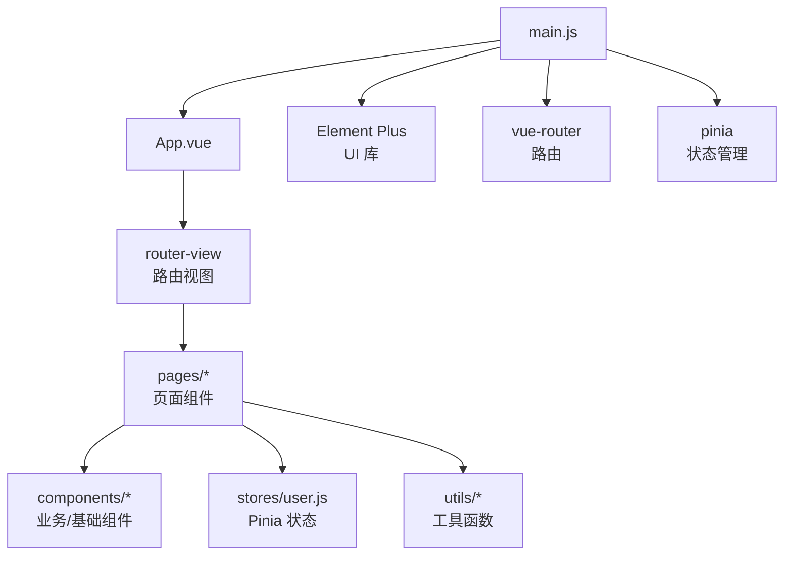
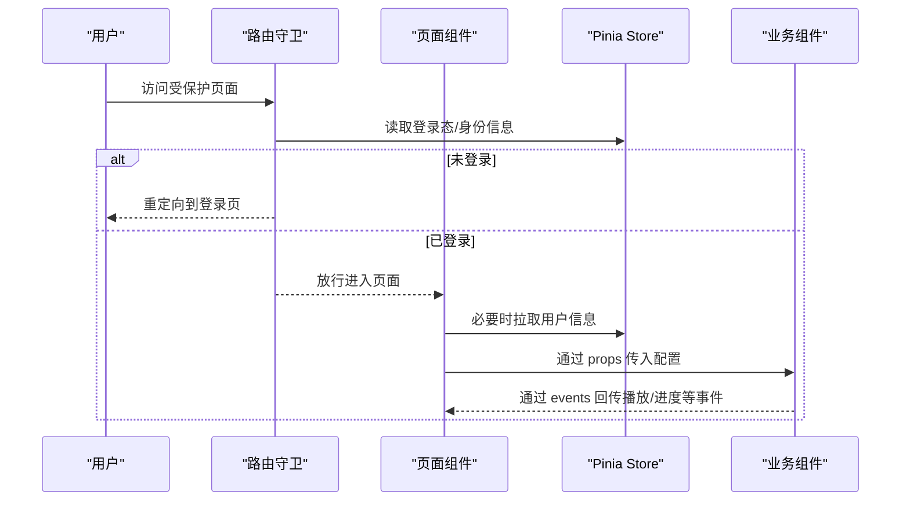
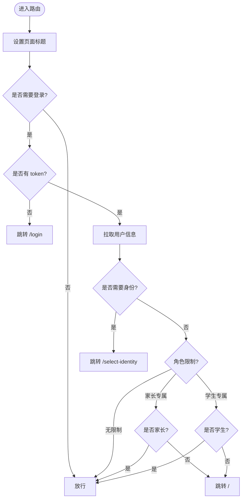
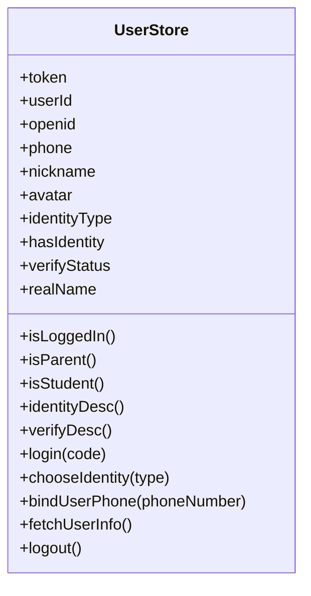
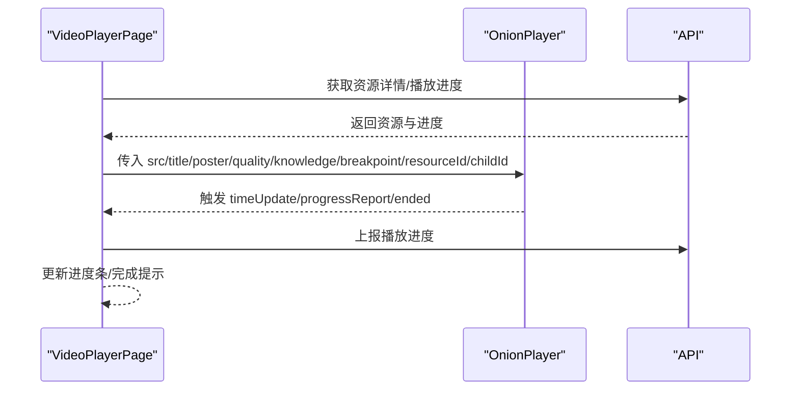
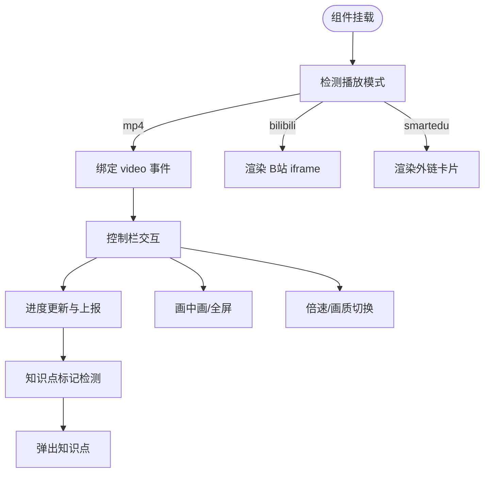
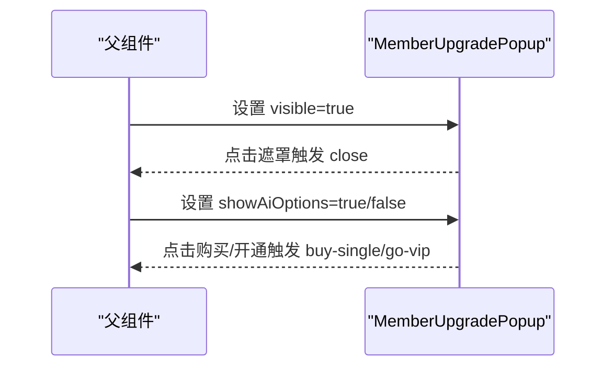
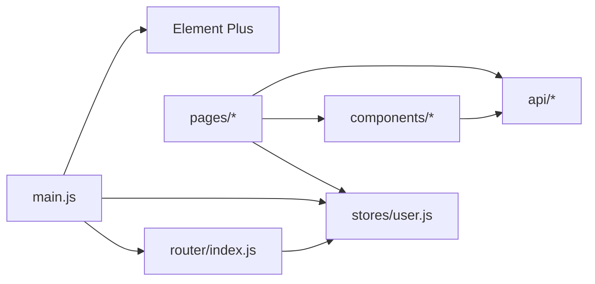

# 组件架构设计

<cite>
**本文引用的文件**
- [App.vue](file://wzoto-frontend/src/App.vue)
- [main.js](file://wzoto-frontend/src/main.js)
- [index.js（路由）](file://wzoto-frontend/src/router/index.js)
- [user.js（Pinia Store）](file://wzoto-frontend/src/stores/user.js)
- [OnionPlayer.vue](file://wzoto-frontend/src/components/OnionPlayer.vue)
- [MemberUpgradePopup.vue](file://wzoto-frontend/src/components/MemberUpgradePopup.vue)
- [VideoPlayerPage.vue](file://wzoto-frontend/src/pages/learning/VideoPlayerPage.vue)
- [HomePage.vue](file://wzoto-frontend/src/pages/home/HomePage.vue)
- [package.json](file://wzoto-frontend/package.json)
</cite>

## 目录
1. [简介](#简介)
2. [项目结构](#项目结构)
3. [核心组件](#核心组件)
4. [架构总览](#架构总览)
5. [详细组件分析](#详细组件分析)
6. [依赖关系分析](#依赖关系分析)
7. [性能考虑](#性能考虑)
8. [故障排查指南](#故障排查指南)
9. [结论](#结论)
10. [附录：开发规范与最佳实践](#附录开发规范与最佳实践)

## 简介
本文件面向 wzoto 前端项目的组件架构设计与实现，聚焦 Vue 3 组合式 API、组件分层策略、复用机制、状态管理、生命周期与性能优化。文档以实际代码为依据，结合 OnionPlayer 视频播放器与 MemberUpgradePopup 会员升级弹窗等核心组件进行深入剖析，并给出可落地的开发规范与测试建议。

## 项目结构
- 入口与全局配置
  - main.js：创建应用实例，挂载 Pinia、Vue Router、Element Plus 及全局样式。
  - App.vue：根组件，提供 Element Plus 中文语言包配置，并通过 router-view 渲染页面。
- 路由
  - src/router/index.js：集中定义路由表与前置守卫，处理登录态、身份校验、家长/学生专属页面跳转。
- 状态管理
  - src/stores/user.js：基于 Pinia 的用户状态与鉴权流程，封装登录、选择身份、绑定手机、拉取用户信息、登出等操作。
- 页面与组件
  - pages：页面级组件，按业务域划分（学习、学生端、认证、AI、预约等）。
  - components：通用业务组件与基础组件（如视频播放器、弹窗）。
  - utils：工具函数（请求封装、格式化、提示、埋点）。
  - assets/styles：全局样式。

图表来源
- [main.js:1-17](file://wzoto-frontend/src/main.js#L1-L17)
- [App.vue:1-10](file://wzoto-frontend/src/App.vue#L1-L10)
- [index.js（路由）:1-250](file://wzoto-frontend/src/router/index.js#L1-L250)

章节来源
- [main.js:1-17](file://wzoto-frontend/src/main.js#L1-L17)
- [App.vue:1-10](file://wzoto-frontend/src/App.vue#L1-L10)
- [index.js（路由）:1-250](file://wzoto-frontend/src/router/index.js#L1-L250)

## 核心组件
- 根组件 App.vue
  - 职责：注入 Element Plus 中文语言包；承载路由视图。
  - 设计要点：保持极简，避免在根组件中放置业务逻辑。
- 页面级组件
  - HomePage.vue：展示用户信息与功能入口，根据身份（家长/学生）显示不同卡片。
  - VideoPlayerPage.vue：聚合资源详情、播放进度、完成反馈，调用业务组件进行播放。
- 业务组件
  - OnionPlayer.vue：多模式视频播放器（MP4/B站 iframe/外链），内置控制栏、知识点标记、断点续播、进度上报等。
  - MemberUpgradePopup.vue：会员升级弹窗，支持普通购买与 AI 报告双选项场景。
- 基础组件
  - 本项目使用 Element Plus 作为 UI 基础组件库，并在根层统一配置语言与主题。

章节来源
- [App.vue:1-10](file://wzoto-frontend/src/App.vue#L1-L10)
- [HomePage.vue:1-202](file://wzoto-frontend/src/pages/home/HomePage.vue#L1-L202)
- [VideoPlayerPage.vue:1-321](file://wzoto-frontend/src/pages/learning/VideoPlayerPage.vue#L1-L321)
- [OnionPlayer.vue:1-888](file://wzoto-frontend/src/components/OnionPlayer.vue#L1-L888)
- [MemberUpgradePopup.vue:1-164](file://wzoto-frontend/src/components/MemberUpgradePopup.vue#L1-L164)

## 架构总览
- 分层策略
  - 根层：App.vue + main.js 负责框架装配与全局配置。
  - 路由层：集中式路由与守卫，统一鉴权与身份校验。
  - 页面层：按业务域组织，关注数据获取、状态编排与交互流程。
  - 组件层：按“业务组件”和“基础组件”拆分，强调单一职责与高内聚。
- 通信模式
  - props 向下传递配置与数据。
  - events 向上传递用户行为与播放事件。
  - provide/inject：当前未显式使用，可在跨层级共享轻量上下文时引入。
  - 插槽：当前组件未大量使用插槽，建议在需要高度定制化的容器组件中引入。
- 状态管理
  - 局部状态：组件内部 ref/reactive 管理 UI 状态（如播放进度、菜单显隐）。
  - 全局状态：Pinia user store 管理登录态、身份信息、认证状态等。
  - 划分原则：跨组件共享且需持久化或路由间复用的状态放入 store；仅单组件使用的状态留在组件内。

图表来源
- [index.js（路由）:197-247](file://wzoto-frontend/src/router/index.js#L197-L247)
- [user.js:1-126](file://wzoto-frontend/src/stores/user.js#L1-L126)
- [VideoPlayerPage.vue:80-186](file://wzoto-frontend/src/pages/learning/VideoPlayerPage.vue#L80-L186)
- [OnionPlayer.vue:164-537](file://wzoto-frontend/src/components/OnionPlayer.vue#L164-L537)

## 详细组件分析

### 根组件与入口
- App.vue
  - 使用 Element Plus 的 ConfigProvider 注入中文语言包，确保全局组件文案一致。
  - 通过 router-view 渲染路由匹配的页面组件，保持根组件职责单一。
- main.js
  - 初始化应用，注册 Pinia、Router、Element Plus，并挂载全局样式。
  - 遵循最小侵入原则，不在此处放置业务逻辑。

章节来源
- [App.vue:1-10](file://wzoto-frontend/src/App.vue#L1-L10)
- [main.js:1-17](file://wzoto-frontend/src/main.js#L1-L17)

### 路由与鉴权
- 路由表
  - 集中定义所有页面路由，包含 meta 字段描述标题、是否需要登录、是否家长/学生专属等。
- 前置守卫
  - 设置页面标题。
  - 未登录且非免登页面则跳转登录。
  - 首次进入时按需拉取用户信息。
  - 未选择身份则跳转身份选择页。
  - 家长/学生专属页面进行角色校验。

图表来源
- [index.js（路由）:197-247](file://wzoto-frontend/src/router/index.js#L197-L247)

章节来源
- [index.js（路由）:1-250](file://wzoto-frontend/src/router/index.js#L1-L250)

### 状态管理（Pinia）
- user store
  - 状态：token、userId、openid、phone、nickname、avatar、identityType、hasIdentity、verifyStatus、realName。
  - 计算属性：isLoggedIn、isParent、isStudent、identityDesc、verifyDesc。
  - Actions：微信登录、选择身份、绑定手机、拉取用户信息、退出登录。
  - 持久化：token 写入 localStorage，刷新后恢复登录态。
- 使用方式
  - 路由守卫与页面组件通过 useUserStore 访问状态与方法，保证鉴权与身份判断的一致性。

图表来源
- [user.js:1-126](file://wzoto-frontend/src/stores/user.js#L1-L126)

章节来源
- [user.js:1-126](file://wzoto-frontend/src/stores/user.js#L1-L126)

### 页面级组件
- HomePage.vue
  - 展示用户头像、昵称、身份标签与认证状态。
  - 根据 isParent/isStudent 动态展示功能入口卡片。
  - 提供退出登录与去认证引导。
- VideoPlayerPage.vue
  - 加载资源详情与播放进度，组装参数传递给 OnionPlayer。
  - 监听播放器的 progress-report、ended、loaded-metadata 事件，更新进度与完成态。
  - 错误与加载骨架屏提升用户体验。

图表来源
- [VideoPlayerPage.vue:80-186](file://wzoto-frontend/src/pages/learning/VideoPlayerPage.vue#L80-L186)
- [OnionPlayer.vue:164-537](file://wzoto-frontend/src/components/OnionPlayer.vue#L164-L537)

章节来源
- [HomePage.vue:1-202](file://wzoto-frontend/src/pages/home/HomePage.vue#L1-L202)
- [VideoPlayerPage.vue:1-321](file://wzoto-frontend/src/pages/learning/VideoPlayerPage.vue#L1-L321)

### 业务组件：OnionPlayer 视频播放器
- 设计目标
  - 统一封装 MP4/B站 iframe/外链三种播放模式。
  - 提供完整控制栏（播放/暂停、进度拖拽、倍速、画质切换、画中画、全屏、字幕开关）。
  - 支持知识点标记与断点续播，定时上报播放进度。
- 关键实现
  - 模式检测：根据 URL 特征自动选择 mp4/bilibili/smartedu/empty。
  - 播放控制：原生 video 事件驱动，维护 isPlaying/currentTime/duration/bufferedPercent/playedPercent 等响应式状态。
  - 进度上报：每 5 秒 emit progressReport，携带 resourceId、childId、currentTime、duration、percent。
  - 知识点标记：解析 knowledgeMarkers，时间轴上打点，到达阈值弹出知识点说明。
  - 画质切换：解析 qualityLevels，切换 currentSrc 并恢复播放位置。
  - 键盘快捷键：空格/K 播放暂停，方向键快进快退/音量调节，F 全屏，M 静音。
  - 生命周期：onMounted 绑定事件与定时器，onBeforeUnmount 清理监听器与定时器，避免内存泄漏。
  - 对外暴露：defineExpose 暴露 play/pause/seekTo/getCurrentTime/getDuration，便于父组件控制。
- 组件通信
  - props：src/title/poster/subtitleUrl/qualityLevels/knowledgeMarkers/breakpointSeconds/resourceId/childId。
  - events：play/pause/ended/timeUpdate/progressReport/loadedMetadata。
  - 插槽：当前未使用，可在未来扩展自定义控制区时使用。
- 性能优化
  - 使用 computed 缓存解析结果（qualityOptions/knowledgeMarkers）。
  - 仅在播放时启动进度上报定时器，暂停时停止。
  - 使用 nextTick 切换画质后恢复播放，减少闪烁。
  - 事件监听在卸载时移除，防止重复绑定。

图表来源
- [OnionPlayer.vue:164-537](file://wzoto-frontend/src/components/OnionPlayer.vue#L164-L537)

章节来源
- [OnionPlayer.vue:1-888](file://wzoto-frontend/src/components/OnionPlayer.vue#L1-L888)

### 业务组件：MemberUpgradePopup 会员升级弹窗
- 设计目标
  - 统一展示会员权益、价格方案与行动按钮。
  - 支持普通购买与 AI 报告双选项场景。
- 关键实现
  - props：visible/featureName/features/isParent/showAiOptions。
  - events：close/go-vip/buy-single。
  - 交互：点击遮罩关闭；根据 showAiOptions 切换双选项卡片；确认后触发 go-vip 或 buy-single。
- 复用策略
  - 通过 props 控制内容，通过 events 通知父组件，适合多处复用（学习资源、AI 功能等）。
- 可扩展性
  - 可引入插槽用于自定义头部/底部区域。
  - 可接入支付流程与埋点。

图表来源
- [MemberUpgradePopup.vue:1-164](file://wzoto-frontend/src/components/MemberUpgradePopup.vue#L1-L164)

章节来源
- [MemberUpgradePopup.vue:1-164](file://wzoto-frontend/src/components/MemberUpgradePopup.vue#L1-L164)

## 依赖关系分析
- 外部依赖
  - Vue 3、Vue Router、Pinia、Element Plus、Axios、ECharts、Sass。
- 模块耦合
  - 页面组件依赖 Pinia 与 API，通过 props/events 与业务组件解耦。
  - 路由守卫依赖 user store，实现统一的鉴权与身份校验。
  - 业务组件通过 defineProps/defineEmits 明确接口契约，降低耦合度。
- 潜在风险
  - 若业务组件内部直接操作 DOM 或全局状态，可能破坏可测试性与可维护性。
  - 建议在复杂交互中引入更清晰的指令或工具函数，避免在组件内散落过多副作用。

图表来源
- [index.js（路由）:1-250](file://wzoto-frontend/src/router/index.js#L1-L250)
- [user.js:1-126](file://wzoto-frontend/src/stores/user.js#L1-L126)
- [package.json:1-27](file://wzoto-frontend/package.json#L1-L27)

章节来源
- [package.json:1-27](file://wzoto-frontend/package.json#L1-L27)
- [index.js（路由）:1-250](file://wzoto-frontend/src/router/index.js#L1-L250)
- [user.js:1-126](file://wzoto-frontend/src/stores/user.js#L1-L126)

## 性能考虑
- 渲染优化
  - 使用 computed 缓存解析结果（如画质列表、知识点标记）。
  - 条件渲染与过渡动画减少不必要的重绘。
- 事件与定时器
  - 仅在播放时启动进度上报定时器，暂停或离开时清理。
  - 键盘与全屏事件在卸载时移除，避免内存泄漏。
- 网络与资源
  - 视频资源按需加载，poster 预加载元数据。
  - 外链模式避免无效渲染，减少 iframe 开销。
- 状态粒度
  - 将频繁更新的局部状态（如 currentTime）保持在组件内，避免全局状态风暴。
  - 跨组件共享的状态（如登录态、身份）放入 Pinia，减少 prop drilling。

[本节为通用指导，不直接分析具体文件]

## 故障排查指南
- 视频无法播放
  - 检查 src 是否为空或格式不被支持。
  - 确认 mode 检测结果是否符合预期（mp4/bilibili/smartedu）。
  - 查看 onError 日志与浏览器控制台 CORS/权限问题。
- 进度不上报
  - 确认 resourceId/childId 是否正确传入。
  - 检查是否在播放时启动定时器，以及父组件是否监听 progressReport。
- 知识点标记不生效
  - 检查 knowledgeMarkers 数据结构是否包含 time 字段。
  - 确认 onTimeUpdate 是否被触发，以及阈值判断逻辑。
- 弹窗无法关闭
  - 检查 visible 是否由父组件正确控制。
  - 确认 close 事件是否被父组件监听并更新状态。

章节来源
- [OnionPlayer.vue:164-537](file://wzoto-frontend/src/components/OnionPlayer.vue#L164-L537)
- [MemberUpgradePopup.vue:1-164](file://wzoto-frontend/src/components/MemberUpgradePopup.vue#L1-L164)

## 结论
wzoto 前端采用清晰的组件分层与明确的通信契约，结合 Pinia 进行全局状态管理，满足多角色、多场景的业务需求。OnionPlayer 与 MemberUpgradePopup 展示了高内聚、低耦合的组件设计范式。后续可在更多容器组件中引入插槽与 provide/inject，进一步提升灵活性与可维护性。

[本节为总结性内容，不直接分析具体文件]

## 附录：开发规范与最佳实践
- 命名约定
  - 组件文件使用 PascalCase（如 OnionPlayer.vue、MemberUpgradePopup.vue）。
  - 页面组件按业务域分目录（pages/learning、pages/student 等）。
  - 变量与函数使用 camelCase，常量使用 UPPER_SNAKE_CASE。
- 文件组织
  - 每个组件独立文件，模板、脚本、样式分离但同文件内组织。
  - 工具函数集中在 utils，API 集中在 api，状态集中在 stores。
- 代码注释
  - 对复杂逻辑（如模式检测、知识点标记、画质切换）添加行内注释。
  - 对外暴露的方法与事件提供清晰说明。
- 测试策略
  - 单元测试：对工具函数与纯函数进行测试（如 formatTime、mode 检测）。
  - 组件测试：使用 Vue Test Utils 模拟 props/events，验证渲染与交互。
  - 端到端测试：使用 Playwright 覆盖关键用户流程（登录、播放、完成）。
- 组件复用与通信
  - 优先使用 props/events 进行父子通信；跨层级共享轻量上下文可使用 provide/inject。
  - 插槽用于需要高度定制的容器组件，保持默认体验的同时允许扩展。
- 生命周期与性能
  - 在 onMounted 中绑定事件与定时器，在 onBeforeUnmount 中清理。
  - 使用 computed 缓存计算结果，避免重复计算。
  - 合理使用 v-if/v-show，减少不必要的渲染。

[本节为通用指导，不直接分析具体文件]