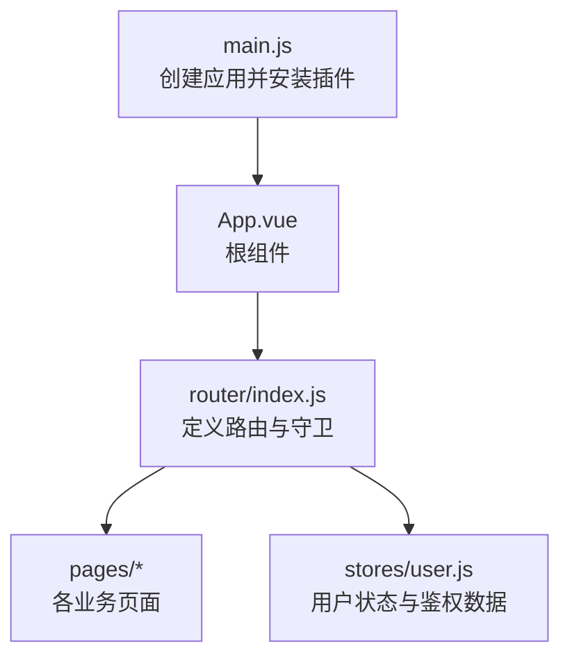
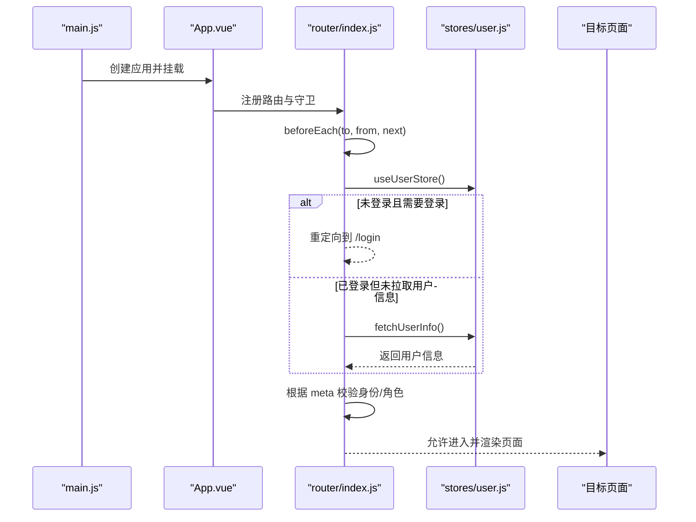
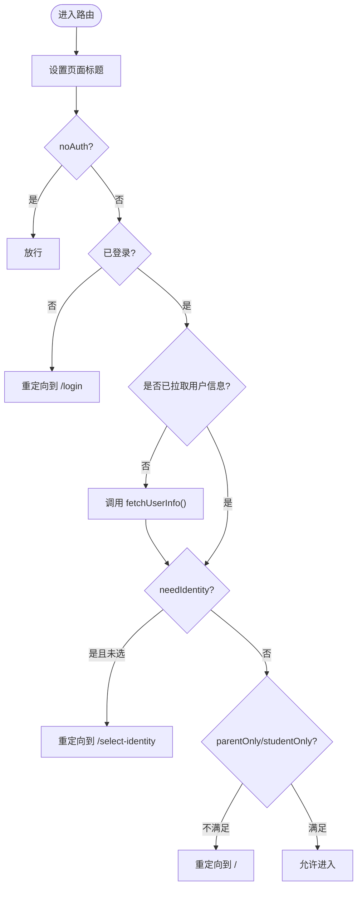
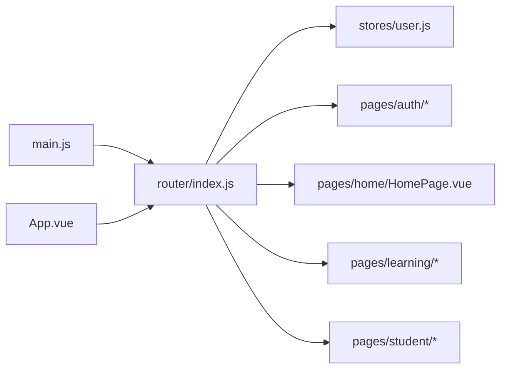

# 路由设计

<cite>
**本文引用的文件**
- [wzoto-frontend/src/router/index.js](file://wzoto-frontend/src/router/index.js)
- [wzoto-frontend/src/main.js](file://wzoto-frontend/src/main.js)
- [wzoto-frontend/src/App.vue](file://wzoto-frontend/src/App.vue)
- [wzoto-frontend/src/stores/user.js](file://wzoto-frontend/src/stores/user.js)
- [wzoto-frontend/src/pages/auth/LoginPage.vue](file://wzoto-frontend/src/pages/auth/LoginPage.vue)
- [wzoto-frontend/src/pages/home/HomePage.vue](file://wzoto-frontend/src/pages/home/HomePage.vue)
- [wzoto-frontend/src/pages/learning/CourseDirectoryPage.vue](file://wzoto-frontend/src/pages/learning/CourseDirectoryPage.vue)
</cite>

## 目录
1. [简介](#简介)
2. [项目结构](#项目结构)
3. [核心组件](#核心组件)
4. [架构总览](#架构总览)
5. [详细组件分析](#详细组件分析)
6. [依赖关系分析](#依赖关系分析)
7. [性能考虑](#性能考虑)
8. [故障排查指南](#故障排查指南)
9. [结论](#结论)
10. [附录](#附录)

## 简介
本文件系统性梳理 wzoto 前端的路由设计与实现，覆盖 Vue Router 的配置与使用、页面路由规划、嵌套路由设计、动态参数处理、路由守卫（全局前置守卫）与权限控制、懒加载与首屏优化、meta 元信息设计、以及编程式与声明式导航策略。文档同时给出认证路由、学习模块路由与学生端路由的实际示例分析，帮助读者快速理解并扩展该项目的路由体系。

## 项目结构
前端基于 Vue 3 + Vite，使用 Vue Router 管理页面路由，Pinia 管理用户状态，Element Plus 提供 UI 组件。路由入口在 router/index.js，应用挂载在 main.js，根视图在 App.vue 中通过 <router-view /> 渲染。

图表来源
- [wzoto-frontend/src/main.js:1-17](file://wzoto-frontend/src/main.js#L1-L17)
- [wzoto-frontend/src/App.vue:1-10](file://wzoto-frontend/src/App.vue#L1-L10)
- [wzoto-frontend/src/router/index.js:1-250](file://wzoto-frontend/src/router/index.js#L1-L250)
- [wzoto-frontend/src/stores/user.js:1-126](file://wzoto-frontend/src/stores/user.js#L1-L126)

章节来源
- [wzoto-frontend/src/main.js:1-17](file://wzoto-frontend/src/main.js#L1-L17)
- [wzoto-frontend/src/App.vue:1-10](file://wzoto-frontend/src/App.vue#L1-L10)
- [wzoto-frontend/src/router/index.js:1-250](file://wzoto-frontend/src/router/index.js#L1-L250)

## 核心组件
- 路由配置与守卫：集中定义所有页面路由、懒加载组件、meta 元信息与全局前置守卫逻辑。
- 用户状态：统一维护登录态、身份类型、是否已选择身份等，供路由守卫进行权限判断。
- 页面组件：按功能域划分（auth、home、learning、student 等），通过路由进行组织。

章节来源
- [wzoto-frontend/src/router/index.js:1-250](file://wzoto-frontend/src/router/index.js#L1-L250)
- [wzoto-frontend/src/stores/user.js:1-126](file://wzoto-frontend/src/stores/user.js#L1-L126)

## 架构总览
下图展示了从应用启动到页面渲染的完整流程，包括路由初始化、全局守卫执行、用户状态获取与权限校验、最终渲染目标页面。

图表来源
- [wzoto-frontend/src/main.js:1-17](file://wzoto-frontend/src/main.js#L1-L17)
- [wzoto-frontend/src/App.vue:1-10](file://wzoto-frontend/src/App.vue#L1-L10)
- [wzoto-frontend/src/router/index.js:192-247](file://wzoto-frontend/src/router/index.js#L192-L247)
- [wzoto-frontend/src/stores/user.js:67-85](file://wzoto-frontend/src/stores/user.js#L67-L85)

## 详细组件分析

### 路由结构与页面规划
- 认证相关：/login、/select-identity、/bind-phone、/verify
- 首页：/
- 家长端学习模块：/learning/*（学习计划、任务、报告、资源、课程目录、视频播放、时长管控、错题本、AI答疑、成长激励等）
- 学生端：/student/*（学习中心、课程专区、专项练习、AI答疑、错题本、口语跟读、作文批改）
- 其他：预约列表、找教员、AI学情诊断、AI教员助手、增值功能等

路由采用扁平化命名空间，以路径前缀区分模块；所有组件均使用函数式 import 实现按需加载，利于代码分割与首屏优化。

章节来源
- [wzoto-frontend/src/router/index.js:4-190](file://wzoto-frontend/src/router/index.js#L4-L190)

### 嵌套路由与模块化组织
当前路由以“路径前缀”划分模块，未使用 Vue Router 的 children 嵌套形式。这种设计便于按模块拆分文件与维护，但需注意：
- 若后续需要共享布局或子级路由，可引入 children 嵌套，将公共头部/侧边栏抽离为布局组件。
- 当前每个页面均为独立路由，适合移动端单页应用，减少布局复杂度。

章节来源
- [wzoto-frontend/src/router/index.js:4-190](file://wzoto-frontend/src/router/index.js#L4-L190)

### 动态路由参数处理
- 当前路由未使用路径参数（params），主要使用 query 参数进行页面内筛选与初始化。例如课程目录页通过 route.query.subject、route.query.grade 初始化学科与年级。
- 如需支持动态资源 ID（如 /course/:id），可在路由中定义 path: '/course/:id'，并在页面中使用 useRoute().value.params.id 读取。

章节来源
- [wzoto-frontend/src/pages/learning/CourseDirectoryPage.vue:175-222](file://wzoto-frontend/src/pages/learning/CourseDirectoryPage.vue#L175-L222)

### 路由守卫机制与权限控制
全局前置守卫负责：
- 设置页面标题：document.title = to.meta.title ? `${to.meta.title} - 学霸到家` : '学霸到家'
- 免登放行：noAuth 为 true 的页面直接放行（如登录页）
- 登录检查：未登录访问受保护页面时跳转 /login
- 用户信息拉取：首次进入时调用 fetchUserInfo 同步用户信息
- 身份检查：needIdentity 为 true 且未选择身份时跳转 /select-identity
- 角色限制：parentOnly/studentOnly 分别限制家长/学生专属页面

图表来源
- [wzoto-frontend/src/router/index.js:198-247](file://wzoto-frontend/src/router/index.js#L198-L247)
- [wzoto-frontend/src/stores/user.js:19-29](file://wzoto-frontend/src/stores/user.js#L19-L29)
- [wzoto-frontend/src/stores/user.js:67-85](file://wzoto-frontend/src/stores/user.js#L67-L85)

章节来源
- [wzoto-frontend/src/router/index.js:198-247](file://wzoto-frontend/src/router/index.js#L198-L247)
- [wzoto-frontend/src/stores/user.js:19-29](file://wzoto-frontend/src/stores/user.js#L19-L29)
- [wzoto-frontend/src/stores/user.js:67-85](file://wzoto-frontend/src/stores/user.js#L67-L85)

### 懒加载与首屏优化
- 所有页面组件均采用函数式 import 进行按需加载，实现路由级别代码分割，减少首屏包体积。
- 建议结合路由级别的预加载策略（如 prefetch）进一步优化体验。

章节来源
- [wzoto-frontend/src/router/index.js:4-190](file://wzoto-frontend/src/router/index.js#L4-L190)

### 路由元信息（meta）设计
- title：用于设置浏览器标签页标题
- noAuth：标记无需登录即可访问的页面
- needIdentity：要求用户已选择身份（家长/大学生）
- parentOnly/studentOnly：限定仅家长或仅学生可访问的页面

这些 meta 字段在全局守卫中被解析并驱动跳转逻辑，形成统一的权限控制模型。

章节来源
- [wzoto-frontend/src/router/index.js:4-190](file://wzoto-frontend/src/router/index.js#L4-L190)
- [wzoto-frontend/src/router/index.js:198-247](file://wzoto-frontend/src/router/index.js#L198-L247)

### 路由跳转策略
- 编程式导航：在组件中使用 useRouter() 提供的 push/replace 方法进行跳转，常用于登录后、绑定手机号后、退出登录等场景。
- 声明式导航：可通过 <router-link> 进行跳转（当前项目中更多使用编程式）。
- 路由传参：
  - Query 参数：适用于筛选、初始化等场景（如课程目录页通过 subject/grade 初始化）
  - Params 参数：适用于资源定位（如 /course/:id），需在路由中定义并配合 useRoute().value.params 读取

章节来源
- [wzoto-frontend/src/pages/auth/LoginPage.vue:158-172](file://wzoto-frontend/src/pages/auth/LoginPage.vue#L158-L172)
- [wzoto-frontend/src/pages/home/HomePage.vue:90-97](file://wzoto-frontend/src/pages/home/HomePage.vue#L90-L97)
- [wzoto-frontend/src/pages/learning/CourseDirectoryPage.vue:175-222](file://wzoto-frontend/src/pages/learning/CourseDirectoryPage.vue#L175-L222)

### 实际路由示例分析

#### 认证路由
- 登录页：/login，noAuth 为 true，允许未登录访问；登录后根据是否已选择身份跳转到 /select-identity 或 /
- 身份选择：/select-identity，needIdentity 为 false，用于引导用户选择身份
- 绑定手机：/bind-phone，完成后可跳转回首页
- 实名认证：/verify，needIdentity 为 true，要求已选择身份

章节来源
- [wzoto-frontend/src/router/index.js:4-28](file://wzoto-frontend/src/router/index.js#L4-L28)
- [wzoto-frontend/src/pages/auth/LoginPage.vue:158-172](file://wzoto-frontend/src/pages/auth/LoginPage.vue#L158-L172)

#### 学习模块路由
- 学习主页：/learning，家长专属（parentOnly）
- 子女管理、学习计划、学习任务、学情报告、学习资源、课程目录、视频播放、时长管控、错题本、AI答疑、成长激励等子页面均以 /learning/* 组织
- 课程目录页通过 query 参数初始化学科与年级，体现查询型参数用法

章节来源
- [wzoto-frontend/src/router/index.js:66-136](file://wzoto-frontend/src/router/index.js#L66-L136)
- [wzoto-frontend/src/pages/learning/CourseDirectoryPage.vue:175-222](file://wzoto-frontend/src/pages/learning/CourseDirectoryPage.vue#L175-L222)

#### 学生端路由
- 学习中心、课程专区、专项练习、AI答疑、错题本、口语跟读、作文批改等页面以 /student/* 组织
- 均需要身份且为家长专属（parentOnly）——注意此处 meta 标注与家长端一致，实际业务中应根据需求调整 role 标识

章节来源
- [wzoto-frontend/src/router/index.js:138-179](file://wzoto-frontend/src/router/index.js#L138-L179)

## 依赖关系分析
- 路由与状态：路由守卫依赖 Pinia 的用户状态（isLoggedIn、hasIdentity、isParent、isStudent）进行权限判定
- 路由与页面：页面通过路由懒加载，降低初始包体；页面内部通过 useRouter/useRoute 进行导航与参数读取
- 路由与全局：main.js 安装路由，App.vue 提供 <router-view /> 作为出口

图表来源
- [wzoto-frontend/src/router/index.js:1-250](file://wzoto-frontend/src/router/index.js#L1-L250)
- [wzoto-frontend/src/stores/user.js:1-126](file://wzoto-frontend/src/stores/user.js#L1-L126)
- [wzoto-frontend/src/main.js:1-17](file://wzoto-frontend/src/main.js#L1-L17)
- [wzoto-frontend/src/App.vue:1-10](file://wzoto-frontend/src/App.vue#L1-L10)

章节来源
- [wzoto-frontend/src/router/index.js:1-250](file://wzoto-frontend/src/router/index.js#L1-L250)
- [wzoto-frontend/src/stores/user.js:1-126](file://wzoto-frontend/src/stores/user.js#L1-L126)
- [wzoto-frontend/src/main.js:1-17](file://wzoto-frontend/src/main.js#L1-L17)
- [wzoto-frontend/src/App.vue:1-10](file://wzoto-frontend/src/App.vue#L1-L10)

## 性能考虑
- 路由级懒加载：所有页面组件使用函数式 import，实现按需加载，显著降低首屏体积
- 避免不必要的重渲染：路由守卫仅在必要时拉取用户信息，减少重复请求
- 建议优化：
  - 对高频访问页面启用预加载（prefetch）
  - 对大组件进一步拆分（如视频播放器、课程树）
  - 合理使用 keep-alive 缓存非频繁切换的页面（谨慎评估）

[本节为通用性能建议，不直接分析具体文件]

## 故障排查指南
- 无法进入受保护页面：检查路由 meta 是否正确设置（needIdentity、parentOnly、studentOnly），确认用户状态是否符合条件
- 登录后仍被重定向到登录页：确认 token 是否持久化、fetchUserInfo 是否成功、路由守卫是否拦截
- 页面标题未更新：确认 to.meta.title 是否存在，或在守卫中正确设置 document.title
- 参数读取为空：确认使用的是 query 还是 params，并在页面中通过 useRoute().value.query 或 .params 读取

章节来源
- [wzoto-frontend/src/router/index.js:198-247](file://wzoto-frontend/src/router/index.js#L198-L247)
- [wzoto-frontend/src/stores/user.js:67-85](file://wzoto-frontend/src/stores/user.js#L67-L85)

## 结论
本项目采用扁平化的路由结构，结合全局前置守卫与 meta 元信息实现了完善的权限控制与页面访问策略。通过路由级懒加载有效优化了首屏性能。未来如需更复杂的布局与多级路由，可引入 children 嵌套与布局组件，进一步提升可维护性与复用性。

[本节为总结性内容，不直接分析具体文件]

## 附录
- 关键实践清单
  - 使用函数式 import 实现懒加载
  - 通过 meta 字段表达页面标题、权限与角色限制
  - 使用全局前置守卫统一处理登录、身份与角色校验
  - 优先使用 query 参数进行筛选与初始化，params 用于资源定位
  - 在组件中使用 useRouter/useRoute 进行导航与参数读取

[本节为补充说明，不直接分析具体文件]