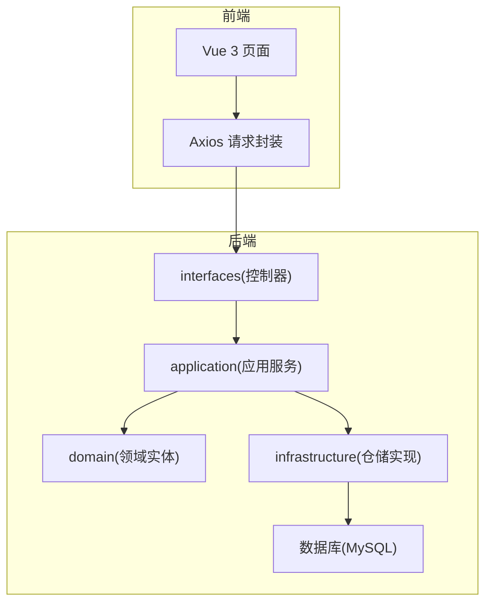
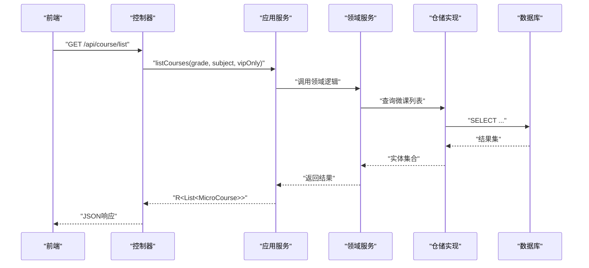
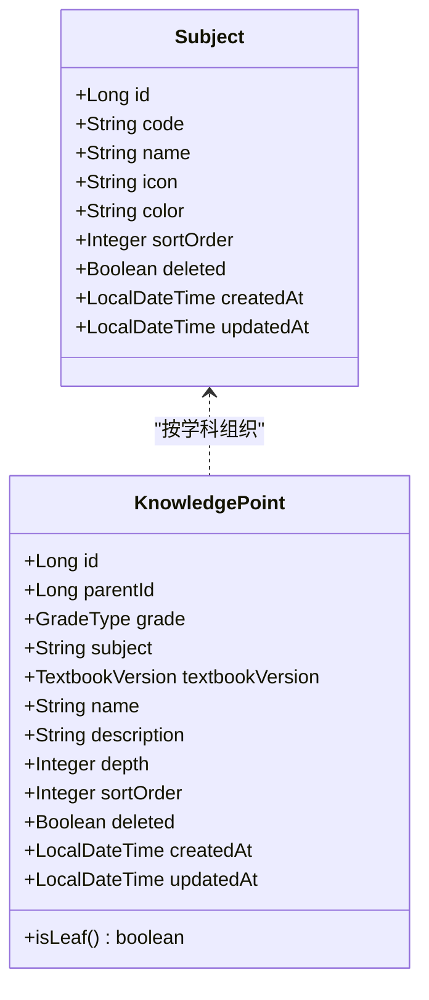
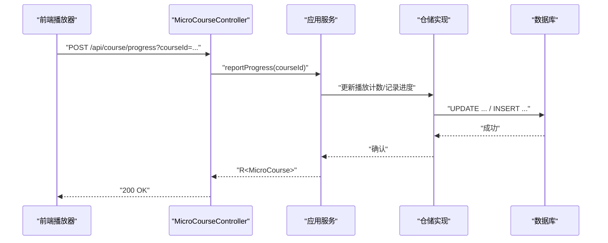
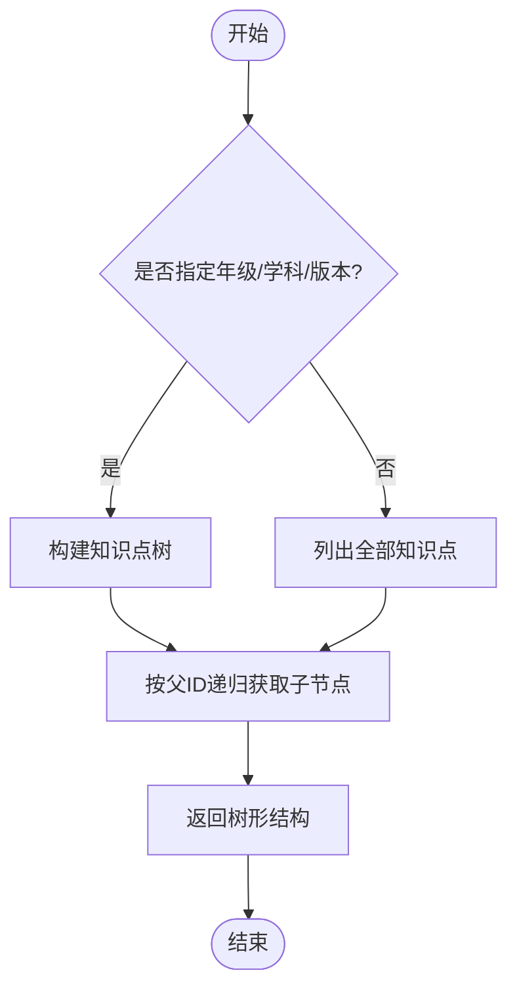
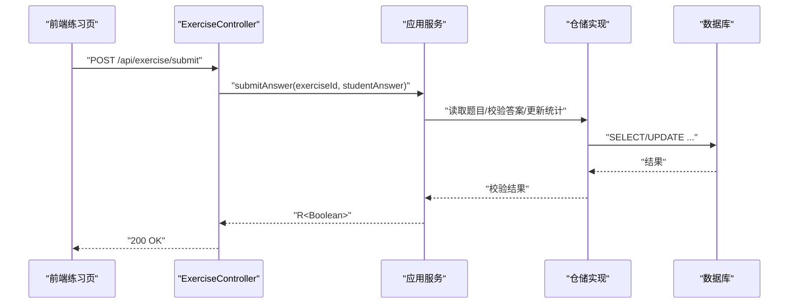
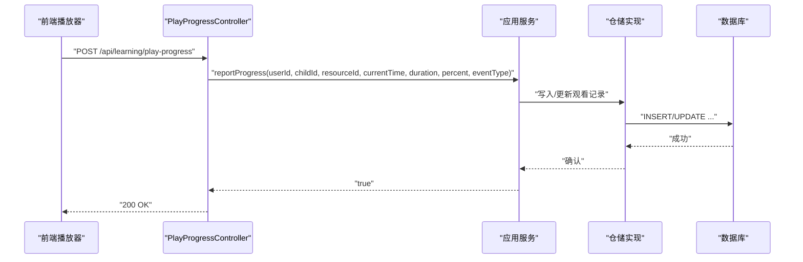
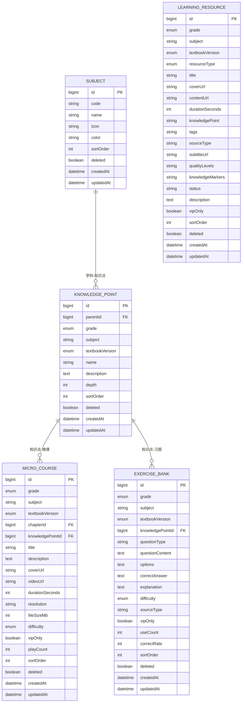
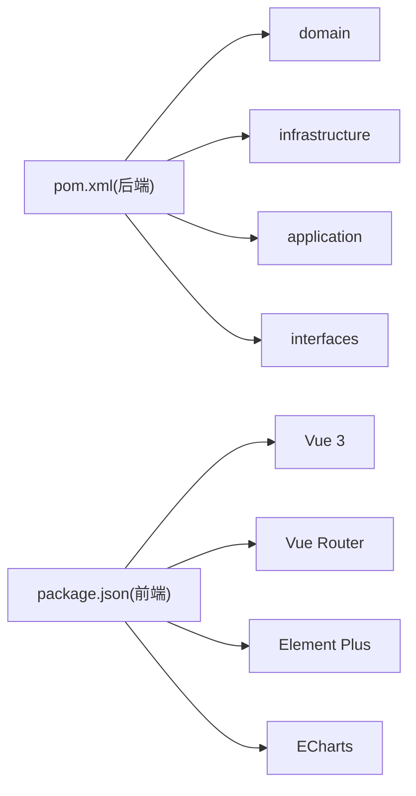

# 学习管理系统

<cite>
**本文引用的文件**
- [wzoto-backend/pom.xml](file://wzoto-backend/pom.xml)
- [wzoto-frontend/package.json](file://wzoto-frontend/package.json)
- [init_all_learning_tables.sql](file://wzoto-backend/sql/init_all_learning_tables.sql)
- [小学生全科学习功能说明文档.md](file://docs/小学生全科学习功能说明文档.md)
- [Subject.java](file://wzoto-backend/wzoto-domain/src/main/java/com/wzoto/domain/entity/Subject.java)
- [KnowledgePoint.java](file://wzoto-backend/wzoto-domain/src/main/java/com/wzoto/domain/entity/KnowledgePoint.java)
- [MicroCourse.java](file://wzoto-backend/wzoto-domain/src/main/java/com/wzoto/domain/entity/MicroCourse.java)
- [LearningResource.java](file://wzoto-backend/wzoto-domain/src/main/java/com/wzoto/domain/entity/LearningResource.java)
- [ExerciseBank.java](file://wzoto-backend/wzoto-domain/src/main/java/com/wzoto/domain/entity/ExerciseBank.java)
- [MicroCourseController.java](file://wzoto-backend/wzoto-interfaces/src/main/java/com/wzoto/interfaces/controller/MicroCourseController.java)
- [KnowledgePointController.java](file://wzoto-backend/wzoto-interfaces/src/main/java/com/wzoto/interfaces/controller/KnowledgePointController.java)
- [ExerciseController.java](file://wzoto-backend/wzoto-interfaces/src/main/java/com/wzoto/interfaces/controller/ExerciseController.java)
- [LearningResourceController.java](file://wzoto-backend/wzoto-interfaces/src/main/java/com/wzoto/interfaces/controller/LearningResourceController.java)
- [PlayProgressController.java](file://wzoto-backend/wzoto-interfaces/src/main/java/com/wzoto/interfaces/controller/PlayProgressController.java)
</cite>

## 目录
1. [简介](#简介)
2. [项目结构](#项目结构)
3. [核心组件](#核心组件)
4. [架构总览](#架构总览)
5. [详细组件分析](#详细组件分析)
6. [依赖关系分析](#依赖关系分析)
7. [性能考虑](#性能考虑)
8. [故障排查指南](#故障排查指南)
9. [结论](#结论)
10. [附录](#附录)

## 简介
本综合文档面向“wzoto学习管理系统”，围绕课程体系、微课管理、知识点管理、练习系统、学习进度追踪与数据模型设计进行系统化说明，并提供API接口清单、前端集成示例与性能优化建议。系统采用DDD分层（Domain/Infrastructure/Application/Interfaces），前后端分离，后端基于Spring Boot与MyBatis-Plus，前端基于Vue 3 + Vite + Element Plus。

## 项目结构
- 后端多模块：domain（领域实体与值对象）、infrastructure（持久化与外部服务）、application（应用服务编排）、interfaces（REST控制器）。
- 前端：Vue 3 + Vue Router + Pinia + Axios + ECharts，页面覆盖学习首页、课程目录、视频播放、错题本、学情报告等。
- 数据库：以SQL脚本集中初始化学习资源相关表，并支持种子数据导入。

图表来源
- [wzoto-backend/pom.xml:21-26](file://wzoto-backend/pom.xml#L21-L26)
- [wzoto-frontend/package.json:11-25](file://wzoto-frontend/package.json#L11-L25)

章节来源
- [wzoto-backend/pom.xml:21-26](file://wzoto-backend/pom.xml#L21-L26)
- [wzoto-frontend/package.json:11-25](file://wzoto-frontend/package.json#L11-L25)

## 核心组件
- 学科与年级：通过学科实体与知识点树形结构组织内容，支持按年级、学科、教材版本筛选。
- 微课管理：微课实体承载视频元信息、难度、VIP限制、播放计数；提供列表、详情、推荐与进度上报。
- 知识点管理：知识点实体维护父子层级与深度，提供树查询与子节点查询。
- 练习系统：习题库实体包含题目类型、选项、答案、解析、难度与使用统计；提供题目列表、提交答案、试卷获取。
- 学习资源：统一资源抽象，支持视频、习题等多类型资源，含VIP控制、标签、字幕、质量等级与知识标记。
- 播放进度：断点续播与心跳上报，记录最后位置、完成状态与观看时长。

章节来源
- [Subject.java:10-27](file://wzoto-backend/wzoto-domain/src/main/java/com/wzoto/domain/entity/Subject.java#L10-L27)
- [KnowledgePoint.java:12-38](file://wzoto-backend/wzoto-domain/src/main/java/com/wzoto/domain/entity/KnowledgePoint.java#L12-L38)
- [MicroCourse.java:13-51](file://wzoto-backend/wzoto-domain/src/main/java/com/wzoto/domain/entity/MicroCourse.java#L13-L51)
- [LearningResource.java:13-152](file://wzoto-backend/wzoto-domain/src/main/java/com/wzoto/domain/entity/LearningResource.java#L13-L152)
- [ExerciseBank.java:13-51](file://wzoto-backend/wzoto-domain/src/main/java/com/wzoto/domain/entity/ExerciseBank.java#L13-L51)
- [PlayProgressController.java:14-68](file://wzoto-backend/wzoto-interfaces/src/main/java/com/wzoto/interfaces/controller/PlayProgressController.java#L14-L68)

## 架构总览
系统遵循DDD四层架构：
- Interfaces层：暴露REST API，负责参数校验、上下文注入与响应包装。
- Application层：编排业务用例，协调领域服务与仓储，处理事务与权限。
- Domain层：定义实体、值对象与领域服务，承载核心业务规则。
- Infrastructure层：实现仓储接口，映射PO到Entity，对接数据库与外部服务。

图表来源
- [MicroCourseController.java:22-27](file://wzoto-backend/wzoto-interfaces/src/main/java/com/wzoto/interfaces/controller/MicroCourseController.java#L22-L27)
- [wzoto-backend/pom.xml:21-26](file://wzoto-backend/pom.xml#L21-L26)

## 详细组件分析

### 课程体系结构（学科、年级、知识点）
- 学科实体：编码、名称、图标、颜色、排序与软删除字段。
- 知识点实体：支持父级ID、年级、学科、教材版本、名称、描述、深度、排序；提供叶子节点判断方法。
- 知识点树：通过树形结构组织，便于按年级与学科导航。

图表来源
- [Subject.java:10-27](file://wzoto-backend/wzoto-domain/src/main/java/com/wzoto/domain/entity/Subject.java#L10-L27)
- [KnowledgePoint.java:12-38](file://wzoto-backend/wzoto-domain/src/main/java/com/wzoto/domain/entity/KnowledgePoint.java#L12-L38)

章节来源
- [KnowledgePointController.java:21-36](file://wzoto-backend/wzoto-interfaces/src/main/java/com/wzoto/interfaces/controller/KnowledgePointController.java#L21-L36)
- [KnowledgePoint.java:12-38](file://wzoto-backend/wzoto-domain/src/main/java/com/wzoto/domain/entity/KnowledgePoint.java#L12-L38)

### 微课管理系统（视频上传、章节组织、播放进度）
- 微课实体：年级、学科、教材版本、章节ID、知识点ID、标题、封面、视频URL、时长、分辨率、文件大小、难度、VIP限制、播放次数、排序。
- 控制器能力：
  - 列表查询：按年级、学科、VIP过滤。
  - 详情获取：根据ID获取微课。
  - 进度上报：记录播放进度（BI埋点）。
  - 推荐：基于学生ID推荐微课。

图表来源
- [MicroCourseController.java:34-38](file://wzoto-backend/wzoto-interfaces/src/main/java/com/wzoto/interfaces/controller/MicroCourseController.java#L34-L38)
- [MicroCourse.java:20-51](file://wzoto-backend/wzoto-domain/src/main/java/com/wzoto/domain/entity/MicroCourse.java#L20-L51)

章节来源
- [MicroCourseController.java:22-44](file://wzoto-backend/wzoto-interfaces/src/main/java/com/wzoto/interfaces/controller/MicroCourseController.java#L22-L44)
- [MicroCourse.java:20-51](file://wzoto-backend/wzoto-domain/src/main/java/com/wzoto/domain/entity/MicroCourse.java#L20-L51)

### 知识点管理（图谱构建、关联维护、学习路径规划）
- 知识点树接口：
  - 获取树：按年级、学科、教材版本过滤。
  - 获取子节点：按父ID查询。
  - 获取详情：按ID查询。
- 学习路径规划：基于知识点树与微课、练习的关联，结合学生掌握度生成个性化路径（由应用层编排）。

图表来源
- [KnowledgePointController.java:21-36](file://wzoto-backend/wzoto-interfaces/src/main/java/com/wzoto/interfaces/controller/KnowledgePointController.java#L21-L36)
- [KnowledgePoint.java:20-38](file://wzoto-backend/wzoto-domain/src/main/java/com/wzoto/domain/entity/KnowledgePoint.java#L20-L38)

章节来源
- [KnowledgePointController.java:21-36](file://wzoto-backend/wzoto-interfaces/src/main/java/com/wzoto/interfaces/controller/KnowledgePointController.java#L21-L36)

### 练习系统（题库管理、题目类型、答题记录）
- 习题库实体：年级、学科、教材版本、知识点ID、题目类型、内容、选项、正确答案、解析、难度、来源、VIP限制、使用次数、正确率、排序。
- 控制器能力：
  - 列表查询：按年级、学科、难度、题型分页。
  - 详情获取：根据ID获取题目。
  - 提交答案：校验答案并记录。
  - 试卷：获取试卷与试卷列表。

图表来源
- [ExerciseController.java:38-42](file://wzoto-backend/wzoto-interfaces/src/main/java/com/wzoto/interfaces/controller/ExerciseController.java#L38-L42)
- [ExerciseBank.java:20-51](file://wzoto-backend/wzoto-domain/src/main/java/com/wzoto/domain/entity/ExerciseBank.java#L20-L51)

章节来源
- [ExerciseController.java:24-54](file://wzoto-backend/wzoto-interfaces/src/main/java/com/wzoto/interfaces/controller/ExerciseController.java#L24-L54)
- [ExerciseBank.java:20-51](file://wzoto-backend/wzoto-domain/src/main/java/com/wzoto/domain/entity/ExerciseBank.java#L20-L51)

### 学习进度追踪（观看记录、练习完成度、掌握程度评估）
- 播放进度接口：
  - 上报进度：每5秒心跳上报，记录当前时间、总时长、百分比与事件类型。
  - 获取断点：用于续播，返回最后位置、完成状态与观看时长。
- 掌握程度评估：结合观看完成率与练习正确率，在应用层计算并输出学情报告（由其他控制器/服务协同）。

图表来源
- [PlayProgressController.java:28-43](file://wzoto-backend/wzoto-interfaces/src/main/java/com/wzoto/interfaces/controller/PlayProgressController.java#L28-L43)

章节来源
- [PlayProgressController.java:28-68](file://wzoto-backend/wzoto-interfaces/src/main/java/com/wzoto/interfaces/controller/PlayProgressController.java#L28-L68)

### 数据模型设计（实体关系图与字段定义）
- 学科：id、code、name、icon、color、sortOrder、deleted、createdAt、updatedAt。
- 知识点：id、parentId、grade、subject、textbookVersion、name、description、depth、sortOrder、deleted、createdAt、updatedAt。
- 微课：id、grade、subject、textbookVersion、chapterId、knowledgePointId、title、description、coverUrl、videoUrl、durationSeconds、resolution、fileSizeMb、difficulty、vipOnly、playCount、sortOrder、deleted、createdAt、updatedAt。
- 学习资源：id、grade、subject、textbookVersion、resourceType、title、coverUrl、contentUrl、durationSeconds、knowledgePoint、tags、sourceType、subtitleUrl、qualityLevels、knowledgeMarkers、status、description、vipOnly、sortOrder、deleted、createdAt、updatedAt。
- 习题库：id、grade、subject、textbookVersion、knowledgePointId、questionType、questionContent、options、correctAnswer、explanation、difficulty、sourceType、vipOnly、useCount、correctRate、sortOrder、deleted、createdAt、updatedAt。

图表来源
- [Subject.java:10-27](file://wzoto-backend/wzoto-domain/src/main/java/com/wzoto/domain/entity/Subject.java#L10-L27)
- [KnowledgePoint.java:12-38](file://wzoto-backend/wzoto-domain/src/main/java/com/wzoto/domain/entity/KnowledgePoint.java#L12-L38)
- [MicroCourse.java:20-51](file://wzoto-backend/wzoto-domain/src/main/java/com/wzoto/domain/entity/MicroCourse.java#L20-L51)
- [LearningResource.java:21-152](file://wzoto-backend/wzoto-domain/src/main/java/com/wzoto/domain/entity/LearningResource.java#L21-L152)
- [ExerciseBank.java:20-51](file://wzoto-backend/wzoto-domain/src/main/java/com/wzoto/domain/entity/ExerciseBank.java#L20-L51)

章节来源
- [init_all_learning_tables.sql:18-27](file://wzoto-backend/sql/init_all_learning_tables.sql#L18-L27)

## 依赖关系分析
- 后端模块依赖：pom中声明了domain、infrastructure、application、interfaces四个模块，统一版本管理与公共依赖（MyBatis-Plus、Hutool、JWT）。
- 前端依赖：Vue 3、Vue Router、Pinia、Element Plus、ECharts、Axios、Sass。
- 数据库初始化：一次性创建学习资源相关表并导入种子数据。

图表来源
- [wzoto-backend/pom.xml:21-26](file://wzoto-backend/pom.xml#L21-L26)
- [wzoto-frontend/package.json:11-25](file://wzoto-frontend/package.json#L11-L25)

章节来源
- [wzoto-backend/pom.xml:21-26](file://wzoto-backend/pom.xml#L21-L26)
- [wzoto-frontend/package.json:11-25](file://wzoto-frontend/package.json#L11-L25)

## 性能考虑
- 播放进度上报：建议前端每5秒上报一次，避免高频写库；后端可合并写入或异步落盘。
- 列表查询：对年级、学科、教材版本建立索引，减少全表扫描。
- 视频资源：支持多画质与字幕，按需加载；CDN缓存静态资源。
- 练习统计：useCount与correctRate增量更新，避免频繁聚合计算。
- 前端渲染：ECharts大数据量时启用虚拟滚动或分页；懒加载图片与组件。

## 故障排查指南
- 播放进度异常：检查上报参数（childId、resourceId、currentTime、duration、percent、eventType）是否完整；确认用户上下文是否正确。
- VIP资源访问：确认会员状态或单次解锁订单是否有效；检查资源vipOnly标志。
- 知识点树为空：核对年级、学科、教材版本过滤条件；检查知识点depth与parent关系。
- 练习提交失败：核对题目类型与答案格式；检查正确答案与提交答案的比对逻辑。

章节来源
- [PlayProgressController.java:28-43](file://wzoto-backend/wzoto-interfaces/src/main/java/com/wzoto/interfaces/controller/PlayProgressController.java#L28-L43)
- [LearningResourceController.java:43-51](file://wzoto-backend/wzoto-interfaces/src/main/java/com/wzoto/interfaces/controller/LearningResourceController.java#L43-L51)
- [KnowledgePointController.java:21-36](file://wzoto-backend/wzoto-interfaces/src/main/java/com/wzoto/interfaces/controller/KnowledgePointController.java#L21-L36)
- [ExerciseController.java:38-42](file://wzoto-backend/wzoto-interfaces/src/main/java/com/wzoto/interfaces/controller/ExerciseController.java#L38-L42)

## 结论
wzoto学习管理系统以DDD分层为核心，围绕学科-知识点-微课-练习-进度形成闭环。通过统一的资源抽象与进度追踪，支撑个性化学习路径与学情分析。后续可扩展AI答疑、智能推荐与更精细的掌握度评估模型。

## 附录

### API接口清单（CRUD与业务调用）
- 微课
  - GET /api/course/list?grade=&subject=&vipOnly=
  - GET /api/course/{id}
  - POST /api/course/progress?courseId=
  - GET /api/course/recommend/{childId}?limit=
- 知识点
  - GET /api/knowledge/tree?grade=&subject=&textbookVersion=
  - GET /api/knowledge/children/{parentId}
  - GET /api/knowledge/{id}
- 练习
  - GET /api/exercise/list?grade=&subject=&difficulty=&questionType=&limit=
  - GET /api/exercise/{id}
  - POST /api/exercise/submit (SubmitAnswerDTO)
  - GET /api/exercise/paper/{id}
  - GET /api/exercise/paper/list?grade=&subject=&paperType=
- 学习资源
  - GET /api/learning/resources?childId=&subject=&resourceType=&includeVip=
  - GET /api/learning/resource/{id}
  - POST /api/learning/resource/{id}/unlock
- 播放进度
  - POST /api/learning/play-progress (body: childId, resourceId, currentTime, duration, percent, eventType)
  - GET /api/learning/play-progress/{resourceId}?childId=

章节来源
- [MicroCourseController.java:22-44](file://wzoto-backend/wzoto-interfaces/src/main/java/com/wzoto/interfaces/controller/MicroCourseController.java#L22-L44)
- [KnowledgePointController.java:21-36](file://wzoto-backend/wzoto-interfaces/src/main/java/com/wzoto/interfaces/controller/KnowledgePointController.java#L21-L36)
- [ExerciseController.java:24-54](file://wzoto-backend/wzoto-interfaces/src/main/java/com/wzoto/interfaces/controller/ExerciseController.java#L24-L54)
- [LearningResourceController.java:27-51](file://wzoto-backend/wzoto-interfaces/src/main/java/com/wzoto/interfaces/controller/LearningResourceController.java#L27-L51)
- [PlayProgressController.java:28-68](file://wzoto-backend/wzoto-interfaces/src/main/java/com/wzoto/interfaces/controller/PlayProgressController.java#L28-L68)

### 前端组件集成示例（参考路径）
- 播放器组件：[OnionPlayer.vue](file://wzoto-frontend/src/components/OnionPlayer.vue)
- 学习页面：
  - [LearningHomePage.vue](file://wzoto-frontend/src/pages/learning/LearningHomePage.vue)
  - [CourseDirectoryPage.vue](file://wzoto-frontend/src/pages/learning/CourseDirectoryPage.vue)
  - [VideoPlayerPage.vue](file://wzoto-frontend/src/pages/learning/VideoPlayerPage.vue)
  - [WrongQuestionPage.vue](file://wzoto-frontend/src/pages/learning/WrongQuestionPage.vue)
  - [LearningReportPage.vue](file://wzoto-frontend/src/pages/learning/LearningReportPage.vue)
- API封装：
  - [learning.js](file://wzoto-frontend/src/api/learning.js)
  - [request.js](file://wzoto-frontend/src/utils/request.js)
- 工具与埋点：
  - [track.js](file://wzoto-frontend/src/utils/track.js)

章节来源
- [小学生全科学习功能说明文档.md:39-47](file://docs/小学生全科学习功能说明文档.md#L39-L47)