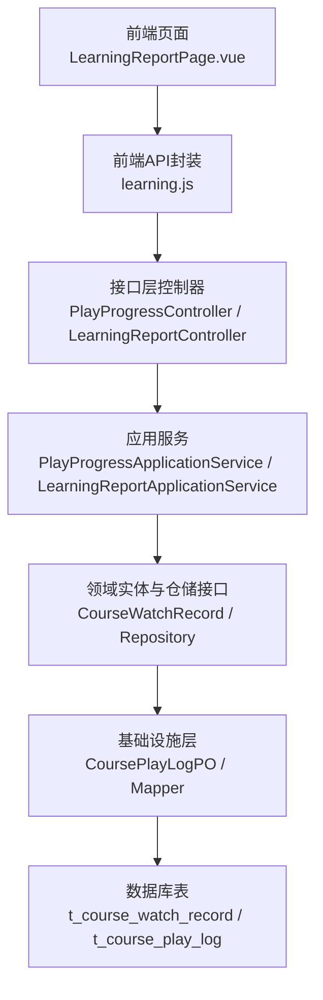
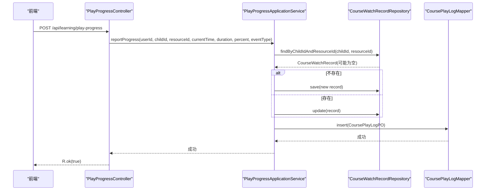
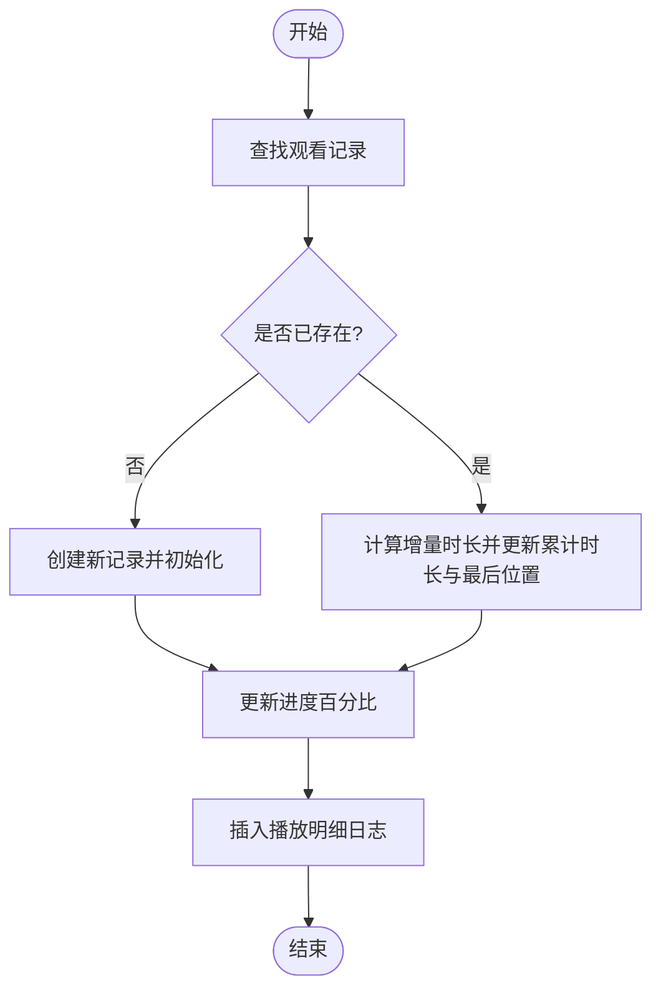
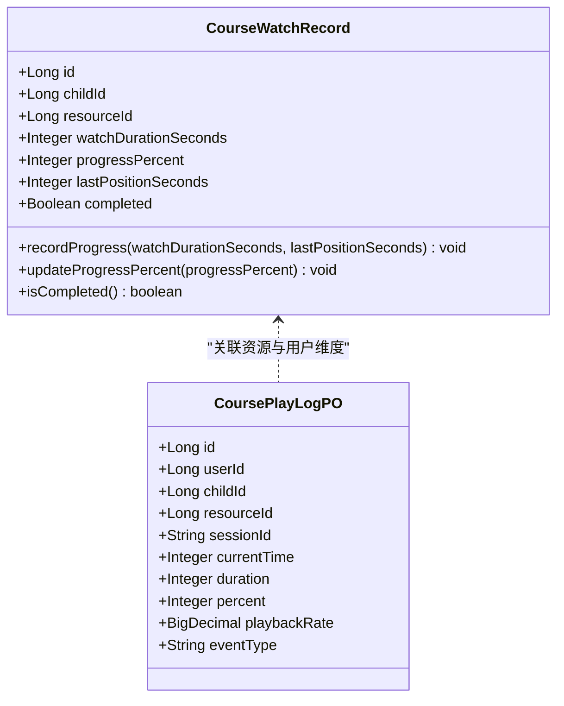
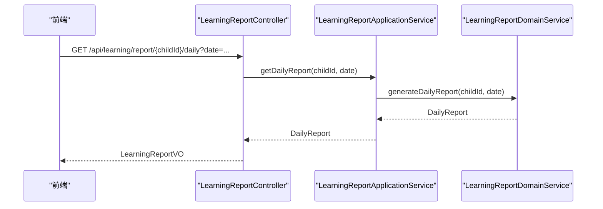
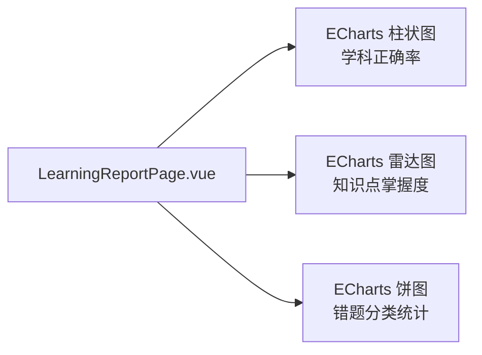
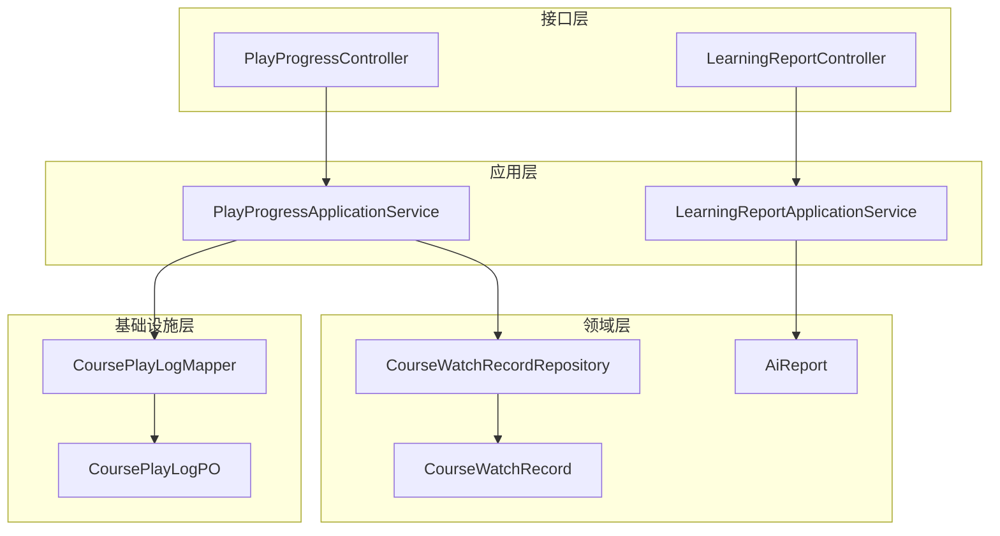

# 学习进度追踪

<cite>
**本文引用的文件**
- [PlayProgressController.java](file://wzoto-backend/wzoto-interfaces/src/main/java/com/wzoto/interfaces/controller/PlayProgressController.java)
- [PlayProgressApplicationService.java](file://wzoto-backend/wzoto-application/src/main/java/com/wzoto/application/service/PlayProgressApplicationService.java)
- [CourseWatchRecord.java](file://wzoto-backend/wzoto-domain/src/main/java/com/wzoto/domain/entity/CourseWatchRecord.java)
- [CourseWatchRecordRepository.java](file://wzoto-backend/wzoto-domain/src/main/java/com/wzoto/domain/repository/CourseWatchRecordRepository.java)
- [LearningReportController.java](file://wzoto-backend/wzoto-interfaces/src/main/java/com/wzoto/interfaces/controller/LearningReportController.java)
- [LearningReportApplicationService.java](file://wzoto-backend/wzoto-application/src/main/java/com/wzoto/application/service/LearningReportApplicationService.java)
- [AiReport.java](file://wzoto-backend/wzoto-domain/src/main/java/com/wzoto/domain/entity/AiReport.java)
- [CoursePlayLogPO.java](file://wzoto-backend/wzoto-infrastructure/src/main/java/com/wzoto/infrastructure/pojo/CoursePlayLogPO.java)
- [CoursePlayLogMapper.java](file://wzoto-backend/wzoto-infrastructure/src/main/java/com/wzoto/infrastructure/mapper/CoursePlayLogMapper.java)
- [init_all_learning_tables.sql](file://wzoto-backend/sql/init_all_learning_tables.sql)
- [learning.js](file://wzoto-frontend/src/api/learning.js)
- [LearningReportPage.vue](file://wzoto-frontend/src/pages/learning/LearningReportPage.vue)
- [KnowledgeRadar.vue](file://wzoto-frontend/src/pages/student/components/KnowledgeRadar.vue)
</cite>

## 目录
1. [简介](#简介)
2. [项目结构](#项目结构)
3. [核心组件](#核心组件)
4. [架构总览](#架构总览)
5. [详细组件分析](#详细组件分析)
6. [依赖关系分析](#依赖关系分析)
7. [性能考虑](#性能考虑)
8. [故障排查指南](#故障排查指南)
9. [结论](#结论)
10. [附录：API接口文档](#附录api接口文档)

## 简介
本系统为wzoto学习进度追踪模块，围绕“观看记录管理、学习数据分析、进度同步机制、学习报告生成、进度可视化”五大目标构建。后端采用分层架构（接口层-应用层-领域层-基础设施层），前端基于Vue与ECharts实现数据可视化；通过播放进度上报与断点续播能力，结合学情报告与薄弱知识点分析，形成完整的学习闭环。

## 项目结构
- 后端分层
  - 接口层：REST控制器暴露进度上报、报告查询等API
  - 应用层：编排业务用例（如进度上报、报告生成）
  - 领域层：实体与仓储接口（观看记录、AI报告等）
  - 基础设施层：持久化对象与Mapper（播放明细日志等）
- 前端
  - API封装：统一调用后端接口
  - 页面与组件：学习报告页、雷达图组件等
- 数据库脚本：初始化学习资源相关表及种子数据

**图表来源**
- [PlayProgressController.java:1-69](file://wzoto-backend/wzoto-interfaces/src/main/java/com/wzoto/interfaces/controller/PlayProgressController.java#L1-L69)
- [LearningReportController.java:1-141](file://wzoto-backend/wzoto-interfaces/src/main/java/com/wzoto/interfaces/controller/LearningReportController.java#L1-L141)
- [PlayProgressApplicationService.java:1-76](file://wzoto-backend/wzoto-application/src/main/java/com/wzoto/application/service/PlayProgressApplicationService.java#L1-L76)
- [LearningReportApplicationService.java:1-59](file://wzoto-backend/wzoto-application/src/main/java/com/wzoto/application/service/LearningReportApplicationService.java#L1-L59)
- [CourseWatchRecord.java:1-120](file://wzoto-backend/wzoto-domain/src/main/java/com/wzoto/domain/entity/CourseWatchRecord.java#L1-L120)
- [CourseWatchRecordRepository.java:1-22](file://wzoto-backend/wzoto-domain/src/main/java/com/wzoto/domain/repository/CourseWatchRecordRepository.java#L1-L22)
- [CoursePlayLogPO.java:1-48](file://wzoto-backend/wzoto-infrastructure/src/main/java/com/wzoto/infrastructure/pojo/CoursePlayLogPO.java#L1-L48)
- [CoursePlayLogMapper.java:1-13](file://wzoto-backend/wzoto-infrastructure/src/main/java/com/wzoto/infrastructure/mapper/CoursePlayLogMapper.java#L1-L13)

**章节来源**
- [init_all_learning_tables.sql:1-31](file://wzoto-backend/sql/init_all_learning_tables.sql#L1-L31)

## 核心组件
- 播放进度上报与断点续播：控制器接收心跳上报，应用服务更新汇总记录并写入明细日志，支持按资源ID获取最后位置以续播
- 学情报告：提供日/周/月报、薄弱知识点、错题导出等能力，并在前端进行多维可视化
- AI学情诊断报告：支持会员免费报告与付费解锁完整报告的流程
- 数据可视化：柱状图、雷达图、饼图等展示正确率、掌握度与错题分布

**章节来源**
- [PlayProgressController.java:15-69](file://wzoto-backend/wzoto-interfaces/src/main/java/com/wzoto/interfaces/controller/PlayProgressController.java#L15-L69)
- [PlayProgressApplicationService.java:15-76](file://wzoto-backend/wzoto-application/src/main/java/com/wzoto/application/service/PlayProgressApplicationService.java#L15-L76)
- [LearningReportController.java:20-141](file://wzoto-backend/wzoto-interfaces/src/main/java/com/wzoto/interfaces/controller/LearningReportController.java#L20-L141)
- [LearningReportApplicationService.java:15-59](file://wzoto-backend/wzoto-application/src/main/java/com/wzoto/application/service/LearningReportApplicationService.java#L15-L59)
- [AiReport.java:11-106](file://wzoto-backend/wzoto-domain/src/main/java/com/wzoto/domain/entity/AiReport.java#L11-L106)
- [LearningReportPage.vue:1-377](file://wzoto-frontend/src/pages/learning/LearningReportPage.vue#L1-L377)
- [KnowledgeRadar.vue:1-82](file://wzoto-frontend/src/pages/student/components/KnowledgeRadar.vue#L1-L82)

## 架构总览
系统遵循清晰的分层与职责分离：
- 接口层：定义REST路径与入参校验，返回统一结果包装
- 应用层：编排用例，协调领域服务与仓储
- 领域层：承载业务规则（如完成度阈值、报告聚合）
- 基础设施层：映射到数据库表，处理持久化细节

**图表来源**
- [PlayProgressController.java:25-43](file://wzoto-backend/wzoto-interfaces/src/main/java/com/wzoto/interfaces/controller/PlayProgressController.java#L25-L43)
- [PlayProgressApplicationService.java:27-66](file://wzoto-backend/wzoto-application/src/main/java/com/wzoto/application/service/PlayProgressApplicationService.java#L27-L66)
- [CourseWatchRecordRepository.java:10-21](file://wzoto-backend/wzoto-domain/src/main/java/com/wzoto/domain/repository/CourseWatchRecordRepository.java#L10-L21)
- [CoursePlayLogMapper.java:1-13](file://wzoto-backend/wzoto-infrastructure/src/main/java/com/wzoto/infrastructure/mapper/CoursePlayLogMapper.java#L1-L13)

## 详细组件分析

### 播放进度管理（保存、暂停恢复、倍速记录）
- 进度保存：每次上报会计算增量时长并更新累计观看时长与最后位置，同时更新百分比
- 完成度判定：当进度百分比达到或超过阈值即标记为已完成
- 断点续播：根据childId与resourceId查询最后位置，前端据此定位播放起点
- 倍速记录：明细日志包含回放速率字段，便于后续效率评估

**图表来源**
- [PlayProgressApplicationService.java:32-66](file://wzoto-backend/wzoto-application/src/main/java/com/wzoto/application/service/PlayProgressApplicationService.java#L32-L66)
- [CourseWatchRecord.java:76-102](file://wzoto-backend/wzoto-domain/src/main/java/com/wzoto/domain/entity/CourseWatchRecord.java#L76-L102)

**章节来源**
- [PlayProgressController.java:25-67](file://wzoto-backend/wzoto-interfaces/src/main/java/com/wzoto/interfaces/controller/PlayProgressController.java#L25-L67)
- [PlayProgressApplicationService.java:27-74](file://wzoto-backend/wzoto-application/src/main/java/com/wzoto/application/service/PlayProgressApplicationService.java#L27-L74)
- [CourseWatchRecord.java:10-120](file://wzoto-backend/wzoto-domain/src/main/java/com/wzoto/domain/entity/CourseWatchRecord.java#L10-L120)
- [CoursePlayLogPO.java:9-48](file://wzoto-backend/wzoto-infrastructure/src/main/java/com/wzoto/infrastructure/pojo/CoursePlayLogPO.java#L9-L48)

### 学习数据分析（时长统计、完成度、效率评估）
- 时长统计：累计观看时长由应用服务在每次上报时累加
- 完成度计算：领域实体维护进度百分比与完成标志，达到阈值自动完成
- 效率评估：明细日志记录回放速率与事件类型，可结合时间序列分析学习效率

**图表来源**
- [CourseWatchRecord.java:10-120](file://wzoto-backend/wzoto-domain/src/main/java/com/wzoto/domain/entity/CourseWatchRecord.java#L10-L120)
- [CoursePlayLogPO.java:9-48](file://wzoto-backend/wzoto-infrastructure/src/main/java/com/wzoto/infrastructure/pojo/CoursePlayLogPO.java#L9-L48)

**章节来源**
- [PlayProgressApplicationService.java:27-66](file://wzoto-backend/wzoto-application/src/main/java/com/wzoto/application/service/PlayProgressApplicationService.java#L27-L66)
- [CourseWatchRecord.java:56-119](file://wzoto-backend/wzoto-domain/src/main/java/com/wzoto/domain/entity/CourseWatchRecord.java#L56-L119)

### 进度同步机制（多设备、离线、云端备份）
- 多设备同步：通过childId+resourceId唯一标识观看记录，任意设备上报均能合并至同一汇总记录
- 离线学习支持：前端可在本地缓存播放状态，网络恢复后批量上报；后端幂等更新避免重复计数
- 云端数据备份：明细日志独立存储，便于审计与回溯；汇总记录用于快速读取断点

[本节为概念性说明，不直接分析具体文件]

### 学习报告生成（个人、班级、教师分析）
- 个人报告：日/周/月报聚合做题数、正确率、观看时长、完成视频数等指标
- 薄弱知识点：按错误次数排序，辅助个性化推荐
- 教师教学分析：可结合班级维度聚合（当前代码聚焦个人维度，可扩展）

**图表来源**
- [LearningReportController.java:31-44](file://wzoto-backend/wzoto-interfaces/src/main/java/com/wzoto/interfaces/controller/LearningReportController.java#L31-L44)
- [LearningReportApplicationService.java:26-34](file://wzoto-backend/wzoto-application/src/main/java/com/wzoto/application/service/LearningReportApplicationService.java#L26-L34)

**章节来源**
- [LearningReportController.java:20-141](file://wzoto-backend/wzoto-interfaces/src/main/java/com/wzoto/interfaces/controller/LearningReportController.java#L20-L141)
- [LearningReportApplicationService.java:15-59](file://wzoto-backend/wzoto-application/src/main/java/com/wzoto/application/service/LearningReportApplicationService.java#L15-L59)

### 进度可视化（学习曲线、掌握度雷达、时间热力图）
- 学习曲线：按学科正确率绘制柱状图，支持日/周/月切换
- 掌握度雷达：展示各知识点的掌握分数，直观呈现强弱项
- 时间热力图：可基于播放明细日志的时间维度扩展（当前页面未实现，建议后续接入）

**图表来源**
- [LearningReportPage.vue:167-257](file://wzoto-frontend/src/pages/learning/LearningReportPage.vue#L167-L257)
- [KnowledgeRadar.vue:18-56](file://wzoto-frontend/src/pages/student/components/KnowledgeRadar.vue#L18-L56)

**章节来源**
- [LearningReportPage.vue:1-377](file://wzoto-frontend/src/pages/learning/LearningReportPage.vue#L1-L377)
- [KnowledgeRadar.vue:1-82](file://wzoto-frontend/src/pages/student/components/KnowledgeRadar.vue#L1-L82)

## 依赖关系分析
- 控制器依赖应用服务，应用服务依赖领域仓储与基础设施Mapper
- 领域实体封装业务规则，基础设施对象负责持久化映射
- 前端通过API封装调用后端，渲染图表与交互

**图表来源**
- [PlayProgressController.java:1-69](file://wzoto-backend/wzoto-interfaces/src/main/java/com/wzoto/interfaces/controller/PlayProgressController.java#L1-L69)
- [LearningReportController.java:1-141](file://wzoto-backend/wzoto-interfaces/src/main/java/com/wzoto/interfaces/controller/LearningReportController.java#L1-L141)
- [PlayProgressApplicationService.java:1-76](file://wzoto-backend/wzoto-application/src/main/java/com/wzoto/application/service/PlayProgressApplicationService.java#L1-L76)
- [LearningReportApplicationService.java:1-59](file://wzoto-backend/wzoto-application/src/main/java/com/wzoto/application/service/LearningReportApplicationService.java#L1-L59)
- [CourseWatchRecord.java:1-120](file://wzoto-backend/wzoto-domain/src/main/java/com/wzoto/domain/entity/CourseWatchRecord.java#L1-L120)
- [CourseWatchRecordRepository.java:1-22](file://wzoto-backend/wzoto-domain/src/main/java/com/wzoto/domain/repository/CourseWatchRecordRepository.java#L1-L22)
- [AiReport.java:1-106](file://wzoto-backend/wzoto-domain/src/main/java/com/wzoto/domain/entity/AiReport.java#L1-L106)
- [CoursePlayLogPO.java:1-48](file://wzoto-backend/wzoto-infrastructure/src/main/java/com/wzoto/infrastructure/pojo/CoursePlayLogPO.java#L1-L48)
- [CoursePlayLogMapper.java:1-13](file://wzoto-backend/wzoto-infrastructure/src/main/java/com/wzoto/infrastructure/mapper/CoursePlayLogMapper.java#L1-L13)

**章节来源**
- [init_all_learning_tables.sql:1-31](file://wzoto-backend/sql/init_all_learning_tables.sql#L1-L31)

## 性能考虑
- 上报频率控制：前端建议每5秒上报一次，降低服务端压力
- 增量更新：应用服务仅计算增量时长，减少冗余计算
- 明细日志归档：长期运行建议对明细日志做分表或归档策略
- 图表渲染优化：按需初始化ECharts实例，监听窗口resize并销毁实例避免内存泄漏
- 并发与幂等：同资源多次上报应保证幂等，避免重复累计

[本节为通用指导，不直接分析具体文件]

## 故障排查指南
- 进度未更新：检查上报参数是否正确（childId、resourceId、currentTime、duration、percent、eventType）
- 断点续播异常：确认查询接口返回的lastPositionSeconds与progressPercent是否符合预期
- 报告数据为空：验证权限校验（子女归属）与日期参数是否正确
- 图表不显示：确保DOM节点已挂载后再初始化ECharts，并处理resize与dispose

**章节来源**
- [PlayProgressController.java:25-67](file://wzoto-backend/wzoto-interfaces/src/main/java/com/wzoto/interfaces/controller/PlayProgressController.java#L25-L67)
- [LearningReportApplicationService.java:51-57](file://wzoto-backend/wzoto-application/src/main/java/com/wzoto/application/service/LearningReportApplicationService.java#L51-L57)
- [LearningReportPage.vue:194-257](file://wzoto-frontend/src/pages/learning/LearningReportPage.vue#L194-L257)
- [KnowledgeRadar.vue:62-74](file://wzoto-frontend/src/pages/student/components/KnowledgeRadar.vue#L62-L74)

## 结论
本系统通过清晰的层次划分与完善的播放记录、报告生成与可视化能力，实现了从“观看—记录—分析—反馈”的闭环。建议在后续版本中增强离线同步、热力图可视化与班级/教师维度的聚合分析，以提升整体学习体验与管理价值。

[本节为总结性内容，不直接分析具体文件]

## 附录：API接口文档

### 播放进度
- 上报播放进度
  - 方法：POST
  - 路径：/api/learning/play-progress
  - 请求体字段：childId、resourceId、currentTime、duration、percent、eventType
  - 响应：统一结果包装，包含布尔成功标志
  - 说明：建议每5秒上报一次；eventType默认HEARTBEAT
- 获取断点位置
  - 方法：GET
  - 路径：/api/learning/play-progress/{resourceId}
  - 查询参数：childId
  - 响应：包含lastPositionSeconds、progressPercent、completed、watchDurationSeconds

**章节来源**
- [PlayProgressController.java:25-67](file://wzoto-backend/wzoto-interfaces/src/main/java/com/wzoto/interfaces/controller/PlayProgressController.java#L25-L67)
- [learning.js:109-117](file://wzoto-frontend/src/api/learning.js#L109-L117)

### 学情报告
- 日报
  - 方法：GET
  - 路径：/api/learning/report/{childId}/daily
  - 查询参数：date（可选）
  - 响应：包含totalQuestions、correctCount、accuracy、watchDurationSeconds、completedVideos、subjectAccuracy、masteryMap
- 周报
  - 方法：GET
  - 路径：/api/learning/report/{childId}/weekly
  - 查询参数：weekStart（可选）
  - 响应：同上
- 月报
  - 方法：GET
  - 路径：/api/learning/report/{childId}/monthly
  - 查询参数：year、month（可选）
  - 响应：同上
- 薄弱知识点
  - 方法：GET
  - 路径：/api/learning/report/{childId}/weak-points
  - 查询参数：subject（可选）、topN（默认10）
  - 响应：knowledgePoint、mistakeCount列表
- 错题导出
  - 方法：GET
  - 路径：/api/learning/report/{childId}/wrong-questions/export
  - 查询参数：subject（可选）
  - 响应：WrongQuestionBank列表

**章节来源**
- [LearningReportController.java:31-82](file://wzoto-backend/wzoto-interfaces/src/main/java/com/wzoto/interfaces/controller/LearningReportController.java#L31-L82)
- [learning.js:28-61](file://wzoto-frontend/src/api/learning.js#L28-L61)

### 前端调用示例（路径引用）
- 播放进度上报与查询
  - 路径：[reportPlayProgress/getPlayProgress:111-117](file://wzoto-frontend/src/api/learning.js#L111-L117)
- 报告与薄弱点
  - 路径：[getDailyReport/getWeeklyReport/getMonthlyReport/getWeakPoints:34-55](file://wzoto-frontend/src/api/learning.js#L34-L55)
- 可视化渲染
  - 路径：[LearningReportPage.vue 图表渲染逻辑:167-257](file://wzoto-frontend/src/pages/learning/LearningReportPage.vue#L167-L257)
  - 路径：[KnowledgeRadar.vue 雷达图组件:18-56](file://wzoto-frontend/src/pages/student/components/KnowledgeRadar.vue#L18-L56)