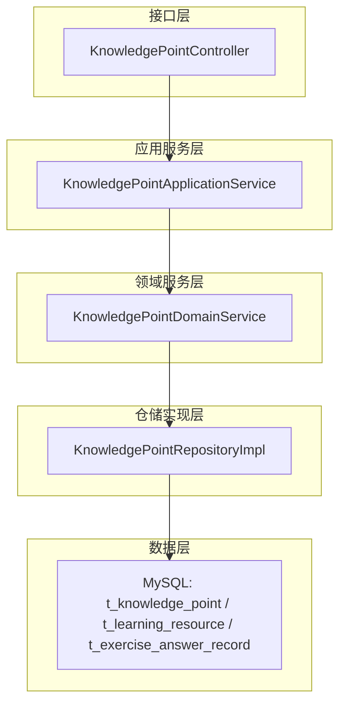
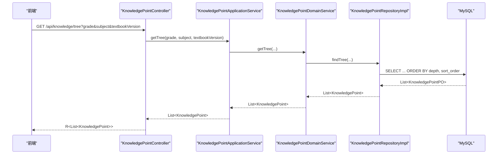
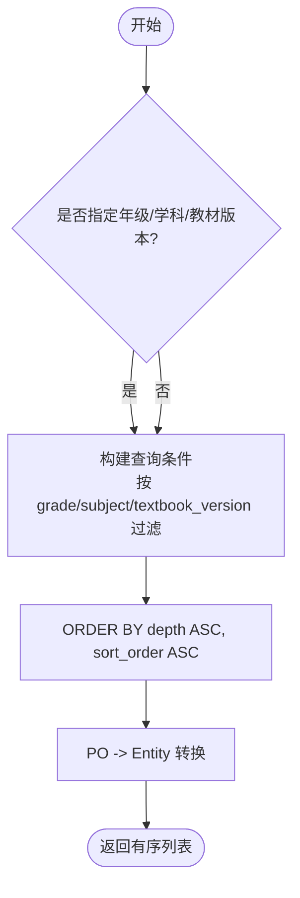
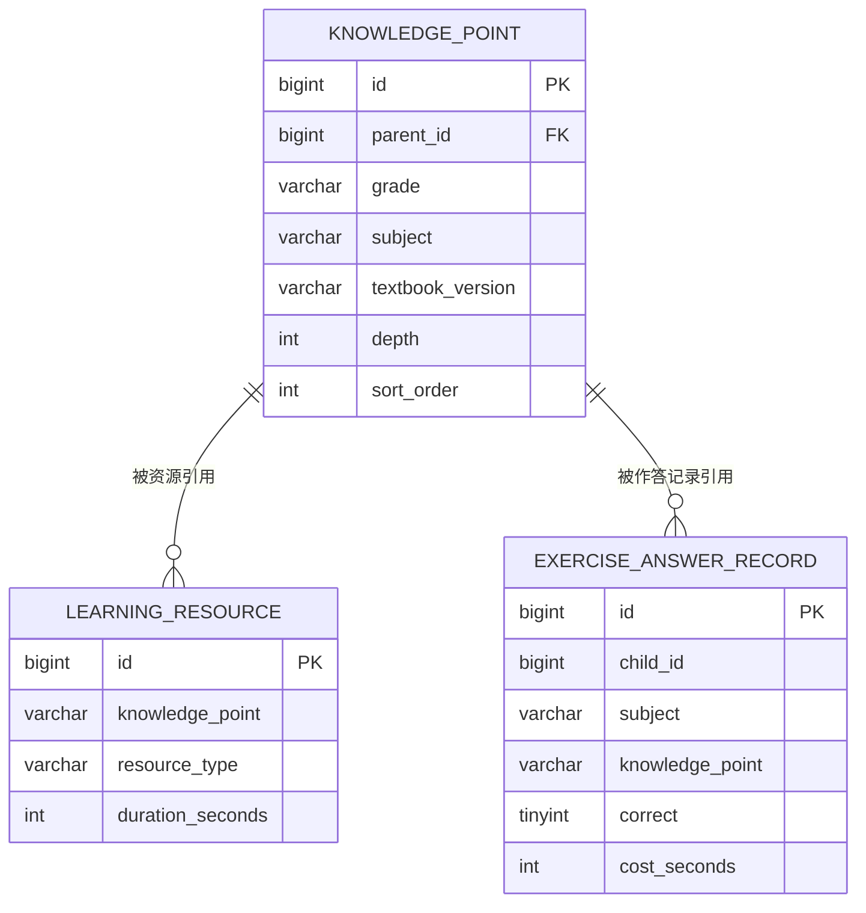
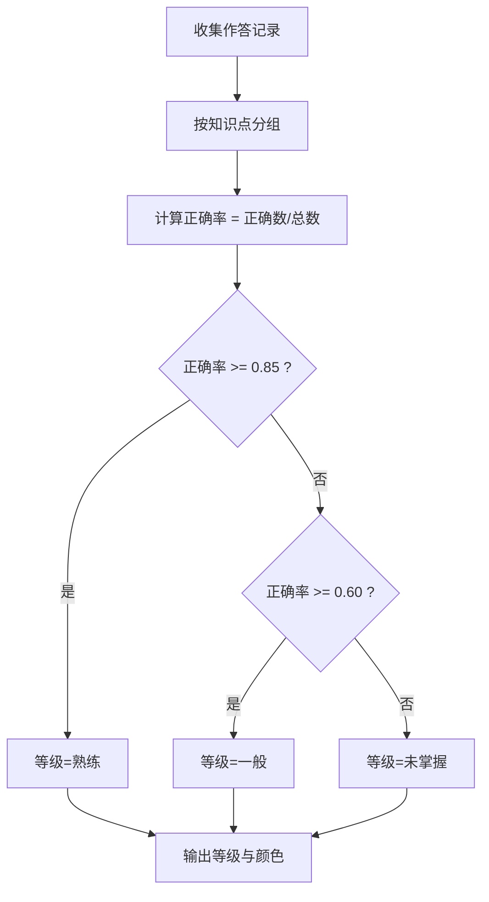
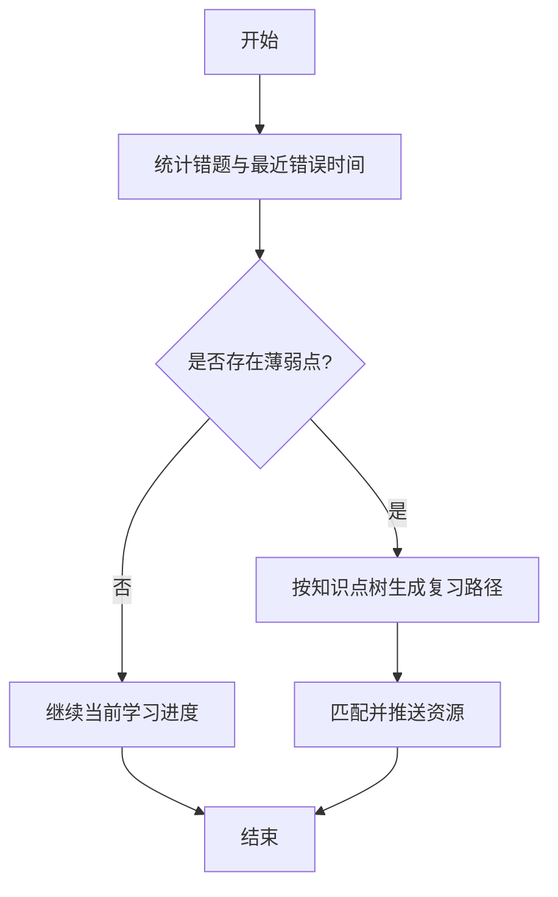
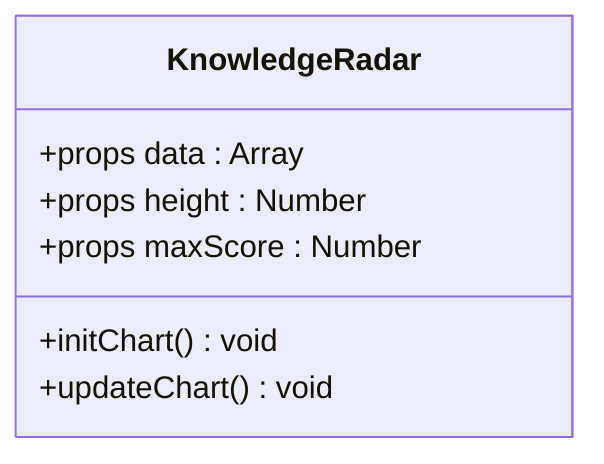
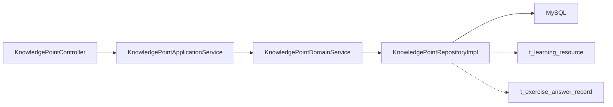

# 知识点管理

<cite>
**本文引用的文件**
- [KnowledgePoint.java](file://wzoto-backend/wzoto-domain/src/main/java/com/wzoto/domain/entity/KnowledgePoint.java)
- [KnowledgePointDomainService.java](file://wzoto-backend/wzoto-domain/src/main/java/com/wzoto/domain/service/KnowledgePointDomainService.java)
- [KnowledgePointRepository.java](file://wzoto-backend/wzoto-domain/src/main/java/com/wzoto/domain/repository/KnowledgePointRepository.java)
- [KnowledgePointRepositoryImpl.java](file://wzoto-backend/wzoto-infrastructure/src/main/java/com/wzoto/infrastructure/repository/KnowledgePointRepositoryImpl.java)
- [KnowledgePointApplicationService.java](file://wzoto-backend/wzoto-application/src/main/java/com/wzoto/application/service/KnowledgePointApplicationService.java)
- [KnowledgePointController.java](file://wzoto-backend/wzoto-interfaces/src/main/java/com/wzoto/interfaces/controller/KnowledgePointController.java)
- [t_knowledge_point.sql](file://wzoto-backend/sql/t_knowledge_point.sql)
- [MasteryLevel.java](file://wzoto-backend/wzoto-domain/src/main/java/com/wzoto/domain/valobj/MasteryLevel.java)
- [t_learning_resource.sql](file://wzoto-backend/sql/t_learning_resource.sql)
- [t_exercise_answer_record.sql](file://wzoto-backend/sql/t_exercise_answer_record.sql)
- [LearningReportVO.java](file://wzoto-backend/wzoto-interfaces/src/main/java/com/wzoto/interfaces/vo/learning/LearningReportVO.java)
- [LearningReportController.java](file://wzoto-backend/wzoto-interfaces/src/main/java/com/wzoto/interfaces/controller/LearningReportController.java)
- [WrongQuestionBank.java](file://wzoto-backend/wzoto-domain/src/main/java/com/wzoto/domain/entity/WrongQuestionBank.java)
- [ExerciseBank.java](file://wzoto-backend/wzoto-domain/src/main/java/com/wzoto/domain/entity/ExerciseBank.java)
- [generate-learning-resources.mjs](file://wzoto-backend/scripts/generate-learning-resources.mjs)
- [KnowledgeRadar.vue](file://wzoto-frontend/src/pages/student/components/KnowledgeRadar.vue)
</cite>

## 目录
1. [简介](#简介)
2. [项目结构](#项目结构)
3. [核心组件](#核心组件)
4. [架构总览](#架构总览)
5. [详细组件分析](#详细组件分析)
6. [依赖关系分析](#依赖关系分析)
7. [性能考虑](#性能考虑)
8. [故障排查指南](#故障排查指南)
9. [结论](#结论)
10. [附录：API接口文档](#附录api接口文档)

## 简介
本系统围绕“知识点”构建学习知识图谱，支持按年级、学科、教材版本组织层级结构，维护父子关系与跨学科关联；将课程资源与知识点进行映射，支撑学习路径规划与知识依赖分析；基于答题正确率与学习时长评估掌握度并计算等级；结合薄弱点推荐个性化学习路径与智能内容推送。同时提供完整的后端API与前端可视化组件示例，便于快速集成与扩展。

## 项目结构
系统采用分层架构：接口层（控制器）→应用服务层→领域服务层→仓储实现层→数据库。知识点相关能力贯穿各层，并通过值对象与实体表达领域语义。

图表来源
- [KnowledgePointController.java:12-37](file://wzoto-backend/wzoto-interfaces/src/main/java/com/wzoto/interfaces/controller/KnowledgePointController.java#L12-L37)
- [KnowledgePointApplicationService.java:12-32](file://wzoto-backend/wzoto-application/src/main/java/com/wzoto/application/service/KnowledgePointApplicationService.java#L12-L32)
- [KnowledgePointDomainService.java:12-39](file://wzoto-backend/wzoto-domain/src/main/java/com/wzoto/domain/service/KnowledgePointDomainService.java#L12-L39)
- [KnowledgePointRepositoryImpl.java:16-75](file://wzoto-backend/wzoto-infrastructure/src/main/java/com/wzoto/infrastructure/repository/KnowledgePointRepositoryImpl.java#L16-L75)
- [t_knowledge_point.sql:5-22](file://wzoto-backend/sql/t_knowledge_point.sql#L5-L22)

章节来源
- [KnowledgePointController.java:12-37](file://wzoto-backend/wzoto-interfaces/src/main/java/com/wzoto/interfaces/controller/KnowledgePointController.java#L12-L37)
- [KnowledgePointApplicationService.java:12-32](file://wzoto-backend/wzoto-application/src/main/java/com/wzoto/application/service/KnowledgePointApplicationService.java#L12-L32)
- [KnowledgePointDomainService.java:12-39](file://wzoto-backend/wzoto-domain/src/main/java/com/wzoto/domain/service/KnowledgePointDomainService.java#L12-L39)
- [KnowledgePointRepositoryImpl.java:16-75](file://wzoto-backend/wzoto-infrastructure/src/main/java/com/wzoto/infrastructure/repository/KnowledgePointRepositoryImpl.java#L16-L75)
- [t_knowledge_point.sql:5-22](file://wzoto-backend/sql/t_knowledge_point.sql#L5-L22)

## 核心组件
- 知识点实体：以树形结构组织，包含年级、学科、教材版本、深度、排序等字段，并提供叶子节点判断方法。
- 领域服务：封装知识点树的查询、子节点获取、按条件检索等核心逻辑。
- 仓储实现：通过MyBatis-Plus构造查询条件，按深度与排序号返回有序结果，完成PO到实体的转换。
- 应用服务：对外暴露树查询、子节点、详情等用例。
- 控制器：提供REST接口，统一返回包装类型。

章节来源
- [KnowledgePoint.java:12-38](file://wzoto-backend/wzoto-domain/src/main/java/com/wzoto/domain/entity/KnowledgePoint.java#L12-L38)
- [KnowledgePointDomainService.java:12-39](file://wzoto-backend/wzoto-domain/src/main/java/com/wzoto/domain/service/KnowledgePointDomainService.java#L12-L39)
- [KnowledgePointRepositoryImpl.java:16-75](file://wzoto-backend/wzoto-infrastructure/src/main/java/com/wzoto/infrastructure/repository/KnowledgePointRepositoryImpl.java#L16-L75)
- [KnowledgePointApplicationService.java:12-32](file://wzoto-backend/wzoto-application/src/main/java/com/wzoto/application/service/KnowledgePointApplicationService.java#L12-L32)
- [KnowledgePointController.java:12-37](file://wzoto-backend/wzoto-interfaces/src/main/java/com/wzoto/interfaces/controller/KnowledgePointController.java#L12-L37)

## 架构总览
下图展示从请求到数据落库的完整链路，以及知识点与资源、作答记录的关联关系。

图表来源
- [KnowledgePointController.java:21-36](file://wzoto-backend/wzoto-interfaces/src/main/java/com/wzoto/interfaces/controller/KnowledgePointController.java#L21-L36)
- [KnowledgePointApplicationService.java:20-31](file://wzoto-backend/wzoto-application/src/main/java/com/wzoto/application/service/KnowledgePointApplicationService.java#L20-L31)
- [KnowledgePointDomainService.java:20-33](file://wzoto-backend/wzoto-domain/src/main/java/com/wzoto/domain/service/KnowledgePointDomainService.java#L20-L33)
- [KnowledgePointRepositoryImpl.java:47-56](file://wzoto-backend/wzoto-infrastructure/src/main/java/com/wzoto/infrastructure/repository/KnowledgePointRepositoryImpl.java#L47-L56)
- [t_knowledge_point.sql:5-22](file://wzoto-backend/sql/t_knowledge_point.sql#L5-L22)

## 详细组件分析

### 知识点层级结构与父子关系维护
- 层级模型：使用parent_id自关联表示父子关系，depth标识层级深度（册/单元/章/节/知识点），sort_order保证同级顺序。
- 查询策略：按年级、学科、教材版本过滤后，依据depth与sort_order升序返回，便于前端构建树。
- 叶子判定：当depth达到或超过阈值时视为叶子节点，用于定位最细粒度知识点。

图表来源
- [KnowledgePointRepositoryImpl.java:23-56](file://wzoto-backend/wzoto-infrastructure/src/main/java/com/wzoto/infrastructure/repository/KnowledgePointRepositoryImpl.java#L23-L56)
- [KnowledgePoint.java:20-37](file://wzoto-backend/wzoto-domain/src/main/java/com/wzoto/domain/entity/KnowledgePoint.java#L20-L37)
- [t_knowledge_point.sql:5-22](file://wzoto-backend/sql/t_knowledge_point.sql#L5-L22)

章节来源
- [KnowledgePoint.java:20-37](file://wzoto-backend/wzoto-domain/src/main/java/com/wzoto/domain/entity/KnowledgePoint.java#L20-L37)
- [KnowledgePointRepositoryImpl.java:23-56](file://wzoto-backend/wzoto-infrastructure/src/main/java/com/wzoto/infrastructure/repository/KnowledgePointRepositoryImpl.java#L23-L56)
- [t_knowledge_point.sql:5-22](file://wzoto-backend/sql/t_knowledge_point.sql#L5-L22)

### 跨学科关联与知识依赖分析
- 资源维度关联：学习资源表通过knowledge_point字段与知识点建立关联，支持按知识点聚合资源。
- 作答记录维度：作答记录表记录subject与knowledge_point，可统计某知识点在特定学科的掌握情况。
- 依赖分析思路：通过资源与作答记录对同一知识点的覆盖与表现，推断前置/后置依赖，辅助学习路径规划。

图表来源
- [t_knowledge_point.sql:5-22](file://wzoto-backend/sql/t_knowledge_point.sql#L5-L22)
- [t_learning_resource.sql:4-35](file://wzoto-backend/sql/t_learning_resource.sql#L4-L35)
- [t_exercise_answer_record.sql:4-22](file://wzoto-backend/sql/t_exercise_answer_record.sql#L4-L22)

章节来源
- [t_learning_resource.sql:4-35](file://wzoto-backend/sql/t_learning_resource.sql#L4-L35)
- [t_exercise_answer_record.sql:4-22](file://wzoto-backend/sql/t_exercise_answer_record.sql#L4-L22)

### 知识点与课程映射、学习路径规划
- 绑定关系：学习资源通过knowledge_point与知识点绑定，可按知识点筛选视频、习题等资源。
- 学习路径：基于知识点树与资源覆盖情况，生成由浅入深的学习序列；结合掌握度动态调整后续内容。
- 内容推送：根据薄弱点与历史作答，推送针对性资源（如视频讲解、同类题）。

章节来源
- [t_learning_resource.sql:4-35](file://wzoto-backend/sql/t_learning_resource.sql#L4-L35)
- [generate-learning-resources.mjs:376-396](file://wzoto-backend/scripts/generate-learning-resources.mjs#L376-L396)

### 掌握度评估：正确率、学习时长、等级计算
- 正确率统计：基于作答记录中correct字段，按知识点聚合计算正确率。
- 学习时长分析：结合cost_seconds累计学习耗时，辅助识别低效学习。
- 等级计算：根据正确率阈值划分未掌握/一般/熟练三个等级，并附带颜色标识。

图表来源
- [MasteryLevel.java:35-46](file://wzoto-backend/wzoto-domain/src/main/java/com/wzoto/domain/valobj/MasteryLevel.java#L35-L46)
- [t_exercise_answer_record.sql:4-22](file://wzoto-backend/sql/t_exercise_answer_record.sql#L4-L22)

章节来源
- [MasteryLevel.java:35-46](file://wzoto-backend/wzoto-domain/src/main/java/com/wzoto/domain/valobj/MasteryLevel.java#L35-L46)
- [t_exercise_answer_record.sql:4-22](file://wzoto-backend/sql/t_exercise_answer_record.sql#L4-L22)

### 知识点推荐算法：薄弱点推荐、个性化路径、智能推送
- 薄弱点识别：统计各知识点错误次数与最近错误时间，标记为薄弱点。
- 个性化路径：结合知识点树与薄弱点，生成由易到难的复习路径。
- 智能推送：基于薄弱点匹配对应资源（视频/习题），优先推送高相关度内容。

图表来源
- [WrongQuestionBank.java:62-100](file://wzoto-backend/wzoto-domain/src/main/java/com/wzoto/domain/entity/WrongQuestionBank.java#L62-L100)
- [KnowledgePointRepositoryImpl.java:23-56](file://wzoto-backend/wzoto-infrastructure/src/main/java/com/wzoto/infrastructure/repository/KnowledgePointRepositoryImpl.java#L23-L56)

章节来源
- [WrongQuestionBank.java:62-100](file://wzoto-backend/wzoto-domain/src/main/java/com/wzoto/domain/entity/WrongQuestionBank.java#L62-L100)

### 前端知识图谱可视化组件示例
- 雷达图组件：接收知识点维度与分数数组，渲染雷达图，支持响应式缩放与数据更新。
- 使用方式：传入[{name, value}]格式数据，设置最大分值与高度即可展示。

图表来源
- [KnowledgeRadar.vue:1-82](file://wzoto-frontend/src/pages/student/components/KnowledgeRadar.vue#L1-L82)

章节来源
- [KnowledgeRadar.vue:1-82](file://wzoto-frontend/src/pages/student/components/KnowledgeRadar.vue#L1-L82)

## 依赖关系分析
- 控制器依赖应用服务，应用服务依赖领域服务，领域服务依赖仓储接口，仓储实现依赖Mapper与数据库。
- 值对象与实体在各层间传递，确保领域语义一致。
- 资源与作答记录通过知识点形成横向关联，支撑推荐与报告。

图表来源
- [KnowledgePointController.java:12-37](file://wzoto-backend/wzoto-interfaces/src/main/java/com/wzoto/interfaces/controller/KnowledgePointController.java#L12-L37)
- [KnowledgePointApplicationService.java:12-32](file://wzoto-backend/wzoto-application/src/main/java/com/wzoto/application/service/KnowledgePointApplicationService.java#L12-L32)
- [KnowledgePointDomainService.java:12-39](file://wzoto-backend/wzoto-domain/src/main/java/com/wzoto/domain/service/KnowledgePointDomainService.java#L12-L39)
- [KnowledgePointRepositoryImpl.java:16-75](file://wzoto-backend/wzoto-infrastructure/src/main/java/com/wzoto/infrastructure/repository/KnowledgePointRepositoryImpl.java#L16-L75)
- [t_learning_resource.sql:4-35](file://wzoto-backend/sql/t_learning_resource.sql#L4-L35)
- [t_exercise_answer_record.sql:4-22](file://wzoto-backend/sql/t_exercise_answer_record.sql#L4-L22)

章节来源
- [KnowledgePointController.java:12-37](file://wzoto-backend/wzoto-interfaces/src/main/java/com/wzoto/interfaces/controller/KnowledgePointController.java#L12-L37)
- [KnowledgePointRepositoryImpl.java:16-75](file://wzoto-backend/wzoto-infrastructure/src/main/java/com/wzoto/infrastructure/repository/KnowledgePointRepositoryImpl.java#L16-L75)

## 性能考虑
- 索引优化：知识点表已针对grade、subject、textbook_version、parent_id、depth建索引，提升树查询与子节点查询效率。
- 排序策略：按depth与sort_order排序，减少前端组装成本。
- 分页建议：对于大规模知识点树或资源列表，建议在仓储层增加分页参数，避免一次性加载过多数据。
- 缓存建议：热点知识点树可在应用层引入缓存，降低数据库压力。

章节来源
- [t_knowledge_point.sql:5-22](file://wzoto-backend/sql/t_knowledge_point.sql#L5-L22)
- [KnowledgePointRepositoryImpl.java:23-56](file://wzoto-backend/wzoto-infrastructure/src/main/java/com/wzoto/infrastructure/repository/KnowledgePointRepositoryImpl.java#L23-L56)

## 故障排查指南
- 知识点不存在：领域服务在按ID查询时若为空会抛出异常，需检查ID有效性及软删除状态。
- 掌握度计算异常：确认作答记录是否正确记录correct与knowledge_point，避免空值导致统计偏差。
- 资源关联缺失：检查学习资源的knowledge_point是否与知识点名称一致，确保关联准确。

章节来源
- [KnowledgePointDomainService.java:28-33](file://wzoto-backend/wzoto-domain/src/main/java/com/wzoto/domain/service/KnowledgePointDomainService.java#L28-L33)
- [t_exercise_answer_record.sql:4-22](file://wzoto-backend/sql/t_exercise_answer_record.sql#L4-L22)
- [t_learning_resource.sql:4-35](file://wzoto-backend/sql/t_learning_resource.sql#L4-L35)

## 结论
本系统以知识点为核心，构建了清晰的层级结构与跨学科关联，结合资源与作答数据实现掌握度评估与个性化推荐。通过标准化API与可视化组件，能够快速支撑学习路径规划与智能推送，满足小学生全科学习的知识管理与学习体验需求。

## 附录：API接口文档

### 知识点树查询
- 接口：GET /api/knowledge/tree
- 参数：
  - grade: 可选，年级代码
  - subject: 可选，学科代码
  - textbookVersion: 可选，教材版本
- 返回：统一包装的知识点树列表

章节来源
- [KnowledgePointController.java:21-26](file://wzoto-backend/wzoto-interfaces/src/main/java/com/wzoto/interfaces/controller/KnowledgePointController.java#L21-L26)
- [KnowledgePointApplicationService.java:20-23](file://wzoto-backend/wzoto-application/src/main/java/com/wzoto/application/service/KnowledgePointApplicationService.java#L20-L23)
- [KnowledgePointDomainService.java:20-22](file://wzoto-backend/wzoto-domain/src/main/java/com/wzoto/domain/service/KnowledgePointDomainService.java#L20-L22)
- [KnowledgePointRepositoryImpl.java:47-56](file://wzoto-backend/wzoto-infrastructure/src/main/java/com/wzoto/infrastructure/repository/KnowledgePointRepositoryImpl.java#L47-L56)

### 子节点查询
- 接口：GET /api/knowledge/children/{parentId}
- 参数：parentId
- 返回：统一包装的子节点列表

章节来源
- [KnowledgePointController.java:28-31](file://wzoto-backend/wzoto-interfaces/src/main/java/com/wzoto/interfaces/controller/KnowledgePointController.java#L28-L31)
- [KnowledgePointApplicationService.java:25-27](file://wzoto-backend/wzoto-application/src/main/java/com/wzoto/application/service/KnowledgePointApplicationService.java#L25-L27)
- [KnowledgePointDomainService.java:24-26](file://wzoto-backend/wzoto-domain/src/main/java/com/wzoto/domain/service/KnowledgePointDomainService.java#L24-L26)
- [KnowledgePointRepositoryImpl.java:33-39](file://wzoto-backend/wzoto-infrastructure/src/main/java/com/wzoto/infrastructure/repository/KnowledgePointRepositoryImpl.java#L33-L39)

### 知识点详情
- 接口：GET /api/knowledge/{id}
- 参数：id
- 返回：统一包装的知识点详情

章节来源
- [KnowledgePointController.java:33-36](file://wzoto-backend/wzoto-interfaces/src/main/java/com/wzoto/interfaces/controller/KnowledgePointController.java#L33-L36)
- [KnowledgePointApplicationService.java:29-31](file://wzoto-backend/wzoto-application/src/main/java/com/wzoto/application/service/KnowledgePointApplicationService.java#L29-L31)
- [KnowledgePointDomainService.java:28-33](file://wzoto-backend/wzoto-domain/src/main/java/com/wzoto/domain/service/KnowledgePointDomainService.java#L28-L33)
- [KnowledgePointRepositoryImpl.java:41-45](file://wzoto-backend/wzoto-infrastructure/src/main/java/com/wzoto/infrastructure/repository/KnowledgePointRepositoryImpl.java#L41-L45)

### 关联资源获取
- 说明：通过知识点名称或ID关联学习资源，可按资源类型、年级、学科、教材版本筛选。
- 建议接口：GET /api/resource/list?knowledge_point=&grade=&subject=&textbookVersion=&resourceType=
- 返回：统一包装的资源列表（含标题、封面、时长、内容URL等）

章节来源
- [t_learning_resource.sql:4-35](file://wzoto-backend/sql/t_learning_resource.sql#L4-L35)
- [generate-learning-resources.mjs:376-396](file://wzoto-backend/scripts/generate-learning-resources.mjs#L376-L396)

### 掌握度更新与报告
- 掌握度计算：基于作答记录统计正确率，按阈值转换为掌握等级。
- 报告接口：GET /api/report/learning?childId=&reportType=
- 返回：统一包装的学习报告，包含正确率、观看时长、完成视频数、科目正确率与知识点掌握度映射

章节来源
- [MasteryLevel.java:35-46](file://wzoto-backend/wzoto-domain/src/main/java/com/wzoto/domain/valobj/MasteryLevel.java#L35-L46)
- [t_exercise_answer_record.sql:4-22](file://wzoto-backend/sql/t_exercise_answer_record.sql#L4-L22)
- [LearningReportController.java:98-140](file://wzoto-backend/wzoto-interfaces/src/main/java/com/wzoto/interfaces/controller/LearningReportController.java#L98-L140)
- [LearningReportVO.java:8-21](file://wzoto-backend/wzoto-interfaces/src/main/java/com/wzoto/interfaces/vo/learning/LearningReportVO.java#L8-L21)