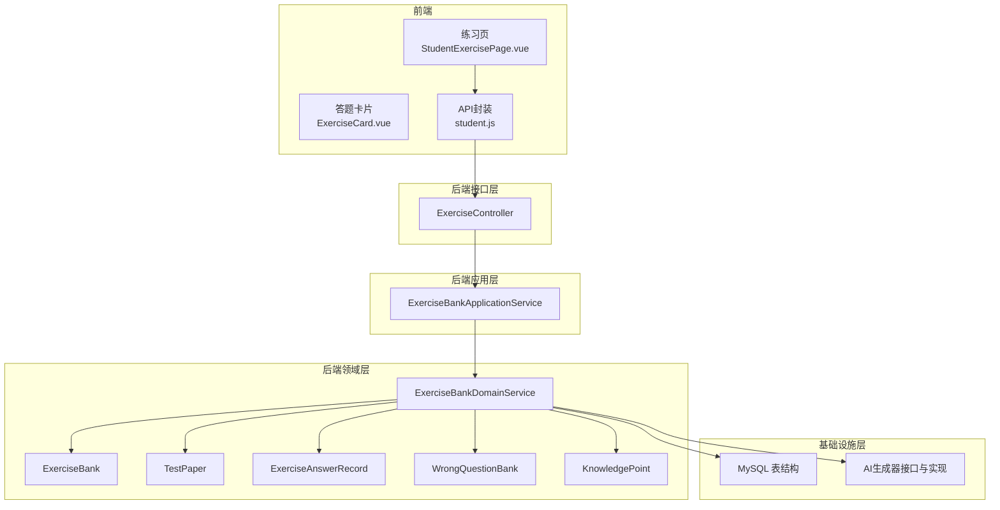
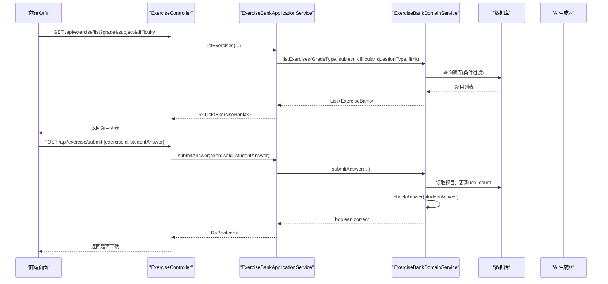
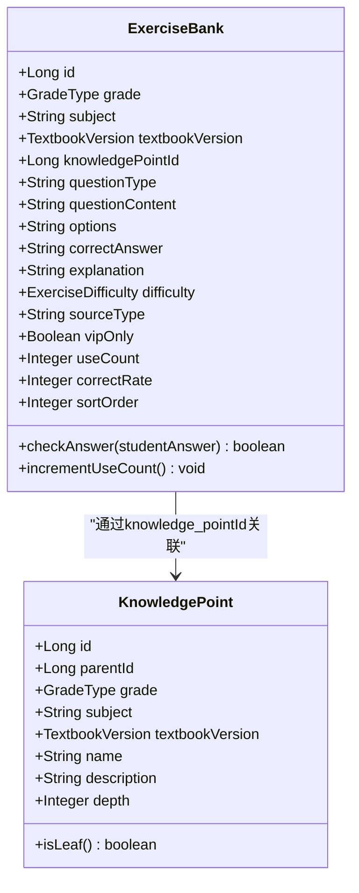
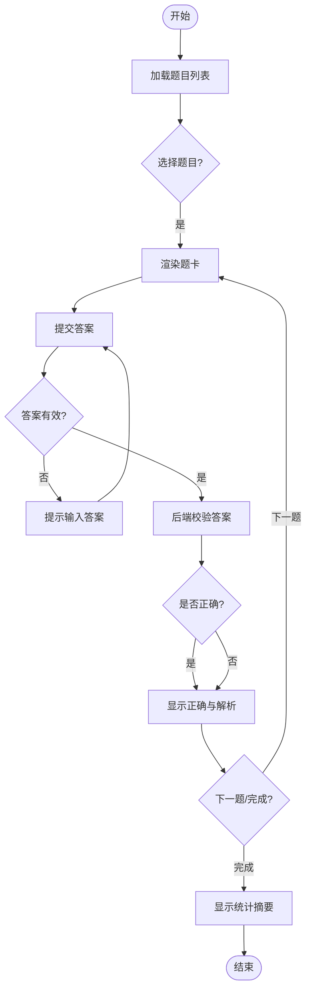
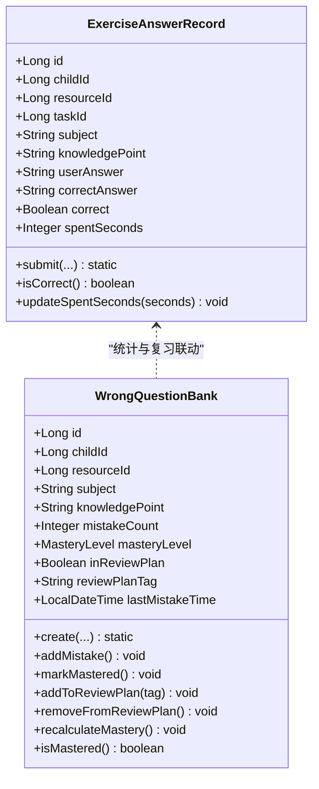
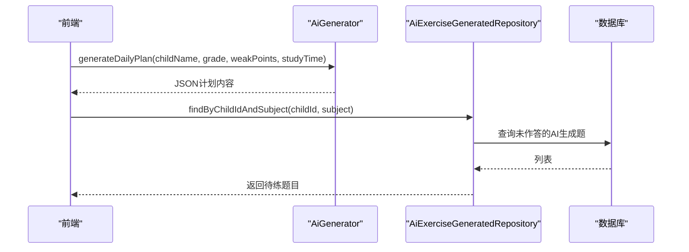
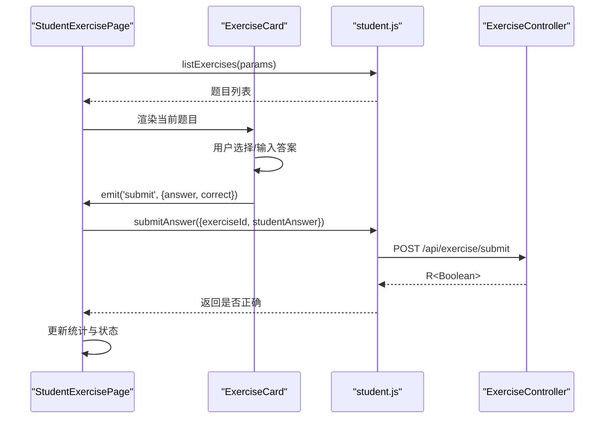
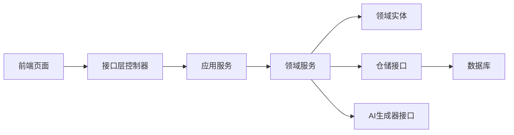

# 练习系统

<cite>
**本文引用的文件**
- [ExerciseController.java](file://wzoto-backend/wzoto-interfaces/src/main/java/com/wzoto/interfaces/controller/ExerciseController.java)
- [ExerciseBankApplicationService.java](file://wzoto-backend/wzoto-application/src/main/java/com/wzoto/application/service/ExerciseBankApplicationService.java)
- [ExerciseBankDomainService.java](file://wzoto-backend/wzoto-domain/src/main/java/com/wzoto/domain/service/ExerciseBankDomainService.java)
- [ExerciseBank.java](file://wzoto-backend/wzoto-domain/src/main/java/com/wzoto/domain/entity/ExerciseBank.java)
- [TestPaper.java](file://wzoto-backend/wzoto-domain/src/main/java/com/wzoto/domain/entity/TestPaper.java)
- [ExerciseAnswerRecord.java](file://wzoto-backend/wzoto-domain/src/main/java/com/wzoto/domain/entity/ExerciseAnswerRecord.java)
- [WrongQuestionBank.java](file://wzoto-backend/wzoto-domain/src/main/java/com/wzoto/domain/entity/WrongQuestionBank.java)
- [KnowledgePoint.java](file://wzoto-backend/wzoto-domain/src/main/java/com/wzoto/domain/entity/KnowledgePoint.java)
- [SubmitAnswerDTO.java](file://wzoto-backend/wzoto-interfaces/src/main/java/com/wzoto/interfaces/dto/SubmitAnswerDTO.java)
- [t_exercise_bank.sql](file://wzoto-backend/sql/t_exercise_bank.sql)
- [t_wrong_question_bank.sql](file://wzoto-backend/sql/t_wrong_question_bank.sql)
- [t_exercise_answer_record.sql](file://wzoto-backend/sql/t_exercise_answer_record.sql)
- [StudentExercisePage.vue](file://wzoto-frontend/src/pages/student/StudentExercisePage.vue)
- [ExerciseCard.vue](file://wzoto-frontend/src/pages/student/components/ExerciseCard.vue)
- [StudentWrongBookPage.vue](file://wzoto-frontend/src/pages/student/StudentWrongBookPage.vue)
- [student.js](file://wzoto-frontend/src/api/student.js)
- [MockAiGenerator.java](file://wzoto-backend/wzoto-infrastructure/src/main/java/com/wzoto/infrastructure/ai/MockAiGenerator.java)
- [AiExerciseGenerated.java](file://wzoto-backend/wzoto-domain/src/main/java/com/wzoto/domain/entity/AiExerciseGenerated.java)
- [AiGenerator.java](file://wzoto-backend/wzoto-domain/src/main/java/com/wzoto/domain/repository/AiGenerator.java)
</cite>

## 目录
1. [简介](#简介)
2. [项目结构](#项目结构)
3. [核心组件](#核心组件)
4. [架构总览](#架构总览)
5. [详细组件分析](#详细组件分析)
6. [依赖关系分析](#依赖关系分析)
7. [性能考虑](#性能考虑)
8. [故障排查指南](#故障排查指南)
9. [结论](#结论)
10. [附录：API接口文档](#附录api接口文档)

## 简介
本系统为“wzoto练习系统”，面向学生提供题库浏览、答题与即时反馈、错题本复习、AI智能出题与学习规划等能力。系统采用分层架构（接口层-应用层-领域层-基础设施层），前端基于Vue+Element Plus，后端基于Spring Boot。题库支持选择题、填空题、判断题等多种题型，具备难度分级、知识点关联、使用次数统计与正确率统计；答题流程支持题目随机抽取、答案提交验证与实时反馈；记录作答数据用于统计分析与个性化推荐；错题库自动收录错题并支持掌握度评估与复习计划标记；AI模块提供启发式答疑、学习计划生成、作文批改与口语评测等能力。

## 项目结构
- 后端分层
  - 接口层：REST控制器与DTO/VO定义
  - 应用层：编排业务流程，调用领域服务
  - 领域层：实体、值对象、领域服务与仓储接口
  - 基础设施层：MyBatis映射、AI实现、配置与工具
- 前端
  - 页面：练习页、错题本页等
  - 组件：ExerciseCard等可复用交互组件
  - API封装：统一请求与错误处理
- 数据库
  - 习题库、试卷、作答记录、错题库、知识点等表结构及索引

**图表来源**
- [ExerciseController.java:15-55](file://wzoto-backend/wzoto-interfaces/src/main/java/com/wzoto/interfaces/controller/ExerciseController.java#L15-L55)
- [ExerciseBankApplicationService.java:13-42](file://wzoto-backend/wzoto-application/src/main/java/com/wzoto/application/service/ExerciseBankApplicationService.java#L13-L42)
- [ExerciseBankDomainService.java:14-86](file://wzoto-backend/wzoto-domain/src/main/java/com/wzoto/domain/service/ExerciseBankDomainService.java#L14-L86)
- [ExerciseBank.java:13-51](file://wzoto-backend/wzoto-domain/src/main/java/com/wzoto/domain/entity/ExerciseBank.java#L13-L51)
- [TestPaper.java:13-46](file://wzoto-backend/wzoto-domain/src/main/java/com/wzoto/domain/entity/TestPaper.java#L13-L46)
- [ExerciseAnswerRecord.java:10-98](file://wzoto-backend/wzoto-domain/src/main/java/com/wzoto/domain/entity/ExerciseAnswerRecord.java#L10-L98)
- [WrongQuestionBank.java:11-132](file://wzoto-backend/wzoto-domain/src/main/java/com/wzoto/domain/entity/WrongQuestionBank.java#L11-L132)
- [KnowledgePoint.java:12-38](file://wzoto-backend/wzoto-domain/src/main/java/com/wzoto/domain/entity/KnowledgePoint.java#L12-L38)

**章节来源**
- [ExerciseController.java:15-55](file://wzoto-backend/wzoto-interfaces/src/main/java/com/wzoto/interfaces/controller/ExerciseController.java#L15-L55)
- [ExerciseBankApplicationService.java:13-42](file://wzoto-backend/wzoto-application/src/main/java/com/wzoto/application/service/ExerciseBankApplicationService.java#L13-L42)
- [ExerciseBankDomainService.java:14-86](file://wzoto-backend/wzoto-domain/src/main/java/com/wzoto/domain/service/ExerciseBankDomainService.java#L14-L86)

## 核心组件
- 题库管理
  - 题目类型：选择题、填空题、判断题（可扩展）
  - 难度分级：基础、提高、挑战
  - 知识点关联：通过knowledge_point_id关联知识点树
  - 统计指标：use_count、correct_rate
- 答题流程
  - 题目获取：按年级/学科/难度/题型筛选
  - 答案提交：服务端校验并返回是否正确
  - 实时反馈：前端根据返回结果展示对错与解析
- 答题记录与统计
  - 作答记录：childId、subject、knowledgePoint、userAnswer、correct、spentSeconds
  - 统计维度：正确率、用时、错题收集
- 智能出题
  - AI生成练习题：AiExerciseGenerated实体与AiGenerator接口
  - 自适应难度：结合薄弱点与掌握度调整
  - 个性化推荐：基于错题与知识掌握度推送练习
- 错题本
  - 自动收录：错误时创建或累计mistakeCount
  - 错误原因：记录wrong_answer与correct_answer
  - 复习计划：in_review_plan与reviewPlanTag

**章节来源**
- [ExerciseBank.java:20-51](file://wzoto-backend/wzoto-domain/src/main/java/com/wzoto/domain/entity/ExerciseBank.java#L20-L51)
- [ExerciseAnswerRecord.java:18-98](file://wzoto-backend/wzoto-domain/src/main/java/com/wzoto/domain/entity/ExerciseAnswerRecord.java#L18-L98)
- [WrongQuestionBank.java:19-132](file://wzoto-backend/wzoto-domain/src/main/java/com/wzoto/domain/entity/WrongQuestionBank.java#L19-L132)
- [KnowledgePoint.java:20-38](file://wzoto-backend/wzoto-domain/src/main/java/com/wzoto/domain/entity/KnowledgePoint.java#L20-L38)
- [AiExerciseGenerated.java:20-46](file://wzoto-backend/wzoto-domain/src/main/java/com/wzoto/domain/entity/AiExerciseGenerated.java#L20-L46)
- [AiGenerator.java:7-36](file://wzoto-backend/wzoto-domain/src/main/java/com/wzoto/domain/repository/AiGenerator.java#L7-L36)

## 架构总览
系统遵循清晰的分层与职责分离：
- 接口层暴露REST端点，负责参数校验与响应包装
- 应用层编排用例，转换值对象并调用领域服务
- 领域层承载业务规则与实体行为
- 基础设施层提供持久化与AI能力

**图表来源**
- [ExerciseController.java:24-42](file://wzoto-backend/wzoto-interfaces/src/main/java/com/wzoto/interfaces/controller/ExerciseController.java#L24-L42)
- [ExerciseBankApplicationService.java:21-32](file://wzoto-backend/wzoto-application/src/main/java/com/wzoto/application/service/ExerciseBankApplicationService.java#L21-L32)
- [ExerciseBankDomainService.java:25-57](file://wzoto-backend/wzoto-domain/src/main/java/com/wzoto/domain/service/ExerciseBankDomainService.java#L25-L57)
- [ExerciseBank.java:41-50](file://wzoto-backend/wzoto-domain/src/main/java/com/wzoto/domain/entity/ExerciseBank.java#L41-L50)

## 详细组件分析

### 题库管理与题目模型
- 字段与约束
  - 年级、学科、教材版本、知识点ID、题型、题干、选项、正确答案、解析、难度、来源类型、是否VIP、使用次数、正确率、排序号
- 行为
  - 答案校验：忽略大小写比较
  - 使用次数自增
- 索引优化
  - 年级+学科、知识点ID、题型、难度、来源类型、VIP标识

**图表来源**
- [ExerciseBank.java:20-51](file://wzoto-backend/wzoto-domain/src/main/java/com/wzoto/domain/entity/ExerciseBank.java#L20-L51)
- [KnowledgePoint.java:20-38](file://wzoto-backend/wzoto-domain/src/main/java/com/wzoto/domain/entity/KnowledgePoint.java#L20-L38)

**章节来源**
- [t_exercise_bank.sql:4-30](file://wzoto-backend/sql/t_exercise_bank.sql#L4-L30)
- [ExerciseBank.java:20-51](file://wzoto-backend/wzoto-domain/src/main/java/com/wzoto/domain/entity/ExerciseBank.java#L20-L51)

### 答题流程与实时反馈
- 前端交互
  - 选择年级/学科/难度后加载题目列表
  - 进入答题模式，显示进度条与题卡
  - 提交答案后本地即时判断并展示对错与解析
  - 完成后汇总正确/错误数量，支持“再来一组”
- 后端校验
  - 接收exerciseId与studentAnswer
  - 读取题目并比对答案，更新use_count
  - 返回布尔结果供前端展示

**图表来源**
- [StudentExercisePage.vue:118-191](file://wzoto-frontend/src/pages/student/StudentExercisePage.vue#L118-L191)
- [ExerciseCard.vue:116-123](file://wzoto-frontend/src/pages/student/components/ExerciseCard.vue#L116-L123)
- [ExerciseController.java:38-42](file://wzoto-backend/wzoto-interfaces/src/main/java/com/wzoto/interfaces/controller/ExerciseController.java#L38-L42)
- [ExerciseBankDomainService.java:47-57](file://wzoto-backend/wzoto-domain/src/main/java/com/wzoto/domain/service/ExerciseBankDomainService.java#L47-L57)

**章节来源**
- [StudentExercisePage.vue:8-86](file://wzoto-frontend/src/pages/student/StudentExercisePage.vue#L8-L86)
- [ExerciseCard.vue:1-69](file://wzoto-frontend/src/pages/student/components/ExerciseCard.vue#L1-L69)
- [ExerciseController.java:24-42](file://wzoto-backend/wzoto-interfaces/src/main/java/com/wzoto/interfaces/controller/ExerciseController.java#L24-L42)
- [ExerciseBankDomainService.java:25-57](file://wzoto-backend/wzoto-domain/src/main/java/com/wzoto/domain/service/ExerciseBankDomainService.java#L25-L57)

### 答题记录统计与错题本
- 作答记录
  - 记录childId、resourceId/questionId、subject、knowledgePoint、answer、correct、cost_seconds
  - 用于正确率与用时统计
- 错题本
  - 自动收录：错误时创建或累计mistakeCount
  - 掌握度：NOT_MASTERED/GENERAL/PROFICIENT，依据错误次数动态计算
  - 复习计划：可标记加入复习计划并记录标签
  - 前端支持重新做题与标记已掌握

**图表来源**
- [ExerciseAnswerRecord.java:18-98](file://wzoto-backend/wzoto-domain/src/main/java/com/wzoto/domain/entity/ExerciseAnswerRecord.java#L18-L98)
- [WrongQuestionBank.java:19-132](file://wzoto-backend/wzoto-domain/src/main/java/com/wzoto/domain/entity/WrongQuestionBank.java#L19-L132)

**章节来源**
- [t_exercise_answer_record.sql:4-22](file://wzoto-backend/sql/t_exercise_answer_record.sql#L4-L22)
- [t_wrong_question_bank.sql:4-27](file://wzoto-backend/sql/t_wrong_question_bank.sql#L4-L27)
- [StudentWrongBookPage.vue:89-127](file://wzoto-frontend/src/pages/student/StudentWrongBookPage.vue#L89-L127)

### 智能出题与个性化推荐
- AI生成练习题
  - 实体AiExerciseGenerated包含childId、subject、grade、knowledgePoint、questionContent、correctAnswer、aiExplanation、difficulty、answered/isCorrect等
  - 接口AiGenerator提供启发式答疑、错题分析、学习计划生成、作文批改、口语评测等方法
  - 基础设施层MockAiGenerator提供模拟实现，便于开发与演示
- 自适应难度与推荐
  - 基于错题与薄弱点生成针对性练习
  - 结合掌握度与错误次数调整难度与内容

**图表来源**
- [AiGenerator.java:7-36](file://wzoto-backend/wzoto-domain/src/main/java/com/wzoto/domain/repository/AiGenerator.java#L7-L36)
- [AiExerciseGenerated.java:20-46](file://wzoto-backend/wzoto-domain/src/main/java/com/wzoto/domain/entity/AiExerciseGenerated.java#L20-L46)
- [MockAiGenerator.java:212-236](file://wzoto-backend/wzoto-infrastructure/src/main/java/com/wzoto/infrastructure/ai/MockAiGenerator.java#L212-L236)

**章节来源**
- [AiExerciseGenerated.java:20-46](file://wzoto-backend/wzoto-domain/src/main/java/com/wzoto/domain/entity/AiExerciseGenerated.java#L20-L46)
- [AiGenerator.java:7-36](file://wzoto-backend/wzoto-domain/src/main/java/com/wzoto/domain/repository/AiGenerator.java#L7-L36)
- [MockAiGenerator.java:212-236](file://wzoto-backend/wzoto-infrastructure/src/main/java/com/wzoto/infrastructure/ai/MockAiGenerator.java#L212-L236)

### 前端答题界面组件与交互逻辑
- 页面：StudentExercisePage
  - 筛选栏：年级、学科、难度
  - 答题模式：进度条、题卡、操作按钮、结果摘要
  - 试卷入口：查看与加载试卷（占位）
- 组件：ExerciseCard
  - 题型渲染：选择题、填空题、判断题
  - 提交与反馈：禁用编辑、显示对错与解析
  - 事件：emit('submit', {answer, correct})
- API封装：student.js
  - listExercises、submitAnswer、listTestPapers、getTestPaper等

**图表来源**
- [StudentExercisePage.vue:118-191](file://wzoto-frontend/src/pages/student/StudentExercisePage.vue#L118-L191)
- [ExerciseCard.vue:116-123](file://wzoto-frontend/src/pages/student/components/ExerciseCard.vue#L116-L123)
- [student.js:51-65](file://wzoto-frontend/src/api/student.js#L51-L65)
- [ExerciseController.java:38-42](file://wzoto-backend/wzoto-interfaces/src/main/java/com/wzoto/interfaces/controller/ExerciseController.java#L38-L42)

**章节来源**
- [StudentExercisePage.vue:8-86](file://wzoto-frontend/src/pages/student/StudentExercisePage.vue#L8-L86)
- [ExerciseCard.vue:1-69](file://wzoto-frontend/src/pages/student/components/ExerciseCard.vue#L1-L69)
- [student.js:51-65](file://wzoto-frontend/src/api/student.js#L51-L65)

## 依赖关系分析
- 控制器依赖应用服务，应用服务依赖领域服务
- 领域服务依赖仓储接口与实体
- 前端通过API封装调用后端接口
- AI能力通过接口抽象，由基础设施层实现

**图表来源**
- [ExerciseController.java:15-55](file://wzoto-backend/wzoto-interfaces/src/main/java/com/wzoto/interfaces/controller/ExerciseController.java#L15-L55)
- [ExerciseBankApplicationService.java:13-42](file://wzoto-backend/wzoto-application/src/main/java/com/wzoto/application/service/ExerciseBankApplicationService.java#L13-L42)
- [ExerciseBankDomainService.java:14-86](file://wzoto-backend/wzoto-domain/src/main/java/com/wzoto/domain/service/ExerciseBankDomainService.java#L14-L86)
- [AiGenerator.java:7-36](file://wzoto-backend/wzoto-domain/src/main/java/com/wzoto/domain/repository/AiGenerator.java#L7-L36)

**章节来源**
- [ExerciseController.java:15-55](file://wzoto-backend/wzoto-interfaces/src/main/java/com/wzoto/interfaces/controller/ExerciseController.java#L15-L55)
- [ExerciseBankApplicationService.java:13-42](file://wzoto-backend/wzoto-application/src/main/java/com/wzoto/application/service/ExerciseBankApplicationService.java#L13-L42)
- [ExerciseBankDomainService.java:14-86](file://wzoto-backend/wzoto-domain/src/main/java/com/wzoto/domain/service/ExerciseBankDomainService.java#L14-L86)

## 性能考虑
- 查询优化
  - 利用索引：年级+学科、知识点ID、题型、难度、来源类型、VIP标识
  - 限制返回数量：limit参数控制批量加载
- 写入优化
  - 使用次数与正确率增量更新，避免全量覆盖
- 前端体验
  - 分页与懒加载：建议对题目列表进行分页
  - 缓存策略：对静态资源与热门题目做短期缓存
- AI能力
  - 异步生成与队列：避免阻塞主流程
  - Mock优先：开发阶段使用Mock实现降低外部依赖

[本节为通用指导，不直接分析具体文件]

## 故障排查指南
- 题目不存在
  - 现象：提交答案时报错
  - 定位：检查exerciseId是否存在于题库
  - 参考：领域服务在获取题目时的空值校验
- 答案为空
  - 现象：提交失败
  - 定位：前端校验与后端DTO校验
  - 参考：SubmitAnswerDTO的NotBlank注解
- 耗时为负数
  - 现象：更新耗时抛异常
  - 定位：领域实体的耗时校验
  - 参考：ExerciseAnswerRecord.updateSpentSeconds
- 错题本无数据
  - 现象：错题列表为空
  - 定位：确认是否有错误作答记录与入库
  - 参考：错题实体创建与错误次数累计逻辑

**章节来源**
- [ExerciseBankDomainService.java:33-42](file://wzoto-backend/wzoto-domain/src/main/java/com/wzoto/domain/service/ExerciseBankDomainService.java#L33-L42)
- [SubmitAnswerDTO.java:7-14](file://wzoto-backend/wzoto-interfaces/src/main/java/com/wzoto/interfaces/dto/SubmitAnswerDTO.java#L7-L14)
- [ExerciseAnswerRecord.java:89-98](file://wzoto-backend/wzoto-domain/src/main/java/com/wzoto/domain/entity/ExerciseAnswerRecord.java#L89-L98)
- [WrongQuestionBank.java:62-87](file://wzoto-backend/wzoto-domain/src/main/java/com/wzoto/domain/entity/WrongQuestionBank.java#L62-L87)

## 结论
本练习系统以清晰的层次架构支撑题库管理、答题流程、统计分析与智能出题等核心能力。通过知识点关联与难度分级，满足多样化学习需求；作答记录与错题本为个性化推荐与复习提供数据基础；AI模块进一步增强了学习路径的智能化与个性化。建议在后续迭代中完善分页、缓存与异步AI生成，以提升性能与用户体验。

[本节为总结性内容，不直接分析具体文件]

## 附录：API接口文档
- 题目相关
  - 获取题目列表
    - 方法：GET
    - 路径：/api/exercise/list
    - 参数：grade（可选）、subject（可选）、difficulty（可选）、questionType（可选）、limit（默认20）
    - 返回：R<List<ExerciseBank>>
  - 获取题目详情
    - 方法：GET
    - 路径：/api/exercise/{id}
    - 返回：R<ExerciseBank>
  - 提交答案
    - 方法：POST
    - 路径：/api/exercise/submit
    - 请求体：{ exerciseId, studentAnswer }
    - 返回：R<Boolean>
  - 获取试卷详情
    - 方法：GET
    - 路径：/api/exercise/paper/{id}
    - 返回：R<TestPaper>
  - 获取试卷列表
    - 方法：GET
    - 路径：/api/exercise/paper/list
    - 参数：grade（可选）、subject（可选）、paperType（可选）
    - 返回：R<List<TestPaper>>

- 前端API封装
  - 列表与提交：listExercises、submitAnswer、listTestPapers、getTestPaper
  - 微课与知识点：listCourses、getCourseDetail、reportCourseProgress、getRecommendedCourses、getKnowledgeTree、getKnowledgeMastery

**章节来源**
- [ExerciseController.java:24-54](file://wzoto-backend/wzoto-interfaces/src/main/java/com/wzoto/interfaces/controller/ExerciseController.java#L24-L54)
- [student.js:51-94](file://wzoto-frontend/src/api/student.js#L51-L94)