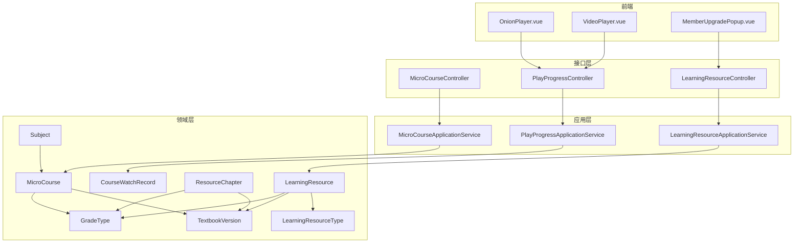
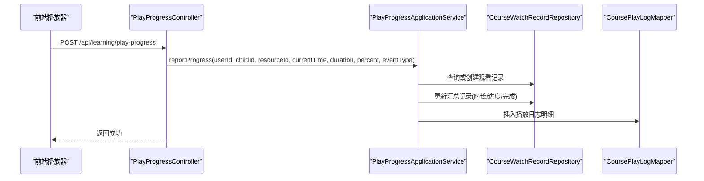
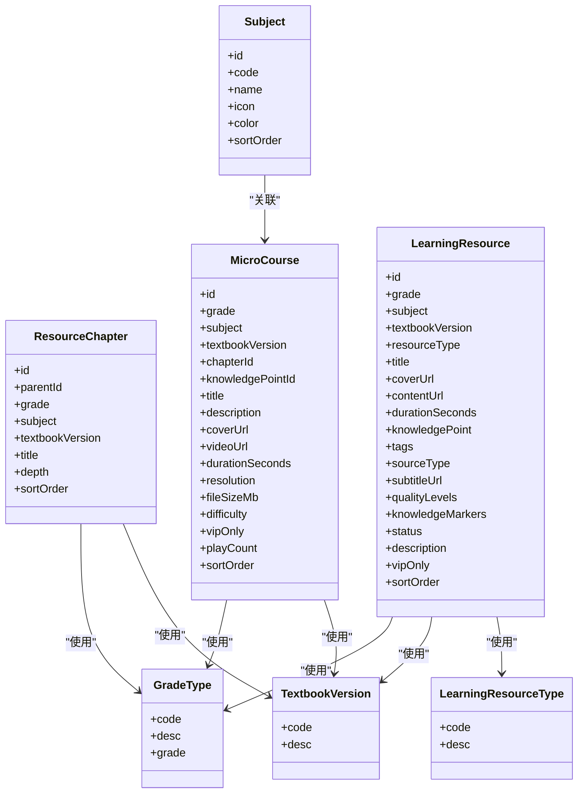
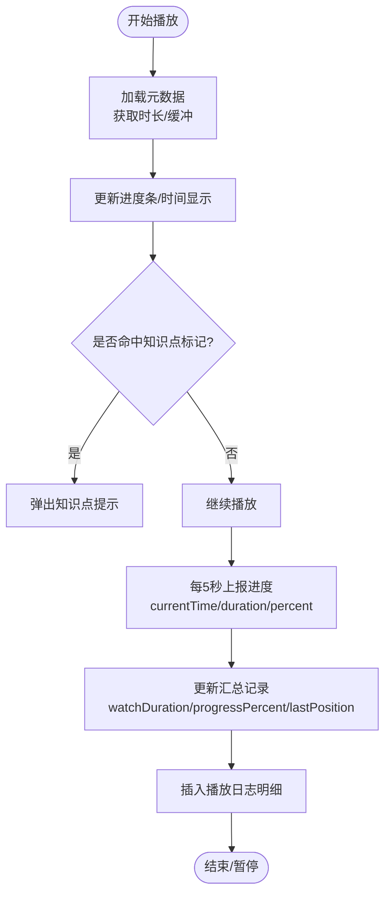
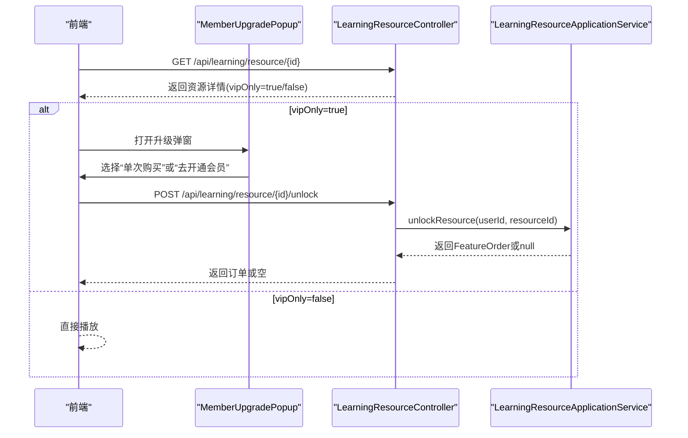
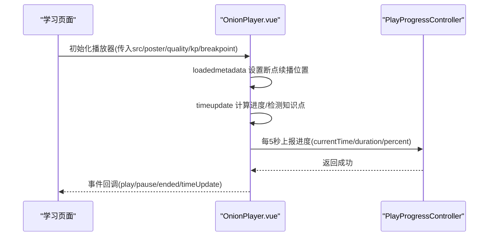
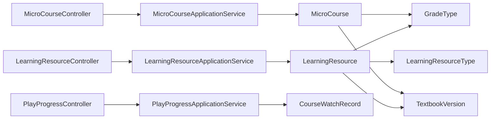

# 课程管理

<cite>
**本文引用的文件**
- [MicroCourse.java](file://wzoto-backend/wzoto-domain/src/main/java/com/wzoto/domain/entity/MicroCourse.java)
- [LearningResource.java](file://wzoto-backend/wzoto-domain/src/main/java/com/wzoto/domain/entity/LearningResource.java)
- [ResourceChapter.java](file://wzoto-backend/wzoto-domain/src/main/java/com/wzoto/domain/entity/ResourceChapter.java)
- [CourseWatchRecord.java](file://wzoto-backend/wzoto-domain/src/main/java/com/wzoto/domain/entity/CourseWatchRecord.java)
- [Subject.java](file://wzoto-backend/wzoto-domain/src/main/java/com/wzoto/domain/entity/Subject.java)
- [GradeType.java](file://wzoto-backend/wzoto-domain/src/main/java/com/wzoto/domain/valobj/GradeType.java)
- [TextbookVersion.java](file://wzoto-backend/wzoto-domain/src/main/java/com/wzoto/domain/valobj/TextbookVersion.java)
- [LearningResourceType.java](file://wzoto-backend/wzoto-domain/src/main/java/com/wzoto/domain/valobj/LearningResourceType.java)
- [MicroCourseApplicationService.java](file://wzoto-backend/wzoto-application/src/main/java/com/wzoto/application/service/MicroCourseApplicationService.java)
- [LearningResourceApplicationService.java](file://wzoto-backend/wzoto-application/src/main/java/com/wzoto/application/service/LearningResourceApplicationService.java)
- [PlayProgressApplicationService.java](file://wzoto-backend/wzoto-application/src/main/java/com/wzoto/application/service/PlayProgressApplicationService.java)
- [MicroCourseController.java](file://wzoto-backend/wzoto-interfaces/src/main/java/com/wzoto/interfaces/controller/MicroCourseController.java)
- [LearningResourceController.java](file://wzoto-backend/wzoto-interfaces/src/main/java/com/wzoto/interfaces/controller/LearningResourceController.java)
- [PlayProgressController.java](file://wzoto-backend/wzoto-interfaces/src/main/java/com/wzoto/interfaces/controller/PlayProgressController.java)
- [OnionPlayer.vue](file://wzoto-frontend/src/components/OnionPlayer.vue)
- [VideoPlayer.vue](file://wzoto-frontend/src/pages/student/components/VideoPlayer.vue)
- [MemberUpgradePopup.vue](file://wzoto-frontend/src/components/MemberUpgradePopup.vue)
- [init_all_learning_tables.sql](file://wzoto-backend/sql/init_all_learning_tables.sql)
</cite>

## 目录
1. [简介](#简介)
2. [项目结构](#项目结构)
3. [核心组件](#核心组件)
4. [架构总览](#架构总览)
5. [详细组件分析](#详细组件分析)
6. [依赖关系分析](#依赖关系分析)
7. [性能考虑](#性能考虑)
8. [故障排查指南](#故障排查指南)
9. [结论](#结论)
10. [附录：API接口文档](#附录api接口文档)

## 简介
本文件为 wzoto 课程管理系统的详细技术文档，聚焦微课课程体系、资源管理、播放与进度跟踪、VIP解锁机制以及前后端集成方式。内容覆盖学科分类（语文、数学、英语等）、年级划分（小学1-6年级）、教材版本适配；视频上传处理、章节组织、封面存储；播放进度跟踪、断点续播、多清晰度支持；VIP权限控制、免费内容展示、付费购买流程；并提供完整API接口说明与前端播放器集成示例及优化建议。

## 项目结构
系统采用分层架构：
- 领域层（domain）：定义实体、值对象与领域行为（如微课、学习资源、观看记录、学科、章节、年级、教材版本）。
- 应用层（application）：编排业务流程（课程列表、详情、推荐、播放进度上报、资源解锁）。
- 基础设施层（infrastructure）：数据持久化与外部服务（MyBatis Mapper、PO映射、工具类）。
- 接口层（interfaces）：REST控制器暴露API。
- 前端（frontend）：Vue组件封装播放器、会员弹窗、页面路由与状态管理。

图表来源
- [MicroCourseController.java:1-46](file://wzoto-backend/wzoto-interfaces/src/main/java/com/wzoto/interfaces/controller/MicroCourseController.java#L1-L46)
- [LearningResourceController.java:1-79](file://wzoto-backend/wzoto-interfaces/src/main/java/com/wzoto/interfaces/controller/LearningResourceController.java#L1-L79)
- [PlayProgressController.java:1-69](file://wzoto-backend/wzoto-interfaces/src/main/java/com/wzoto/interfaces/controller/PlayProgressController.java#L1-L69)
- [MicroCourseApplicationService.java:1-39](file://wzoto-backend/wzoto-application/src/main/java/com/wzoto/application/service/MicroCourseApplicationService.java#L1-L39)
- [LearningResourceApplicationService.java:1-40](file://wzoto-backend/wzoto-application/src/main/java/com/wzoto/application/service/LearningResourceApplicationService.java#L1-L40)
- [PlayProgressApplicationService.java:1-76](file://wzoto-backend/wzoto-application/src/main/java/com/wzoto/application/service/PlayProgressApplicationService.java#L1-L76)
- [MicroCourse.java:1-52](file://wzoto-backend/wzoto-domain/src/main/java/com/wzoto/domain/entity/MicroCourse.java#L1-L52)
- [LearningResource.java:1-153](file://wzoto-backend/wzoto-domain/src/main/java/com/wzoto/domain/entity/LearningResource.java#L1-L153)
- [ResourceChapter.java:1-32](file://wzoto-backend/wzoto-domain/src/main/java/com/wzoto/domain/entity/ResourceChapter.java#L1-L32)
- [CourseWatchRecord.java:1-120](file://wzoto-backend/wzoto-domain/src/main/java/com/wzoto/domain/entity/CourseWatchRecord.java#L1-L120)
- [Subject.java:1-28](file://wzoto-backend/wzoto-domain/src/main/java/com/wzoto/domain/entity/Subject.java#L1-L28)
- [GradeType.java:1-46](file://wzoto-backend/wzoto-domain/src/main/java/com/wzoto/domain/valobj/GradeType.java#L1-L46)
- [TextbookVersion.java:1-36](file://wzoto-backend/wzoto-domain/src/main/java/com/wzoto/domain/valobj/TextbookVersion.java#L1-L36)
- [LearningResourceType.java:1-33](file://wzoto-backend/wzoto-domain/src/main/java/com/wzoto/domain/valobj/LearningResourceType.java#L1-L33)

章节来源
- [init_all_learning_tables.sql:1-31](file://wzoto-backend/sql/init_all_learning_tables.sql#L1-L31)

## 核心组件
- 微课实体 MicroCourse：承载课程标题、描述、封面、视频地址、时长、画质、难度、是否VIP、播放次数、排序等。
- 学习资源 LearningResource：统一抽象视频、练习、PDF、题目等资源，包含年级、学科、教材版本、类型、封面、内容URL、字幕、画质等级、知识点标记、状态、VIP限制、排序等。
- 章节 ResourceChapter：按年级、学科、教材版本组织树形章节结构。
- 观看记录 CourseWatchRecord：记录观看时长、进度百分比、最后位置、完成状态、首次/最后观看时间。
- 学科 Subject：学科元信息（编码、名称、图标、颜色、排序）。
- 值对象 GradeType、TextbookVersion、LearningResourceType：规范年级、教材版本、资源类型的枚举与转换。

章节来源
- [MicroCourse.java:1-52](file://wzoto-backend/wzoto-domain/src/main/java/com/wzoto/domain/entity/MicroCourse.java#L1-L52)
- [LearningResource.java:1-153](file://wzoto-backend/wzoto-domain/src/main/java/com/wzoto/domain/entity/LearningResource.java#L1-L153)
- [ResourceChapter.java:1-32](file://wzoto-backend/wzoto-domain/src/main/java/com/wzoto/domain/entity/ResourceChapter.java#L1-L32)
- [CourseWatchRecord.java:1-120](file://wzoto-backend/wzoto-domain/src/main/java/com/wzoto/domain/entity/CourseWatchRecord.java#L1-L120)
- [Subject.java:1-28](file://wzoto-backend/wzoto-domain/src/main/java/com/wzoto/domain/entity/Subject.java#L1-L28)
- [GradeType.java:1-46](file://wzoto-backend/wzoto-domain/src/main/java/com/wzoto/domain/valobj/GradeType.java#L1-L46)
- [TextbookVersion.java:1-36](file://wzoto-backend/wzoto-domain/src/main/java/com/wzoto/domain/valobj/TextbookVersion.java#L1-L36)
- [LearningResourceType.java:1-33](file://wzoto-backend/wzoto-domain/src/main/java/com/wzoto/domain/valobj/LearningResourceType.java#L1-L33)

## 架构总览
系统通过控制器接收请求，调用应用服务进行业务编排，最终访问领域模型与仓储实现数据持久化。前端播放器组件负责交互、进度上报与断点续播。

图表来源
- [PlayProgressController.java:1-69](file://wzoto-backend/wzoto-interfaces/src/main/java/com/wzoto/interfaces/controller/PlayProgressController.java#L1-L69)
- [PlayProgressApplicationService.java:1-76](file://wzoto-backend/wzoto-application/src/main/java/com/wzoto/application/service/PlayProgressApplicationService.java#L1-L76)

## 详细组件分析

### 微课课程体系与资源管理
- 学科分类：通过 Subject 实体与 LearningResource.subject 字段标识（如语文、数学、英语）。
- 年级划分：使用 GradeType 枚举，覆盖小学一年级至六年级。
- 教材版本适配：TextbookVersion 枚举提供人教版、北师大版、冀教版、苏教版、外研版、沪教版、其他等版本。
- 章节组织：ResourceChapter 以 parentId、depth、sortOrder 构建层级章节，按年级、学科、教材版本聚合。
- 资源类型：LearningResourceType 区分动画微课、互动练习、PDF资料、题库题目。
- 微课属性：MicroCourse 包含视频URL、封面URL、时长、画质、难度、VIP限制、播放次数、排序等。
- 资源元数据：LearningResource 支持字幕URL、画质等级JSON、知识点标记JSON、来源类型（MP4/B站/智慧教育平台/自定义）。

图表来源
- [Subject.java:1-28](file://wzoto-backend/wzoto-domain/src/main/java/com/wzoto/domain/entity/Subject.java#L1-L28)
- [GradeType.java:1-46](file://wzoto-backend/wzoto-domain/src/main/java/com/wzoto/domain/valobj/GradeType.java#L1-L46)
- [TextbookVersion.java:1-36](file://wzoto-backend/wzoto-domain/src/main/java/com/wzoto/domain/valobj/TextbookVersion.java#L1-L36)
- [LearningResourceType.java:1-33](file://wzoto-backend/wzoto-domain/src/main/java/com/wzoto/domain/valobj/LearningResourceType.java#L1-L33)
- [ResourceChapter.java:1-32](file://wzoto-backend/wzoto-domain/src/main/java/com/wzoto/domain/entity/ResourceChapter.java#L1-L32)
- [MicroCourse.java:1-52](file://wzoto-backend/wzoto-domain/src/main/java/com/wzoto/domain/entity/MicroCourse.java#L1-L52)
- [LearningResource.java:1-153](file://wzoto-backend/wzoto-domain/src/main/java/com/wzoto/domain/entity/LearningResource.java#L1-L153)

章节来源
- [LearningResource.java:1-153](file://wzoto-backend/wzoto-domain/src/main/java/com/wzoto/domain/entity/LearningResource.java#L1-L153)
- [MicroCourse.java:1-52](file://wzoto-backend/wzoto-domain/src/main/java/com/wzoto/domain/entity/MicroCourse.java#L1-L52)
- [ResourceChapter.java:1-32](file://wzoto-backend/wzoto-domain/src/main/java/com/wzoto/domain/entity/ResourceChapter.java#L1-L32)

### 播放功能：进度跟踪、断点续播、多清晰度
- 进度跟踪：前端每5秒触发上报，后端写入汇总记录与明细日志。
- 断点续播：根据 lastPositionSeconds 恢复播放位置。
- 多清晰度：qualityLevels JSON 配置多路视频源，前端切换时保持当前时间与播放状态。

图表来源
- [OnionPlayer.vue:164-538](file://wzoto-frontend/src/components/OnionPlayer.vue#L164-L538)
- [PlayProgressApplicationService.java:1-76](file://wzoto-backend/wzoto-application/src/main/java/com/wzoto/application/service/PlayProgressApplicationService.java#L1-L76)

章节来源
- [OnionPlayer.vue:164-538](file://wzoto-frontend/src/components/OnionPlayer.vue#L164-L538)
- [PlayProgressApplicationService.java:1-76](file://wzoto-backend/wzoto-application/src/main/java/com/wzoto/application/service/PlayProgressApplicationService.java#L1-L76)

### VIP权限控制与解锁机制
- 资源标记：LearningResource.vipOnly 与 MicroCourse.vipOnly 标识是否为VIP资源。
- 解锁流程：前端检测到VIP资源时弹出升级弹窗，用户可选择单次购买或开通会员；后端通过 unlockResource 接口生成订单并返回结果。
- 免费内容：非VIP资源可直接播放，无需解锁。

图表来源
- [LearningResourceController.java:1-79](file://wzoto-backend/wzoto-interfaces/src/main/java/com/wzoto/interfaces/controller/LearningResourceController.java#L1-L79)
- [LearningResourceApplicationService.java:1-40](file://wzoto-backend/wzoto-application/src/main/java/com/wzoto/application/service/LearningResourceApplicationService.java#L1-L40)
- [MemberUpgradePopup.vue:1-81](file://wzoto-frontend/src/components/MemberUpgradePopup.vue#L1-L81)

章节来源
- [LearningResourceController.java:1-79](file://wzoto-backend/wzoto-interfaces/src/main/java/com/wzoto/interfaces/controller/LearningResourceController.java#L1-L79)
- [LearningResourceApplicationService.java:1-40](file://wzoto-backend/wzoto-application/src/main/java/com/wzoto/application/service/LearningResourceApplicationService.java#L1-L40)
- [MemberUpgradePopup.vue:1-81](file://wzoto-frontend/src/components/MemberUpgradePopup.vue#L1-L81)

### 前端播放器组件集成示例
- OnionPlayer.vue：支持MP4/B站外链/智慧教育平台外链三种模式；具备字幕开关、倍速、画中画、全屏、知识点标记、多清晰度切换、断点续播、进度上报等能力。
- VideoPlayer.vue：轻量播放器，支持基础播放、进度上报、全屏、倍速。
- 集成要点：传入 src、poster、subtitleUrl、qualityLevels、knowledgeMarkers、breakpointSeconds、resourceId、childId；监听 progressReport 事件并调用后端上报接口。

图表来源
- [OnionPlayer.vue:164-538](file://wzoto-frontend/src/components/OnionPlayer.vue#L164-L538)
- [PlayProgressController.java:1-69](file://wzoto-backend/wzoto-interfaces/src/main/java/com/wzoto/interfaces/controller/PlayProgressController.java#L1-L69)

章节来源
- [OnionPlayer.vue:164-538](file://wzoto-frontend/src/components/OnionPlayer.vue#L164-L538)
- [VideoPlayer.vue:1-245](file://wzoto-frontend/src/pages/student/components/VideoPlayer.vue#L1-L245)

## 依赖关系分析
- 控制器依赖应用服务，应用服务依赖领域服务与仓储，领域实体依赖值对象。
- 播放进度上报链路：前端 -> PlayProgressController -> PlayProgressApplicationService -> 观看记录仓库与播放日志Mapper。
- 资源列表与详情：LearningResourceController -> LearningResourceApplicationService -> 领域服务 -> 资源仓储。
- 课程列表与详情：MicroCourseController -> MicroCourseApplicationService -> 领域服务 -> 课程仓储。

图表来源
- [LearningResourceController.java:1-79](file://wzoto-backend/wzoto-interfaces/src/main/java/com/wzoto/interfaces/controller/LearningResourceController.java#L1-L79)
- [MicroCourseController.java:1-46](file://wzoto-backend/wzoto-interfaces/src/main/java/com/wzoto/interfaces/controller/MicroCourseController.java#L1-L46)
- [PlayProgressController.java:1-69](file://wzoto-backend/wzoto-interfaces/src/main/java/com/wzoto/interfaces/controller/PlayProgressController.java#L1-L69)
- [LearningResourceApplicationService.java:1-40](file://wzoto-backend/wzoto-application/src/main/java/com/wzoto/application/service/LearningResourceApplicationService.java#L1-L40)
- [MicroCourseApplicationService.java:1-39](file://wzoto-backend/wzoto-application/src/main/java/com/wzoto/application/service/MicroCourseApplicationService.java#L1-L39)
- [PlayProgressApplicationService.java:1-76](file://wzoto-backend/wzoto-application/src/main/java/com/wzoto/application/service/PlayProgressApplicationService.java#L1-L76)
- [LearningResource.java:1-153](file://wzoto-backend/wzoto-domain/src/main/java/com/wzoto/domain/entity/LearningResource.java#L1-L153)
- [MicroCourse.java:1-52](file://wzoto-backend/wzoto-domain/src/main/java/com/wzoto/domain/entity/MicroCourse.java#L1-L52)
- [CourseWatchRecord.java:1-120](file://wzoto-backend/wzoto-domain/src/main/java/com/wzoto/domain/entity/CourseWatchRecord.java#L1-L120)
- [GradeType.java:1-46](file://wzoto-backend/wzoto-domain/src/main/java/com/wzoto/domain/valobj/GradeType.java#L1-L46)
- [TextbookVersion.java:1-36](file://wzoto-backend/wzoto-domain/src/main/java/com/wzoto/domain/valobj/TextbookVersion.java#L1-L36)
- [LearningResourceType.java:1-33](file://wzoto-backend/wzoto-domain/src/main/java/com/wzoto/domain/valobj/LearningResourceType.java#L1-L33)

## 性能考虑
- 进度上报频率：默认每5秒上报一次，避免频繁写库造成压力；可在高并发场景下合并上报或使用批量写入。
- 断点续播：仅在 loadedmetadata 后设置一次播放位置，减少重复seek。
- 多清晰度切换：切换时保留当前时间与播放状态，避免重新加载导致的卡顿。
- 知识点标记：在 timeupdate 中仅做简单数值比较，复杂度低；大量标记时可考虑节流或采样。
- 前端缓存：对资源列表与详情可做短期缓存，减少重复请求。
- 数据库索引：建议在观看记录表上针对 childId、resourceId 建立索引，提升查询效率。

[本节为通用性能建议，不直接分析具体文件]

## 故障排查指南
- 播放失败：检查视频URL有效性、跨域策略、浏览器兼容性；查看前端错误事件输出。
- 进度未保存：确认上报接口调用成功、参数正确（childId、resourceId、currentTime、duration、percent）；检查后端日志与数据库记录。
- 断点续播无效：确保后端返回的 lastPositionSeconds 有效且小于视频时长；前端在 loadedmetadata 后设置位置。
- VIP解锁异常：检查资源 vipOnly 标志、用户身份上下文、解锁接口返回；核对订单创建逻辑。
- 章节/资源筛选：验证年级、学科、教材版本参数是否正确；检查枚举转换逻辑。

章节来源
- [PlayProgressController.java:1-69](file://wzoto-backend/wzoto-interfaces/src/main/java/com/wzoto/interfaces/controller/PlayProgressController.java#L1-L69)
- [PlayProgressApplicationService.java:1-76](file://wzoto-backend/wzoto-application/src/main/java/com/wzoto/application/service/PlayProgressApplicationService.java#L1-L76)
- [OnionPlayer.vue:164-538](file://wzoto-frontend/src/components/OnionPlayer.vue#L164-L538)

## 结论
wzoto 课程管理系统围绕微课与学习资源构建了完整的体系：以领域模型为核心，结合应用服务编排与接口层暴露，实现了课程分类、章节组织、资源管理、播放进度跟踪、断点续播、多清晰度支持与VIP解锁机制。前端播放器组件提供了丰富的交互能力与良好的用户体验。后续可进一步优化上报策略、扩展更多教材版本与资源类型，并增强数据分析与推荐能力。

## 附录：API接口文档

### 课程相关接口
- 课程列表查询
  - 路径：GET /api/course/list
  - 参数：grade（可选，年级代码）、subject（可选，学科）、vipOnly（可选，是否仅VIP）
  - 返回：课程列表（MicroCourse）
  - 说明：支持按年级、学科、VIP过滤；用于课程目录展示。

- 课程详情获取
  - 路径：GET /api/course/{id}
  - 参数：id（课程ID）
  - 返回：课程详情（MicroCourse）
  - 说明：用于播放页加载课程信息与播放地址。

- 课程进度上报（BI埋点）
  - 路径：POST /api/course/progress
  - 参数：courseId（课程ID）
  - 返回：课程对象（MicroCourse）
  - 说明：用于统计课程级别的学习行为。

- 课程推荐
  - 路径：GET /api/course/recommend/{childId}
  - 参数：childId（子女ID）、limit（默认10）
  - 返回：推荐课程列表（MicroCourse）
  - 说明：基于子女ID推荐课程。

章节来源
- [MicroCourseController.java:1-46](file://wzoto-backend/wzoto-interfaces/src/main/java/com/wzoto/interfaces/controller/MicroCourseController.java#L1-L46)
- [MicroCourseApplicationService.java:1-39](file://wzoto-backend/wzoto-application/src/main/java/com/wzoto/application/service/MicroCourseApplicationService.java#L1-L39)

### 学习资源相关接口
- 资源列表查询
  - 路径：GET /api/learning/resources
  - 参数：childId（必填）、subject（可选）、resourceType（可选）、includeVip（可选）
  - 返回：资源列表（LearningResourceVO）
  - 说明：支持按学科、类型、VIP过滤；用于学习首页与目录。

- 资源详情获取
  - 路径：GET /api/learning/resource/{id}
  - 参数：id（资源ID）
  - 返回：资源详情（LearningResourceVO）
  - 说明：包含封面、内容URL、字幕、画质等级、知识点标记、VIP标志等。

- 资源解锁
  - 路径：POST /api/learning/resource/{id}/unlock
  - 参数：id（资源ID）
  - 返回：FeatureOrder（可为空）
  - 说明：对VIP资源进行解锁，返回订单或空表示已解锁。

章节来源
- [LearningResourceController.java:1-79](file://wzoto-backend/wzoto-interfaces/src/main/java/com/wzoto/interfaces/controller/LearningResourceController.java#L1-L79)
- [LearningResourceApplicationService.java:1-40](file://wzoto-backend/wzoto-application/src/main/java/com/wzoto/application/service/LearningResourceApplicationService.java#L1-L40)

### 播放进度相关接口
- 上报播放进度
  - 路径：POST /api/learning/play-progress
  - 请求体：{ childId, resourceId, currentTime, duration, percent, eventType }
  - 返回：布尔（true）
  - 说明：每5秒上报一次，更新汇总记录与播放日志明细。

- 获取断点位置
  - 路径：GET /api/learning/play-progress/{resourceId}?childId=xxx
  - 返回：PlayProgressVO（lastPositionSeconds、progressPercent、completed、watchDurationSeconds）
  - 说明：用于断点续播，若不存在则返回默认值。

章节来源
- [PlayProgressController.java:1-69](file://wzoto-backend/wzoto-interfaces/src/main/java/com/wzoto/interfaces/controller/PlayProgressController.java#L1-L69)
- [PlayProgressApplicationService.java:1-76](file://wzoto-backend/wzoto-application/src/main/java/com/wzoto/application/service/PlayProgressApplicationService.java#L1-L76)