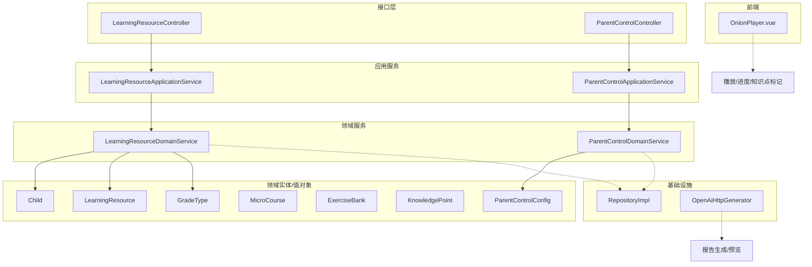
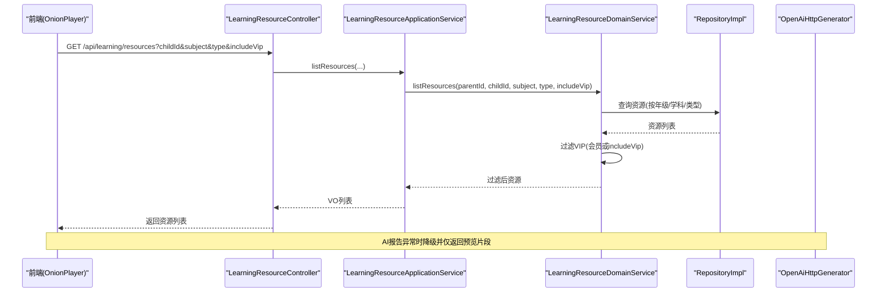
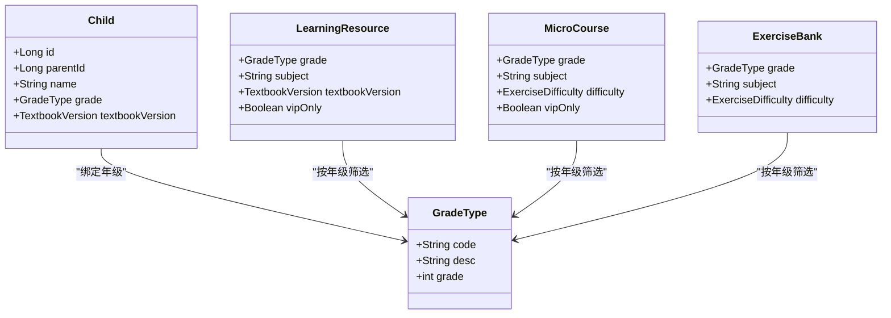
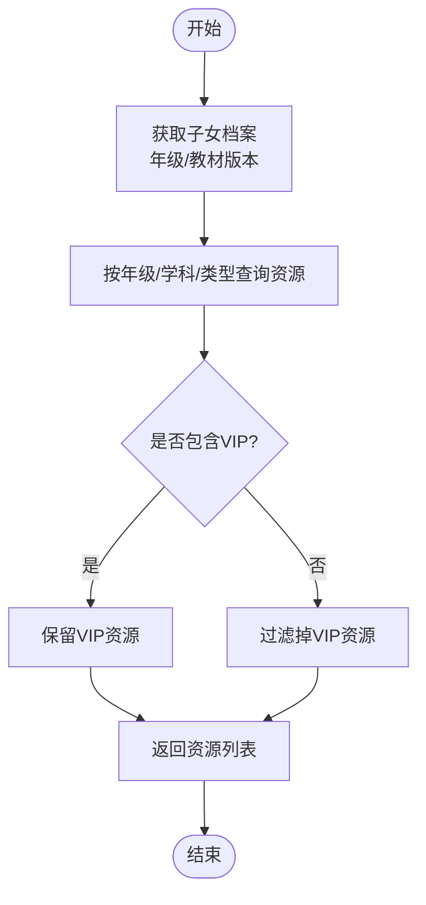
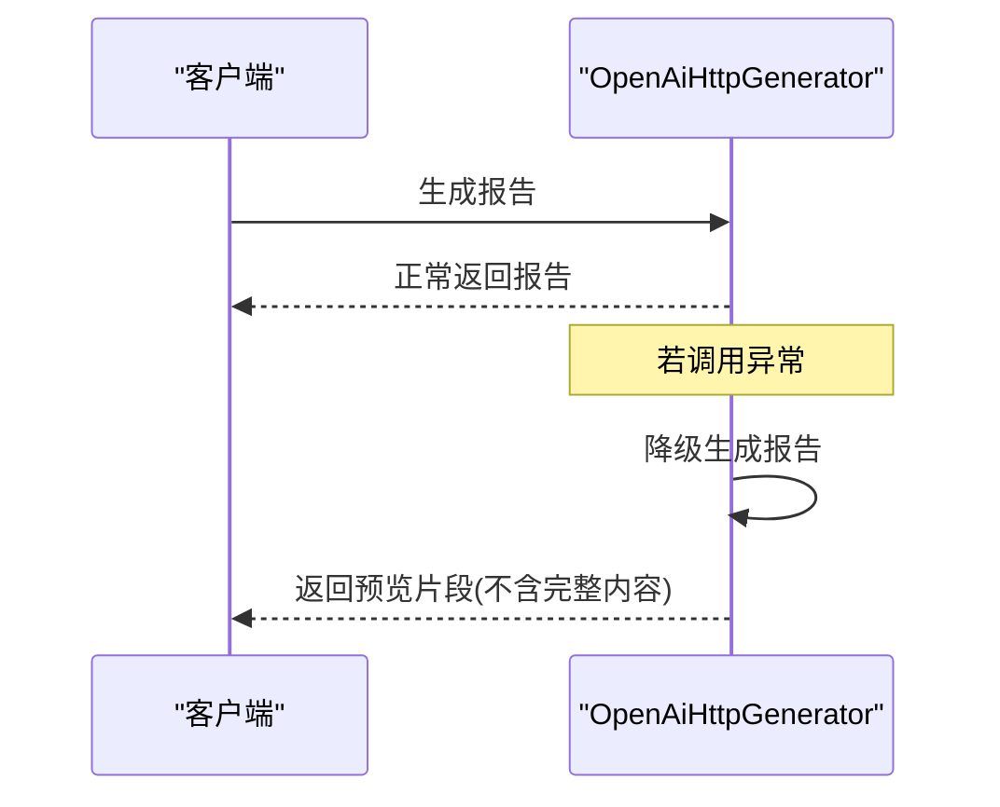
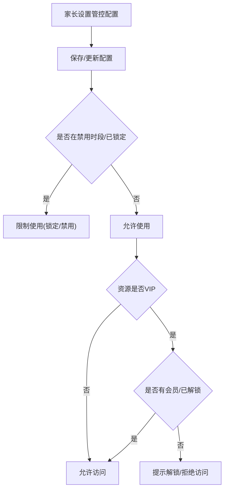
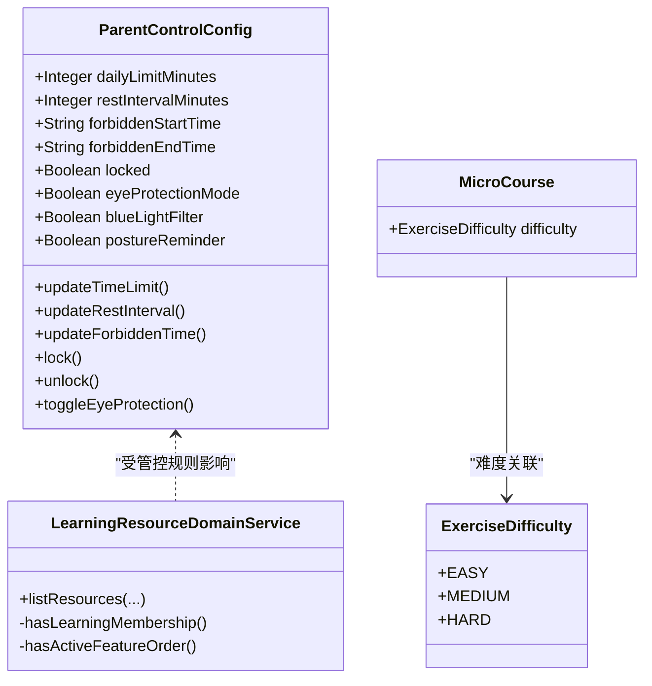
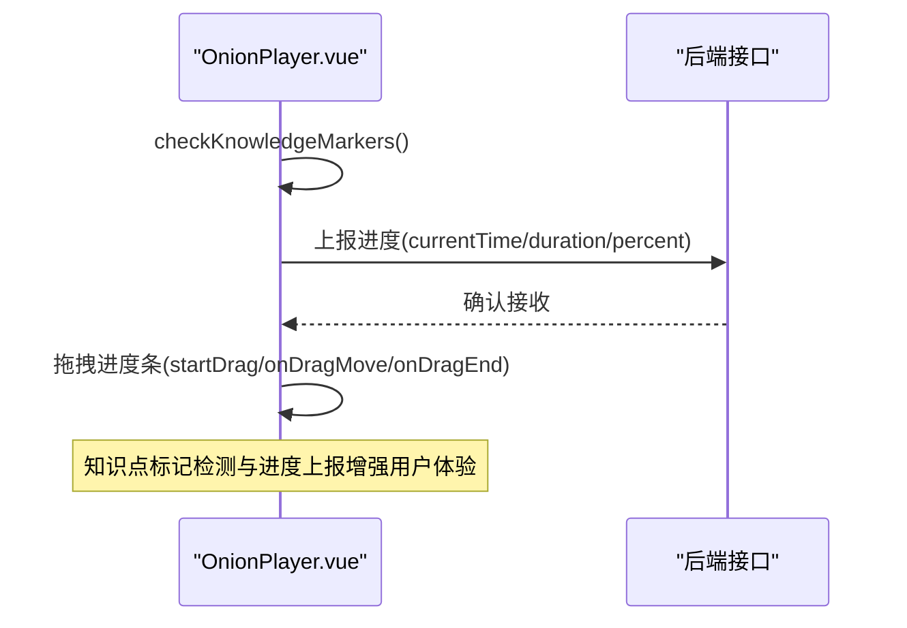
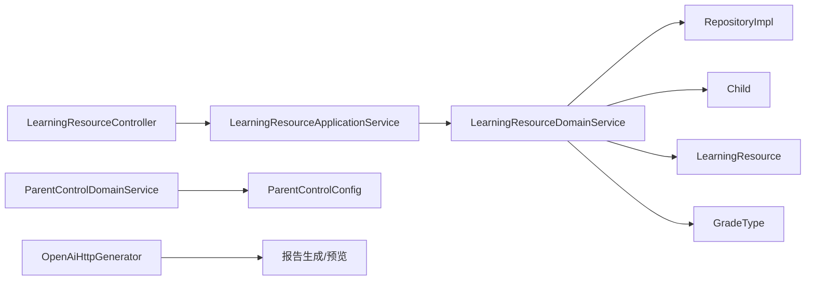

# 内容过滤系统

<cite>
**本文引用的文件**
- [ParentControlConfig.java](file://wzoto-backend/wzoto-domain/src/main/java/com/wzoto/domain/entity/ParentControlConfig.java)
- [Child.java](file://wzoto-backend/wzoto-domain/src/main/java/com/wzoto/domain/entity/Child.java)
- [GradeType.java](file://wzoto-backend/wzoto-domain/src/main/java/com/wzoto/domain/valobj/GradeType.java)
- [LearningResource.java](file://wzoto-backend/wzoto-domain/src/main/java/com/wzoto/domain/entity/LearningResource.java)
- [KnowledgePoint.java](file://wzoto-backend/wzoto-domain/src/main/java/com/wzoto/domain/entity/KnowledgePoint.java)
- [ExerciseBank.java](file://wzoto-backend/wzoto-domain/src/main/java/com/wzoto/domain/entity/ExerciseBank.java)
- [MicroCourse.java](file://wzoto-backend/wzoto-domain/src/main/java/com/wzoto/domain/entity/MicroCourse.java)
- [LearningResourceDomainService.java](file://wzoto-backend/wzoto-domain/src/main/java/com/wzoto/domain/service/LearningResourceDomainService.java)
- [LearningResourceApplicationService.java](file://wzoto-backend/wzoto-application/src/main/java/com/wzoto/application/service/LearningResourceApplicationService.java)
- [LearningResourceController.java](file://wzoto-backend/wzoto-interfaces/src/main/java/com/wzoto/interfaces/controller/LearningResourceController.java)
- [ParentControlDomainService.java](file://wzoto-backend/wzoto-domain/src/main/java/com/wzoto/domain/service/ParentControlDomainService.java)
- [ParentControlApplicationService.java](file://wzoto-backend/wzoto-application/src/main/java/com/wzoto/application/service/ParentControlApplicationService.java)
- [ParentControlController.java](file://wzoto-backend/wzoto-interfaces/src/main/java/com/wzoto/interfaces/controller/ParentControlController.java)
- [OpenAiHttpGenerator.java](file://wzoto-backend/wzoto-infrastructure/src/main/java/com/wzoto/infrastructure/ai/OpenAiHttpGenerator.java)
- [t_micro_course.sql](file://wzoto-backend/sql/t_micro_course.sql)
- [seed_data_comprehensive_resources.sql](file://wzoto-backend/sql/seed_data_comprehensive_resources.sql)
- [OnionPlayer.vue](file://wzoto-frontend/src/components/OnionPlayer.vue)
</cite>

## 目录
1. [简介](#简介)
2. [项目结构](#项目结构)
3. [核心组件](#核心组件)
4. [架构总览](#架构总览)
5. [详细组件分析](#详细组件分析)
6. [依赖关系分析](#依赖关系分析)
7. [性能考虑](#性能考虑)
8. [故障排查指南](#故障排查指南)
9. [结论](#结论)
10. [附录](#附录)

## 简介
本文件面向家长管控系统中的“内容过滤系统”，围绕以下目标展开：
- 年龄适配内容机制：基于儿童年级的内容分级、适龄推荐与难度匹配。
- 内容类型过滤：视频内容筛选、练习题过滤、知识点分类管理。
- 安全内容保障：不良内容识别、敏感信息过滤、网络安全防护（结合AI报告降级与预览策略）。
- 内容权限控制：家长授权机制、访问权限管理、VIP资源解锁与白名单思路。
- 规则配置与算法实现：时长/禁用时段/锁定等管控规则，以及资源列表过滤、会员校验、难度匹配流程。
- 前端展示与反馈：播放器能力、知识点标记检测、进度上报与用户反馈。

## 项目结构
后端采用分层架构：接口层（控制器）→ 应用服务 → 领域服务 → 仓储实现；领域层定义实体与值对象，基础设施层提供持久化与外部服务调用。前端通过Vue组件承载播放与交互逻辑。

图表来源
- [LearningResourceController.java:27-51](file://wzoto-backend/wzoto-interfaces/src/main/java/com/wzoto/interfaces/controller/LearningResourceController.java#L27-L51)
- [LearningResourceApplicationService.java:24-38](file://wzoto-backend/wzoto-application/src/main/java/com/wzoto/application/service/LearningResourceApplicationService.java#L24-L38)
- [LearningResourceDomainService.java:37-57](file://wzoto-backend/wzoto-domain/src/main/java/com/wzoto/domain/service/LearningResourceDomainService.java#L37-L57)
- [ParentControlController.java:33-59](file://wzoto-backend/wzoto-interfaces/src/main/java/com/wzoto/interfaces/controller/ParentControlController.java#L33-L59)
- [ParentControlApplicationService.java:21-43](file://wzoto-backend/wzoto-application/src/main/java/com/wzoto/application/service/ParentControlApplicationService.java#L21-L43)
- [ParentControlDomainService.java:27-101](file://wzoto-backend/wzoto-domain/src/main/java/com/wzoto/domain/service/ParentControlDomainService.java#L27-L101)
- [OpenAiHttpGenerator.java:113-139](file://wzoto-backend/wzoto-infrastructure/src/main/java/com/wzoto/infrastructure/ai/OpenAiHttpGenerator.java#L113-L139)
- [OnionPlayer.vue:366-414](file://wzoto-frontend/src/components/OnionPlayer.vue#L366-L414)

章节来源
- [LearningResourceController.java:27-51](file://wzoto-backend/wzoto-interfaces/src/main/java/com/wzoto/interfaces/controller/LearningResourceController.java#L27-L51)
- [LearningResourceDomainService.java:37-57](file://wzoto-backend/wzoto-domain/src/main/java/com/wzoto/domain/service/LearningResourceDomainService.java#L37-L57)
- [ParentControlDomainService.java:27-101](file://wzoto-backend/wzoto-domain/src/main/java/com/wzoto/domain/service/ParentControlDomainService.java#L27-L101)

## 核心组件
- 子女档案与年级：以Child实体承载家长与子女关系，GradeType枚举统一年级编码与描述，作为内容分级的基础维度。
- 学习资源：LearningResource按年级、学科、教材版本组织，支持资源类型（视频/习题）、VIP限制、标签与知识点标记。
- 微课视频：MicroCourse用于视频课程，包含难度、是否仅VIP、排序等字段，便于按年级+学科筛选与推荐。
- 习题库：ExerciseBank标注难度、题型、答案与解析，支撑练习题过滤与难度匹配。
- 知识点：KnowledgePoint以树形结构组织，支持深度判断是否为叶子节点，用于知识点分类管理与内容定位。
- 家长管控配置：ParentControlConfig维护每日可用时长、休息间隔、禁用时段、锁定、护眼模式、蓝光过滤、坐姿提醒等。

章节来源
- [Child.java:22-50](file://wzoto-backend/wzoto-domain/src/main/java/com/wzoto/domain/entity/Child.java#L22-L50)
- [GradeType.java:9-45](file://wzoto-backend/wzoto-domain/src/main/java/com/wzoto/domain/valobj/GradeType.java#L9-L45)
- [LearningResource.java:23-87](file://wzoto-backend/wzoto-domain/src/main/java/com/wzoto/domain/entity/LearningResource.java#L23-L87)
- [MicroCourse.java:21-50](file://wzoto-backend/wzoto-domain/src/main/java/com/wzoto/domain/entity/MicroCourse.java#L21-L50)
- [ExerciseBank.java:21-50](file://wzoto-backend/wzoto-domain/src/main/java/com/wzoto/domain/entity/ExerciseBank.java#L21-L50)
- [KnowledgePoint.java:21-37](file://wzoto-backend/wzoto-domain/src/main/java/com/wzoto/domain/entity/KnowledgePoint.java#L21-L37)
- [ParentControlConfig.java:20-60](file://wzoto-backend/wzoto-domain/src/main/java/com/wzoto/domain/entity/ParentControlConfig.java#L20-L60)

## 架构总览
内容过滤系统贯穿“请求入口→应用编排→领域规则→数据存取→前端呈现”的链路：
- 资源列表过滤：根据子女年级与学科，结合会员状态与VIP标识进行过滤。
- 家长管控：依据禁用时段、锁定、时长限制等规则对使用行为进行约束。
- 安全内容：AI报告生成失败时降级为本地方案，并仅返回预览片段，避免敏感或完整内容泄露。
- 前端播放：播放器支持知识点标记检测、进度上报与拖拽控制，配合后端完成学习追踪。

图表来源
- [LearningResourceController.java:27-51](file://wzoto-backend/wzoto-interfaces/src/main/java/com/wzoto/interfaces/controller/LearningResourceController.java#L27-L51)
- [LearningResourceApplicationService.java:24-38](file://wzoto-backend/wzoto-application/src/main/java/com/wzoto/application/service/LearningResourceApplicationService.java#L24-L38)
- [LearningResourceDomainService.java:37-57](file://wzoto-backend/wzoto-domain/src/main/java/com/wzoto/domain/service/LearningResourceDomainService.java#L37-L57)
- [OpenAiHttpGenerator.java:113-139](file://wzoto-backend/wzoto-infrastructure/src/main/java/com/wzoto/infrastructure/ai/OpenAiHttpGenerator.java#L113-L139)

## 详细组件分析

### 年龄适配内容机制
- 内容分级：以GradeType枚举表示小学一年级至六年级，Child实体绑定年级与教材版本，作为资源筛选的核心维度。
- 适龄推荐：微课与学习资源均支持按年级+学科筛选，结合知识点与难度，形成适龄推荐基础。
- 难度匹配：ExerciseDifficulty与MicroCourse.difficulty共同构成难度体系，可在推荐与练习中做匹配。

图表来源
- [Child.java:22-50](file://wzoto-backend/wzoto-domain/src/main/java/com/wzoto/domain/entity/Child.java#L22-L50)
- [GradeType.java:9-45](file://wzoto-backend/wzoto-domain/src/main/java/com/wzoto/domain/valobj/GradeType.java#L9-L45)
- [LearningResource.java:23-87](file://wzoto-backend/wzoto-domain/src/main/java/com/wzoto/domain/entity/LearningResource.java#L23-L87)
- [MicroCourse.java:21-50](file://wzoto-backend/wzoto-domain/src/main/java/com/wzoto/domain/entity/MicroCourse.java#L21-L50)
- [ExerciseBank.java:21-50](file://wzoto-backend/wzoto-domain/src/main/java/com/wzoto/domain/entity/ExerciseBank.java#L21-L50)

章节来源
- [Child.java:22-50](file://wzoto-backend/wzoto-domain/src/main/java/com/wzoto/domain/entity/Child.java#L22-L50)
- [GradeType.java:9-45](file://wzoto-backend/wzoto-domain/src/main/java/com/wzoto/domain/valobj/GradeType.java#L9-L45)
- [LearningResource.java:23-87](file://wzoto-backend/wzoto-domain/src/main/java/com/wzoto/domain/entity/LearningResource.java#L23-L87)
- [MicroCourse.java:21-50](file://wzoto-backend/wzoto-domain/src/main/java/com/wzoto/domain/entity/MicroCourse.java#L21-L50)
- [ExerciseBank.java:21-50](file://wzoto-backend/wzoto/domain/entity/ExerciseBank.java#L21-L50)

### 内容类型过滤
- 视频内容筛选：MicroCourse与LearningResource均支持按年级、学科、教材版本筛选；数据库索引优化查询性能。
- 练习题过滤：ExerciseBank按年级、学科、知识点、难度过滤；支持答案校验与使用次数统计。
- 知识点分类管理：KnowledgePoint以树形结构组织，支持深度判断是否为叶子节点，便于精细化内容定位。

图表来源
- [LearningResourceDomainService.java:37-57](file://wzoto-backend/wzoto-domain/src/main/java/com/wzoto/domain/service/LearningResourceDomainService.java#L37-L57)
- [t_micro_course.sql:21-31](file://wzoto-backend/sql/t_micro_course.sql#L21-L31)
- [ExerciseBank.java:21-50](file://wzoto-backend/wzoto-domain/src/main/java/com/wzoto/domain/entity/ExerciseBank.java#L21-L50)
- [KnowledgePoint.java:21-37](file://wzoto-backend/wzoto-domain/src/main/java/com/wzoto/domain/entity/KnowledgePoint.java#L21-L37)

章节来源
- [LearningResourceDomainService.java:37-57](file://wzoto-backend/wzoto-domain/src/main/java/com/wzoto/domain/service/LearningResourceDomainService.java#L37-L57)
- [t_micro_course.sql:21-31](file://wzoto-backend/sql/t_micro_course.sql#L21-L31)
- [ExerciseBank.java:21-50](file://wzoto-backend/wzoto-domain/src/main/java/com/wzoto/domain/entity/ExerciseBank.java#L21-L50)
- [KnowledgePoint.java:21-37](file://wzoto-backend/wzoto-domain/src/main/java/com/wzoto/domain/entity/KnowledgePoint.java#L21-L37)

### 安全内容保障
- 不良内容识别与敏感信息过滤：AI报告生成失败时采用降级方案，仅返回预览片段，避免输出完整内容。
- 网络安全防护：对外部AI调用增加异常捕获与降级处理，确保服务稳定性与内容安全。

图表来源
- [OpenAiHttpGenerator.java:113-139](file://wzoto-backend/wzoto-infrastructure/src/main/java/com/wzoto/infrastructure/ai/OpenAiHttpGenerator.java#L113-L139)

章节来源
- [OpenAiHttpGenerator.java:113-139](file://wzoto-backend/wzoto-infrastructure/src/main/java/com/wzoto/infrastructure/ai/OpenAiHttpGenerator.java#L113-L139)

### 内容权限控制
- 家长授权机制：ParentControlConfig维护禁用时段、锁定、时长限制等，ParentControlDomainService提供保存、锁定/解锁、切换护眼模式等方法。
- 访问权限管理：LearningResourceDomainService在资源列表过滤时检查会员状态与VIP标识，未持有会员且未显式包含VIP则过滤。
- 内容白名单功能：可通过资源标签（tags）与知识点（knowledgePoint）组合实现白名单式推荐与过滤。

图表来源
- [ParentControlDomainService.java:41-101](file://wzoto-backend/wzoto-domain/src/main/java/com/wzoto/domain/service/ParentControlDomainService.java#L41-L101)
- [LearningResourceDomainService.java:37-57](file://wzoto-backend/wzoto-domain/src/main/java/com/wzoto/domain/service/LearningResourceDomainService.java#L37-L57)
- [LearningResource.java:53-75](file://wzoto-backend/wzoto-domain/src/main/java/com/wzoto/domain/entity/LearningResource.java#L53-L75)

章节来源
- [ParentControlDomainService.java:41-101](file://wzoto-backend/wzoto-domain/src/main/java/com/wzoto/domain/service/ParentControlDomainService.java#L41-L101)
- [LearningResourceDomainService.java:37-57](file://wzoto-backend/wzoto-domain/src/main/java/com/wzoto/domain/service/LearningResourceDomainService.java#L37-L57)
- [LearningResource.java:53-75](file://wzoto-backend/wzoto-domain/src/main/java/com/wzoto/domain/entity/LearningResource.java#L53-L75)

### 内容过滤规则配置与算法实现
- 规则配置：ParentControlConfig支持每日可用时长、单次休息间隔、禁用时段、锁定开关、护眼模式、蓝光过滤、坐姿提醒等。
- 过滤算法：LearningResourceDomainService在查询资源时，先按年级/学科/类型检索，再根据会员状态与includeVip参数决定是否包含VIP资源。
- 难度匹配：ExerciseDifficulty与MicroCourse.difficulty可用于练习与视频的推荐与匹配。

图表来源
- [ParentControlConfig.java:20-164](file://wzoto-backend/wzoto-domain/src/main/java/com/wzoto/domain/entity/ParentControlConfig.java#L20-L164)
- [LearningResourceDomainService.java:37-113](file://wzoto-backend/wzoto-domain/src/main/java/com/wzoto/domain/service/LearningResourceDomainService.java#L37-L113)
- [ExerciseBank.java:21-50](file://wzoto-backend/wzoto-domain/src/main/java/com/wzoto/domain/entity/ExerciseBank.java#L21-L50)
- [MicroCourse.java:21-50](file://wzoto-backend/wzoto-domain/src/main/java/com/wzoto/domain/entity/MicroCourse.java#L21-L50)

章节来源
- [ParentControlConfig.java:20-164](file://wzoto-backend/wzoto-domain/src/main/java/com/wzoto/domain/entity/ParentControlConfig.java#L20-L164)
- [LearningResourceDomainService.java:37-113](file://wzoto-backend/wzoto-domain/src/main/java/com/wzoto/domain/service/LearningResourceDomainService.java#L37-L113)
- [ExerciseBank.java:21-50](file://wzoto-backend/wzoto-domain/src/main/java/com/wzoto/domain/entity/ExerciseBank.java#L21-L50)
- [MicroCourse.java:21-50](file://wzoto-backend/wzoto-domain/src/main/java/com/wzoto/domain/entity/MicroCourse.java#L21-L50)

### 前端内容展示界面适配与用户反馈
- 播放器能力：OnionPlayer支持知识点标记检测、进度上报、拖拽控制，提升学习体验与可追踪性。
- 用户反馈：通过进度上报与知识点标记触发，后端可记录学习进度与掌握情况，辅助推荐与评估。

图表来源
- [OnionPlayer.vue:366-414](file://wzoto-frontend/src/components/OnionPlayer.vue#L366-L414)

章节来源
- [OnionPlayer.vue:366-414](file://wzoto-frontend/src/components/OnionPlayer.vue#L366-L414)

## 依赖关系分析
- 控制器依赖应用服务，应用服务依赖领域服务，领域服务依赖仓储与实体；AI服务作为外部依赖提供报告生成能力。
- 数据库索引（如微课表的年级、学科、难度、VIP等）提升查询性能，支撑内容过滤的高效执行。

图表来源
- [LearningResourceController.java:27-51](file://wzoto-backend/wzoto-interfaces/src/main/java/com/wzoto/interfaces/controller/LearningResourceController.java#L27-L51)
- [LearningResourceApplicationService.java:24-38](file://wzoto-backend/wzoto-application/src/main/java/com/wzoto/application/service/LearningResourceApplicationService.java#L24-L38)
- [LearningResourceDomainService.java:37-57](file://wzoto-backend/wzoto-domain/src/main/java/com/wzoto/domain/service/LearningResourceDomainService.java#L37-L57)
- [ParentControlDomainService.java:27-101](file://wzoto-backend/wzoto-domain/src/main/java/com/wzoto/domain/service/ParentControlDomainService.java#L27-L101)
- [OpenAiHttpGenerator.java:113-139](file://wzoto-backend/wzoto-infrastructure/src/main/java/com/wzoto/infrastructure/ai/OpenAiHttpGenerator.java#L113-L139)
- [t_micro_course.sql:21-31](file://wzoto-backend/sql/t_micro_course.sql#L21-L31)

章节来源
- [LearningResourceController.java:27-51](file://wzoto-backend/wzoto-interfaces/src/main/java/com/wzoto/interfaces/controller/LearningResourceController.java#L27-L51)
- [LearningResourceDomainService.java:37-57](file://wzoto-backend/wzoto-domain/src/main/java/com/wzoto/domain/service/LearningResourceDomainService.java#L37-L57)
- [ParentControlDomainService.java:27-101](file://wzoto-backend/wzoto-domain/src/main/java/com/wzoto/domain/service/ParentControlDomainService.java#L27-L101)
- [t_micro_course.sql:21-31](file://wzoto-backend/sql/t_micro_course.sql#L21-L31)

## 性能考虑
- 数据库索引：微课表针对年级、学科、教材版本、章节、知识点、VIP、难度建立索引，提升筛选效率。
- 资源过滤：在领域层进行内存过滤（VIP与会员状态），减少不必要的数据传输。
- AI降级：外部AI调用异常时快速降级为本地方案，避免阻塞主流程。
- 前端优化：播放器定时上报进度，降低频繁请求开销；知识点标记检测阈值合理设置，减少误触发。

章节来源
- [t_micro_course.sql:21-31](file://wzoto-backend/sql/t_micro_course.sql#L21-L31)
- [LearningResourceDomainService.java:37-57](file://wzoto-backend/wzoto-domain/src/main/java/com/wzoto/domain/service/LearningResourceDomainService.java#L37-L57)
- [OpenAiHttpGenerator.java:113-139](file://wzoto-backend/wzoto-infrastructure/src/main/java/com/wzoto/infrastructure/ai/OpenAiHttpGenerator.java#L113-L139)
- [OnionPlayer.vue:366-414](file://wzoto-frontend/src/components/OnionPlayer.vue#L366-L414)

## 故障排查指南
- 资源列表为空：检查子女年级与学科是否正确，确认includeVip参数与会员状态；查看资源是否存在对应年级/学科。
- VIP资源无法访问：确认是否持有学习会员或已解锁；检查资源vipOnly标志。
- 家长管控生效异常：检查禁用时段、锁定状态、时长限制；验证配置保存是否成功。
- AI报告异常：查看降级日志，确认是否返回预览片段；必要时检查外部API可用性。

章节来源
- [LearningResourceDomainService.java:37-57](file://wzoto-backend/wzoto-domain/src/main/java/com/wzoto/domain/service/LearningResourceDomainService.java#L37-L57)
- [ParentControlDomainService.java:41-101](file://wzoto-backend/wzoto-domain/src/main/java/com/wzoto/domain/service/ParentControlDomainService.java#L41-L101)
- [OpenAiHttpGenerator.java:113-139](file://wzoto-backend/wzoto-infrastructure/src/main/java/com/wzoto/infrastructure/ai/OpenAiHttpGenerator.java#L113-L139)

## 结论
本内容过滤系统以年级与学科为核心维度，结合会员与VIP权限、家长管控规则与AI安全策略，构建了从资源筛选到播放反馈的完整闭环。通过清晰的领域模型与分层架构，系统在可扩展性与安全性方面具备良好基础；未来可进一步引入更精细的难度匹配与个性化推荐算法，以提升学习体验与效果。

## 附录
- 示例数据：微课与学习资源的种子数据包含年级、学科、难度、VIP等字段，便于测试与演示。
- 前端组件：OnionPlayer提供知识点标记检测与进度上报，支持良好的交互体验。

章节来源
- [seed_data_comprehensive_resources.sql:345-350](file://wzoto-backend/sql/seed_data_comprehensive_resources.sql#L345-L350)
- [OnionPlayer.vue:366-414](file://wzoto-frontend/src/components/OnionPlayer.vue#L366-L414)