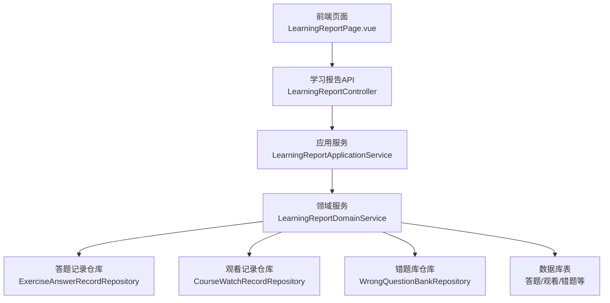
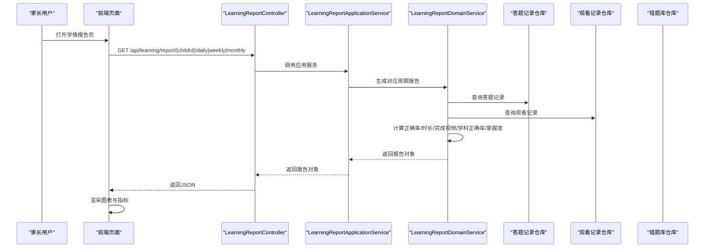
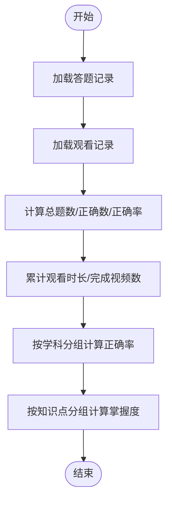
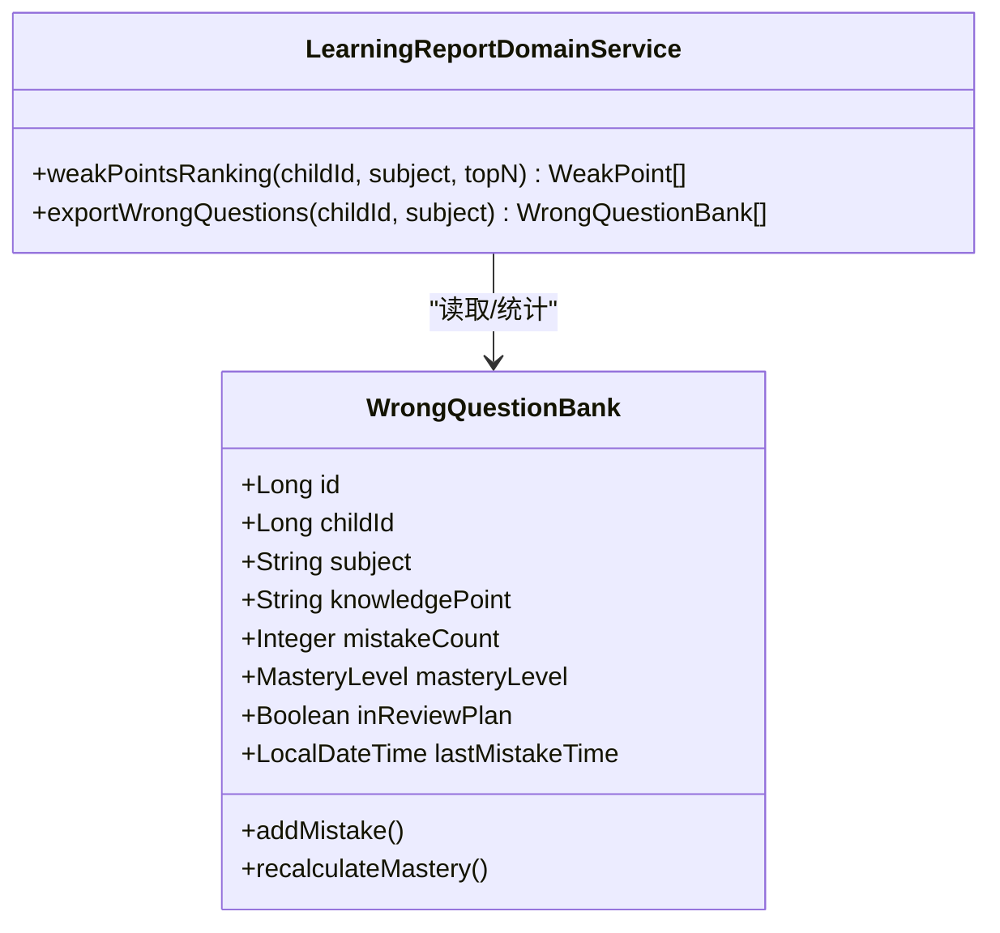
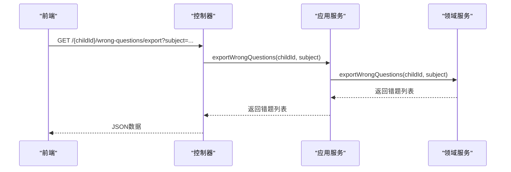
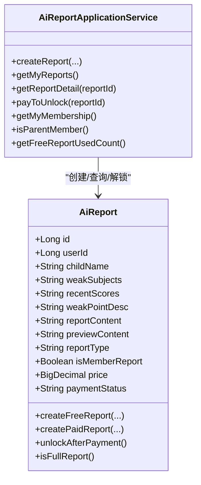
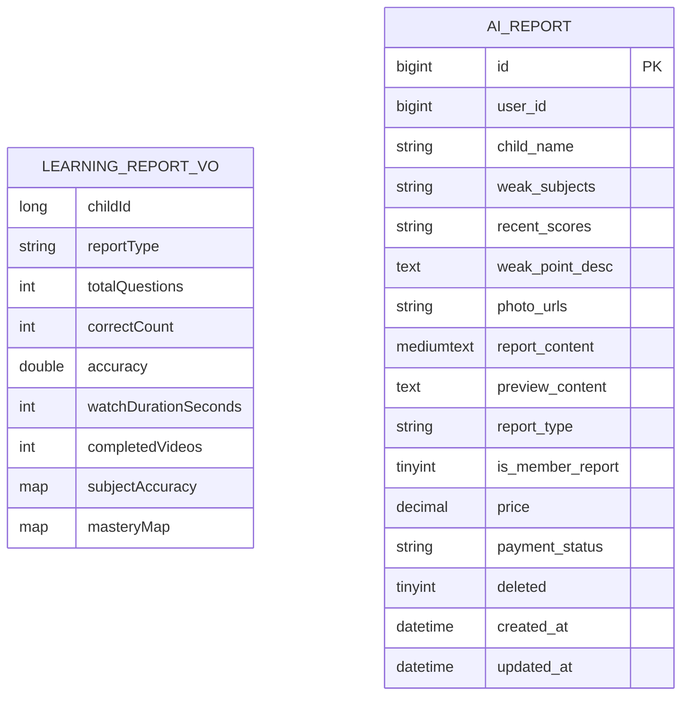
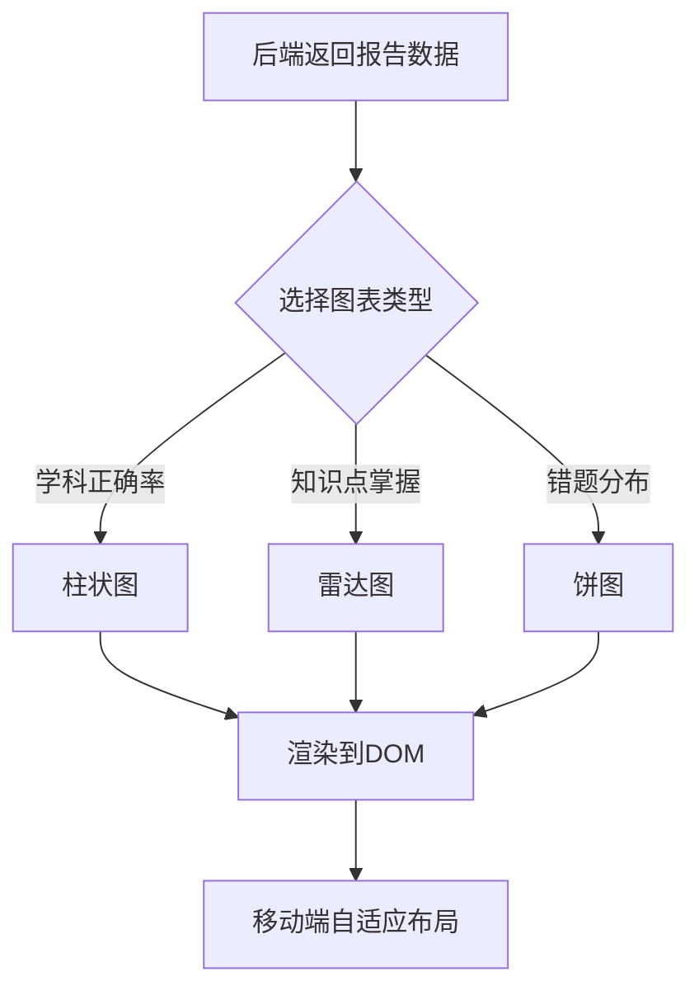
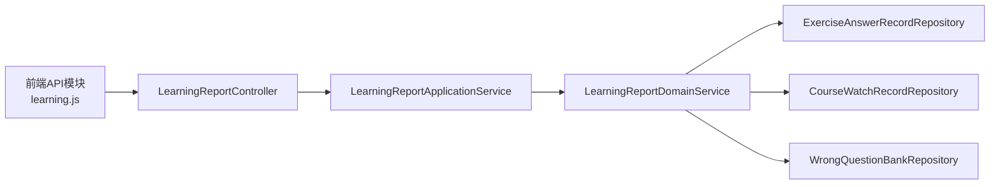

# 学习报告生成

<cite>
**本文引用的文件**
- [LearningReportController.java](file://wzoto-backend/wzoto-interfaces/src/main/java/com/wzoto/interfaces/controller/LearningReportController.java)
- [LearningReportApplicationService.java](file://wzoto-backend/wzoto-application/src/main/java/com/wzoto/application/service/LearningReportApplicationService.java)
- [LearningReportDomainService.java](file://wzoto-backend/wzoto-domain/src/main/java/com/wzoto/domain/service/LearningReportDomainService.java)
- [AiReportApplicationService.java](file://wzoto-backend/wzoto-application/src/main/java/com/wzoto/application/service/AiReportApplicationService.java)
- [AiReport.java](file://wzoto-backend/wzoto-domain/src/main/java/com/wzoto/domain/entity/AiReport.java)
- [t_ai_report.sql](file://wzoto-backend/sql/t_ai_report.sql)
- [ExerciseAnswerRecord.java](file://wzoto-backend/wzoto-domain/src/main/java/com/wzoto/domain/entity/ExerciseAnswerRecord.java)
- [CourseWatchRecord.java](file://wzoto-backend/wzoto-domain/src/main/java/com/wzoto/domain/entity/CourseWatchRecord.java)
- [WrongQuestionBank.java](file://wzoto-backend/wzoto-domain/src/main/java/com/wzoto/domain/entity/WrongQuestionBank.java)
- [LearningReportVO.java](file://wzoto-backend/wzoto-interfaces/src/main/java/com/wzoto/interfaces/vo/learning/LearningReportVO.java)
- [LearningReportPage.vue](file://wzoto-frontend/src/pages/learning/LearningReportPage.vue)
- [learning.js](file://wzoto-frontend/src/api/learning.js)
</cite>

## 目录
1. [简介](#简介)
2. [项目结构](#项目结构)
3. [核心组件](#核心组件)
4. [架构总览](#架构总览)
5. [详细组件分析](#详细组件分析)
6. [依赖关系分析](#依赖关系分析)
7. [性能考量](#性能考量)
8. [故障排查指南](#故障排查指南)
9. [结论](#结论)
10. [附录](#附录)

## 简介
本文件围绕家长管控系统中的“学习报告生成功能”进行系统化说明，覆盖以下目标：
- 学习数据分析：学习时长统计、知识点掌握度分析、成绩趋势图表
- 能力评估体系：学科能力雷达图、技能提升轨迹、薄弱环节识别
- 报告生成机制：定期报告自动生成、自定义报告查询、报告格式导出
- 智能建议系统：基于AI的学习建议、个性化提升方案、资源推荐策略
- 数据结构设计、可视化展示方案、移动端适配优化
- 家长查看报告的界面设计与通知推送机制（概念性说明）

## 项目结构
后端采用分层架构：接口层（Controller）、应用服务层（Application Service）、领域服务层（Domain Service），以及实体与仓储。前端为Vue页面，通过API调用获取数据并渲染图表。

图示来源
- [LearningReportController.java:20-82](file://wzoto-backend/wzoto-interfaces/src/main/java/com/wzoto/interfaces/controller/LearningReportController.java#L20-L82)
- [LearningReportApplicationService.java:15-59](file://wzoto-backend/wzoto-application/src/main/java/com/wzoto/application/service/LearningReportApplicationService.java#L15-L59)
- [LearningReportDomainService.java:19-160](file://wzoto-backend/wzoto-domain/src/main/java/com/wzoto/domain/service/LearningReportDomainService.java#L19-L160)

章节来源
- [LearningReportController.java:20-141](file://wzoto-backend/wzoto-interfaces/src/main/java/com/wzoto/interfaces/controller/LearningReportController.java#L20-L141)
- [LearningReportApplicationService.java:15-59](file://wzoto-backend/wzoto-application/src/main/java/com/wzoto/application/service/LearningReportApplicationService.java#L15-L59)
- [LearningReportDomainService.java:19-160](file://wzoto-backend/wzoto-domain/src/main/java/com/wzoto/domain/service/LearningReportDomainService.java#L19-L160)

## 核心组件
- 控制器层：提供日报、周报、月报、薄弱知识点、错题导出等REST接口
- 应用服务层：校验子女归属、编排领域服务调用
- 领域服务层：聚合答题与观看数据，计算正确率、时长、完成视频数、按学科正确率、知识点掌握度；支持薄弱点排行与错题导出
- 前端页面：选择子女、切换日/周/月视图、渲染柱状图/雷达图/饼图、展示AI建议

章节来源
- [LearningReportController.java:31-82](file://wzoto-backend/wzoto-interfaces/src/main/java/com/wzoto/interfaces/controller/LearningReportController.java#L31-L82)
- [LearningReportApplicationService.java:26-49](file://wzoto-backend/wzoto-application/src/main/java/com/wzoto/application/service/LearningReportApplicationService.java#L26-L49)
- [LearningReportDomainService.java:31-135](file://wzoto-backend/wzoto-domain/src/main/java/com/wzoto/domain/service/LearningReportDomainService.java#L31-L135)
- [LearningReportPage.vue:14-102](file://wzoto-frontend/src/pages/learning/LearningReportPage.vue#L14-L102)

## 架构总览
学习报告从前端触发到后端计算的完整流程如下：

图示来源
- [LearningReportController.java:31-62](file://wzoto-backend/wzoto-interfaces/src/main/java/com/wzoto/interfaces/controller/LearningReportController.java#L31-L62)
- [LearningReportApplicationService.java:26-49](file://wzoto-backend/wzoto-application/src/main/java/com/wzoto/application/service/LearningReportApplicationService.java#L26-L49)
- [LearningReportDomainService.java:31-69](file://wzoto-backend/wzoto-domain/src/main/java/com/wzoto/domain/service/LearningReportDomainService.java#L31-L69)

## 详细组件分析

### 学习数据分析
- 学习时长统计：聚合课程观看记录的累计时长与完成视频数
- 知识点掌握度分析：按知识点分组计算正确率，映射为掌握等级
- 成绩趋势图表：按学科维度计算正确率，用于柱状图展示

图示来源
- [LearningReportDomainService.java:31-99](file://wzoto-backend/wzoto-domain/src/main/java/com/wzoto/domain/service/LearningReportDomainService.java#L31-L99)

章节来源
- [LearningReportDomainService.java:31-99](file://wzoto-backend/wzoto-domain/src/main/java/com/wzoto/domain/service/LearningReportDomainService.java#L31-L99)
- [CourseWatchRecord.java:18-120](file://wzoto-backend/wzoto-domain/src/main/java/com/wzoto/domain/entity/CourseWatchRecord.java#L18-L120)
- [ExerciseAnswerRecord.java:18-99](file://wzoto-backend/wzoto-domain/src/main/java/com/wzoto/domain/entity/ExerciseAnswerRecord.java#L18-L99)

### 能力评估体系
- 学科能力雷达图：前端根据知识点掌握度或分数构建雷达图，直观展示各维度能力
- 技能提升轨迹：通过历史报告对比（日/周/月）观察正确率变化趋势
- 薄弱环节识别：基于错题库的知识点错误次数排序，定位薄弱项

图示来源
- [WrongQuestionBank.java:18-133](file://wzoto-backend/wzoto-domain/src/main/java/com/wzoto/domain/entity/WrongQuestionBank.java#L18-L133)
- [LearningReportDomainService.java:102-135](file://wzoto-backend/wzoto-domain/src/main/java/com/wzoto/domain/service/LearningReportDomainService.java#L102-L135)

章节来源
- [WrongQuestionBank.java:18-133](file://wzoto-backend/wzoto-domain/src/main/java/com/wzoto/domain/entity/WrongQuestionBank.java#L18-L133)
- [LearningReportDomainService.java:102-135](file://wzoto-backend/wzoto-domain/src/main/java/com/wzoto/domain/service/LearningReportDomainService.java#L102-L135)

### 报告生成机制
- 定期报告自动生成：当前实现为按需查询（日/周/月），可结合定时任务扩展为自动归档
- 自定义报告查询：支持传入日期、周起始、年月参数进行范围查询
- 报告格式导出：提供错题导出接口，便于家长下载与分析

图示来源
- [LearningReportController.java:77-82](file://wzoto-backend/wzoto-interfaces/src/main/java/com/wzoto/interfaces/controller/LearningReportController.java#L77-L82)
- [LearningReportApplicationService.java:46-49](file://wzoto-backend/wzoto-application/src/main/java/com/wzoto/application/service/LearningReportApplicationService.java#L46-L49)
- [LearningReportDomainService.java:126-135](file://wzoto-backend/wzoto-domain/src/main/java/com/wzoto/domain/service/LearningReportDomainService.java#L126-L135)

章节来源
- [LearningReportController.java:31-82](file://wzoto-backend/wzoto-interfaces/src/main/java/com/wzoto/interfaces/controller/LearningReportController.java#L31-L82)
- [LearningReportApplicationService.java:26-49](file://wzoto-backend/wzoto-application/src/main/java/com/wzoto/application/service/LearningReportApplicationService.java#L26-L49)
- [LearningReportDomainService.java:31-69](file://wzoto-backend/wzoto-domain/src/main/java/com/wzoto/domain/service/LearningReportDomainService.java#L31-L69)

### 智能建议系统
- AI学情诊断报告：支持创建预览/完整报告、付费解锁、会员免费报告等
- 个性化提升方案：基于薄弱知识点与近期成绩生成建议内容
- 资源推荐策略：结合微课与专项练习巩固薄弱点（前端已有建议文案逻辑）

图示来源
- [AiReport.java:18-106](file://wzoto-backend/wzoto-domain/src/main/java/com/wzoto/domain/entity/AiReport.java#L18-L106)
- [AiReportApplicationService.java:13-81](file://wzoto-backend/wzoto-application/src/main/java/com/wzoto/application/service/AiReportApplicationService.java#L13-L81)

章节来源
- [AiReport.java:18-106](file://wzoto-backend/wzoto-domain/src/main/java/com/wzoto/domain/entity/AiReport.java#L18-L106)
- [AiReportApplicationService.java:13-81](file://wzoto-backend/wzoto-application/src/main/java/com/wzoto/application/service/AiReportApplicationService.java#L13-L81)

### 报告数据结构设计
- 学习报告VO：包含子女ID、报告类型、总题数、正确数、正确率、观看时长、完成视频数、学科正确率、知识点掌握度映射
- AI报告实体：包含家长用户ID、子女姓名、薄弱学科、近期成绩、薄弱知识点描述、照片URL、报告内容、预览内容、报告类型、是否会员报告、价格、支付状态等

图示来源
- [LearningReportVO.java:8-22](file://wzoto-backend/wzoto-interfaces/src/main/java/com/wzoto/interfaces/vo/learning/LearningReportVO.java#L8-L22)
- [t_ai_report.sql:4-23](file://wzoto-backend/sql/t_ai_report.sql#L4-L23)

章节来源
- [LearningReportVO.java:8-22](file://wzoto-backend/wzoto-interfaces/src/main/java/com/wzoto/interfaces/vo/learning/LearningReportVO.java#L8-L22)
- [t_ai_report.sql:4-23](file://wzoto-backend/sql/t_ai_report.sql#L4-L23)

### 可视化展示方案
- 柱状图：学科正确率（按科目维度）
- 雷达图：知识点掌握图谱（指标为知识点名称，值为掌握度或分数）
- 饼图：错题分类统计（按学科分布）
- 移动端适配：使用响应式容器与ECharts自适应配置

图示来源
- [LearningReportPage.vue:167-257](file://wzoto-frontend/src/pages/learning/LearningReportPage.vue#L167-L257)

章节来源
- [LearningReportPage.vue:167-257](file://wzoto-frontend/src/pages/learning/LearningReportPage.vue#L167-L257)

### 移动端适配优化
- 页面容器高度与内边距适配小屏设备
- 图表容器宽度100%、固定高度，确保在不同屏幕下显示一致
- 统计数据网格布局在移动端自动换行，保证可读性

章节来源
- [LearningReportPage.vue:271-377](file://wzoto-frontend/src/pages/learning/LearningReportPage.vue#L271-L377)

### 家长查看报告的界面设计与通知推送机制（概念性说明）
- 界面设计要点：顶部标题与返回按钮、子女选择器、标签页切换（日/周/月）、关键指标卡片、图表区域、薄弱知识点列表、AI建议区
- 通知推送机制（概念）：可在后台增加定时任务，每日/每周/每月生成报告后，通过消息通道（如站内信/短信/微信模板消息）向家长推送摘要与链接，点击跳转至报告详情

[本节为概念性说明，不直接分析具体代码文件]

## 依赖关系分析
- 控制器依赖应用服务，应用服务依赖领域服务
- 领域服务依赖多个仓库，分别访问答题记录、观看记录、错题库
- 前端通过API模块调用后端接口，渲染图表与数据

图示来源
- [learning.js:28-61](file://wzoto-frontend/src/api/learning.js#L28-L61)
- [LearningReportController.java:20-82](file://wzoto-backend/wzoto-interfaces/src/main/java/com/wzoto/interfaces/controller/LearningReportController.java#L20-L82)
- [LearningReportApplicationService.java:15-59](file://wzoto-backend/wzoto-application/src/main/java/com/wzoto/application/service/LearningReportApplicationService.java#L15-L59)
- [LearningReportDomainService.java:19-135](file://wzoto-backend/wzoto-domain/src/main/java/com/wzoto/domain/service/LearningReportDomainService.java#L19-L135)

章节来源
- [learning.js:28-61](file://wzoto-frontend/src/api/learning.js#L28-L61)
- [LearningReportController.java:20-82](file://wzoto-backend/wzoto-interfaces/src/main/java/com/wzoto/interfaces/controller/LearningReportController.java#L20-L82)
- [LearningReportApplicationService.java:15-59](file://wzoto-backend/wzoto-application/src/main/java/com/wzoto/application/service/LearningReportApplicationService.java#L15-L59)
- [LearningReportDomainService.java:19-135](file://wzoto-backend/wzoto-domain/src/main/java/com/wzoto/domain/service/LearningReportDomainService.java#L19-L135)

## 性能考量
- 数据聚合在内存中进行，适合中小规模数据；当数据量增长时，建议在仓库层增加按时间范围过滤的SQL查询，减少内存压力
- 图表渲染在每次数据更新时重建，可考虑缓存图表实例与数据，避免重复初始化
- 弱项排行与错题导出可按学科过滤，减少不必要的数据传输

[本节提供通用指导，不直接分析具体代码文件]

## 故障排查指南
- 权限校验失败：应用服务会校验子女归属，若不存在将抛出异常；检查当前登录用户与子女关联关系
- 数据为空：确认答题与观看记录是否存在于指定时间段；检查仓库查询条件与时间字段
- 图表不显示：确认DOM节点已挂载后再初始化图表；检查数据格式是否符合预期

章节来源
- [LearningReportApplicationService.java:51-57](file://wzoto-backend/wzoto-application/src/main/java/com/wzoto/application/service/LearningReportApplicationService.java#L51-L57)
- [LearningReportDomainService.java:31-69](file://wzoto-backend/wzoto-domain/src/main/java/com/wzoto/domain/service/LearningReportDomainService.java#L31-L69)
- [LearningReportPage.vue:167-183](file://wzoto-frontend/src/pages/learning/LearningReportPage.vue#L167-L183)

## 结论
该学习报告功能通过清晰的分层架构实现了日/周/月报告生成、薄弱知识点识别与错题导出，并结合前端可视化呈现学科正确率、知识点掌握度与错题分布。AI学情诊断报告提供了预览与完整报告的能力，支持付费解锁与会员免费策略。未来可进一步增强：
- 定时自动生成报告并推送通知
- 更丰富的趋势分析与预测
- 更细粒度的资源推荐策略

[本节总结性内容，不直接分析具体代码文件]

## 附录
- API清单（学习报告相关）
  - GET /api/learning/report/{childId}：学情总览
  - GET /api/learning/report/{childId}/daily：日报
  - GET /api/learning/report/{childId}/weekly：周报
  - GET /api/learning/report/{childId}/monthly：月报
  - GET /api/learning/report/{childId}/weak-points：薄弱知识点
  - GET /api/learning/report/{childId}/wrong-questions/export：错题导出

章节来源
- [LearningReportController.java:31-82](file://wzoto-backend/wzoto-interfaces/src/main/java/com/wzoto/interfaces/controller/LearningReportController.java#L31-L82)
- [learning.js:28-61](file://wzoto-frontend/src/api/learning.js#L28-L61)