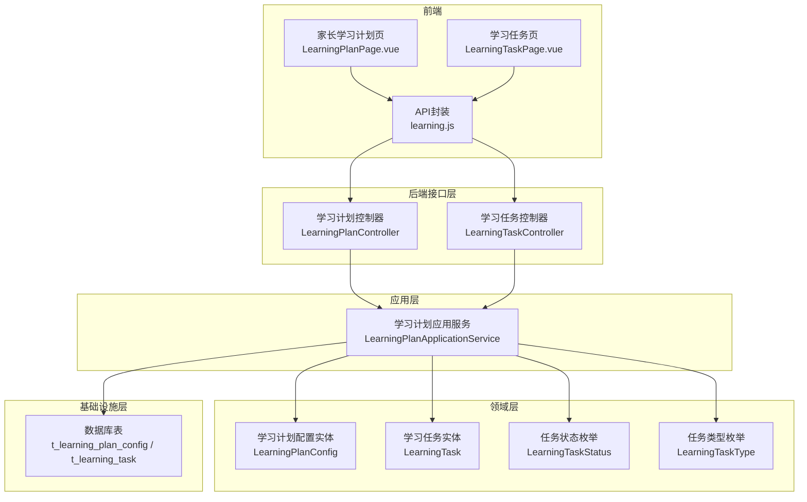
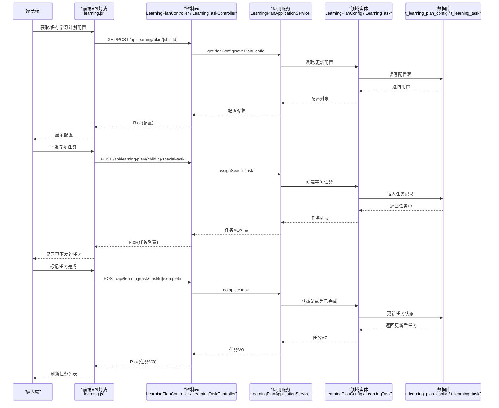
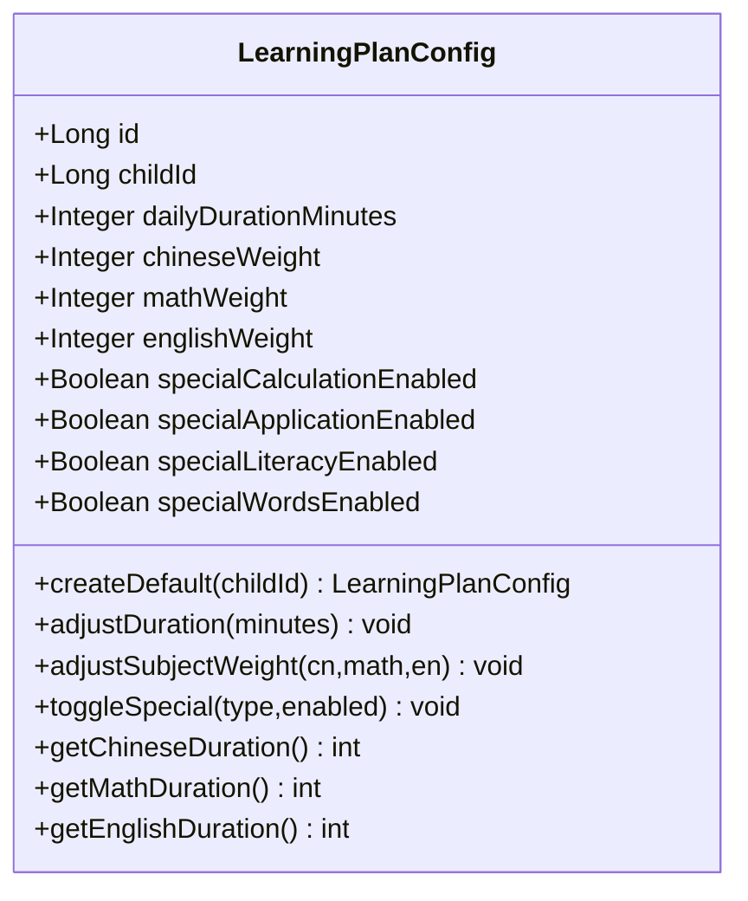
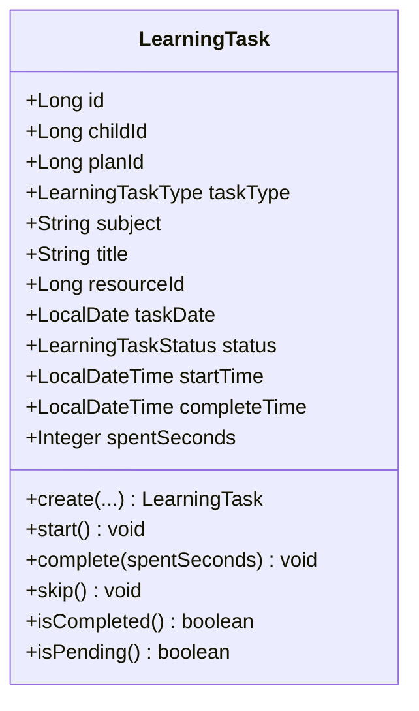
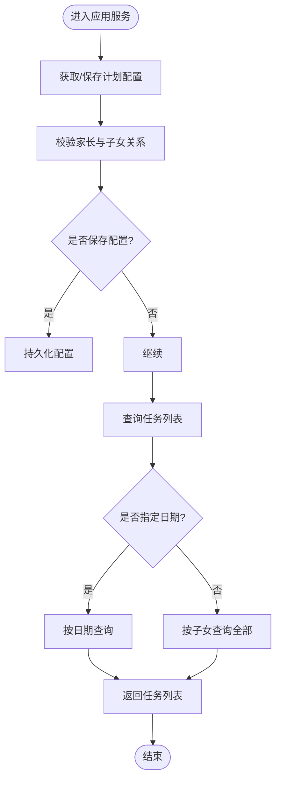
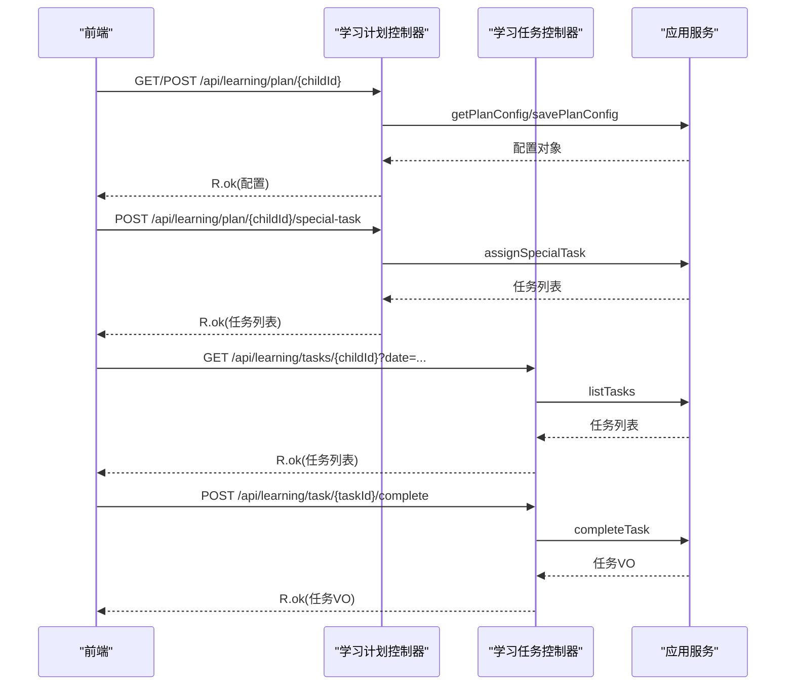
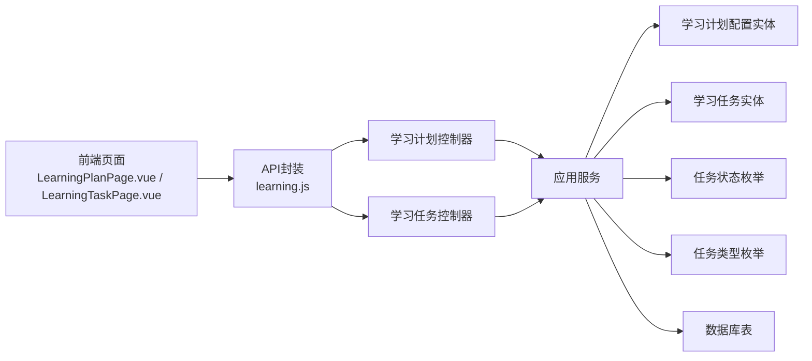

# 学习计划管理

<cite>
**本文引用的文件**
- [LearningPlanConfig.java](file://wzoto-backend/wzoto-domain/src/main/java/com/wzoto/domain/entity/LearningPlanConfig.java)
- [LearningTask.java](file://wzoto-backend/wzoto-domain/src/main/java/com/wzoto/domain/entity/LearningTask.java)
- [LearningTaskStatus.java](file://wzoto-backend/wzoto-domain/src/main/java/com/wzoto/domain/valobj/LearningTaskStatus.java)
- [LearningTaskType.java](file://wzoto-backend/wzoto-domain/src/main/java/com/wzoto/domain/valobj/LearningTaskType.java)
- [LearningPlanApplicationService.java](file://wzoto-backend/wzoto-application/src/main/java/com/wzoto/application/service/LearningPlanApplicationService.java)
- [LearningPlanController.java](file://wzoto-backend/wzoto-interfaces/src/main/java/com/wzoto/interfaces/controller/LearningPlanController.java)
- [LearningTaskController.java](file://wzoto-backend/wzoto-interfaces/src/main/java/com/wzoto/interfaces/controller/LearningTaskController.java)
- [CreateTaskDTO.java](file://wzoto-backend/wzoto-interfaces/src/main/java/com/wzoto/interfaces/dto/learning/CreateTaskDTO.java)
- [LearningPlanConfigDTO.java](file://wzoto-backend/wzoto-interfaces/src/main/java/com/wzoto/interfaces/dto/learning/LearningPlanConfigDTO.java)
- [LearningTaskVO.java](file://wzoto-backend/wzoto-interfaces/src/main/java/com/wzoto/interfaces/vo/learning/LearningTaskVO.java)
- [t_learning_plan_config.sql](file://wzoto-backend/sql/t_learning_plan_config.sql)
- [t_learning_task.sql](file://wzoto-backend/sql/t_learning_task.sql)
- [LearningPlanPage.vue](file://wzoto-frontend/src/pages/learning/LearningPlanPage.vue)
- [LearningTaskPage.vue](file://wzoto-frontend/src/pages/learning/LearningTaskPage.vue)
- [learning.js](file://wzoto-frontend/src/api/learning.js)
</cite>

## 目录
1. [简介](#简介)
2. [项目结构](#项目结构)
3. [核心组件](#核心组件)
4. [架构总览](#架构总览)
5. [详细组件分析](#详细组件分析)
6. [依赖关系分析](#依赖关系分析)
7. [性能考虑](#性能考虑)
8. [故障排查指南](#故障排查指南)
9. [结论](#结论)
10. [附录](#附录)

## 简介
本章节面向家长管控系统中的“学习计划管理”能力，覆盖个性化学习方案制定、任务分配与状态管理、进度监控与偏差预警、计划动态调整策略，并提供API接口说明、数据模型设计、业务流程说明以及家长端与学生端的界面同步方案。目标是帮助家长科学规划孩子每日学习时长与学科权重，自动或手动生成学习任务，实时跟踪完成进度，并在出现偏差时及时预警与调整。

## 项目结构
后端采用分层架构：接口层（Controller）接收请求并做参数转换；应用层（Application Service）编排业务用例；领域层（Domain）包含实体、值对象与领域服务；基础设施层提供持久化实现。前端通过Vue页面调用统一API封装模块，完成家长配置、任务下发与完成操作。

图表来源
- [LearningPlanController.java:20-78](file://wzoto-backend/wzoto-interfaces/src/main/java/com/wzoto/interfaces/controller/LearningPlanController.java#L20-L78)
- [LearningTaskController.java:18-62](file://wzoto-backend/wzoto-interfaces/src/main/java/com/wzoto/interfaces/controller/LearningTaskController.java#L18-L62)
- [LearningPlanApplicationService.java:16-68](file://wzoto-backend/wzoto-application/src/main/java/com/wzoto/application/service/LearningPlanApplicationService.java#L16-L68)
- [LearningPlanConfig.java:10-155](file://wzoto-backend/wzoto-domain/src/main/java/com/wzoto/domain/entity/LearningPlanConfig.java#L10-L155)
- [LearningTask.java:14-139](file://wzoto-backend/wzoto-domain/src/main/java/com/wzoto/domain/entity/LearningTask.java#L14-L139)
- [t_learning_plan_config.sql:1-22](file://wzoto-backend/sql/t_learning_plan_config.sql#L1-L22)
- [t_learning_task.sql:1-25](file://wzoto-backend/sql/t_learning_task.sql#L1-L25)

章节来源
- [LearningPlanController.java:20-78](file://wzoto-backend/wzoto-interfaces/src/main/java/com/wzoto/interfaces/controller/LearningPlanController.java#L20-L78)
- [LearningTaskController.java:18-62](file://wzoto-backend/wzoto-interfaces/src/main/java/com/wzoto/interfaces/controller/LearningTaskController.java#L18-L62)
- [LearningPlanApplicationService.java:16-68](file://wzoto-backend/wzoto-application/src/main/java/com/wzoto/application/service/LearningPlanApplicationService.java#L16-L68)
- [LearningPlanConfig.java:10-155](file://wzoto-backend/wzoto-domain/src/main/java/com/wzoto/domain/entity/LearningPlanConfig.java#L10-L155)
- [LearningTask.java:14-139](file://wzoto-backend/wzoto-domain/src/main/java/com/wzoto/domain/entity/LearningTask.java#L14-L139)
- [t_learning_plan_config.sql:1-22](file://wzoto-backend/sql/t_learning_plan_config.sql#L1-L22)
- [t_learning_task.sql:1-25](file://wzoto-backend/sql/t_learning_task.sql#L1-L25)

## 核心组件
- 学习计划配置（LearningPlanConfig）：定义每日学习时长与语数英三科权重，支持专项练习开关，内置时长计算与权重校验规则。
- 学习任务（LearningTask）：记录任务类型、学科、资源关联、日期、状态及耗时，提供开始、完成、跳过等状态流转行为。
- 应用服务（LearningPlanApplicationService）：编排获取/保存计划配置、查询任务列表、下发专项任务、完成任务等业务用例。
- 控制器（LearningPlanController、LearningTaskController）：暴露REST API，负责入参映射、日志埋点与结果包装。
- 值对象（LearningTaskStatus、LearningTaskType）：统一任务状态与类型编码，保障前后端一致性。
- 数据模型（t_learning_plan_config、t_learning_task）：持久化学习计划配置与任务记录，含索引优化查询。

章节来源
- [LearningPlanConfig.java:10-155](file://wzoto-backend/wzoto-domain/src/main/java/com/wzoto/domain/entity/LearningPlanConfig.java#L10-L155)
- [LearningTask.java:14-139](file://wzoto-backend/wzoto-domain/src/main/java/com/wzoto/domain/entity/LearningTask.java#L14-L139)
- [LearningTaskStatus.java:1-33](file://wzoto-backend/wzoto-domain/src/main/java/com/wzoto/domain/valobj/LearningTaskStatus.java#L1-L33)
- [LearningTaskType.java:1-36](file://wzoto-backend/wzoto-domain/src/main/java/com/wzoto/domain/valobj/LearningTaskType.java#L1-L36)
- [LearningPlanApplicationService.java:16-68](file://wzoto-backend/wzoto-application/src/main/java/com/wzoto/application/service/LearningPlanApplicationService.java#L16-L68)
- [LearningPlanController.java:20-78](file://wzoto-backend/wzoto-interfaces/src/main/java/com/wzoto/interfaces/controller/LearningPlanController.java#L20-L78)
- [LearningTaskController.java:18-62](file://wzoto-backend/wzoto-interfaces/src/main/java/com/wzoto/interfaces/controller/LearningTaskController.java#L18-L62)
- [t_learning_plan_config.sql:1-22](file://wzoto-backend/sql/t_learning_plan_config.sql#L1-L22)
- [t_learning_task.sql:1-25](file://wzoto-backend/sql/t_learning_task.sql#L1-L25)

## 架构总览
系统以“配置驱动+任务执行”的方式运行：家长设置每日学习时长与学科权重，系统据此生成或下发学习任务；学生端执行任务并上报完成；家长端可实时查看任务列表与完成状态，必要时进行专项任务下发与计划调整。

图表来源
- [LearningPlanController.java:31-58](file://wzoto-backend/wzoto-interfaces/src/main/java/com/wzoto/interfaces/controller/LearningPlanController.java#L31-L58)
- [LearningTaskController.java:29-42](file://wzoto-backend/wzoto-interfaces/src/main/java/com/wzoto/interfaces/controller/LearningTaskController.java#L29-L42)
- [LearningPlanApplicationService.java:28-66](file://wzoto-backend/wzoto-application/src/main/java/com/wzoto/application/service/LearningPlanApplicationService.java#L28-L66)
- [LearningPlanConfig.java:61-153](file://wzoto-backend/wzoto-domain/src/main/java/com/wzoto/domain/entity/LearningPlanConfig.java#L61-L153)
- [LearningTask.java:71-137](file://wzoto-backend/wzoto-domain/src/main/java/com/wzoto/domain/entity/LearningTask.java#L71-L137)
- [t_learning_plan_config.sql:4-21](file://wzoto-backend/sql/t_learning_plan_config.sql#L4-L21)
- [t_learning_task.sql:4-24](file://wzoto-backend/sql/t_learning_task.sql#L4-L24)

## 详细组件分析

### 学习计划配置（LearningPlanConfig）
- 职责：维护每日学习时长与学科权重，计算各学科时长，控制专项练习开关。
- 关键行为：
  - 创建默认配置：设定基础时长与权重。
  - 调整时长：限制在合理区间。
  - 调整权重：确保总和大于0。
  - 切换专项：按类型启用/禁用专项练习。
  - 计算学科时长：基于权重比例分配每日时长。
- 复杂度：时间O(1)，空间O(1)。

图表来源
- [LearningPlanConfig.java:10-155](file://wzoto-backend/wzoto-domain/src/main/java/com/wzoto/domain/entity/LearningPlanConfig.java#L10-L155)

章节来源
- [LearningPlanConfig.java:10-155](file://wzoto-backend/wzoto-domain/src/main/java/com/wzoto/domain/entity/LearningPlanConfig.java#L10-L155)

### 学习任务（LearningTask）
- 职责：记录任务类型、学科、资源、日期、状态与耗时，提供状态流转方法。
- 关键行为：
  - 创建任务：初始状态为待完成。
  - 开始任务：从待完成转为进行中，记录开始时间。
  - 完成任务：转为已完成，记录完成时间与耗时。
  - 跳过任务：转为已跳过，记录完成时间。
  - 状态校验：防止重复完成或跳过。
- 复杂度：时间O(1)，空间O(1)。

图表来源
- [LearningTask.java:14-139](file://wzoto-backend/wzoto-domain/src/main/java/com/wzoto/domain/entity/LearningTask.java#L14-L139)

章节来源
- [LearningTask.java:14-139](file://wzoto-backend/wzoto-domain/src/main/java/com/wzoto/domain/entity/LearningTask.java#L14-L139)

### 应用服务（LearningPlanApplicationService）
- 职责：协调控制器与领域服务，完成计划配置获取/保存、任务列表查询、专项任务下发、任务完成等操作。
- 关键点：
  - 权限校验：通过子域服务验证当前家长对子女的操作权限。
  - 事务边界：保存配置与下发任务使用事务保证一致性。
  - 任务完成：加载任务并调用领域行为完成状态流转。

图表来源
- [LearningPlanApplicationService.java:28-66](file://wzoto-backend/wzoto-application/src/main/java/com/wzoto/application/service/LearningPlanApplicationService.java#L28-L66)

章节来源
- [LearningPlanApplicationService.java:28-66](file://wzoto-backend/wzoto-application/src/main/java/com/wzoto/application/service/LearningPlanApplicationService.java#L28-L66)

### 控制器（LearningPlanController、LearningTaskController）
- 学习计划控制器：
  - GET /api/learning/plan/{childId}：获取计划配置。
  - POST /api/learning/plan/{childId}：保存计划配置。
  - POST /api/learning/plan/{childId}/special-task：下发专项任务。
- 学习任务控制器：
  - GET /api/learning/tasks/{childId}?date=YYYY-MM-DD：查询任务列表。
  - POST /api/learning/task/{taskId}/complete：完成任务。

图表来源
- [LearningPlanController.java:31-58](file://wzoto-backend/wzoto-interfaces/src/main/java/com/wzoto/interfaces/controller/LearningPlanController.java#L31-L58)
- [LearningTaskController.java:29-42](file://wzoto-backend/wzoto-interfaces/src/main/java/com/wzoto/interfaces/controller/LearningTaskController.java#L29-L42)
- [LearningPlanApplicationService.java:28-66](file://wzoto-backend/wzoto-application/src/main/java/com/wzoto/application/service/LearningPlanApplicationService.java#L28-L66)

章节来源
- [LearningPlanController.java:31-58](file://wzoto-backend/wzoto-interfaces/src/main/java/com/wzoto/interfaces/controller/LearningPlanController.java#L31-L58)
- [LearningTaskController.java:29-42](file://wzoto-backend/wzoto-interfaces/src/main/java/com/wzoto/interfaces/controller/LearningTaskController.java#L29-L42)

### 值对象（LearningTaskStatus、LearningTaskType）
- 任务状态：PENDING（待完成）、IN_PROGRESS（进行中）、COMPLETED（已完成）、SKIPPED（已跳过）。
- 任务类型：VIDEO（动画微课）、EXERCISE（同步练习）、REVIEW（复习巩固）、SPECIAL_*（各类专项）。

章节来源
- [LearningTaskStatus.java:1-33](file://wzoto-backend/wzoto-domain/src/main/java/com/wzoto/domain/valobj/LearningTaskStatus.java#L1-L33)
- [LearningTaskType.java:1-36](file://wzoto-backend/wzoto-domain/src/main/java/com/wzoto/domain/valobj/LearningTaskType.java#L1-L36)

### 数据模型设计
- 学习计划配置表（t_learning_plan_config）：存储每日学习时长、学科权重、专项开关、自动生成标志等。
- 学习任务记录表（t_learning_task）：存储任务类型、学科、标题、内容、资源ID、状态、日期、完成时间等，并建立多维度索引提升查询效率。

章节来源
- [t_learning_plan_config.sql:1-22](file://wzoto-backend/sql/t_learning_plan_config.sql#L1-L22)
- [t_learning_task.sql:1-25](file://wzoto-backend/sql/t_learning_task.sql#L1-L25)

### 业务流程说明
- 个性化学习方案制定：家长设置每日学习时长与学科权重，系统根据权重计算各学科时长，并可开启专项练习。
- 任务分配系统：支持手动下发专项任务，任务类型为视频、练习、复习或专项；任务状态从待完成到进行中再到已完成/已跳过。
- 进度监控功能：家长端可查看任务列表与完成状态；结合播放进度与报告接口可实现完成率统计与偏差预警（如连续未完成或耗时异常）。
- 计划调整策略：动态调整每日时长与权重；根据表现优化计划（例如增加薄弱学科权重或专项练习次数）；弹性时间安排（允许调整任务日期或跳过任务）。

章节来源
- [LearningPlanConfig.java:61-153](file://wzoto-backend/wzoto-domain/src/main/java/com/wzoto/domain/entity/LearningPlanConfig.java#L61-L153)
- [LearningTask.java:71-137](file://wzoto-backend/wzoto-domain/src/main/java/com/wzoto/domain/entity/LearningTask.java#L71-L137)
- [LearningPlanApplicationService.java:28-66](file://wzoto-backend/wzoto-application/src/main/java/com/wzoto/application/service/LearningPlanApplicationService.java#L28-L66)

### 家长操作界面设计与学生端同步显示方案
- 家长端界面：
  - 学习计划页：选择子女、设置每日学习时长与学科权重、开关专项练习、一键应用AI建议、下发专项任务。
  - 学习任务页：选择子女与日期，查看任务列表，点击完成按钮更新状态。
- 学生端同步：
  - 通过相同API获取任务列表与完成状态，确保家长与学生端数据一致。
  - 学生端完成任务后，家长端刷新即可看到最新状态。

章节来源
- [LearningPlanPage.vue:1-315](file://wzoto-frontend/src/pages/learning/LearningPlanPage.vue#L1-L315)
- [LearningTaskPage.vue:1-164](file://wzoto-frontend/src/pages/learning/LearningTaskPage.vue#L1-L164)
- [learning.js:1-135](file://wzoto-frontend/src/api/learning.js#L1-L135)

## 依赖关系分析
- 控制器依赖应用服务，应用服务依赖领域实体与仓库（由领域服务或基础设施实现），最终访问数据库表。
- 前端依赖API封装模块，调用后端REST接口。
- 值对象被实体广泛引用，保证类型与状态的一致性。

图表来源
- [LearningPlanPage.vue:1-315](file://wzoto-frontend/src/pages/learning/LearningPlanPage.vue#L1-L315)
- [LearningTaskPage.vue:1-164](file://wzoto-frontend/src/pages/learning/LearningTaskPage.vue#L1-L164)
- [learning.js:1-135](file://wzoto-frontend/src/api/learning.js#L1-L135)
- [LearningPlanController.java:20-78](file://wzoto-backend/wzoto-interfaces/src/main/java/com/wzoto/interfaces/controller/LearningPlanController.java#L20-L78)
- [LearningTaskController.java:18-62](file://wzoto-backend/wzoto-interfaces/src/main/java/com/wzoto/interfaces/controller/LearningTaskController.java#L18-L62)
- [LearningPlanApplicationService.java:16-68](file://wzoto-backend/wzoto-application/src/main/java/com/wzoto/application/service/LearningPlanApplicationService.java#L16-L68)
- [LearningPlanConfig.java:10-155](file://wzoto-backend/wzoto-domain/src/main/java/com/wzoto/domain/entity/LearningPlanConfig.java#L10-L155)
- [LearningTask.java:14-139](file://wzoto-backend/wzoto-domain/src/main/java/com/wzoto/domain/entity/LearningTask.java#L14-L139)
- [t_learning_plan_config.sql:1-22](file://wzoto-backend/sql/t_learning_plan_config.sql#L1-L22)
- [t_learning_task.sql:1-25](file://wzoto-backend/sql/t_learning_task.sql#L1-L25)

## 性能考虑
- 数据库索引：任务表针对child_id、assigned_date、status建立索引，提升按子女与日期查询的效率。
- 权重计算：学科时长计算为O(1)，避免复杂循环。
- 事务边界：保存配置与下发任务使用事务，减少并发写入冲突。
- 前端缓存：建议在家长端对计划配置做短期缓存，减少频繁请求。

[本节为通用性能建议，不直接分析具体文件]

## 故障排查指南
- 任务状态异常：检查任务状态枚举与实体状态流转逻辑，确保不允许重复完成或跳过。
- 权限校验失败：确认家长与子女关系校验是否通过。
- 专项任务未生效：核对专项类型与开关配置是否正确。
- 前端显示不一致：检查API响应结构与VO字段映射，确保状态与类型描述正确。

章节来源
- [LearningTaskStatus.java:1-33](file://wzoto-backend/wzoto-domain/src/main/java/com/wzoto/domain/valobj/LearningTaskStatus.java#L1-L33)
- [LearningTask.java:92-123](file://wzoto-backend/wzoto-domain/src/main/java/com/wzoto/domain/entity/LearningTask.java#L92-L123)
- [LearningPlanApplicationService.java:43-66](file://wzoto-backend/wzoto-application/src/main/java/com/wzoto/application/service/LearningPlanApplicationService.java#L43-L66)
- [LearningTaskController.java:44-60](file://wzoto-backend/wzoto-interfaces/src/main/java/com/wzoto/interfaces/controller/LearningTaskController.java#L44-L60)

## 结论
学习计划管理通过“配置驱动+任务执行”的架构，实现了家长端对每日学习时长与学科权重的灵活设置，任务下发与状态管理的闭环，以及进度监控与偏差预警的基础能力。结合AI计划生成与应用，可进一步提升计划的个性化与适应性。后续可增强报告与预警能力，提供更精细的学习分析与干预建议。

[本节为总结性内容，不直接分析具体文件]

## 附录

### API接口文档
- 学习计划
  - GET /api/learning/plan/{childId}：获取学习计划配置
  - POST /api/learning/plan/{childId}：保存学习计划配置
  - POST /api/learning/plan/{childId}/special-task：下发专项任务
- 学习任务
  - GET /api/learning/tasks/{childId}?date=YYYY-MM-DD：查询任务列表
  - POST /api/learning/task/{taskId}/complete：完成任务

章节来源
- [LearningPlanController.java:31-58](file://wzoto-backend/wzoto-interfaces/src/main/java/com/wzoto/interfaces/controller/LearningPlanController.java#L31-L58)
- [LearningTaskController.java:29-42](file://wzoto-backend/wzoto-interfaces/src/main/java/com/wzoto/interfaces/controller/LearningTaskController.java#L29-L42)
- [learning.js:5-26](file://wzoto-frontend/src/api/learning.js#L5-L26)

### 数据模型设计
- 学习计划配置表（t_learning_plan_config）
  - 字段：id、child_id、daily_duration_minutes、chinese_weight、math_weight、english_weight、special_calculation、special_application、special_literacy、special_words、auto_generate、deleted、created_at、updated_at
- 学习任务记录表（t_learning_task）
  - 字段：id、child_id、plan_config_id、task_type、subject、title、content、resource_id、status、assigned_date、completed_at、deleted、created_at、updated_at

章节来源
- [t_learning_plan_config.sql:1-22](file://wzoto-backend/sql/t_learning_plan_config.sql#L1-L22)
- [t_learning_task.sql:1-25](file://wzoto-backend/sql/t_learning_task.sql#L1-L25)

### 业务流程说明
- 个性化学习方案制定：家长设置时长与权重，系统计算学科时长，支持专项练习开关。
- 任务分配系统：手动下发专项任务，任务类型与状态明确，支持开始、完成、跳过。
- 进度监控功能：家长端查看任务列表与完成状态，结合报告接口实现完成率统计与偏差预警。
- 计划调整策略：动态调整时长与权重，根据表现优化计划，弹性安排时间。

章节来源
- [LearningPlanConfig.java:61-153](file://wzoto-backend/wzoto-domain/src/main/java/com/wzoto/domain/entity/LearningPlanConfig.java#L61-L153)
- [LearningTask.java:71-137](file://wzoto-backend/wzoto-domain/src/main/java/com/wzoto/domain/entity/LearningTask.java#L71-L137)
- [LearningPlanApplicationService.java:28-66](file://wzoto-backend/wzoto-application/src/main/java/com/wzoto/application/service/LearningPlanApplicationService.java#L28-L66)

### 家长操作界面设计与学生端同步显示方案
- 家长端：学习计划页与学习任务页，支持配置保存、专项下发、任务完成。
- 学生端：通过相同API同步任务与状态，确保两端数据一致。

章节来源
- [LearningPlanPage.vue:1-315](file://wzoto-frontend/src/pages/learning/LearningPlanPage.vue#L1-L315)
- [LearningTaskPage.vue:1-164](file://wzoto-frontend/src/pages/learning/LearningTaskPage.vue#L1-L164)
- [learning.js:1-135](file://wzoto-frontend/src/api/learning.js#L1-L135)