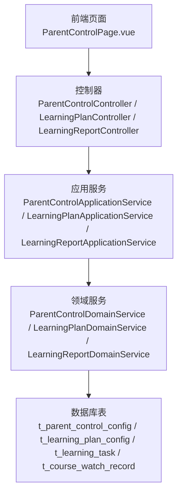
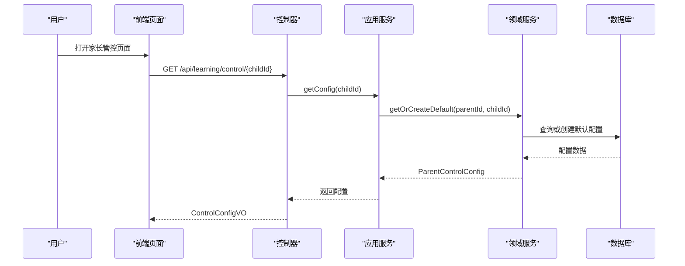
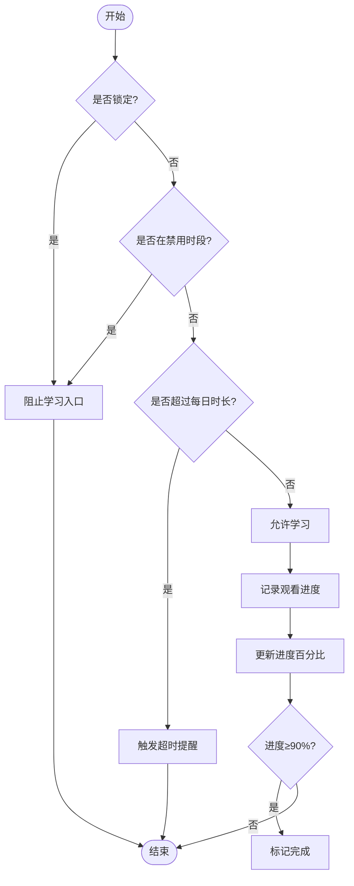
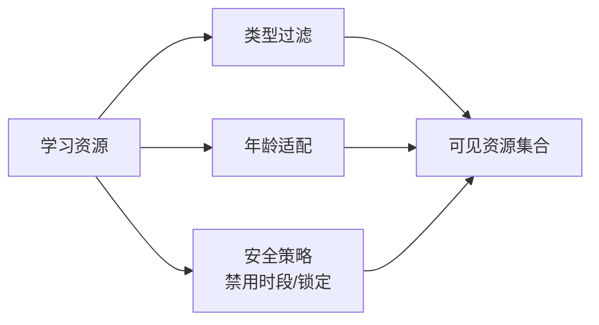
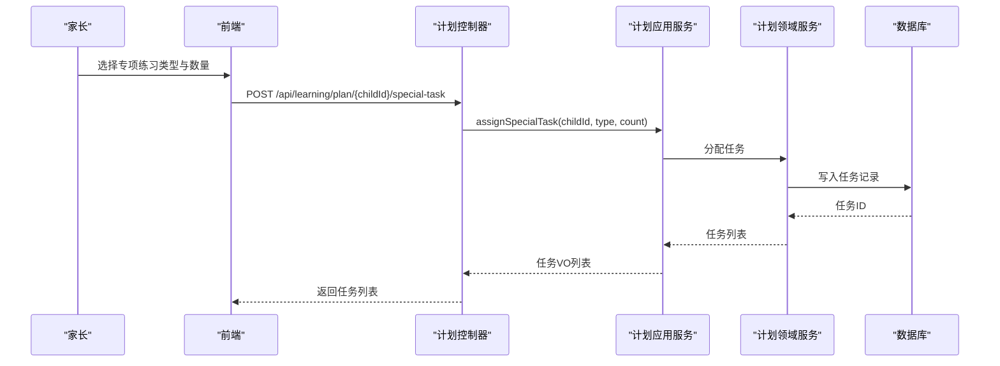
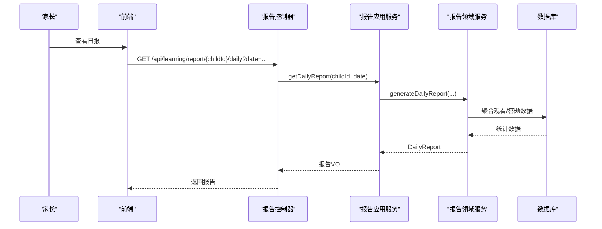
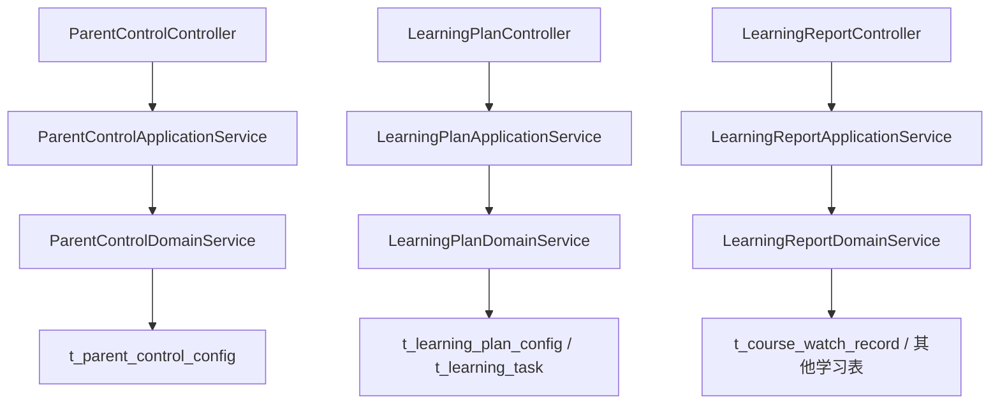

# 家长管控系统

<cite>
**本文引用的文件**
- [ParentControlConfig.java](file://wzoto-backend/wzoto-domain/src/main/java/com/wzoto/domain/entity/ParentControlConfig.java)
- [ParentControlApplicationService.java](file://wzoto-backend/wzoto-application/src/main/java/com/wzoto/application/service/ParentControlApplicationService.java)
- [ParentControlController.java](file://wzoto-backend/wzoto-interfaces/src/main/java/com/wzoto/interfaces/controller/ParentControlController.java)
- [t_parent_control_config.sql](file://wzoto-backend/sql/t_parent_control_config.sql)
- [LearningPlanConfig.java](file://wzoto-backend/wzoto-domain/src/main/java/com/wzoto/domain/entity/LearningPlanConfig.java)
- [LearningTask.java](file://wzoto-backend/wzoto-domain/src/main/java/com/wzoto/domain/entity/LearningTask.java)
- [LearningPlanApplicationService.java](file://wzoto-backend/wzoto-application/src/main/java/com/wzoto/application/service/LearningPlanApplicationService.java)
- [LearningPlanController.java](file://wzoto-backend/wzoto-interfaces/src/main/java/com/wzoto/interfaces/controller/LearningPlanController.java)
- [LearningReportApplicationService.java](file://wzoto-backend/wzoto-application/src/main/java/com/wzoto/application/service/LearningReportApplicationService.java)
- [LearningReportController.java](file://wzoto-backend/wzoto-interfaces/src/main/java/com/wzoto/interfaces/controller/LearningReportController.java)
- [AiReport.java](file://wzoto-backend/wzoto-domain/src/main/java/com/wzoto/domain/entity/AiReport.java)
- [CourseWatchRecord.java](file://wzoto-backend/wzoto-domain/src/main/java/com/wzoto/domain/entity/CourseWatchRecord.java)
- [ParentControlPage.vue](file://wzoto-frontend/src/pages/learning/ParentControlPage.vue)
- [learning.js](file://wzoto-frontend/src/api/learning.js)
</cite>

## 目录
1. [简介](#简介)
2. [项目结构](#项目结构)
3. [核心组件](#核心组件)
4. [架构总览](#架构总览)
5. [详细组件分析](#详细组件分析)
6. [依赖关系分析](#依赖关系分析)
7. [性能考虑](#性能考虑)
8. [故障排查指南](#故障排查指南)
9. [结论](#结论)
10. [附录：API接口文档](#附录api接口文档)

## 简介
本文件面向“wzoto家长管控系统”，围绕以下目标提供系统化、可落地的说明与指导：
- 时长控制：每日学习时长限制、使用时间统计、超时提醒机制
- 内容过滤：年龄适配、类型过滤、安全内容保障（结合资源与观看记录）
- 学习计划管理：个性化方案、任务分配、进度监控
- 学习报告生成：数据分析、成绩趋势、能力提升建议
- 家长监控面板：实时状态、历史数据、异常预警
- 配置管理界面：规则设置、阈值调整、通知配置
- 完整API接口：管控功能的调用方式
- 移动端适配与体验优化建议

## 项目结构
系统采用分层架构，前后端分离：
- 前端（Vue）：页面与交互，封装API调用，渲染家长管控、学习计划、报告等页面
- 应用层（Application Service）：编排领域服务，处理事务与权限校验
- 领域层（Domain）：实体、值对象、领域服务，承载业务规则
- 基础设施层（Infrastructure）：持久化、配置、拦截器、工具类
- 接口层（Interfaces）：REST控制器，暴露API

**图表来源**
- [ParentControlController.java:1-75](file://wzoto-backend/wzoto-interfaces/src/main/java/com/wzoto/interfaces/controller/ParentControlController.java#L1-L75)
- [LearningPlanController.java:1-78](file://wzoto-backend/wzoto-interfaces/src/main/java/com/wzoto/interfaces/controller/LearningPlanController.java#L1-L78)
- [LearningReportController.java:1-141](file://wzoto-backend/wzoto-interfaces/src/main/java/com/wzoto/interfaces/controller/LearningReportController.java#L1-L141)
- [ParentControlApplicationService.java:1-44](file://wzoto-backend/wzoto-application/src/main/java/com/wzoto/application/service/ParentControlApplicationService.java#L1-L44)
- [LearningPlanApplicationService.java:1-68](file://wzoto-backend/wzoto-application/src/main/java/com/wzoto/application/service/LearningPlanApplicationService.java#L1-L68)
- [LearningReportApplicationService.java:1-59](file://wzoto-backend/wzoto-application/src/main/java/com/wzoto/application/service/LearningReportApplicationService.java#L1-L59)
- [t_parent_control_config.sql:1-23](file://wzoto-backend/sql/t_parent_control_config.sql#L1-L23)

**章节来源**
- [ParentControlController.java:1-75](file://wzoto-backend/wzoto-interfaces/src/main/java/com/wzoto/interfaces/controller/ParentControlController.java#L1-L75)
- [LearningPlanController.java:1-78](file://wzoto-backend/wzoto-interfaces/src/main/java/com/wzoto/interfaces/controller/LearningPlanController.java#L1-L78)
- [LearningReportController.java:1-141](file://wzoto-backend/wzoto-interfaces/src/main/java/com/wzoto/interfaces/controller/LearningReportController.java#L1-L141)

## 核心组件
- 家长管控配置：定义每日可用时长、休息间隔、禁用时段、锁定、护眼模式、蓝光过滤、坐姿提醒等规则
- 学习计划配置：按学科权重拆分每日学习时长，支持专项练习开关
- 学习任务：任务生命周期管理（待完成→进行中→已完成/已跳过），记录耗时与时间戳
- 课程观看记录：记录观看时长、进度百分比、最后位置，达到阈值视为完成
- AI学情报告：支持预览与完整报告、付费解锁、会员免费报告

**章节来源**
- [ParentControlConfig.java:1-164](file://wzoto-backend/wzoto-domain/src/main/java/com/wzoto/domain/entity/ParentControlConfig.java#L1-L164)
- [LearningPlanConfig.java:1-155](file://wzoto-backend/wzoto-domain/src/main/java/com/wzoto/domain/entity/LearningPlanConfig.java#L1-L155)
- [LearningTask.java:1-139](file://wzoto-backend/wzoto-domain/src/main/java/com/wzoto/domain/entity/LearningTask.java#L1-L139)
- [CourseWatchRecord.java:1-120](file://wzoto-backend/wzoto-domain/src/main/java/com/wzoto/domain/entity/CourseWatchRecord.java#L1-L120)
- [AiReport.java:1-106](file://wzoto-backend/wzoto-domain/src/main/java/com/wzoto/domain/entity/AiReport.java#L1-L106)

## 架构总览
系统通过控制器接收请求，应用服务进行权限校验与事务管理，领域服务执行核心业务规则，最终通过仓储持久化。

**图表来源**
- [ParentControlController.java:24-28](file://wzoto-backend/wzoto-interfaces/src/main/java/com/wzoto/interfaces/controller/ParentControlController.java#L24-L28)
- [ParentControlApplicationService.java:21-24](file://wzoto-backend/wzoto-application/src/main/java/com/wzoto/application/service/ParentControlApplicationService.java#L21-L24)
- [t_parent_control_config.sql:4-22](file://wzoto-backend/sql/t_parent_control_config.sql#L4-L22)

## 详细组件分析

### 时长控制功能
- 每日学习时长限制：通过ParentControlConfig的dailyLimitMinutes约束；前端滑块设置并保存
- 使用时间统计：基于CourseWatchRecord累计watchDurationSeconds与progressPercent，达到90%视为完成
- 超时提醒机制：前端提供“时长超额提醒”开关与阈值配置，结合禁用时段实现夜间锁定

**图表来源**
- [ParentControlConfig.java:67-162](file://wzoto-backend/wzoto-domain/src/main/java/com/wzoto/domain/entity/ParentControlConfig.java#L67-L162)
- [CourseWatchRecord.java:58-118](file://wzoto-backend/wzoto-domain/src/main/java/com/wzoto/domain/entity/CourseWatchRecord.java#L58-L118)
- [ParentControlPage.vue:74-87](file://wzoto-frontend/src/pages/learning/ParentControlPage.vue#L74-L87)

**章节来源**
- [ParentControlConfig.java:1-164](file://wzoto-backend/wzoto-domain/src/main/java/com/wzoto/domain/entity/ParentControlConfig.java#L1-L164)
- [CourseWatchRecord.java:1-120](file://wzoto-backend/wzoto-domain/src/main/java/com/wzoto/domain/entity/CourseWatchRecord.java#L1-L120)
- [ParentControlPage.vue:1-347](file://wzoto-frontend/src/pages/learning/ParentControlPage.vue#L1-L347)

### 内容过滤系统
- 年龄适配内容：通过资源与知识点的关联（见SQL初始化脚本中的资源相关表），在资源列表与详情中按年龄/年级筛选
- 内容类型过滤：依据LearningResourceType与资源分类，在前端资源页进行过滤展示
- 安全内容保障：结合禁用时段与锁定机制，确保孩子在受限时间内无法访问学习内容

[本节为概念性说明，不直接映射具体代码文件]

### 学习计划管理
- 个性化学习方案：LearningPlanConfig按学科权重拆分每日时长，支持专项练习开关
- 任务分配：通过assignSpecialTask为子女分配专项任务，返回任务列表
- 进度监控：LearningTask记录状态流转与耗时，支持查询与完成操作

**图表来源**
- [LearningPlanController.java:53-58](file://wzoto-backend/wzoto-interfaces/src/main/java/com/wzoto/interfaces/controller/LearningPlanController.java#L53-L58)
- [LearningPlanApplicationService.java:50-54](file://wzoto-backend/wzoto-application/src/main/java/com/wzoto/application/service/LearningPlanApplicationService.java#L50-L54)

**章节来源**
- [LearningPlanConfig.java:1-155](file://wzoto-backend/wzoto-domain/src/main/java/com/wzoto/domain/entity/LearningPlanConfig.java#L1-L155)
- [LearningTask.java:1-139](file://wzoto-backend/wzoto-domain/src/main/java/com/wzoto/domain/entity/LearningTask.java#L1-L139)
- [LearningPlanController.java:1-78](file://wzoto-backend/wzoto-interfaces/src/main/java/com/wzoto/interfaces/controller/LearningPlanController.java#L1-L78)
- [LearningPlanApplicationService.java:1-68](file://wzoto-backend/wzoto-application/src/main/java/com/wzoto/application/service/LearningPlanApplicationService.java#L1-L68)

### 学习报告生成
- 学习数据分析：日/周/月报告聚合观看时长、完成率、正确率、掌握度
- 成绩趋势：通过Weekly/Monthly接口获取趋势数据
- 能力提升建议：AI报告支持预览与完整报告，付费解锁后提供详细建议

**图表来源**
- [LearningReportController.java:38-44](file://wzoto-backend/wzoto-interfaces/src/main/java/com/wzoto/interfaces/controller/LearningReportController.java#L38-L44)
- [LearningReportApplicationService.java:26-29](file://wzoto-backend/wzoto-application/src/main/java/com/wzoto/application/service/LearningReportApplicationService.java#L26-L29)

**章节来源**
- [LearningReportController.java:1-141](file://wzoto-backend/wzoto-interfaces/src/main/java/com/wzoto/interfaces/controller/LearningReportController.java#L1-L141)
- [LearningReportApplicationService.java:1-59](file://wzoto-backend/wzoto-application/src/main/java/com/wzoto/application/service/LearningReportApplicationService.java#L1-L59)
- [AiReport.java:1-106](file://wzoto-backend/wzoto-domain/src/main/java/com/wzoto/domain/entity/AiReport.java#L1-L106)

### 家长监控面板
- 实时学习状态：通过锁定状态、当前页面、最后登录时间等字段体现
- 历史数据查看：报告接口提供日/周/月维度数据
- 异常行为预警：结合禁用时段与超额提醒，前端提供可视化提示

**章节来源**
- [ParentControlConfig.java:20-60](file://wzoto-backend/wzoto-domain/src/main/java/com/wzoto/domain/entity/ParentControlConfig.java#L20-L60)
- [ParentControlPage.vue:14-87](file://wzoto-frontend/src/pages/learning/ParentControlPage.vue#L14-L87)

### 配置管理界面设计
- 规则设置：每日时长、休息间隔、禁用时段、锁定开关
- 阈值调整：超额提醒阈值滑块
- 通知配置：前端预留开关位，可与后端通知服务集成

**章节来源**
- [ParentControlPage.vue:25-87](file://wzoto-frontend/src/pages/learning/ParentControlPage.vue#L25-L87)
- [ParentControlController.java:30-57](file://wzoto-backend/wzoto-interfaces/src/main/java/com/wzoto/interfaces/controller/ParentControlController.java#L30-L57)

## 依赖关系分析
- 控制器依赖应用服务，应用服务依赖领域服务，领域服务依赖仓储与数据库
- 前端通过API模块调用后端接口，使用统一响应包装R<T>

**图表来源**
- [ParentControlController.java:1-75](file://wzoto-backend/wzoto-interfaces/src/main/java/com/wzoto/interfaces/controller/ParentControlController.java#L1-L75)
- [LearningPlanController.java:1-78](file://wzoto-backend/wzoto-interfaces/src/main/java/com/wzoto/interfaces/controller/LearningPlanController.java#L1-L78)
- [LearningReportController.java:1-141](file://wzoto-backend/wzoto-interfaces/src/main/java/com/wzoto/interfaces/controller/LearningReportController.java#L1-L141)
- [t_parent_control_config.sql:1-23](file://wzoto-backend/sql/t_parent_control_config.sql#L1-L23)

**章节来源**
- [ParentControlController.java:1-75](file://wzoto-backend/wzoto-interfaces/src/main/java/com/wzoto/interfaces/controller/ParentControlController.java#L1-L75)
- [LearningPlanController.java:1-78](file://wzoto-backend/wzoto-interfaces/src/main/java/com/wzoto/interfaces/controller/LearningPlanController.java#L1-L78)
- [LearningReportController.java:1-141](file://wzoto-backend/wzoto-interfaces/src/main/java/com/wzoto/interfaces/controller/LearningReportController.java#L1-L141)

## 性能考虑
- 报告聚合：对日/周/月报告进行分批查询与缓存，减少重复计算
- 观看记录：增量上报进度，避免频繁全量更新
- 配置读写：默认配置懒加载，首次访问时创建，降低冷启动开销
- 前端节流：滑块与输入防抖，减少无效请求

[本节为通用性能建议，不直接分析具体文件]

## 故障排查指南
- 配置保存失败：检查每日时长与休息间隔范围校验，确认参数合法
- 任务状态异常：核对任务状态流转，避免重复完成或跳过
- 观看进度不更新：检查进度百分比范围与最后位置合法性
- 报告数据缺失：确认观看记录与答题记录是否存在，检查日期范围

**章节来源**
- [ParentControlConfig.java:86-101](file://wzoto-backend/wzoto-domain/src/main/java/com/wzoto/domain/entity/ParentControlConfig.java#L86-L101)
- [LearningTask.java:92-123](file://wzoto-backend/wzoto-domain/src/main/java/com/wzoto/domain/entity/LearningTask.java#L92-L123)
- [CourseWatchRecord.java:79-102](file://wzoto-backend/wzoto-domain/src/main/java/com/wzoto/domain/entity/CourseWatchRecord.java#L79-L102)

## 结论
家长管控系统以清晰的领域模型与分层架构为基础，实现了时长控制、学习计划、报告生成与监控面板等核心能力。通过前端可视化配置与后端严格校验，保障了规则的可控性与安全性。后续可进一步扩展通知渠道、内容过滤策略与AI建议深度，提升用户体验与管理效率。

## 附录：API接口文档

### 家长管控
- 获取管控配置
  - 方法：GET
  - 路径：/api/learning/control/{childId}
  - 说明：返回指定子女的管控配置
- 保存管控配置
  - 方法：POST
  - 路径：/api/learning/control/{childId}
  - 说明：提交管控规则（每日时长、休息间隔、禁用时段、护眼模式等）
- 一键锁定
  - 方法：POST
  - 路径：/api/learning/control/{childId}/lock
  - 说明：锁定学习入口
- 解除锁定
  - 方法：POST
  - 路径：/api/learning/control/{childId}/unlock
  - 说明：解除学习入口锁定

**章节来源**
- [ParentControlController.java:24-57](file://wzoto-backend/wzoto-interfaces/src/main/java/com/wzoto/interfaces/controller/ParentControlController.java#L24-L57)
- [learning.js:79-93](file://wzoto-frontend/src/api/learning.js#L79-L93)

### 学习计划
- 获取计划配置
  - 方法：GET
  - 路径：/api/learning/plan/{childId}
  - 说明：返回子女的学习计划配置（学科权重、专项开关）
- 保存计划配置
  - 方法：POST
  - 路径：/api/learning/plan/{childId}
  - 说明：更新每日时长与学科权重
- 分配专项任务
  - 方法：POST
  - 路径：/api/learning/plan/{childId}/special-task
  - 说明：按类型与数量分配专项任务

**章节来源**
- [LearningPlanController.java:31-58](file://wzoto-backend/wzoto-interfaces/src/main/java/com/wzoto/interfaces/controller/LearningPlanController.java#L31-L58)
- [learning.js:5-15](file://wzoto-frontend/src/api/learning.js#L5-L15)

### 学习任务
- 列出任务
  - 方法：GET
  - 路径：/api/learning/tasks/{childId}?date=YYYY-MM-DD
  - 说明：按日期或全部列出任务
- 完成任务
  - 方法：POST
  - 路径：/api/learning/task/{taskId}/complete
  - 说明：将任务标记为完成

**章节来源**
- [learning.js:19-26](file://wzoto-frontend/src/api/learning.js#L19-L26)

### 学习报告
- 概览
  - 方法：GET
  - 路径：/api/learning/report/{childId}
  - 说明：返回当日报告概览
- 日报
  - 方法：GET
  - 路径：/api/learning/report/{childId}/daily?date=YYYY-MM-DD
  - 说明：指定日期日报
- 周报
  - 方法：GET
  - 路径：/api/learning/report/{childId}/weekly?weekStart=YYYY-MM-DD
  - 说明：指定起始周的周报
- 月报
  - 方法：GET
  - 路径：/api/learning/report/{childId}/monthly?year=&month=
  - 说明：指定年月月报
- 薄弱点排行
  - 方法：GET
  - 路径：/api/learning/report/{childId}/weak-points?subject=&topN=
  - 说明：按学科与TopN返回薄弱知识点
- 错题导出
  - 方法：GET
  - 路径：/api/learning/report/{childId}/wrong-questions/export?subject=
  - 说明：导出错题清单

**章节来源**
- [LearningReportController.java:31-82](file://wzoto-backend/wzoto-interfaces/src/main/java/com/wzoto/interfaces/controller/LearningReportController.java#L31-L82)
- [learning.js:30-61](file://wzoto-frontend/src/api/learning.js#L30-L61)

### 播放进度
- 上报进度
  - 方法：POST
  - 路径：/api/learning/play-progress
  - 说明：上报观看时长与最后位置
- 查询进度
  - 方法：GET
  - 路径：/api/learning/play-progress/{resourceId}?childId=
  - 说明：查询指定资源的观看进度

**章节来源**
- [learning.js:111-117](file://wzoto-frontend/src/api/learning.js#L111-L117)

### 移动端适配与用户体验优化建议
- 响应式布局：使用弹性布局与断点适配不同屏幕尺寸
- 触控友好：增大按钮与滑块热区，提供即时反馈
- 离线缓存：关键配置与报告本地缓存，弱网下仍可浏览
- 无障碍：提供高对比度与字体缩放选项
- 性能优化：图片懒加载、接口请求合并与重试策略

[本节为通用体验建议，不直接分析具体文件]