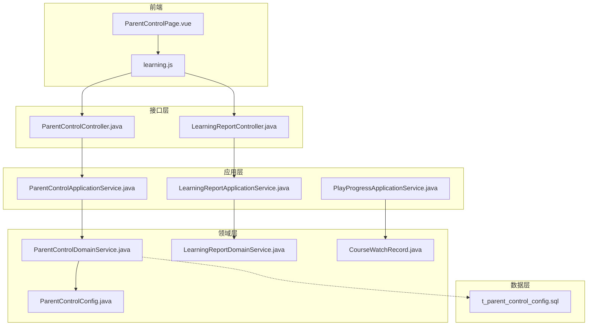
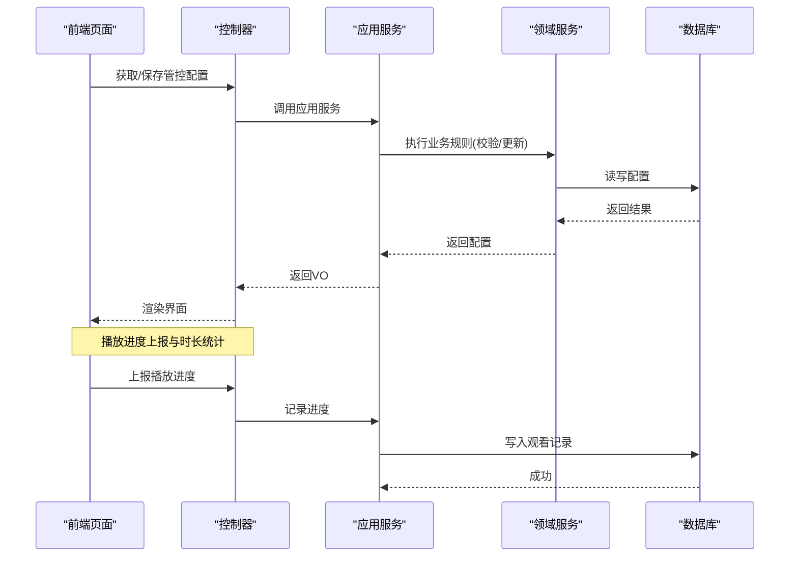
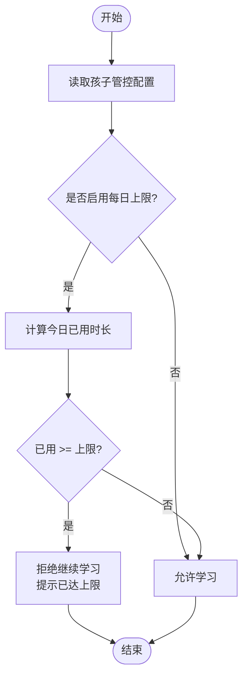
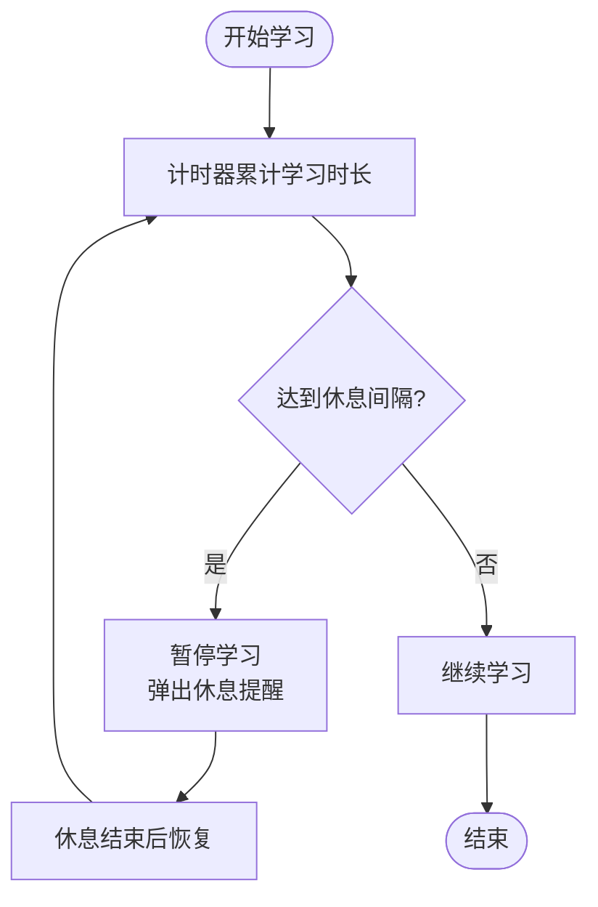
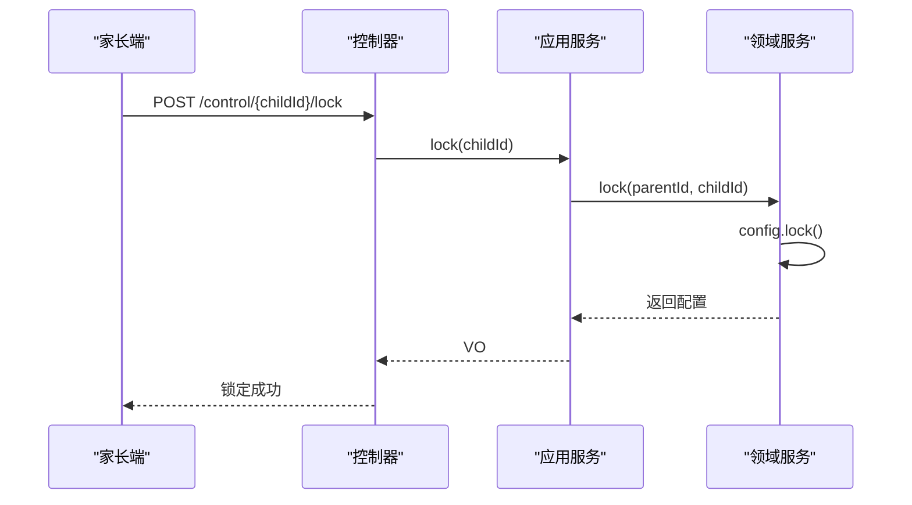
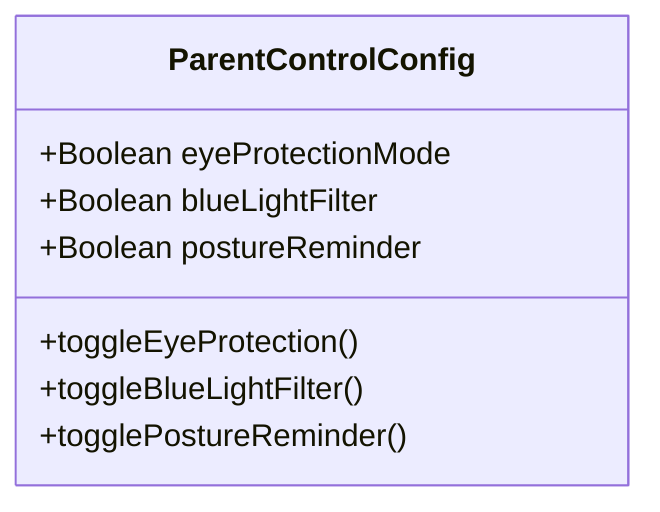
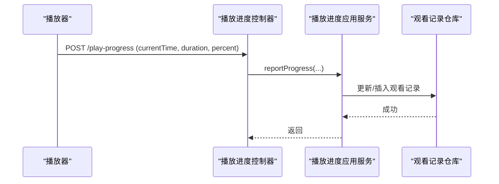
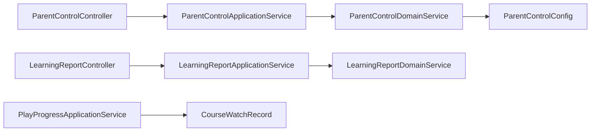

# 时长控制功能

<cite>
**本文引用的文件**
- [ParentControlConfig.java](file://wzoto-backend/wzoto-domain/src/main/java/com/wzoto/domain/entity/ParentControlConfig.java)
- [ParentControlDomainService.java](file://wzoto-backend/wzoto-domain/src/main/java/com/wzoto/domain/service/ParentControlDomainService.java)
- [ParentControlApplicationService.java](file://wzoto-backend/wzoto-application/src/main/java/com/wzoto/application/service/ParentControlApplicationService.java)
- [ParentControlController.java](file://wzoto-backend/wzoto-interfaces/src/main/java/com/wzoto/interfaces/controller/ParentControlController.java)
- [ControlConfigDTO.java](file://wzoto-backend/wzoto-interfaces/src/main/java/com/wzoto/interfaces/dto/learning/ControlConfigDTO.java)
- [ControlConfigVO.java](file://wzoto-backend/wzoto-interfaces/src/main/java/com/wzoto/interfaces/vo/learning/ControlConfigVO.java)
- [t_parent_control_config.sql](file://wzoto-backend/sql/t_parent_control_config.sql)
- [PlayProgressApplicationService.java](file://wzoto-backend/wzoto-application/src/main/java/com/wzoto/application/service/PlayProgressApplicationService.java)
- [CourseWatchRecord.java](file://wzoto-backend/wzoto-domain/src/main/java/com/wzoto/domain/entity/CourseWatchRecord.java)
- [LearningReportDomainService.java](file://wzoto-backend/wzoto-domain/src/main/java/com/wzoto/domain/service/LearningReportDomainService.java)
- [LearningReportApplicationService.java](file://wzoto-backend/wzoto-application/src/main/java/com/wzoto/application/service/LearningReportApplicationService.java)
- [LearningReportController.java](file://wzoto-backend/wzoto-interfaces/src/main/java/com/wzoto/interfaces/controller/LearningReportController.java)
- [ParentControlPage.vue](file://wzoto-frontend/src/pages/learning/ParentControlPage.vue)
- [learning.js](file://wzoto-frontend/src/api/learning.js)
</cite>

## 目录
1. [简介](#简介)
2. [项目结构](#项目结构)
3. [核心组件](#核心组件)
4. [架构总览](#架构总览)
5. [详细组件分析](#详细组件分析)
6. [依赖关系分析](#依赖关系分析)
7. [性能考虑](#性能考虑)
8. [故障排查指南](#故障排查指南)
9. [结论](#结论)
10. [附录：API接口文档与前端界面指南](#附录api接口文档与前端界面指南)

## 简介
本文件聚焦家长管控系统中的“时长控制”能力，覆盖以下方面：
- 每日学习时长限制机制：配置上限、时间统计逻辑、超时处理策略
- 休息时间管理：休息间隔设置、强制休息提醒、学习节奏优化
- 锁定解锁功能：远程锁定设备、紧急锁定机制、自动解锁条件
- 护眼模式：蓝光过滤、屏幕亮度调节、用眼健康提醒
- 完整API接口说明：调用方式与参数
- 前端界面设计指南与用户体验优化建议

## 项目结构
围绕时长控制的相关代码分布在后端三层（领域、应用、接口）以及前端页面和API封装中：
- 领域层：定义管控配置实体与业务规则（时长、休息、禁用时段、锁定、护眼等）
- 应用层：编排领域服务、事务边界、权限校验
- 接口层：暴露REST API，负责入参出参转换
- 数据层：数据库表结构与播放进度记录
- 前端：家长管控页面、时长配置交互、学习报告展示

图表来源
- [ParentControlController.java:1-75](file://wzoto-backend/wzoto-interfaces/src/main/java/com/wzoto/interfaces/controller/ParentControlController.java#L1-L75)
- [ParentControlApplicationService.java:1-44](file://wzoto-backend/wzoto-application/src/main/java/com/wzoto/application/service/ParentControlApplicationService.java#L1-L44)
- [ParentControlDomainService.java:1-128](file://wzoto-backend/wzoto-domain/src/main/java/com/wzoto/domain/service/ParentControlDomainService.java#L1-L128)
- [ParentControlConfig.java:1-164](file://wzoto-backend/wzoto-domain/src/main/java/com/wzoto/domain/entity/ParentControlConfig.java#L1-L164)
- [PlayProgressApplicationService.java:1-75](file://wzoto-backend/wzoto-application/src/main/java/com/wzoto/application/service/PlayProgressApplicationService.java#L1-L75)
- [CourseWatchRecord.java:54-93](file://wzoto-backend/wzoto-domain/src/main/java/com/wzoto/domain/entity/CourseWatchRecord.java#L54-L93)
- [LearningReportDomainService.java:62-81](file://wzoto-backend/wzoto-domain/src/main/java/com/wzoto/domain/service/LearningReportDomainService.java#L62-L81)
- [LearningReportController.java:126-140](file://wzoto-backend/wzoto-interfaces/src/main/java/com/wzoto/interfaces/controller/LearningReportController.java#L126-L140)
- [t_parent_control_config.sql:1-22](file://wzoto-backend/sql/t_parent_control_config.sql#L1-L22)

章节来源
- [ParentControlController.java:1-75](file://wzoto-backend/wzoto-interfaces/src/main/java/com/wzoto/interfaces/controller/ParentControlController.java#L1-L75)
- [ParentControlApplicationService.java:1-44](file://wzoto-backend/wzoto-application/src/main/java/com/wzoto/application/service/ParentControlApplicationService.java#L1-L44)
- [ParentControlDomainService.java:1-128](file://wzoto-backend/wzoto-domain/src/main/java/com/wzoto/domain/service/ParentControlDomainService.java#L1-L128)
- [ParentControlConfig.java:1-164](file://wzoto-backend/wzoto-domain/src/main/java/com/wzoto/domain/entity/ParentControlConfig.java#L1-L164)
- [PlayProgressApplicationService.java:1-75](file://wzoto-backend/wzoto-application/src/main/java/com/wzoto/application/service/PlayProgressApplicationService.java#L1-L75)
- [CourseWatchRecord.java:54-93](file://wzoto-backend/wzoto-domain/src/main/java/com/wzoto/domain/entity/CourseWatchRecord.java#L54-L93)
- [LearningReportDomainService.java:62-81](file://wzoto-backend/wzoto-domain/src/main/java/com/wzoto/domain/service/LearningReportDomainService.java#L62-L81)
- [LearningReportController.java:126-140](file://wzoto-backend/wzoto-interfaces/src/main/java/com/wzoto/interfaces/controller/LearningReportController.java#L126-L140)
- [t_parent_control_config.sql:1-22](file://wzoto-backend/sql/t_parent_control_config.sql#L1-L22)

## 核心组件
- 管控配置实体：承载每日可用时长、单次休息间隔、禁用时段、锁定状态、护眼模式、蓝光过滤、坐姿提醒等字段，并提供更新与切换方法。
- 领域服务：提供获取或创建默认配置、保存配置、一键锁定/解锁、切换护眼模式、判断是否在禁用时段、判断是否超出每日可用时长等能力。
- 应用服务：在事务内调用领域服务，完成权限校验与操作编排。
- 控制器：对外暴露获取配置、保存配置、锁定、解锁等接口。
- 播放进度服务：上报播放进度，累计观看时长，支撑时长统计。
- 学情报告服务：汇总观看时长、完成率等指标，用于报表展示。

章节来源
- [ParentControlConfig.java:1-164](file://wzoto-backend/wzoto-domain/src/main/java/com/wzoto/domain/entity/ParentControlConfig.java#L1-L164)
- [ParentControlDomainService.java:1-128](file://wzoto-backend/wzoto-domain/src/main/java/com/wzoto/domain/service/ParentControlDomainService.java#L1-L128)
- [ParentControlApplicationService.java:1-44](file://wzoto-backend/wzoto-application/src/main/java/com/wzoto/application/service/ParentControlApplicationService.java#L1-L44)
- [ParentControlController.java:1-75](file://wzoto-backend/wzoto-interfaces/src/main/java/com/wzoto/interfaces/controller/ParentControlController.java#L1-L75)
- [PlayProgressApplicationService.java:1-75](file://wzoto-backend/wzoto-application/src/main/java/com/wzoto/application/service/PlayProgressApplicationService.java#L1-L75)
- [LearningReportDomainService.java:62-81](file://wzoto-backend/wzoto-domain/src/main/java/com/wzoto/domain/service/LearningReportDomainService.java#L62-L81)

## 架构总览
时长控制贯穿“配置—执行—统计—报表”的闭环：
- 配置：家长在前端调整每日时长、休息间隔、禁用时段、锁定与护眼模式，保存到后端。
- 执行：在学习过程中，系统根据当前时间与配置判断是否允许学习；若达到每日上限则提示并限制继续学习。
- 统计：播放进度上报累计观看时长，结合答题记录形成学习报告。
- 报表：向家长展示学习时长、正确率、薄弱点等。

图表来源
- [ParentControlController.java:24-57](file://wzoto-backend/wzoto-interfaces/src/main/java/com/wzoto/interfaces/controller/ParentControlController.java#L24-L57)
- [ParentControlApplicationService.java:21-42](file://wzoto-backend/wzoto-application/src/main/java/com/wzoto/application/service/ParentControlApplicationService.java#L21-L42)
- [ParentControlDomainService.java:27-80](file://wzoto-backend/wzoto-domain/src/main/java/com/wzoto/domain/service/ParentControlDomainService.java#L27-L80)
- [PlayProgressApplicationService.java:32-66](file://wzoto-backend/wzoto-application/src/main/java/com/wzoto/application/service/PlayProgressApplicationService.java#L32-L66)

## 详细组件分析

### 每日学习时长限制机制
- 配置项：每日最大学习分钟数（0-240），由前端滑块设置，后端进行范围校验。
- 时间统计：通过播放进度上报累计观看时长，结合答题记录生成报告中的watchDurationSeconds。
- 超时处理：当已用时长达到或超过每日上限时，判定为超出限制，应阻止继续学习并给出提示。

图表来源
- [ParentControlDomainService.java:113-119](file://wzoto-backend/wzoto-domain/src/main/java/com/wzoto/domain/service/ParentControlDomainService.java#L113-L119)
- [LearningReportDomainService.java:72-77](file://wzoto-backend/wzoto-domain/src/main/java/com/wzoto/domain/service/LearningReportDomainService.java#L72-L77)
- [PlayProgressApplicationService.java:32-66](file://wzoto-backend/wzoto-application/src/main/java/com/wzoto/application/service/PlayProgressApplicationService.java#L32-L66)

章节来源
- [ParentControlConfig.java:86-91](file://wzoto-backend/wzoto-domain/src/main/java/com/wzoto/domain/entity/ParentControlConfig.java#L86-L91)
- [ParentControlDomainService.java:113-119](file://wzoto-backend/wzoto-domain/src/main/java/com/wzoto/domain/service/ParentControlDomainService.java#L113-L119)
- [PlayProgressApplicationService.java:32-66](file://wzoto-backend/wzoto-application/src/main/java/com/wzoto/application/service/PlayProgressApplicationService.java#L32-L66)
- [LearningReportDomainService.java:72-77](file://wzoto-backend/wzoto-domain/src/main/java/com/wzoto/domain/service/LearningReportDomainService.java#L72-L77)

### 休息时间管理
- 休息间隔：支持设置单次学习后的休息间隔（5-120分钟），前端以滑块呈现。
- 强制休息提醒：当学习时长达到休息间隔阈值时，应在前端弹出提醒，引导休息。
- 学习节奏优化：可结合禁用时段（如夜间）与休息间隔，形成更合理的作息安排。

图表来源
- [ParentControlConfig.java:96-101](file://wzoto-backend/wzoto-domain/src/main/java/com/wzoto/domain/entity/ParentControlConfig.java#L96-L101)
- [ParentControlPage.vue:31-34](file://wzoto-frontend/src/pages/learning/ParentControlPage.vue#L31-L34)

章节来源
- [ParentControlConfig.java:96-101](file://wzoto-backend/wzoto-domain/src/main/java/com/wzoto/domain/entity/ParentControlConfig.java#L96-L101)
- [ParentControlPage.vue:31-34](file://wzoto-frontend/src/pages/learning/ParentControlPage.vue#L31-L34)

### 锁定解锁功能
- 远程锁定：家长可在任意位置一键锁定孩子的学习入口，防止继续使用。
- 紧急锁定：通过锁定开关快速阻断学习行为，适用于突发情况。
- 自动解锁：可通过解锁接口解除锁定；也可结合禁用时段实现按时间段自动限制。

图表来源
- [ParentControlController.java:45-50](file://wzoto-backend/wzoto-interfaces/src/main/java/com/wzoto/interfaces/controller/ParentControlController.java#L45-L50)
- [ParentControlApplicationService.java:32-36](file://wzoto-backend/wzoto-application/src/main/java/com/wzoto/application/service/ParentControlApplicationService.java#L32-L36)
- [ParentControlDomainService.java:65-70](file://wzoto-backend/wzoto-domain/src/main/java/com/wzoto/domain/service/ParentControlDomainService.java#L65-L70)
- [ParentControlConfig.java:118-120](file://wzoto-backend/wzoto-domain/src/main/java/com/wzoto/domain/entity/ParentControlConfig.java#L118-L120)

章节来源
- [ParentControlController.java:45-57](file://wzoto-backend/wzoto-interfaces/src/main/java/com/wzoto/interfaces/controller/ParentControlController.java#L45-L57)
- [ParentControlApplicationService.java:32-42](file://wzoto-backend/wzoto-application/src/main/java/com/wzoto/application/service/ParentControlApplicationService.java#L32-L42)
- [ParentControlDomainService.java:65-80](file://wzoto-backend/wzoto-domain/src/main/java/com/wzoto/domain/service/ParentControlDomainService.java#L65-L80)
- [ParentControlConfig.java:118-134](file://wzoto-backend/wzoto-domain/src/main/java/com/wzoto/domain/entity/ParentControlConfig.java#L118-L134)

### 护眼模式
- 蓝光过滤：可单独开启蓝光过滤，降低对眼睛的刺激。
- 屏幕亮度调节：建议在客户端层面依据护眼模式动态调低亮度。
- 用眼健康提醒：结合坐姿提醒与休息间隔，定时提醒孩子保持正确姿势与适度休息。

图表来源
- [ParentControlConfig.java:44-51](file://wzoto-backend/wzoto-domain/src/main/java/com/wzoto/domain/entity/ParentControlConfig.java#L44-L51)
- [ParentControlConfig.java:139-155](file://wzoto-backend/wzoto-domain/src/main/java/com/wzoto/domain/entity/ParentControlConfig.java#L139-L155)

章节来源
- [ParentControlConfig.java:44-51](file://wzoto-backend/wzoto-domain/src/main/java/com/wzoto/domain/entity/ParentControlConfig.java#L44-L51)
- [ParentControlConfig.java:139-155](file://wzoto-backend/wzoto-domain/src/main/java/com/wzoto/domain/entity/ParentControlConfig.java#L139-L155)

### 时间统计与报表
- 播放进度上报：每5秒上报一次，累计观看时长与进度百分比。
- 报告聚合：将观看时长、完成视频数、正确率等汇总到报告中，供家长查看。

图表来源
- [PlayProgressApplicationService.java:32-66](file://wzoto-backend/wzoto-application/src/main/java/com/wzoto/application/service/PlayProgressApplicationService.java#L32-L66)
- [CourseWatchRecord.java:79-89](file://wzoto-backend/wzoto-domain/src/main/java/com/wzoto/domain/entity/CourseWatchRecord.java#L79-L89)

章节来源
- [PlayProgressApplicationService.java:32-66](file://wzoto-backend/wzoto-application/src/main/java/com/wzoto/application/service/PlayProgressApplicationService.java#L32-L66)
- [CourseWatchRecord.java:79-89](file://wzoto-backend/wzoto-domain/src/main/java/com/wzoto/domain/entity/CourseWatchRecord.java#L79-L89)
- [LearningReportDomainService.java:72-77](file://wzoto-backend/wzoto-domain/src/main/java/com/wzoto/domain/service/LearningReportDomainService.java#L72-L77)
- [LearningReportController.java:126-140](file://wzoto-backend/wzoto-interfaces/src/main/java/com/wzoto/interfaces/controller/LearningReportController.java#L126-L140)

## 依赖关系分析
- 控制器依赖应用服务，应用服务依赖领域服务，领域服务依赖仓储与实体。
- 播放进度与学习报告共享观看记录，形成数据一致性。
- 前端通过统一的API封装调用后端接口，保证前后端契约一致。

图表来源
- [ParentControlController.java:1-75](file://wzoto-backend/wzoto-interfaces/src/main/java/com/wzoto/interfaces/controller/ParentControlController.java#L1-L75)
- [ParentControlApplicationService.java:1-44](file://wzoto-backend/wzoto-application/src/main/java/com/wzoto/application/service/ParentControlApplicationService.java#L1-L44)
- [ParentControlDomainService.java:1-128](file://wzoto-backend/wzoto-domain/src/main/java/com/wzoto/domain/service/ParentControlDomainService.java#L1-L128)
- [LearningReportController.java:126-140](file://wzoto-backend/wzoto-interfaces/src/main/java/com/wzoto/interfaces/controller/LearningReportController.java#L126-L140)
- [LearningReportApplicationService.java:1-59](file://wzoto-backend/wzoto-application/src/main/java/com/wzoto/application/service/LearningReportApplicationService.java#L1-L59)
- [LearningReportDomainService.java:62-81](file://wzoto-backend/wzoto-domain/src/main/java/com/wzoto/domain/service/LearningReportDomainService.java#L62-L81)
- [PlayProgressApplicationService.java:1-75](file://wzoto-backend/wzoto-application/src/main/java/com/wzoto/application/service/PlayProgressApplicationService.java#L1-L75)
- [CourseWatchRecord.java:54-93](file://wzoto-backend/wzoto-domain/src/main/java/com/wzoto/domain/entity/CourseWatchRecord.java#L54-L93)

章节来源
- [ParentControlController.java:1-75](file://wzoto-backend/wzoto-interfaces/src/main/java/com/wzoto/interfaces/controller/ParentControlController.java#L1-L75)
- [ParentControlApplicationService.java:1-44](file://wzoto-backend/wzoto-application/src/main/java/com/wzoto/application/service/ParentControlApplicationService.java#L1-L44)
- [ParentControlDomainService.java:1-128](file://wzoto-backend/wzoto-domain/src/main/java/com/wzoto/domain/service/ParentControlDomainService.java#L1-L128)
- [LearningReportController.java:126-140](file://wzoto-backend/wzoto-interfaces/src/main/java/com/wzoto/interfaces/controller/LearningReportController.java#L126-L140)
- [LearningReportApplicationService.java:1-59](file://wzoto-backend/wzoto-application/src/main/java/com/wzoto/application/service/LearningReportApplicationService.java#L1-L59)
- [LearningReportDomainService.java:62-81](file://wzoto-backend/wzoto-domain/src/main/java/com/wzoto/domain/service/LearningReportDomainService.java#L62-L81)
- [PlayProgressApplicationService.java:1-75](file://wzoto-backend/wzoto-application/src/main/java/com/wzoto/application/service/PlayProgressApplicationService.java#L1-L75)
- [CourseWatchRecord.java:54-93](file://wzoto-backend/wzoto-domain/src/main/java/com/wzoto/domain/entity/CourseWatchRecord.java#L54-L93)

## 性能考虑
- 播放进度上报频率：建议每5秒上报一次，避免频繁写库造成压力。
- 聚合查询优化：学习报告按日/周/月聚合时，注意索引与分批查询，减少全表扫描。
- 配置读写分离：配置变更不频繁，可考虑缓存热点配置以降低读放大。
- 前端节流：滑块与开关变更做防抖处理，减少无效请求。

[本节为通用指导，无需特定文件引用]

## 故障排查指南
- 无法加载配置：检查子ID是否正确、用户权限是否匹配。
- 锁定后仍可使用：确认前端是否根据锁定状态屏蔽入口，后端是否返回最新配置。
- 时长未统计：核对播放进度上报是否触发、观看记录是否写入成功。
- 护眼模式无效：检查前端是否根据配置切换UI与行为（如亮度、提醒）。

章节来源
- [ParentControlController.java:24-57](file://wzoto-backend/wzoto-interfaces/src/main/java/com/wzoto/interfaces/controller/ParentControlController.java#L24-L57)
- [ParentControlDomainService.java:27-80](file://wzoto-backend/wzoto-domain/src/main/java/com/wzoto/domain/service/ParentControlDomainService.java#L27-L80)
- [PlayProgressApplicationService.java:32-66](file://wzoto-backend/wzoto-application/src/main/java/com/wzoto/application/service/PlayProgressApplicationService.java#L32-L66)

## 结论
时长控制通过“配置—执行—统计—报表”的闭环，实现了科学的学习时长管理与护眼健康保护。系统具备灵活的配置项、可靠的统计能力与直观的前端体验，能够有效帮助家长引导孩子养成良好学习习惯。

[本节为总结性内容，无需特定文件引用]

## 附录：API接口文档与前端界面指南

### API接口文档（时长控制）
- 获取管控配置
  - 路径：GET /api/learning/control/{childId}
  - 说明：返回指定子女的管控配置（包含每日时长、休息间隔、禁用时段、锁定状态、护眼模式等）
  - 参考：[ParentControlController.java:24-28](file://wzoto-backend/wzoto-interfaces/src/main/java/com/wzoto/interfaces/controller/ParentControlController.java#L24-L28)

- 保存管控配置
  - 路径：POST /api/learning/control/{childId}
  - 请求体：ControlConfigDTO（dailyLimitMinutes、restIntervalMinutes、forbiddenStartTime、forbiddenEndTime、eyeProtectionMode、blueLightFilter、postureReminder）
  - 说明：更新子女管控配置，包含时长上限、休息间隔、禁用时段与护眼相关开关
  - 参考：[ParentControlController.java:30-43](file://wzoto-backend/wzoto-interfaces/src/main/java/com/wzoto/interfaces/controller/ParentControlController.java#L30-L43)、[ControlConfigDTO.java:1-21](file://wzoto-backend/wzoto-interfaces/src/main/java/com/wzoto/interfaces/dto/learning/ControlConfigDTO.java#L1-L21)

- 锁定
  - 路径：POST /api/learning/control/{childId}/lock
  - 说明：一键锁定子女学习入口
  - 参考：[ParentControlController.java:45-50](file://wzoto-backend/wzoto-interfaces/src/main/java/com/wzoto/interfaces/controller/ParentControlController.java#L45-L50)

- 解锁
  - 路径：POST /api/learning/control/{childId}/unlock
  - 说明：解除锁定
  - 参考：[ParentControlController.java:52-57](file://wzoto-backend/wzoto-interfaces/src/main/java/com/wzoto/interfaces/controller/ParentControlController.java#L52-L57)

- 播放进度上报
  - 路径：POST /api/learning/play-progress
  - 请求体：{ childId, resourceId, currentTime, duration, percent, eventType }
  - 说明：上报播放进度，累计观看时长与进度
  - 参考：[PlayProgressApplicationService.java:32-66](file://wzoto-backend/wzoto-application/src/main/java/com/wzoto/application/service/PlayProgressApplicationService.java#L32-L66)

- 学习报告
  - 路径：GET /api/learning/report/{childId}、/daily、/weekly、/monthly
  - 说明：获取日/周/月学习报告，包含观看时长、正确率、完成视频数等
  - 参考：[LearningReportController.java:126-140](file://wzoto-backend/wzoto-interfaces/src/main/java/com/wzoto/interfaces/controller/LearningReportController.java#L126-L140)、[LearningReportApplicationService.java:26-49](file://wzoto-backend/wzoto-application/src/main/java/com/wzoto/application/service/LearningReportApplicationService.java#L26-L49)

章节来源
- [ParentControlController.java:24-57](file://wzoto-backend/wzoto-interfaces/src/main/java/com/wzoto/interfaces/controller/ParentControlController.java#L24-L57)
- [ControlConfigDTO.java:1-21](file://wzoto-backend/wzoto-interfaces/src/main/java/com/wzoto/interfaces/dto/learning/ControlConfigDTO.java#L1-L21)
- [PlayProgressApplicationService.java:32-66](file://wzoto-backend/wzoto-application/src/main/java/com/wzoto/application/service/PlayProgressApplicationService.java#L32-L66)
- [LearningReportController.java:126-140](file://wzoto-backend/wzoto-interfaces/src/main/java/com/wzoto/interfaces/controller/LearningReportController.java#L126-L140)
- [LearningReportApplicationService.java:26-49](file://wzoto-backend/wzoto-application/src/main/java/com/wzoto/application/service/LearningReportApplicationService.java#L26-L49)

### 前端界面设计指南与用户体验优化建议
- 时长配置
  - 使用滑块设置每日时长与休息间隔，实时显示数值，便于家长直观调整。
  - 禁用时段采用时间选择器，支持跨夜区间设置。
  - 参考：[ParentControlPage.vue:25-61](file://wzoto-frontend/src/pages/learning/ParentControlPage.vue#L25-L61)

- 锁定状态可视化
  - 顶部横幅显示锁定状态与一键锁定按钮，颜色随状态变化，提升感知度。
  - 参考：[ParentControlPage.vue:14-23](file://wzoto-frontend/src/pages/learning/ParentControlPage.vue#L14-L23)

- 护眼与健康提醒
  - 护眼模式、蓝光过滤、坐姿提醒以开关形式呈现，便于快速切换。
  - 结合休息间隔与禁用时段，形成健康学习节奏。
  - 参考：[ParentControlPage.vue:44-59](file://wzoto-frontend/src/pages/learning/ParentControlPage.vue#L44-L59)

- 学习报告展示
  - 通过图表与统计卡片展示观看时长、正确率、薄弱知识点，帮助家长了解学习效果。
  - 参考：[LearningReportPage.vue:299-342](file://wzoto-frontend/src/pages/learning/LearningReportPage.vue#L299-L342)

- 前端API封装
  - 统一封装管控配置与播放进度的API调用，简化页面逻辑。
  - 参考：[learning.js:77-117](file://wzoto-frontend/src/api/learning.js#L77-L117)

章节来源
- [ParentControlPage.vue:14-61](file://wzoto-frontend/src/pages/learning/ParentControlPage.vue#L14-L61)
- [ParentControlPage.vue:232-347](file://wzoto-frontend/src/pages/learning/ParentControlPage.vue#L232-L347)
- [LearningReportPage.vue:299-342](file://wzoto-frontend/src/pages/learning/LearningReportPage.vue#L299-L342)
- [learning.js:77-117](file://wzoto-frontend/src/api/learning.js#L77-L117)